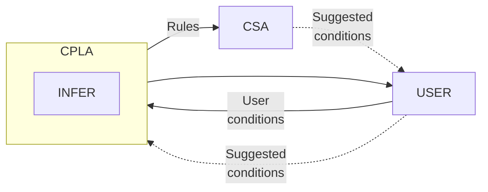
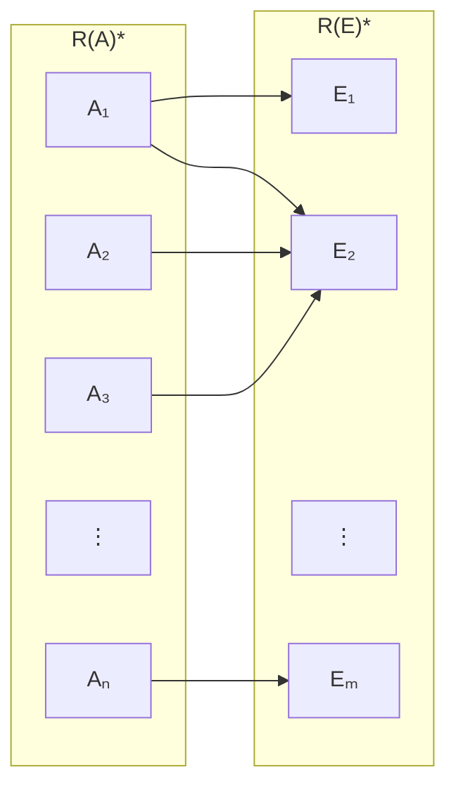
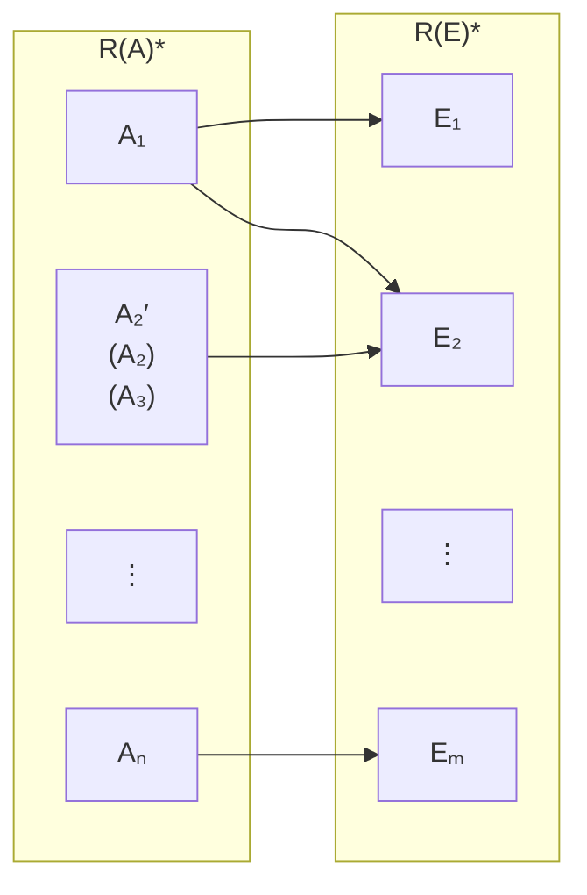
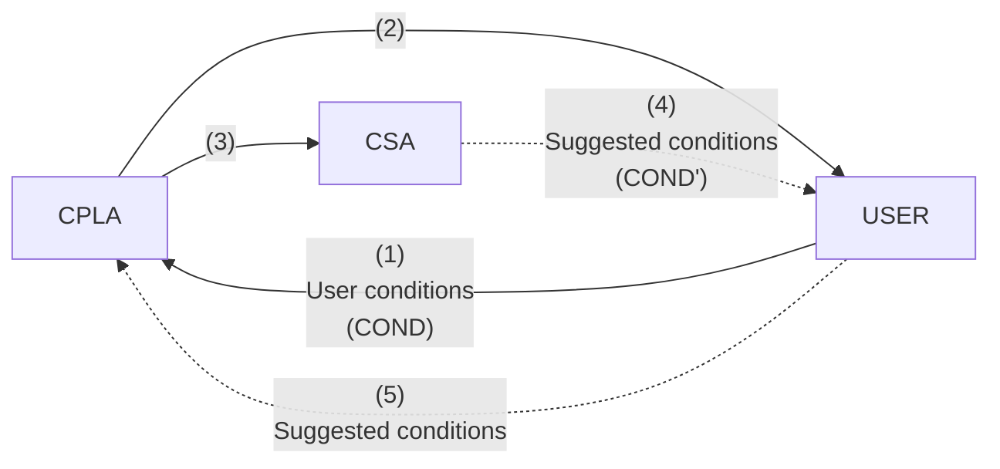

```
*Int. J. Man–Machine Studies* (1993) **38**, 147–167

# Interactive inductive learning

**MICHAEL HADJIMICHAEL**  
*Department of Computer Science, University of Regina, Regina, SK, Canada S4S 0A2*

**ANITA WASILEWSKA**  
*Department of Computer Science, State University of New York, Stony Brook, NY 14850, USA*

*(Received 30 May 1990 and accepted in revised form 21 October 1991)*

## Abstract

We propose an interactive probabilistic inductive learning model which defines a feedback relationship between the user and the learning program. We extend previously described learning algorithms to a conditional model previously described by the authors, and formulate our Conditional Probabilistic Learning Algorithm (CPLA), applying conditions as introduced by Wasilewska to a probabilistic version of the work of Wong and Wong. We propose the Condition Suggestion Algorithm (CSA) as a way to use the syntactic knowledge in the system to generalize the family of decision rules. We also examine the semantic knowledge of the system implied by the suggested conditions and analyse the effects of conditions on the system. The CPLA/CSA has been implemented by the first author and was used to generate the examples presented.

## 1. Introduction

We present here the model for a system automating the process of inductive learning from a database of examples. Our model uses results from the study of Rough Set theory (Pawlak, 1982), probabilistic approximation (Wong & Ziarko, 1986) and conditional indiscernibility (Wasilewska, 1991). The resulting system produces approximate classification rules from a database of attribute–value pairs. These rules together form probabilistic descriptions of the concepts described by the examples.

Our model allows for semantic knowledge to be deduced from the database in ways not previously explored by other systems. The model is distinctive in that it includes the *conditions* feature which allows user control over sets of attribute values, and thus allows a greater flexibility of analysis. More specifically, conditions specify equivalences on sets of attribute values, such that objects may become indistinguishable.

Moreover, the model is distinctive in that it defines a feedback relationship between the user and the learning program, unlike other inductive learning systems which simply input data and output a decision tree. This interactiveness allows for rule (tree) compaction and generalization.

Finally, our model is also distinctive in that it yields a family of production rules using easily comprehended descriptions formed of attribute–value pairs. Compared to the decision trees used by many other inductive learning systems, this format is more easily understood and manipulated by humans.

This paper presents the model along with a small example to demonstrate the concepts involved. The system described by our model has been implemented and used to analyse a variety of databases, acquired courtesy of the machine-learning database archive at the University of California at Irvine. Preliminary results have shown decreases in the number of rules ranging up to 43% using real experimental data.

Our model defines a system, the *Conditional Probabilistic Learning Algorithm* (CPLA), which is founded on the model of Wong and Ziarko’s INFER (Wong & Ziarko, 1986). CPLA is an inductive learning system which uses the probabilistic information inherent in a database and generates a family of probabilistic decision rules based on a minimized set of object attributes. We generalize further on Wong and Ziarko’s model by adding *conditions* to the system, as introduced by Wasilewska (1991), and Hadjimichael and Wasilewska (1991). Conditions are a form of user input which make the system interactive and can reduce the size of the rule family. Also, the decision rules are input to the *Condition Suggestion Algorithm* (CSA), which generates suggested conditions. Conditions, applied to a decision rules, generalize them, resulting in a smaller and more concisely described family of rules. The entire model is graphically described in Figure 1.

Figure 1 shows how the three elements of the system, CPLA, CSA and the user form a cycle in which the user moderates the feedback from CSA. The cycle begins by taking any (possibly empty) set of user-supplied conditions and running CPLA on the examples database with those conditions. CPLA, by definition, will remove the statistical functional dependencies. It will then output a family of decision rules which will then be passed to CSA, where suggested conditions will be generated. The user can examine the suggested conditions and select a subset of them to feed back into CPLA for another pass, beginning the cycle again. The suggested conditions may affect the rule family in two ways (in addition to reducing the number of rules generated). They may introduce superfluous attributes, and they may change decision rule certainties. The cycle continues until the user is satisfied with the final generation of decision rules.

**Figure 1.**



## 2. Formal basis

The transfer of specific knowledge from a human expert to the generalized decision rules of an expert system is a complex process. The goal of inductive learning is to infer the decision rules automatically from specific examples given by an expert. The automated inference of decision rules is the subject of the works of many authors (among which are Michalski & Larson [1978] and Quinlan [1983, 1990]). Descendants of these systems improved their decision tree output, but still maintain the simple data-in/tree-out format.

Wong and Wong (1987) presented an inductive learning algorithm, ILS, and compared it favorably to those systems. In particular, they showed this to be an improvement over the earlier systems of Michalski & Larson (AQ11) (1978) and Quinlan (ID3) (1983), because it allowed for shorter descriptions (and thus shorter decision trees) based on a smaller set of attributes. Furthermore, the output was in the more comprehensible *production rule* format. ILS improved on the above-mentioned methods by using Rough Set theory (Pawlak, 1982), as did INFER (Wong & Ziarko, 1986). INFER also took advantage of the probabilistic information inherent in databases to generate probabilistic decision rules.

The probabilistic approach allows us to retrieve some of the information discarded by the deterministic approach by attaching a degree of certainty to probabilistic rules which would have not existed in the earlier, deterministic case (see also Wong & Ziarko, 1986; Wong & Wong, 1987; Pawlak, Wong & Ziarko, 1988; Wong, Ziarko & Ye, 1986b).

In later work, Quinlan (1990) introduces C4 as a method for dealing with such probabilistic rules, i.e. rules which Quinlan refers to as having a “central estimate” less than 1. C4 deals with these cases by generating a decision tree and then pruning subtrees when it would not increase the error rating of the subtree root beyond a certain degree. In contrast, the rough-set based methods upon which we base our work, output the entire family of generated rules, with corresponding certainties, and let the user decide which to retain and which to discard. Such an approach is more practical with rule-family output as opposed to decision-tree output.

An extension of this benefit is the fact that by outputting all rules, we allow the user to see all information compiled by the learning system before deciding which to discard, whereas in the C4 approach, pruning removes information which is then forever lost to the user (without regenerating the entire decision tree).

Finally, it may be said that the objective of learning systems is to learn *concept descriptions*, in which case a set of descriptive terms seems intuitively more useful as a description, as compared with a decision tree which acts solely as a classifier. For more discussion on the merits of decision trees vs description rules, see Quinlan (1987).

The model we propose here expands on ILS and INFER of Wong and Wong (1987) and Wong and Ziarko (1986) respectively, by generalizing and adding *conditions* to the system. Conditions introduce into the model a new form of generalization, and a channel for user feedback, allowing for a more powerful analysis of the dataset.

### 2.1. The knowledge representation system

The systems mentioned above were based on a model in which we assume that in the process of perception we distinguish entities (*objects*) and their properties. Properties of objects are perceived through assignment of some characteristics (*attributes*) and their values to the objects. In this way we establish a universe of discourse (a problem domain) consisting of objects and elementary information items providing characterization of these objects in terms of attributes and *attributes values*.

To be more precise, first we define a notion of a *knowledge representation system* (Wong & Ziarko, 1986; Ras & Zemankova, 1986; Wong & Wong, 1987). The basic component of this system is a non-empty set *OBJ* of objects, e.g. books or human beings. Knowledge about objects is expressed through assignment of some characteristic features to the objects, i.e. human beings can be characterized by gender and age, books by title and author’s name etc. These features are represented by attributes and values of attributes. Thus, a non-empty set, $AT$, of attributes, and for each $a \in AT$, a set, $VAL_a$, of values of attribute $a$ are the components of the system. Moreover, we assume that a function, $f$, assigning attribute values to objects is given. We also define an Expert attribute, whose value will represent the expert’s classification of each object into some concept. This expresses the concepts we want the system to learn. The formal definition of a knowledge representation system is as follows.

Let

$$
K = (OBJ, AT, E, VAL, f),
$$

where $OBJ$ is a finite, non-empty set, whose elements are called *objects*, $AT$ is a finite, non-empty set, whose elements are called *attributes*, $E$ is the set containing *expert* (*decision*) attributes,

$$
VAL = \bigcup_{a \in AT} VAL_a,
$$

where for each $a \in AT \cup E$, $VAL_a$ is a finite set with at least two elements and the elements of $VAL_a$ are called *values of attribute* $a$. The total function $f$ is called the *information function* from the set $OBJ \times AT$ into a set $VAL$ such that

$$
(\forall o \in OBJ)(\forall a \in AT)(f(o,a) \in VAL_a).
$$

Every object in $OBJ$ has associated with it a set of values corresponding to the attributes $AT$, and the expert attribute $E$. The function $f$ maps the attribute of an object to its corresponding value.

**Example 2.1.** Let:

$$
OBJ = \{car_1, car_2, car_3, car_4, car_5\},
$$

$$
AT = \{Transmission, Color, Cylinders, Speed\},
$$

$$
E = \{Rating\},
$$

$$
VAL_{Transmission} = \{standard, automatic\},
$$

$$
VAL_{Color} = \{blue, red, green\},
$$

$$
VAL_{Cylinders} = \{4,6,8\},
$$

$$
VAL_{Speed} = \{fast, med, slow\},
$$

$$
VAL_{Rating} = \{excellent, good, fair, poor\}.
$$

The function, $f$, is described by Table 1.

**Table 1**

| OBJ | Transmission | Color | Cylinders | Speed | Rating |
|---|---|---|---:|---|---|
| $car_1$ | standard | blue | 4 | fast | excellent |
| $car_2$ | standard | blue | 4 | med | good |
| $car_3$ | standard | green | 4 | med | good |
| $car_4$ | standard | red | 6 | slow | fair |
| $car_5$ | automatic | red | 8 | slow | poor |

The right-hand column, *Rating*, shows the expert’s rating of each car. Each value of *Rating* is a label to concept which we want the system to learn.

### 2.2. Learning

In general, information about objects obtained from such a knowledge representation system is not sufficient to characterize objects uniquely; that is, we are not able to distinguish all the objects by means of the admitted attributes and their values. For example, if we only have the attributes $\{Transmission, Color, Cylinders\}$ to characterize the objects in the example above, then we cannot distinguish between $car_1$ and $car_2$. This means that objects are recognized up to an *indiscernibility relation* determined by elementary information items. Any two objects are indiscernible whenever they assume the same values for all the attributes under consideration.

The indiscernibility relation is what allows learning systems to generalize. It allows for the possibility of recognizing just the important features of objects. Given an indiscernibility relation, we can use it to define equivalence classes—sets of objects indiscernible based on the given attribute set.

Next we form concepts; that is, we aggregate some objects into sets. Information about a concept is composed from information about objects which are instances of concepts. Since objects are not necessarily distinguishable, information characterizing a concept may be ambiguous to some extent. In this case we want to have at least some approximation of our information and we express it in terms of an indiscernibility relation, which leads to the definition and theory of *rough sets* (Pawlak, 1982; Pawlak, Wong & Ziarko, 1988), which was used by Wong and Wong (1987), Wong and Ziarko (1986) to introduce the concept of approximate classification.

We define learning in our system as generating descriptions for rules for classifying objects into concepts. A deterministic learning system generates rules only when an object satisfying a description is a member of a concept. A nondeterministic, or probabilistic system, such as ours, generates a rule and assigns a certainty to it, depending on the probability that an object satisfying a certain description is a member of the corresponding concept.

### 2.3. Conditions

Suppose we have a user who is trying to decide what car to buy (and thus rating every car considered). In such a case, a user may not care if the car has 6 or 8 cylinders, while still being concerned with the difference between 4 and 6 cylinders. Thus, he or she would consider the values 6 and 8 as equivalent.

We formally define conditions as family of equivalence relations $\{cond_a\}_{a \in AT}$ defined in the set $VAL_a$, i.e. for each $a \in AT$, $cond_a \subseteq VAL_a \times VAL_a$, and $cond_a$ is an equivalence relation. By $cond_a(v)$ we mean $\{v' : (v,v') \in cond_a\}$.

Note, we will list only pairs which define the conditions explicitly. We will not list pairs which assure the reflexive, symmetric and transitive properties.

**Example 2.2.** Let’s consider the system from Example 2.1. To define the condition mentioned above, we let:

$$
cond_{Cylinders} = \{\{6,8\}\}.
$$

Note that implicitly specified are the conditions:

$$
cond_{Cylinders} = \{\{6,6\}, \{8,8\}\} \cup \{\{8,6\}\}.
$$

The first set contains pairs which assure the reflexive property; the second set contains the remaining pair for the symmetric property; the transitive property is fulfilled vacuously here.

### 2.4. Relations

As stated earlier, the indiscernibility relation is a key element in most approximate classification systems related to our inductive learning system. It is what allows a system to generalize from examples. What distinguishes our approach from others is that we provide control over which objects are to be indiscernible.

Usually (see Wong, Ziarko & Ye, 1986; Wong & Wong, 1987; Pawlak, Wong & Ziarko, 1988), indiscernibility is defined in the following way. Let $A \subseteq AT$. We say that objects $o_1, o_2$ are indiscernible with respect to the subset $A$ of attributes iff the following condition is satisfied:

$$
o_1 \simeq_A o_2 \quad \text{iff} \quad (\forall a \in A)(f(o_1,a) = f(o_2,a)).
$$

**Example 2.3.** When $A = \{Transmission, Color\}$, then $car_1$ and $car_2$ are indiscernible with respect to the attributes *transmission* and *color*, i.e. $car_1 \simeq_A car_2$.

We generalize here the notion of indiscernibility, by adding to it the notion of conditions, and we define, for any $A \subseteq AT$, and any family of conditions $\{cond_a\}_{a \in A}$, a family of binary relations $R(A)$ on $OBJ$ as follows:

$$
o_1 R(A) o_2 \quad \text{iff} \quad (\forall a \in A)((f(o_1,a), f(o_2,a)) \in cond_a).
$$

We will call the *identity conditions* the set of conditions

$$
cond_a = \{(v,v) : v \in VAL_a\}.
$$

Note that given $A \subseteq AT$, if we define only $cond_a$ for a certain attribute $a \in A$, then we mean that $cond_b$ for all $b \ne a$, $b \in A$, are identity conditions.

**Example 2.4.** Let $A = AT$ in the system from Example 2.1. The condition

$$
cond_{speed} = \{\{fast, med\}\}
$$

defines a relation, $R(A)$, such that:

$$
car_1 R(A) car_2,
$$

while the plain indiscernibility relation, $\simeq_A$, does not hold for $car_1, car_2$.

Because $R(A)$ is an equivalence relation, it induces a partition on the set of objects, denoted

$$
R(A)^* = \{A_1, A_2, \ldots, A_n\}.
$$

**Example 2.5.** In the system of Example 2.1, if $A = \{Transmission, Color, Speed\}$, $cond_{speed} = \{\{med, fast\}\}$ and $cond_{Transmission} = \{standard, automatic\}$, then we assume $cond_{Color}$ is the identity condition $\{(v,v): v \in VAL\}$. These conditions define a relation, $R(A)$ such that $R(A)^* = \{A_1, A_2\}$, where $A_1 = \{car_1, car_2\}$ and $A_2 = \{car_3, car_4\}$.

We call a knowledge representation system, $K$, together with a family of conditions, and a family of relations, $\{R(A)\}_{A \subseteq AT}$ defined above, a *conditional knowledge representation system*, $CK$, i.e.

$$
CK = (K, \{cond_a\}_{a \in A}, \{R(A)\}_{A \subseteq AT}).
$$

We use this knowledge representation system to describe concepts defined by an expert. The concept definitions take the form of an *expert classification*, represented by the values of the expert attribute. An expert classifies each object into a concept by assigning appropriate values to its expert attribute. In our example, the expert is teaching the concepts *excellent car*, *good car*, *fair car* and *poor car* by classifying the cars into the appropriate concept according to his or her expert opinion.

### 2.5. Probability

Our next step is to generalize to a probabilistic model, as in Wong and Ziarko (1986), Wong and Wong (1987), Pawlak, Wong and Ziarko (1988) and Wong, Ziarko and Ye (1986). The resulting system is a *conditional probabilistic knowledge representation system*, $CPK$:

$$
CPK = K + conditions + probability
$$

We incorporate probability into our system by extending the models of the above works. Let $A$ be any subset of $AT$. Let $R(A)^* = \{A_1, A_2, \ldots, A_n\}$ denote the partition induced by $R(A)$ on $OBJ$, where $A_i$ is an equivalence class of $R(A)$. Let $R(E)^* = \{E_1, E_2, \ldots, E_m\}$ (where $E$ is the set of expert attributes) denote the partition induced by $R(E)$ on $OBJ$, so that each element of $R(E)^*$ corresponds to one of the expert-defined concepts. Given a relation $R(A)$, and the partitions $R(A)^* = \{A_1,\ldots,A_n\}$ and $R(E)^* = \{E_1,\ldots,E_m\}$, we let $P$ denote the conditional probability,

$$
P(E_j \mid A_i) = \frac{P(E_j \cap A_i)}{P(A_i)},
$$

where $P(E_j \mid A_i)$ denotes the probability of occurrence of event $E_j$ conditioned on event $A_i$.

Deterministic models discard non-deterministic information (Pawlak, Wong & Ziarko, 1988). If the relationship between a class $A_i$ and an expert class $E_j$ is not deterministic, no rule is created between the two. Our probabilistic system generates such a rule, and attaches a probability to it, thus retaining useful information which otherwise would have been discarded.

We use the probabilistic model because of its ability to capture and make use of the statistical information available in the boundary—the region in $OBJ$ where we cannot tell whether an object belongs to a concept or not. The probabilistic model has been proven (Pawlak, Wong & Ziarko, 1988; Wong, Ziarko & Ye, 1986) to be superior to the deterministic model. It also has benefits as a useful tool for dealing with some more difficult problems in machine learning such as generation of decision rules from inconsistent training examples (Pettorossi, Ras & Zemankova, 1987; Ras & Zemankova, 1986).

### 2.6. Superfluous attributes

In a knowledge representation system it is possible that some attributes of $AT$ are redundant. That is, they do not provide any additional information about the objects in $OBJ$. These attributes are what we will define as conditionally statistically superfluous.

Wong and Ziarko (1985) discussed statistical functional dependency. Functional dependency in our conditional probabilistic model becomes *statistical conditional functional dependency*. We will refer to it simply as *statistical dependency*.

Several techniques have been suggested for removing the superfluous attributes from a knowledge representation system. These are discussed by Pawlak, Wong and Ziarko (1988), by Wong, Ziarko and Ye (1986), by Wong and Ziarko (1986), among others. We will adopt the probabilistic method described by Wong and Ziarko and extend it to our conditional model and incorporate it into our algorithm, using the definition of conditionally superfluous attributes given below. The result will be that our conditional decision rules will contain no superfluous attributes, and therefore as proved in Wong, Ziarko and Ye (1986), there will be fewer rules.

Given relations, $R(A)$, $R(B)$, and $R(A)^* = \{A_1,\ldots,A_n\}$, $R(B)^* = \{B_1,\ldots,B_m\}$, where $A$ and $B$ are arbitrary set of attributes. We define the normalized *entropy function*, $H(R(B)^* \mid R(A)^*)$ which provides a plausible measure of statistical dependency as follows (Pawlak, Wong & Ziarko, 1988).

$$
H(R(B)^* \mid R(A)^*) =
\sum_{i=1}^{n}
\frac{P(A_i)H(R(B)^* \mid A_i)}{\log m},
$$

where

$$
H(R(B)^* \mid A_i) =
-\sum_{j=1}^{m} P(B_j \mid A_i)\log P(B_j \mid A_i).
$$

We say that $B$ is *conditionally functionally dependent* on $A$ if and only if

$$
H(R(B)^* \mid R(A)^*) = 0.
$$

An attribute $a_i$ is said to be *conditionally statistically superfluous with respect to* $B$ if

$$
H(R(B)^* \mid R(A - \{a_i\})^*) =
H(R(B)^* \mid R(A)^*).
$$

As mentioned earlier, when we add to a knowledge representation system conditions and conditional probabilities, the result is a conditional probabilistic knowledge representation system, $CPK$. We can now more formally define $CPK$,

$$
CPK = (K, \mathcal{A}_p),
$$

where $K$ is the deterministic knowledge representation system and $\mathcal{A}_p$ is the conditional probabilistic approximation space,

$$
\mathcal{A}_p =
(((VAL, \{cond_a\}_{a \in A}, R(A)))_{A \subseteq AT}, P)
$$

respectively.

### 2.7. Descriptions

The expert partition represents an expert’s classification of objects into concepts. Decision rules (as defined in Pawlak, Wong & Ziarko, 1988; Wong & Wong 1987; Wong & Ziarko, 1986) describe the relationship between the partition based on the attributes, $A \subseteq AT$, and the partition based on the expert’s classification $E$. Such a definition maps the description of an element of the first partition to a description of an element of the second partition. A description as defined in these works is of the form

$$
des(A_i) = \bigwedge_{a \in A} (a,v),
$$

where $(a,v)$ are pairs such that $f(o,a)=v$, for $o \in A_i$.

**Example 2.6.** Let $K$ be the system from Example 2.1, $A \subseteq AT$, $A=\{color, speed\}$, and a simple equivalence relation, $\simeq_A$, induces a partition such that $OBJ = A_1 \cup A_2 \cup A_3 \cup A_4$, such that the class $A_1$ is the set of cars $\{car_1\}$, and all members of $A_1$ are *blue* and *fast*, and $A_2$ is the set of cars which are *blue* and *medium-speed*, i.e. $\{car_2\}$. The descriptions of $A_1$ and $A_2$ are:

$$
des(A_1) = (color, blue) \wedge (speed, fast),
$$

$$
des(A_2) = (color, blue) \wedge (speed, med).
$$

In our model, a partition depends not only on the set of attributes, $A \subseteq AT$, but also on the set of conditions defined for those attributes. Thus, the partition by $R(A)$ in *conditioned* decision rules is a function of the family of conditions applied to the system.

Given a set $A \subseteq AT$, and a family of conditions $\{cond_a\}_{a \in A}$, define the *conditioned description* (from now on referred to simply as the *description*) of any equivalence class $A_i \in R(A)^*$:

$$
\bigwedge_{a \in A} (a, cond_a(f(o,a))).
$$

We will use $des(A_i)$ as a shorthand notation for the description. When it is not obvious from the context, we will use $des_A(A_i)$ to indicate the attributes from which the description is formed.

Note that in a description, if the only condition on the value of an attribute is that it is equivalent to itself, then in the description we write the pair $(attribute, value)$ rather than $(attribute, \{value\})$.

**Example 2.7.** Let us again consider the system $K$ from Example 2.6. Assume that the user does not care about the difference between medium and fast as the speed of a car. This is expressed in our system as the condition $cond_{speed} = \{\{fast, med\}\}$ (equivalently, $cond_{color}(fast)=\{fast, med\}$). Now consider a set of attributes $A = \{Color, Speed\}$, with the condition described. This defines a relation, $R(A)$, such that a new partition of $OBJ$ is created. In this partition the first set, $A_i$ is $A_i = \{car_1, car_2\}$ and

$$
des(A_i) = (color, blue) \wedge (speed, \{fast, med\}).
$$

### 2.8. Conditioned decision rules

Conditioned rules take the form of a mapping from the description of an equivalence class of $R(A)^*$ to the description of an equivalence class of $R(E)^*$.

We define, after Pawlak, Wong and Ziarko (1988), the family of decision rules $\{r_{i,j}\}$ for the system $CPK$ as:

1. $des(A_i) \stackrel{c}{\Rightarrow} des(E_j)$ if $P(E_j \mid A_i) > 0.5$
2. $des(A_i) \stackrel{c}{\Rightarrow} NOTdes(E_j)$ if $P(E_j \mid A_i) < 0.5$
3. $des(A_i) \stackrel{0.5}{\Rightarrow} unknown(E_j)$ if $P(E_j \mid A_i) = 0.5$

where, the certainty of a rule is defined as:

$$
c = \max(P(E_j \mid A_i), 1 - P(E_j \mid A_i))
$$

**Example 2.8.** Let $K$ be the system of Example 2.1, and assume that we have no conditions (besides, obviously, the identity conditions), and the set of attributes $A = \{Transmission, Color, Cylinders, Speed\}$, then the partition induced is $A_1 = \{car_1\}$, $A_2 = \{car_2\}$, $A_3 = \{car_3\}$, $A_4 = \{car_4\}$, $A_5 = \{car_5\}$. The partition $R(E)^*$ is $E_1 = \{car_1\}$, $E_2 = \{car_2, car_3\}$, $E_3 = \{car_4\}$, $E_4 = \{car_5\}$. An example of a rule is:

$$
r_{1,1}: (Transmission, standard)
$$

$$
\wedge (Color, blue)
$$

$$
\wedge (Cylinders, 4)
$$

$$
\wedge (Speed, fast)
\stackrel{1-0}{\Longrightarrow}
(Rating, excellent).
$$

Given the same set of attributes, and the condition $cond_{Color} = \{\{blue, green\}\}$ ($\{cond_a\}_{a \ne Color}$ are the identity conditions), the partition $R(A)^*$ becomes $A_1 = \{car_1\}$, $A_2 = \{car_2, car_3\}$, $A_3 = \{car_4\}$, $A_4 = \{car_5\}$. $R(E)^*$ does not change. An example of rule is:

$$
r_{2,2}: (Transmission, standard)
$$

$$
\wedge (Color, \{blue, green\})
$$

$$
\wedge (Cylinders, 4)
$$

$$
\wedge (Speed, med)
\stackrel{1-0}{\Longrightarrow}
(Rating, good).
$$

It is obvious that conditions may decrease the number of classes in a partition, since they may reduce the number of distinguishable objects in $OBJ$. Rules are a function of the partition of the database. Therefore, we can see that conditions will reduce the number of rules by decreasing the number of partitions of the database.

Given a Conditional Probabilistic Knowledge Representation System, we will define now our system, the *Conditional Probabilistic Learning Algorithm*, CPLA, which generates a family of probabilistic rules based on a minimal set of attributes, taking into account the conditions defined by the system, if there are any. Each rule has associated with it a certainty, describing the probability that an object conforming to the description of the rule’s domain will belong to the expert class which the rule specifies.

## 3. Conditional probabilistic learning algorithm

The Conditional Probabilistic Learning Algorithm traces its roots to the papers of Wong and Ziarko (1986), Pawlak, Wong, and Ziarko (1988) and Wong, Ziarko and Ye (1986). From Wong, Ziarko and Ye (1986) it inherits the procedural structure of the algorithm. As an extension of Wong and Ziarko’s INFER algorithm (Wong & Wong, 1986), it maintains the property that the output will have no superfluous attributes. It takes the most from Pawlak, Wong and Ziarko’s (1988) paper, however, as it utilizes the entropy function suggested in their paper to calculate attribute dependencies, and it uses the probabilistic rules proposed in their paper (as discussed in Section 2.8). The algorithm is:

- **Input** a Conditional Probabilistic Knowledge Representation System, $(K,\mathcal{A}_p)$, where $K = (OBJ, AT, E, VAL, f)$ and $\mathcal{A}_p$ is the conditional probabilistic approximation space.
- Let $OBJ' = OBJ$, $A = \Phi$, $B = AT$.
- **Repeat until** $OBJ' = \Phi$ or $B = \Phi$.

  **Loop:** Find $a \in B$ such that $H(R(E)^* \mid R(A \cup \{a\})^*)$ is minimum for $OBJ'$.

  If $A \cup \{a\}$ is statistically dependent on $A$, then let $B \leftarrow B - \{a\}$, goto Loop.

  Let $B \leftarrow B - \{a\}$.

  Let $A \leftarrow A \cup \{a\}$.

  **For each** $E_j \in R(E)^*$ from $OBJ'$  
  &nbsp;&nbsp;**For each** $A_i$ such that $P(E_j \mid A_i) = 1.0$

  &nbsp;&nbsp;&nbsp;&nbsp;**Output** $des(A_i) \stackrel{1-0}{\Longrightarrow} des(E_j)$

  &nbsp;&nbsp;&nbsp;&nbsp;Let $OBJ' \leftarrow OBJ' - A_i$

- **If** $OBJ' \ne \Phi$

  **For each** $E_j \in R(E)^*$  
  &nbsp;&nbsp;**For each** $A_i$ such that $A_i \cap E_j \ne \Phi$

  &nbsp;&nbsp;&nbsp;&nbsp;Calculate $p_{i,j} = P(E_j \mid A_i)$.

  &nbsp;&nbsp;&nbsp;&nbsp;Calculate $c = \max[p_{i,j}, 1 - p_{i,j}]$.

  &nbsp;&nbsp;&nbsp;&nbsp;If $p_{i,j} > 1 - p_{i,j}$

  &nbsp;&nbsp;&nbsp;&nbsp;$\rightarrow$ **Output** $des(A_i) \stackrel{c}{\Longrightarrow} des(E_j)$

  &nbsp;&nbsp;&nbsp;&nbsp;If $p_{i,j} < 1 - p_{i,j}$

  &nbsp;&nbsp;&nbsp;&nbsp;$\rightarrow$ **Output** $des(A_i) \stackrel{c}{\Longrightarrow} NOTdes(E_j)$

  &nbsp;&nbsp;&nbsp;&nbsp;If $p_{i,j} = 1 - p_{i,j}$

  &nbsp;&nbsp;&nbsp;&nbsp;$\rightarrow$ **Output** $des(A_i) \stackrel{0.5}{\Longrightarrow} unknown(E_j)$.

- **End.**

Given a knowledge representation system, $CPK$, and equivalence relations $R(A)$, $R(E)$, defining partitions $R(A)^* = \{A_1, A_2, \ldots, A_n\}$, $R(E)^* = \{E_1, E_2, \ldots, E_m\}$, a rule is generated for every pair $A_i, E_j$ such that $P(E_j \mid A_i) \ne 0$. Therefore, to reduce the number of rules, we must apply conditions to decrease the number of partitions of the data set, so that we will have a smaller number of rules while retaining approximately the same amount of knowledge.

Often, a system may contain attributes whose values are irrelevant in determining the expert classification of the objects. These attributes are not conditionally statistically superfluous, but the information they supply has no effect on the expert’s global decision. The problem is one of determining which attributes contribute nothing to the expert’s classification. There are two possible indicators. (1) Two widely separated values (assuming ordered values) of an attribute can be unified through conditions without decreasing the accuracy of the system. (2) All values of an attribute may be unified without loss of accuracy. These indicators can lead us to conclude that the attribute to which these values belong must not be significant to the expert’s classification, since differences in the attribute’s values do not play a part in the final classification.

This kind of syntactic information is extracted by the Condition Suggestion Algorithm.

## 4. Condition Suggestion

The main idea behind Condition Suggestion is the collapsing of *similar* rules into one rule. Or, equivalently, the generalization from a set of specific rules to a more general rule. This is accomplished by the suggestion of conditions which will effectively merge several equivalence classes of a partition into one class. This can best be seen in Figure 2, where classes are represented as boxes, and rules are represented as arrows from classes in $R(A)^*$ to classes in $R(E)^*$.

Two rules which map classes in $R(A)^*$ to the same class in $R(E)^*$ with the same certainty are considered similar. For example, $A_2$ and $A_3$ in Figure 2. We would like to generate conditions to merge $A_2$ and $A_3$, such that the new partition is as in Figure 3.

To proceed with our definition of similarity, we introduce a further notational shorthand:

$$
DES_1(E_i) = des(E_i)
$$

$$
DES_2(E_i) = NOTdes(E_i)
$$

$$
DES_3(E_i) = unknown(E_i)
$$

**Figure 2.**



**Figure 3.**



So all rules may now be denoted by:

$$
des(A_i) \stackrel{c}{\Longrightarrow} DES_k(E_j).
$$

### 4.1. Similarity

The principle upon which the Condition Suggestion Algorithm (CSA) is based is the idea of *rule similarity*.

**Example 4.1.** Given two rules

$$
(Color, blue) \wedge (Speed, med)
\stackrel{1-0}{\Longrightarrow}
(Rating, good),
$$

$$
(Color, green) \wedge (Speed, med)
\stackrel{1-0}{\Longrightarrow}
(Rating, good),
$$

the rules are similar, since they both map the description of some equivalence class to the same concept with the same certainty.

Specifically, given a conditional probabilistic knowledge representation system, $CPK$, and a set of attributes, $A \subseteq AT$, let $r_{i,j}$ and $r_{p,q}$ be some two rules from the family of rules $\{r_{i,j}\}$:

$$
r_{i,j}: des(A_i) \stackrel{c_1}{\Longrightarrow} DES_k(E_j)
$$

$$
r_{p,q}: des(A_p) \stackrel{c_2}{\Longrightarrow} DES_r(E_q)
$$

(where $A_i, A_p \in R(A)^*$; $E_j, E_q \in R(E)^*$, $1 \le k, r \le 3$). We define a similarity relation, $sim$, as follows:

$$
r_{i,j}\ sim\ r_{p,q}
\quad \text{iff} \quad
c_1 = c_2,\ j=q,\ k=r.
$$

By definition, $sim$ is an equivalence relation. Note that although the value of $k(r)$ is determined by $c_1$ and $j$ ($c_2$ and $q$), we specify the condition $k=r$ to form a more general definition.

Given a rule, $r_{i,j}: des(A_i) \stackrel{c}{\Longrightarrow} DES_k(E_j)$, we will call the equivalence class $[r_{i,j}]$ a set of *similarly acting rules* for $r_{i,j}$.

$$
SIM(r_{i,j}) = [r_{i,j}]
$$

By definition,

$$
SIM(r_{i,j}) =
\{r_{p,j} : r_{p,j}: des(A_p) \stackrel{c}{\Longrightarrow} DES_k(E_j)\ \text{for some }p\}.
$$

Define the *domain* of some rule, $des(A_i) \stackrel{c}{\Longrightarrow} des(E_j)$, as the set of objects whose descriptions match the description of the set $A_i \in R(A)^*$. That is:

$$
domain(des(A_i) \stackrel{c}{\Longrightarrow} DES_k(E_j))
=
\{o : des(\{o\}) = des(A_i)\}
$$

where $o \in OBJ$. The domain of the above rule is simply the set $A_i$. Define the domain of a set of rules as the union of the domains of the rules in the set. Define, for each $r_{i,j}$, a domain of a set of similarly acting rules:

$$
DSIM(r_{i,j})
=
\bigcup_{A_p \in R(A)^*}
\{A_p : des(A_p) \stackrel{c}{\Longrightarrow} DES_kE_j\}
$$

where $c$ and $k$ are defined by the rule $r_{i,j}$.

Thus, the domain of the two rules mentioned in Example 4.1 would be all the cars from the database whose description matches $(color, blue) \wedge (speed, med)$ or $(color, green) \wedge (speed, med)$.

For each $SIM(r_{i,j}) = [r_{i,j}]$ we would like to introduce a new rule,

$$
des(DSIM(r_{i,j})) \stackrel{c}{\Longrightarrow} DES_k(E_j).
$$

This new rule performs the same function as the set of rules, $SIM(r_{i,j})$.

In other words, we have taken one set of rules, $SIM$, and created a generalized rule to replace it, which covers the same domain of input objects.

Given a set, $SIM(r_{i,j})$, of equivalent rules on $A$, rules are merged by applying conditions which will attempt to collapse all elements all elements of each $DSIM(r_{i,j})$ into one equivalence class. The conditions required are, for all $a \in AT$:

$$
cond_a =
\{(v,v') : (\forall o \in A_i)(\exists A_j \subseteq DSIM(r_{i,j}))
(\exists o' \in A_j)(v=f(o,a) \wedge v'=f(o',a))\}.
$$

At this point we must specify what is meant exactly by $des(DSIM(r_{i,j}))$. The precise description of such a set of objects would be

$$
\bigwedge_{o \in DSIM(r_{i,j})}
\bigwedge_{a \in A}
(a, cond_a(f(o,a))),
$$

but this is equivalent to the original set of rules. Instead we would like to generate just one conjunctive description of $DSIM(r_{i,j})$. Practically, however, such extensive conditions would quite possibly have the effect of merging domains of non-similar rules. We are therefore obliged to use as few conditions as possible to avoid increasing the total entropy of the system. Our compromise, therefore, is to merge only classes which are described by equal sets of attributes (the same set of attributes). This is reflected in the CSA algorithm, below.

**Example 4.2.** Given the two rules presented in the previous example,

$$
(Color, blue) \wedge (Speed, med)
\stackrel{1-0}{\Longrightarrow}
(Rating, good),
$$

$$
(Color, green) \wedge (Speed, med)
\stackrel{1-0}{\Longrightarrow}
(Rating, good),
$$

to merge the two classes described by the descriptions, the suggested conditions would be:

$$
cond_{Color} = \{\{blue, green\}\}.
$$

### 4.2. The Condition Suggestion Algorithm

This algorithm forms of a set of suggested conditions to merge similar rules whose domains are described by the same attributes.

- **Input** A family of rules, $\{r_{i,j}\}$.
- Generate the suggested new conditions, $COND'$

  let $COND' = \Phi$.

  **for each** rule, $r_{i,j}: des(A_i) \stackrel{c}{\Longrightarrow} DES_k(E_j) \in \{r_{i,j}\}$

  **Search** $\{r_{i,j}\}$ for all similar rules $r'_{i,j}: des(A_i) \stackrel{c'}{\Longrightarrow} DES_k(E_j)$, $A=A'$.

  Let $D = \{A_i\}$, the set of domains of those rules.

  Update $COND'$ with the conditions:

  $$
  cond_a =
  \{(v,v') : (\forall o \in D)(\exists o' \in D)(v=f(o,a) \wedge v'=f(o',a))\}.
  $$

  output $COND'$.

- **End.**

## 5. An example

Here we present examples to demonstrate the plausibility of our proposed model. CPLA has been implemented in C by the first author and was used to generate the following examples.

**Example 5.1.** Let $K$ be the knowledge system defined by Table 2.

**Table 2**

| Student | Phil. | Math. | English | History | Physics | Art | Rating |
|---|---|---|---|---|---|---|---|
| David | A− | A− | B | B | A− | A | Good |
| Holly | B+ | A+ | C | A | A | A | Good |
| George | C− | D+ | A | C− | D | D | Poor |
| Julie | F | D | F | C− | F | D | Poor |
| Mark | A+ | A | B− | B+ | A− | A | Excellent |
| Mary | D | A− | B+ | B− | C | A | Good |
| John | C− | D | A− | C− | D+ | D | Fair |
| Arash | B+ | A+ | C | A− | A− | A | Excellent |
| Sanja | A | A− | B+ | B+ | A+ | A | Excellent |
| Jane | C− | D | A− | C− | B | A | Good |
| Harry | B+ | B | C | A− | A− | A | Good |
| Cathy | B+ | A+ | C | B+ | A− | A | Excellent |

When CPLA is run with $K$ as input, and no additional conditions, it rejects the attributes *Philosophy*, *English*, *History*, *Art* as superfluous for describing the expert partition, and uses the attributes $A=\{Physics\}$ to create the partitions $R(A)^*=\{A_5,A_6,A_7,A_8,A_9,A_{10},A_{11}\}$ and $A'=\{Math, Physics\}$ to create the partitions, $R(A')^*=\{A_1,A_2,A_3,A_4\}$. The expert classes are: $E_1 = Excellent$, $E_2 = Good$, $E_3 = Fair$, and $E_4 = Poor$. The partitions and 11 rules are:

$$
A_1 = \{Holly\} \qquad A_7 = \{John\}
$$

$$
A_2 = \{Mary\} \qquad A_8 = \{David\}
$$

$$
A_3 = \{Jane\} \qquad A_9 = \{Harry\}
$$

$$
A_4 = \{George\} \qquad A_{10} = \{Mark\}
$$

$$
A_5 = \{Julie\} \qquad A_{11} = \{Arash, Cathy\}
$$

$$
A_6 = \{Sanja\}
$$

$$
r_{1,2}: (Physics, A)
\stackrel{1-0}{\Longrightarrow}
(Rating, Good)
$$

$$
r_{2,2}: (Physics, C)
\stackrel{1-0}{\Longrightarrow}
(Rating, Good)
$$

$$
r_{3,2}: (Physics, B)
\stackrel{1-0}{\Longrightarrow}
(Rating, Good)
$$

$$
r_{4,4}: (Physics, D)
\stackrel{1-0}{\Longrightarrow}
(Rating, Poor)
$$

$$
r_{5,4}: (Physics, F)
\stackrel{1-0}{\Longrightarrow}
(Rating, Poor)
$$

$$
r_{6,1}: (Physics, A+)
\stackrel{1-0}{\Longrightarrow}
(Rating, Excellent)
$$

$$
r_{7,3}: (Physics, D+)
\stackrel{1-0}{\Longrightarrow}
(Rating, Fair)
$$

$$
r_{8,2}: (Physics, A-) \wedge (Math, A-)
\stackrel{1-0}{\Longrightarrow}
(Rating, Good)
$$

$$
r_{9,2}: (Physics, A-) \wedge (Math, B)
\stackrel{1-0}{\Longrightarrow}
(Rating, Good)
$$

$$
r_{10,1}: (Physics, A-) \wedge (Math, A)
\stackrel{1-0}{\Longrightarrow}
(Rating, Excellent)
$$

$$
r_{11,1}: (Physics, A-) \wedge (Math, A+)
\stackrel{1-0}{\Longrightarrow}
(Rating, Excellent)
$$

CSA, from the above rules, suggests the following conditions to merge $\{r_{1,2}, r_{2,2}, r_{3,2}\}$, $\{r_{4,4}, r_{5,4}\}$, $\{r_{8,2}, r_{9,2}\}$, $\{r_{10,1}, r_{11,1}\}$:

$$
\text{(i): } cond_{Math} = \{\{A+, A\}, \{A-, B\}\}
$$

$$
\text{(ii): } cond_{Physics} = \{\{D,F\}, \{A,B,C\}\}
$$

At this point the user may enter the process and decide to apply some subset of the conditions. In this case, the suggested conditions all seem reasonable and therefore we apply them all in Example 5.2.

**Example 5.2.** Let the conditional space for $K$ be composed of the conditions suggested by CSA in Example 5.1. Running CPLA on this system results in the following partition and six rules:

$$
A_1 = \{Holly, Mary, Jane\} \qquad A_4 = \{John\}
$$

$$
A_2 = \{George, Julie\} \qquad A_5 = \{David, Harry\}
$$

$$
A_3 = \{Sanja\} \qquad A_6 = \{Mark, Arash, Cathy\}
$$

$$
r_{1,2}: (Physics, \{A,B,C\})
\stackrel{1-0}{\Longrightarrow}
(Rating, Good)
$$

$$
r_{2,4}: (Physics, \{D,F\})
\stackrel{1-0}{\Longrightarrow}
(Rating, Poor)
$$

$$
r_{3,1}: (Physics, A+)
\stackrel{1-0}{\Longrightarrow}
(Rating, Excellent)
$$

$$
r_{4,3}: (Physics, D+)
\stackrel{1-0}{\Longrightarrow}
(Rating, Fair)
$$

$$
r_{5,2}: (Physics, A-) \wedge (Math, \{A-,B\})
\stackrel{1-0}{\Longrightarrow}
(Rating, Good)
$$

$$
r_{6,1}: (Physics, A-) \wedge (Math, \{A+,A\})
\stackrel{1-0}{\Longrightarrow}
(Rating, Excellent)
$$

We see that CSA can yield reasonable conditions which may successfully decrease the number of rules. The suggested conditions in the example above were intuitively reasonable and did not increase the entropy function, $H$, of the system.

Assume now that the user looks at the raw database of Example 5.1 and decides to impose an initial set of conditions. These conditions will specify that grades one increment above and below a letter grade will be equivalent to that letter grade. For example, $A+ = A = A-$. We will see that the conditions suggested by CSA yield a better system.

**Example 5.3.** Let $K$ be the system of Example 5.1, and the user supplied initial conditions are:

$$
cond_a = \{(A,A-), (A,A+), (A-,A+), (B,B-), (B,B+), (B-,B+),
$$

$$
(C,C-), (C,C+), (C-,C+), (D,D-), (D,D+), (D-,D+)\}
$$

defined for all attributes. CPLA rejects the attributes *English* and *Art* as superfluous, and yields the following partition, and 11 rules (written in shorthand for convenience):

$$
A_1 = \{Mary\} \qquad A_5 = \{Cathy\}
$$

$$
A_2 = \{Jane\} \qquad A_6 = \{David, Mark, Sanja\}
$$

$$
A_3 = \{Julie\} \qquad A_7 = \{Holly, Arash\}
$$

$$
A_4 = \{Harry\} \qquad A_8 = \{George, John\}
$$

$$
r_{1,2}: des_{\{Physics\}}(A_1)
\stackrel{1-0}{\Longrightarrow}
(Rating, Good)
$$

$$
r_{2,2}: des_{\{Physics\}}(A_2)
\stackrel{1-0}{\Longrightarrow}
(Rating, Good)
$$

$$
r_{3,4}: des_{\{Physics\}}(A_3)
\stackrel{1-0}{\Longrightarrow}
(Rating, Poor)
$$

$$
r_{4,2}: des_{\{Physics, Math\}}(A_4)
\stackrel{1-0}{\Longrightarrow}
(Rating, Good)
$$

$$
r_{5,1}: des_{\{Physics, Math, Phil., History\}}(A_5)
\stackrel{1-0}{\Longrightarrow}
(Rating, Excellent)
$$

$$
r_{6,2}: des_{\{Physics, Math, Phil., History\}}(A_6)
\stackrel{0.67}{\Longrightarrow}
not(Rating, Good)
$$

$$
r_{6,1}: des_{\{Physics, Math, Phil., History\}}(A_6)
\stackrel{0.67}{\Longrightarrow}
(Rating, Excellent)
$$

$$
r_{7,2}: des_{\{Physics, Math, Phil., History\}}(A_7)
\stackrel{0.50}{\Longrightarrow}
unknown(Rating, Good)
$$

$$
r_{7,1}: des_{\{Physics, Math, Phil., History\}}(A_7)
\stackrel{0.50}{\Longrightarrow}
unknown(Rating, Excellent)
$$

$$
r_{8,4}: des_{\{Physics, Math, Phil., History\}}(A_8)
\stackrel{0.50}{\Longrightarrow}
unknown(Rating, Poor)
$$

$$
r_{8,3}: des_{\{Physics, Math, Phil., History\}}(A_8)
\stackrel{0.50}{\Longrightarrow}
unknown(Rating, Fair)
$$

One fully written out rule is:

$$
r_{6,1}: (Physics, \{A-,A,A+\}) \wedge (Math, \{A-,A,A+\})
$$

$$
\wedge (Phil., \{A-,A,A+\}) \wedge (History, \{B-,B,B+\})
$$

$$
\stackrel{0.67}{\Longrightarrow}
(Rating, Excellent).
$$

The number of rules did not decrease at all, because of the wide-ranging effect of the conditions supplied by the user. Also, for this set of rules, the entropy function is non-zero, since there are six non-deterministic rules, four of which are *unknowns*, as opposed to the deterministic rules from Example 5.2. From these two facts we can conclude that the CSA-supplied conditions were better than the user-supplied conditions. Whereas the user made a general decision about the data, CSA made a more conservative and limited decision, resulting in a more efficient (and lower-entropy) system.

Let us now examine the effects of CSA on the above family of rules.

**Example 5.4.** Applying the Condition Suggestion Algorithm to the rules of Example 5.3 results in the suggestion that classes $A_1$ and $A_2$ be merged, and therefore the suggested additional conditions are:

$$
cond_{Physics} = \{\{B,C\}\}
$$

in addition to the original conditions supplied by the user.

If the user accepts all these suggested conditions and re-runs CPLA with them, rules $r_{1,2}$ and $r_{2,2}$ are appropriately replaced by:

$$
r_{1',2}: des_{\{Physics\}}(A_{1'})
\stackrel{1-0}{\Longrightarrow}
(Rating, Good),
$$

or

$$
r_{1',2}: (Physics, \{B-,B,B+,C-,C,C+\})
\stackrel{1-0}{\Longrightarrow}
(Rating, Good),
$$

where $A_{1'} = \{Mary, Jane\}$.

So we see that CSA will always suggest the minimal set of conditions to reduce the size of the rule family, and is not as susceptible to over-generalization, as a human being might be.

### 5.1. Example summary

The CPLA–CSA cycle began with a knowledge system, $K$, and an empty set of user-supplied conditions, $COND$. These two items were input to CPLA (see step 1, Figure 4), which then removed the superfluous attributes from $K$, and returned a family of decision rules (step 2). The rules are then passed to CSA (step 3). CSA returns to the user a set of conditions, $COND'$ (step 4), with the claim that when CPLA is run with the input $K + COND \cup COND'$, it will produce a smaller set of rules. The second cycle began by the user selecting some subset of $COND'$ (step 5) to augment $COND$ and then starts CPLA again. The second cycle further decreased the number of rules, and produced no new suggested conditions. (Figure 4.)

**Figure 4.**



## 6. Conclusion

We have proposed a model of probabilistic inductive learning built on the ILS model of Wong and Wong (1987), and the INFER model of Wong and Ziarko (1986). Our model—the Conditional Probabilistic Learning Algorithm (CPLA)—incorporates the concept of *conditions* and allows for direct user interaction with the data. We have demonstrated the Condition Suggestion Algorithm (CSA), which extracts syntactic knowledge from the knowledge representation system and allows the user to convert it to semantic knowledge. The syntactic knowledge is presented as suggested conditions which can reduce the size of the rule family generated by the learning system. These parts have been put together as a three-element system, or cycle: Conditional Probabilistic Learning Algorithm—Condition Suggestion Algorithm—User. The user plays an integral part in the cycle by supplying conditions, as well as selecting from the suggested conditions, to adjust the data so as to maximize information content of the rules, while minimizing the uncertainty of the system. The result is a smaller, more efficient system.

## References

HADJIMICHAEL, M. (1989). Conditions suggestion algorithm for knowledge representation systems. *Proceedings of the Fourth International Symposium on Methodologies for Intelligent Systems: Poster Session Program*, Charlotte, NC, ORNL/DSRD-24.

HADJIMICHAEL, M. & WASILEWSKA, A. (1991). Rule reduction for knowledge representation systems. *Bulletin of Polish Academy of Science*, **39**, 523–534.

MICHALSKI, R. S. & LARSON, J. B. (1978). Selection of most representative training examples and incremental generation of VL1 hypothesis: the underlying methodology and the description of programs ESEL and AQ11. Report No. 867, Department of Computer Science, University of Illinois, Urbana, Illinois.

PAWLAK, Z. (1982). Rough sets. *International Journal of Information and Computer Science*, **11**, 344–356.

PAWLAK, Z., WONG, S. K. M. & ZIARKO, W. (1988). Rough sets: probabilistic vs deterministic approach. *International Journal of Man–Machine Studies*, **29**, 81–95.

PETTOROSSI, A., RAS, Z. & ZEMANKOVA, M. (1987). On learning with imperfect teachers. *Proceedings of the 2nd ACM SIGART International Symposium on Methodologies for Intelligent Systems*, pp. 256–263, Amsterdam: North Holland.

QUINLAN, J. R. (1983). Learning efficient classification procedures and their application to chess end games. In R. S. MICHALSKI, J. G. CARBONELL & T. M. MITCHELL, Eds. *Machine learning, an Artificial Intelligence Approach*. Kaufmann Publishers, Inc. San Mateo, CA:

QUINLAN, J. R. (1987). Generating production rules from decision trees. *International Joint Conference on Artificial Intelligence, 1987*, pp. 304–307. San Mateo, CA: Morgan Kaufmann Publishers, Inc.

QUINLAN, J. R. (1990). Probabilistic decision trees. In Y. KODRATOFF & R. S. MICHALSKI, Eds. *Machine Learning, an Artificial Intelligence Approach*. Vol III. San Mateo, CA: Morgan Kaufmann Publishers, Inc.

RAS, Z. & ZEMANKOVA, M. (1986). Learning in knowledge based systems, a possibilistic approach. *Proceedings of the 1986 CISS*, pp. 844–847, Princeton, NJ.

WASILEWSKA, A. (1991). Conditional knowledge representation system—model for an implementation. *Bulletin of the Polish Academy of Science*, **37**, 63–69.

WONG, S. K. M. & WONG, J. H. (1987). An inductive learning system—ILS. *Proceedings of the 2nd ACM SIGART International Symposium on Methodologies for Intelligent Systems*, pp. 370–378 Charlotte, NC, Amsterdam: North Holland.

WONG, S. K. M. & ZIARKO, W. (1986). INFER—an adaptive decision support system based on the probabilistic approximate classification. *The 6th International Workshop on Expert Systems and Their Applications*, pp. 713–726, Avignon, France. Vol. I.

WONG, S. K. M., ZIARKO, W. & YE, R. L. (1986). Comparison of rough set and statistical methods in inductive learning. *International Journal of Man–Machine Studies*, **24**, 53–72.
```

```
OCR/transcription uncertainty notes: (1) Example 2.5 appears internally inconsistent in the scan: the partition is printed as only two classes and ends with $A_2=\{car_3, car_4\}$; this was transcribed as visible, though it may be an author/scan error. (2) Example 2.7 parenthetical condition appears as $cond_{color}(fast)=\{fast, med\}$ in the image; semantically this may be $cond_{speed}(fast)$, but the visible/OCR form was preserved. (3) The formal definition of $\mathcal{A}_p$ and some formulas in Section 4.1 are low-resolution and may have minor parenthesis/subscript uncertainty. (4) Table 2 student name was transcribed as “Sanja” because later pages repeatedly refer to Sanja; the table image itself is slightly ambiguous and could be misread by OCR as “Alice.” (5) Example 5.2 rule $r_{3,1}$ is transcribed as $(Physics, A+)$; the scan is slightly ambiguous around braces/grade text. (6) The figures were recreated schematically in Mermaid; exact box dimensions and arrow positions from the scanned diagrams are not preserved.
```