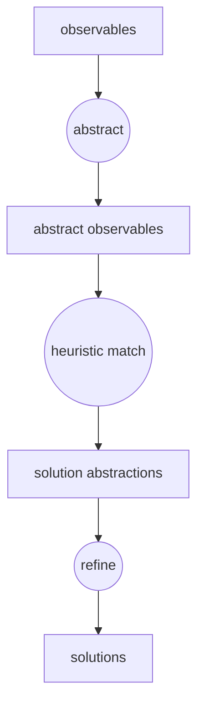
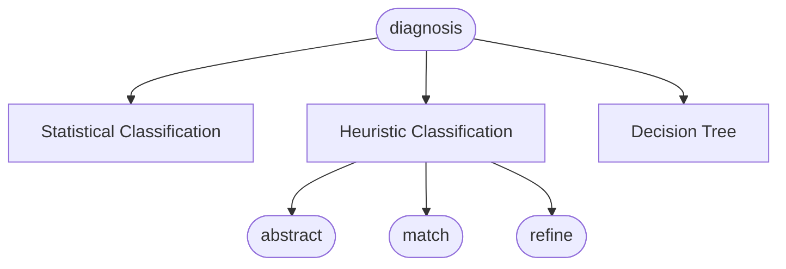
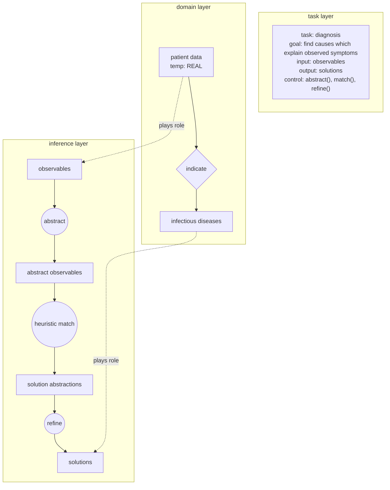
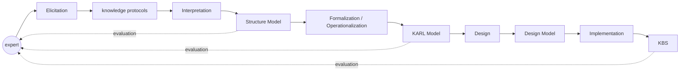
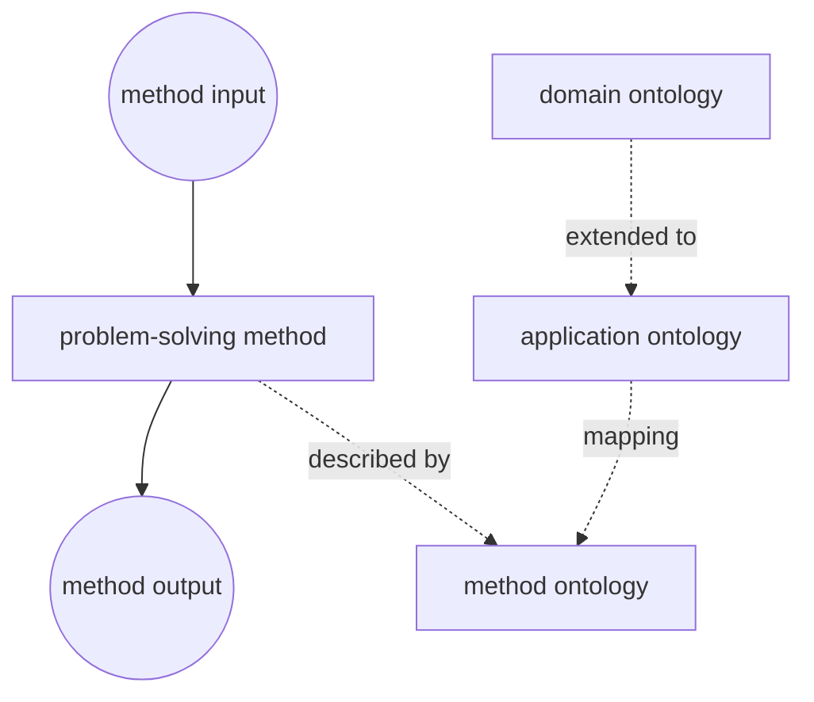

# Knowledge Engineering: Principles and methods

Rudi Studera,\*, V. Richard Benjaminsb,c, Dieter Fensela

aInstitute AIFB, University of Karlsruhe, 76128 Karlsruhe, Germany  
bArtificial Intelligence Research Institute (IIIA), Spanish Council for Scientific Research (CSIC), Campus UAB, 08193 Bellaterra, Barcelona, Spain  
cDept. of Social Science Informatics (SWI), University of Amsterdam, Roetersstraat 15, 1018 WB Amsterdam, The Netherlands

Received 21 November 1997; accepted 21 November 1997

\* Corresponding author. E-mail: studer@aifb.uni-karlsruhe.de

*Data & Knowledge Engineering* 25 (1998) 161–197  
0169-023X/98/\$19.00 © 1998 Elsevier Science B.V. All rights reserved  
PII: S0169-023X(97)00056-6

## Abstract

This paper gives an overview of the development of the field of Knowledge Engineering over the last 15 years. We discuss the paradigm shift from a transfer view to a modeling view and describe two approaches which considerably shaped research in Knowledge Engineering: Role-limiting Methods and Generic Tasks. To illustrate various concepts and methods which evolved in recent years we describe three modeling frameworks: CommonKADS, MIKE and PROTÉGÉ-II. This description is supplemented by discussing some important methodological developments in more detail: specification languages for knowledge-based systems, problem-solving methods and ontologies. We conclude by outlining the relationship of Knowledge Engineering to Software Engineering, Information Integration and Knowledge Management.

**Keywords:** Knowledge Engineering; Knowledge acquisition; Problem-solving method; Ontology; Information integration

## 1. Introduction

In earlier days research in Artificial Intelligence (AI) was focused on the development of formalisms, inference mechanisms and tools to operationalize Knowledge-based Systems (KBSs). Typically, the development efforts were restricted to the realization of small KBSs in order to study the feasibility of the different approaches.

Though these studies offered rather promising results, the transfer of this technology into commercial use in order to build large KBSs failed in many cases. The situation was directly comparable to a similar situation in the construction of traditional software systems, called ‘software crisis’ in the late 1960s: the means to develop small academic prototypes did not scale up to the design and maintenance of large long-living commercial systems. In the same way as the software crisis resulted in the establishment of the discipline Software Engineering, the unsatisfactory situation in constructing KBSs made clear the need for more methodological approaches.

So the goal of the new discipline Knowledge Engineering (KE) is similar to that of Software Engineering: turning the process of constructing KBSs from an art into an engineering discipline. This requires the analysis of the building and maintenance process itself and the development of appropriate methods, languages and tools specialized for developing KBSs [131].

Subsequently, we will first give an overview of some important historical developments in KE: special emphasis will be put on the paradigm shift from the so called transfer approach to the so called modeling approach. This paradigm shift is sometimes also considered as the transfer from first-generation expert systems to second-generation expert systems [43]. Based on this discussion Section 2 will be concluded by describing two prominent developments in the late 1980s: Role-limiting Methods [99] and Generic Tasks [36]. In Section 3 we will present some modeling frameworks which have been developed in recent years: CommonKADS [129], MIKE [6] and PROTÉGÉ-II [123]. Section 4 gives a short overview of specification languages for KBSs. Problem-solving methods have been a major research topic in KE for the last decade. Basic characteristics of libraries of problem-solving methods are described in Section 5. Ontologies, which gained a lot of importance during recent years are discussed in Section 6. The paper concludes with a discussion of current developments in KE and their relationships to other disciplines.

In KE much effort has also been put into developing methods and supporting tools for knowledge elicitation (compare [48]). For example, in the VITAL approach [130] a collection of elicitation tools, like repertory grids (see [65,83]), are offered for supporting the elicitation of domain knowledge (compare also [49]). However, a discussion of the various elicitation methods is beyond the scope of this paper.

## 2. Historical roots

### 2.1. Basic notions

In this section we will first discuss some main principles which characterize the development of KE from the very beginning.

#### 2.1.1. Knowledge Engineering as a transfer process

> “This transfer and transformation of problem-solving expertise from a knowledge source to a program is the heart of the expert-system development process” [81].

In the early 1980s the development of a KBS was seen as a transfer process of human knowledge into an implemented knowledge base. This transfer was based on the assumption that the knowledge which is required by the KBS already exists and just has to be collected and implemented. Most often, the required knowledge was obtained by interviewing experts on how they solve specific tasks [108]. Typically, this knowledge was implemented in some kind of production rules which were executed by an associated rule interpreter.

However, a careful analysis of the various rule knowledge bases showed that the rather simple representation formalism of production rules did not support an adequate representation of different types of knowledge [38]: e.g. in the MYCIN knowledge base [44] strategic knowledge about the order in which goals should be achieved is mixed up with domain specific knowledge. This mixture of knowledge types, together with the lack of adequate justifications of the different rules, makes the maintenance of such knowledge bases very difficult and time consuming. Therefore, this transfer approach was only feasible for the development of small prototypical systems, but it failed to produce large, reliable and maintainable knowledge bases.

Furthermore, it was recognized that the assumption of the transfer approach, that knowledge acquisition is the collection of already existing knowledge elements, was wrong due to the important role of tacit knowledge for an expert’s problem-solving capabilities. These deficiencies resulted in a paradigm shift from the transfer approach to the modeling approach.

#### 2.1.2. Knowledge Engineering as a modeling process

Nowadays there exists an overall consensus that the process of building a KBS may be seen as a modeling activity. Building a KBS means building a computer model with the aim of realizing problem-solving capabilities comparable to a domain expert. It is not intended to create a cognitive adequate model, i.e. to simulate the cognitive processes of an expert in general, but to create a model which offers similar results in problem-solving for problems in the area of concern.

This modeling view of the building process of a KBS has the following consequences:

- Like every model, such a model is only an approximation of the reality. In principle, the modeling process is infinite.
- The modeling process is a cyclic process. New observations may lead to refinement, modification or completion of the already built-up model.
- The modeling process is dependent on subjective interpretations of the knowledge engineer. Therefore, evaluation of the model with respect to reality is indispensable.

#### 2.1.3. Problem-solving methods

In [39] Clancey reported on the analysis of a set of first generation expert systems developed to solve different tasks. Though they were realized using different representation formalisms, he discovered a common problem-solving behaviour. Clancey was able to abstract this common behaviour to a generic inference pattern called Heuristic Classification, which describes the problem-solving behaviour of these systems on an abstract level, the so called Knowledge Level [113].

A Problem-Solving Method (PSM) may be characterized as follows:

- A PSM specifies which inference actions have to be carried out for solving a given task.
- A PSM determines the sequence in which these actions have to be activated.
- Knowledge roles determine which role the domain knowledge plays in each inference action.

When considering the PSM Heuristic Classification we can identify the three basic inference actions *abstract*, *heuristic match* and *refine*. Furthermore, four knowledge roles are defined: observables, abstract observables, solution abstractions and solutions. For example, an observable like `$41^\circ\mathrm{C}$` may be abstracted to “high temperature”; this abstracted observable may be matched to a solution abstraction such as “infection”; and the solution abstraction may be hierarchically refined to a solution, e.g. the disease “influenza”.

PSMs may be exploited in the knowledge engineering process in different ways:

- PSMs contain inference actions which need specific knowledge in order to perform their task.
- A PSM allows to describe the main rationale of the reasoning process of a KBS.
- Since PSMs may be reused for developing different KBSs, a library of PSMs can be exploited for constructing KBSs from reusable components.

**Fig. 1. The Problem-solving method Heuristic Classification.**

### 2.2. Specific approaches

During the 1980s two main approaches evolved which had significant influence on the development of modeling approaches in KE: Role-Limiting Methods and Generic Tasks.

#### 2.2.1. Role-limiting methods

Role-Limiting Methods (RLM) ([99,102]) were one of the first attempts to support the development of KBSs by exploiting the notion of a reusable problem-solving method. The RLM approach may be characterized as a shell approach. Such a shell comes with an implementation of a specific PSM, and, thus, can only be used to solve a type of tasks for which the PSM is appropriate.

SALT is a RLM for building KBSs which use the PSM Propose-and-Revise. Thus, KBSs may be constructed for solving specific types of design tasks, e.g. parametric design tasks. The basic inference actions that Propose-and-Revise is composed of may be characterized as follows:

- extend a partial design by proposing a value for a design parameter not yet computed,
- determine whether all computed parameters fulfil the relevant constraints, and
- apply fixes to remove constraint violations.

In essence three generic roles may be identified for Propose-and-Revise [100]:

- “design-extensions” refer to knowledge for proposing a new value for a design parameter,
- “constraints” provide knowledge restricting the admissible values for parameters, and
- “fixes” make potential remedies available for specific constraint violations.

**Fig. 2. Design extension knowledge for VT.**

| No. | Field | Value |
|---:|---|---|
| 1 | Name | CAR-JAMB-RETURN |
| 2 | Precondition | DOOR-OPENING = CENTER |
| 3 | Procedure | CALCULATION |
| 4 | Formula | `[PLATFORM-WIDTH - OPENING-WIDTH] / 2` |
| 5 | Justification | CENTER-OPENING DOORS LOOK BEST WHEN CENTERED ON PLATFORM. |

The value of the design parameter CAR-JUMB-RETURN is calculated according to the formula in case the precondition is fulfilled; the justification gives a description why this parameter value is preferred over other values.

In order to overcome the inflexibility of RLMs, the concept of configurable RLMs has been proposed. Configurable Role-Limiting Methods (CRLMs) exploit the idea that a complex PSM may be decomposed into several subtasks where each subtask may be solved by different methods.

#### 2.2.2. Generic Task and Task Structures

In the early 1980s the analysis and construction of various KBSs for diagnostic and design tasks evolved gradually into the notion of a Generic Task (GT) [36]. GTs like Hierarchical Classification or State Abstraction are building blocks which can be reused for the construction of different KBSs.

The basic idea of GTs may be characterized as follows:

- A GT is associated with a generic description of its input and output.
- A GT comes with a fixed scheme of knowledge types specifying the structure of domain knowledge needed to solve a task.
- A GT includes a fixed problem-solving strategy specifying the inference steps and their sequence.

The GT approach is based on the strong interaction problem hypothesis which states that the structure and representation of domain knowledge is completely determined by its use [33]. However, two main disadvantages were identified:

- The notion of task is conflated with the notion of the PSM used to solve the task.
- The complexity of the proposed GTs was very different.

Based on this insight the Task Structure approach was proposed [37]. The Task Structure approach makes a clear distinction between a task, which is used to refer to a type of problem, and a method, which is a way to accomplish a task.

**Fig. 3. Sample task structure for diagnosis.**

## 3. Modeling frameworks

In this section we describe three modeling frameworks which address various aspects of model-based KE approaches: CommonKADS [129], MIKE [6] and PROTÉGÉ-II [51].

### 3.1. The CommonKADS approach

A prominent knowledge-engineering approach is KADS [128] and its further development to CommonKADS [129]. A basic characteristic of KADS is the construction of a collection of models, where each model captures specific aspects of the KBS to be developed as well as of its environment. In CommonKADS the Organization Model, Task Model, Agent Model, Communication Model, Expertise Model and Design Model are distinguished.

- Within the Organization Model the organizational structure is described together with a specification of functions performed by each organizational unit.
- The Task Model provides a hierarchical description of the tasks performed in the organizational unit in which the KBS will be installed.
- The Agent Model specifies the capabilities of each agent involved in the execution of the tasks at hand.
- Within the Communication Model the various interactions between the different agents are specified.

A major contribution of KADS is its proposal for structuring the Expertise Model, which distinguishes three different types of knowledge required to solve a particular task:

- **Domain layer:** all domain-specific knowledge needed to solve the task at hand.
- **Inference layer:** the reasoning process of the KBS is specified by exploiting the notion of a PSM.
- **Task layer:** decomposition of tasks into subtasks and inference actions including goal specification and control.

**Fig. 4. Expertise Model for medical diagnosis (simplified CML notation).**

Two types of languages are offered to describe an Expertise Model: CML (Conceptual Modeling Language) [127], which is a semi-formal language with a graphical notation, and `$(\mathrm{ML})^2$` [79], which is a formal specification language based on first-order predicate logic, meta-logic and dynamic logic.

Within CommonKADS a library of reusable and configurable components, which can be used to build up an Expertise Model, has been defined [29]. All development activities are embedded in a cyclic and risk-driven life cycle model similar to Boehm’s spiral model [21].

### 3.2. The MIKE approach

The MIKE approach (Model-based and Incremental Knowledge Engineering) provides a development method for KBSs covering all steps from the initial elicitation through specification to design and implementation. MIKE proposes the integration of semiformal and formal specification techniques and prototyping into an engineering framework.

MIKE takes the Expertise Model of CommonKADS as its general model pattern and provides a smooth transition from a semiformal representation, the Structure Model, to a formal representation, the KARL Model, and further to an implementation-oriented representation, the Design Model.

**Fig. 5. Steps and documents in the MIKE development process.**

The knowledge-acquisition process starts with Elicitation. Methods like structured interviews [48] are used for acquiring informal descriptions of the knowledge about the specific domain and the problem-solving process itself. The resulting knowledge expressed in natural language is stored in so called knowledge protocols.

During the Interpretation phase the knowledge structures identified in the knowledge protocols are represented in a semi-formal variant of the Expertise Model: the Structure Model [112]. The Structure Model is the foundation for the Formalization/Operationalization process which results in the formal Expertise Model: the KARL Model. The KARL Model can be directly mapped to an operational representation because KARL is an executable language.

During the Design phase additional non-functional requirements are considered, including efficiency and maintainability as well as constraints imposed by target software and hardware environments. The Design Model is expressed in the language DesignKARL [89]. The Implementation process implements the Design Model in the target hardware and software environment.

The entire development process is performed in a cycle guided by a spiral model [21]. Every cycle produces a prototype of the KBS which may be evaluated by testing it in the real target environment.

### 3.3. The PROTÉGÉ-II approach

The PROTÉGÉ-II approach aims at supporting the development of KBSs by the reuse of PSMs and ontologies. In addition, PROTÉGÉ-II puts emphasis on the generation of custom-tailored knowledge-acquisition tools from ontologies [50].

PROTÉGÉ-II relies on the task-method-decomposition structure. By applying a PSM a task is decomposed into corresponding subtasks. The input and output of a method are specified by a method ontology, which defines the concepts and relationships that are used by the PSM for providing its functionality.

A second type of ontology used within PROTÉGÉ-II are domain ontologies: they define a shared conceptualization of a domain. PROTÉGÉ-II proposes the notion of an application ontology to extend domain ontologies with PSM-specific concepts and relationships [71].

PROTÉGÉ-II offers different types of mapping relations:

- **Renaming mappings** translate domain-specific terms into method-specific terms.
- **Filtering mappings** select a subset of domain instances as instances of the corresponding method concept.
- **Class mappings** compute instances of method concepts from application-concept definitions rather than from application instances.

**Fig. 6. Ontologies in PROTÉGÉ-II.**

A feature of PROTÉGÉ-II is that it can generate knowledge-acquisition tools from domain or application ontologies [50]. Recently, the PROTÉGÉ-II approach has been extended to CORBA-based PSMs and ontologies, enabling reuse of these components in an Internet environment [70].

## 4. Specification approaches in Knowledge Engineering

Over the last 10 years a number of specification languages have been developed for describing KBSs. These specification languages can be used to specify the knowledge required by the system as well as the reasoning process which uses this knowledge to solve the assigned task.

### 4.1. Why did the need arise for specification languages in the late 1980s

The development of knowledge engineering can roughly be divided into the knowledge transfer and the knowledge modelling period. During the former period, knowledge was directly encoded using rule-based implementation languages or frame-based systems. The implicit assumption was that these representation formalisms were adequate to express knowledge, reasoning and functionality of a KBS in a way understandable for humans and computers.

However, severe difficulties arose [40]:

- different types of knowledge were represented uniformly,
- other types of knowledge were not presented explicitly,
- the level of detail was too high to present abstract models of the KBS,
- and knowledge-level aspects got constantly mixed with implementation aspects.

Formal specification techniques arose to overcome shortcomings of natural-language descriptions, while often being considered as complements to semi-formal specifications rather than replacements.

### 4.2. The essence of specification languages for KBSs

Three key features of specification languages for KBSs are identified. First, most languages make use of a strong conceptual model to structure formal specifications. Second, these languages have to provide means to specify the dynamic reasoning of KBSs. Third, a KBS uses a large body of knowledge requiring structured and rich primitives for representing it.

#### 4.2.1. Formalising a Conceptual Model

Specification languages for KBSs arose to formalize conceptual models of KBSs. They use the structuring principles of semiformal specifications and add formal semantics to the elementary primitives and their composition. Specification languages provide formal means for precisely defining:

- the goals and the process to achieve them,
- the functionality of the inference actions, and
- the precise semantics of the different elements of domain knowledge.

#### 4.2.2. The what and the how: Specification of reasoning

In Software Engineering, the distinction between a functional specification and the design/implementation of a system is often discussed as a separation of *what* and *how*. For KBSs, this separation does not work in the same way: problem-solving knowledge is not merely a question of efficient algorithms and data structures, but exists as domain-specific and task-specific heuristics resulting from the experience of an expert.

Therefore, a specification language for KBSs must combine non-functional and functional specification techniques: it must be possible to express algorithmic control over the execution of substeps, and it must also be possible to characterize the overall functionality and the functionality of substeps without making commitments to their algorithmic realization.

#### 4.2.3. Representing rich knowledge structures

Most specification languages provide epistemological primitives like constants, sorts/types, functions, predicates/relations and mathematical toolkits. Richer languages provide additional modelling primitives for expressing static system aspects: values, objects, classes, attributes with domain and range restrictions, set-valued attributes, is-a relationships with attribute inheritance, aggregation, grouping, etc.

### 4.3. Some approaches and their technical means

`$(\mathrm{ML})^2$` [79], developed as part of the KADS projects, is a formalization language for KADS Expertise Models. It combines order-sorted first-order logic extended by modularization, first-order meta-logic, and quantified dynamic logic [77].

KARL [53] is an operational language restricting the expressive power of object logic by using a variant of Horn logic. It was developed as part of the MIKE project and provides a formal and executable specification language for the KADS Expertise Model.

DESIRE relies on a different conceptual model for describing a KBS: the notion of a compositional architecture. A KBS is decomposed into several interacting components.

### 4.4. Comparison with related work

#### 4.4.1. Comparison with V&V

The work on validation and verification of KBSs only partially follows the paradigm shift in Knowledge Engineering. Most work is still oriented to specific implementation formalisms like rule-based languages or languages stemming from knowledge representation. Examples of properties verified include unsatisfiable rules, unusable rules and subsumed rules.

#### 4.4.2. Comparison with traditional specification approaches in Software Engineering

Work in Software Engineering on formal specification languages has a long tradition. Algebraic specifications provide well studied means for mathematical definitions of functionality. The main extensions necessary to use them for KBSs are integration into conceptual modelling techniques and support for defining how output can be derived.

#### 4.4.3. Comparison with recent approaches in Software Engineering

Recently, the knowledge level has been encountered in Software Engineering. Work on software architectures establishes a much higher level to describe functionality and structure of software artefacts. Conceptual models developed in Knowledge Engineering for KBSs fit this trend, describing an architecture for a specific class of systems: KBSs.

### 4.5. Recent issues

Recent work attempts to provide well-defined formal ground for specification languages and to support semi-automatic or automated proof support. Problem-solving methods and ontologies introduce new requirements for formal approaches. The competence of problem-solving methods needs to be characterized in terms of assumptions on available knowledge. Ontologies need to provide meta-level characterizations of knowledge bases to support reuse and to solve the interaction problem between problem-solving process and domain knowledge.

## 5. Problem-solving methods

Originally, KBSs used simple and generic inference mechanisms to infer outputs for provided cases. The knowledge was assumed to be given declaratively by Horn clauses, production rules or frames. However, human experts exploited knowledge about the dynamics of the problem-solving process, and such knowledge is required to enable problem-solving in practice and not only in principle [60].

Making this knowledge explicit and regarding it as an important part of the entire knowledge contained by a KBS is the rationale underlying Problem-Solving Methods (PSMs). PSMs refine generic inference engines and allow more direct control of the reasoning process. PSMs describe this control knowledge independently from the application domain, enabling reuse of strategical knowledge for different domains and applications.

### 5.1. Types of PSM libraries

Libraries differ along dimensions such as genericness, formality, granularity and size:

- **Genericness:** whether PSMs are developed for a particular task or are task-independent.
- **Formality:** informal, formal and implemented libraries.
- **Granularity:** complex components that realise complete tasks versus fine-grained PSMs.
- **Size:** libraries range from small method collections to comprehensive libraries such as the CommonKADS library [29].

The more general PSMs are, the more reusable they are, but applying them requires considerable refinement and adaptation. This phenomenon is known as the reusability-usability trade-off [85].

### 5.2. Organisation of libraries

Several researchers propose to organise libraries as a task-method decomposition structure. A task can be realised by several PSMs, each consisting of primitive and/or composite subtasks. PSMs may be indexed by their competence and assumptions.

Libraries can also be organised according to functionality, algorithms, assumptions, or problem types.

### 5.3. Selection of PSMs—assumptions

PSMs are used to realise tasks by applying domain knowledge. Therefore, there are two possible causes why a PSM cannot be applied:

1. its requirements on domain knowledge are not fulfilled;
2. it cannot deliver what the task requires.

In practical knowledge engineering, one may acquire extra domain knowledge or weaken the task requirement.

### 5.4. Declarative versus operational specifications of PSMs

Traditionally, PSMs are described in an operational style. From the standpoint of reuse, however, the important aspects are whether the competence of the method is able to achieve the goal of the task and whether the domain knowledge required by the method is available. Declarative characterizations of PSMs are therefore an important line of work.

## 6. Ontologies

Since the beginning of the 1990s ontologies have become a popular research topic investigated by several Artificial Intelligence research communities, including knowledge engineering, natural-language processing and knowledge representation. More recently, ontology has become widespread in intelligent information integration, information retrieval on the Internet, and knowledge management. Ontologies promise a shared and common understanding of some domain that can be communicated across people and computers.

### 6.1. Definition of ontology

Originally, the term “ontology” comes from philosophy. Artificial Intelligence deals with reasoning about models of the world; AI researchers adopted the term “ontology” to describe what can be computationally represented of the world in a program.

An ontology is a formal, explicit specification of a shared conceptualisation. A “conceptualisation” refers to an abstract model of some phenomenon in the world by identifying relevant concepts. “Explicit” means that the type of concepts used and constraints on their use are explicitly defined. “Formal” refers to machine readability. “Shared” reflects the notion that an ontology captures consensual knowledge.

Almost all ontologies available are concerned with modelling static domain knowledge, as opposed to dynamic reasoning knowledge. Within a given domain, an ontology is not just a representation in a computer; it also claims to reflect a certain rate of consensus about the knowledge in that domain.

### 6.2. Ontologies outside Knowledge Engineering

Ontologies are valuable for natural-language processing, information retrieval, interoperability of heterogeneous information sources, and communication between people in organisations. In knowledge management, ontologies coupled to Intranets are candidates for improving corporate memory and knowledge sharing.

### 6.3. The role of ontologies in Knowledge Engineering

The role of ontologies in the knowledge-engineering process is to facilitate construction of a domain model. An ontology provides a vocabulary of terms and relations with which to model the domain.

### 6.4. Types of ontologies

Different generality levels of ontologies include:

- **Domain ontologies:** capture knowledge valid for a particular type of domain.
- **Generic ontologies:** valid across several domains.
- **Application ontologies:** contain all necessary knowledge for modelling a particular domain.
- **Representational ontologies:** provide representational entities without committing to a domain.

Other useful types include method and task ontologies. Task ontologies provide terms specific to particular tasks, and method ontologies provide terms specific to particular PSMs.

### 6.5. Building an ontology from scratch

Building an ontology for a particular domain requires analysis revealing relevant concepts, attributes, relations, constraints, instances and axioms. Such analysis typically results in a taxonomy of concepts with their attributes, values and relations. To be considered an ontology, different generality levels have to be distinguished and the domain model should reflect common understanding or consensus.

### 6.6. Internal organisation of an ontology

To enable reuse, ontologies should be small modules with high internal coherence and limited interaction between modules. Design principles include modularity, internal coherence, extensibility, minimal encoding bias, natural categories, minimal theory inclusions and minimal ontological commitment.

### 6.7. Constructing ontologies from reusable ontologies

A new ontology may be constructed by assembling existing ontologies. Common mechanisms include inclusion, restriction and polymorphic refinement. The KACTUS project [16] was concerned with constructing large ontologies for technical devices through incremental refinement of general ontologies into technical ontologies.

### 6.8. Specification and implementation of ontologies

Ontologies have to be implemented in formal or computer languages. Knowledge representation languages and techniques allow representation of classes, attributes, relations and instances, and typically include an “is-a” relation supporting inheritance.

Typical AI languages for implementing ontologies are description logics. A dedicated language for specifying ontologies is Ontolingua [74], based on KIF—the Knowledge Interchange Format [67].

## 7. Conclusion and related work

During the last decade research in Knowledge Engineering resulted in several important achievements relevant for Software Engineering, Information Integration and Knowledge Management:

- Within model-based KE, model structures have been defined that separate different types of knowledge important in KBSs.
- The clear separation of task, problem-solving method and domain knowledge provides a basis for reuse-oriented development of KBSs.
- Integration of a strong conceptual model is a distinctive feature of formal specification languages in Knowledge Engineering.

### 7.1. Software Engineering

Analogously to model-based approaches in KE, many Software Engineering approaches consider development of software systems as a model construction process. Structured Analysis [155] and OMT [125] construct different models to capture different aspects of systems. A number of primitives for modelling static system aspects are shared, including classes, instances and generalization hierarchies.

Conceptual models of KBSs describe architectures for a specific class of systems, namely KBSs. Work on software architectures can therefore place Knowledge Engineering in a broader context.

### 7.2. Information integration and information services

A strong demand for integrated and global information services has evolved [109]. Methods and tools are required for integrating partially incompatible information sources. The notion of mediators is proposed as a middle layer between information sources and applications [152]. Mediators rely on ontologies for defining conceptualizations of underlying information sources.

Ontologies are also used for semantic retrieval of information from the World Wide Web. SHOE [95] proposes annotating Web pages with ontological information; Ontobroker [57] proposes a more expressive ontology combined with an inference mechanism.

### 7.3. Knowledge management

Companies increasingly regard knowledge as an important asset. Active management of knowledge is considered an important means to achieve enterprise effectiveness and competitiveness [1]. Knowledge management requires an interdisciplinary approach including technical support by IT technology and human resource management.

A central technical aspect of knowledge management is construction and maintenance of an Organizational Memory as a means for knowledge conservation, distribution and reuse [149]. Ontologies may be exploited for defining concepts used for organizing and structuring knowledge elements in the Organizational Memory.

## Acknowledgement

Thanks are due to Stefan Decker for valuable comments on a draft version of the paper. Rainer Perkuhn provided valuable editorial support. Richard Benjamins was partially supported by the Netherlands Computer Science Research Foundation with financial support from the Netherlands Organisation for Scientific Research (NWO), and by the European Commission through a Marie Curie Research Grant (TMR).

## References

[1] A. Abecker, S. Decker, K. Hinkelmann, U. Reimer, Proc. Workshop Knowledge-based Systems for Knowledge Management in Enterprises, 21st Annual German Conference on AI (KI’97), Freiburg, 1977; URL: http://www.dfki.uni-kl.de/km/ws-ki-97.html

[2] M. Aben, Formally specifying re-usable knowledge model components, *Knowledge Acquisition* 5 (1993) 119–141.

[3] M. Aben, *Formal Methods in Knowledge Engineering*, PhD Thesis, University of Amsterdam, 1995.

[4] A. Abu-Hanna, *Multiple Domain Models in Diagnostic Reasoning*, PhD Thesis, University of Amsterdam, 1994.

[5] J. Angele, S. Decker, R. Perkuhn, R. Studer, Modeling problem-solving methods in NewKARL, in Proc. of the 10th Knowledge Acquisition for Knowledge-based Systems Workshop (KAW’96), Banff, 1996.

[6] J. Angele, D. Fensel, R. Studer, Developing knowledge-based systems with MIKE, *Journal of Automated Software Engineering*, in press.

[7] J. Angele, D. Fensel, R. Studer, Domain and task modeling in MIKE, in A. Sutcliffe et al. (eds), *Domain Knowledge for Interactive System Design*, Chapman & Hall, 1996.

[8] H. Akkermans, B. Wielinga, A.Th. Schreiber, Steps in constructing problem-solving methods, in N. Aussenac et al. (eds.), *Knowledge Acquisition for Knowledge-based Systems*, Lecture Notes in AI 723, Springer-Verlag, 1993.

[9] L. Nunes de Barros, J. Hendler, V.R. Benjamins, Par-KAP: A knowledge acquisition tool for building practical planning system, in Proc. 15th Intl. Joint Conf. on Artificial Intelligence (IJCAI’97), 1997, pp. 1246–1251.

[10] L. Nunes de Barros, A. Valente, V.R. Benjamins, Modeling Planning Tasks, in 3rd Intl. Conf. on Artificial Intelligence Planning Systems (AIPS-96), AAAI, 1996, pp. 11–18.

[11] J.A. Bateman, On the relationship between ontology construction and natural language: A sociosemiotic view, *International Journal of Human-Computer Studies* 43(2/3) (1995) 929–944.

[12] J.A. Bateman, B. Magini, F. Rinaldi, The Generalized Upper Model, in N.J.I. Mars (ed.), Working Papers ECAI’94 Workshop on Implemented Ontologies, Amsterdam, 1994, pp. 35–45.

[13] V.R. Benjamins, *Problem Solving Methods for Diagnosis*, PhD Thesis, University of Amsterdam, 1993.

[14] V.R. Benjamins, Problem-solving methods for diagnosis and their role in knowledge acquisition, *International Journal of Expert Systems* 8(2) (1995) 93–120.

[15] V.R. Benjamins, M. Aben, Structure-preserving KBS development through reusable libraries: A case-study in diagnosis, *International Journal of Human-Computer Studies* 47 (1997) 259–288.

[16] J. Benjamin, F. Borst, H. Akkermans, B. Wielinga, Ontology construction for technical domains, in N. Shadbolt et al. (eds.), *Advances in Knowledge Acquisition*, LNAI 1076, Springer-Verlag, 1996.

[17] V.R. Benjamins, D. Fensel, R. Straatman, Assumptions of problem-solving methods and their role in knowledge engineering, in W. Wahlster (ed.), Proc. ECAI-96, Wiley, 1996, pp. 408–412.

[18] V.R. Benjamins, C. Pierret-Golbreich, Assumptions of problem-solving methods, in N. Shadbolt et al. (eds.), *Advances in Knowledge Acquisition*, LNAI 1076, Springer-Verlag, 1996, pp. 1–16.

[19] F. Beys, V.R. Benjamins, G. van Heijst, Remedying the reusability-usability tradeoff for problem-solving methods, in B.R. Gaines and M.A. Musen (eds.), Proc. 10th Banff Knowledge Acquisition for Knowledge-Based Systems Workshop, 1996.

[20] W. Birmingham, G. Klinker, Knowledge acquisition tools with explicit problem-solving models, *The Knowledge Engineering Review* 8(1) (1993) 5–25.

[21] B.W. Boehm, A spiral model of software development and enhancement, *Computer* 21(5) (May 1988) 61–72.

[22] W.N. Borst, *Construction of Engineering Ontologies*, PhD Thesis, University of Twente, 1997.

[23] W.N. Borst, J.M. Akkermans, Engineering ontologies, *Intl. Journal of Human-Computer Studies* 46(2/3) (1997) 365–406.

[24] J.P. Bowen, M.G. Hinchey, Ten commands of formal methods, *IEEE Computer* 28(4) (1995) 56–63.

[25] R.J. Brachman, V.P. Gilbert, H.J. Levesque, An essential hybrid reasoning system: Knowledge and symbol level accounts of KRYPTON, in Proc. IJCAI-85, 1985.

[26] R.J. Brachman, J. Schmolze, An overview of the KL-ONE knowledge representation system, *Cognitive Science* 9(2) (1985).

[27] J. Breuker, Components of problem solving and types of problems, in Steels et al. (eds.), *A Future of Knowledge Acquisition*, EKAW’94, LNAI 867, Springer-Verlag, 1994.

[28] J. Breuker, A suite of problem types, in J.A. Breuker, W. van de Velde (eds.), *The CommonKADS Library For Expertise Modelling*, IOS Press, 1994.

[29] J.A. Breuker, W. van de Velde (eds.), *The CommonKADS Library For Expertise Modelling*, IOS Press, 1994.

[30] M.L. Brodie, On the development of data models, in Brodie et al. (eds.), *On Conceptual Modeling*, Springer-Verlag, 1984.

[31] A.G. Brooking, The Analysis Phase in Development of Knowledge-Based Systems, in W.A. Gale (ed.), *AI and Statistic*, Addison-Wesley, 1986.

[32] T. Bylander, D. Allemang, M.C. Tanner, J.R. Josephon, The Computational Complexity of Abduction, *Artificial Intelligence* 49, 1991.

[33] T. Bylander, B. Chandrasekaran, Generic Tasks in Knowledge-based Reasoning: The Right Level of Abstraction for Knowledge Acquisition, in B. Gaines, J. Boose (eds.), *Knowledge Acquisition for Knowledge Based Systems*, Vol. 1, Academic Press, 1988.

[34] T. Bylander, S. Mittal, CSRL, A language for classificatory problem solving, *AI Magazine* 8(3) (1986) 66–77.

[35] B. Chandrasekaran, Design problem solving: A task analysis, *AI Magazine* 11 (1990) 59–71.

[36] B. Chandrasekaran, Generic tasks in knowledge-based reasoning: High-level building blocks for expert system design, *IEEE Expert* 1(3) (1986) 23–30.

[37] B. Chandrasekaran, T.R. Johnson, J.W. Smith, Task structure analysis for knowledge modeling, *Comms. of the ACM* 35(9) (1992) 124–137.

[38] W.J. Clancey, The Epistemology of a rule-based expert system—a framework for explanation, *Artificial Intelligence* 20 (1983) 215–251.

[39] W.J. Clancey, Heuristic classification, *Artificial Intelligence* 27 (1985) 289–350.

[40] W.J. Clancey, From Guidon to Neomycin and Heracles in twenty short lessons, in A. van Lamsweerde (ed.), *Current Issues in Expert Systems*, Academic Press, 1987.

[41] W.J. Clancey, The knowledge level reinterpreted: Modeling how systems interact, *Machine Learning* 4 (1989) 285–291.

[42] F. Cornelissen, C.M. Jonker, J. Treur, Compositional verification of knowledge-based systems: A case study for diagnostic reasoning, in E. Plaza, R. Benjamins (eds.), *Knowledge Acquisition, Modeling, and Management*, EKAW’97, LNAI 1319, Springer-Verlag, 1997.

[43] J.-M. David, J.-P. Krivine, R. Simmons (eds.), *Second Generation Expert Systems*, Springer-Verlag, 1993.

[44] R. Davis, B. Buchanan, E.H. Shortcliffe, Production rules as a representation for a knowledge-base consultation program, *Artificial Intelligence* 8 (1977) 15–45.

[45] S. Decker, M. Daniel, M. Erdmann, R. Studer, An enterprise reference scheme for integrating model-based knowledge engineering and enterprise modeling, in E. Plaza, R. Benjamins (eds.), EKAW’97, LNAI 1319, Springer-Verlag, 1997.

[46] H. Ehrig, B. Mahr (eds.), *Fundamentals of Algebraic Specifications 1*, Springer-Verlag, 1985.

[47] H. Ehrig, B. Mahr (eds.), *Fundamentals of Algebraic Specifications 2*, Springer-Verlag, 1990.

[48] H. Eriksson, A survey of knowledge acquisition techniques and tools and their relationship to software engineering, *Journal of Systems and Software* 19 (1992) 97–107.

[49] Epistemics, *PCPACK Portable KA Toolkit*, 1995.

[50] H. Eriksson, A.R. Puerta, M.A. Musen, Generation of knowledge acquisition tools from domain ontologies, *Int. J. Human-Computer Studies* 41 (1994) 425–453.

[51] H. Eriksson, Y. Shahar, S.W. Tu, A.R. Puerta, M.A. Musen, Task modeling with reusable problem-solving methods, *Artificial Intelligence* 79 (1995) 293–326.

[52] A. Farquhar, R. Fikes, J. Rice, The Ontolingua server: A tool for collaborative ontology construction, *Intl. J. Human-Computer Studies* 46 (1977) 707–728.

[53] D. Fensel, *The Knowledge Acquisition and Representation Language KARL*, Kluwer Academic, 1995.

[54] D. Fensel, Formal specification languages in knowledge and software engineering, *The Knowledge Engineering Review* 10(4) (1995).

[55] D. Fensel, J. Angele, R. Studer, The knowledge acquisition and representation language KARL, *IEEE Transactions on Knowledge and Data Engineering*, in press.

[56] D. Fensel, V.R. Benjamins, Assumptions in model-based diagnosis, in B.R. Gaines, M.A. Musen (eds.), Proc. 10th Banff Knowledge Acquisition for Knowledge-Based Systems Workshop, 1996.

[57] D. Fensel, S. Decker, M. Erdmann, R. Studer, Ontobroker: Transforming the WWW into a Knowledge Base, in Proc. 11th Workshop on Knowledge Acquisition, Modeling and Management (KAW’98), Banff, 1998.

[58] D. Fensel, R. Groenboom, Specifying knowledge-based systems with reusable components, in Proc. 9th Int. Conf. on Software Engineering and Knowledge Engineering (SEKE’97), Madrid, 1997, pp. 349–357.

[59] D. Fensel, A. Schönegge, Using KIV to specify and verify architectures of knowledge-based systems, in Proc. 12th IEEE Intl. Conf. on Automated Software Engineering (ASEC-97), 1997.

[60] D. Fensel, R. Straatman, The essence of problem-solving methods: Making assumptions for efficiency reasons, in N. Shadbolt et al. (eds.), *Advances in Knowledge Acquisition*, LNAI 1076, Springer-Verlag, 1996.

[61] D. Fensel, F. van Harmelen, A comparison of languages which operationalize and formalize KADS models of expertise, *The Knowledge Engineering Review* 9(2) (1994).

[62] M.S. Fox, J. Chionglo, F. Fadel, A common-sense model of the enterprise, in Proc. of the Industrial Engineering Research Conference, 1993.

[63] N. Fridman-Noy, C.D. Hafner, The state of the art in ontology design, *AI Magazine* 18(3) (1977) 53–74.

[64] B. Gaines et al. (eds.), Working Notes AAAI-97 Spring Symposium Artificial Intelligence in Knowledge Management, Stanford, 1977.

[65] B. Gaines, M.L.G. Shaw, New directions in the analysis and interactive elicitation of personal construct systems, *Int. J. Man-Machine Studies* 13 (1980) 81–116.

[66] M.R. Genesereth (ed.), *The Epikit Manual*, Epistemics, Palo Alto, CA, 1992.

[67] M.R. Genesereth, R.E. Fikes, *Knowledge Interchange Format*, Version 3.0, Reference Manual, Logic-92-1, Stanford University, 1992.

[68] M.R. Genesereth, A.M. Keller, O.M. Duschka, Infomaster: An information integration system, in Proc. ACM SIGMOD Conf., Tucson, 1997.

[69] J.H. Gennari, R.B. Altman, M.A. Musen, Reuse with PROTÉGÉ-II: From elevators to ribosomes, in Proc. Symp. on Software Reuse, Seattle, 1995.

[70] J.H. Gennari, A.R. Stein, M.A. Musen, Reuse for knowledge-based systems and CORBA components, in Proc. 10th Knowledge Acquisition for Knowledge-based Systems Workshop, Banff, 1996.

[71] J.H. Gennari, S.W. Tu, T.E. Rothenfluh, M.A. Musen, Mappings domains to methods in support of reuse, *Int. J. on Human-Computer Studies* 41 (1994) 399–424.

[72] Y. Gil, C. Paris, Towards method-independent knowledge acquisition, *Knowledge Acquisition* 6(2) (1994) 163–178.

[73] A. Gomez-Perez, A. Fernandez, M. De Vicente, Towards a method to conceptualize domain ontologies, Working Notes of the Workshop on Ontological Engineering, ECAI’96, 1996, pp. 41–52.

[74] T.R. Gruber, A translation approach to portable ontology specifications, *Knowledge Acquisition* 5(2) (1993) 199–221.

[75] T.R. Gruber, Towards principles for the design of ontologies used for knowledge sharing, *Int. J. Human-Computer Studies* 43 (1995) 907–928.

[76] N. Guarino, Formal ontology, conceptual analysis and knowledge representation, *Intl. J. Human-Computer Studies* 43(2/3) (1995) 625–640.

[77] D. Harel, Dynamic logic, in D. Gabby et al. (eds.), *Handbook of Philosophical Logic*, Vol. II, Kluwer, 1984.

[78] F. van Harmelen, M. Aben, Structure-preserving specification languages for knowledge-based systems, *Intl. J. Human-Computer Studies* 44 (1996).

[79] F. van Harmelen, J. Balder, `$(\mathrm{ML})^2$`, a formal language for KADS conceptual models, *Knowledge Acquisition* 4(1) (1992).

[80] F. van Harmelen, D. Fensel, Formal methods in knowledge engineering, *The Knowledge Engineering Review* 9(2) (1994).

[81] F. Hayes-Roth, D.A. Waterman, D.B. Lenat, *Building Expert Systems*, Addison-Wesley, 1983.

[82] C.B. Jones, *Systematic Software Development Using VDM*, 2nd ed., Prentice Hall, 1990.

[83] G.A. Kelly, *The Psychology of Personal Constructs*, Norton, 1955.

[84] M. Kifer, G. Lausen, J. Wu, Logical Foundations of Object-Oriented and Frame-Based Languages, *Journal of the ACM* 42 (1995) 741–843.

[85] G. Klinker, C. Bhola, G. Dallemagne, D. Marques, J. McDermott, Usable and reusable programming constructs, *Knowledge Acquisition* 3 (1991) 117–136.

[86] K. Knight, S. Luk, Building a large knowledge base for machine translation, in Proc. AAAI-94, Seattle, 1994.

[87] O. Kühn, An ontology for the conservation of corporate knowledge about crankshaft design, in N.J.I. Mars (ed.), ECAI’94 Workshop on Implemented Ontologies, Amsterdam, 1994.

[88] O. Kühn, A. Abecker, Corporate memories for knowledge management in industrial practice: Prospects and challenges, *J. of Universal Computer Science* 3(8) (August 1977).

[89] D. Landes, DesignKARL—A Language for the design of knowledge-based systems, in Proc. 6th Intl. Conf. on Software Engineering and Knowledge Engineering, 1994.

[90] D. Landes, R. Studer, The treatment of non-functional requirements in MIKE, in Proc. 5th European Software Engineering Conference, LNCS 989, Springer-Verlag, 1995.

[91] I. van Langevelde, A. Philipsen, J. Treur, Formal specification of compositional architectures, in Proc. 10th European Conf. on Artificial Intelligence, 1992.

[92] I. van Langevelde, A. Philipsen, J. Treur, A compositional architecture for simple design formally specified in DESIRE, in J. Treur, Th. Wetter (eds.), *Formal Specification of Complex Reasoning Systems*, Ellis Horwood, 1993.

[93] D. Lenat, R.V. Guha, *Building Large Knowledge-Based Systems: Representation and Inference in the CYC Project*, Addison-Wesley, 1990.

[94] D.B. Lenat, R.V. Guha, *Representation and Inference in the Cyc Project*, Addison-Wesley, 1990.

[95] S. Luke, L. Spector, D. Rager, J. Hendler, Ontology-based web agents, in Proc. 1st Int. Conf. on Autonomous Agents, 1977.

[96] T.J. Lydiard, Overview of current practice and research initiatives for the verification and validation of KBS, *The Knowledge Engineering Review* 7(2) (1992).

[97] R. MacGregor, Inside the LOOM classifier, *SIGART Bulletin* 2(3) (June 1991) 70–76.

[98] N.A.M. Maiden, Acquiring requirements: A domain-specific approach, in A. Sutcliffe et al. (eds.), *Domain Knowledge for Interactive System Design*, Chapman & Hall, 1996.

[99] S. Marcus (ed.), *Automating Knowledge Acquisition for Experts Systems*, Kluwer Academic Publisher, 1988.

[100] S. Marcus, SALT: A knowledge acquisition tool for propose-and-revise systems, in S. Marcus (ed.), *Automating Knowledge Acquisition for Experts Systems*, Kluwer, 1988.

[101] S. Marcus, J. Stout, J. McDermott, VT: An expert elevator configurer that uses knowledge-based backtracking, *AI Magazine* 9(1) (1988) 95–112.

[102] J. McDermott, Preliminary steps toward a taxonomy of problem-solving methods, in S. Marcus (ed.), *Automating Knowledge Acquisition for Experts Systems*, Kluwer, 1988.

[103] P. Meseguer, A.D. Preece, Verification and validation of knowledge-based systems with formal specifications, *The Knowledge Engineering Review* 10(4) (1995).

[104] G.A. Miller, WORDNET: An online lexical database, *Intl. Journal of Lexicography* 3(4) (1990) 235–312.

[105] B.G. Milnes, A specification of the Soar cognitive architecture in Z, Research Report CMU-CS-92-169, Carnegie Mellon University, 1992.

[106] K. Morik, Underlying assumptions of knowledge acquisition as a process of model refinement, *Knowledge Acquisition* 2(1) (1990) 21–49.

[107] E. Motta, Z. Zdrahal, Parametric design problem solving, in B.R. Gaines, M.A. Musen (eds.), Proc. 10th Banff Knowledge Acquisition for Knowledge-Based Systems Workshop, 1996.

[108] M.A. Musen, An overview of knowledge acquisition, in J.-M. David et al. (eds.), *Second Generation Expert Systems*, Springer-Verlag, 1993.

[109] J. Mylopoulos, M. Papazoglu, Cooperative information systems, Guest editors’ introduction, *IEEE Intelligent Systems* 12(5) (1997) 28–31.

[110] B. Nebel, Artificial intelligence: A computational perspective, in G. Brewka (ed.), *Principles of Knowledge Representation*, CSLI Publications, 1996.

[111] R. Neches, R.E. Fikes, T. Finin, T.R. Gruber, T. Senator, W.R. Swartout, Enabling technology for knowledge sharing, *AI Magazine* 12(3) (1991) 36–56.

[112] S. Neubert, Model construction in MIKE, in N. Aussenac et al. (eds.), EKAW’93, LNAI 723, Springer-Verlag, 1993.

[113] A. Newell, The knowledge level, *Artificial Intelligence* 18 (1982) 87–127.

[114] R. Orfali, D. Harkey, J. Edwards (eds.), *The Essential Distributed Objects Survival Guide*, John Wiley, 1996.

[115] K. Orsvärn, *Knowledge modelling with libraries of task decomposition methods*, PhD Thesis, Swedish Institute of Computer Science, 1996.

[116] K. Orsvärn, Principles for libraries of task decomposition methods—Conclusions from a case-study, in N. Shadbolt et al. (eds.), *Advances in Knowledge Acquisition*, LNAI 1076, Springer-Verlag, 1996.

[117] C. Pierret-Golbreich, X. Talon, An algebraic specification of the dynamic behaviour of knowledge-based systems, *The Knowledge Engineering Review* 11(2) (1996).

[118] J. Penix, P. Alexander, Toward automated component adaption, in Proc. 9th Intl. Conf. on Software Engineering & Knowledge Engineering, 1997.

[119] J. Penix, P. Alexander, K. Havelund, Declarative specifications of software architectures, in Proc. 12th IEEE Intl. Conf. on Automated Software Engineering, 1997.

[120] R. Plant, A.D. Preece, Special issue on verification and validation, *Intl. J. Human-Computer Studies* 44 (1996).

[121] K. Poeck, U. Gappa, Making role-limiting shells more flexible, in N. Aussenac et al. (eds.), EKAW’93, LNAI 723, Springer-Verlag, 1993.

[122] A.D. Preece, Foundations and applications of knowledge base verification, *Intl. Journal of Intelligent Systems* 9 (1994).

[123] A.R. Puerta, J.W. Egar, S.W. Tu, M.A. Musen, A multiple-method knowledge acquisition shell for the automatic generation of knowledge acquisition tools, *Knowledge Acquisition* 4 (1992) 171–196.

[124] F. Puppe, *Systematic Introduction to Expert Systems: Knowledge Representation and Problem-Solving Methods*, Springer-Verlag, 1993.

[125] J. Rumbaugh, M. Blaha, W. Premerlani, F. Eddy, W. Lorensen, *Object-Oriented Modelling and Design*, Prentice Hall, 1991.

[126] F. Saltor, M.G. Castellanos, M. Garcia-Solaco, Overcoming schematic discrepancies in interoperable databases, in D.K. Hsiao et al. (eds.), *Interoperable Database Systems*, North-Holland, 1993.

[127] A.Th. Schreiber, B. Wielinga, H. Akkermans, W. van de Velde, A. Anjewierden, CML: The CommonKADS conceptual modeling language, in Steels et al. (eds.), EKAW’94, LNAI 867, Springer-Verlag, 1994.

[128] A.Th. Schreiber, B. Wielinga, J. Breuker (eds.), *KADS. A Principled Approach to Knowledge-Based System Development*, Academic Press, 1993.

[129] A.Th. Schreiber, B.J. Wielinga, R. de Hoog, H. Akkermans, W. van de Velde, CommonKADS: A comprehensive methodology for KBS development, *IEEE Expert* (December 1994) 28–37.

[130] N. Shadbolt, E. Motta, A. Rouge, Constructing knowledge-based systems, *IEEE Software* 10(6) (Nov. 1993) 34–38.

[131] M.L.G. Shaw, B.R. Gaines, The synthesis of knowledge engineering and software engineering, in P. Loucopoulos (ed.), *Advanced Information Systems Engineering*, LNCS 593, Springer-Verlag, 1992.

[132] M. Shaw, D. Garlan, *Software Architecture: Perspectives on an Emerging Discipline*, Prentice Hall, 1996.

[133] D.R. Smith, Towards a classification approach to design, in Proc. 5th Intl. Conf. on Algebraic Methodology and Software Technology, 1996.

[134] J.W. Spee and L. in ’t Veld, The semantics of KBSSF: A language for KBS design, *Knowledge Acquisition* 6, 1994.

[135] J.M. Spivey, *The Z Notation. A Reference Manual*, 2nd ed., Prentice Hall, 1992.

[136] L. Steels, The componential framework and its role in reusability, in David et al. (eds.), *Second Generation Expert Systems*, Springer-Verlag, 1993.

[137] R. Studer, H. Eriksson, J.H. Gennari, S.W. Tu, D. Fensel, M.A. Musen, Ontologies and the configuration of problem-solving methods, in Proc. 10th Knowledge Acquisition for Knowledge-based Systems Workshop, Banff, 1996.

[138] B. Swartout, R. Patil, K. Knight, T. Russ, Toward distributed use of large-scale ontologies, in B.R. Gaines, M.A. Musen (eds.), Proc. 10th Banff Knowledge Acquisition for Knowledge-Based Systems Workshop, 1996.

[139] A. ten Teije, *Automated configuration of problem solving methods in diagnosis*, PhD Thesis, University of Amsterdam, 1997.

[140] P. Terpstra, G. van Heijst, B. Wielinga, N. Shadbolt, Knowledge acquisition support through generalised directive models, in J.-M. David et al. (eds.), *Second Generation Expert Systems*, Springer-Verlag, 1993.

[141] Tove, *Manual of the Toronto Virtual Enterprise*, Technical Report, University of Toronto, 1995.

[142] J. Treur, Temporal semantics of meta-level architectures for dynamic control of reasoning, in L. Fribourg et al. (eds.), *Logic Program Synthesis and Transformation—Meta Programming in Logic*, LNCS 883, Springer-Verlag, 1994.

[143] J. Treur, Th. Wetter (eds.), *Formal Specification of Complex Reasoning Systems*, Ellis Horwood, 1993.

[144] M. Uschold, M. Gruninger, Ontologies: principles, methods, and applications, *Knowledge Engineering Review* 11(2) (1996) 93–155.

[145] A. Valente, C. Löckenhoff, Organization as guidance: A library of assessment models, in N. Aussenac et al. (eds.), EKAW’93, LNAI 723, Springer-Verlag, 1993.

[146] P.E. van de Vet, P.-H. Speel, N.J.I. Mars, The Plinius ontology of ceramic materials, in N.J.I. Mars (ed.), ECAI’94 Workshop on Implemented Ontologies, Amsterdam, 1994.

[147] G. van Heijst, *The role of ontologies in knowledge engineering*, PhD Thesis, University of Amsterdam, 1995.

[148] G. van Heijst, A.Th. Schreiber, B.J. Wielinga, Using explicit ontologies in KBS development, *Intl. J. Human-Computer Studies* 46(2/3) (1997) 183–292.

[149] G. van Heijst, R. van der Spek, E. Kruizinga, Organizing corporate memories, in Proc. 10th Knowledge Acquisition for Knowledge-based Systems Workshop, Banff, 1996.

[150] G. Wiederhold, Mediators in the architecture of future information systems, *IEEE Computer* 25(3) (1992) 38–49.

[151] G. Wiederhold, Intelligent integration of information, *Journal of Intelligent Information Systems*, Special Issue on Intelligent Integration of Information, 1996.

[152] G. Wiederhold, M. Genesereth, The Conceptual basis for mediation services, *IEEE Intelligent Systems* 12(5) (1997) 38–47.

[153] B.J. Wielinga, A.Th. Schreiber, J.A. Breuker, KADS: A modelling approach to knowledge engineering, *Knowledge Acquisition* 4(1) (1992) 5–53.

[154] M. Wirsing, Algebraic specification, in J. van Leeuwen (ed.), *Handbook of Theoretical Computer Science*, Elsevier Science, 1990.

[155] E. Yourdon, *Modern Structured Analysis*, Prentice-Hall, 1989.

## Author biographies

**Figure/photograph description:** Page 197 contains three grayscale author portrait photographs and corresponding biographies for Rudi Studer, Richard Benjamins and Dieter Fensel.

**Rudi Studer** obtained a Diploma in Computer Science at the University of Stuttgart in 1975. In 1982 he was awarded a Doctor’s degree in Mathematics and Computer Science at the University of Stuttgart, and in 1985 obtained his Habilitation in Computer Science at the University of Stuttgart. Since November 1989 he has been Full Professor in Applied Computer Science at the University of Karlsruhe. His research interests include knowledge engineering, formal specification languages, knowledge discovery in databases and knowledge management.

**Dieter Fensel** studied mathematics, sociology and computer science in Berlin, joined the research group of Rudi Studer at the Institute AIFB in Karlsruhe in 1989, and completed a PhD thesis in 1993 about a formal specification language for knowledge-based systems. His research interests include problem-solving methods, verification tools for knowledge-based systems and the use of ontologies to mediate access to heterogeneous knowledge sources.

**Richard Benjamins** graduated cum laude in 1988 and holds a PhD in Cognitive Science from the University of Amsterdam. His research interests include knowledge engineering, problem-solving methods and ontologies, diagnosis and planning, and the use of the world-wide web to make knowledge-system technology more widely available.