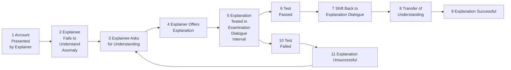

# A dialogue system specification for explanation

**Douglas Walton**

*Synthese* (2011) 182:349–374  
DOI 10.1007/s11229-010-9745-z

Received: 4 February 2010 / Accepted: 9 April 2010 / Published online: 22 April 2010  
© Springer Science+Business Media B.V. 2010

D. Walton (B)  
University of Windsor, Windsor, ON, Canada  
e-mail: dwalton@uwindsor.ca

## Abstract

This paper builds a dialectical system of explanation with speech act rules that define the kinds of moves allowed, like requesting and offering an explanation. Pre and post-condition rules for the speech acts determine when a particular speech act can be put forward as a move in the dialogue, and what type of move or moves must follow it. A successful explanation has been achieved when there has been a transfer of understanding from the party giving the explanation to the party asking for it. The dialogue has an opening stage, an explanation stage and a closing stage. Whether a transfer of understanding has taken place is tested by a dialectical shift to an examination dialogue.

**Keywords** Argumentation · Formal dialogue system · Artificial intelligence · Examination dialogue · Models of explanation · Scripts · MOPs · Scientific explanation

Dialogue models of argumentation of the kind developed in Walton and Krabbe (1995) are now proving their worth as tools useful for solving many problems in argumentation studies, artificial intelligence, and multi-agent systems. Many formal dialogue systems have been built (Bench-Capon 2003; Prakken 2005, 2006), and through their applications (Verheij 2003), we are getting a much better idea of the general requirements for such systems, and how to build them. Reed (2006) has provided a dialogue system specification that enables anyone to construct a formal dialogue model of argumentation by specifying its components and how they are combined (Reed 2006, p. 26). This dialogue system specification provides a more convenient method for setting up formal dialogue systems of kinds that are useful for modeling argumentation in computing and that have been built and are currently being built for various applications. According to the argument of this paper, a variant on Reed’s dialogue system specification can also be applied to dialogue systems for explanation, and it offers a logical and philosophical basis for the notion of explanation employed in case-based systems of explanation (Leake 1992; Schank et al. 1994).

Dialogue models of explanation in computing are based on examples of dialogical sequences of questions and answers in which one party tries to explain to another how some machinery works (Cawsey 1992; Moore 1995). The dialogues incorporate user feedback that enables the explanation process to recover from misunderstandings. A more abstract prototype dialogue theory of explanation CE has been built in Walton (2007a). According to this theory, both asking for and providing an explanation consist of special types of moves (speech acts) that have pre and post condition rules in dialogues. This paper builds on these models, and extends them in a particular direction, especially by solving one central problem. The problem can be posed by getting a first rough idea of how the sequence of events in the dialogue system of explanation will generally run.

- Both parties know about some account, a coherent story about an event, for example, and understand the account generally.
- However, the one party finds an anomaly in the account, something that she does not understand, and assumes that explainer understands it and can explain it.
- She asks a question requesting an explanation, and he replies by attempting to give an explanation.
- Either the explanation is successful in transferring understanding or not.
- If it is successful the dialogue stops.
- If the attempt is not successful, the dialogue may stop, but it may also be useful for it to continue, depending on the circumstances at that point.

One of the main problems concerns the last event in the sequence. We don’t want the dialogue to go on forever, but we want to leave it open enough so that the explanation offered can be tested and repaired, so it might eventually culminate in a successful explanation. So how do we set the right conditions for the termination of the dialogue so that this need for flexibility can be accommodated by conditions for closure that are precise and workable? This will be the main problem set for the specification system for explanation dialogue built in the paper, but because of the fundamental and interdisciplinary nature of the topic, other problems arise for which there is little space for discussion. A short account of the main unsolved problems is given at the end.

## 1 Two examples

We begin this section with two examples of explanations of the kind that might be classified under the category of everyday explanations that we all encounter and use on a daily basis in conversational exchanges. These examples give the reader an idea of the target we are aiming at in providing a theory of explanation.

The first example, an explanation by a science teacher to an audience of students (Unsworth 2001, p. 589), is used in science education. The explanation assumes that the students can be expected to know that coal is widely used as an energy source, that it is black and fairly hard, and that it is found in the earth. It also assumes that the students may not be familiar with the process of how coal is formed in the earth. Here is the explanation given by the teacher to the students: “Coal is formed from the remains of plant material buried for millions of years. First the plant material is turned into peat. Next the peat turns into brown coal. Finally the brown coal turns into black coal”. The explanation is concise, but it relies on some other implicit elements as well, in addition to the one already mentioned. It is assumed that the students know what coal is, that they know what plant material is, that they know what peat is, and that they know that one material can change into another in the earth. The anomaly for the students that gives rise to their lack of understanding is that they also know that plant material is soft and brown, whereas they know that coal is hard and black. How could something that is hard and black come from something that is soft and brown? It is this anomaly that provokes the need for an explanation. Showing the intervening link of the peat helps the students come to understand enough about the process so that the anomaly is resolved. If not, and they ask further questions, very likely the science teacher can tell them more about the process, assuming that he or she has further scientific knowledge about the subject they lack.

In the second example, somebody asks why the radiators are usually located under windows in a room, when windows are the greatest source of heat loss. The following explanation is offered.

> The windows are the coldest part of a room and when air in the room comes in contact with them, it falls to the floor. The cold air from the window is heated when it passes the radiator, then it rises and a moving current of air continuously circulates around the room. If the radiator were placed against an inside wall, that inside area of the room would stay warmer than coldest part of the room, the area where the windows are. We would have a noticeable temperature difference in the two areas that would not be comfortable for those in the room.

Here again, the explainer assumes that the two of them share common knowledge about many implicit assumptions not stated in the explanation as given. For example, the explainer assumes that the questioner already knows that when warm and cold air are combined in an enclosed space, the warm air tends to rise and the cold air tends to fall. The question presents an anomaly. If the windows are the greatest source of heat loss, then putting the radiators under the windows in a room would seem to be wasteful of energy. So why is it so commonly done? To grasp the anomaly, you have to be aware of the common knowledge that building practices generally avoid doing things that are wasteful of energy. The respondent, in his explanation puts forward a connected account showing how placement of the radiator under the window in a room generally leads to a convection current that circulates the warm and cold air around the room, mixing it together and providing a moderate temperature throughout the room that makes it comfortable for the people in it. Just as in the first example, the person offering the explanation expects that the person to whom the explanation was directed already knows quite a bit about a kind of situation familiar to both of them. The question expresses an anomaly posed by the situation of the hot radiator under the window making a lot of heat wasted, if the windows are the greatest source of heat loss. This doesn’t make sense because conservation of energy is a well-known goal in designing human habitation. Unnecessary heat loss is a bad thing, and so why the normal placement of radiators would lead to such apparently unnecessary heat loss is puzzling. The explanation solves the puzzle by giving an account of heat circulation in a room, showing that the heat loss is not as great as the questioner initially appeared to assume, and that putting the radiators elsewhere in the room would have negative consequences.

The aim of this paper is to build a dialectical system of explanation primarily meant to be applicable to everyday examples like these two out of the following components.

- **Opening Move:** this move starts the explanation process when a request for an explanation is made by one party.
- **Speech Act Rules:** these rules define the different speech acts (kinds of moves) that are allowed in the dialogue.
- **Pre and Post Condition Rules:** these rules determine, respectively, (a) the conditions under which a speech act can be put forward as a move in the dialogue, and (b) which type of move (or moves) must follow it.
- **Success Criterion:** it determines when an explanation is successful, i.e. when transfer of understanding can be taken to have been achieved.
- **Closing Move:** this point occurs either when the explanation that was offered is successful, or when no explanation can be given, and therefore the dialogue should end. The former occurs when the dialogue has proceeded through a testing stage (if required) showing that the success criterion has been met.

As indicated by the success criterion, a successful explanation has been achieved when there has been a transfer of understanding from the party giving the explanation to the party asking for it. The purpose of offering an argument to another party is to give the other party a reason to accept a claim doubted by that other party. It is a proposition that is at issue, or is unsettled. The purpose of offering an explanation is to help the other party who indicates by his questioning that he doesn’t understand something. If the explanation is to be helpful, it should help the questioner to come to understand something that he did not understand before. A successful explanation should make the questioner come to understand, by relating what he fails to understand to what he already understands. This statement of the goal of an explanation is a normative ideal, however. In real instances one party can mislead the other by giving an explanation that she knows to be wrong, or by accepting an inadequate explanation. Alternatively the party who receives the information may say she understands, or may even think she understands, but be wrong. It is assumed in the model that both participants will follow rules for co-operative dialogue, but as we will see, this Gricean assumption can be violated in real instances of explanations, and so real cases need to be tested for success.

But there are some hard questions posed by this way of defining the notion of explanation. How is it to be determined when such a transfer has taken place? What is understanding? This question seems like an especially hard one, as it could be rephrased as, ‘How can we understand understanding?’ Another question is how it can be tested whether an explanation is successful.

There are some important limitations to the scope of the paper. One is that there is not enough space to apply the system to an extensively developed set of case studies of real explanations found in texts of every day discourse of the kind that can be found in Cawsey (1992), Moore (1995) and Leake (1992). The other is that although studying explanations in special fields is an important part of the topic, there is no space here to include topics like scientific explanation and historical explanation. However, in the problems for further research section, there are suggestions for further research on these matters, and some problems are posed that suggest how to extend the findings of the paper in these directions.

## 2 Basic components of an explanation dialogue

Von Wright (1971) described explanations that convey understanding of an action or event. Understanding, in this sense, should not be taken to refer merely to a feeling of personal confidence that one has understood something. Since then the notion of understanding has become a component in case-based explanation in artificial intelligence (Schank 1986; Schank and Abelson 1977; Schank and Riesback 1981; Schank et al. 1994). These case-based models of explanation are dialectical in that they involve a transfer of understanding between two parties who can communicate with each other. They also involve a sense of ‘understanding’ that is reconstructive in the sense that one party in a dialogue can use understanding of familiar situations to fill gaps in the understanding of another. In this sense, understanding should be taken to have a dialectical meaning that can be modeled in a framework of two parties reasoning together who share some common knowledge about how things normally go in stereotypical situations. To grasp this dialectical sense of understanding, we look to the formal dialogue models used to represent various aspects of argumentation (Reed 2006).

To grasp how transfer of understanding can be modeled in a formal rule-governed dialogue structure, we need to build on Hamblin’s notion of the commitment store of a participant in a dialogue as analyzed in Walton and Krabbe (1995). As each partner in a dialogue makes a move, statements are inserted into his/her commitment store, or deleted from it. For example, if a party asserts statement $A$, then $A$ is inserted into her/his commitment set. A commitment store is basically just a set of statements, but inferences can be drawn from these statements representing implicit commitments. If an agent is committed to one statement, then the other party to the dialogue can often assume justifiably that he must be committed to other related statements as well. Of course, she can always ask him. But in many cases she can assume that he is committed to some statement indirectly, based on what he said. For example, suppose Bob went to a pizzeria and ordered a pizza. It can normally be assumed that he is committed to paying for the pizza before he leaves the pizzeria. Also, the retraction of one commitment often requires a stability adjustment, meaning that other statements implying this commitment will also have to be retracted in order to preserve consistency (Walton and Krabbe 1995, pp. 144–149). In a rigorous persuasion dialogue (RPD), the moves and responses are restricted tightly by the rules so that what is allowed is precisely indicated as a small number of options at each move. For example, only yes–no questions can be asked, and the only answer allowed is yes or no. In a permissive persuasion dialogue (PPD), participants have more choices in what kinds of moves they can make at each turn, and how many things they can say at a given move (Walton and Krabbe 1995, p. 126). Also, responses to a previous move are less strictly determined. For example, a party may be allowed to put forward an argument and ask a question at the same move. In either type of dialogue, commitment sets do not always have to be consistent, but if one party’s commitment set can be shown by the other party to be logically inconsistent, the first party needs to remove the inconsistency, and perhaps also retract other commitments related to it.

The rules governing the operations of commitment sets in the Walton and Krabbe systems are used as a basis in this paper to show a way toward representing transfer of understanding in an explanation dialogue. At the beginning of an explanation dialogue, each party is assumed to have a knowledge base that operates more or less like a commitment store in an argumentation dialogue. Each knowledge base is a set of statements, including particular statements and general statements that can act as rules to draw inferences by applying to other statements. The participants must also share a common knowledge base containing general and particular common knowledge about the event that is to be explained. This common knowledge base contains common-sense procedural knowledge that enables a language user to understand how things typically happen in stereotypical situations, enabling her/him to fill in missing elements not explicitly stated in a given text of discourse.

These commonly known normal ways of doing things in familiar situations were codified in early work in AI (Schank and Abelson 1977) using what they called scripts, based on the theory that much common sense reasoning is based on unstated assumptions in a text of discourse that can be added in to fill gaps to make chains of reasoning explicit. Their standard illustration is the restaurant example, consisting of the following set of seven explicit statements. (1) John went to a restaurant. (2) The hostess seated John. (3) The waitress gave John a menu. (4) John ordered a lobster. (5) He was served. (6) He left a tip. (7) He left the restaurant. The account implicit in this set of statements can be made explicit by filling in gaps by drawing plausible inferences. We can infer defeasibly that lobster was listed on the menu. Maybe it was a special item not listed on the menu, and the waitress told John about it. Still, from statements 3 and 4 in the list, we can derive the implicit statement by inference that lobster was listed on the menu. Normally restaurant customers get their information about what is available from the menu they are given. It is also reasonable to infer defeasibly that John ate the lobster. We can fill in gaps by inserting implicit statements based on implicit assumptions about the normal ways of doing things when a person goes to a restaurant.

A more flexible way to represent familiar routines that represent common knowledge is to use smaller modules called MOPs, or memory organization packages (Schank 1986). These also represent stereotyped sequences of events, but are smaller than scripts and can be combined in a way that is appropriate for the situation when they are needed. For example, the space launch MOP includes a launch, a space walk and a re-entry (Leake 1992, p. 73) as parts of a package of connected events. MOPs are used in case-based reasoning (CBR), a pragmatic approach to explanation used in AI. CBR is the process of solving new problems based on the solutions of similar past problems. A mechanic who fixes an engine by recalling the cases of another car with a similar problem uses CBR. Scripts and MOPs can be used to build or amplify what is here called an account or is often called a story, a connected sequence of events or actions that hangs together, is ordered as a sequence, and that contains gaps that can be filled in.

A special type of account commonly found in everyday explanations is that of the anchored narrative (Wagenaar et al. 1993) in their theory of anchored narratives. If a questioner raises doubts about such an account, the answerer can support the acceptability of the account by giving reasons or “anchors” that ground the account in some independent facts or considerations that support it. The notion of an anchored narrative is more complex than that of a script, because it also involves justifying parts of the account that are questionable, or may even be dubious. In such a case, the explanation that was given may not only need to be filled out by making implicit parts of it explicit, some parts of it may have to be justified by producing arguments to back them up. Here we are dealing not just with explanations, but also with arguments used to support an explanation. This aspect will turn out to be important later.

Each participant’s understanding of the anomaly being discussed will change and evolve over the course of a dialogue. At the beginning of an explanation dialogue both participants share a common knowledge base containing the MOPs needed for the explanation queries and attempts that will follow. As the part of the dialogue where the explanation is asked for and provided proceeds, MOPs will be brought forward from the knowledge base that was there at the beginning. The MOPs are inserted for use by the participants and deleted when they are not is use. Hence they operate in a way comparable to the way that commitment stores operate in an argumentation dialogue.

The MOPs at the beginning of a dialogue represent the way things can normally be expected to go in kinds of situations that are familiar to both parties. During the later part of the dialogue one party puts forward an account of something that happened, a kind of story that may or not be true in reality, but that neither party wants to dispute. The other party may find something puzzling in the account, something that does not look normal or quite right, and ask for an explanation of the perceived anomaly. As the dialogue proceeds, statements will be inserted into or deleted from each party’s knowledge base as each of them makes moves in the dialogue. What triggers the need for an explanation is that one party fails to understand something in the account the other is taken to understand. Then the other party is expected to amplify the account in a way that will provide the required understanding.

CBR explanation systems have already been implemented that roughly fit the dialogue framework so far sketched out. For example, ACCEPTER (Leake 1992) is a computer system for story understanding, anomaly detection and explanation evaluation. Explanations are directed towards filling knowledge gaps revealed by anomalies. ACCEPTER has two special features (xii). (1) Explanations are built from uncertain inferences based on plausible reasoning. (2) Context (including explainer beliefs and goals) is crucial to explanation evaluation. The examples of stories processed by ACCEPTER include the death of a race horse, the death of a basketball star, the explosion of the space shuttle Challenger, the recall of Audi 5000 cars for transmission problems, a fictional story about a lame racehorse that wins a race, and an account of an airliner that leaves from the wrong departure gate (Leake 1992, p. 38). Although ACCEPTER fits some parts of the explanation dialogue system built below, it does not fit all of them. Some problems in building the system will especially bring out features that arguably do not fit with ACCEPTER.

In this paper, the aim is not to build a formal dialectical model representing any particular type of explanation, nor is it to build an implemented explanation system for computing like ACCEPTER. Rather the aim is to build a general stencil or format, a dialogue system specification for explanation. Reed (2006) has already specified the general requirements for a dialogue system specification as follows. A dialogue is a set of moves form a first one to a last one, where the two parties (in the simplest case) take turns making moves. The system needs to set out what locutions (speech acts) are permitted for the participants to make at each move. The pre-conditions are the conditions that must be met before one of the locutions can be legally uttered. The specification also needs to set out conditions defining what counts as an acceptable reply (next move) to any given type of move. These are called the post-conditions of a move. A dialogue system can be captured completely according to Reed (2006, p. 26) by specifying the pre-conditions and post-conditions of every possible locution, along with two other factors. One is the set of rules governing the participants’ commitment stores and the other is a list of the termination states of the dialogue: “Pre and post conditions can be completely specified by listing those dialogic obligations, commitment store entries and structural conditions that their locutions depend upon or establish”. Reed’s specifications are intended to apply to formal dialogue systems for argumentation, and the question is whether comparable conditions can be adapted to a dialogue system for explanation.

We model all the types of dialogue as having three stages, an opening stage, an argumentation stage and a closing stage. The model of explanation dialogue proposed here will have three corresponding stages, an opening stage, an explanation stage and a closing stage. The goal of an explanation type of dialogue is for there to be a transfer of understanding from the one party to the other. At the opening stage, the participants agree to take part in a certain type of dialogue, and to follow the rules and conventions of the dialogue, which they both understand and accept. At this stage, it should be clear, for example, that they are engaging in an explanation dialogue, as opposed to some other type of dialogue like an argumentation dialogue, or some dialogue in which information is simply to be exchanged. During the explanation stage, a request for an explanation is made, and then the other party responds to the request. Following these moves, the two parties make other kinds of moves that are ideally supposed to lead to the closing stage, where the explanation is judged to be successful or not.

In the explanation dialogue system CE of Walton (2007a), the closing stage had two rules. The first states that if the explainee makes the reply ‘I don’t understand’ in response to an explanation offered by the explainer, the dialogue can continue. The second rule states that if the explainee makes the reply ‘I understand’ in response to an explanation, the dialogue ends at that move. This attempt to provide closure rules was based on the assumption that the criterion for the successful completion of the dialogue is the explainee’s being satisfied with the explanation given by the explainer. The problem with this criterion is that the explainee could be faking, or could simply be mistaken. Even though he says he now understands what he formerly did not, this may simply not be true. Even though he has the psychological feeling that he understands, it may well be that he does not really understand the explanation that was offered. In other words, we need a better test for the success of an explanation other than its being acceptable or feeling right to the explainee.

## 3 The shift to examination dialogue

Scriven (1972, p. 32) provided a different way of testing the success of an explanation in the following quoted remark, expressed in the form of a dialogue.

> How is it that we test comprehension or understanding of a theory? We ask the subject questions about it, questions of a particular kind. They must not merely request recovery of information that has been explicitly presented (that would test mere knowledge, as in knowing the time or knowing the age of the universe). They must instead test the capacity to answer new questions.

Based on this remark, we now formulate Scriven’s Test: the success of an explanation is judged by the explainee’s capacity to answer new questions, shown in an extension of the dialogue sequence where probing questions are put to the explainee.

Using Scriven’s test for the success of an explanation, the closure rules for CE need to be modified. The explainee needs to show real understanding, and not merely claimed understanding. But how is real understanding to be judged? How can Scriven’s test be implemented in some method that would tell us when real understanding has been achieved so that the explanation can be judged to have been successful? The proposal made here is to use something called an examination dialogue. The examination dialogue is embedded into the original explanation type of dialogue to provide a continuation of it in which the explanation offered and accepted in the explanation is tested.

Examination discourses (*perastikoi logoi*) were defined by Aristotle (1928) in *On Sophistical Refutations* (165b4–165b6) as consisting of questions and replies designed to test an answerer’s claims to knowledge. Such a dialogue is “based on opinions held by the answerer and necessarily known to one who claims knowledge of the subject involved.” The aim of this kind of dialogue, according to Aristotle (*On Sophistical Refutations* 172a33), is to “attempt to test those who profess knowledge.” Socrates use of his skills of examination in the Platonic dialogues provides the classic examples. Lawyers are familiar with the use of examination skills in trials, for example in questioning an expert witness. But we also need to use examination skills in practical affairs of everyday life. For example, this type of dialogue takes place when you communicate with your physician, or other expert advisers, when they give you advice or recommend a particular course of action when you are trying to decide what to do.

An analysis of the structure of examination dialogue was presented in Walton (2006). Examination dialogue was shown to have two goals, the extraction of information and the testing of the reliability of this information. The first goal is carried out by the asking of questions in order to obtain information from the respondent, and by an exegetical function used to obtain a clear account of what the respondent means to say. The testing goal is carried out with critical argumentation used to judge whether the information elicited is reliable. To perform this function, the information is tested against the respondent’s other statements, known facts in the case, and other information thought to be true. This type of dialogue was shown in Walton (2006) to be most prominent in law and in both legal and non-legal arguments based on expert opinion. It was also shown to be central to dialogue systems for questioning and answering in expert systems in artificial intelligence. The examples studied also included exegetical analyses and criticisms of religious and philosophical texts as well as legal examinations and cross-examinations conducted in a trial setting.

Dunne et al. (2005) have built a formal model of examination dialogue in which one party, called the questioner, elicits statements from another party called the responder. The questioner has the aim of discovering the responder’s position on some topic being discussed. The questioner may do this either to gain insight into the responder’s understanding of the topic, or to expose an inconsistency in the responder’s position. Their system is designed to model the process in which one party scrutinizes the other party’s position to reveal internal inconsistencies in it. The examiner wins if she shows that the responder is committed to an inconsistency. This finding is achieved if the party being questioned replies that he denies a particular proposition or has no comment on it, but then the examiner shows that he has already revealed through his previous replies, or by evidence already accepted in the case, that he is committed to this proposition. According to their classification, examination dialogue is embedded in an information-seeking dialogue, and it is also seen, in some cases, as a prelude to persuasion dialogue (Dunne et al. 2005, p. 1560). Further work (Bench-Capon et al. 2008) has shown how commitment in examination dialogue can be modeled using value-based argumentation frameworks.

There can be dialectical shifts, or changes of context from one type of dialogue to another during the same continuous sequence of argumentation (Walton and Krabbe 1995). Consider the case of a contractor and a homeowner engaged in negotiation dialogue on a proposal to install a concrete basement in a house where the contractor begins to inform the homeowner about the city regulations on thickness of concrete for house basements. The standard example (Parsons and Jennings 1997) is the case where two agents have a joint intention to hang a picture. One has the picture and a hammer, and knows where the other can get a nail. They have a deliberation dialogue but can’t agree on who should do which task. They then shift to a negotiation dialogue in which the one agent proposes that he will hang the picture if the other agent will go and get the nail. There can be many different kinds of dialectical shifts of this kind in everyday discussions. In some cases, the new dialogue contributes to the success of the previous one. This kind of case is classified as a functional embedding of the one dialogue into the other. In other cases, the one dialogue is an interruption in the first one, but there is no serious problem because the first dialogue can easily be resumed once the second one has finished. However, in some cases, the advent of the second dialogue blocks the progress of the first one, or seriously interferes with it, and presents a serious obstacle to its progress. These kinds of cases are classified as illicit dialectical shifts (Walton and Krabbe 1995). However, the shift in examination dialogue from information-seeking to persuasion dialogue, of the kind noted by Dunne, Doutre and Bench-Capon, is an embedding of a highly typical and especially significant sort.

It was shown in Walton (2006) that examination dialogue can be of two basic types, and each one was named after terms used in Greek philosophy. Guthrie (1981, p. 155) drew a distinction between two types of examination, defining peirastic discussion as “testing or probing” and exetastic discussion as “examining critically”. Guthrie described the distinction between these two types of examination as a component of the Aristotelian method of dialectical discussion used for testing and investigating (p. 155).

In the peirastic type, the aim is merely get an account representing what the respondent is supposedly claiming, based on the available textual evidence of the discourse. In this type of dialogue the one party in a dialogue tries to make sense of what the other has said by interpreting and reconstructing what was said. The exetastic type is more argumentative. The questioner probes into the weak points of the answerer’s account, asking critical questions, and even questioning statements and implicit assumptions in the account. The aim of this process is to reveal implausible statements, internal inconsistencies, logical weaknesses and gaps in the account. Both types of examination can be used to test an explanation, but the second type is the harder test to pass.

The goal of an explanation dialogue is for there to be a transfer of understanding from the one party to the other. This goal defines what it is for an explanation attempt to be successful in that type of dialogue. It is assumed that both parties accept this goal as part of the opening stage when they agree to take part in an explanation. This implies that both parties desire a transfer of understanding to take place, and that both will be co-operative in politely following the rules of the dialogue. The general goal of an examination dialogue is quite different. Its twin goals are to extract information from the respondent and to test the reliability of this information. Examination dialogue is more adversarial than explanation dialogue. The examiner uses questions to test the reliability of the information obtained from the respondent. To carry out such a test one means at the disposal of the questioner is to try to trap the respondent into committing to an inconsistency, or into committing to a statement that is not plausible. These moves may make the respondent look foolish, or may even make it appear that the respondent is lying. Thus examination dialogue can become quite aggressive in some instances and even appear to be hostile. In some instances it even shifts to interrogation dialogue, an even more adversarial type of dialogue with different goals (Walton 2003).

An interesting aspect of explanation dialogue to study concerns cases where the dialogue goes wrong, and participants show that they are not well-intentioned or cooperative. These include cases where one party seeks to mislead the other, either by giving a false explanation or by accepting an inadequate one. They even include cases where one party seeks to maliciously waste the other party’s time and energy by being whimsical or acting capriciously. These same sorts of difficulties can occur in the applicability of explanation models to computer systems. The computer system, even if it is designed and created with good intentions, may be bug-ridden, and so act in a manner that appears irrational or malicious to an independent observer. In other cases, something disguised as an explanation may really function as a different type of dialogue. In recommender systems, something that is offered as an explanation to the user may really be an attempt to sell something to him by guiding him to the purchase of a product that is available online.

For these reasons, examination dialogue can provide a means of testing whether a transfer of understanding has really taken place or not in an explanation dialogue. If the explainee merely desires to convince the explainer that such a transfer has taken place when it has not, the explainer might be able to expose this failure this by probing into the explanation by shifting to an examination dialogue. On the other side, if the explainer seeks to confuse, to obfuscate, to prevaricate, or even to intimidate the explainee, rather than to transfer understanding, the explainee can critically probe into the offered explanation to reveal the defects and problems in it, and possibly even reveal it as spurious. Hence we now turn to a consideration of how explanations can be tested to see whether they are really successful or not, by means of a shift to an examination dialogue.

## 4 The shift model and two objections

We now return to Scriven’s test which says that the success of an explanation is judged by the explainee’s capacity to answer new questions, shown in an extension of the dialogue sequence where probing questions are put to the explainee. The hypothesis now put forward is that Scriven’s test can be implemented using the model of a dialectical shift from an explanation dialogue to an examination dialogue.

We begin with a rough outline of how a sequence of explanation dialogue typically runs in the system, and is evaluated in it as successful or not, as shown in Fig. 1.

The sequence begins with two requirements set at the opening stage of the dialogue. The first is the explainer’s offering an account, a set of assumed facts or accepted statements that are connected together by inferences (box 1 in Fig. 1). The second is that the explainee has found an anomaly in the account, something in it that he does not understand (box 2). Then (box 3) the explanation stage is set into motion, where the explainee asks a question asking for understanding of the anomaly, and the explainer offers an explanation that attempts to provide the requested understanding (box 4). Then (box 5) there is a shift to different type of dialogue in which the explainer’s comprehension of the explanation is tested by the explainer’s asking a series of probing questions designed to see if the explainee now understands the account or not. If the test is passed (box 6), it can be taken that the required understanding has been achieved, and the dialogue can then shift back from examination to the main explanation dialogue (box 7). If transfer of understanding has been carried out (box 8), the explanation can be evaluated as successful (box 9).

**Fig. 1 Typical dialogue sequence in Explan**

What happens if the test carried out during the examination interval is failed (box 10)? This shows that the explanation was unsuccessful (box 11). So now what should be done? Should the dialogue stop there? The solution shown in Fig. 1 is that the dialogue can be continued. The explainee can try to rephrase the question by indicating better what he failed to understand, in light of the previous examination dialogue (box 3). Then the explainer can offer a different explanation, modified to better suit the needs of the explainee (box 4). This explanation improvement cycle shown in Fig. 1, {3, 4, 5, 10, 11, 3}, can go around several times, as the two parties move collaboratively to better and better explanations until enough success has been achieved so that transfer of understanding has taken place. Failure occurs when the two parties remain stuck in this feedback loop because the examination dialogue keeps failing. In such a case, once the shift is made back to explanation dialogue, the explanation dialogue still fails. How can the parties break this failure cycle? An answer to this question will be given in the next section. Before getting there two objections to the shift model need to be replied to.

The first objection is that confining explanations to attempts to resolving anomalies is too narrow, because in some instances of explanations, there is no anomaly, just something that the explainee cannot understand. For example, suppose a person gets a financial statement from his investment counselor about the current worth of his investments in a mutual fund, and the document is so complex that he cannot understand it. There is no anomaly in the document that he can pinpoint, but still, he does not understand it. He phones the counselor and asks her how to make sense of what is in the document. Wouldn’t we say that he is asking for an explanation, and if so, doesn’t this show that an explanation does not have to be of an anomaly.

To deal with such cases, a distinction needs to be drawn between an explanation and a clarification, as distinctive types of dialogues (Walton 2007b). Both explanation and clarification involve transfer of understanding from one party to another in a dialogue, but explanation can be of an event, or of an anomaly of any sort. A clarification dialogue occurs where one party has made some move in the dialogue, a verbal move or speech act, and there is something that is unclear to the second party. Then the second party, at his next move, declares that he does not understand what was said, and then he requests that the first party provide the understanding needed to remove the obscurity. The purpose of a clarification dialogue is to achieve clarity about something that is unclear (obscure) to the one party. Removing obscurity is one kind of transfer of understanding, but there are many other kinds as well. While an explanation responds to a perceived anomaly, a clarification responds to an obscurity. Another difference is that an explanation arises from an account, very often of some reported event, whereas a clarification arises from a previous message in a dialogue. Schlangen (2004, p. 137) brings out this point very well when he writes that what examples of clarification have in common is that unlike normal questions, they are “not about the state of the world in general, but about aspects of previous utterances”. Further work needs to be done on giving an illustration, which appears to be different from explanation and clarification. These issues are included in the problems for further research section below.

The second objection can be posed by imagining the hypothetical case of a science teacher who is excellent in every way, except that his knowledge base is riddled with falsehoods. His students, who know no better, accept his explanations, and let’s even assume that when examined on them, they answer the questions well, showing that they understand the explanations the teacher offered. The objection that might be raised when considering this hypothetical case is that it shows that Explan makes the success of an explanation too explainee-relative. The objection suggests that in addition to the success conditions, truth conditions should need to be met in order to make an explanation a good one. The solution to this problem is provided by the shift from the explanation dialogue to the exetastic type of examination dialogue when required. In this type of dialogue, questions are raised on whether the statements in the given explanation are true, or factually accurate. An exetastic dialogue, like an anchored narrative, is argumentative. It probes critically into the weak points in an account. It requests justifications (supporting arguments) for claims made. For example in a scientific explanation, this kind of examination includes consideration of whether the explanation in question fits with existing data, including the use of experimental results to test the explanation. Another part of the answer to this objection comes from considering objections arising from a second problem.

## 5 The problem of the failure cycle

A third problem is how the Explan system can deal with the failure cycle displayed in Fig. 1 depicting the typical sequence of dialogue in Explan. Failure occurs when the two parties remain stuck in this feedback loop because the examination dialogue keeps failing. In such a case, once the shift is made back to explanation dialogue, the explanation dialogue still fails. How can the parties break this failure cycle?

The solution to this problem is to be found by incorporating a double dialectical shift from explanation dialogue to examination dialogue and then back again, and by providing a success criterion for the original explanation dialogue that can be achieved through the success of the intervening examination dialogue.

The problem of the failure cycle {3, 4, 5, 10, 11, 3}, shown in Fig. 1, occurs where the examination dialogue interval turns out to be unsuccessful at point 11 in the sequence. What should happen here? For example, in the science teaching dialogue on coal, suppose the student examines the explanation offered by the teacher as well as she can, and the teacher answers her questions as well as he can, but the examination dialogue fails to throw any light on the explanation offered. The student is not convinced that the teacher’s explanation has stood up to critical scrutiny and concludes that the teacher does not know what he is talking about. The teacher is convinced that the student has not asked the right questions in her examination interval and still has not understood how his explanation has resolved the anomaly she questioned in it. Perhaps keeping trying to reopen the examination dialogue might eventually lead to success, but there needs to be some sequence of moves leading up to closure to solve the problem of how to formulate the post-condition rules of Explan that were left open in Sect. 4.

The solution to the problem lies in more fully formulating the closure conditions for examination dialogue when such a dialogue is embedded in an explanation dialogue. The criterion suggested by Scriven’s test is that the explainee must have proved her capacity to answer new questions, but we now have to add to this test. For the examination dialogue to be good enough to be closed off before the shift, both parties have to have performed well enough. The explainee has to have asked the right questions to show that she has understood the explanation well enough to probe into it critically, and the explainer has to have dealt with questioning well enough to show that he really knows what he is talking about. When this has taken place in a given case is discussed in Dunne et al. (2005) and Walton (2006). In real cases, however, there are often practical limits on the process imposed by costs and circumstances.

The solution is provided by breaking the structure of an explanation dialogue into a characteristic sequence of fourteen substages leading to the closure of the explanation dialogue. The sequence is linear, up to substage 4, but then there is a choice point so that the sequence becomes a tree with two branches. The explanation dialogue can be closed off in two ways, depending on which branch is followed.

1. Explainer has put forward some account, a coherent story about event.
2. Explainee finds an anomaly in the account, and assumes that explainer understands it and can explain it.
3. Explainee asks for an explanation of the anomaly, and explainer replies by attempting an explanation.
4. Explainee is satisfied with the explanation or not. Either option can lead to a continuation of the dialogue.
5. If the explainee is not satisfied, she can ask further questions about the account.
6. This option leads to a continuation of the explanation dialogue where the explainer is questioned by the explainee.
7. If the explainee is satisfied, the explainer can ask further questions to test whether she really understands the account or not.
8. This option leads to a shift to an examination dialogue in which the explainee is questioned by the explainer.
9. If the examination dialogue is unsuccessful, then so is the original explanation dialogue.
10. The original explanation dialogue is now closed.
11. If the examination dialogue is successful, there is a dialectical shift back to the explanation dialogue.
12. The results of the gain in understanding can now be carried over to the continuation of the original explanation dialogue.
13. If the results of the gain in understanding from the examination dialogue are sufficient for a transfer of understanding of the kind required by the original explanation dialogue, the explanation is successful.
14. The original explanation dialogue is now closed.

According to this way of plotting the path of the explanation dialogue to closure, both parties need to have passed dialectical tests. Both need to have contributed to the examination well enough so that light is thrown on the understanding of both. The account of the explainer has to stand up to scrutiny, and the scrutiny undertaken by the explainee has to show that she understands how the account works, what its implicit elements are, and how they fit in with the parts explicitly stated. Also, both parties have to prove that they can critically evaluate the account by asking and responding to probing questions about what appear to be the weak points in it. Explan incorporates a modified version of Scriven’s test that takes both performances into account.

The solutions to these three problems proposed in Sects. 4 and 5 makes it possible to construct a dialogue system specification for explanation that meets the requirements set out above. As noted in Sect. 2, an explanation dialogue has three stages, an opening stage, an explanation stage and a closing stage.

## 6 The opening stage

For it to be clear that the two participants are starting an explanation dialogue, four requirements must be met. The first two are more general and the second two are more specific, requiring introduction of some other notions. The first requirement is that the two parties to the dialogue share understanding of some things, and especially that they share and accept some common knowledge about the way things normally work in some domain they are familiar with. The second requirement is that one party, called the explainer, is presumed to have understanding of something that the second party, called the explainee, lacks. In the example of the teacher explaining to students how coal is formed, it is presumed that the teacher has scientific understanding of this process and that the students do not. This example also shows that the situation is not so simple. For example, it is assumed that there is more than one student in the class. But to make as simple a structure as possible for the basic notions, the dialogue system specification assumes that there only two participants in a dialogue representing the roles of explainer and explainee. We need to stress though that in real cases of explanations, what is represented as one party in the dialogue may in fact be a large group.

The third requirement is that there has to be an account that both parties have access to. In the radiators example the explainer puts forward a connected account showing how placement of the radiator under the window in a room generally leads to a convection current that circulates the warm and cold air around the room, mixing it together and providing a moderate temperature throughout the room that makes it comfortable for the people in it. Normally in an explanation dialogue the account is given by the explainer to the explainee, but in any case, both of them have to have access to it. An account is a set of statements in which there are inferences from some statements to others but it needs to be stressed that there can also be implicit statements drawn by inference from the explicit statements. In the radiators example, the explainer assumes that the explainee already knows that when warm and cold air are combined in an enclosed space, the warm air tends to rise and the cold air tends to fall. Just as in the first example, the person offering the explanation expects that the person to whom the explanation was directed already knows quite a bit about a kind of situation familiar to both of them. In the dialogue system, accounts are based on scripts, MOPs or stories.

The fourth requirement for the opening stage of an explanation dialogue is that the explainee has to detect an anomaly in the account, something that doesn’t fit in with the account. An anomaly is something the explainee does not understand in an account, even though she understands the rest of the account. For example, it may be an inconsistency, or a statement in the account that appears implausible. The explainee’s question in the radiators example presents an anomaly. If the windows are the greatest source of heat loss, then putting the radiators under the windows in a room would seem to be wasteful of energy. So why is it so commonly done? To grasp the anomaly, you have to be aware of the common knowledge that building practices generally avoid doing things that are wasteful of energy. It would be anomalous for rooms to be normally configured with radiators under the window if, as it appears, this leads to wasteful heat loss.

## 7 The explanation stage

The explanation stage is initiated by the explainee’s putting forward a special type of speech act. There can be various kinds of explanation questions that ask for different kinds of explanations. However, the system Explan is meant to be a simple and basic dialogue system specification on which specialized and more complex systems can be built, and so there is only one kind of explanation speech act in it. It has the form ‘ExplanAnom $x$’, where $x$ is an anomaly in an account that has been given by the other party. The speech act ‘ExplanAnom$x$’ makes a request to the explainer to provide understanding concerning the anomaly $x$. The explanation dialogue is opened by the explainee’s putting forward the speech act ‘ExplanAnom$A_1$’, where $A_1$ is an instance of $x$. The dialogue proceeds to the second move when the explainer makes an attempt to explain the anomaly. At the third move, the explainee can accept the explanation or not. But other responses are also allowed. The explainee may still not understand what she needs to understand, and so she may have to ask further questions about aspects of the explanation that appear puzzling.

Moulin et al. (2002, pp. 174–176) showed that there are three kinds of explanations that are common in AI, trace explanations, strategic explanations and deep explanations. Let’s begin with trace explanations. In expert systems, the system produces an explanation in response to a user’s how or why questions by producing an execution trace, a sequence of inferences leading from statements in the knowledge base to the statement queried. Strategic explanations place an action in context by revealing the problem-solving strategy of the system used to perform a task. Deep explanations require two separate knowledge bases and a transfer from the system’s base to the user’s that fills in gaps in the user’s knowledge base. The system has to know what the user knows, to fill in the gaps. It is this third type that best fits the dialogue model.

A chain of inferences in an account is called a sequence of reasoning. Of the three kinds of explanations mentioned above, the simplest is the trace explanation, and we use this type as an illustration of an account here. In a trace explanation, a statement $A$ that has been queried is traced by chaining backward in a knowledge base to the set of facts (statements) and rules (of inference) in the knowledge base. $A$ is derived by a chain of inferences from the facts, where the process is viewed as forward chaining. Looked at in reverse, such a chain of arguments is an explanation. This kind of explanation fits the covering law model, as long as the inferences in the chain are only of the deductive or inductive sort. But there are other kinds of explanation. In other cases, an account can take the form of a script, an account that has gaps in it because not all the connections in the account are stated explicitly. These gaps have to be filled in by making assumptions about common knowledge shared by a speaker and hearer.

A speech act is a type of move made by one or the other party as a dialogue proceeds. One speech act is the request by one party to the other party to offer an explanation of an anomaly. For each type of move, there are pre-condition rules that set the conditions under which a party is allowed to make that type of move, and post-condition rules that set the allowable replies to each type of move by the other party. Generally, the participants take turns as follows. The explainee makes the first move by asking for an explanation, and then the explainer gets a chance to respond by offering one. If the explainer offers one, the explainee can simply accept it by saying ‘I understand’, but if she replies by saying she does not understand, she can then proceed to ask questions about it. At this point, the dialogue shifts to a different type of dialogue as explained in the section on the closing stage below.

### Speech acts allowed

**Assertion:** Putting forward a statement, $A, B, C, \ldots$, is a permissible locution, and truth-functional compounds of statement-letters are also permissible locutions.[^1]

**Factual Question:** The question ‘$A$?’ asks ‘Is it the case that $A$ is true?’

**Explanation Request:** The speech act ‘ExplanAnom$x$’ makes a request to the explainer to provide understanding concerning some anomaly $x$.

**Explanation Attempt:** a response to a previous explanation request made by the explainee that purports to convey understanding to the explainee.

**Inability to Explain Response:** ‘I can’t explain it’, concedes that the explainer has no explanation attempt at this point to offer of the statement asked about.

**Positive Response:** A response claiming that the hearer understands an explanation.

**Negative Response:** A response claiming that the hearer does not understand an explanation.

### Pre-condition rules

**Pre-condition Rule for an Explanation Request:** In order the speech act ‘ExplanAnom$x$’ to be put forward, the statements fitting in for the $x$ variable must constitute an anomaly.

**Pre-condition Rule for an Explanation Attempt:** The previous move by the other party must be a request for an explanation.

**Pre-condition Rule for an Inability to Explain Response:** The previous move by the other party must be a request for explanation.

**Pre-condition for the Positive Response:** The previous move by the other party must be an explanation attempt.

**Pre-condition for the Negative Response:** The previous move by the other party must be an explanation attempt.

### Post-condition rules

**Post-condition Rule for an Explanation Request:** An explanation request must be followed at the next move by an explanation response.

**Post-condition Rules for an Explanation Attempt:** An explanation response must be followed at the next move by the other party’s saying ‘I understand it’ or ‘I don’t understand it’.

**Post-condition for the ‘I understand it’ Response:** to be determined below.

**Post-condition for the ‘I don’t understand it’ Response:** to be determined below.

The last two post-condition rules are not formulated yet, because of a problem that arises in formulating the rules for the closing stage. This problem is solved in Sect. 8 once the rules for the closing stage have been formulated.

[^1]: Assertions include only statements (propositions), and do not include promises, commands, and so forth.

## 8 The closing stage

It appears that there can be two different ways of determining when the closing stage has been arrived at. On one view, the closing stage is reached when the explainer has offered an explanation and the explainee is satisfied with it. The dialogue system for explanation CE (Walton 2007a) was built on the following two rules for the success of an explanation attempt.

**CESR1.** If after any explanation attempt made, the explainee replies by saying, ‘I understand’, the explainer’s clarification attempt is judged to be successful.

**CESR2.** If after any explanation attempt is made, the explainee replies by saying ‘I don’t understand’, the explainer’s explanation attempt is judged to be unsuccessful.

These success rules are used in CE to define the closing stage of an explanation dialogue, based on the assumption that the closing stage is reached once the explanation attempt carried out in the dialogue is judged to be successful or unsuccessful.

The problem with this way of setting up rules for the closing stage is that in many of the most significant cases, determining success or failure on the basis of whether the explainee says she understands the explanation offered is not enough to close the dialogue. The “feels-right” explanation is often associated with bias (Trout 2002, pp. 223–228). On another view, the dialogue should only be closed when the explanation has been tested, and has been found to have passed the tests that should be required of it. Only then can it be said whether the explanation is truly successful or not. But what is the test? In science, ideally, the test is to collect all the data required to conclusively test the explanation experimentally. But for practical purposes, with many of the explanations we give in everyday conversations that are good enough for what is required, resources are not available for collecting more data necessary for a satisfactory tentative explanation to be offered. In many instances, for practical purposes, collecting more data to test the explanation further would be too costly, or would just not be useful because of the limitations of the present needs and circumstances. On this view, testing the explanation by critically probing into gaps and questionable parts in it, based on what is already known, would be good enough to provisionally accept it. Examination dialogue can fit either of these methods of testing. It can proceed by critical questioning in argumentation or by the collection and examination of further data, for example by experimental testing.

The context concerning what the purpose of the explanation is supposed to be plays a role in deciding which of the two views is applicable. If the context is that of a scientific inquiry, further testing by collecting of data may be the best criterion for closure. If the explanation is part of an everyday conversational exchange, conducting experimental tests or launching into a detailed scientific explanation might not be appropriate. These moves may even impede the transfer of understanding. Thus we should not take a ‘one shoe fits all’ approach to this problem.

In order to keep to the most general approach of building a simple system as a starting point for developing other more complex models of explanation dialogue, we have proposed a middle view between the two views outlined above. This view is tailored to seeing explanation as based on defeasible reasoning that leads to a plausible explanation based on the known facts, but is open to correction or improvement as more data is brought in to fill out an account or support it by external evidence. On this view, an explanation is successful if it is tested by the explainee’s critical questioning that probes into its weak spots, or by examining further data, and if it survives this testing process by answering all the questions satisfactorily. An explanation is unsuccessful if it fails this testing process.

The closure rules are meant to solve the problem of the failure cycle illustrated by the possibility of the feedback cycle {3, 4, 5, 10, 11, 3}, illustrated in the typical explanation sequence in Fig. 1, and the problem of the unsuccessful explanation in the example of the science teaching dialogue presented in Sect. 4. For an explanation dialogue to be successful, understanding has to be transferred from the explainer to the explainee. What is the evidence that this transfer has been achieved? It is to be found in the shift to an examination dialogue. However, as noted above, the need to test an explanation, and the extent to which it needs to be tested, vary with the context. In a science class, the anomaly may be posed by a simple misunderstanding that can be explained briefly, and that everyone is satisfied with. In a context of scientific research, the anomaly may be a wicked problem and the explanation of it may be lengthy, complex, and involve experimental testing. Thus the closure rules must allow for such pragmatic variations.

The closure rules need to fit the 14-step sequence that leads to closure set out in Sect. 5. If both parties are satisfied with the explanation offered, that can be the end of the dialogue. There may be no need to go into more depth. However, if either party is not satisfied, he or she can ask more questions, extending the dialogue. If the explainee is not satisfied, she can ask more questions, and may need to (step 5). The explanation should proceed in this direction, ideally until the explanation finally makes sense to the explainee. This may never happen, so in practice some limit will need to be set on the time or cost. The explanation is only successful however, if the anomaly is removed and the explainee understands what she asked about. If the explainer is not satisfied that the explainee really understands, then as shown at step 7, there may need to be a shift to an examination dialogue.

This way of handling explanation attempts suggests the following closure rules.

**Closure Rule 1:** If both parties are satisfied, the dialogue can be closed.

**Closure Rule 2:** If the explainee is not satisfied, she should ask further questions, continuing the dialogue until it has reached a point where either (a) she is satisfied or (b) her questioning must be closed off for practical reasons.

**Closure Rule 3:** If the explainer is not satisfied, there should be a shift to an examination dialogue in which the explainee’s understanding of the explanation is tested.

**Closure Rule 4:** The examination dialogue terminates when either (a) the explainer is satisfied or (b) his questioning must be closed off for practical reasons.

**Closure Rule 5:** When the examination dialogue ends, there is a shift back to the continuation of the original explanation dialogue.

**Closure Rule 6:** The explanation dialogue terminates when either (a) there has been a transfer of understanding of the kind required or (b) it must be closed off for practical reasons.

These rules are meant to be realistic, in that they allow for the possibility that the dialogue may need to be terminated even though it is not known whether it has been successful or not. The examination dialogue tests the understanding of both parties, and ideally expands it, so that these gains can be transferred into a better explanation.

One might still want to object that these closure rules might work well enough for everyday conversational explanations and practical explanations, where the issue is not how deeply either party understands. A good enough explanation to do the job, or to move the conversation forward, is all that may be required. However, one might object that in cases of scientific explanations, not in a teaching setting necessarily, but in the context of scientific research and investigation, objective standards are necessary. Whether each party is individually satisfied is not a high enough standard. A way to respond to this objection is to introduce a third party into the dialogue.

According to the dialectical model proposed by Pera (1994, p. 133), the structure of scientific argumentation is a dialogue structure with three participants, an inquiring community $C_1$, nature $N$, and another community $C_2$. $C_1$ is an inquirer who asks a question, poses a problem, or puts forward a hypothesis $h$ and tries to support it with observations or experimental results. $N$ provides data $e$. Then a discussion takes place between $C_1$ and $C_2$ in a framework $F$ that Pera calls “the factors of scientific dialectics”. $F$ can perhaps be seen as a set of dialogue rules appropriate for the discussion. These rules define what counts as evidence, what sorts of argument are allowed as relevant, and what the standards of proof are. Because of the importance of debate in this model, and because of the role of “dialectical techniques of confutation and persuasion” in it, Pera (1994, p. 133) says he will call it the dialectical model.

Pera’s dialectical model provides an elegant way of extending the basic two-party dialogue structure of the Explan system specification to a three-party dialogue structure that could be used to model scientific explanation. However, the reader will recall that it is beyond the scope of this paper to use the Explan system to build more complex dialectical systems that can be used to model more specific contexts of explanation like scientific explanation. This task must be left as a problem for future research.

## 9 Problems for further research

The following problems for further research are singled out as the most important.

1. How can Explan help us to determine whether something in a text is an argument or an explanation?
2. How can we build a useful typology of types of explanations for use in Explan?
3. How well does Explan apply to explanation of human actions, for example in history and law?
4. Can Explan model understanding in science, and apply it to case studies of scientific explanations?

With respect to problem #1, it can be said, broadly speaking, that the goal of an argument is to remove doubt, whereas the goal of an explanation is to convey understanding of an anomaly in a given account. But how do we determine whether the purpose of some discourse fits one or the other of these goals? We have to examine the text of the case carefully for textual indicators of the kind studied by Snoeck Henkemans (1992). However, the key to doing this lies in the pre and post-conditions for the speech acts. An argument is not only put forward in a different way from an explanation, but is reacted to in a different way as well. How can the Explan system be helpful for this job, when it is carried out in a way comparable to the work on identifying arguments in texts?

The aim of this investigation was not to provide a typology of different types of explanations. There was no space here for this project, even though it is a prerequisite for building formal dialogue systems based on different kinds of explanation questions, like how questions, why questions, questions asking about human actions, and so forth. With respect to problem #2, it needs to be said that there are typologies of explanation questions, but there is little agreement among them, and none of them seems especially useful for developing the Explan system in this direction. Perhaps the reason for the heterogeneous variety is that they come from different fields, like logic, computing, linguistics and psychology, and they seem to have different purposes in mind for using explanations. It can be suggested, however, that a good place to start is the categorization scheme for types of explanations given by Kass and Leake (1987), based on and their large collection of examples of anomalies and explanations.

The classification of different types of explanations given in the categorization scheme of Kass and Leake (1987, pp. 3–4) provides a hierarchy of types of explanations divided at the top level into three types of explanations.

- Explanations involving intentional actions, for example an explanation of a person’s decision to drop out of school. Such explanations involve plans and goals.
- Explanations involving material forces, for example, an explanation of an unexpected snow storm caused by material forces. This type of explanation also includes cases like device problems and the lack of a resource necessary for an event to take place.
- Explanations involving social forces, for example an explanation of an increase in the crime rate. This type of explanation does not involve plans and goals, and excludes explanations of goal-directed actions by institutions. It involves behavior that results from the interactions of many independent agents whose actions are not coordinated.

Kass and Leake (1987, p. 3) note, however, that in some cases more than one type of explanation may be applicable. For example, if we are trying to explain why the government wastes money, we might offer an intentional explanation, like “they think they can solve every problem by throwing money at it”, or we might offer a social explanation, such as “the interaction of branches of government causes huge overhead”.

This categorization scheme, along with the many examples of everyday explanations collected by Kass and Leake is a good place to begin the study of different types of explanations. The category of intentional actions brings us to problem #3.

There is huge literature on problem #3, both in computing, especially in the field of planning, and in philosophy, especially philosophy of history. Collingwood (1946) called the simulative process used by the historian “re-enactment” (Dray 1995). Dray (1964, pp. 11–12), described the components of Collingwood’s theory of re-enactment: in these words: “Clearly the kinds of thoughts which Collingwood’s theory requires are those which could enter the practical deliberations of an agent trying to decide what his line of actions should be”. There are some nice resources in argumentation and computing that arise from the argumentation scheme for practical reasoning (Atkinson et al. 2006). Explanation of human actions, of the kind especially common in history and law, is typically based on goal-directed reasoning. One agent explains the actions of the other by attributing presumed goals to the other. Goal-directed or means-end reasoning, called practical reasoning, is used in planning in AI (Bratman et al. 1988). Value-based argumentation frameworks employ schemes for practical reasoning in a dialogue framework (Bench-Capon 2003).

Pera’s dialectical model of science, as noted at the end of Sect. 8, provides an elegant way of extending Explan to confront problem #4, but any attempt to move in the direction of applying Explan to scientific explanations also takes us to the problem of precisely defining the notion of scientific understanding. In a case of scientific explanation, say explaining friction as a macro-phenomenon by talking about the micro-properties of surfaces, “it is clear that we are now constrained to explanations using the primitives and laws of physics” (Scriven 2002, p. 50). It is the phenomena of everyday experience that need to be understood in a special way, and it is the laws and primitives of physics that are taken to be understood. Hence, as Scriven points out, scientific explanation is not reduction to the familiar, but transfer of a special kind of understanding required by a special kind of explanation.

There is a growing literature on helping us to better understand the special notion of understanding in the natural sciences (Friedman 1974; Trout 2002; Moulin et al. 2002). Finocchiaro (1980) has used case studies of scientific discovery to show how scientific explanation can be viewed as a dialectical process of growth of understanding as questions are asked and hypotheses are offered as answers that require experimental testing. The Explan system offers a syntactic structure for explanation dialogue by specifying the form each move must take at each of the three stages of such a dialogue, and by giving pre and post-conditions for each move in such a dialogue, but it does not yet define a precise semantics for the system. A semantic structure is also needed that specifies the units of understanding, and how they are sent as messages in the dialogue from the one party to the other. So far this structure has not yet been provided, in any precise way. The best we have been able to do so far is to use existing resources of case-based reasoning to model in a general way how understanding is successfully transferred. This process is successfully carried out when an anomaly in an existing script is queried by one party and then resolved by the other party by patching up the existing script to fit it all together better so that it now makes sense to the questioner. The outcome should be a change from a script that was previously fragmented (in the understanding of the questioner) to a script that is fitted back together.

It can be noted that legal explanations also have a three-party dialogue structure consisting of the pro side, the contra side, and a third party trier, a judge or a jury. The third party listens to the arguments put forward and queried by the other two parties and weighs them as weaker or stronger. In audience-specific value-based models of persuasion dialogue (Bench-Capon et al. 2007), the audience is identified with an ordering of values. A given argument is assessed by the audience in accordance with its preferred values. In Gordon and Walton (2009), the audience weighs the relative strength of arguments presented to them, and an argument evaluation structure associates an audience with a stage of dialogue and assigns proof standards to propositions. When Explan is extended by adding a third party audience, this audience uses standards for the success of an explanation to judge whether the given explanation is more satisfactory or less satisfactory. Precisely how legal explanations can best be modeled in three-party dialogues along these lines, however, remains a problem for further research.

## 10 Conclusions

This paper has defined the components needed for a dialectical system specification of explanation discourse called Explan, and showed how to combine these components to produce the system specification. It offers a dialogue structure with three stages, an opening stage, an explanation stage and a closing stage. One problem encountered was that of the failure cycle that can occur in the closing stage, and this problem was solved by carefully specifying the rules for the closing stage. Another problem was to devise a means for testing the success of an explanation. This problem was solved by embedding an examination dialogue into the explanation dialogue. In legal explanations in a courtroom setting, there are rules for examinations and cross-examinations. In scientific explanations, the process of examination involves close scrutiny of the data provided by nature, and the designing and running of experiments to test a hypothesis. By solving these problems, the system specification builds a process model of explanation in which two parties take turns making moves according to procedural rules. The rules set out a normative model for explanation so that any example of a real explanation can be evaluated as reasonable or not according to standards set by the stages, the rules, and the goal of the dialogue. For example, circular explanations can be evaluated as unsuccessful on the basis that they fail to transfer understanding in the way required of a successful explanation in the Explan system.

There has been not enough space to test the Explan system with many examples of explanations, but resources for such a testing process have been given by Kass and Leake (1987). They built up a corpus, the Yale explanation corpus of 170 anomalies, with one or more explanation for each, yielding a total of over 350 explanations.

The model is a system specification that can be used to build specific dialectical systems meant to be applicable to realistic cases of explanations of different kinds. The intent is to produce a dialogue system specification that is very general so that it can accommodate many different formal models of explanation dialogue that fit the general pattern of the system, and many different dialectical contexts of use, like everyday conversational explanations, scientific explanations, explanations in special scientific fields like computing, historical explanations, legal explanations, and so forth. Because of the extreme generality of such a project, and because of its wide breadth of application to so many different kinds of explanations in different contexts and fields, many unsolved problems have had to be left for future research. Still, the Explan system specification provides a way of moving forward in a direction that is different from the traditional one but that is attracting more and more interest in the past few years.

## Acknowledgements

This work was supported by a Research Grant, ‘Argumentation in AI and Law’, from the Social Sciences and Humanities Research Council of Canada. I would like to thank the members of CRRAR for comments made when I read an earlier draft of this paper to them, especially Steven Patterson and Jin Rongdong, whose comments led to some especially significant improvements.

## References

Aristotle. (1928). *On sophistical refutations*. Loeb classical library. Cambridge, MA: Harvard University Press.

Atkinson, K., Bench-Capon, T. J. M., & McBurney, P. (2006). Computational representation of practical argument. *Synthese, 152*, 157–206.

Bench-Capon, T. J. M. (2003). Persuasion in practical argument using value-based argumentation frameworks. *Journal of Logic and Computation, 13*, 429–448.

Bench-Capon, T. J. M., Doutre, S., & Dunne, P. E. (2007). Audiences in argumentation frameworks. *Artificial Intelligence, 171*(1), 42–71.

Bench-Capon, T. J. M., Doutre, S., & Dunne, P. E. (2008). Asking the right question: Forcing commitment in examination dialogues. In P. Besnard, S. Doutre, & A. Hunter (Eds.), *Computational models of argument: Proceedings of COMMA 2008* (pp. 49–60). Amsterdam: IOS Press.

Bratman, M., Israel, D., & Pollack, M. (1988). Plans and resource-bounded practical reasoning. *Computational Intelligence, 4*(3), 349–355.

Cawsey, A. (1992). *Explanation and interaction: The computer generation of explanatory dialogues*. Cambridge, MA: MIT Press.

Collingwood, R. G. (1946). *The idea of history*. Oxford: Clarendon Press.

Dray, W. (1964). *Philosophy of history*. Englewood Cliffs: Prentice-Hall.

Dray, W. (1995). *History as re-enactment: R. G. Collingwood’s idea of history*. Oxford: Oxford University Press.

Dunne, P. E., Doutre, S., & Bench-Capon, T. J. M. (2005). Discovering inconsistency through examination dialogues. *Proceedings IJCAI-05* (pp. 1560–1561). Edinburgh.

Finocchiaro, M. (1980). Scientific discoveries as growth of understanding: The case of Newton’s gravitation. In T. Nickles (Ed.), *Scientific discovery, logic, and rationality* (pp. 235–255). Dordrecht: Reidel.

Friedman, M. (1974). Explanation and scientific understanding. *The Journal of Philosophy, LXXI*, 5–19.

Gordon, T. F., & Walton, D. (2009). Proof burdens and standards. In I. Rahwan & G. Simari (Eds.), *Argumentation and artificial intelligence* (pp. 239–260). Berlin: Springer.

Guthrie, W. K. C. (1981). *A history of Greek philosophy*. Cambridge: Cambridge University Press.

Kass, A., & Leake, D. (1987). *Types of explanations*. Technical Report ADA183253. Alexandria, VA: U.S. Department of Commerce.

Leake, D. B. (1992). *Evaluating explanations: A content theory*. Hillsdale: Erlbaum.

Moore, J. D. (1995). *Participating in explanatory dialogues*. Cambridge, MA: MIT Press.

Moulin, B., Irandoust, H., Belanger, M., & Desbordes, G. (2002). Explanation and argumentation capabilities. *Artificial Intelligence Review, 17*, 169–222.

Parsons, S., & Jennings, N. R. (1997). Negotiation through argumentation: A preliminary report. In M. Tokoro (Ed.), *Proceedings of the second international conference on multi-agents systems* (pp. 267–274). Menlo Park, CA: AAAI Press.

Pera, M. (1994). *The discoveries of science*. Chicago: The University of Chicago Press.

Prakken, H. (2005). Coherence and flexibility in dialogue games for argumentation. *Journal of Logic and Computation, 15*, 1009–1040.

Prakken, H. (2006). Formal systems for persuasion dialogue. *The Knowledge Engineering Review, 21*, 163–188.

Reed, C. (2006). Representing dialogic argumentation. *Knowledge-Based Systems, 19*(1), 22–31.

Schank, R. C. (1986). *Explanation patterns: Understanding mechanically and creatively*. Hillsdale, NJ: Erlbaum.

Schank, R. C., & Abelson, R. P. (1977). *Scripts, plans, goals and understanding*. Hillsdale, NJ: Erlbaum.

Schank, R. C., Kass, A., & Riesbeck, C. K. (1994). *Inside case-based explanation*. Hillsdale, NJ: Erlbaum.

Schank, R. C., & Riesback, C. K. (1981). *Inside computer understanding*. Hillsdale, NJ: Erlbaum.

Schlangen, D. (2004). Causes and strategies for requesting clarification in dialogue. In M. Strube & C. Sidner (Eds.), *Proceedings of the 5th SIGdial workshop on discourse and dialogue* (pp. 136–143). East Stoudsburg, PA: Association for Computational Linguistics. http://acl.ldc.upenn.edu/hlt-naacl2004/sigdial04/pdf/schlangen.pdf.

Scriven, M. (1972). The concept of comprehension: From semantics to software. In J. B. Carroll & R. O. Freedle (Eds.), *Language comprehension and the acquisition of knowledge* (pp. 31–39). Washington: W. H. Winston & Sons.

Scriven, M. (2002). The limits of explication. *Argumentation, 16*, 47–57.

Singh, M. P. (1999). A semantics for speech acts. *Annals of Mathematics and Artificial Intelligence, 8*, 47–71.

Snoeck Henkemans, F. (1992). *Analyzing complex argumentation: The reconstruction of multiple and coordinatively compound argumentation in a critical discussion*. Amsterdam: SICSAT.

Trout, J. D. (2002). Scientific explanation and the sense of understanding. *Philosophy of Science, 69*(2), 212–233.

Unsworth, L. (2001). Evaluating the language of different types of explanations in junior high school texts. *International Journal of Science Education, 23*, 585–609.

Verheij, B. (2003). Dialectical argumentation with argumentation schemes: an approach to legal logic. *Artificial Intelligence and Law, 11*, 167–195.

von Wright, G. H. (1971). *Explanation and understanding*. Ithaca, NY: Cornell University Press.

Wagenaar, W. A., van Koppen, P. J., & Crombag, H. F. M. (1993). *Anchored narratives: The psychology of criminal evidence*. Hertfordshire: Harvester Wheatsheaf.

Walton, D. (2003). The interrogation as a type of dialogue. *Journal of Pragmatics, 35*, 1771–1802.

Walton, D. (2006). Examination dialogue: An argumentation framework for critically questioning an expert opinion. *Journal of Pragmatics, 38*, 745–777.

Walton, D. (2007a). Dialogical models of explanation. *Explanation-aware computing: Papers from the 2007 AAAI workshop*. Technical Report WS-07-06 (pp. 1–9). Menlo Park, CA: AAAI Press.

Walton, D. (2007b). Clarification dialogue. *Studies in Communication Sciences, 7*, 165–197.

Walton, D., & Krabbe, E. C. W. (1995). *Commitment in dialogue*. Albany: State University of New York Press.