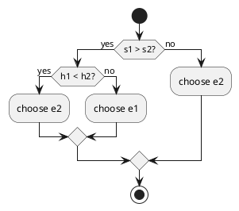
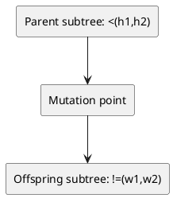
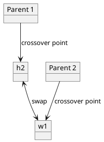
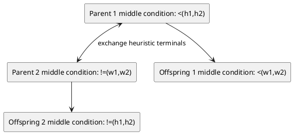

# An Empirical Study into the Structure of Heuristic Combinations in an Evolutionary Algorithm Hyper-Heuristic for the Examination Timetabling Problem

**Nelishia Pillay**  
School of Computer Science  
University of KwaZulu-Natal  
KwaZulu-Natal, South Africa  
+27 33 2605645  
pillayn32@ukzn.ac.za

## ABSTRACT

A hyper-heuristic for the examination timetabling problem searches a space of constructive heuristic combinations instead of a space of examination timetables. The most optimal heuristic combination found by the search is used to construct the examination timetable. The focus of a hyper-heuristic is to generalize well rather than producing the best result for one or more problem sets in the domain. A metaheuristic such as evolutionary algorithms is usually employed to explore the heuristic space. This study reports on an empirical investigation conducted to test how the structure of the heuristic combination affects the success of the search of an evolutionary algorithm (EA) hyper-heuristic for the uncapacitated examination timetabling problem. Two structures, namely, one that combines low-level construction heuristics linearly and applies them sequentially and a second which combines heuristics hierarchically and applies them simultaneously are investigated. The performance of the EA-based hyper-heuristic using both structures is tested on a set of eight uncapacitated examination timetabling problems. The study has revealed that the representation used does have an impact on the success of the evolutionary algorithm. In this domain the linear combination and sequential application of heuristics produced better results. The EAs with both representations were also found to perform better than other hyper-heuristic methods applied to the same problem.

### Categories and Subject Descriptors

I.2. [Computing Methodologies]: Artificial Intelligence.

### General Terms

Algorithms, Theory.

### Keywords

Hyper-heuristics, examination timetabling, evolutionary algorithms, representation

## 1. INTRODUCTION

Examination timetabling involves allocating examinations to timetable slots so as to meet the hard constraints and minimize the soft constraint violations of the problem. The hard constraints of the problem must be met in order for the timetable to be feasible, for example, a student cannot be scheduled to sit for more than one examination during the same period. The soft constraints are characteristics that we would like the timetable to possess. The soft constraints are usually contradictory and we aim to minimize its cost. The soft constraint cost is a measure of the quality of the timetable. The uncapacitated version of the problem does not take room capacities into consideration while the capacitated version does.

A number of different methodologies have been evaluated for solving the examination timetabling problem including tabu search, genetic algorithms, simulated annealing [1]. More recent approaches applied to this domain include the combination of tabu search and a memetic algorithm [2] and a hybrid approach combining the use of an electromagnetic-like mechanism and the great deluge algorithm [3]. These methods aim at producing the best quality timetable for one or more problem/s in a particular problem set. More recently, hyper-heuristics have been applied to this domain.

Hyper-heuristic approaches focus on producing solutions that generalize well over a set of problems rather than producing the best results for one or more problems in the set [4]. Hyper-heuristics employ a metaheuristic such as variable neighbourhood search, tabu search and evolutionary algorithms to search a heuristic space. The heuristic space usually consists of heuristic combinations of low-level heuristics. Previous work has shown that the representation used by an evolutionary algorithm affects the success of the algorithm. In [5] the performance of an EA with three different linear representations is compared. These representations are essentially linear combinations of low-level heuristics which are applied sequentially during timetable construction. The study presented in this paper takes this a step further and performs an empirical comparison of the linear structure with the sequential application of low-level heuristics to a hierarchical structure which applies the low-level heuristics simultaneously.

The following section examines previous studies applying hyper-heuristics to the uncapacitated examination timetabling problem. Section 3 describes the evolutionary algorithms employing different structures, namely, linear and hierarchical. The experimental setup for testing both algorithms is presented in section 4. Section 5 compares the performance of the EA with the linear and hierarchical structures. A summary of the results of the study and an overview of future work is provided in section 6.

> 1 Metaheuristics are optimization techniques that perform iterative optimization, e.g. genetic algorithms, simulated annealing.

Permission to make digital or hard copies of all or part of this work for personal or classroom use is granted without fee provided that copies are not made or distributed for profit or commercial advantage and that copies bear this notice and the full citation on the first page. To copy otherwise, or republish, to post on servers or to redistribute to lists, requires prior specific permission and/or a fee.  
**SAICSIT ’10**, October 11–13, 2010, Bela Bela, South Africa.  
Copyright 2010 ACM 978-1-60558-950-3/10/10 ...$10.00.

## 2. PREVIOUS WORK

This section provides an overview of previous studies applying hyper-heuristics to the uncapacitated examination timetabling problem. Hyper-heuristics determine which heuristic or combination of heuristics to use during timetable construction. Low-level heuristics can be constructive or perturbative. The study presented in this paper focuses on construction heuristics, thus the previous studies described in this section are limited to those involving construction heuristics.

Earlier work conducted by Asmuni et al. [6] use fuzzy logic to combine two of the low-level graph colouring heuristics. The two low-level heuristics are combined into a single value using a fuzzy function. This value is an estimate of the difficulty of scheduling the examination. Examinations are sorted according to this value and allocated sequentially. An extension of this work tunes the fuzzy rules instead of keeping them fixed [7], a further extension of the study [8] examines the performance of different combinations of the three low-level heuristics.

Qu et al. [9] use a variable neighbourhood search to explore a space of heuristic combinations consisting of two or more low-level graph heuristics. Each heuristic is used to schedule two examinations.

Tabu search ([10], [11]) has been used to search the space of heuristic combinations consisting of combinations of two or more low level graph heuristics. Qu et al. [12] extend this research by analyzing heuristic combinations found by the Tabu search that produce feasible solutions, to determine the most effective distribution patterns of low-level heuristics. For example a particular heuristic may produce better solutions when applied at the beginning of the construction process, i.e. it occurs at the beginning of the combination string.

Qu et al. [13] conduct a comparative study of the performance of steepest descent, iterated local search, tabu search and variable neighbourhood search in searching the heuristic space for an optimal combination. Iterated local search produced the best results. This study also investigated exploring both the heuristic space and the solution space. Searching the solution space of partially created timetables during construction of the timetable, using the optimal heuristic combination found, produced better results.

Burke et al. [14] employ a greedy adaptive search (GRASP) to find the optimal heuristic combination. Each combination is composed of one or more instances of the saturation degree and largest weighted degree heuristics. The timetable constructed using the heuristic combination is then further improved using steepest descent.

## 3. EVOLUTIONARY ALGORITHMS

Evolutionary algorithms are based on Darwin’s theory of evolution and as such iteratively refine an initial population until some termination criterion are met. This section describes both the evolutionary algorithms, with different structures used for the heuristic combinations, implemented to search the heuristic space. Both EAs employ the generational control model [15]. This model involves creating an initial population and iteratively refining the population through the processes of evaluation selection and recreation. The termination criterion for both algorithms is a set number of generations, *g*, must be performed. The value of *g* is problem dependant. Both the linear and hierarchical representations combine the following low-level heuristics:

- **Largest degree (l)** – The examination with the most clashes is scheduled first.
- **Largest enrolment (e)** – The examination with the largest number of students sitting for the examination is scheduled first.
- **Largest weighted degree (w)** – The examination with the largest number of students involved in clashes is scheduled first.
- **Saturation degree (s)** – The examination with the least number of options on the timetable, i.e. feasible periods, is scheduled first.
- **Highest cost (h)** – The examination with the highest soft constraint cost, given the current state of the examination timetable, is scheduled first.

The first three heuristics are static heuristics and are calculated prior to timetable construction. Saturation degree and highest cost are dynamic heuristics, the values of which change with each timetable allocation.

Section 3.1 describes the EA employing a linear representation. The EA employing a hierarchical representation is presented in section 3.2.

### 3.1 Linear representation

This section describes initial population generation, selection and evaluation and population recreation of the EA using a linear representation. The heuristics are combined linearly and applied sequentially.

#### 3.1.1 Initial Population Generation

Each element of the population is a string combining low level construction heuristics. For example, given the heuristic combination *leels* the largest degree heuristic will be used to schedule the first examination, largest enrolment the second and third examinations, largest degree the fourth examination and saturation degree the last examination. The length of the combination is variable and is randomly chosen to be in the range of one and a preset maximum. This maximum value is a genetic parameter and varies from problem to problem. Each heuristic is used to schedule one examination. If the length of the combination is less than the number of examinations, the heuristics are reapplied from the beginning of the combination sequentially. If the combination is longer than the number of examinations, only the substring of length equal to the number of examinations is applied.

#### 3.1.2 Fitness Evaluation and Selection

Each individual² is evaluated by using the heuristic combination to construct a timetable. The fitness of an individual is the hard constraint cost plus one times the soft constraint cost.

The selection method used is tournament selection. This method involves selecting a tournament. The size of the tournament is problem dependant and is a genetic parameter.

> ² An individual refers to an element of the population.

Each element of the tournament is randomly selected. The fittest element is returned as the winner of the tournament. Selection is with replacement, thus an element may be chosen more than once as a parent.

#### 3.1.3 Population Recreation

Two genetic operators, namely, mutation and crossover are used to create the offspring of each generation.

The mutation operator is applied to a single parent chosen using tournament selection. A mutation point is randomly selected in the parent. The heuristic at this point is replaced with a randomly selected heuristic. For example, suppose that *wel* is the parent and the mutation point is two. The heuristic at this point is replaced with a randomly selected heuristic, e.g. *wsl*, in which case *s* is the heuristic randomly selected to replace *e*.

The crossover operator is applied to two parents selected using tournament selection. Crossover points are randomly chosen in both the parents. Both strings are crossed over at the crossover points to create two offspring. Previous work has shown that it is more effective to return the fitter of both offspring instead of both offspring as the result of the crossover operation [5]. Suppose that *wels* and *hswx* have been chosen as parents with two as the crossover point in the first individual and four in the second parent. The resulting offspring are *wws* and *hesl*. The fitter of the two offspring will be the result of the operation.

### 3.2 Hierarchical Representation

This section presents the EA using a hierarchical representation for the heuristic combinations. The heuristics are combined hierarchically and applied sequentially. The methods of fitness evaluation and selection are the same as that for the EA with a linear representation. The following subsections describe initial population generation and recreation.

#### 3.2.1 Initial Population Generation

The low-level heuristics are combined using conditional and logical operators and are applied simultaneously as part of a logical function. Each element of the population is represented using a parse tree [15]. An example is illustrated in Figure 1 (Table 2 and Table 3 below define the functions and terminals comprising the tree).

### Figure 1. Parse tree example

Description: A hierarchical decision tree for choosing between two examinations.

Logical form:

```text
if (s1 > s2)
    then if (h1 < h2) then e2 else e1
    else e2
```

PlantUML:



Each individual is used to sort the examinations to be allocated. The function represented by the individual is used to compare two examinations to determine which should appear first in the list. For example, suppose that both examinations in Table 1 are compared using the function represented by the individual in Figure 1.

### Table 1. Example: Exams and Corresponding Heuristics

| Exam | Saturation Degree(s) | Highest Cost (h) |
|---|---:|---:|
| Exam A | 3 | 12 |
| Exam B | 10 | 14 |

Since **Exam B** has a higher saturation degree than **Exam A** it will be scheduled first. However, if Exam A had a higher saturation degree than Exam B, the highest cost of both exams would be considered. If Exam B has a higher cost than Exam A it will be scheduled first, otherwise Exam A will be scheduled first. Note that *e1* and *e2* refer to the first and second examination being compared.

Each element of the initial population is created by randomly choosing elements from the function and terminal sets which are listed in Table 2 and Table 3 respectively. Each tree is created using the grow method [15]. An operator subtree depth limit is set on the operators to prevent the growth of redundant code.

### Table 2. Function Set

| Function | Description |
|---|---|
| *if* operator | Takes three arguments. Performs the function of an if-then-else statement. If its first child evaluates to true, the second child is evaluated, otherwise the third child is evaluated. |
| Logical operators: *and* | Performs the logical *and* function. |
| Arithmetic logic operators: `<`, `>`, `==`, `!=` | Performs the standard arithmetic logic functions. |

### Table 3. Terminal Set

| Terminal | Description |
|---|---|
| l1, l2, e1, e2, w1, w2, h1, h2, s1, s2 | Low-level construction heuristics for each examination, e.g. h1 and h2 are the highest cost of the first and second exams being compared respectively. |
| e1, e2 | Represents the examinations being compared. |

The root of each tree is the *if* operator. The output produced by a tree is the examination that should appear first, from the two examinations being compared, in the list of sorted examinations.

The first child of the *if* operator represents a condition to be tested and thus can be either a logical operator or an arithmetic logic operator. The second and third child of the *if* operator can be another *if* operator, if the depth limit of the subtree has not been met, or an examination node, i.e. *e1* or *e2*.

The *and* operator takes two arguments and returns a value of true or false. Both the children of the *and* operator are chosen from the set of arithmetic logic operators.

The arithmetic logic operators take two arguments and return a value of true or false. Both the arguments are low-level construction heuristics. The purpose of these operators is to compare the performance of heuristic values for the two examinations being compared. The first argument of the operator is randomly chosen to be one of the low-level heuristics, e.g. *s*. The heuristic is then randomly chosen to be that of the first or second examination being compared, e.g. *s2*. The remaining argument is the same heuristic as that of the other examination being compared, e.g. *s1*.

The initial population consists of *m* individuals. The value of *m* is problem dependent and is a genetic parameter. The *m* individuals are then iteratively refined on the successive generations. The methods of fitness evaluation and selection are the same as that used for the EA using the linear representation described in section 3.1.2. The following section describes the operators used for recreation.

#### 3.2.2 Population Recreation

The EA employs the same operators as the EA using a linear representation, namely, mutation and crossover.

The mutation operator is applied to a parent chosen using tournament selection. A mutation point is randomly chosen in the parent. The subtree at the mutation point is replaced with a newly created subtree. The new subtree is created to be the same type as the subtree removed, e.g. a subtree with an arithmetic logic operator as a root will be replaced by another subtree with an arithmetic operator at the root. If a heuristic is selected, both the chosen point and its sibling are replaced with the new heuristic. For example, suppose that the node *s1* is replaced by *h1*, then its corresponding sibling is replaced by *h2*. An example of mutation is illustrated in Figure 2. The mutation point is the “<” node. The subtree rooted at this node is removed and replaced with a new subtree.

### Figure 2. Mutation example

Description: A parent parse tree is mutated by replacing the subtree rooted at `<(h1,h2)` with a new subtree `!=(w1,w2)`.

PlantUML:



An example of crossover is illustrated in Figure 3 and Figure 4.

### Figure 3. Crossover: parents

Description: Two parent parse trees are shown before crossover. In Parent 1, the crossover point is at terminal `h2`. In Parent 2, the crossover point is at terminal `w1`.

PlantUML:



### Figure 4. Crossover: offspring

Description: After crossover, the exchanged heuristic terminals cause sibling adjustment so that heuristic pairs remain type-consistent. One offspring contains `<(w1,w2)` and the other contains `!=(h1,h2)`.

PlantUML:



Figure 3 displays the parents and Figure 4 the corresponding offspring. In this example a heuristic node is chosen in the first parent. Thus, a heuristic node is also chosen in the second parent. Both these subtrees, in this case a single node, are swapped. Note that the siblings are changed to be the same type of heuristics. The crossover operator is applied to two parents chosen using tournament selection. A crossover point is selected in the first parent. A corresponding point of the same type is chosen in the second parent. Both the subtrees are swapped to create two offspring. If the nodes being swapped are heuristic nodes, the corresponding sibling is changed to be the same heuristic as that inserted into tree. As in the case of the EA using a linear representation, the fitter offspring is returned as the result of the operation.

The following section describes the methodology employed to evaluate the performance of the EA using a linear representation and the EA using a hierarchical representation.

## 4. EXPERIMENTAL SETUP

Both EAs were tested on a set of eight problems from the Carter benchmark set presented in [1]. These eight problems were chosen so as to represent problems of differing difficulty as indicated by the density of the clash matrix for each problem. Details of these problems are listed in Table 4. The density of the clash matrix is the ratio of the number of examinations involved in clashes and the total number of examinations.

### Table 4. Characteristics of the eight Carter benchmark problems

| Problem | Periods | No. of Exams | No. of Students | Density of Conflict Matrix |
|---|---:|---:|---:|---:|
| ear-f-83 I | 24 | 190 | 1125 | 0.27 |
| hec-s-92 I | 18 | 81 | 2823 | 0.42 |
| kfu-s-93 | 20 | 461 | 5349 | 0.06 |
| lse-f-91 | 18 | 381 | 2726 | 0.06 |
| sta-f-83 I | 13 | 139 | 611 | 0.14 |
| tre-s-92 | 23 | 261 | 4360 | 0.18 |
| ute-s-92 | 10 | 184 | 2749 | 0.08 |
| yor-f-83 I | 21 | 181 | 941 | 0.29 |

There is one hard constraint for these problems, namely, no clashes, i.e. a student must not be scheduled to write more than one examination during a period. The soft constraint requires the examinations to be well spread for each student. The following equation is used to calculate the soft constraint cost [16]:

\[
\frac{\sum w(|e_i - e_j|)N_{ij}}{S}
\tag{1}
\]

where:

1. \( e_i - e_j \) is the distance between the periods of each pair of examinations \((e_i, e_j)\) with common students.
2. \( N_{ij} \) is the number of students common to both examinations.
3. \( S \) is the total number of students.
4. \( w(1)=16, w(2)=8, w(3)=4, w(4)=2 \) and \( w(5)=1 \), i.e. the smaller the distance between periods the higher the weight allocated. Note that for \( n > 5 \), \( w(n)=0 \).

The values of the genetic parameters used for the EA using a linear representation (EA-LR) and the EA implementing a hierarchical representation (EA-HR) are tabulated in Table 5 and Table 6 respectively. These values were obtained by performing trial runs. Initially, the EA-HR was run with 50 generations. However, trial runs indicated that the EA with a linear representation took longer to converge and thus a value of a 100 was used. A value of 4 was also initially used as a tournament size for the EA-LR. Again trial runs indicated that a tournament of this size did not exert sufficient selection pressure for convergence.

### Table 5. Genetic parameter values for EA-LR

| Parameter | Value |
|---|---:|
| Number of generations | 100 |
| Population size | 500 |
| Maximum initial length | 3 |
| Tournament size | 10 |
| Crossover rate | 0.3 |
| Mutation rate | 0.7 |

### Table 6. Genetic parameter values for EA-HR

| Parameter | Value |
|---|---:|
| Number of generations | 50 |
| Population size | 500 |
| If-subtree depth limit | 3 |
| Operator subtree depth limit | 2 |
| Tournament size | 4 |
| Crossover rate | 0.3 |
| Mutation rate | 0.7 |
| Maximum offspring size | 100 |

Both algorithms were implemented in Java using JDK 1.6.0 and simulations were run on an Intel Core 2 Duo processor with Windows XP. Ten runs were performed for each EA. A different random number generator seed was used for each run. The results of these runs and a comparison of the performance of both of the EAs are presented in the following section.

## 5. RESULTS AND DISCUSSION

Both algorithms were able to find feasible solutions for all eight problems. The best and average soft constraint costs over the ten runs for all eight problems are listed in Table 7 for EA-LR and Table 8 for EA-HR. From Table 7 and Table 8 it is evident that the EA with a linear representation has performed better than the EA with a hierarchical representation. Note that even though the EA-LR performs more generations and applies more selection pressure, the runtimes for the EA-HR are much higher than that for the EA-LR. This can be attributed to the fact that in the EA-HR each heuristic combination has to be interpreted and evaluated whereas in the EA-LR this is not the case as the heuristics are applied in order sequentially instead of simultaneously as a function. Furthermore, more processing time will be needed by the mutation and crossover operation when dealing with a hierarchical structure compared to a simple string representing an individual.

### Table 7. Soft constraint cost and runtime for the EA-LR

| Data Set | Best Cost | Average Cost | Runtime |
|---|---:|---:|---|
| ear-f-83 I | 35.94 | 36.86 | 39 mins |
| hec-s-92 I | 11.21 | 11.46 | 8 mins |
| kfu-s-93 | 14.13 | 14.25 | 2 hrs |
| lse-f-91 | 10.83 | 10.93 | 1 hr 15 mins |
| sta-f-83 I | 157.82 | 158.32 | 11 mins |
| tre-s-92 | 8.37 | 8.47 | 1 hr |
| ute-s-92 | 27.13 | 27.74 | 15 mins |
| yor-f-83 I | 40 | 40.63 | 33 mins |

### Table 8. Soft constraint cost and runtimes for the EA-HR

| Data Set | Best Cost | Average Cost | Runtime |
|---|---:|---:|---|
| ear-f-83 I | 37.39 | 37.85 | 16 hrs |
| hec-s-92 I | 11.43 | 11.67 | 50 mins |
| kfu-s-93 | 14.53 | 14.58 | 11 hrs |
| lse-f-91 | 11.19 | 11.25 | 2 hrs 20 mins |
| sta-f-83 I | 158.38 | 158.69 | 5 hrs |
| tre-s-92 | 8.54 | 8.56 | 10 hrs |
| ute-s-92 | 27.31 | 28.02 | 8 hrs |
| yor-f-83 I | 39.96 | 40.58 | 14 hrs |

The EA-LR has produced better quality timetables for seven of the eight data sets. The main aim of this study was to empirically investigate whether the structure used for representing heuristic combinations in a heuristic space by an EA, and the application of the combinations, i.e. sequential or simultaneous, affects the performance of the EA hyper-heuristic in solving the uncapacitated examination timetabling problem. It is evident from this study that the structure does have an effect and an EA representing heuristics combinations linearly and applying them sequentially appears to perform better than an EA with a representation combining heuristics hierarchically and applying them simultaneously. Future extensions of this work will test the significance of this result and investigate the reasons for the difference in performance.

For completeness the performance of both EAs is compared to other hyper-heuristics taking a similar approach and that have been applied to the same data sets. These hyper-heuristics are described in section 2. Appendix A lists the soft constraint costs of the best timetable generated using each of the hyper-heuristics. The best soft constraint cost for each of the problems is indicated in bold. The EA-LR has produced the best results for five of the eight data sets. Although the EA-HR has not performed as well as the EA-LR, its performance is still comparable, and in a majority of the cases, is better than the other hyper-heuristics.

## 6. CONCLUSION AND FUTURE WORK

The main contribution of the study presented in this paper is an empirical investigation into whether the structure used by an EA to represent heuristic combinations in a heuristic space and the application of the heuristics in the combinations affects the performance of the EA. Two structures were evaluated. The first combined heuristics linearly and applied them sequentially during timetable construction. The second structure combines heuristics hierarchically and applies them simultaneously as a function. The study revealed that the EA using the first structure performed better and appears to be more suitable for the application domain. As this study is empirical in nature future work will test the significance of this result and identify reasons for the difference in performance of both the structures. The performance of both the EAs was also compared to other hyper-heuristics applied to the same set of problems. Both EAs were found to perform better than the other hyper-heuristics on the set of problems.

## 7. REFERENCES

[1] Qu, R., Burke, E. K., McCollum, B., Merlot, L.T.G. and Lee, S.Y. 2009. A Survey of Search Methodologies and Automated System Development for Examination Timetabling, Journal of Scheduling 12(1), 55-89.

[2] Abdullah, S., Turabieh, H. and McCollum B. 2009. A Tabu-based Memetic Approach for Examination Timetabling Problems. In proceedings of the Twenty-ninth SGAI International Conference on Artificial Intelligence (AI-2009), England, Springer.

[3] Abdullah, S., Turabieh, H. and McCollum B. 2009. A Hybridization of Electromagnetic-like Mechanism and Great Deluge for Examination Timetabling Problems. In the proceedings of the 6th International Workshop on Hybrid Metaheuristics (HM2009), Udine.

[4] Ross, P. 2005. Hyper-heuristics. In Burke E.K., Kendall G. (Eds.): Search Methodologies: Introductory Tutorials in Optimization and Decision Support Methodologies, chapter 17, 529-556, Kluwer.

[5] Pillay, N. 2008. An Analysis of Representations for Hyper-Heuristics for the Uncapacitated Examination Timetabling Problem in a Genetic Programming System. In Cilliers, C., Barnard, L. and Botha, R. (eds.), Proceedings of SAICSIT 2008, 118-192, ACM Press.

[6] Asmuni, H., Burke, E. K. and Garibaldi, J. M. 2005. Fuzzy Multiple Ordering Criteria for Examination Timetabling. In Burke E.K. and Trick M. (eds.). In selected Papers from the 5th International Conference on the Theory and Practice of Automated Timetabling (PATAT 2004). The Theory and Practice of Automated Timetabling V, Lecture Notes in Computer Science 3616, 147-160, Springer.

[7] Asmuni, H., Burke, E.K., Garibaldi, J. M. and McCollum, B. 2007. Determining Rules in Fuzzy Multiple Heuristic Orderings for Constructing Examination Timetables. In proceedings of the 3rd Multidisciplinary International Scheduling: Theory and Applications Conference, MISTA 2007, 59-66, Springer.

[8] Asmuni, H., Burke E.K., Garibaldi, J. M., McCollum, B., and Parkes, A. J. 2009. An Investigation of Fuzzy Multiple Heuristic Orderings in the Construction of University Examination Timetables. Computers and Operations Research 36(4), 981-1001.

[9] Qu, R. and Burke, E.K. 2005. Hybrid Neighbourhood Hyper Heuristics for Exam Timetabling Problems. In Proceedings of the MIC2005: The Sixth Metaheuristics International Conference, Vienna, Austria.

[10] Burke, E. K., Dror, M., Petrovic, S. and Qu, R. 2005. Hybrid Graph Heuristics with a Hyper-Heuristic Approach to Examination Timetabling Problems. In Gold B.L., Raghavan S., and Wasil E.A. (eds.), The Next Wave in Computing, Optimization, and Decision Technologies – Conference Volume of the 9th Informs Computing Society Conference, 79-91.

[11] Burke, E.K., McCollum, B., Meisels, A., Petrovic S. and Qu, R. 2007. A Graph-Based Hyper-Heuristic for Educational Timetabling Problems. European Journal of Operational Research (EJOR), 176, 177–192.

[12] Qu, R., Burke, E. K. and McCollum, B. 2009. Adaptive Automated Construction of Hybrid Heuristics for Exam Timetabling and Graph Colouring Problems, European Journal of Operational Research (EJOR), 198(2), 392-404.

[13] Qu, R. and Burke, E.K. 2009. Hybridisations within a Graph Based Hyper-Heuristic Framework for University Timetabling Problems. Journal of Operational Research Society (JORS) 60, 1273-1285.

[14] Burke, E. K., Qu, R. and Soghier, A. 2009. Adaptive Selection of Heuristics within a GRASP for Examination Timetabling Problems. In proceedings of Multidisciplinary International Conference on Scheduling 2009, MISTA 2009, 409-422.

[15] Koza, J. R. 1992. Genetic Programming I: On the Programming of Computers by Means of Natural Selection. MIT Press.

[16] Carter, M. W., Laporte, G., Lee, S. Y. 1996. Examination Timetabling: Algorithmic Strategies. Journal of the Operational Research Society. 47(3), 373-383.

## 8. APPENDIX A: COMPARISON WITH OTHER HYPER-HEURISTICS

### Table 9. Comparison of the performance of EA-LR, EA-HR and other hyper-heuristics

| Problem | EA-LR | EA-HR | VNS [9] | FL [6] | FL [7] | FL [8] | TS [11] | AAC [12] | GHH [13] | GRASP [14] |
|---|---:|---:|---:|---:|---:|---:|---:|---:|---:|---:|
| ear-f-83 I | 35.94 | 37.39 | 37.29 | 37.02 | 36.64 | 37.02 | 38.19 | **35.56** | 35.86 | 36.52 |
| hec-s-92 I | **11.21** | 11.43 | 12.23 | 11.78 | 11.6 | 11.78 | 12.72 | 11.62 | 11.94 | 11.78 |
| kfu-s-93 | **14.13** | 14.53 | 15.11 | 15.81 | 15.34 | 15.80 | 15.76 | 15.18 | 14.79 | 15.45 |
| lse-f-91 | **10.83** | 11.19 | 12.71 | 12.09 | 11.35 | 12.09 | 13.15 | 11.32 | 11.15 | 12.12 |
| sta-f-83 I | **157.82** | 158.38 | 158.8 | 160.42 | 160.79 | 160.42 | 158.19 | 158.88 | 159 | 158.94 |
| tre-s-92 | **8.37** | 8.54 | 8.67 | 8.67 | 8.47 | 8.67 | 8.85 | 8.52 | 8.6 | 8.99 |
| ute-s-92 | 27.13 | 27.31 | 29.68 | 27.78 | 27.55 | 28.07 | 31.65 | 28.0 | 28.3 | **26.62** |
| yor-f-83 I | 40 | 39.96 | 43.0 | 40.66 | 39.79 | **39.8** | 40.13 | 40.71 | 41.81 | 42.19 |

VNS – Variable Neighbourhood Search  
FL – Fuzzy Logic  
TS – Tabu Search  
AAC – Adaptive Automated Construction  
GHH – Graph Hyper-Heuristic  
GRASP – Greedy Adaptive Search Procedure