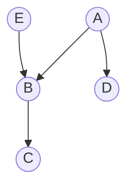
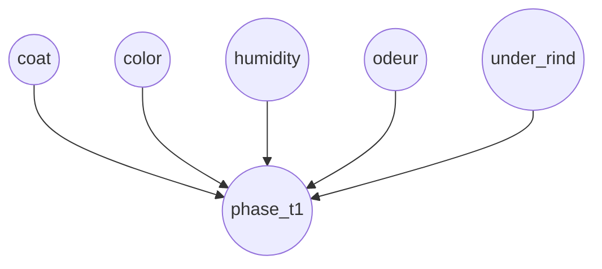

# Balancing User Interaction and Control in BNSL

Alberto Tonda$^1$, Andre Spritzer$^{2,3}$, and Evelyne Lutton$^1^{(\boxtimes)}$

$^1$ INRA UMR 782 GMPA, 1 Av. Brétignières, 78850 Thiverval-Grignon, France
`{alberto.tonda,evelyne.lutton}@grignon.inra.fr`
$^2$ INRIA, AVIZ Team, Bat. 660, Université Paris-Sud, 91405 ORSAY Cedex, France
$^3$ Universidade Federal Do Rio Grande Do Sul,
Av. Paulo Gama, 110 - Bairro Farroupilha, Porto Alegre, RS, Brazil
`spritzer@inf.ufrgs.br`

**Abstract.** In this paper we present a study based on an evolutionary framework to explore what would be a reasonable compromise between interaction and automated optimisation in finding possible solutions for a complex problem, namely the learning of Bayesian network structures, an NP-hard problem where user knowledge can be crucial to distinguish among solutions of equal fitness but very different physical meaning. Even though several classes of complex problems can be effectively tackled with Evolutionary Computation, most possess qualities that are difficult to directly encode in the *fitness function* or in the individual's *genotype description*. Expert knowledge can sometimes be used to integrate the missing information, but new challenges arise when searching for the best way to access it: full human interaction can lead to the well-known problem of user-fatigue, while a completely automated evolutionary process can miss important contributions by the expert. For our study, we developed a GUI-based prototype application that lets an expert user guide the evolution of a network by alternating between fully-interactive and completely automatic steps. Preliminary user tests were able to show that despite still requiring some improvements with regards to its efficiency, the proposed approach indeed achieves its goal of delivering satisfying results for an expert user.

**Keywords:** Interaction · Memetic algorithms · Evolutionary algorithms · Local optimisation · Bayesian Networks · Model learning

## 1 Introduction

Efficiently using algorithmic solvers to address real world problems initially requires dealing with the difficult issue of designing an adequate optimisation landscape - that is, defining the search space and the function to be optimized. The Bayesian Network Structure Learning (BNSL) problem is a good example of a complex optimisation task in which expert knowledge is of crucial importance in the formulation of the problem, being as essential as the availability of a large enough experimental dataset. By its very nature, BNSL is also at least bi-objective: its aim is to optimize the tailoring of a model to the data while keeping its complexity low. The balance between the multiple objectives has to be decided by an expert user, either *a priori* or *a posteriori*, depending on whether a mono or multi-objective solver is used. Other high level design choices made by the expert condition the type of model that is searched (i.e., the definition of the search space), and the constraints that are applied to the search.

Lack of experimental data is a rather common issue in real world instances of the BNSL problem, making the optimisation task very multi-modal or even badly conditioned. Although previous work has proved that EA approaches tend to be more robust to data sparseness than other learning algorithms [30], an efficient and versatile way of collecting expert knowledge would still represent an important progress. Interaction with the expert, for instance, can be useful to disambiguate solutions considered as equivalent given the available dataset. How to best access an expert's knowledge, however, is still an open issue: asking a human user for input at a high frequency may lead to the well-known problem of user fatigue; not asking frequently enough might result in too little feedback. In this paper we present a study that constitutes a first step into reaching this balance between interaction and automation.

For our study we developed a prototype application that allows an expert user to guide the evolution of a Bayesian network. The prototype works by alternating steps of interactive visualisation with fully automated evolution. The original network and evolved solutions are always displayed to the user as interactive node-link diagrams through which constraints can be added so that the function to be optimized can be refined. Our approach is related to humanized computation as defined by [1] (EvoINTERACTION Workshops) i.e., "systems where human and computational intelligence cooperate."

The use of interactive evolution (IEAs, or IEC) algorithms is the most common approach for humanized computation. This strategy considers the user as the provider of a fitness function (or as a part of it) inside an evolutionary loop and has been applied to various domains, such as art, industrial design, the tuning of ear implants, and data retrieval [26,28]. There are, however, different ways to interlace human interaction and optimization computations that may be as simple as what we study in this paper (i.e., an iterative scheme) or as sophisticated as collaborative learning and problem solving using Serious Games or Crowd Sourcing [4,24,31]. An interesting feature of theses latter approaches is that they consider various tools to deal with what they call "user engagement," which may represent a new source of inspiration to address the well-known "user fatigue" issue of IEAs.

This paper is organized as follows. Section 2 gives a short background on Bayesian Networks (BN) and how they can be visualized, as well as on methods used for dealing with the BNSL problem. Section 3 details our proposed approach. Experimental results are presented in Sect. 4 and an analysis is developed in Sect. 5. Finally, our conclusions and some possible directions for future research are discussed in Sect. 6.

## 2 Background

### 2.1 Bayesian Networks

Formally, a Bayesian network is a directed acyclic graph (DAG) whose nodes represent variables, and whose arcs encode conditional dependencies between the variables. This graph is called the *structure* of the network and the nodes containing probabilistic information are called the *parameters* of the network. Figure 1 reports an example of a Bayesian network.

| Node | Parents | Probabilities |
|---|---|---|
| A | | $P(A=a_1) = 0.99$ $P(A=a_2) = 0.01$ |
| B | A,E | $P(B=b_1\|A=a_1,E=e_1) = 0.5$ $P(B=b_2\|A=a_1,E=e_1) = 0.5$ $P(B=b_1\|A=a_1,E=e_2) = 0.1$ $P(B=b_2\|A=a_1,E=e_2) = 0.9$ $P(B=b_1\|A=a_2,E=e_1) = 0.4$ $P(B=b_2\|A=a_2,E=e_1) = 0.6$ $P(B=b_1\|A=a_2,E=e_2) = 0.2$ $P(B=b_2\|A=a_2,E=e_2) = 0.8$ |
| C | B | $P(C=c_1\|B=b_1) = 0.3$ $P(C=c_2\|B=b_1) = 0.7$ $P(C=c_1\|B=b_2) = 0.5$ $P(C=c_2\|B=b_2) = 0.5$ |
| D | A | $P(D=d_1\|A=a_1) = 0.8$ $P(D=d_2\|A=a_1) = 0.2$ $P(D=d_1\|A=a_2) = 0.7$ $P(D=d_2\|A=a_2) = 0.3$ |
| E | | $P(A=e_1) = 0.75$ $P(A=e_2) = 0.25$ |

**Fig. 1.** Left, a directed acyclic graph. Right, the parameters it is associated with. Together they form a Bayesian network $BN$ whose joint probability distribution is $P(BN) = P(A)P(B|A, E)P(C|B)P(D|A)P(E)$.

The set of parent nodes of a node $X_i$ is denoted by $pa(X_i)$. In a Bayesian network, the joint probability distribution of the node values can be written as the product of the local probability distribution of each node and its parents:

$$
P(X_1, X_2, ..., X_n) = \prod_{i=1}^{n} P(X_i|pa(X_i))
$$

### 2.2 The Structure Learning Problem

Learning the optimal structure of a Bayesian network starting from a dataset is proven to be an NP-hard problem [7]. Even obtaining good approximations is extremely difficult, since compromises between the representativeness of the model and its complexity must be found. The algorithmic approaches devised to solve this problem can be divided into two main branches: heuristic algorithms (which often rely upon statistical considerations on the learning set) and score-and-search meta-heuristics. Recently, hybrid techniques have been shown to produce promising results.

**Heuristic algorithms:** The machine learning community features several state-of-the-art heuristics algorithms to build Bayesian network structures from data. Some of them rely upon the evaluation of conditional independence between variables, while others are similar to score-and-search approaches, only performed in a local area of the solutions' space, determined through heuristic considerations. The main strength of these techniques is their ability of returning high-quality results in a time which is negligible when compared to meta-heuristics.

Two of the best algorithms in this category are *Greedy Thick Thinning* (GTT) [5] and *Bayesian Search* (BS) [9]. Although a detailed description of the two procedures is outside the scope of this work, it is important to highlight the most relevant difference between them. While GTT is fully deterministic, always returning the same solution for the same input, BS is stochastic, starting from different random positions at each execution. Both GTT and BS implementations can be found in commercial products such as GeNie/SMILE [12].

**Evolutionary approaches:** Among score-and-search meta-heuristics, evolutionary algorithms are prominently featured. Several attempts to tackle the problem have been tested, ranging from evolutionary programming [33], to cooperative co-evolution [2] and island models [25]. Interestingly, some of the evolutionary approaches to Bayesian network structure learning in the literature show features of memetic algorithms, hinting that injecting expert knowledge might be necessary to obtain good results on such a complex problem. For example, [33] employs a *knowledge-guided mutation* that performs a local search to find the most interesting arc to add or remove. In [11], a local search is used to select the best way to break a loop in a non-valid individual. The K2GA algorithm [20], in its turn, exploits a genetic algorithm to navigate the space of possible node orderings, and then runs the greedy local optimisation K2, which quickly converges on good structures starting from a given sorting of the variables in the problem.

**Memetic algorithms:** Memetic algorithms are *"population-based meta-heuristics composed of an evolutionary framework and a set of local search algorithms which are activated within the generation cycle of the external framework"* [18]. First presented in [23], they gained increasing popularity in the last few years [21]. What makes these stochastic optimisation techniques attractive is their ability to quickly find high-quality results while still maintaining the exploration potential of a classic evolutionary algorithm. Their effectiveness has been proven in several real-world problems [15,22] and there have been initial attempts to employ them in the structure learning problem. In particular, in [29] the authors combine the exploratory power of an evolutionary algorithm with the efficient exploitation of GTT, obtaining Bayesian network structures with higher representation and lower complexity than results produced by the most prominently featured heuristic methods.

### 2.3 Visualizing Bayesian Networks

It has been shown that efficient interactions in humanized computation requires efficient visualisations [19]. Current visualisation tools for BN rely on classical graph layouts for the qualitative part of the BN, i.e., its graphical structure.

> *[Описание Рисунка 2: Скриншот пользовательского интерфейса разработанного прототипа. В центре расположена основная рабочая область (workspace) с визуализацией графа байесовской сети в виде кругов и направленных линий. Интерфейс разделен на несколько функциональных панелей, на которые указывают красные стрелки с подписями:
> - **menu** (слева вверху): Главное меню программы (File, Edit, Graph, Layout, Learning).
> - **workspace** (по центру): Область визуального взаимодействия с сетью.
> - **History panel** (слева внизу): Панель истории, содержащая список загруженных или сгенерированных сетей с кнопкой экспорта выбранной сети.
> - **Network properties panel** (по центру внизу): Отображает свойства текущей сети (Имя, Количество узлов, Рёбер, Log Likelihood, Разрешение/Dimension и данные обучающего набора).
> - **Properties panel** (справа вверху): Свойства выбранного узла графа, включая таблицу вероятностей для различных состояний узла.
> - **Edge properties panel** (справа внизу): Свойства ребра с возможностью установить ограничения для алгоритмов обучения (Normal, Forced, Forbidden).]*

**Fig. 2.** Overview of the prototype's interface in use: a network being displayed and prepared for evolution. **Node properties panel**: The table shows the parameters or, in other words, the conditional probabilities for the corresponding variable. **Edge properties panel**: The arcs can be set as forced or forbidden before running the structure learning algorithms. **Network properties panel**: The log-likelihood expresses how well the current network expresses the dataset, while the dimension is a measure of the network's complexity. **History panel**: Every time a structure learning algorithm is run, a new network is added to the history.

Still, a difficult issue remains regarding the quantitative part of the BN: the conditional probability set associated to each node of the graph. It has been noted in 2005 that "the work performed on causal relation visualisation has been surprisingly low" [6]. Various solutions have been proposed like in [10], *BayViz* [6,10] *SMILE* and *GeNIe* [13], or *VisualBayes* [32]. To our knowledge, the most advanced and versatile visualisation interface for dealing with structure learning is *GeNIe*, a development environment for building graphical decision-theoretic models from the Decision Systems Laboratory of the University of Pittsburgh: it has gained a notoriety in teaching, research and industry.

None of these tools, however, has really been designed to run a smooth interaction scheme and to easily allow users to revisit the learning stage after the visualisation. Our approach explores new features for visualisation-based interactive structure learning strategies. For the moment, it does not address quantitative visualisation, though that may be considered in the future.

## 3 Proposed Approach

Automated structure learning processes usually score candidate networks with specific metrics: however, networks with similar scores might be extremely different from a user's point of view. In order to take into account human expertise, we propose an interactive evolutionary tool for Bayesian network structure learning.

To perform our study a prototype application has been developed through which users can control the generation and evolution of the Bayesian network. This application consists of a GUI (Fig. 2) that serves as a hub for network manipulation and interactive evolution. The GUI consists of the *menu*, the *workspace*, a *node/edge properties panel*, a *network properties panel*, and a *history panel*.

To start the process from scratch, users can load a CSV file containing a training set by selecting the appropriate option from the prototype's *File* menu. Alternatively, users can load an already computed network from an XMLBIF file by choosing the corresponding option from the same menu. Once a network is loaded, it will be displayed as a node-link diagram on the workspace, with nodes represented as labelled circles and edges as directed line segments. When a network is first loaded, nodes are arranged in a circular layout. Other layout options can be found in the *Layout* menu, and include the Gürsoy-Atun [17], Fruchterman-Reingold [16], and Sugiyama [27] layouts, see Fig. 3.

> *[Описание Рисунка 3: Четыре примера алгоритмов компоновки (layout) узлов байесовской сети "Alarm BN" в рабочей области программы. Изображения расположены слева направо:
> 1. Круговая компоновка (circular) — узлы расположены равномерно по окружности, рёбра пересекают внутреннюю область, образуя плотную сеть.
> 2. Gürsoy-Atun — распределяет узлы на основе силового алгоритма для топологического сохранения графа; структура выглядит более распределённой по плоскости.
> 3. Fruchterman-Reingold — силовой алгоритм, который группирует связанные узлы в визуальные кластеры, минимизируя пересечение рёбер.
> 4. Sugiyama — иерархическая (слоистая) компоновка. Узлы выстроены уровнями сверху вниз, что наиболее наглядно отображает причинно-следственные направления.]*

**Fig. 3.** Sample of layout options, from left to right: circular, Gürsoy-Atun, Fruchterman-Reingold and Sugiyama layouts of the Alarm BN benchmark.

Navigation in the workspace consists of zooming and panning. Users can zoom in or out by spinning the mouse wheel and pan using the scrollbars that appear when the visualisation is too big to fit in the workspace's view. Panning can also be performed with the *drag tool*, accessible from the *Edit* menu. When this tool is active, panning can be performed by clicking and dragging anywhere on the workspace.

By default, when a network is first loaded the *selection tool* is active. This tool allows users to select nodes and edges and move them around the workspace by clicking and dragging. Multiple objects can be selected by clicking on each object separately while the *Ctrl* key is pressed or by clicking on an empty area of the workspace and dragging so that the shown selected area intersects or covers the desired objects. Clicking and dragging on any selected object will move all others along with it.

Users can connect nodes to one another with the *Create Edge* tool, available from the *Graph* menu. Once this tool is active, the new edge can be created by first clicking on the desired origin node and subsequently on the target one. While the new edge is being created, a dashed line is shown from the origin node to the current cursor position to help users keep track of the operation. If after choosing the origin node they click on empty space instead of on another node, the edge creation is cancelled. To delete an edge from the graph, after selecting it they can either press the *Delete* key on the keyboard or select *Remove Edge* from the *Graph* menu. This operation is irreversible so a dialogue will pop up to ask for their confirmation.

When an object is selected in the workspace, its properties are displayed in the properties panel (node properties and edge properties panels of Fig. 2). Node properties include its name and numeric id in the graph as well as its probability table (if a training set has been loaded) and a list of other properties that might be present in the network's corresponding file. Edge properties show the id and name of an edge's origin and target nodes and helps users prepare the network for evolution of the network by setting the edge as *forced* or *forbidden*, or leaving it as a normal edge. Forced edges will appear in green in the workspace, while forbidden edges will appear in red.

From the moment the network is loaded, its properties are displayed in the network properties panel (Fig. 2). These properties include the amount of nodes and edges, the network's log likelihood and dimension, and other properties loaded from the network file, all updated every time there is a change in the graph. If the network was generated by evolving another, the parent network and the method used to generate it will also be shown. The training set that will be used to evolve the network can also be set from within this panel through the corresponding field's *Choose* button, which lets users load a CSV file. Note that the training set must be compatible with the network (i.e., have the exact same nodes).

If the current network has been created directly from a training set or one has been loaded in the network properties panel, it can be evolved into new networks. This is done through the learning algorithms accessible through the *Learning* menu. Users can choose among three techniques: Greedy Thick Thinning, Bayesian Search and $\mu$GP. When one is chosen, its corresponding configuration dialog is shown, where parameters for the evolution can be set and, for the case of $\mu$GP, stop conditions defined.

After evolution, the workspace is updated to display the new network. The new network is also added to the list in the history panel (Fig. 2). In this panel, the current network is always shown highlighted. Users can change the currently displayed network by clicking on its name and export it to an XMLBIF file through the *Export Selected Network* button. The latest layout is always kept when alternating among the different networks.

The prototype application was implemented in C++ using the Qt 4.8.2 framework and the Boost (http://www.boost.org) and OGDF [8] libraries. Figure 2 shows the prototype in use. A couple of networks have been generated using the learning algorithms, with the one displayed on the workspace having been created with Greedy Thick Thinning. The user has set some of the edges to forced (MINVOLSET to VENTMACH and MINVOLSET to DISCONNECT) and forbidden (INTUBATION to SHUNT) and a node has been selected (DISCONNECT).

## 4 Experimental Setup

In order to validate the proposed approach, test runs were performed in cooperation with two experts on food processing and agriculture. Agri-food research lines exploit Bayesian network models to represent complex industrial processes for food production.

The first expert analysed a dataset on cheese ripening [3]. It consists of 27 variables evaluating different properties of the cheese from the point of view of the producer. Of these variables, 7 are qualitative while the other 20 refer to chemical processes. A candidate solution for the dataset is reported in Fig. 4.

> *[Описание Рисунка 4: Скриншот основного интерфейса программы с загруженным графом байесовской сети для набора данных о созревании сыра. Граф использует иерархическую компоновку Sugiyama, при которой узлы расположены слоями сверху вниз. В сети 27 узлов и 45 рёбер (эти данные видны в панели Network Properties справа). На графе видны такие узлы как `coat`, `color`, `humidity`, `odeur`, `pH_t`, `Temp`. Справа открыты панели свойств выбранного узла (Properties) и общих свойств сети.]*

**Fig. 4.** A sample configuration of the complete network used in the test trial. The Sugyiama layout is preferred by the expert to visualize the structure.

The second expert analysed a dataset on biscuit baking. It consists of 10 variables describing both properties of the biscuits, such as weight and colour, and controlling variables of the process, such as heat in the top and bottom parts of the oven.

After a preliminary run, the setup of the memetic algorithm is changed in order to better fit the user's preferences. In particular, since the prototype is not optimized with regards to the running speed of the evolutionary process, the population size is reduced in comparison to the parameters reported in [30] so that a compromise can be reached between the quality of the results and time the user needs to wait before seeing the outcome.

## 5 Analysis and Perspectives

The expert users' response to the prototype's graphical user interface was generally positive. The ease of arc manipulation, which made it possible to immediately see the improvements in the network's representativeness and/or dimension, was well received. Also commended were the automatic layout algorithms, which were extensively used when considering the entire network. The possibility of rapidly browsing through the history of networks was used thoroughly by the experts and found to be advantageous. They felt, however, that comparing candidates would have been more immediate and effective if the interface would allow such candidates to be shown side-by-side, two at a time.

Since the process of structure learning is interactive, the users also noted how the possibility of cumulating constraints would be beneficial. In the current framework, the forced and forbidden arcs are clearly visible in each network, but they have to be set again every time a learning method is run. Despite results of slightly higher quality provided by the memetic approach, both users felt that the improvement in quality did not justify the extra time needed to obtain the solution (this approach can take up to several minutes, while the others finish running after a few seconds). For this reason, the experts favoured a more interactive approach, running the deterministic heuristic (GTT), changing the forced and forbidden arcs in its results, and repeating the process until a satisfactory solution was found.

Concerning algorithm performance, it should be noted that in order to understand the efficacy of the tool one of the users repeatedly divided the original network in smaller networks, being more confident that in this way he could highlight links that he deemed right or wrong (see Fig. 5 for an example). In networks with a reduced number of variables, however, the difference in performance between the methods became less clear, since smaller search spaces inevitably favours the heuristics. Nevertheless, the second expert was able to use the tool to eventually exclude a potential relationship between two variables in the process by iteratively generating configurations and then focusing on the log-likelihood values presented by the different candidate solutions.

Summarizing, the feedback given by the expert user in this first trial allowed us to compile a list of features that should make the structure learning experience more efficient:

1. Speeding up the memetic algorithm is recommended, and can be done straightforwardly by using parallel evaluations and letting the user tweak some internal parameters;

> *[Описание Рисунка 5: Увеличенный фрагмент (подсеть) графа байесовской сети из окна приложения. Содержит 6 узлов-переменных, отображаемых синими кругами: `coat`, `color`, `humidity`, `odeur`, `under_rind` и `phase_t1`. Рёбра-стрелки от всех первых пяти перечисленных узлов направлены к одному центральному узлу — `phase_t1`. Это подсеть качественных переменных, выделенная экспертом для более детального анализа.]*

**Fig. 5.** One of the sub-networks extensively explored by the user. In particular, this one contains only qualitative variables from the original dataset.

2. Allowing the user to compare solutions side-by-side could be very helpful for the user, since humans are more inclined to visually compare two network at the same time than by simply browsing through the history;
3. Modifying the memetic algorithm to ask for the user's input at predetermined points (in order to try to extract his preferences by comparing networks, as in user-centric memetic algorithms [14]) might be a way to involve the user in a more time-consuming evolutionary process;
4. Designing special features to address Dynamic Bayesian Networks (DBNs). DBNs are extensively used in the agri-food field, and existing BN tools are often missing inference and learning method specifically tailored for these structures;
5. Minor features such as: allowing the user to reverse arcs; visualizing noderelated statistics in pop-up windows (for clarity); selecting several arcs at the same time; and making it possible to select only a subset of variables from the original dataset.

## 6 Conclusion

In this paper we presented a preliminary study on balancing automatic evolution and user interaction for the NP-hard problem of Bayesian network structure learning. The study was performed through a graphical user interface.

A test run with a modelling expert showed that the tool is able to assist the user in expressing knowledge that would be difficult to encode in a classical fitness function, returning more satisfying models than a completely automatic approach. Despite the promising preliminary results, several improvements must be performed on the proposed framework to enhance usability and progress towards an optimal balance between automatic evolution of results and user interaction. For example, the evolutionary approach included at the core of the framework is found to be too time-consuming when compared to fast state-of-the-art heuristic algorithms.

Further developments will add other evolutionary structure learning algorithms, as well as the possibility for more user interaction in the definition of parameters and during the evolution itself.

**Acknowledgments.** The authors would like to thank Cédric Baudrit and Nathalie Perrot for contributing to this study with their expertise.

## References

1. Rothlauf, F. (ed.): EvoWorkshops 2006, vol. 3907. Springer, Heidelberg (2006)
2. Barriere, O., Lutton, E., Wuillemin, P.H.: Bayesian network structure learning using cooperative coevolution. In: Genetic and Evolutionary Computation Conference, GECCO 2009 (2009)
3. Baudrit, C., Sicard, M., Wuillemin, P., Perrot, N.: Towards a global modelling of the camembert-type cheese ripening process by coupling heterogeneous knowledge with dynamic bayesian networks. J. Food Eng. **98**(3), 283–293 (2010)
4. Bellotti, F., Berta, R., De Gloria, A., Primavera, L.: Adaptive experience engine for serious games. IEEE Trans. Comput. Intell. AI Games **1**(4), 264–280 (2009)
5. Cheng, J., Bell, D.A., Liu, W.: An algorithm for bayesian belief network construction from data. In: Proceedings of AI & STAT'97, pp. 83–90 (1997)
6. Chiang, C.H., Shaughnessy, P., Livingston, G., Grinstein, G.G.: Visualizing graphical probabilistic models. Technical report 2005–017, UML CS (2005)
7. Chickering, D.M., Geiger, D., Heckerman, D.: Learning bayesian networks is NP-hard. Technical report MSR-TR-94-17, Microsoft Research, November 1994
8. Chimani, M., Gutwenger, C., Jünger, M., Klau, G.W., Klein, K., Mutzel, P.: The Open Graph Drawing Framework (OGDF). Handbook of Graph Drawing and Visualization, pp. 543–569 (2011)
9. Cooper, G.F., Herskovits, E.: A Bayesian method for the induction of probabilistic networks from data. Mach. Learn. **9**, 309–347 (1992)
10. Cossalter, M., Mengshoel, O.J., Selker, T.: Visualizing and understanding large-scale Bayesian networks. In: The AAAI-11 Workshop on Scalable Integration of Analytics and Visualization, pp. 12–21 (2011)
11. Delaplace, A., Brouard, T., Cardot, H.: Two evolutionary methods for learning bayesian network structures. In: Wang, Y., Cheung, Y., Liu, H. (eds.) CIS 2006. LNCS (LNAI), vol. 4456, pp. 288–297. Springer, Heidelberg (2007)
12. Druzdzel, M.J.: SMILE: Structural Modeling, inference, and Learning Engine and GeNIe: A Development Environment for Graphical Decision-Theoretic Models, pp. 902–903. American Association for Artificial Intelligence, Menlo Park (1999)
13. Druzdzel, M.J.: Smile: structural modeling, inference, and learning engine and genie: a development environment for graphical decision-theoretic models. In: Proceedings of AAAI'99, pp. 902–903 (1999)
14. Espinar, J., Cotta, C., Fernández-Leiva, A.J.: User-centric optimization with evolutionary and memetic systems. In: Lirkov, I., Margenov, S., Waśniewski, J. (eds.) LSSC 2011. LNCS, vol. 7116, pp. 214–221. Springer, Heidelberg (2012)
15. Fan, X.F., et al.: A direct first principles study on the structure and electronic properties of $be_x zn_{1-x} o$. Appl. Phys. Lett. **91**(12), 121121–121123 (2007)
16. Fruchterman, T.M.J., Reingold, E.M.: Graph drawing by force-directed placement. Softw. Pract. Exper. **21**(11), 1129–1164 (1991)
17. Gürsoy, A., Atun, M.: Neighbourhood preserving load balancing: a self-organizing approach. In: Bode, A., Ludwig, T., Karl, W.C., Wismüller, R. (eds.) Euro-Par 2000. LNCS, vol. 1900, pp. 234–241. Springer, Heidelberg (2000)
18. Hart, W.E., Krasnogor, N., Smith, J.E.: Memetic evolutionary algorithms. In: Hart, W.E., Smith, J.E., Krasnogor, N. (eds.) Recent Advances in Memetic Algorithms. Studies in Fuzziness and Soft Computing, vol. 166, pp. 3–27. Springer, Heidelberg (2005)
19. Hayashida, N., Takagi, H.: Visualized IEC: interactive evolutionary computation with multidimensional data visualization. In: IECON 2000. 26th Annual Conference of the IEEE, vol. 4, pp. 2738–2743 (2000)
20. Larranaga, P., et al.: Learning bayesian network structures by searching for the best ordering with genetic algorithms. IEEE Trans. Syst. Man Cybern. Part A: Syst. Hum. **26**(4), 487–493 (1996)
21. Neri, F., Cotta, C.: Memetic algorithms and memetic computing optimization: a literature review. Swarm Evol. Comput. **2**, 1–14 (2012)
22. Nguyen, Q.H., Ong, Y.S., Lim, M.H.: A probabilistic memetic framework. IEEE Trans. Evol. Comput. **13**(3), 604–623 (2009)
23. Norman, M., Moscato, P.: A competitive and cooperative approach to complex combinatorial search. In: Proceedings of the 20th Informatics and Operations Research Meeting, pp. 3–15 (1991)
24. Potter, A., McClure, M., Sellers, K.: Mass collaboration problem solving: a new approach to wicked problems. In: 2010 International Symposium on Collaborative Technologies and Systems (CTS), pp. 398–407, May 2010
25. Regnier-Coudert, O., McCall, J.: An Island model genetic algorithm for Bayesian network structure learning. In: IEEE CEC, pp. 1–8 (2012)
26. Simons, C., Parmee, I.: User-centered, evolutionary search in conceptual software design. In: IEEE Congress on Evolutionary Computation, 2008, CEC 2008. (IEEE World Congress on Computational Intelligence), pp. 869–876, June 2008
27. Sugiyama, K., Tagawa, S., Toda, M.: Methods for Visual Understanding of Hierarchical System Structures. IEEE Trans. Syst. Man Cybern. SMC **11**(2), 109–125 (1981)
28. Takagi, H.: New topics from recent interactive evolutionary computation researches. In: Lovrek, I., Howlett, R.J., Jain, L.C. (eds.) KES 2008, Part I. LNCS (LNAI), vol. 5177, p. 14. Springer, Heidelberg (2008)
29. Tonda, A., Lutton, E., Squillero, G., Wuillemin, P.-H.: A memetic approach to bayesian network structure learning. In: Esparcia-Alcázar, A.I. (ed.) EvoApplications 2013. LNCS, vol. 7835, pp. 102–111. Springer, Heidelberg (2013)
30. Tonda, A.P., Lutton, E., Reuillon, R., Squillero, G., Wuillemin, P.-H.: Bayesian network structure learning from limited datasets through graph evolution. In: Moraglio, A., Silva, S., Krawiec, K., Machado, P., Cotta, C. (eds.) EuroGP 2012. LNCS, vol. 7244, pp. 254–265. Springer, Heidelberg (2012)
31. Voulgari, I., Komis, V.: On studying collaborative learning interactions in massively multiplayer online games. In: 2011 Third International Conference on Games and Virtual Worlds for Serious Applications (VS-GAMES), pp. 182–183, May 2011
32. Williams, L., Amant, R.S.: A visualization technique for Bayesian modeling. In: Proceedings of IUI'06 (2006)
33. Wong, M.L., Lam, W., Leung, K.S.: Using evolutionary programming and minimum description length principle for data mining of Bayesian networks. IEEE Trans. Pattern Anal. Mach. Intell. **21**(2), 174–178 (1999)