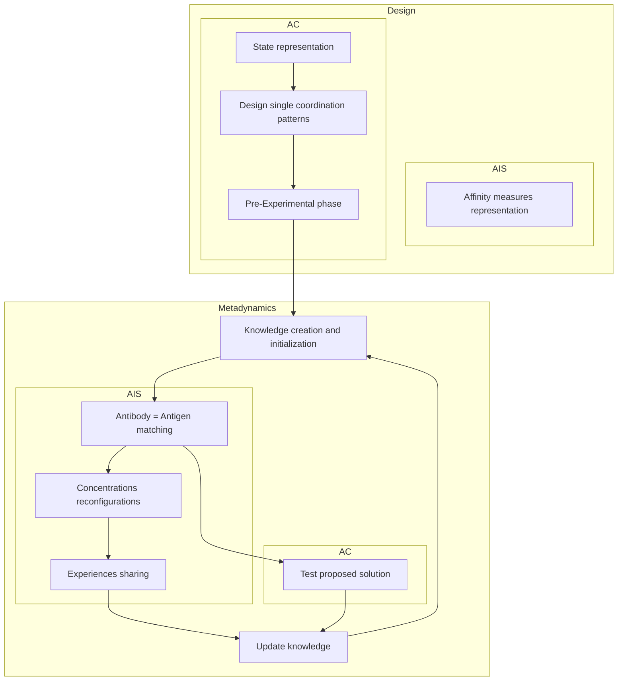

```
# Artificial Immune Systems in the Context of Autonomic Computing: Integrating Design Paradigms

**Nicola Capodieci**  
University of Modena and Reggio Emilia  
nicola.capodieci@unimore.it

**Emma Hart**  
Edinburgh Napier University  
e.hart@napier.ac.uk

**Giacomo Cabri**  
University of Modena and Reggio Emilia  
giacomo.cabri@unimore.it

## ABSTRACT

We describe a design paradigm for developing autonomic computing systems based on an analogy with the natural immune system, and show how current approaches to designing autonomic systems could be enriched by considering alternative design processes based on cognitive immune networks.

## Categories and Subject Descriptors

Computing Methodologies [Artificial Intelligence]: Distributed Artificial Intelligence

## Keywords

Artificial Immune Systems; Autonomic Computing

## 1. INTRODUCTION

With increasing advances in technology, systems comprising of many components must increasingly be managed autonomically — it is straightforward to envisage many systems in which it is either not practical or not feasible for a human to provide continuous input. The first manifest for autonomic computing was proposed by Kephart et al. in [3] and presents a novel paradigm for designing systems that are able to Self-Manage, i.e. autonomously heal, repair, organize and configure in order to overcome both hardware and software faults. Such systems should also optimize their performance in dynamic environments if the stability of the system is threatend. Several design blueprints have been proposed as guidelines for system engineers, with all of them focussing on different levels of autonomicity.

This work is motivated by the recognition that paradigms outside of those traditionally considered in Autonomic Computing might provide insights that enable new frameworks to be built. In particular, we show that it is possible to enhance the standard design methodologies used in autonomic computing by integrating a completely different design pattern that takes inspiration in bio-inspired computing: more specifically the cognitive immune network as theorized by Cohen in [2]. The immune system is composed of large and heterogeneous cells with no central control, highly scalable and able to deal with previously unknown situations — features that are often sought in Autonomic Computing. In particular, the structural properties of the immune system have relevance for those kind of autonomic systems that deal with ensembles: a potentially large set of often heterogeneous components (such as robots or software agents). We propose a formal framework that encapsulates the methodology and steps that should be followed to realise a practical implementation of a bio-inspired autonomic system.

<http://dx.doi.org/10.1145/2598394.2598502>.

Permission to make digital or hard copies of part or all of this work for personal or classroom use is granted without fee provided that copies are not made or distributed for profit or commercial advantage, and that copies bear this notice and the full citation on the first page. Copyrights for third-party components of this work must be honored. For all other uses, contact the owner/author(s). Copyright is held by the author/owner(s).  
GECCO’14, July 12–16, 2014, Vancouver, BC, Canada.  
ACM 978-1-4503-2881-4/14/07.

## 2. INTEGRATING AUTONOMIC COMPUTING AND AIS

The framework brings together the MAPE-K (Monitor Analysing Planning Execution - Knowledge) model proposed by IBM in [4] and the Cognitive Immune Network described by Cohen in [2]. Table 1 provides a mapping between the key concepts of the two models on which the framework depicted in figure 1 relies. The outline of this framework was first described in [1] where a swarm-robotic application was studied in order to test the concept that an immune-network could be used to switch between coordination patterns within a swarm as the environment varied. The reader is directed to [1] for a full discussion of these results which formed a proof-of-concept of this work and informed the more formal and generic framework presented here.

In the model, an antibody consists of a tuple representing the conditions part describes the current environment as sensed by an individual, an action indicating a behavioural coordination-pattern that should be employed and the expectation of the expected utility of performing an action. An antigen represent perceived conditions and an affinity measure represents the distance between the perceived conditions and an antibody’s condition field. Each element of the ensemble contains a network of interconnected antibodies in which the concentration of each antibody varies through feedback and results in the antibody with highest concentration executing its action. Experience (in the form of antibodies) is shared between elements within range of one another, enabling elements within proximity of each other to update their knowledge based on others experiences.

Experience suggests that the coordination patterns chosen by the designer should share common behaviours; this enables one process to act as scaffolding for more than one coordination pattern, i.e. one response can essentially be built on top of another response. Individuals within the ensemble can employ different patterns and act simultaneously — the ensemble does not have to agree on a unanimous decision. Furthermore, adaptation of the networks should take place following an evaluation time that is long enough to reflect performance of the ensemble as a whole.

### Table 1: Mapping the immunological to the computational terminology for autonomic computing

| Cohen’s Cognitive Model | MAPE-K feedback loop |
|---|---|
| Body maintenance and protection | Managed resources |
| Receptor and image repertoire | Knowledge |
| Affinity between environmental signals and immune agents | Sensors |
| Cognition | Monitor |
| Recognition | Analyse |
| Decision via co-respondence | Plan |
| Inflammatory response | Execute |
| Varying connectivity and concentration of immune agents | Effector |

### Figure 1: A schematic representation as a guideline for design and metadynamics for the hybrid model



**Description:** Figure 1 is a schematic process diagram showing a hybrid model that relates the domains of AIS and AC across two phases: “Design” and “Metadynamics.” The diagram is divided vertically into AIS and AC areas and horizontally into design and metadynamics areas. In the design phase, AIS includes “Affinity measures representation,” while AC includes “State representation,” “Design single coordination patterns,” and “Pre-Experimental phase.” In the metadynamics phase, the model includes “Knowledge creation and initialization,” “Antibody = Antigen matching,” “Test proposed solution,” “Concentrations reconfigurations,” “Experiences sharing,” and “Update knowledge.” A time arrow is shown along the left side of the figure, and arrows indicate iterative updating between testing, matching, knowledge update, and reconfiguration/sharing processes.

## 3. CONCLUSION

Through reverse engineering of a practical application, we have developed a formal framework for developing autonomic systems, based on a design pattern borrowed from the natural immune system, recognising commonalities between both systems. The framework has been previously tested in swarm robotic application and now needs to be applied to a range of practical applications within autonomic computing. Nevertheless, it provides the first elaboration of a potential method of combining ideas from two different fields in which the relevant and most useful components from each field are integrated into a single model.

## 4. ACKNOWLEDGMENTS

The work is partially supported by the ASCENS project (EU FP7-FET, Contract No. 257414).

## 5. REFERENCES

[1] N. Capodieci, E. Hart, and G. Cabri. An immune network approach for self-adaptive ensembles of autonomic components: a case study in swarm robotics. In *Advances in Artificial Life, ECAL*, volume 12, pages 864–871, 2013.

[2] I. Cohen. Tending adam’s garden: evolving the cognitive immune self. In *Elsevier Academic Press*, 2004.

[3] P. Horn. Autonomic computing: Ibm’s perspective on the state of information technology. IBM press, 2001.

[4] J. Kephart and D. Chess. The vision of autonomic computing. *Computer*, 36(1):41–50, 2003.
```

```
The main article text and Table 1 were transcribed from the provided parsed text and page image. Figure 1 was reconstructed schematically in Mermaid; due to low image resolution, exact arrow routing, background shading, and small labels/axis annotations may not be perfectly reproduced. The labels visible in the figure were transcribed, including AIS/AC domains, Design/Metadynamics areas, and the main process boxes. No mathematical formulas were present.
```