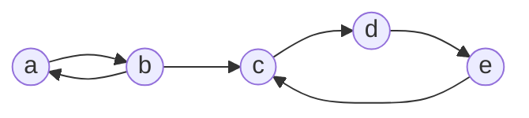
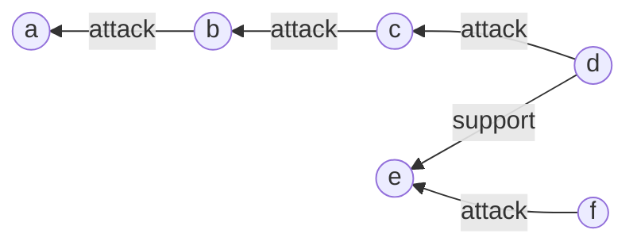
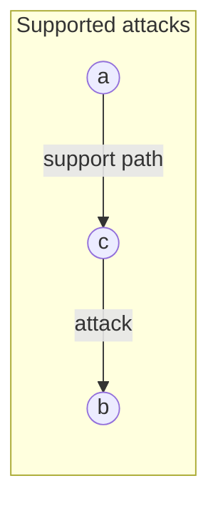
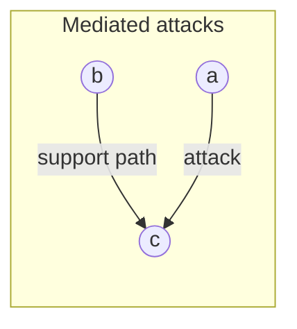
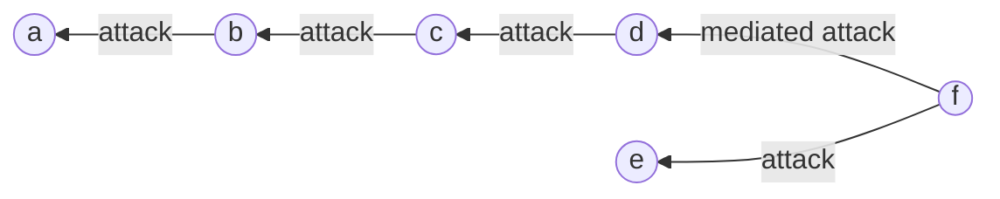
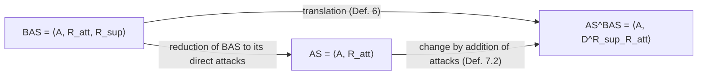
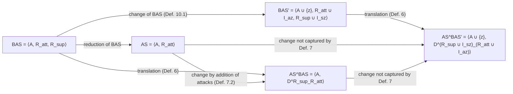
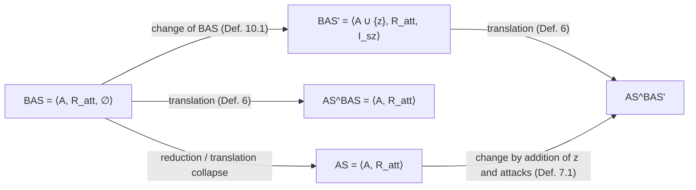

```
# Change in Abstract Bipolar Argumentation Systems

Claudette Cayrol and Marie-Christine Lagasquie-Schiex(B)  
IRIT-UPS, Toulouse, France  
{ccayrol,lagasq}@irit.fr

## Abstract

An argumentation system can undergo changes (addition or removal of arguments/interactions), particularly in multiagent systems. In this paper, we are interested in dynamics of abstract bipolar argumentation systems, i.e. argumentation systems using two kinds of interaction: attacks and supports. We propose change characterizations that use and extend previous results defined in the case of Dung abstract argumentation systems.

**Keywords:** Dynamics of bipolar Argumentation · Deductive support

© Springer International Publishing Switzerland 2015  
C. Beierle and A. Dekhtyar (Eds.): SUM 2015, LNAI 9310, pp. 314–329, 2015.  
DOI: 10.1007/978-3-319-23540-0_21

## 1 Introduction

The main feature of argumentation is the ability to deal with incomplete and/or contradictory information, especially for reasoning [1,19]. Moreover, argumentation can be used to formalize dialogues between several agents by modeling the exchange of arguments in, e.g., negotiation between agents [3,4]. An argumentation system (AS for short) consists of a collection of arguments interacting with each other through a relation reflecting conflicts between them, called attack. An issue of argumentation is then to determine “acceptable” sets of arguments (i.e., sets able to defend themselves collectively while avoiding internal attacks), called “extensions”, and thus to reach a coherent conclusion. Formal frameworks have greatly eased the modeling and study of AS. In particular, the framework of [19] allows for abstracting from the “concrete” meaning of the arguments and relies only on binary interactions that may exist between them. This approach enables the user to focus on other aspects of argumentation, including its dynamic side. Indeed, in the course of a discussion or due to the acquisition of new pieces of information, an AS can undergo changes such as the addition of a new argument or the removal of an argument considered as illegal. This is of particular interest for dialogs in a multiagent system since it is unrealistic to consider that the argumentation system reflecting the dialog can be statically defined. Moreover, it is important to reuse as far as possible computations carried out in the original system. That’s why it is interesting to characterize these changes by giving properties describing a change operation and to provide conditions under which these properties hold. This has been done in several papers[^1], especially [9], for Dung AS with only attacks.

[^1]: See for instance [7,8,11,17,18].

In this paper, we are interested in the extension of this work to bipolar AS (BAS for short), i.e. AS augmented with a second kind of interaction, the support relation. This relation represents a positive interaction between arguments and has been first introduced by [21,29]. In [12], the support relation is left general so that the resulting bipolar framework keeps a high level of abstraction. However there is no single interpretation of the support, and a number of researchers proposed specialized variants of the support relation: deductive support [10], necessary support [23,24], evidential support [25,26]. Each specialization can be associated with an appropriate modelling using appropriate complex attacks. These proposals have been developed quite independently, based on different intuitions and with different formalizations. [14] presents a comparative study in order to restate these proposals in a common setting, the bipolar argumentation framework. The idea is to keep the original arguments, to add complex attacks defined by the combination of the original attacks and the supports, and to modify the classical notions of acceptability. An important contribution of [14] is to highlight a kind of duality between the deductive and the necessary interpretations of support, which results in a duality in the modelling by complex attacks. Handling support is a growing concern: [27] gives a translation between necessary supports and evidential supports; [28] proposes a justification of the necessary support using the notion of subarguments; [22] studies an extension of the necessary support; [20] gives a logical study of bipolar systems; [16] proposes a general framework for taking into account recursive attacks and supports.

However, there is no work concerning the study of the dynamics of a bipolar AS while it is an essential issue for modelling the actions of the participants to a multiagent system:

**Example 1.** Journalists during an editorial board discuss about the publication of an information $I$:

Journalist $J_1$ (Argument $a$): $I$ is important, we must publish it;  
Journalist $J_2$ (Argument $b$): $I$ is about a person $X$, it is forbidden to publish without the agreement of the concerned person and $X$ disagrees with the publication;  
Journalist $J_1$ (Argument $c$): $X$ is a public person (she is the Prime Minister); in this case, her agreement is not mandatory;  
Journalist $J_2$ (Argument $d$): However, I have heard about $X$’s resignation;  
Journalist $J_3$ (Argument $e$): I now understand why CNN has announced yesterday the postponement of the Council of Ministers;  
Journalist $J_4$ (Argument $f$): However, yesterday was April Fools’ Day; so CNN news announced yesterday are not reliable.

This example illustrates a typical situation between agents that exchange arguments in order to take a decision (here, publish or not publish information $I$). In this dialog, one can see arguments (here, informal arguments corresponding to pieces of dialog), attacks (for instance Argument $b$ attacks Argument $a$), supports (between Argument $d$ and Argument $e$); and the dynamics of argumentation is illustrated by the dynamics of the dialog: at each step of the dialog, the global argumentation system evolves (here, by the addition of an argument and an interaction).

In this paper, we define the update of BAS and characterize it in a special case: a BAS reduced to an AS that is changed by the introduction of a new argument that interacts with another argument using supports. Such an update is realized using a combination of the works of both domains (bipolar argumentation and dynamics of argumentation).

Background is given in Sect. 2 for AS and BAS, and in Sect. 3 for change operations. Section 4 proposes a change operation concerning a BAS. Characterizations of this new change operation are presented in Sect. 5. Finally, Sect. 6 concludes and suggests perspectives. The proofs are given in [15].

## 2 Abstract Bipolar Argumentation System

### 2.1 Abstract Argumentation System

Dung’s abstract framework consists of a set of arguments and only one type of interaction between these arguments, these interactions representing attacks.

**Definition 1 (Dung AS).** A Dung argumentation system (AS, for short) is a pair $\langle A, R\rangle$ where $A$ is a finite and non-empty set of arguments and $R$ is a binary relation over $A$ (a subset of $A \times A$), called the attack relation.

An AS can be represented by a directed graph denoted by $G$, in which nodes represent arguments and edges are defined by the attack relation: $\forall a,b \in A$, $aRb$ is represented by $a \mapsto b$. Semantics introduced by Dung enable to characterize admissible sets of arguments that satisfy a form of optimality. Here we only use (see [6] for a survey of semantics in abstract AS):

**Definition 2 (Admissibility, Extensions).** Given $AS = \langle A, R\rangle$ and $S \subseteq A$,

- $S$ is conflict-free in AS if and only if (iff for short) there are no arguments $a,b \in S$, such that (s.t. for short) $aRb$.
- $a \in A$ is acceptable in AS with respect to (wrt for short) $S$ iff $\forall b \in A$ s.t. $bRa$, $\exists c \in S$ s.t. $cRb$. $F$ denotes the characteristic function of AS defined by $\forall S \subseteq A$, $F(S) = \{x \text{ s.t. } x \text{ is acceptable in AS wrt } S\}$.
- $S$ is admissible in AS iff $S$ is conflict-free and each argument in $S$ is acceptable in AS wrt $S$.
- $S$ is a preferred extension of AS iff it is a maximal (wrt $\subseteq$) admissible set in AS.
- $S$ is a stable extension of AS iff it is conflict-free and for each $a \notin S$, there is $b \in S$ s.t. $bRa$.
- $S$ is the grounded extension of AS iff it is the least fixpoint of $F$.

**Example 2.** Let AS be represented by the following graph. $\{a\}$ and $\{b,d\}$ are the two preferred extensions, $\{b,d\}$ is also stable and $\emptyset$ is the grounded extension.



**Figure description (Example 2 graph).** The figure is a directed argumentation graph with five arguments $a,b,c,d,e$. It depicts attacks $a \mapsto b$, $b \mapsto a$, $b \mapsto c$, $c \mapsto d$, $d \mapsto e$, and $e \mapsto c$.

The status of an argument is determined by its membership to the extensions of the selected semantics: e.g., an argument is “skeptically accepted” (resp. “credulously”) if it belongs to all the extensions (resp. at least to one extension) and “rejected” if it does not belong to any extension.

### 2.2 Abstract Bipolar Argumentation System

The abstract bipolar argumentation framework presented in [13] extends Dung’s framework in order to take into account both negative interactions expressed by the attack relation and positive interactions expressed by a support relation (see [2] for a more general survey about bipolarity in argumentation).

**Definition 3 (BAS).** A bipolar argumentation system (BAS, for short) is a tuple $\langle A, R_{\mathrm{att}}, R_{\mathrm{sup}}\rangle$ where $A$ is a finite and non-empty set of arguments, $R_{\mathrm{att}}$ is a binary relation over $A$ called the attack relation and $R_{\mathrm{sup}}$ is a binary relation over $A$ called the support relation.

A BAS can still be represented by a directed graph $G_b$, with two kinds of edges: let $a$ and $b \in A$, $aR_{\mathrm{att}}b$ (resp. $aR_{\mathrm{sup}}b$) means that $a$ attacks $b$ (resp. $a$ supports $b$) and it is represented by $a \mapsto b$ (resp. by $a \to b$).

Among the different variants defined for interpreting a support between arguments, [10] proposed the notion of deductive support. This notion is intended to enforce the following constraint: If $bR_{\mathrm{sup}}c$ then the acceptance of $b$ implies the acceptance of $c$, and as a consequence the non-acceptance of $c$ implies the non-acceptance of $b$. The support used in Example 1 can be considered as a deductive one (If $X$ has resigned then the Council of Ministers must be postponed):

**Example 1 (cont’d).** The bipolar argumentation system corresponding to the editorial board can be represented by:



**Figure description (Example 1 BAS graph).** The figure is a bipolar argumentation graph with arguments $a,b,c,d,e,f$. It shows attacks $b$ to $a$, $c$ to $b$, $d$ to $c$, and $f$ to $e$, and one deductive support from $d$ to $e$.

In order to compute semantics of a BAS, one of the main proposals is to translate the BAS into an AS expressing the new attacks due to the presence of supports (this kind of “flattening” is studied for instance in [20]). For deductive support, two kinds of attack can be added. The first one, called mediated attack in [10], corresponds to the case when $bR_{\mathrm{sup}}c$ and $aR_{\mathrm{att}}c$: the acceptance of $a$ implies the non-acceptance of $c$ and so the non-acceptance of $b$.

**Definition 4 (Mediated attack).** [10] Let $BAS = \langle A, R_{\mathrm{att}}, R_{\mathrm{sup}}\rangle$. There is a mediated attack from $a$ to $b$ iff there is a sequence $a_1R_{\mathrm{sup}}\cdots R_{\mathrm{sup}}a_{n-1}$, and $a_nR_{\mathrm{att}}a_{n-1}$, $n \geq 3$, with $a_1=b$, $a_n=a$. $M^{R_{\mathrm{sup}}}_{R_{\mathrm{att}}}$ denotes the set of mediated attacks generated by $R_{\mathrm{sup}}$ on $R_{\mathrm{att}}$.

Moreover, the deductive interpretation of support justifies the introduction of another attack (called supported attack in [13]): if $aR_{\mathrm{sup}}c$ and $cR_{\mathrm{att}}b$, the acceptance of $a$ implies the acceptance of $c$ and the acceptance of $c$ implies the non-acceptance of $b$; so, the acceptance of $a$ implies the non-acceptance of $b$.

**Definition 5 (Supported attack).** [13] Let $BAS = \langle A, R_{\mathrm{att}}, R_{\mathrm{sup}}\rangle$. There is a supported attack from $a$ to $b$ iff there is a sequence $a_1R_{\mathrm{sup}}\cdots R_{\mathrm{sup}}a_{n-1}R_{\mathrm{att}}a_n$, $n \geq 3$, with $a_1=a$, $a_n=b$. $S^{R_{\mathrm{sup}}}_{R_{\mathrm{att}}}$ denotes the set of supported attacks generated by $R_{\mathrm{sup}}$ on $R_{\mathrm{att}}$.

So, the deductive interpretation of support produces new kinds of attack, from $a$ to $b$, in the following cases:





By iterating the construction, d-attacks can be defined:[^2]

[^2]: It generalizes mediated, supported and also the “super-mediated attack” defined in [14].

**Definition 6 (d-attacks).** [14] Let $BAS = \langle A, R_{\mathrm{att}}, R_{\mathrm{sup}}\rangle$ with $R_{\mathrm{sup}}$ being a set of deductive supports. There exists a d-attack from $a$ to $b$ iff

- either $aR_{\mathrm{att}}b$, or $aS^{R_{\mathrm{sup}}}_{R_{\mathrm{att}}}b$, or $aM^{R_{\mathrm{sup}}}_{R_{\mathrm{att}}}b$ (Basic case),
- or there exists an argument $c$ s.t. there is a sequence of supports from $a$ to $c$ and $c$ d-attacks $b$ (Case 1),
- or there exists an argument $c$ s.t. $a$ d-attacks $c$ and there is a sequence of supports from $b$ to $c$ (Case 2).

$D^{R_{\mathrm{sup}}}_{R_{\mathrm{att}}}$ denotes the set of d-attacks generated by $R_{\mathrm{sup}}$ on $R_{\mathrm{att}}$. $\langle A, D^{R_{\mathrm{sup}}}_{R_{\mathrm{att}}}\rangle$ is called the deductive associated Dung AS of BAS and denoted by $AS^{BAS}$.

**Example 1 (Cont’d).** The deductive associated Dung AS can be represented by (a mediated attack appears from $f$ to $d$):



Then, in this system, using for instance the preferred semantics, one can conclude to the acceptability of $a$ (so the information $I$ will be published).

Turning BAS into $AS^{BAS}$ enables to consider the semantics defined by Dung. Moreover, the first step leading to add new attacks, it falls within works about dynamics of AS.

## 3 Dynamics in Argumentation Systems

When studying argumentation dynamics, an important issue is to save computation, that is to reuse as far as possible previous computations carried out in the original argumentation system. This issue has been extensively discussed in [9] with the following methodology: A typology of change operations has been proposed and the impact of each change operation on the computation of the extensions has been studied. So, the work of [9] is particularly suitable for our purpose and easily adaptable.[^3] In this paper, following Example 1, we use the change operations corresponding to either the addition of an argument and the interactions (only attacks) involving it, or the addition of some interactions:

[^3]: Other works could be considered for addressing the issue of incremental computation in a dynamic context. [5] for instance presents a more general approach dealing with modularity in abstract argumentation, based on the partition of an argumentation framework in interacting subframeworks. However, the application to our purpose is not straightforward and requires further investigation.

**Definition 7 (Addition in an AS).** Let $AS = \langle A, R\rangle$.

1. Let $z$ be an argument and $I_z$ be a set of interactions s.t. $I_z \subseteq (A \times \{z\}) \cup (\{z\} \times A)$. Adding $z$ and $I_z$ is a change operation, denoted by $\oplus^z_{I_z}$, providing a new system s.t.:

   $$\oplus^z_{I_z}\langle A, R\rangle = \langle A \cup \{z\}, R \cup I_z\rangle.$$

2. Let $I$ be a set of interactions s.t. $I \subseteq (A \times A)$ and $I \cap R = \emptyset$. Adding $I$ is a change operation, denoted by $\oplus_I$, providing a new system s.t.:

   $$\oplus_I\langle A, R\rangle = \langle A, R \cup I\rangle.$$

The AS resulting of a change, denoted by $AS' = \langle A', R'\rangle$, is represented by $G'$.

In each case, given a semantics, the set of extensions of AS (resp. $AS'$) is denoted by $\mathcal{E}$ (resp. $\mathcal{E}'$), with $E_1,\ldots,E_n$ (resp. $E'_1,\ldots,E'_n$) standing for the extensions. We consider the same semantics before and after the change.

The impact of a change operation has been studied in [9] through the notion of change property that can be seen as a set of pairs $(G,G')$, where $G$ and $G'$ are argumentation graphs. Here we just recall some of these properties.

### Properties about the set of extensions

Change properties express structural modifications of an AS that are caused by a change operation. For that purpose, a partition based on three possible cases of evolution of the set of extensions has been defined in [9]: the extensive (resp. restrictive, constant) case, in which the number of extensions increases (resp. decreases, remains the same).

For each case, numerous sub-cases are proposed and denoted by a letter ($e$ for the extensive case, $r$ for the restrictive case and $c$ for the constant case) subscripted by the expression $\gamma-\gamma'$, where $\gamma$ (resp. $\gamma'$) describes the set of extensions before (resp. after) the change. Thus $\gamma$ and $\gamma'$ can be:

- $\emptyset$: the set of extensions is empty,
- $1e$: the set of extensions is reduced to one empty extension,
- $1ne$: the set of extensions is reduced to one non-empty extension,
- $k$ (resp. $j$): the set of extensions contains $k$ (resp. $j$) extensions s.t. $1 < k$ (resp. $1 < j < k$: note that the symbol $j$ is used only if the symbol $k$ belongs also to the expression $\gamma-\gamma'$).

For instance, the notation $e_{\emptyset-1ne}$ means that the change increases the number of extensions (so it is an extensive case), with no initial extension ($\emptyset$) and one non-empty final extension ($1ne$). Nevertheless, some special sub-cases of the constant case are denoted by another method since they are based on notions distinct from the emptiness or the number of the extensions; for these sub-cases, the subscript is replaced by a qualifier. For instance, the c-conservative case describes the case where the extensions remain unchanged after the change.

Here is the formal definition of these changes:

**Definition 8 (Extensive, Restrictive and Constant changes).** The change from $G$ to $G'$ is extensive (resp. restrictive, constant) iff $|\mathcal{E}| < |\mathcal{E}'|$ (resp. $|\mathcal{E}| > |\mathcal{E}'|$, $|\mathcal{E}| = |\mathcal{E}'|$).[^4]

[^4]: Let $S$ be a set, $|S|$ denotes the cardinality of $S$.

1. The sub-cases of extensive changes from $G$ to $G'$ are:

   (a) $e_{\emptyset-1ne}$ iff $|\mathcal{E}| = 0$ and $|\mathcal{E}'| = 1$, with the unique $E' \neq \emptyset$.

   (b) $e_{\emptyset-k}$ iff $|\mathcal{E}| < |\mathcal{E}'|$, $|\mathcal{E}| = 0$ and $|\mathcal{E}'| > 1$.

   (c) $e_{1e-k}$ iff $|\mathcal{E}| < |\mathcal{E}'|$ and $|\mathcal{E}| = 1$, with the unique $E = \emptyset$.

   (d) $e_{1ne-k}$ iff $|\mathcal{E}| < |\mathcal{E}'|$ and $|\mathcal{E}| = 1$, with the unique $E \neq \emptyset$.

   (e) $e_{j-k}$ iff $1 < |\mathcal{E}| < |\mathcal{E}'|$.

2. The sub-cases of restrictive changes from $G$ to $G'$ are:

   (a) $r_{1ne-\emptyset}$ iff $|\mathcal{E}| = 1$, with the unique $E \neq \emptyset$, and $|\mathcal{E}'| = 0$.

   (b) $r_{k-\emptyset}$ iff $|\mathcal{E}| > |\mathcal{E}'|$, $|\mathcal{E}| > 1$ and $|\mathcal{E}'| = 0$.

   (c) $r_{k-1e}$ iff $|\mathcal{E}| > |\mathcal{E}'|$ and $|\mathcal{E}'| = 1$, with the unique $E' = \emptyset$.

   (d) $r_{k-1ne}$ iff $|\mathcal{E}| > |\mathcal{E}'|$ and $|\mathcal{E}'| = 1$, with the unique $E' \neq \emptyset$.

   (e) $r_{k-j}$ iff $1 < |\mathcal{E}'| < |\mathcal{E}|$.

3. The sub-cases of constant changes from $G$ to $G'$ are:

   (a) c-conservative iff $\mathcal{E} = \mathcal{E}'$.

   (b) $c_{1e-1ne}$ iff $\mathcal{E} = \{\emptyset\}$ and $\mathcal{E}' = \{E'\}$, with $E' \neq \emptyset$.

   (c) $c_{1ne-1e}$ iff $\mathcal{E} = \{E\}$, with $E \neq \emptyset$ and $\mathcal{E}' = \{\emptyset\}$.

   (d) c-expansive iff $\mathcal{E} \neq \emptyset$ and $|\mathcal{E}| = |\mathcal{E}'|$ and $\forall E_i \in \mathcal{E}$, $\exists E'_j \in \mathcal{E}'$, $\emptyset \neq E_i \subset E'_j$ and $\forall E'_j \in \mathcal{E}'$, $\exists E_i \in \mathcal{E}$, $\emptyset \neq E_i \subset E'_j$.

   (e) c-narrowing iff $\mathcal{E} \neq \emptyset$ and $|\mathcal{E}| = |\mathcal{E}'|$ and $\forall E_i \in \mathcal{E}$, $\exists E'_j \in \mathcal{E}'$, $\emptyset \neq E'_j \subset E_i$ and $\forall E'_j \in \mathcal{E}'$, $\exists E_i \in \mathcal{E}$, $\emptyset \neq E'_j \subset E_i$.

   (f) c-altering iff $|\mathcal{E}| = |\mathcal{E}'|$ and it is neither c-conservative, nor $c_{1e-1ne}$, nor $c_{1ne-1e}$, nor c-expansive, nor c-narrowing.

Definition 8.3a–c and 3f are fairly straightforward. Definition 8.3d states that a c-expansive change is a change where all the extensions of $G$, which are initially not empty, are increased by some arguments. A c-narrowing change, according to Definition 8.3e, is a change where all the extensions of $G$ are reduced by some arguments without becoming empty.

**Example 1 (Cont’d).** All agents always propose constant changes, since they want to take a decision without ambiguity. For instance, consider the second turn of the dialog: using the preferred semantics, the current extension is $\{c,a\}$, and $J_2$ chooses a c-altering change because she totally disagrees with this extension.

### Properties about the acceptability of a set of arguments

A change can also have an impact on the acceptability of sets of arguments. For instance, in a dialog, it would be interesting to know whether the addition (or the removal) of an argument modifies the acceptability of the arguments previously accepted. We say “monotony from $G$ to $G'$” when every argument accepted before the change is still accepted after the change, i.e., no accepted argument is lost and there is a (not necessarily strict) expansion of acceptability.[^5]

[^5]: A second case, referred as “monotony from $G'$ to $G$”, has been described in [9]. It is not used in this paper.

**Definition 9 (Simple expansive monotony).** The change from $G$ to $G'$ satisfies the property of simple expansive monotony iff $\forall E_i \in \mathcal{E}$, $\exists E'_j \in \mathcal{E}'$, $E_i \subseteq E'_j$.

Note that [9] describes many other properties such as, for instance, a property of “enforcement”[^6] that would be interesting for $J_1$ in Example 1 in order to obtain the acceptability of Argument $a$.

[^6]: This property is described in [8] and only considers the status of an argument after the change without taking into account the evolution of extensions. Of course, many other possibilities could be defined (e.g. combining extensiveness and monotony).

## 4 A Change Operation Taking into Account Support

First of all, it should be noted that turning $BAS = \langle A, R_{\mathrm{att}}, R_{\mathrm{sup}}\rangle$ into its deductive associated Dung system $AS^{BAS}$ corresponds to the update of a specific system, $AS = \langle A, R_{\mathrm{att}}\rangle$, the reduction of BAS to its direct attacks (see Fig. 1). The next step is to allow for updating a BAS. So Definition 7 is generalized:



**Fig. 1.** The translation of BAS into $AS^{BAS}$ is an update.

**Definition 10 (Addition in a BAS).** Let $BAS = \langle A, R_{\mathrm{att}}, R_{\mathrm{sup}}\rangle$.

1. Let $z$ be an argument, $I_{az}$ (resp. $I_{sz}$) be a set of attacks (resp. supports) concerning $z$. $I_{sz} \cup I_{az}$ is denoted by $I_z$. We assume that $I_z \subseteq (A \times \{z\}) \cup (\{z\} \times A)$.

   Adding $z$ and $I_z$ is a change operation, denoted by $\oplus^z_{(I_a,I_s)}$, providing a new BAS s.t.:

   $$\oplus^z_{(I_a,I_s)}\langle A, R_{\mathrm{att}}, R_{\mathrm{sup}}\rangle = \langle A \cup \{z\}, R_{\mathrm{att}} \cup I_{az}, R_{\mathrm{sup}} \cup I_{sz}\rangle.$$

2. Let $I_a$ (resp. $I_s$) be a set of attacks (resp. supports). $I_s \cup I_a$ is denoted by $I$. We assume that $I \subseteq (A \times A)$ and $I \cap (R_{\mathrm{att}} \cup R_{\mathrm{sup}}) = \emptyset$.

   Adding $I$ is a change operation, denoted by $\oplus_{(I_a,I_s)}$, providing a new BAS s.t.:

   $$\oplus_{(I_a,I_s)}\langle A, R_{\mathrm{att}}, R_{\mathrm{sup}}\rangle = \langle A, R_{\mathrm{att}} \cup I_a, R_{\mathrm{sup}} \cup I_s\rangle.$$

The system resulting of a change is denoted by $BAS' = \langle A', R'_{\mathrm{att}}, R'_{\mathrm{sup}}\rangle$ and its deductive associated Dung AS is denoted by $AS^{BAS'}$.

Due to lack of place, in this paper, we only study the case corresponding to Definition 10.1. As we consider deductive support and from Definitions 10 and 6, the following consequence obviously holds:

**Consequence 1.** Let $BAS = \langle A, R_{\mathrm{att}}, R_{\mathrm{sup}}\rangle$. Let $\oplus^z_{(I_a,I_s)}$ be a change operation on BAS producing $BAS'$. 

$$AS^{BAS'} = \langle A \cup \{z\}, D^{R_{\mathrm{sup}}\cup I_{sz}}_{R_{\mathrm{att}}\cup I_{az}}\rangle.$$

Due to the above result, it seems natural to study the update of BAS by comparing $AS^{BAS}$ and $AS^{BAS'}$. However, it is not always possible to identify a unique change on $AS^{BAS}$, as defined in Definition 7, that produces $AS^{BAS'}$. Indeed, the addition of an argument with interactions in BAS can induce the addition in $D^{R_{\mathrm{sup}}}_{R_{\mathrm{att}}}$ of new attacks between arguments of $A$ (see Example 3).

**Example 3.** Let $BAS = \langle \{a,b\}, \emptyset, \emptyset\rangle$, let us apply on BAS the change $\oplus^z_{(I_a,I_s)}$ with $I_{az} = \{(a,z)\}$ and $I_{sz} = \{(b,z)\}$; in this case, following Definitions 10.1 and 6, $AS^{BAS'}$ contains the new attack $(a,b)$ that does not concern $z$ (and this attack appears only because there is a support from $b$ to $z$).

Another example shows that this problem also exists even if $I_{az} = \emptyset$:

**Example 4.** Consider $BAS = \langle \{a,b,c\}, \{(c,a)\}, \emptyset\rangle$, and apply on BAS the change $\oplus^z_{(I_a,I_s)}$ with $I_{az} = \emptyset$ and $I_{sz} = \{(b,z),(z,c)\}$; in this case, following Definitions 10.1 and 6, $AS^{BAS'}$ contains the new attack $(b,a)$ that does not concern $z$.

So, if we add an argument $z$ with at least one support in BAS, the change of $AS^{BAS}$ into $AS^{BAS'}$ cannot always be expressed using either Definition 7.1 (since attacks are added that do not concern $z$), or Definition 7.2 (since the argument $z$ is added). The links between the different systems are illustrated by Fig. 2.



**Fig. 2.** Links between the different systems.

This suggests to consider elementary changes (addition of one attack or one support). In this paper, we consider two particular cases. The first one concerns a BAS with only one support from $z$ to $a$, $z$ being unattacked. In this case, Definition 6 obviously implies that $z$ has in $AS^{BAS}$ exactly the same role as $a$ in AS:

**Proposition 1.** Let $BAS = \langle A, R_{\mathrm{att}}, R_{\mathrm{sup}}\rangle$ with $R_{\mathrm{sup}} = \{(z,a)\}$ and $z$ is not attacked in BAS. The following properties hold:

- if $a$ is unattacked in BAS then $z$ is unattacked in $AS^{BAS}$ (no direct attack, no direct or inductive supported or mediated attack on $z$);
- if $a$ is attacked by $b$ in BAS then $z$ is attacked by $b$ in $AS^{BAS}$ (this is a mediated attack on $z$);
- if $a$ attacks $b$ in BAS then $z$ attacks $b$ in $AS^{BAS}$ (this is a supported attack).
- if $a$ is defended by $c$ against $b$ in BAS then $z$ is defended by $c$ against $b$ in $AS^{BAS}$ (the defence of a direct attack on $a$ can be used for the defence of the mediated attack on $z$).
- if $c$ is defended by $b$ against $a$ in BAS then $c$ is defended by $b$ against $z$ in $AS^{BAS}$ (a mediated attack can be used as a defence against a supported attack).

A second particular case concerns a BAS with only one support on an unattacked argument. In this case, Definition 6 obviously implies that the set of attacks remains unchanged:

**Proposition 2.** Let $BAS = \langle A, R_{\mathrm{att}}, R_{\mathrm{sup}}\rangle$ with $R_{\mathrm{sup}} = \{(a,z)\}$ and $z$ unattacked by BAS. Then $D^{R_{\mathrm{sup}}}_{R_{\mathrm{att}}} = R_{\mathrm{att}}$.

Moreover, in these particular cases, following Definition 10.1, Propositions 1 and 2, the addition of one argument involved in only one support in BAS cannot add attacks between arguments of $A$ and preserves acceptability:

**Proposition 3.** Let $BAS = \langle A, R_{\mathrm{att}}, R_{\mathrm{sup}}\rangle$ s.t. $R_{\mathrm{sup}} = \emptyset$.[^7] Let $\oplus^z_{(I_a,I_s)}$ be a change operation defined on BAS with $I_{az} = \emptyset$, $|I_{sz}| = 1$ and producing $BAS'$.

[^7]: In this case, BAS is reduced to an AS. So BAS, its reduction AS and $AS^{BAS}$ collapse.

- $\forall x,y \in A$, s.t. $y$ does not attack $x$ in BAS then there is no attack from $y$ to $x$ in $AS^{BAS'}$.
- $\forall y \in A$, if $y$ is unattacked in BAS then it remains unattacked in $AS^{BAS'}$.
- Consider $F$ (resp. $F'$) the characteristic function of AS (resp. $AS^{BAS'}$). $\forall S \subseteq A$, $F(S) \subseteq F'(S)$.

Thus, considering a BAS reduced to an AS (i.e. without any support), if we add only one argument with one support, the links between the different systems are given by Fig. 3.



**Fig. 3.** Links between systems if there is no support in BAS.

So we are able to characterize the addition of a support by an addition of attacks. In the next section, we study this simplified change operation.

## 5 Characterizing the Addition of an Argument and a Support

In Sect. 5.1 (resp. Sect. 5.2), we give some results about the characterization of the addition of a supported (resp. supporting) argument in a BAS.

### 5.1 Case of an Added Supported Argument

In this case, as a direct application of Proposition 2, we prove that the update of a BAS without supports has a deductive associated Dung AS that corresponds to the addition of an argument without interaction into the initial BAS.

**Proposition 4.** Let $BAS = \langle A, R_{\mathrm{att}}, R_{\mathrm{sup}}\rangle$ s.t. $R_{\mathrm{sup}} = \emptyset$. Let $\oplus^z_{(I_a,I_s)}$ be a change operation defined on BAS with $I_{az} = \emptyset$ and $I_{sz} = \{(a,z)\}$ and producing $BAS'$. 

$$AS^{BAS'} = \oplus^z_{\emptyset}\langle A, R_{\mathrm{att}}\rangle.$$

Due to Proposition 4, Definitions 7.1 and 10.1, we have:

**Proposition 5.** Let $BAS = \langle A, R_{\mathrm{att}}, R_{\mathrm{sup}}\rangle$ s.t. $R_{\mathrm{sup}} = \emptyset$. Let $\oplus^z_{(I_a,I_s)}$ be a change operation defined on BAS with $I_{az} = \emptyset$ and $I_{sz} = \{(a,z)\}$ and producing $BAS'$. Let $s$ be a semantics $\in \{\text{grounded}, \text{preferred}, \text{stable}\}$. $E$ is an extension of AS under $s$ iff $E' = E \cup \{z\}$ is an extension of $AS^{BAS'}$ under $s$. Moreover, there is no stable extension in AS iff there is no stable extension in $AS^{BAS'}$.

And an obvious consequence of Proposition 5 is:

**Consequence 2.** The change $\oplus^z_{(\emptyset,\{(a,z)\})}$ is only either c-expansive, or $c_{1e-1ne}$, or c-conservative. In the last case, the only possibility is $\mathcal{E} = \mathcal{E}' = \emptyset$.

Some examples of this change are given in Table 1.

**Table 1. Addition of a supported argument in an AS**

| BAS (reduced to an AS) updated with $z$ and the support $(a,z)$ | $AS^{BAS'}$ | Extensions before change | Extensions after change | Change |
|---|---|---|---|---|
| Attack edges: $c \mapsto b$, $b \mapsto a$. Support edge: $a \to z$. | Attack edges: $c \mapsto b$, $b \mapsto a$. $z$ is isolated. | $\{a,c\}$ is the grounded, preferred and stable extension. | $\{a,c,z\}$ is the grounded, preferred and stable extension. | The change is c-expansive. |
| Attack edges: $a \mapsto c$, $c \mapsto a$. Support edge: $a \to z$. | Attack edges: $a \mapsto c$, $c \mapsto a$. $z$ is isolated. | $\emptyset$ is the grounded extension; $\{a\}$ and $\{c\}$ are the preferred and stable extensions. | $\{z\}$ is the grounded extension; $\{a,z\}$ and $\{c,z\}$ are the preferred and stable extensions. | The change is c-expansive (preferred, stable) or $c_{1e-1ne}$ (grounded). |
| Attack edges: $a \mapsto b$, $b \mapsto c$, $c \mapsto a$. Support edge: $a \to z$. | Attack edges: $a \mapsto b$, $b \mapsto c$, $c \mapsto a$. $z$ is isolated. | $\emptyset$ is the grounded and preferred extensions; there is no stable extension. | $\{z\}$ is the grounded and preferred extension; there is no stable extension. | The change is c-expansive (preferred), or $c_{1e-1ne}$ (grounded), or c-conservative (stable). |

### 5.2 Case of an Added Supporting Argument

In this case, the existence of cycles is preserved as shown by:

**Proposition 6.** Let $BAS = \langle A, R_{\mathrm{att}}, R_{\mathrm{sup}}\rangle$ s.t. $R_{\mathrm{sup}} = \emptyset$. Let $\oplus^z_{(I_a,I_s)}$ be a change operation defined on BAS with $I_{az} = \emptyset$, $I_{sz} = \{(z,a)\}$ and producing $BAS'$.

- If $a$ belongs to a cycle of attacks in BAS then $z$ belongs to a new cycle of attacks in $AS^{BAS'}$ and the length of both cycles is the same.
- If $a$ does not belong to a cycle of attacks in BAS then there is no cycle of attacks in $AS^{BAS'}$ involving $z$.

This result is proven using Definitions 4–6 and by reductio ad absurdum for the second item. Moreover, following Definition 6 and Proposition 1, we can characterize the impact of this change for stable semantics:

**Table 2. Addition of a supporting argument in an AS**

| BAS (reduced to an AS) updated with $z$ and the support $(z,a)$ | $AS^{BAS'}$ | Extensions before change | Extensions after change | Change |
|---|---|---|---|---|
| Support edge: $z \to a$. No attack edge. | $z$ and $a$ are isolated. | $\{a\}$ is the grounded, preferred and stable extension. | $\{a,z\}$ is the grounded, preferred and stable extension. | The change is c-expansive. |
| Attack edge: $a \mapsto a$. Support edge: $z \to a$. | Attack edges include $a \mapsto a$, $z \mapsto a$, and $a \mapsto z$. | $\emptyset$ is the grounded and preferred extension; there is no stable extension. | $\{z\}$ is the grounded, preferred and stable extension. | The change is $c_{1e-1ne}$ (grounded, preferred) or $e_{\emptyset-1ne}$ (stable). |
| Attack edge: $b \mapsto a$. Support edge: $z \to a$. | Attack edges: $b \mapsto a$ and $b \mapsto z$. | $\{b\}$ is the grounded, preferred and stable extension. | $\{b\}$ is the grounded, preferred and stable extension. | The change is c-conservative. |
| Support edge: $z \to a$. The diagram also depicts a loop on $a$ and several attacks among $a,b,c,d$; exact directions of all attacks are [illegible]. | The associated graph adds attacks involving $z$ generated by the support $z \to a$; exact directions of all attacks are [illegible]. | $\emptyset$ is the grounded and preferred extension; there is no stable extension. | $\emptyset$ is the grounded extension; $\{z,c\}$ and $\{z,d\}$ are the preferred and stable extensions. | The change is c-conservative (grounded) or $e_{1e-k}$ (preferred), or $e_{\emptyset-k}$ (stable). |
| Attack edges include a loop on $a$ and attacks between $a$ and $b$; support edge: $z \to a$. | The associated graph adds attacks involving $z$ generated by the support $z \to a$; the figure shows attacks among $z,a,b$ including the generated attacks. | $\emptyset$ is the grounded extension; $\{b\}$ is the preferred and stable extension. | $\emptyset$ is the grounded extension; $\{b\}$ and $\{z\}$ are the preferred and stable extensions. | The change is c-conservative (grounded) or $e_{1ne-k}$ (preferred, stable). |
| Support edge: $z \to a$. The diagram depicts a loop on $a$ and several attacks among $a,b,c$; exact directions of all attacks are [illegible]. | The associated graph adds attacks involving $z$ generated by the support $z \to a$; exact directions of all attacks are [illegible]. | $\emptyset$ is the grounded extension; $\{b\}$ and $\{c\}$ are the preferred and stable extensions. | $\emptyset$ is the grounded extension; $\{b\}$, $\{c\}$ and $\{z\}$ are the preferred and stable extensions. | The change is c-conservative (grounded) or $e_{j-k}$ (preferred, stable). |

**Proposition 7.** Let $BAS = \langle A, R_{\mathrm{att}}, R_{\mathrm{sup}}\rangle$ s.t. $R_{\mathrm{sup}} = \emptyset$. Let $\oplus^z_{(I_a,I_s)}$ be a change operation defined on BAS with $I_{az} = \emptyset$ and $I_{sz} = \{(z,a)\}$ and producing $BAS'$. Let $E$ be a stable extension of AS:

- if $a \notin E$ then $E$ is a stable extension of $AS^{BAS'}$;
- if $a \in E$ then $E \cup \{z\}$ is a stable extension of $AS^{BAS'}$.

And more generally, the simple expansive monotony of the change operation can be proven:

**Proposition 8.** Let $BAS = \langle A, R_{\mathrm{att}}, R_{\mathrm{sup}}\rangle$ s.t. $R_{\mathrm{sup}} = \emptyset$. Let $s$ be a semantics belonging to $\{\text{grounded}, \text{preferred}, \text{stable}\}$. Let $\oplus^z_{(I_a,I_s)}$ be a change operation defined on BAS with $I_{az} = \emptyset$ and $I_{sz} = \{(z,a)\}$ and producing $BAS'$.

$$\forall E \text{ extension of AS under } s,\ \exists E' \text{ an extension of } AS^{BAS'} \text{ under } s \text{ s.t. } E \subseteq E'.$$

This result is proven using Definition 2, Propositions 1 and 3, by induction on the characteristic function for the grounded semantics, showing that $E$ is admissible in $AS^{BAS'}$ for the preferred semantics and following Proposition 7 for the stable semantics. An obvious consequence of the two previous results is:

**Consequence 3.** The change $\oplus^z_{(\emptyset,\{(z,a)\})}$ cannot be restrictive, nor c-narrowing, nor c-altering, nor $c_{1ne-1e}$.

Some examples of this change are given in Table 2.

## 6 Conclusion and Future Works

This paper presents preliminary work about change for abstract bipolar argumentation systems, i.e. where there exist two kinds of interaction, attacks and supports. The central idea is to take advantage of two kinds of previous works, works about dynamics in argumentation systems (AS) and works about bipolar argumentation systems (BAS). Indeed, it has been shown that a BAS can be turned into a standard Dung’s AS by adding appropriate attacks. Our main contribution is to show how the addition of one argument together with one support involving it (and without any attack) impacts the extensions of the resulting system. In this particular case, we have clearly identified the attacks that must be added and we have obtained specific properties which enable to characterize this change. These characterizations refine and complete the results presented in [9] that cannot be used directly for characterizing the impact of these new attacks (the conditions used in [9] are too strong with regard to our case and thus they cannot be satisfied here). Our work is of particular interest in a multiagent context if we do not want to recompute the extensions when a agent gives a new argument that supports (or is supported by) an already existing argument.

Although our results are given for elementary changes (addition of one argument and one support), they can be generalized considering that the addition of a set of arguments with interactions can be viewed as a sequence of elementary additions. Nevertheless, in order to achieve this generalization, there are two issues to be solved: (1) characterize the addition of an argument with attacks (as was done for AS; results given in [9] will be useful) and (2) study the addition of interactions (this operation has been defined in [9] for AS and in our paper for BAS but not completely studied). This future study could also give a way for computing directly the $AS^{BAS}$ of a BAS.

Moreover, our work concerns only a special variant of support, the deductive one. Using the duality between necessary and deductive supports, our results can be easily translated for necessary support. However, it remains to adapt them to the case of a generalized support (a support from a set of arguments to an argument as proposed by [22]).

And finally, it would be interesting to extend this study to the case of non abstract BAS.

## References

1. Amgoud, L., Cayrol, C.: A reasoning model based on the production of acceptable arguments. Ann. Math. Artif. Intell. 34, 197–216 (2002)

2. Amgoud, L., Cayrol, C., Lagasquie-Schiex, M.C., Livet, P.: On bipolarity in argumentation frameworks. Intl. J. Intell. Syst. 23, 1062–1093 (2008)

3. Amgoud, L., Maudet, N., Parsons, S.: Modelling dialogues using argumentation. In: Proceedings of ICMAS, pp. 31–38 (2000)

4. Amgoud, L., Vesic, S.: A formal analysis of the role of argumentation in negotiation dialogues. J. Logic Comput. 22, 957–978 (2012)

5. Baroni, P., Boella, G., Cerutti, F., Giacomin, M., van der Torre, L., Villata, S.: On the input/output behavior of argumentation frameworks. Artif. Intell. 217, 144–197 (2014)

6. Baroni, P., Caminada, M., Giacomin, M.: An introduction to argumentation semantics. Knowl. Eng. Rev. 26(4), 365–410 (2011)

7. Baroni, P., Giacomin, M., Liao, B.: On topology-related properties of abstract argumentation semantics. A correction and extension to dynamics of argumentation systems: a division-based method. Artif. Intell. 212, 104–115 (2014)

8. Baumann, R.: What does it take to enforce an argument? Minimal change in abstract argumentation. In: Proceedings of ECAI, pp. 127–132. IOS Press (2012)

9. Bisquert, P., Cayrol, C., Dupin de Saint Cyr Bannay, F., Lagasquie-Schiex, M.C.: Characterizing change in abstract argumentation systems. In: Ferm, E., Gabbay, D., Simari, G. (eds.) Trends in Belief Revision and Argumentation Dynamics. Studies in Logic, vol. 48, pp. 75–102. College Publications (2013)

10. Boella, G., Gabbay, D.M., van der Torre, L., Villata, S.: Modelling defeasible and prioritized support in bipolar argumentation. Ann. Math. AI 66, 163–197 (2012)

11. Booth, R., Kaci, S., Rienstra, T., van der Torre, L.: A logical theory about dynamics in abstract argumentation. In: Liu, W., Subrahmanian, V.S., Wijsen, J. (eds.) SUM 2013. LNCS, vol. 8078, pp. 148–161. Springer, Heidelberg (2013)

12. Cayrol, C., Lagasquie-Schiex, M.C.: On the acceptability of arguments in bipolar argumentation frameworks. In: Godo, L. (ed.) ECSQARU 2005. LNCS (LNAI), vol. 3571, pp. 378–389. Springer, Heidelberg (2005)

13. Cayrol, C., Lagasquie-Schiex, M.C.: Coalitions of arguments: a tool for handling bipolar argumentation frameworks. Intl. J. Intell. Syst. 25, 83–109 (2010)

14. Cayrol, C., Lagasquie-Schiex, M.C.: Bipolarity in argumentation graphs: towards a better understanding. IJAR 54(7), 876–899 (2013)

15. Cayrol, C., Lagasquie-Schiex, M.C.: Change in abstract bipolar argumentation systems. Technical report RR-2015-02-FR, IRIT (2015). http://www.irit.fr/publis/ADRIA/PapersMCL/Rapport-IRIT-2015-02.pdf

16. Cohen, A., Gottifredi, S., García, A.J., Simari, G.R.: An approach to abstract argumentation with recursive attack and support. J. Appl. Logic (2014)

17. Coste-Marquis, S., Konieczny, S., Mailly, J.-G., Marquis, P.: A translation-based approach for revision of argumentation frameworks. In: Fermé, E., Leite, J. (eds.) JELIA 2014. LNCS, vol. 8761, pp. 397–411. Springer, Heidelberg (2014)

18. Doutre, S., Herzig, A., Perrussel, L.: A dynamic logic framework for abstract argumentation. In: Proceedings of KR, pp. 62–71. AAAI Press (2014)

19. Dung, P.M.: On the acceptability of arguments and its fundamental role in nonmonotonic reasoning, logic programming and n-person games. Artif. Intell. 77, 321–357 (1995)

20. Gabbay, D.M.: Logical foundations for bipolar and tripolar argumentation networks: preliminary results. J. Logic Comput. (2013)

21. Karacapilidis, N., Papadias, D.: Computer supported argumentation and collaborative decision making: the hermes system. Inf. Syst. 26(4), 259–277 (2001)

22. Nouioua, F.: AFs with necessities: further semantics and labelling characterization. In: Liu, W., Subrahmanian, V.S., Wijsen, J. (eds.) SUM 2013. LNCS, vol. 8078, pp. 120–133. Springer, Heidelberg (2013)

23. Nouioua, F., Risch, V.: Bipolar argumentation frameworks with specialized supports. In: Proceedings of ICTAI, pp. 215–218. IEEE Computer Society (2010)

24. Nouioua, F., Risch, V.: Argumentation frameworks with necessities. In: Benferhat, S., Grant, J. (eds.) SUM 2011. LNCS, vol. 6929, pp. 163–176. Springer, Heidelberg (2011)

25. Oren, N., Norman, T.J.: Semantics for evidence-based argumentation. In: Proceedings of COMMA, pp. 276–284 (2008)

26. Oren, N., Reed, C., Luck, M.: Moving between argumentation frameworks. In: Proceedings of COMMA, pp. 379–390. IOS Press (2010)

27. Polberg, S., Oren, N.: Revisiting support in abstract argumentation systems. In: Proceedings of COMMA, pp. 369–376. IOS Press (2014)

28. Prakken, H.: On support relations in abstract argumentation as abstraction of inferential relations. In: Proceedings of ECAI, pp. 735–740 (2014)

29. Verheij, B.: Deflog: on the logical interpretation of prima facie justified assumptions. J. Logic Comput. 13, 319–346 (2003)
```

```
The source provided parsed text for all 16 pages plus several page images, but some graphical details were low-resolution. Figure-like argumentation graphs embedded in the running text were reconstructed as Mermaid diagrams when the relations were legible or inferable from the text. Table 1 diagrams were transcribed as edge lists. Table 2 rows 4 and 6, and part of row 5, contain dense argumentation graphs whose exact attack directions were not fully legible in the supplied image; these cells are marked with [illegible] for uncertain graph-edge directions while preserving the extension/change text from the table. Figure 3 was not visible in the supplied images; it was reconstructed from the surrounding text and caption, so exact layout may differ from the original while preserving the described relationships. OCR artifacts such as broken words and angle-bracket notation were normalized to standard mathematical Markdown/LaTeX.
```