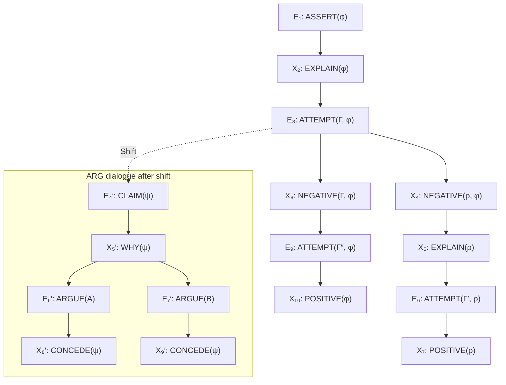

# Formalizing Explanatory Dialogues

Abdallah Arioua\(^{1,2(B)}\) and Madalina Croitoru\(^{2}\)

\(^{1}\) INRA, UMR IATE, Montpellier, France  
\(^{2}\) University of Montpellier, Montpellier, France  

abdallaharioua@gmail.com

## Abstract

Many works have proposed architectures and models to incorporate explanation within agent’s design for various reasons (i.e. human-agent teamwork improvement, training in virtual environment [10], belief revision [8], etc.), with this novel architectures a problematic is emerged: how to communicate these explanations in a goal-directed and rule-governed dialogue system? In this paper we formalize Walton’s CE dialectical system of explanatory dialogues in the framework of Prakken. We extend this formalization within the Extended CE system by generalizing the protocol and incorporating a general account of dialectical shifts. More precisely, we show how a shift to any dialogue type can take place, as an example we describe a shift to argumentative dialogue with the goal of giving the explainee the possibility to challenge explainer’s explanations. In addition, we propose the use of commitment and understanding stores to avoid circular and inconsistent explanations and to judge the success of explanation. We show that the dialogue terminates, under specific conditions, in finite steps and the space complexity of the stores evolves polynomially in the size of the explanatory model.

## 1 Introduction

The design of explanation facilities for intelligent systems is an active research area and a widely recognized problem [11,14] in Artificial Intelligence. In multi-agent systems (MAS), following the influential Walton and Krabbe typology of dialogues [21], different dialogue types have been proposed. Negotiation dialogues deal with resource limitation. Deliberation dialogues deal with planning collaborative actions. Persuasion dialogues deal with resolution of conflicts of opinion.

When it comes to explanation between autonomous agents, the concept of dialectical explanatory dialogue has been addressed by [19,20] as a way to formalize explanatory dialogues within a dialectical system called CE. The dialogue takes place between an explainer and an explainee, the goal is to get the explainee to understand something whose truthfulness is agreed upon. As stated by Walton “CE represents a basic or minimal system of explanation dialogue that provides a beginning framework that is very simple, but can be extended by constructing more complex systems” [19].

Building upon the state of the art, the objective of the paper is to provide a formal framework of explanatory dialogue called ECE system (Extended CE system) that extends and generalizes the CE system. The guidelines of the contribution lay in the following points:

- Generalization: we generalize the sequential protocol of [19,20] and introduce a more flexible protocol (liberal protocol) where the explainee and the explainer can backtrack to early stages in the dialogue. We give a general account of dialectical shifts in ECE and as an example we describe a shift to argumentative dialogue to facilitate arguing over explanations (as argued for in [14]).
- Extension: we introduce commitment and understanding stores to avoid circular and inconsistent explanations and to judge the success of explanation. We allow for nested explanation requests and feedback when the explainee cannot understand something in the explanation.

We formalize the ECE dialogue system in the general framework of [16] and modify it to suit the formal specification of an explanatory dialogue. We choose Prakken’s framework for its flexibility and implementability in Prolog [4]. The ECE dialogue is assumed to take place between two autonomous agents (i.e. humans or intelligent agents) without adhering to a specific internal model.

This work complements the efforts [8–10] of equipping agents with explanation facilities by facilitating explanation exchange in a goal-directed and rule-governed dialogue system. Furthermore, this work contributes to the enrichment of communication in multi-agent systems by promoting a new type of dialogues that intends to capture the concept of explanation. In knowledge-based systems, the state of the art covers extensively explanatory dialogues [5,6,13] but none of the existing approaches has formally studied these dialogues by abstracting away from any domain-specific knowledge. Our work can serve as a theoretical background under which these systems can be evaluated and compared.

The paper is organized as follows. In Sect. 2 we recall Prakken’s system for argumentative dialogues [16] and the CE system of explanatory dialogues [19,20]. Then, in Sect. 3 we present the formalization of the Extended CE (ECE) system and we study its properties. Next, in Sect. 4 we present the second component of ECE system, i.e. dialectical shift. In Sect. 5 we apply our system on a detailed example. Section 6 concludes the paper.

© Springer International Publishing Switzerland 2015  
C. Beierle and A. Dekhtyar (Eds.): SUM 2015, LNAI 9310, pp. 282–297, 2015.  
DOI: 10.1007/978-3-319-23540-0_19

## 2 Background

### 2.1 Argumentative Dialogue (ARG System)

The system of argumentative dialogues (denoted as ARG) is a many-player turn-taking game between proponents and opponents arguing in favor or against a statement. We consider here the formal dialogue system for argumentation defined in [16] (denoted as ARG). ARG has a topic language \(L_t\), a logic \(\mathcal{L}\), a context \(K \subseteq L_t\) (assumed consistent and remains the same throughout a dialogue) and a topic \(T \in L_t\). \(L_t\) is a logical language whose well-formed formulae are denoted by Greek letters, \(\psi\), \(\varphi\), \(\phi\), etc.[^1] The logic \(\mathcal{L}\) is assumed to be an argumentation logic with compliance to Dung [7] where arguments can be attacked and defended. For an argument \(A\) we denote by \(\operatorname{prem}(A)\), \(\operatorname{conc}(A)\) its premises and conclusion respectively.

The system ARG has also a communication language \(L_c\) along with a protocol \(P\). The communication language specifies the utterances used throughout the dialogue and \(P\) organizes their use (which utterance succeeds the other). According to \(P\), for each utterance the replying utterances can be seen either as an attack or a surrender (see Table 1). The dialogue incorporates participants. In our case we consider only two participants \(Pr=\{p,o\}\), the proponent and the opponent, each of which has a commitment store \(C_i \subseteq L_c\) such that \(i \in Pr\) (similar to commitment function of [16]). The stores publicly indicate statements within the topic language \(L_t\) a participant is committed to (i.e. committed to their truthfulness). ARG has effect rules that specify for an arbitrary utterance \(l \in L_c\) its effect on the commitments of the participants. At the beginning of the dialogue the stores of the participants are empty. Then, they get updated within the dialogue. Formally, the commitment store \(C_i \in \{C_p,C_o\}\) stays intact if and only if the participant \(i \in Pr\) utters \(\operatorname{why}(\varphi)\). Otherwise, it is changed as follows:

- \(C_i = C_i \cup \{\varphi\}\) iff the participant \(i\) has put forward \(\operatorname{claim}(\varphi)\) or \(\operatorname{concede}(\varphi)\).
- \(C_i = C_i \setminus \{\varphi\}\) iff the participant \(i\) has put forward \(\operatorname{retract}(\varphi)\) (\(i\) is no longer committed to \(\varphi\)).
- \(C_i = C_i \cup \operatorname{prem}(A) \cup \operatorname{conc}(A)\) iff the participant \(i\) has put forward \(\operatorname{argue}(A)\) (\(i\) is committed to the premises and the conclusion of the argument \(A\)).

The dialogue has a turntaking rule that specifies who is allowed to talk next. The dialogue has also termination rules that indicate when the dialogue terminates. The outcome rules are activated after the termination of the dialogue, they determine the winner of the dispute in the dialogue.

**Table 1. Reply structure. The arguments \(A\) and \(B\) and the attack relation are defined according to \(\mathcal{L}\).**

| Utterances | Attacks | Surrenders |
|---|---|---|
| \(\operatorname{claim}(\varphi)\) | \(\operatorname{why}(\varphi)\) | \(\operatorname{concede}(\varphi)\) |
| \(\operatorname{why}(\varphi)\) | \(\operatorname{argue}(A)\) \((\operatorname{conc}(A)=\varphi)\) | \(\operatorname{retract}(\varphi)\) |
| \(\operatorname{argue}(A)\) | \(\operatorname{why}(\varphi)\) \((\varphi \in \operatorname{prem}(A))\), \(\operatorname{argue}(B)\) \((B\) attacks \(A)\) | \(\operatorname{concede}(\varphi)\) \((\varphi \in \operatorname{prem}(A)\) or \(\varphi = \operatorname{conc}(A))\) |
| \(\operatorname{concede}(\varphi)\) | no attack | no surrender |
| \(\operatorname{retract}(\varphi)\) | no attack | no surrender |

[^1]: Throughout the paper we always use Greek letters \(\psi\), \(\varphi\), \(\phi\), etc. as metavariables for syntactically different well-formed formula (wff), and \(\Gamma,\Gamma_0,\ldots\) for sets of wffs.

When it comes to the dialectical shift, we shall deal with the ARG dialogue system as described above with: (1) a liberal protocol \(P\) and a reply structure as mentioned in Table 1[^2]; (2) \(\operatorname{claim}(\varphi)\) or \(\operatorname{argue}(A)\) as opening moves where \(\varphi\) and \(\operatorname{conc}(A)\) are the topic of the dialogue; and (3) the non-deterministic turntaking rule that dictates that the proponent starts with a single move, then the dialogue switches to the opponent and then it becomes everyone’s turn.

[^2]: See [16] for a full description of the protocol.

### 2.2 Explanatory Dialogue (CE System)

The system of explanatory dialogues (denoted as CE) is a two-player turn-taking formal dialogue system of explanation [19,20]. It takes place between an explainer and an explainee. The speech acts of requesting and providing an explanation are represented as dialogue moves in the system.

The moves allowed within CE are two distinct sets of moves: one for the explainer and another set for the explainee. The dialogue always starts with an assertion of a statement by the explainer, i.e. \(\operatorname{assert}(\varphi)\) and then the explainee requests an explanation for \(\varphi\), i.e. \(\operatorname{explain}(\varphi)\) (\(\varphi\) is accessible by the two parties and believed to be true). Next, the explainer can offer an explanation attempt or declares her/his inability to explain. In first case the explainee can ask for further explanations or acknowledge her/his understanding. In [20] a shift to examination dialogue is introduced allowing to test explainee’s understanding and to judge the success of the explanation.

In this paper we build upon the CE system described in [19,20] and extend and generalize it as mentioned in the introduction.

## 3 The Extended CE System

Relying on Prakken’s framework for formalizing dialogue systems [16], in this section we formalize the ECE system (Extended CE) of explanatory dialogues.

### 3.1 The Formal Framework

#### Topic Language, Participants and the Logic

The ECE system of explanatory dialogues takes place between two participants \(Pr=\{E,X\}\), the explainer \(E\) and the explainee \(X\). ECE has a topic language \(L_t\) and a logic \(\mathcal{L}\) and a context \(K \subseteq L_t\) which is assumed to be consistent throughout the dialogue and it is shared between \(E\) and \(X\). The purpose of the dialogue is to facilitate understanding transference by means of explanation about a statement \(T \in K\) (closed wff if \(L_t\) is a first-order or higher language), this statement is assumed to be true by both participants.

#### The Explanatory Model

Each participant \(i \in \{E,X\}\) in ECE has an explanatory model \(E_i=\langle L_t,\mathrel{\text{[illegible]}}_x,E\rangle\) which consists of the topic language \(L_t\) and a finite explanatory relation denoted as \(\mathrel{\text{[illegible]}}_x\) and defined over \(2^{L_t}\times L_t^c\) such that \(L_t^c \subseteq L_t\) is the set of closed wffs of \(L_t\). The parameter \(x\) varies over a common and non-empty set \(E\) of explanation types. \(\mathrel{\text{[illegible]}}_x\) intends to identify those wffs in \(L_t\) that can be considered as an explanation for another closed wff in \(L_t\). An explanation contains an explanandum which is the thing to be explained and explanans which are the facts and rules that together bear explanatory relevance to the explanandum. The parameter \(x\) defines \(\vert E \vert\) explanatory relations, e.g. mechanistic, terminological, etc. (see [11] for explanation types).

Due to the controversy around explanatory models [15], in this formalization we just consider an abstract setting where the model \(E_i\) can provide an explanation for an arbitrary explanandum. Formally, given a set \(\Gamma\) of wffs and a closed wff \(\varphi\) we read \(\Gamma \mathrel{\text{[illegible]}}_x \varphi\) as “\(\Gamma\) is an \(x\)-explanation of \(\varphi\)” such that \(x \in E\).

#### The Communication Language

The dialogue is endowed with a communication language \(L_c\) where \(l \in L_c\) is of the form as described in Table 2: “Utterances”. In fact, \(L_c=L_c^E \cup L_c^X\) where \(L_c^E\) (resp. \(L_c^X\)) is the performative utterances of the explainer (resp. the explainee). For a given communication language a reply relation \(R\) specifies for each \(l \in L_c\) its appropriate replies. \(R\) allocates replies according to the syntax and the content of the utterance (Table 2: “Reply”). Please notice that in the reply relation the explainee cannot ask for an explanation if she/he possesses or has already acquired one, this will prevent redundant requests. It is formally defined as follows, the explainee \(X\) asks \(\operatorname{explain}(\rho)\) iff \(\nexists \Gamma'\) such that \(\Gamma' \mathrel{\text{[illegible]}}_x \rho\) in \(E_X\).

**Table 2. The communication language \(L_c\) of ECE.**

| Utterances | Description | Reply |
|---|---|---|
| \(\operatorname{assert}(\varphi)\) | \(E\) reports a statement \(\varphi\) that is accepted as factual by both parties | \(\operatorname{explain}(\varphi)\) iff \(\nexists \Gamma\) s.t. \(\Gamma \mathrel{\text{[illegible]}}_x \varphi\) in \(E_X\) |
| \(\operatorname{explain}(\varphi)\) | \(X\) requests an explanation for \(\varphi\) | \(\operatorname{attempt}(\Gamma,\varphi)\) iff \(\Gamma \mathrel{\text{[illegible]}}_x \varphi\) in \(E_E\); otherwise \(\operatorname{inability}(\varphi)\) |
| \(\operatorname{attempt}(\Gamma,\varphi)\) | \(E\) explains \(\varphi\) by \(\Gamma\) | \(\operatorname{positive}(\varphi)\), \(\operatorname{negative}(\rho,\varphi)\) s.t. \(\rho \in \Gamma\), \(\operatorname{negative}(\Gamma,\varphi)\) |
| \(\operatorname{inability}(\varphi)\) | \(E\) has no explanation | no reply and the dialogue terminates if \(\varphi\) is the topic |
| \(\operatorname{positive}(\varphi)\) | \(X\) understands the explanation of \(\varphi\) | no reply and the dialogue terminates if \(\varphi\) is the topic |
| \(\operatorname{negative}(\rho,\varphi)\) | \(X\) doesn’t understand \(\rho\) in the explanation of \(\varphi\) | \(\operatorname{explain}(\rho)\) iff \(\nexists \Gamma'\) s.t. \(\Gamma' \mathrel{\text{[illegible]}}_x \rho\) in \(E_X\) |
| \(\operatorname{negative}(\Gamma,\varphi)\) | \(X\) doesn’t understand the whole explanation | no reply |

#### The Protocol

The dialogue is governed by a protocol \(P\) that organizes the use of \(L_c\). To define \(P\) we need to define the notion of a dialogue, which in turn is based on the notion of moves.

A move [16] is a tuple \(m=\langle ID,p,l,t\rangle\) such that: (1) \(ID \in \mathbb{N}^{*}\), the identifier of the move, (2) \(p \in \{E,X\}\), the participant \(p\) who played the move, (3) \(l \in L_c\), the utterance \(l\) put forward by the participant \(p\) and (4) \(t \in \mathbb{N}\), the target move \(t\). For a given move \(m\) we denote \(\operatorname{id}(m)=ID\), \(\operatorname{pr}(m)=p\), \(\operatorname{sp}(m)=l\) and \(\operatorname{tr}(m)=t\). We denote by \(M\) the set of all moves.

An explanatory dialogue in ECE is a dialogue in the sense of [16], that is, a sequence of moves where the explainer/explainee can reply to each other in a non-sequential way. This generalizes CE by rendering the dialogue liberal in the sense that it gives the liberty to the two participants to backtrack to early stages in the dialogue.

**Definition 1 (Explanatory Dialogue).** An explanatory dialogue is a sequence of moves \(d=\langle m_1,\ldots,m_n\rangle\). The sequence \(d_i=\langle m_1,\ldots,m_i\rangle\) such that \(i<n\) is denoted by \(d_i\), where \(d_0\) is the empty dialogue. The set of all explanatory dialogues, denoted by \(M^{<\infty}\), is the set of all sequences \(d_i\) such that \(i \in \mathbb{N}^{*}\) and for each \(j\)th element in \(d_i\) where \(0<j \le i\), it is the case that (1) \(\operatorname{id}(m_j)=j\); (2) \(\operatorname{tr}(m_1)=0\); and:

(3) \(\operatorname{tr}(m_j)=k\) for some \(m_k\) preceding \(m_j\) in the sequence.

If \((\operatorname{sp}(m_j),\operatorname{sp}(m_k)) \in R\) (in the reply relation) we say that \(m_j\) replies to \(m_k\) in \(d\).

Unlike the turntaking function defined in [19,20] which allows one move at a turn policy, we define a non-deterministic turn taking policy.

**Definition 2 (Turntaking Function).** A turntaking function \(T\) is defined as follows \(T:M^{<\infty}\rightarrow 2^{\{E,X\}}\). \(T\) assigns to every dialogue the next legal turn as follows:

- \(T(d_0)=\{E\}\), \(T(d_1)=\{X\}\), else \(T(d_i)=\{E,X\}\).

Let us recall the concept of protocol from [16] and then define ECE’s protocol. We denote by \(\operatorname{dom}(X)\) the domain of the function \(X\). A protocol \(P\) for a dialogue system is a function \(P\) from a nonempty subset \(D \subseteq M^{<\infty}\) to \(2^M\) where for every dialogues \(d=\langle m_1,\ldots,m_n\rangle\) and moves \(m'\) we have \(d \in \operatorname{dom}(P)\) and \(m' \in P(d)\) iff \(d'=\langle m_1,\ldots,m_n,m'\rangle \in \operatorname{dom}(P)\). The elements of \(\operatorname{dom}(P)\) are the legal dialogues while those of \(P(d)\) are the moves allowed after \(d\). If \(d\) is a legal dialogue and \(P(d)=\emptyset\), then \(d\) is a terminated dialogue.

**Definition 3 (ECE’s Protocol).** A protocol \(P\) for the ECE system is defined as follows: for all moves \(m\) and all legal dialogues \(d\). \(m \in P(d)\) iff:

\(R1:\ \operatorname{pr}(m) \in T(d)\) (it is the turn of \(\operatorname{pr}(m)\));

\(R2:\) If \(d=d_0\) then \(\operatorname{sp}(m)\) is of the form \(\operatorname{assert}(\varphi)\);

\(R3:\) If \(d \ne d_0\) and \(m \ne m_1\), then \(m\) replies to \(\operatorname{tr}(m)\);

\(R4:\) If \(m\) replies to \(m'\), then \(\operatorname{pr}(m) \ne \operatorname{pr}(m')\) (one cannot respond to one’s own moves);

\(R5:\) If there is \(m'\) in \(d\) such that \(\operatorname{tr}(m)=\operatorname{tr}(m')\) then \(\operatorname{sp}(m) \ne \operatorname{sp}(m')\) (two replies to a move should be different).

\(R6:\) For any \(m' \in d\) such that \(\operatorname{tr}(m')=\operatorname{tr}(m)\) and \(\operatorname{sp}(m')=\operatorname{positive}(\varphi)\), \(\operatorname{sp}(m) \ne \operatorname{negative}(\Gamma,\varphi)\) (understanding cannot be revoked).

A comment about \(R6\) is in order here. The underlying assumption of this rule is that the agent is prudent in the sense that he/she declares his/her understanding iff she/he is sure about it. This rule may seem restrictive in certain cases where one can have the illusion of understanding and he/she should be provided with a second chance by revoking understanding, despite the fact that this could be an interesting phenomenon to study we limit the scope of the paper to the aforementioned assumption for the sake of simplicity.

#### The Stores, Effect Rules and Outcome Rules

In CE system [19,20] stores have not been proposed as part of the system. In the ECE system we extend CE by adding commitment and understanding stores to:

- Keep a clear view of explainee’s state of understanding so he/she can backtrack and request more explanations.
- Judge the success of the explanatory dialogue.
- Track the consistency of the explanation. For example, imagine that the explainer is explaining \(\varphi\) by an explanation \(\Gamma=\{\psi,\beta\}\) where he/she is committed to the truthfulness of \(\neg \psi\), this would be contradictory.
- Avoid circular explanations. This means that it is forbidden to explain \(\psi\) by \(\{\varphi\}\) such that \(\varphi\) is asked to be explained (this could provoke the infinite chain \(\operatorname{explain}(\varphi)\), \(\operatorname{attempt}(\{\psi\},\varphi)\), \(\operatorname{explain}(\psi)\), \(\operatorname{attempt}(\{\varphi\},\psi)\), \(\ldots\), etc.).

Let us formally introduce the notion of stores.

**Definition 4 (Stores).** The sets \(NUS_X,CS_E \subseteq L_t\) denote respectively the understanding and commitment stores where the subscripts refer to the participants.

A store \(st \in \{NUS_X,CS_E\}\) is inconsistent iff \(st \vdash \psi\) and \(st \vdash \neg \psi\) for some \(\psi \in L_t\) (\(\vdash\) is the inference relation of \(\mathcal{L}\)).

For the explainee, an understanding store \(NUS_X\) serves as an understanding indicator of his/her current understanding state. Note that \(NUS_X\) represents what is not yet understood instead of what has been understood. For the explainer, a commitment store \(CS_E\) represents explainer’s commitments to the truthfulness of certain statements. The explainee (resp. explainer) does not have a commitment (resp. understanding) store. Let us specify the rules to update the stores.

**Definition 5 (Effect Rules).** Let \(d\) be a legal dialogue, \(NUS_X\) and \(CS_E\) be explainee’s and explainer’s current stores and \(m\) is the next legal move after \(d\).

- If \(\operatorname{sp}(m)=\operatorname{explain}(\varphi)\) then \(NUS_X=NUS_X \cup \{\varphi\}\),
- If \(\operatorname{sp}(m)=\operatorname{positive}(\varphi)\) then \(NUS_X=NUS_X \setminus \{\varphi\}\).
- If \(\operatorname{sp}(m)=\operatorname{assert}(\varphi)\) then \(CS_E=CS_E \cup \{\varphi\}\),
- If \(\operatorname{sp}(m)=\operatorname{attempt}(\Gamma,\varphi)\) then \(CS_E=CS_E \cup \Gamma \cup \{\varphi\}\).

The first set of effect rules on \(NUS_X\) indicate that when the explainee requests an explanation about \(\varphi\) we presume that he/she could not understand \(\varphi\), thus we add it to \(NUS_X\) and we revoke it when he/she acknowledge understanding. The second set of effect rules on \(CS_E\) state that the explainer is committed to the truthfulness of the explanans (elements of the explanation) and the explanandum.

In what follows we extend Definition 3 with the following rule that considers the stores to avoid circular explanation.

**Definition 6 (ECE’s Protocol Extended Rules).** Let \(P\) be the protocol of ECE, \(d\) be a legal dialogue and \(m\) be a move. Then \(m\) is a legal move after \(d\) iff \(m \in P(d)\) and:

\(R7:\) If \(\operatorname{sp}(m)=\operatorname{attempt}(\Gamma,\varphi)\) then there is no \(\psi \in \Gamma\) such that \(\psi \in NUS_X\).

From now on we say that a move \(m\) is legal after a dialogue \(d\) if and only if it satisfies protocol rules \(R1\)-\(R7\).

A successful explanatory dialogue is a dialogue where the explainee’s understanding store is empty. Certainly, we cannot be sure whether the understanding has really taken place but it is one way to quantify the success and failure of an explanatory dialogue. Another alternative would be the use of examination dialogue as proposed in [20]. In our system, instead of limiting shifts to examination dialogues we provide a general account of dialectical shifts which can be instantiated to capture any shift (including the one of examination dialogue).

### 3.2 Properties

In what follows we present interesting results of the ECE system. We investigate termination, number of steps before termination and space complexity of the stores.

As one may notice the protocol of ECE induces a tree structure on any legal explanatory dialogue (see the example in Sect. 5), this is due to the possibility of backtracking and multiple replies to certain moves, e.g. the move \(\operatorname{attempt}\) can be answered by at least two moves \(\operatorname{negative}\) and \(\operatorname{positive}\). Therefore, in this section we deal with this induced tree structure in which the nodes correspond to moves and an edge from a move \(m\) to \(m'\) means \(m'\) replies to \(m\).

One of the interesting properties of ECE is termination, that means whenever two participants start an explanatory dialogue and certain conditions are respected we can guarantee termination in finite steps.

**Lemma 1.** Let \(\varphi\) be an explanandum and let \(X\) be the set of all explanations of \(\varphi\) in \(E_E\). If \(X\) is finite then \(\operatorname{explain}(\varphi)\) has a finite number of child nodes.

**Lemma 2.** Let the explanandum \(\varphi\) be the topic of a legal explanatory dialogue \(d\) and let \(\Gamma\) be an explanation of \(\varphi\) in \(E_E\). If \(\Gamma\) is finite then every branch in the dialogue that starts with \(\operatorname{attempt}(\Gamma,\varphi)\) terminates.

To study termination we define the explanans relation between \(L_t\)’s elements.

**Definition 7 (Explanans and Explanans Path).** Let \(E_E=\langle L_t,\mathrel{\text{[illegible]}}_x,E\rangle\) be the explanatory model of the explainer. We define the binary relation \(N \subseteq L_t \times L_t\) such that \((\varphi',\varphi) \in N\) iff there exists an explanation \(\Gamma\) such that \(\varphi' \in \Gamma\) and \(\Gamma\) explains \(\varphi\), and we read it “\(\varphi'\) is an explanan of \(\varphi\)”. We denote by \(D(\varphi)\) the explanatory depth of \(\varphi\) which corresponds to the length of the longest explanans path in \(N\) that starts with \(\varphi\).

**Corollary 1.** Let \(E_E=\langle L_t,\mathrel{\text{[illegible]}}_x,E\rangle\) be the explanatory model of the explainer. If \(\mathrel{\text{[illegible]}}_x\) is finite then so is \(N\). Consequently, for every explanandum \(\varphi\) in \(E_E\), \(D(\varphi)\) is finite.

The previous lemmas guides as towards the termination property. The intuition is that if the width of the corresponding tree of the dialogue is finite then the dialogue terminates. Note that the depth of the tree is also finite because (a) no repetition is allowed, (b) understanding cannot be revoked and (c) the explanatory model of the explainer is finite (Sect. 3) hence the depth of the tree is finite.

**Proposition 1 (Termination).** If the conditions in Lemmas 1 and 2 hold for every explanandum \(\varphi\) then any legal explanatory dialogue \(d\) will terminate in finite steps.

Note that a step here corresponds to a move at a given turn. We consider in what follows the maximum number of steps (in worst-case) the dialogue will undertake until the termination. The worst-case scenario is when the dialogue is of the shape of a somewhat saturated tree, this corresponds to the case where for every explanation request \(\operatorname{explain}\) there is an explanation attempt \(\operatorname{attempt}\) and for every explanation attempt there are two negative acknowledgments \(\operatorname{negative}\) each of which are followed by an explanation request. In fact this happens when the explainee has requested an explanation about every statement made by the explainer and in return he/she obtained explanations about every request he/she made but unfortunately understood nothing. Considering an arbitrary explanandum \(\varphi\) as an input the following holds.

**Proposition 2 (Termination Steps).** Let \(E_E\) be the explanatory model of the explainer, \(D(\varphi)\) be the explanatory depth of an arbitrary \(\varphi\) and \(X\) be the set of all its explanations. Assume that \(\forall \Gamma \in X,\ \vert \Gamma \vert = \vert X \vert = k\). Then every legal explanatory dialogue \(d\) with topic \(\varphi\) will terminate at most in \(O(k^{D(\varphi)})\) steps.

We consider the space complexity of the stores \(CS_E\) and \(NUS_X\). In the worst-case scenario (the same as the previous) the size of \(CS_E\) and \(NUS_X\) will converge to the size of the content of the explanatory model of the explainer, this is explained as follows (1) the size of \(NUS_X\) increases due to the nested explanation requests made by the explainee, (2) the size of \(CS_E\) increases also because the explainer will provide explanations for every request, this results in an update of \(CS_E\). In what follows we consider as inputs the explanatory model and an arbitrary explanandum \(\varphi\), but since the size of the explanatory model is much bigger than the size of the memory allocated to \(\varphi\), then \(\varphi\) will not be considered. We show in what follows that the stores polynomially evolve in the size of the explanatory model.

**Proposition 3 (Evolution of Stores).** Let \(E_E=\langle L_t,\mathrel{\text{[illegible]}}_x,E\rangle\) be the explanatory model of the explainer and \(\Sigma=\{\Gamma,\psi \mid \exists x((\Gamma,\psi) \in \mathrel{\text{[illegible]}}_x)\}\) be the content of the explanatory model \(E_E\). In the worst-case scenario \(\vert CS_E \vert = \vert NUS_X \vert = \vert \Sigma \vert\). Consequently, any legal explanatory dialogue \(d\) has an \(O(\vert \Sigma \vert)\) worst-case space complexity.

This happens in the worst-case when the dialogue charges the whole content of the explanatory model twice, one corresponds to the \(CS_E\) and the other for \(NUS_X\).

## 4 Dialectical Shifts in ECE System

In this section we present the second extension of CE [19,20] by introducing and formalizing the concept of a dialectical shift within ECE. We start by a formal account of dialectical shift then we show how a simple shift from ECE to ARG can be instantiated in such formalism.

### 4.1 Dialectical Shifts in ECE

Generally, a shift between two distinct systems \(\mathrm{SYS}\) and \(\mathrm{SYS}'\) should consider the following questions: (1) what is the direction of the shift? (2) when the shift is licit [21]? (3) what happens to the stores when we shift? (4) what are the effects of the outcome of one system on the other? To answer these questions we need to introduce the notion of state, licit states and receiving states.

**Definition 8 (State).** A state of a dialogue system \(\mathrm{SYS}\) is a tuple \(\langle T,C,M\rangle\) such that \(T \in L_t\) is the topic, \(C\) is the set of current stores, \(M\) is the current move (the most recent move in the dialogue).

For instance, if \(\mathrm{SYS}\) is the ECE system then \(C=\{CS_E,C_X,NUS_X\}\) such that \(C_X\) is the commitment store of the explainee in the last argumentative dialogue. If \(\mathrm{SYS}\) is the ARG system then \(C=\{C_o,C_p\}\) (opponent’s and proponent’s stores). The set of all possible states of a given dialogue system \(\mathrm{SYS}\) is denoted as \(C_{\mathrm{SYS}}\). The sets \(S_{\mathrm{SYS}},R_{\mathrm{SYS}} \subseteq C_{\mathrm{SYS}}\) are called the set of licit states and receiving states of \(\mathrm{SYS}\) respectively.

Licit states are states from which one can shift to another dialogue. \(R_{\mathrm{SYS}}\) represents the set of states a given dialogue system can begin with when a shift occurs. For instance, the state \(s=\langle T,C,M\rangle\) where \(T=\{\varphi\}\), \(C=\{C_o=\emptyset,C_p=\emptyset\}\), \(M=\{m=\langle 1,p,\operatorname{claim}(\varphi),0\rangle\}\) is a receiving state of the argumentative dialogue which happens to be also an initial state as defined in Subsect. 2.1. For any dialogue system \(\mathrm{SYS}\) that anticipates a shift to another dialogue system \(\mathrm{SYS}'\), the sets \(S_{\mathrm{SYS}}\) and \(R_{\mathrm{SYS}'}\) should be nonempty. At least, \(R_{\mathrm{SYS}'}\) is set to \(I_{\mathrm{SYS}'}\) such that \(I_{\mathrm{SYS}'}\) is the set of all initial states of \(\mathrm{SYS}'\). Nevertheless, providing \(R_{\mathrm{SYS}'}\) with more states stays a matter of choice.

After defining the licit and receiving states we present the general definition of a shift. A shift is a transition from one system to another under a specific condition. the first system should be in a state where the shift is allowed (licit states).

**Definition 9 (Shift Function).** Let \(\mathrm{SYS}\) and \(\mathrm{SYS}'\) be two distinct dialogue systems and let \(S_{\mathrm{SYS}}\) and \(R_{\mathrm{SYS}'}\) be the sets of licit states (resp. receiving states) of the dialogue system \(\mathrm{SYS}\) (resp. \(\mathrm{SYS}'\)). A shift is a function \(S:S_{\mathrm{SYS}}\rightarrow 2^{R_{\mathrm{SYS}'}}\).

From Definitions 8 and 9, on can see that the content of \(S_{\mathrm{SYS}}\), \(R_{\mathrm{SYS}}\), \(S_{\mathrm{SYS}'}\) and \(R_{\mathrm{SYS}'}\) for two distinct dialogue systems defines the type of the shift (one-way or two-way) and the direction (from which to which system) and nested or not nested. If \(S_{\mathrm{SYS}} \ne \emptyset\) and \(R_{\mathrm{SYS}'} \ne \emptyset\) and the other sets are empty, then this is a one-way shift from \(\mathrm{SYS}\) to \(\mathrm{SYS}'\). If \(S_{\mathrm{SYS}'} \ne \emptyset\) and \(R_{\mathrm{SYS}} \ne \emptyset\) and the other sets are empty then this is a one-way shift from \(\mathrm{SYS}'\) to \(\mathrm{SYS}\). If all of these sets are not empty, then this is a two-way shift in both directions, and it is a nested shift where one can shift from \(\mathrm{SYS}\) to \(\mathrm{SYS}'\) then shift back to \(\mathrm{SYS}'\) and so on. Otherwise the shift does not occur.

### 4.2 Dialectical Shift from ECE to ARG

Consistency, plausibility and sense-making are among the important conditions for an explanatory dialogue as mentioned in [19]. Our hypothesis is that a dialectical shift from ECE to ARG could help in satisfying such conditions by giving the explainer (resp. explainee) the possibility to provide support (resp. questions) for (resp. the) explanation by means of arguments.

The shift is one-way from ECE to ARG where we cannot shift back until the argumentative dialogue within ARG comes to an end. This means that the argumentative dialogue is embodied in ECE and we cannot call an instance of ECE from within an instance of an argumentative dialogue. The commitment store \(CS_E\) of the explainer in ECE dialogue persists in the argumentative dialogue and will be used and updated. In other words the explainer will not change his commitments if a shift occurs. Finally, at the end of the argumentative dialogue two things will happen. Firstly, the explainee will have a commitment store \(C_X\) that will be shared between all argumentative dialogues (in case of multiple shifts). Secondly, explainee’s understanding store will be updated at the end with respect to the outcome of the argumentative dialogue. For instance if the explainee had doubts about a statement \(\psi\) in the explanation and the explainer wins the argumentative dialogue then \(\psi\) will be deleted from the explainee’s understanding store \(NUS_X\). Otherwise \(NUS_X\) will still have \(\psi\) and if the ECE dialogue ends, the explanation will be judged unsuccessful.

Since we are dealing in our case with one-way shift from ECE to the argumentative dialogue we only need to set \(R_{\mathrm{ECE}}=\emptyset\) and \(S_{\mathrm{ARG}}=\emptyset\) and define the rest, i.e. \(S_{\mathrm{ECE}} \ne \emptyset\) and \(R_{\mathrm{ARG}} \ne \emptyset\).

**Definition 10 (ECE’s Licit and Receiving States).** Let \(C_{\mathrm{ECE}}\), \(S_{\mathrm{ECE}}\) and \(R_{\mathrm{ECE}}\) be respectively the set of all states, licit and receiving states of the ECE system, let \(C_{\mathrm{ARG}}\), \(S_{\mathrm{ARG}}\) and \(R_{\mathrm{ARG}}\) be respectively the set of all states, licit and receiving states of the ARG system and let \(s=\langle T,C,M\rangle\) be a state. Then:

- \(S_{\mathrm{ECE}}=\{s \mid s \in C_{\mathrm{ECE}},\operatorname{sp}(M)=\operatorname{attempt}(\Gamma,\varphi)\}\).
- \(R_{\mathrm{ARG}}=\{s \mid s \in C_{\mathrm{ARG}},\operatorname{sp}(M) \in \{\operatorname{claim}(\varphi),\operatorname{argue}(A)\}\}\).

Such that \(\Gamma\) is an \(x\)-explanation of \(\varphi\) and \(A\) is an argument.

As one may notice, \(S_{\mathrm{ECE}}\) contains those states where the move is \(\operatorname{attempt}(\varphi)\) (\(\varphi\) is an arbitrary wff) and \(R_{\mathrm{ARG}}\) contains states which represent the initial states of the ARG dialogue (states where \(M\) is either \(\operatorname{claim}(\varphi)\) or \(\operatorname{argue}(A)\)).

Under the specifications of Definition 10, in what follows we instantiate the shift function in our context (from ECE to ARG).

**Definition 11 (ECE’s Shift Function).** Let \(S_{\mathrm{ECE}}\) and \(R_{\mathrm{ARG}}\) be the sets of licit states (resp. receiving states) of the dialogue system ECE (resp. the argumentative dialogue system ARG). Let \(s=\langle T,C,M\rangle\) be a state of ECE such that \(\operatorname{sp}(M)\) is \(\operatorname{attempt}(\Gamma,\varphi)\). Then, the shift function \(S\) is specified as follows: \(S(s)=R'\) such that for each \(s'=\langle T',C',M'\rangle \in R'\):

- \(T'=\psi\) such that \(\psi \in \Gamma\),
- \(C'=\{C_E',C_X'\}\) such that \(C_E'=CS_E\) and \(C_X'=C_X\) where \(\{CS_E,C_X\} \subset C\),
- \(M'=m\) such that \(m=\langle 1,p,X,0\rangle\), \(X \in \{\operatorname{claim}(T'),\operatorname{argue}(A)\}\), \(\operatorname{conc}(A)=T'\).

The function dictates that if the utterance of the current move is \(\operatorname{attempt}(\Gamma,\varphi)\) then we can shift to an argumentative dialogue where the participants are the explainer (as the proponent) and the explainee (as the opponent) and the topic is arguing over one of the explanans (say \(\psi\)) of the explanation \(\Gamma\) such that the proponent starts either by \(\operatorname{claim}(\psi)\) or \(\operatorname{argue}(A)\) \((\operatorname{conc}(A)=\psi)\). The shift function also specifies the migration of stores from one dialogue to another. In our case the commitment store \(C_E'\) of the explainer in ARG is set to his commitment store \(CS_E\) of ECE, similarly the commitment store \(C_X'\) of the explainee in ARG is set to the commitment store of the previous shift.

When the argumentative dialogue ARG comes to an end, the stores of the ECE dialogue are updated as follows:

- If the explainer wins then we update \(NUS_X\) according to Definition 5, else \(NUS_X\) persists as it was. In all cases, \(CS_E=C_E'\) and \(C_X=C_X'\).

The commitment store of the explainee within the argumentative dialogue will be kept within ECE for further shifts. Both understanding \(NUS_X\) and commitment \(CS_E\) stores of ECE will be updated according to the outcome of ARG dialogue as indicated above. When we shift back to ECE, the dialogue continues from where is left off according to the protocol \(P\).

It is noteworthy that explainer’s commitment store \(CS_E\) is shared between all instances of the argumentative dialogue because before any shift \(CS_E\) is migrated to \(C_E'\) and updated within the shift and then \(C_E'\) is migrated back to \(CS_E\) at the end of the shift (the same applies to \(C_X\)).

## 5 Example Dialogue

In this section we apply the ECE dialogue system to an example about explaining why coal is black (inspired from [20]).

Figure 1(a) is a tree representation of a segment of an ECE dialogue where the subscript in participants name refers to dialogue stages (i.e. \(E_1\) means \(E\) at stage 1), an edge between two nodes means that the lower one replies to the higher one. The gray dashed box represents the ARG dialogue after a shift. Figure 1(b) explains the meaning of the logical symbols. Figure 1(c) shows the evolution of stores within ECE and ARG (in ARG, stages 4–9 are replaced by \(4'\)–\(9'\)), column \(S\) refers to the stage, the 2nd–3rd columns represent the stores of ECE and the rest represent the stores of ARG, the brace ARG focuses on the content of the stores of ARG within the shift. “n/a” means that the content is unavailable (because the shift has not taken place yet), \(Ans\) at stage \(n\) refers to the content of the store at stage \(n-1\), we may not use \(Ans\) when it’s clear.

In Fig. 1(a), the explainer \(E\) states a fact which the explainee doesn’t understand, hence the explainee \(X\) requests an explanation at stage 2. Next, at stage 3, \(E\) offers an explanation \(\Gamma\). Since we are in a licit state, we have two scenarios: either (1) continue within ECE dialogue or (2) shift to ARG dialogue. Let us start with (1), \(X\) at stage 4 says he doesn’t understand \(\rho\) and he requests an explanation for it. Next at stage 6, the explanation \(\Gamma'\) is presented. After that, \(X\) acknowledges the understanding of \(\rho\), although it seems that the whole explanation doesn’t make sense to him, thus at stage 8 he declares that he doesn’t understand the whole explanation of \(\varphi\). At stage 9, \(E\) gives another explanation \(\Gamma''\) which \(X\) could understand, the dialogue can terminate and the explanation is judged successful.

Let us see scenario (2): at stage 3, \(E\) might have doubts about \(\psi\), maybe it seems implausible that the earth is aged more than million years. Thus the shift takes place where \(X\) asks “why” in which he demands a justification (not explanation). Next, \(E\) (proponent) presents two arguments at stage \(6'\), \(7'\) after which \(X\) (opponent) concedes. Now the ARG dialogue ends and the commitment store \(C_X'\) will persist in ECE and will be used in future shifts. Note that nothing prevents us from continuing the ECE dialogue. The evolution of the stores is presented in Fig. 1(c) (4th–5th columns) where the stores at stage 1–2 haven’t been set since the shift hasn’t started. At stage 3 (where the shift starts) the commitment store of \(E\) in ECE is migrated to \(C_E'\) and updated (stages \(6'\), \(7'\)) by adding the premises of arguments \(A\), \(B\). When \(X\) concedes (at stages \(8'\), \(9'\)) \(\psi\) is added to \(C_X'\) and at the end of the shift (stage 10) \(C_E'\) is migrated back to \(CS_E\).

**Fig. 1. An example of an ECE dialogue.**

### Fig. 1(a): Dialogue tree

### Fig. 1(b): Meaning of logical symbols

| Symbol | Meaning |
|---|---|
| \(\varphi\) | coal is black. |
| \(\rho\) | plant material are soft and brown. |
| \(\mu\) | remains of plant material. |
| \(\psi\) | plant material buried for millions of years. |
| \(\varphi'\) | plant material are carbon-rich materials. |
| \(\beta\) | plant material turned into peat. |
| \(\gamma\) | peat turned into brown coal. |
| \(\delta\) | brown coal turned into black coal. |
| \(\sigma\) | radiometric dating of old rocks gives 3.7–3.8 billion years. |
| \(\chi\) | meteorites have ages of 4.4–4.6 billion years. |
| \(\Gamma\) | \(\{\rho,\beta,\psi\}\) |
| \(\Gamma'\) | \(\{\mu,\rho,\sigma\}\) |
| \(\Gamma''\) | \([illegible]\) |
| \(A\) | \(\psi\) since \(\sigma\). |
| \(B\) | \(\psi\) since \(\chi\). |

### Fig. 1(c): Evolution of stores within ECE and ARG

| \(S\) | \(CS_E\) (ECE) | \(NUS_X\) (ECE) | \(C_E'\) (ARG) | \(C_X'\) (ARG) |
|---:|---|---|---|---|
| 1 | \(\emptyset\) | \(\emptyset\) | n/a | n/a |
| 2 | \(Ans\) | \(\varphi\) | n/a | n/a |
| 3 | \(\Gamma \cup Ans\) | \(\varphi\) | \(\Gamma \cup \varphi\) | \(\emptyset\) |
| 4 | \(Ans\) | \(\varphi,\rho\) | \(Ans\) | \(\emptyset\) |
| 5 | \(Ans\) | \(\varphi,\rho\) | \(Ans\) | \(\emptyset\) |
| 6 | \(\Gamma' \cup Ans\) | \(\varphi,\rho\) | \(\sigma \cup Ans\) | \(\emptyset\) |
| 7 | \(Ans\) | \(\varphi\) | \(\chi \cup Ans\) | \(\emptyset\) |
| 8 | \(Ans\) | \(\varphi\) | \(Ans\) | \(\psi\) |
| 9 | \(\Gamma'' \cup Ans\) | \(\varphi\) | \(Ans\) | \(\psi\) |
| 10 | \(Ans\) | \(\emptyset\) | \(CS_E=Ans\) | \(\psi\) |

## 6 Conclusion and Future Work

In this paper we have proposed a dialectical system for explanatory dialogue called ECE. This system captures and generalizes the dialectical system CE [19,20] by incorporating a more general protocol, a new component (dialectical shift), an additional structure (stores). We have proposed the use of commitment and understanding stores to avoid circular and inconsistent explanations. We introduced and formalized dialectical shifts and we applied it to capture the argumentative aspects of explanatory dialogues. We have shown that the dialogue terminates and the space complexity is polynomial.

We left, for future work, the study of the previous properties in the presence of a dialectical shift and multi-shifts wihtin ECE. The paper provides no semantic for the dialogue, a good starting point would be [8,12] where a change in beliefs can occur if an explanation is provided. This could give raise to an operational semantics for ECE system.

In previous work [1,2] we have proposed explanation facilities based on a custom-tailored dialogue for inconsistent-knowledge bases, we focused in this work on the bigger picture where a more general setting is considered, i.e. a dialogue between an explainer and an explainee within a formal framework which is independent from any domain-related specifications. This framework can be enriched by investigating explainee mental models that account for reasoning fallacies (such as the work described in [3]). We plan to test such explanation dialogue primarily in the DUR-DUR project which aims at providing decision-support systems in Agronomy. Although the specificity of this application, the generic approach presented here is promising for other Agronomy related real world cases such as [17,18].

**Acknowledgment.** Financial support from the French National Research Agency (ANR) for the project DUR-DUR (ANR-13-ALID-0002) is gratefully acknowledged. We are also grateful to Nouredine Tamani for his valuable comments on the paper.

## References

1. Arioua, A., Tamani, N., Croitoru, M., Buche, P.: Query failure explanation in inconsistent knowledge bases using argumentation. In: Computational Models of Argument: Proceedings of COMMA 2014, vol. 266, p. 101 (2014)

2. Arioua, A., Tamani, N., Croitoru, M., Buche, P.: Query failure explanation in inconsistent knowledge bases: a dialogical approach. In: Bramer, M., Petridis, M. (eds.) Research and Development in Intelligent Systems XXXI, pp. 119–133. Springer, Heidelberg (2014)

3. Bisquert, P., Croitoru, M., de Saint Cyr-Bannay, F.D.: Towards a dual process cognitive model for argument evaluation. In: Beierle, C., Dekhtyar, A. (eds.) SUM 2015. LNAI, vol. 9310, pp. XX–YY. Springer, Heidelberg (2015)

4. Bodenstaff, L., Prakken, H., Vreeswijk, G.: On formalising dialogue systems for argumentation in the event calculus. In: Proceedings of the 11th International Workshop on Nonmonotonic Reasoning, pp. 374–382 (2006)

5. Cawsey, A.: Explanation and Interaction: The Computer Generation of Explanatory Dialogues. MIT Press, Cambridge (1992)

6. de Vries, E., Lund, K., Baker, M.: Computer-mediated epistemic dialogue: explanation and argumentation as vehicles for understanding scientific notions. J. Learn. Sci. 11(1), 63–103 (2002)

7. Dung, P.M.: On the acceptability of arguments and its fundamental role in nonmonotonic reasoning, logic programming and n-person games. Artif. Intell. 77(2), 321–357 (1995)

8. Falappa, M.A., Kern-Isberner, G., Simari, G.R.: Explanations, belief revision and defeasible reasoning. Artif. Intell. 141, 1–28 (2002)

9. Harbers, M., Bradshaw, J.M., Johnson, M., Feltovich, P., van den Bosch, K., Meyer, J.-J.: Explanation in human-agent teamwork. In: Cranefield, S., van Riemsdijk, M.B., Vázquez-Salceda, J., Noriega, P. (eds.) COIN 2011. LNCS, vol. 7254, pp. 21–37. Springer, Heidelberg (2012)

10. Harbers, M., van den Bosch, K., Meyer, J.-J.C.: A study into preferred explanations of virtual agent behavior. In: Ruttkay, Z., Kipp, M., Nijholt, A., Vilhjálmsson, H.H. (eds.) IVA 2009. LNCS, vol. 5773, pp. 132–145. Springer, Heidelberg (2009)

11. Haynes, S.R., Cohen, M.A., Ritter, F.E.: Designs for explaining intelligent agents. Int. J. Hum.-Comput. Stud. 67(1), 90–110 (2009)

12. Khemlani, S., Johnson-Laird, P.N.: Cognitive changes from explanations. J. Cogn. Psychol. 25(2), 139–146 (2013)

13. Moore, J.D.: Participating in Explanatory Dialogues: Interpreting and Responding to Questions in Context. MIT Press, Cambridge (1995)

14. Moulin, B., Irandoust, H., Bélanger, M., Desbordes, G.: Explanation and argumentation capabilities: towards the creation of more persuasive agents. Artif. Int. Rev. 17(3), 169–222 (2002)

15. Pitt, J.C.: Theories of Explanation. Oxford University Press, New York (1988)

16. Prakken, H.: Coherence and flexibility in dialogue games for argumentation. J. Log. Comput. 15(6), 1009–1040 (2005)

17. Tamani, N., Mosse, P., Croitoru, M., Buche, P., Guillard, V., Guillaume, C., Gontard, N.: An argumentation system for eco-efficient packaging material selection. Comput. Electron. Agric. 113, 174–192 (2015)

18. Thomopoulos, R., Croitoru, M., Tamani, N.: Decision support for agri-food chains: a reverse engineering argumentation-based approach. Ecol. Inform. 26, 182–191 (2015)

19. Walton, D.: Dialogical models of explanation. In: Proceedings of the AAAI Workshop on Explanation-Aware Computing (ExaCt 2007), vol. 2007, pp. 1–9 (2007)

20. Walton, D.: A dialogue system specification for explanation. Synthese 182(3), 349–374 (2011)

21. Walton, D., Krabbe, E.: Commitment in Dialogue: Basic Concepts of Interpersonal Reasoning. SUNY Press, Albany (1995)