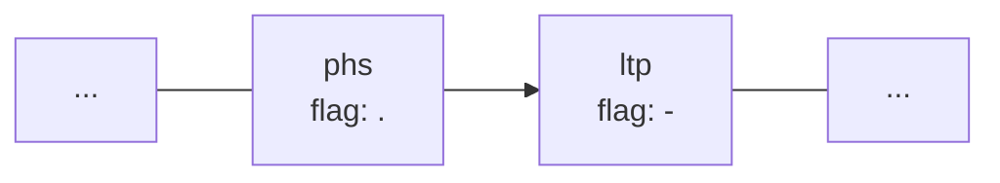

# Towards a Dual Process Cognitive Model for Argument Evaluation

Pierre Bisquert1, Madalina Croitoru2, and Florence Dupin de Saint-Cyr3

1 INRA, Montpellier, France  
pierre.bisquert@supagro.inra.fr  

2 University Montpellier, Montpellier, France  
croitoru@lirmm.fr  

3 IRIT, Toulouse, France  
florence.bannay@irit.fr

*This work has been supported by the Agence Nationale de la Recherche (grant ANR-12-CORD-0012) and has benefited from useful discussion in Dagstuhl Seminar 15221 “Multi-disciplinary approaches to reasoning”.*

*C. Beierle and A. Dekhtyar (Eds.): SUM 2015, LNAI 9310, pp. 298–313, 2015.*  
*© Springer International Publishing Switzerland 2015*  
DOI: 10.1007/978-3-319-23540-0_20

## Abstract

In this paper we are interested in the computational and formal analysis of the persuasive impact that an argument can produce on a human agent. We propose a dual process cognitive computational model based on the highly influential work of Kahneman and investigate its reasoning mechanisms in the context of argument evaluation. This formal model is a first attempt to take a greater account of human reasoning and is a first step to a better understanding of persuasion processes as well as human argumentative strategies, which is crucial in collective decision making domain.

**Keywords:** Cognitive computational models · Dual process reasoning · Persuasion · Argument

## 1 Introduction

Gaining more and more attention, persuasion is a crucial aspect of human interaction and is closely linked to social groups creation and dynamics [30,33]. With the recent rise of computer science technology, the study of persuasion began to transcend its original fields (including psychology, rhetoric and political sciences) and to take lasting root in the artificial intelligence (AI) domain.

In the AI domain, two predominant trends may be identified: interactive technologies for human behavior and dialogue protocols for persuasion. The former trend aims at producing systems able to persuade humans to change their behavior for another one considered better [21]. It has often been used in the context of health-care [19], environment [5] or education [12]. Such an approach, by definition, is human-machine oriented. The latter trend, derived from logic and philosophy authors such as Hamblin [13], Perelman [22] or Walton [31], aims at creating normative dialogue protocols ensuring rational interactions between agents [1,20,24]. The proposed protocols regulate the persuasion processes engaged between agents such that conflicts are resolved in a fair manner. These approaches are often machine-machine oriented and prescriptive.

In this paper we are interested in the computational and formal analysis of the persuasive interactions that occur between humans. Since humans are known to be subject to reasoning biases, we are interested in the link between persuasion and cognitive biases. The importance of this subject has, in particular, been highlighted in the field of law in the context of a court [8] or psychology [15]. This formalisation is a first step towards a better understanding of human persuasion strategies and may help to detect and notify cognitive biases, e.g. in protocols handling collective decision making.

Several works in psychology analyze cognitive biases with the help of dual process theory [2,9–11,26,29], where reasoning may be achieved thanks to two different processes, one being heuristic, superficial and fast, and the other being scrupulous, thorough and slow. Indeed, according to Kahneman [29], the first system (called S1) deals with quick and instinctive thoughts and is based on associations such as cause-effect, resemblance, valence, etc. The second system (called S2) is used as little as possible and is a slow and conscious process that deals with what we commonly call reason. Cognitive biases arise mostly when the superficial reasoning is used. In their seminal article [29], Tversky and Kahneman explain how supposedly “rational” judgments are based on data with limited validity and processed according to heuristic rules. They illustrate their thesis with a number of biases empirically demonstrated (such as the illusion of validity, retrievability of instances, anchoring, framing, etc.). This diptych has been popularized in many domains including persuasion [6,23]. In the Elaboration Likelihood Model [23], two routes might be used to persuade someone: the central route, which calls for a careful examination of the received message, and the peripheral route, using simple cues to evaluate the position advocated by an orator. While works such as [23,29] coincide in spirit, our aim is to unify them into a formal framework with four cognitive profiles for evaluating an argument such that a more engaged agent will use a deeper reasoning (S2) while a quiescent agent will only use associations (S1).

After defining a new cognitive model and two reasoning processes based on [29] as well as [23] in Sect. 2, we present how an argument might be evaluated and its effect on the agent’s mind in Sect. 3. Finally, some properties are shown in Sect. 4.

## 2 Towards a Computational Model of Cognitive Evaluation

### 2.1 Cognitive Model

In this paper, our aim is to define a computational cognitive model of the evaluation of an argument. Based on Kahneman’s theory, we propose to define an agent cognitive model as two components: `AT` (an association table linking a formula to an ordered set of formulae and to a flag encoding an appreciation) and `KB` (a logical knowledge base) in order to encode S1 and S2 respectively.[^1]

Formally, we consider a propositional language and we denote by $L$ the set of well formed formulae of this language given the usual connectives $\land$, $\lor$, $\to$, $\neg$ and the constants $\bot$ and $\top$. The set of symbols in the language is denoted by $V$. $\vdash$ denotes classical inference. The fact that a symbol $s$ appears in a formula $\varphi$ is denoted by $s \in \varphi$. We also consider a propositional language, denoted $L_G$, based on a set of symbols $V_G$ distinct from $V$ ($V_G \cap V = \emptyset$). Formulae of $L_G$ are called generic formulae.

**Definition 1 (Association Table).** An agent’s association table $AT$ is a set of triples of the form $(\varphi, (S, \succ_S), f)$ where:

- $\varphi \in L$ is a well formed formula representing a piece of knowledge,
- $S \subseteq L$ is a set of well formed formulae associated to $\varphi$ endowed with a total strict order $\succ_S \subseteq S \times S$, the pair $(S, \succ_S)$ is called a stack (when there is no ambiguity, the total order will be omitted),
- $f \in \{\oplus, -, .\}$ is a flag stating that $\varphi$ is respectively accepted, rejected or not specified (also called empty flag) in the association table.

The set of all well formed formulae in the association table is denoted by $L_{AT}$, i.e.,
$$
L_{AT} = \bigcup_{(\varphi,S,f)\in AT}\{\varphi\}.
$$

Given a formula $\varphi \in L_{AT}$, the stack $S$ associated with $\varphi$ in $AT$ will be denoted by $AT(\varphi)$, the $i$th element of $S$ is denoted $AT(\varphi,i)$, and the top element of this stack is denoted $Top(\varphi)$ ($Top(\varphi)=AT(\varphi,1)$). Formally,
$$
Top(\varphi) = \varphi^0 \text{ s.t. } \forall \varphi' \neq \varphi^0 \in AT(\varphi),\ \varphi^0 \succ_S \varphi'.
$$

The flag $f$ associated to $\varphi$ is denoted by $flag(\varphi)$. If $f$ is a flag then $-f$ is a flag such that $-\oplus = -$, $-- = \oplus$ and $-. = .$. Note that $AT$ is implicit in the definitions of $Top$ and $flag$.

A knowledge base contains Strict and Defeasible Beliefs, Appreciations (i.e. associations of formulae to flags) and a set of Appreciation Rules[^2] called a-rules as described below.

**Definition 2 (Knowledge Base).** A knowledge base $KB$ built on $L$ and $L_G$ is a quadruplet $KB=(F,\Delta,A,R)$ s.t. $F \subseteq L$ is a set of formulae, $\Delta$ is a set of default rules, $A$ is a set of appreciations and $R$ is a set of a-rules, where

- A default rule is denoted $a \Rightarrow b$ with $(a,b)\in L \times L$ with the intended meaning “if $a$ is true then generally $b$ holds”.
- An appreciation is a pair $(\varphi,f)\in L \times \{\oplus, -, .\}$ meaning that $\varphi$ is associated to the flag $f$.
- An a-rule has the form $(E_K,E_A) \mapsto (\psi,f)$ where $E_K \subseteq L_G \times L_G$ is a set of pairs of generic formulae (called generic default rules), $E_A \subseteq L_G \times \{\oplus, -, .\}$ is a set of generic appreciations, $\psi \in L_G$ is a generic formula and $f \in \{\oplus, -\}$ is a flag. This kind of rule has the intended meaning “if all the default rules $E_K$ apply in a given context and if all the appreciations $E_A$ hold then generally the new appreciation $(\psi,f)$ is valid”.

The use of default rules has two main interests. First, it simplifies the writing: it allows us to express a rule without mentioning every exception to it. Second, it allows us to reason with incomplete descriptions of the world: if nothing is known about the exceptional character of the situation, it is assumed to be normal, and reasoning can be completed.

**Definition 3 (Cognitive Model).** A cognitive model is a tuple $\kappa = (KB, AT, \lambda, i)$:

- $KB = (F,\Delta,A,R)$ is a knowledge base,
- $AT$ is an association table such that: $\forall \varphi,\varphi' \in L$, $\forall f \in \{\oplus, -, .\}$,

  - if $\varphi \in F$ then $\forall s,s' \in \varphi,\ s \in AT(s')$,
  - if $\varphi \Rightarrow \varphi' \in \Delta$ then $\varphi' \in AT(\varphi)$,
  - if $(\varphi,f) \in A$ then $flag(\varphi)=f$,

  \begin{equation}
  \tag{1}
  \end{equation}

- $\lambda \in \mathbb{N}$ is an integer value representing the threshold above which the agent feels to be enough aware about the topic of a formula to be able to reason rationally,
- $i : L \to \{0,1,2\}$ is a three value marker that gives the interest level of the agent relatively to a formula.

In other words, (1) expresses the link between $KB$ and $AT$, more precisely, every pair of symbols belonging to a given formula in $F$, and every pair of formulae in $\Delta$ linked by a default rule, are associated in $AT$ and the flags in $AT$ comply with $A$. In case of ambiguity about the current cognitive model, the symbols $AT$, $Top$, $flag$ will be indexed by the cognitive model $\kappa$ they refer to.

**Example 1.** We illustrate here the question of performing the separation of durum wheat cereal (or other plants in the field such as peas) after the harvest that was done within an ANR DUR-DUR[^3] meeting. As our keen internship student was performing his literature review, he quickly learned that post harvest separation (`phs`) is efficient (`eff`), which implies a process that is not expensive ($\neg exp$). His $KB$ contains formulae such as $phs \Rightarrow eff$ and $eff \Rightarrow \neg exp$. However, during a coffee break, he heard a colleague working on post harvest separation with optical harvest devices (`opt`) and learned that these instruments are generally very long to produce (`ltp`): $phs \land opt \Rightarrow ltp$. He is certain that long production is not efficient: $ltp \to \neg eff$. While he still does not know whether to accept or reject the post harvest separation, the first thing he now associates post harvest with is the long time to produce, something he disapproves of. This is represented by the flag $-$ in $AT$ (see Fig. 1) and by the appreciation $(ltp,-)$ in $KB$.

**Figure 1. Partial representation of the associative table.**

### 2.2 System 1 and System 2 Reasoning

Let us see how to use this representation framework in order to reason. In this paper, we call reasoning the process of evaluating the acceptability of a formula $\varphi \in L$, i.e., mapping $\varphi$ to a flag in $\{\oplus, -, .\}$. The reasoning is not the same in S1 and S2. In S1, reasoning is based on the association table $AT$ while in S2 it is based on an inference principle. We propose to encode S1-reasoning as follows: if the current formula has a non-empty flag, then this flag is returned; else, if the current concept has an empty flag, the concepts of the stack associated to the current concept are evaluated recursively, in an order relative to their position in the stack and the number of iterations.

We first define a reflection path $R_\varphi$ associated to a concept $\varphi$ thanks to a sequence $D_\varphi$ of iterations from the initial formula $\varphi$. This sequence contains the successive depths $d_i$ in the stacks corresponding to formulae with an empty flag that are necessary to follow in order to find a formula with a non-empty flag. The reflection path jumps recursively from a formula $\varphi_i$ to a formula $\varphi_{i+1}$ if $\varphi_{i+1}$ appears in the stack of $\varphi_i$ at the depth $d_i$ (each depth $d_i$ in the sequence should not exceed the total depth of each stack $AT(\varphi_i)$). Note that many reflection paths can be built from a formula $\varphi$; this is why we will select the cheapest one in terms of cognitive effort.

**Definition 4 (Reflection Path).** A reflection path $R_\varphi = (\varphi_1,\ldots,\varphi_n)$ from $\varphi$ is a sequence of $n \geq 1$ formulae corresponding to a sequence $(d_1,\ldots,d_{n-1})$ of $n-1$ integers such that $\varphi_1=\varphi$ and recursively
$$
\forall 1 \leq i < n,\ \varphi_{i+1} = AT(\varphi_i,d_i),
$$
with $d_i \leq |AT(\varphi_i)|$ and $flag(\varphi_i)=.$.

We denote $flag(R_\varphi)$ the flag associated to the last concept reached by the sequence $R_\varphi$, hence,
$$
flag(R_\varphi)=
\begin{cases}
flag(\varphi_n) & \text{if } n \text{ is finite,} \\
. & \text{otherwise.}
\end{cases}
$$

The cognitive weight associated to a reflection path $R_\varphi=(\varphi_1,\ldots,\varphi_n)$ associated to the integers $(d_i)_{1\leq i<n}$ is
$$
weight(D)=\sum_{i=1}^{n-1} d_i + n.
$$

The cognitive weight associated to a sequence allows to take into account both the depth in the stack and the number of iterations. The more deep and long is the sequence, the more it requires an effort to the agent. S1-reasoning will amount to find and follow reflection paths of minimal cognitive weight until a non-empty flag is reached. Hence, S1-reasoning consists in finding a non-empty flag to associate to a concept while minimizing[^4] the cognitive effort.

**Definition 5 (S1-reasoning).** Given a cognitive model $\kappa = (KB, AT, \lambda, i)$,

We call S1-entailment, denoted by $\mid\!\sim_1$, the inference obtained by following a reflection path:
$$
\varphi \mid\!\sim_1 \psi \text{ iff } \psi \in R_\varphi \text{ and } R_\varphi \text{ is finite.}
$$

We define S1-reasoning[^5], about a formula $\varphi$, denoted $eval_1(\varphi,\kappa)$, as
$$
eval_1(\varphi)=flag(R_\varphi)
$$
where $R_\varphi$ is a reflection path from $\varphi$ s.t. there is no reflection path $R'_\varphi$ from $\varphi$ with $weight(R'_\varphi) < weight(R_\varphi)$.

**Example 2.** Given the association table shown in Fig. 1, the result of $eval_1(phs)$ is $-$. Indeed, since the formula $phs$ has the flag $.$, the S1-reasoning gets the top formula of the stack associated to $phs$, which is $ltp$; the reflection path is $R_{phs}=(phs,ltp)$ and its associated sequence is $(1)$. The flag of $ltp$ being different than $.$, it is the result of the evaluation.

Concerning S2, the study of the best rational model among all the proposals done in the AI literature is out of the scope of the paper. We propose to use, for the sake of illustration, the idea of defeasible approach of [3], called “contextual entailment” which is an extension of the “preferential entailment” [17]. Preferential entailment is an inference relation satisfying “desirable” postulates (listed in Sect. 4).

The set of conclusions that one can obtain by using a “preferential entailment” is usually regarded as the minimal set of conclusions that any reasonable non-monotonic consequence relation for default reasoning should generate. Moreover, it correctly addresses the specificity problem: results issued from subclasses override those obtained from super-classes [28]. Unfortunately, in spite of these two advantages, “preferential entailment” is too cautious and suffers from the so-called irrelevance problem: from a rule “generally, if $a$ then $b$”, it is not possible to deduce that $b$ follows from $a \land d$ even if $d$ is irrelevant to $a$ and $b$. A typical example of irrelevance problem is that from “generally, birds fly” it is not possible to deduce that “red birds fly”.

The approach proposed in [3] has shown to be an extension of “preferential entailment” which corrects this problem. This is why we choose to build S2 on the same idea. This is based on the identification of default rules having exceptions in a given context:

**Definition 6 ([3]).** Let $c$ be a consistent formula considered as the current context, let $\Delta$ be a set of default rules. A default rule $a \Rightarrow b \in \Delta$ has an exception with $c$ if and only if one of the two conditions holds:

1. $a \land c \land b$ is inconsistent,
2. $\exists \varphi \in L,\ c \vdash \varphi$ and $a \land \varphi \mid\!\sim_\Delta \neg b$,

where $\mid\!\sim_\Delta$ is the inference relation defined by the closure of the preference entailment relation $\mid\!\sim$ over the set obtained by interpreting each default $a \Rightarrow b \in \Delta$ as $a \mid\!\sim b$.

**Definition 7 (S2-entailment).** Given a knowledge base $KB=(F,\Delta,A,R)$, S2-entailment, denoted $\mid\!\sim_2$, is defined by $\forall \varphi,\varphi' \in L$,
$$
\varphi \mid\!\sim_2 \varphi' \text{ iff } F_\varphi \cup \{\varphi\} \nvdash \bot \text{ and } F_\varphi \cup \{\varphi\} \vdash \varphi',
$$
where
$$
F_\varphi = F \cup \{a \to b \mid a \Rightarrow b \in \Delta \text{ has no exception with } \varphi\}.
$$

**Example 3.** The student’s $KB$ is s.t. $\Delta = \{phs \Rightarrow eff,\ eff \Rightarrow \neg exp,\ phs \land opt \Rightarrow ltp\}$ and $F = \{ltp \to \neg eff\}$. It holds that $phs \mid\!\sim_2 \neg exp$ (using Cautious monotony on $phs \mid\!\sim eff$ and $eff \mid\!\sim \neg exp$ and Cut on $phs \land eff \mid\!\sim \neg exp$ and $phs \mid\!\sim eff$ and due to the fact that Contextual entailment generalizes Preferential entailment, see Proposition 1).

Note that we are not yet in position to define S2-reasoning, which could evaluate the flag of a formula $\varphi$ given a cognitive model $\kappa$. In order to do so we should define an aggregation function that combines all the possible flags that could be obtained for $\varphi$ given the available beliefs, appreciations and a-rules. However, we have enough material to define the evaluation of one argument as shown in the next section.

## 3 Argument Evaluation

### 3.1 Argument and Profiles

We first give a (restrictive) definition of an argument, since we only consider arguments in favor of appreciations and not in favor of beliefs as it is the case in, for instance, [1].

**Definition 8 (Argument).** An argument is a tuple $(s,h,w,(c,f))$ where $s$ is a formula (the speaker enunciating the argument), $h$ is a pair $(K_h,A_h)$ with a set of default rules $K_h$ and a set of appreciations $A_h \subseteq L \times \{\oplus, -, .\}$ (the premise of the argument), $w$ is an a-rule (the warrant), $c$ is a formula (the conclusion) and $f \in \{\oplus, -\}$ is a flag stating that the argument conclusion should be accepted or rejected.

This definition is syntactic. Hence, quadruplets containing premises not linked with the conclusion may comply with our definition. It is up to the listener to declare if the argument is valid semantically. This is the aim of this section. In the ELM model [23], the determination of the “route” for persuasion is made thanks to two main factors: the interest in processing the message and the ability (wrt knowledge and cognitive availability) to process it. In our model, the interest is given by the function $i$ (see Definition 3). An agent may be not interested by a formula $\varphi$ ($i(\varphi)=0$), interested ($i(\varphi)=1$) or “fanatic” ($i(\varphi)=2$). The knowledge is represented by the size of the stack related to $\varphi$ in $AT$. This size is compared to the agent’s threshold $\lambda$ (see Definition 3) in order to link the quantity of information the agent has to his feeling about being sufficiently aware on $\varphi$.

We use these factors for distinguishing several profiles of agents (note that we leave the cognitive availability for future work). In order to make a clear-cut categorisation of the possible engagements and to comply with the notions used in the ELM model, we define four levels of engagement: unconcerned, enthusiastic, quiescent or engaged with increasing involved level of cognition (see Definitions 11–14). Such profiles represent typical (and extreme) dispositions wrt the evaluation of an argument which goes beyond the classical idea to propose credulous and sceptical attitudes (see e.g. [1]).

**Definition 9 (Profile).** The profile of an agent is a function that maps a formula $\varphi \in L$ and a cognitive model $\kappa = (KB, AT, \lambda, i)$ to an element of $\{unc, ent, qui, eng\}$:
$$
profile(\varphi,\kappa)=
\begin{cases}
unc & \text{if } i(\varphi)=0 \\
qui & \text{if } i(\varphi)=1 \text{ and } |AT(\varphi)| < \lambda \\
eng & \text{if } i(\varphi)=1 \text{ and } |AT(\varphi)| \geq \lambda \\
ent & \text{if } i(\varphi)=2
\end{cases}
$$

The following postulate expresses that if an agent is enthusiastic about a formula $\varphi$, then she has an opinion about $\varphi$.

**Postulate 1.** $profile(\varphi,\kappa)=ent$ implies $flag_\kappa(\varphi) \neq .$.

The next section details the value of the function $evalarg$ defined below.

**Definition 10 (Evaluation of an Argument).** Given a cognitive model $\kappa = (KB, AT, \lambda, i)$, an argument $a=(s,h,w,(c,f))$ and a profile $p=profile(c,\kappa)$, let $evalarg$ be a function that maps $a$ and $p$ to an evaluation of the argument in $\{\oplus, -, .\}$, denoted as $evalarg(a,p)$.

### 3.2 Argument Evaluation According to Profiles

In this section, we define formally how the evaluation is done with respect to the four profiles.

#### Unconcerned

As its name implies, the unconcerned profile represents the fact that no interest is given by the agent in the received argument. Hence, an unconcerned agent will not bother trying to evaluate this argument and will just discard it.

**Definition 11 (Unconcerned Evaluation).** Given an argument $a=(s,h,w,(c,f))$, the evaluation of $a$ by an unconcerned agent $unc$ is never done.

#### Enthusiastic

The enthusiastic profile represents the fact that an agent is already convinced. As such, she does not feel the need to evaluate rationally the argument and will just check if the flag of the argument’s conclusion correspond to the flag in her $AT$.

**Definition 12 (Enthusiastic Evaluation).** Given an argument $a=(s,h,w,(c,f))$, the evaluation of $a$ by an enthusiastic agent
$$
evalarg(a,ent)=\oplus \text{ iff } eval_1(c)=f
$$
else
$$
evalarg(a,ent)=-.
$$

#### Quiescent

A quiescent profile represents an “ideally instinctive” agent evaluating an argument thanks to her S1. More precisely, when receiving an argument, the agent evaluates the argument’s conclusion and the speaker. She will accept the argument if she agrees with the conclusion and does not reject the speaker, or vice-versa.

**Definition 13 (Quiescent Evaluation).** Given an argument $a=(s,h,w,(c,f))$, the evaluation of $a$ by a quiescent agent with a cognitive model $\kappa$ is defined as follows:
$$
evalarg(a,qui)=
\begin{cases}
\oplus & \text{if } (eval_1(c,\kappa)=f \text{ and } eval_1(s,\kappa)\neq -) \text{ or } \\
& \quad (eval_1(c,\kappa)\neq -f \text{ and } eval_1(s,\kappa)=\oplus), \\
- & \text{if } (eval_1(c,\kappa)=-f \text{ and } eval_1(s,\kappa)\neq \oplus) \text{ or } \\
& \quad (eval_1(c,\kappa)\neq f \text{ and } eval_1(s,\kappa)=-), \\
. & \text{otherwise.}
\end{cases}
$$

In future work, we plan to take into account the extra sources of persuasion such as the context created by the source of information including trustworthiness and charisma of the source, the contextual mood of the agent, etc.

**Example 4.** During a long and very technical meeting, when a partner said that “since post harvest separation is highly expensive, which is undesirable, post harvest has to be rejected”, our internship student did not have the cognitive ability to rationally consider this argument. While he would not have agreed with a deeper analysis, he instead relied on his S1, where post harvest separation is associated with something he rejects (see Fig. 1), and therefore accepted the argument.

#### Engaged

An engaged profile represents an “ideally rational” agent evaluating an argument exclusively thanks to her knowledge base. In this work, we propose to define an engaged agent as someone who evaluates an argument wrt its set of warrants that are encoded in a way to capture critical questions (see [4,32]). An engaged agent has to pass three steps before validating an argument: validity of the warrant (“Am I able to recognize this scheme of thought as a valid one?” translated into “Does it already exists in my personal base of a-rules”)[^6]; a syntactic validity of the use of the warrant in the argument (“Is the warrant conform with the premises and conclusions of the argument?” translated in terms of existence of a unification function $\sigma$); rational validation of applicability (“Are the premises correct and necessary ?” translated into the use of contextual inference in order to prove them).

**Definition 14 (Engaged Evaluation).** Given an argument $a=(s,h,w,(c,f))$, with $h=(K_h,A_h)$, the evaluation of $a$ by an engaged agent with a cognitive model $\kappa=(KB,AT,\lambda,i)$ with $KB=(F,\Delta,A,R)$ is defined as follows:
$$
evalarg(a,eng)=
\begin{cases}
\oplus & \text{if} \\
& \quad \begin{cases}
w \in R \text{ and} \\
\exists \sigma : V_G \to V \text{ s.t. } \sigma(w)=(h \mapsto (c,f)) \text{ and} \\
\forall (x \Rightarrow y)\in K_h,\ x \mid\!\sim_2 y \text{ and } \neg x \not\mid\!\sim_2 y \text{ and } A_h \subseteq A
\end{cases} \\
- & \text{if} \\
& \quad \begin{cases}
w \in R \text{ and} \\
\nexists \sigma : V_G \to V \text{ s.t. } \sigma(w)=(h \mapsto (c,f)) \text{ or} \\
\exists (x \Rightarrow y)\in K_h,\ x \not\mid\!\sim_2 y \text{ or } \neg x \mid\!\sim_2 y \text{ or } A_h \not\subseteq A
\end{cases} \\
. & \text{otherwise}
\end{cases}
$$

**Example 5.** Several days after the meeting, our internship student thought of the partner’s argument again. Now that he is able to analyze the argument more rationally, he can recognize its type ($w \in R$): his set of warrants $R$ contains two a-rules,
$$
w_1 = (\{a \Rightarrow b\}, \{(b,-)\}) \mapsto (a,-)
$$
and
$$
w_2 = (\{a \Rightarrow b\}, \{(b,\oplus)\}) \mapsto (a,\oplus)
$$
which encode the schemes associated to arguments from positive or negative consequences (see [32] for a definition of these argumentation schemes). Since
$$
h = (\{phs \Rightarrow exp\}, \{(exp,-)\})
$$
and the conclusion is $(phs,-)$, the argument is well formed wrt $w_1$; however, $w_2$ is not applicable. Then, he checks if the premise holds: as seen in Ex. 3, $phs \mid\!\sim_2 \neg exp$, and thus $phs \not\mid\!\sim_2 exp$. Hence, he rejects the argument.

### 3.3 Argument Influence on the Agent’s Mind

Once the argument has been evaluated by an agent, her cognitive model may have to be modified to account for the persuasive impact of the argument. Such modifications can either be the change of a flag value, the addition of a new association or the addition of a new rule. Definition 15 gives the functions representing these modifications.

**Definition 15 (Update Operations).** Given two cognitive states $\kappa=(KB,AT,\lambda,i)$ with $KB=(F,\Delta,A,R)$ and $\kappa'$, two formulae $x,y \in L$, a set of default rules $D \subseteq L \times L$ and a flag $f \in \{\oplus, -, .\}$, we define:

- $noop(\kappa)=\kappa$
- $setflag(\kappa,x,f)=\kappa'$ where $\kappa'=((F,\Delta,A',R),AT',\lambda,i)$ with
  - $L_{AT'} = L_{AT} \cup \{x\}$,
  - $\forall \varphi \in L_{AT}$ s.t. $\varphi \neq x$, $flag_{\kappa'}(\varphi)=flag_\kappa(\varphi)$ and $AT'(\varphi)=AT(\varphi)$,
  - $flag_{\kappa'}(x)=f$ and $A' = A \setminus \{(x,flag_\kappa(x))\} \cup \{(x,f)\}$ and $AT'(x)=AT(x)$.
- $push(\kappa,(x,y))=\kappa'$ where $\kappa'=(KB',AT',\lambda,i)$ with
  - if $x \notin L_{AT}$ then $AT' = AT \cup \{(x,S_x,.)\}$ with $S_x=\{y\}$,
  - else
    - $\forall \varphi \in L_{AT}$ s.t. $\varphi \neq x$, $flag_{\kappa'}(\varphi)=flag_\kappa(\varphi)$ and $AT'(\varphi)=AT(\varphi)$,
    - $flag_{\kappa'}(x)=flag_\kappa(x)$ and $AT'(x)=AT(x)\cup\{y\}$ with $Top(x)=y$,
- $addrule(\kappa,D)=\kappa'$ s.t. $\kappa' = ((F,\Delta \cup D,A,R),AT,\lambda,i)$.

Depending on the profile, the cognitive model will be modified in different ways. These differences aim at representing the fact that the persuasion may be deeper depending on the cognitive involvement of the agent. Table 1 gives the functions to apply to $\kappa$ in order to update it, according to the possible evaluations of an argument by an agent and her profile. The “×” in the `ent` and `unc` lines corresponds to impossible cases due to, respectively, Postulate 1 and Definition 11.

**Table 1. Update of a cognitive state $\kappa$.**

> The parsed source of this table is partially corrupted. The transcription below preserves the readable structure; uncertain fragments have been minimally reconstructed from visible content and marked only where necessary.

| `profile(c,\kappa)` | `evalarg((s,h,w,(c,f))) = .` | `evalarg((s,h,w,(c,f))) = -` | `evalarg((s,h,w,(c,f))) = \oplus` |
|---|---|---|---|
| `unc` | `push(\kappa,(c,h))`a | `×` | `×` |
| `ent` | `×` | `push(\kappa,(c,h))` `setflag(\kappa,s,-)` | `push(\kappa,(c,h))` `push(\kappa,(h,c))` `setflag(\kappa,s,\oplus)` |
| `qui` | `push(\kappa,(c,h))` | `push(\kappa,(c,h))` `setflag(\kappa,c,-f)` `setflag(\kappa,s,-)` | `push(\kappa,(c,h))` `push(\kappa,(h,c))` `setflag(\kappa,c,f)` `setflag(\kappa,s,\oplus)` |
| `eng` | `noop` | `noop` | `addrule(\kappa,K_h)` `setflag(\kappa,c,f)` |

a An argument is never evaluated by an unconcerned agent. However, we represent the fact that, like enthusiastic and quiescent agents, she is unconsciously influenced by what she hears.

## 4 Properties and Postulates

We have not yet been able to experiment in presence of human subjects in order to validate our model, but we have started to explore its rational properties.

### 4.1 Entailment Properties

Let us examine the properties of S1 and S2-entailment. Due to the construction of $\mid\!\sim_2$ on the basis of contextual entailment, it follows that $\mid\!\sim_2$ is obeying the same properties.

**Proposition 1.** $\mid\!\sim_2$ obeys the axiom and the five inference postulates of [17]:

- **Reflexivity:** $a \mid\!\sim_2 a$,
- **Left logical equivalence:** if $\vdash a \leftrightarrow b$ and $a \mid\!\sim_2 c$ then $b \mid\!\sim_2 c$,
- **Right weakening:** if $a \vdash b$ and $c \mid\!\sim_2 a$ then $c \mid\!\sim_2 b$,
- **Cut:** if $a \land b \mid\!\sim_2 c$ and $a \mid\!\sim_2 b$ then $a \mid\!\sim_2 c$,
- **Cautious monotony:** if $a \mid\!\sim_2 b$ and $a \mid\!\sim_2 c$ then $a \land b \mid\!\sim_2 c$,
- **Or:** if $a \mid\!\sim_2 c$ and $b \mid\!\sim_2 c$ then $a \lor b \mid\!\sim_2 c$.

It is not the same for $\mid\!\sim_1$, since it may be sensitive to the syntax, i.e., nothing prevents to have a different stack for two equivalent formulae.

**Proposition 2.**
- $\mid\!\sim_1$ obeys Reflexivity only for the formulae that admit finite reflection paths
- $\mid\!\sim_1$ obeys Left logical equivalence only if $AT$ is syntax dependent i.e. $\varphi \leftrightarrow \psi$ iff $AT(\varphi)=AT(\psi)$,
- $\mid\!\sim_1$ does not obey Right weakening
- Transitivity holds, namely, $a \mid\!\sim_1 b$ and $b \mid\!\sim_1 c$ implies $a \mid\!\sim_1 c$
- Cut, Cautious monotony and Or do not necessarily hold.

**Proof.** Reflexivity: if $\exists R_a$ s.t. $flag(R_a)\neq .$ then $a \in R_a$ hence $a \mid\!\sim_1 a$ otherwise it is not the case. Right weakening: since $b$ can be deducible logically from $a$ but not in $AT(a)$. Transitivity: it means that $b \in R_a$ and $c \in R_b$, hence if $flag(b)=.$ then $c \in R_a$ else $c=b$ hence $c \in R_a$ as well. Cut, Cautious Monotony and Or: it is due to the independence of associations wrt logic (hence “logical and” is not necessarily compatible with associations), [illegible].

### 4.2 Incorporation Property

Let us notice that after receiving an argument, the knowledge of an agent can only increase: more precisely, among the formulae that were already present, the number of flags that are not empty decreases (however some new formula may be added with an empty flag) and the number of associations grows. Moreover some rules can also be added in the case of an engaged profile.

**Proposition 3.** Let
$$
\kappa=((F,\Delta,A,R),AT,\lambda,i), \quad \kappa'=((F',\Delta',A',R'),AT',\lambda',i')
$$
such that $\kappa'$ is the cognitive model obtained from $\kappa$ after the utterance of an argument. It holds that $L_{AT} \subseteq L_{AT'}$, $\forall \varphi \in L_{AT},\ AT(\varphi) \subseteq AT'(\varphi)$, and $F=F'$, $\Delta \subseteq \Delta'$, $R=R'$, $\lambda=\lambda'$ and $i=i'$.

Note that the flag values are non-monotonic since a formula can obtain either an accepted, rejected or empty flag depending on the engagement profile.

### 4.3 Public Opinion Axioms

According to [34], the model of how information is transformed in public opinion follows four axioms mentioned below. Our proposal satisfies these axioms:

**Reception Axiom:** The greater the level a person’s level of cognitive engagement with an issue the more likely he/she will be exposed to and comprehend political messages concerning that issue. It holds since an unconcerned agent does not evaluate the argument, an enthusiastic agent takes it into account if she agrees with the conclusion, a quiescent agent evaluates it with S1-reasoning and an engaged agent evaluates it with S2-entailment. Hence, the more engaged an agent is, the more information she takes into account (in the following order: unconcerned, enthusiastic, quiescent, engaged).

**Resistance Axiom:** People tend to resist arguments that are inconsistent with their political predispositions but they do so only to the extent that they posses the contextual information necessary to perceive a relationship between the message and their predispositions. Unconcerned, enthusiastic and engaged agents may resist an argument since they are not influenced by its flag. A quiescent agent resists arguments that are against her opinion or uttered by a source she rejects (see Definition 13).

**Accessibility Axiom:** The more recently a consideration has been called to mind, or thought about, the less time it takes to retrieve that consideration or related considerations from memory and bring them to the top of the head for use. This axiom is satisfied concerning the association table $AT$ since every kind of profile add the new piece of information at the top of the stack (see Table 1).

**Response Axiom:** Individuals answer survey questions by averaging across the considerations that are immediately salient or accessible to them. It holds for quiescent and enthusiastic: a quiescent agent evaluates a formula by considering the most immediately accessible information and an enthusiastic agent evaluates only the immediate value of a formula. However, it does not hold for unconcerned and engaged agents: one does not evaluate the formula, and the other evaluates the formula with her knowledge base.

## 5 Conclusion

This paper is a first proposal of a formalization of dual process theory and its link with human persuasion. Based on the ELM model of persuasion, we define four profiles evaluating an argument in different ways. One of the profiles aims at reasoning thanks to an association table, and another is based on a logical inference mechanism named contextual entailment. This mechanism is a possible implementation of S2 and can be changed without jeopardizing the cognitive model. Moreover, each profile integrates the contents of the received argument differently. Accordingly to public opinion axioms, the more cognition was involved in its evaluation, the more persuasive content will take root in the mind of the agent.

### Related Work

Dual process theories have already been implemented for problem solving. Namely, [14] with an extension of the CLARION architecture that relies on two modules: a bottom-level (resp. top-level) module handling implicit knowledge (resp. explicit knowledge), which recall the S1 and S2 systems but is not based on formal logic. [27] proposes a general intelligence cognitive architecture composed of a long-term memory independent of specific tasks and a capacity-limited working memory. The S1 and S2 systems allow them to distinguish between perception and imagination and are represented thanks to two binary relations on the element of the long-term memory and two propagation processes. Some works, similarly to ours but not in a logical framework, aim at explaining purely human processes. For instance, [18] studies the emergence of emotions thanks to a three-levels cognitive architecture: S1 (the reactive level) and S2, subdivided into the algorithmic level and the reflective level. The first one is responsible for fast and instinctive behaviours, the second one is used for cognitive control and the last one handles rational behavior.

In [16] is a different approach for persuasion, since the NAG program is able to analyze and generate arguments with the aim of persuading a human user. In order to do so, NAG comprises two different models, a normative model that is able to judge the correctness of an argument (in terms of links between the premises and the conclusion), and a user model, that is able to evaluate the persuasion capability of an argument on the user. Hence, NAG is interestingly able to analyze an argument given by the user and to try to generate a counterargument which is at the same time correct and specifically designed to be effective on the user. Since NAG has to persuade a human user, it requires a representation of her cognitive profile, in particular her reasoning errors such as cognitive biases. Major differences exist between our approach and NAG. First, NAG is intended to interact with users, and as such it is human-machine oriented. Then, the model does not rely on a logical dual process but is based on a Bayesian network; cognitive biases are thus taken into account by the modification of probability degrees while, in our framework, biases are due to faulty appreciations, warrants or beliefs. Finally, the authors do not use argumentation schemes (encoded in our warrants base $R$) and thus do not have a clear definition of argument and ways to evaluate them.

### Perspectives

Since this work is a first attempt to formalize a two-process cognitive model and its links with argument evaluation, numerous perspectives can be envisaged. Namely, a refined definition of the weights associated to the reflection paths could help to account for the various heuristics Kahneman and Tversky described. Moreover, we would like to investigate a way to compute the cognitive availability of an agent in order to determine her ability to engage in the argument evaluation. Such study would benefit from the definition of a profile corresponding to a continuum between the quiescent and the engaged profiles. Such a profile might be more adapted to represent human reasoning with its bounded rationality, and may help to better capture the difference of persuasion strategies that can be used according to the proximity to S1 or S2-reasoning. Moreover, a more realistic model should take into account social influence [7] between agents when exchanging arguments. In the same way, the study of rhetorical mechanisms could improve the evaluation of argument with another dimension. Finally, the public opinion axioms of [34] show that results from psychology studies can be used to guide our research, and as such it would be useful to validate our proposal by an empirical study with human beings.

## References

1. Amgoud, L., Maudet, N., Parsons, S.: An argumentation-based semantics for agent communication languages. In: ECAI 2002, pp. 38–42. IOS Press (2002)  
2. Beevers, C.G.: Cognitive vulnerability to depression: a dual process model. *Clin. Psychol. Rev.* 25(7), 975–1002 (2005)  
3. Benferhat, S., Dupin de Saint Cyr - Bannay, F.: Contextual handling of conditional knowledge. In: *Proceedings of IPMU 1996*, Granada, Spain, July 1996  
4. Blair, J.A., Johnson, R.H.: Informal logic: an overview. *Informal Logic* 20(2), 93–108 (2000)  
5. Burrows, R., Johnson, H., Johnson, P.: Developing an online social media system to influence pro-environmental behaviour based on user values. In: ICPT (2014)  
6. Chaiken, S.: The heuristic model of persuasion. In: *Social influence: The Ontario Symposium*, vol. 5, pp. 3–37 (1987)  
7. Cialdini, R.: *Influence: Science and Practice*. Allyn and Bacon, Boston (2001)  
8. Clements, C.S.: Perception and persuasion in legal argumentation: using informal fallacies and cognitive biases to win the war of words. *BYU Law Rev.* 2013(2), 319 (2013)  
9. Croskerry, P., Singhal, G., Mamede, S.: Cognitive debiasing 1: origins of bias and theory of debiasing. *BMJ Qual. Saf.* 22(Suppl 2), 58–64 (2013)  
10. Epstein, S.: Integration of the cognitive and the psychodynamic unconscious. *Am. Psychol.* 49(8), 709–724 (1994)  
11. Evans, J.S.B.T., Curtis-Holmes, J.: Rapid responding increases belief bias: evidence for the dual-process theory of reasoning. *Think. Reasoning* 11(4), 382–389 (2005)  
12. Forget, A., Chiasson, S., van Oorschot, P.C., Biddle, R.: Persuasion for stronger passwords: motivation and pilot study. In: Oinas-Kukkonen, H., Hasle, P., Harjumaa, M., Segerståhl, K., Øhrstrøm, P. (eds.) *PERSUASIVE 2008*. LNCS, vol. 5033, pp. 140–150. Springer, Heidelberg (2008)  
13. Hamblin, C.: *Fallacies*. University paperback, Methuen (1970)  
14. Hélie, S., Sun, R.: Incubation, insight, and creative problem solving: a unified theory and a connectionist model. *Psychol. Rev.* 117(3), 994–1024 (2010)  
15. Hornikx, J., Hahn, U.: Reasoning and argumentation: towards an integrated psychology of argumentation. *Think. Reasoning* 18(3), 225–243 (2012)  
16. Korb, K.B., Mcconachy, R., Zukerman, I.: A cognitive model of argumentation. In: *Proceedings of the Nineteenth Annual Conference of the Cognitive Science Society*, pp. 400–405 (1997)  
17. Kraus, S., Lehmann, D., Magidor, M.: Nonmonotonic reasoning, preferential models and cumulative logics. *Artif. Intell.* 44, 167–207 (1990)  
18. Larue, O., Poirier, P., Nkambou, R.: Emotional emergence in a symbolic dynamical architecture. In: Chella, A., Pirrone, R., Sorbello, R., Jóhannsdóttir, K.R. (eds.) *Biologically Inspired Cognitive Architectures 2012*. AISC, vol. 196, pp. 199–204. Springer, Heidelberg (2013)  
19. Lehto, T., Oinas-Kukkonen, H.: Explaining and predicting perceived effectiveness and use continuance intention of a behaviour change support system for weight loss. *Behav. Inf. Technol.* 34(2), 176–189 (2015)  
20. Mackenzie, J.: Four dialogue systems. *Stud. Logica* 49(4), 567–583 (1990)  
21. Oinas-Kukkonen, H.: A foundation for the study of behavior change support systems. *Pers. Ubiquit. Comput.* 17(6), 1223–1235 (2013)  
22. Perelman, C., Olbrechts-Tyteca, L.: *The New Rhetoric: A Treatise on Argumentation*. University of Notre Dame Press, Notre Dame (1969)  
23. Petty, R., Cacioppo, J.: The elaboration likelihood model of persuasion. *Adv. Exp. Soc. Psychol.* 19(C), 123–205 (1986)  
24. Prakken, H.: Formal systems for persuasion dialogue. *Knowl. Eng. Rev.* 21(2), 163–188 (2006)  
25. Rahwan, I., Amgoud, L.: An argumentation based approach for practical reasoning. In: *Proceedings of the Fifth International Joint Conference on Autonomous Agents and MultiAgent Systems*, pp. 347–354 (2006)  
26. Sloman, S.A.: The empirical case for two systems of reasoning. *Psychol. Bull.* 119(1), 3–22 (1996)  
27. Strannegård, C., von Haugwitz, R., Wessberg, J., Balkenius, C.: A cognitive architecture based on dual process theory. In: Kühnberger, K.-U., Rudolph, S., Wang, P. (eds.) *AGI 2013*. LNCS, vol. 7999, pp. 140–149. Springer, Heidelberg (2013)  
28. Touretzky, D.: Implicit ordering of defaults in inheritance systems. In: *Proceedings of AAAI 1984*. University of Texas at Austin (1984)  
29. Tversky, A., Kahneman, D.: Judgment under uncertainty: heuristics and biases. *Science* 185(4157), 1124–1131 (1974)  
30. van Knippenberg, D.: Social identity and persuasion: reconsidering the role of group membership. In: *Social Identity and Social Cognition*, vol. XVII, pp. 315–331 (1999)  
31. Walton, D.: *Logical Dialogue: Games and Fallacies*. University Press of America, Lanham (1984)  
32. Walton, D., Reed, C., Macagno, F.: *Argumentation Schemes*. Cambridge University Press, Cambridge (2008)  
33. Wood, W.: Attitude change: persuasion and social influence. *Annu. Rev. Psychol.* 51(1), 539–570 (2000)  
34. Zaller, J.: *The Nature and Origins of Mass Opinion*. Cambridge Studies in Political Psychology Series. Cambridge University Press, Cambridge (1992)

---

[^1]: Note that S1 and S2 are linked as we will see in (1) of Definition 3.
[^2]: Inspired from the Desire-Generation rules (of Rahwan and Amgoud [25]).
[^3]: French funded project aiming at improving durum wheat sustainability (http://www.agence-nationale-recherche.fr/?Project=ANR-13-ALID-0002).
[^4]: Note that we could also have given more weight to the depth in the stack than to iteration or conversely, hence transform the equation into $weight(D)=\alpha \cdot \sum_{i=1}^{n} d_i + \beta \cdot n$ with a “smart” tuning of the ratio between $\alpha$ and $\beta$ (this tuning should be based on psychological experiments).
[^5]: In practice, a constructive method to obtain $R_\varphi$ could be an adaptation of Dijkstra algorithm on a graph where the vertices are partial reflection paths. An arc would link a vertex to another vertex if it corresponds to an extension of the path of one iteration (hence there would be as many arcs starting from a given vertex as the stack corresponding to this vertex is deep), namely there would be an arc between $(\varphi_1,\varphi_2)$ and $(\varphi_1,\varphi_2,\varphi_3)$. The algorithm should start from the vertex corresponding to the empty path (i.e. it corresponds to the initial concept $\varphi$) and find a shortest path to a vertex with a non-empty flag. The length of a path would be the weight of the reflection path $R_\varphi$ contained in the last vertex of the path.
[^6]: Note that we propose to be neutral wrt an argument that uses an unknown warrant.