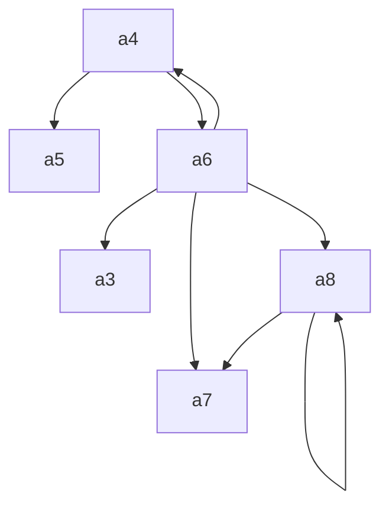

```
# Undercutting in Argumentation Systems

**Leila Amgoud**$^{1}$ and **Farid Nouioua**$^{2}$

$^{1}$ IRIT – CNRS, Toulouse, France  
amgoud@irit.fr

$^{2}$ LSIS – Aix-Marseille University, Marseille, France  
farid.nouioua@lsis.org

*In:* C. Beierle and A. Dekhtyar (Eds.): SUM 2015, LNAI 9310, pp. 267–281, 2015.  
DOI: 10.1007/978-3-319-23540-0_18

## Abstract

Rule-based argumentation systems are developed for reasoning about defeasible information. They take as input a theory made of a set of strict rules, which encode strict information, and a set of defeasible rules which describe general behaviour with exceptional cases. They build arguments by chaining such rules, define attacks between them, use a semantics for evaluating the arguments, and finally identify the plausible conclusions that follow from the rules.

One of the main attack relations of such systems is the so-called undercutting which blocks the application of defeasible rules in some contexts. In this paper, we show that this relation is powerful enough to capture alone all the different conflicts in a theory. We present the first argumentation system that uses only undercutting and fully characterize both its extensions and its plausible conclusions under various acceptability semantics.

**Keywords:** Rule-based argumentation · Undercutting · Acceptability semantics

## 1 Introduction

Rule-based argumentation systems are developed for reasoning about defeasible information. As a major feature, they take as input a theory made of a set of facts, a set of strict rules, which encode strict information, and a set of defeasible rules which describe general behaviour with exceptional cases. They build arguments by chaining such rules, define attacks between them, use a semantics for evaluating the arguments, and finally identify the plausible conclusions that follow from the rules. Examples of such systems are ASPIC [2], its extended version ASPIC+ [14], Delp [8] and the system developed in [11]. Some of these systems satisfy the rationality postulates proposed in [3]. However, the plausible conclusions of any of these systems have never been characterized. Thus, despite the wide use of these systems, their outputs are still unknown.

Besides that, systems like Delp use rebuttal as attack relation between arguments. Rebuttal captures the fact that the conclusions of two arguments are inconsistent. Systems like ASPIC [2] and Pollock’s system [13] use, in addition to rebuttal, undercut which blocks the application of defeasible rules in particular contexts. Let us illustrate this relation by an example borrowed from [13]. Consider the following argument $(a)$:

“The object is red $(or)$ because it looks red $(lr)$”.

This argument uses the defeasible rule $lr \Rightarrow or$ (meaning that generally, if an object looks red, then it is red). Assume now another argument $(b)$ which states the following:

“The rule $lr \Rightarrow or$ is inapplicable since the object is illuminated by a red light”.

The argument $b$ undercuts $a$ and the conclusion $(or)$ of $a$ is not drawn from the theory. Undercut deals with the exceptions of defeasible rules. Indeed, every exception of a defeasible rule gives birth to an attack from any argument involving the exception toward any argument using the rule. In the example, being illuminated by a red light is a specific case where the rule $lr \Rightarrow or$ cannot be applied.

In this paper, we argue that undercut can do more than dealing with exceptions of defeasible rules. It can also perfectly play the role of rebuttal, and deal thus with inconsistency in a theory. The basic idea is the following: any defeasible rule $x \Rightarrow y$ should be blocked when $\neg y$ follows from the theory. We propose the first rule-based argumentation system that uses undercutting as its single attack relation. We show that it satisfies the rationality postulates discussed in [3] under naive, stable and preferred semantics. From a conceptual point of view, this system is much simpler than existing ones that combine rebuttal and undercut. For instance, in order to satisfy the postulates, ASPIC and ASPIC+ require a different variant of rebuttal for each semantics. Our system satisfies the postulates under all semantics. Moreover, restricted rebut, one of the variants of rebuttal, is based on an assumption which is not intuitive. Indeed, this relation compares only the rules whose heads are inconsistent, and neglects the remaining structure of the arguments. For instance, it considers that the argument $(x_1, x_1 \Rightarrow y_1, y_1 \to z)$ attacks the argument $(x_2, x_2 \to y_2, y_2 \Rightarrow \neg z)$ since $z$ follows from a strict rule while $\neg z$ follows from a defeasible one. Note that the converse is not true even if the first rule of the first argument is defeasible while that of the second argument is strict. In our system, we do not make such assumptions. The second main contribution of the paper consists of providing the first and full characterizations of the extensions as well as the set of plausible conclusions of our system under naive, stable and preferred semantics proposed in [7].

The paper is organized as follows: Sect. 2 defines the rule-based system we are interested in, Sect. 3 analyses its properties, Sect. 4 characterizes its outputs (extensions and plausible conclusions), and Sect. 5 compares it with existing systems. The proofs can be downloaded from http://www.irit.fr/~Leila.Amgoud/sum15.pdf.

## 2 Rule-Based Systems

As in [1], three kinds of information are distinguished: Facts representing factual information like “Tweety is a bird”, strict rules representing strict information like “Penguins do not fly” and defeasible rules describing general behavior with exceptional cases like “Birds fly”. In what follows, $L$ is a set of literals, i.e. atoms or negation of atoms, representing knowledge. The negation of an atom $x$ from $L$ is denoted $\neg x$. $L^\#$ is a set of atoms used for naming rules. The two sets satisfy the constraint $L \cap L^\# = \emptyset$. Every rule has a single name and two rules cannot have the same name. Throughout the paper, rules are named $r, r_1, r_2, \ldots$. The function $Rule(r_i)$ returns the rule whose name is $r_i$.

- Facts are elements of $L$.
- Defeasible rules are of the form $x_1, \ldots, x_n \Rightarrow x$ and $x, x_1, \ldots, x_n$ are literals in $L$.
- Strict rules are of the form $x_1, \ldots, x_n \to x$ where $x_1, \ldots, x_n$ are literals of $L$ and
  - $x \in L$, or
  - $x \in L^\#$ and $Rule(x)$ is defeasible.

Note that the names of rules cannot appear in bodies of (strict or defeasible) rules. This means that it is not possible to represent information of the form “if rule $r$ is applied (or is blocked), then $y$ holds”. Moreover, strict rules cannot be blocked. By default, any defeasible rule can be applied, unless explicitly mentioned in the language by strict rules $x_1, \ldots, x_n \to x$ with $x \in L^\#$. Such a rule is read as follows: If $x_1, \ldots, x_n$ hold, then the defeasible rule $x$ is always not applicable.

### Definition 1 (Theory)

A theory is a triple $T = (F, S, D)$ where $F \subseteq L$ is a set of facts and $S \subseteq L^\#$ (respectively $D \subseteq L^\#$) is a set of strict (respectively defeasible) rules.

**Notations:** For each rule $x_1, \ldots, x_n \to x$ (as well as $x_1, \ldots, x_n \Rightarrow x$) whose name is $r$, the head of the rule is $Head(r) = x$ and the body of the rule is $Body(r) = \{x_1, \ldots, x_n\}$. Let $T = (F, S, D)$ and $T^\# = (F^\#, S^\#, D^\#)$ be two theories. We say that $T$ is a sub-theory of $T^\#$, written $T \sqsubseteq T^\#$, iff $F \subseteq F^\#$ and $S \subseteq S^\#$ and $D \subseteq D^\#$. The relation $\sqsubset$ is the strict version of $\sqsubseteq$ (i.e. it is the case that at least one of the three inclusions is strict). Finally, $Defs(T) = D$.

Let us now show how new information is produced from a given theory. This is generally the case when (strict and/or defeasible) rules are fired in a derivation schema.

### Definition 2 (Derivation schema)

Let $T = (F, S, D)$ be a theory and $x \in L \cup L^\#$. A derivation schema for $x$ from $T$ is a finite sequence $d = ((x_1, r_1), \ldots, (x_n, r_n))$ such that:

- $x_n = x$
- for $i = 1 \ldots n$,
  - $x_i \in F$ and $r_i = \emptyset$, or
  - $r_i \in S \cup D$ and $Head(r_i) = x_i$ and $Body(r_i) \subseteq \{x_1, \ldots, x_{i-1}\}$

$$
Seq(d) = \{x_1, \ldots, x_n\}.
$$

$$
Facts(d) = \{x_i \mid i \in \{1, \ldots, n\},\ r_i = \emptyset\}.
$$

$$
Strict(d) = \{r_i \mid i \in \{1, \ldots, n\},\ r_i \in S\}.
$$

$$
Def(d) = \{r_i \mid i \in \{1, \ldots, n\},\ r_i \in D\}.
$$

$CN(T)$ denotes the set of all literals that have a derivation schema from $T$. It is clear from the definition that $CN$ is monotonic.

### Example 1

Let $T_1 = (F_1, S_1, D_1)$ be a theory such that $F_1 = \{p, b\}$, $S_1 = \{(r_1)\ p \to \neg f\}$ and $D_1 = \{(r_2)\ b \Rightarrow f\}$. From $T_1$, we have the following minimal derivations:

- $d_1 = ((p, \emptyset))$
- $d_2 = ((b, \emptyset))$
- $d_3 = ((p, \emptyset), (\neg f, r_1))$
- $d_4 = ((b, \emptyset), (f, r_2))$

A notion of consistency and another of coherence are associated with this language.

### Definition 3 (Consistency–Coherence)

A set $X \subseteq L$ is consistent iff there are no $x, y \in L$ such that $x = \neg y$. It is inconsistent otherwise. A theory $T = (F, S, D)$ is consistent iff $CN(T)$ is consistent. It is coherent iff $CN(T) \cap D = \emptyset$.

The set of strict rules should be closed under transposition. This is required for ensuring the rationality postulates proposed in [3].

### Definition 4 (Closure under transposition)

Let $S$ be a set of strict rules. For any rule $r = x_1, \ldots, x_n \to x$ with $x \in L$, $r^\#$ is a transposition of $r$ iff

$$
r^\# = x_1, \ldots, x_{i-1}, \neg x, x_{i+1}, \ldots, x_n \to \neg x_i
$$

for some $1 \leq i \leq n$.

We define $Clt(S)$ as the minimal set such that:

- $S \subseteq Clt(S)$, and
- If $r \in Clt(S)$ and $r^\#$ is a transposition of $r$ then $r^\# \in Clt(S)$.

We say that $S$ is closed under transposition iff $Clt(S) = S$.

Throughout the paper, we will consider undercut for capturing all the possible conflicts between arguments. Thus, undercut will be used both for blocking general rules in presence of exceptions of such rules, and also for handling inconsistency. For that purpose, for each defeasible rule $r$, the theory should contain the strict rule $\neg Head(r) \to r$. This closure captures simply the fact that the two literals $Head(r)$ and $\neg Head(r)$ cannot hold at the same time.

### Definition 5 (Closed theory)

A theory $T = (F, S, D)$ is closed iff:

- $S$ is closed under transposition, and
- for every defeasible rule $r = x_1, \ldots, x_n \Rightarrow x \in D$, $\neg x \to r \in S$.

### Example 1 (Cont.)

The closed version of $T_1$ is $T_1^\# = (F_1, S_1^\#, D_1)$ such that

$$
S_1^\# = \{(r_1)\ p \to \neg f,\ (r_3)\ f \to \neg p,\ (r_4)\ \neg f \to r_2\}.
$$

The backbone of an argumentation system is naturally the notion of arguments. They are built from a closed theory using the notion of derivation schema as follows.

### Definition 6 (Argument)

Let $T = (F, S, D)$ be a closed theory. An argument defined from $T$ is a pair $(d, x)$ such that:

- $x \in L \cup L^\#$
- $d$ is a derivation schema for $x$ from $T$
- there is no $T^\# \sqsubset (Facts(d), Strict(d), Def(d))$ such that $x \in CN(T^\#)$

An argument $(d, x)$ is strict iff $Def(d) = \emptyset$.

Unlike ASPIC and ASPIC+ systems, arguments are minimal in our system. An argument may have several sub-parts, each of which is called sub-argument.

### Definition 7 (Sub-argument)

An argument $(d, x)$ is a sub-argument of $(d^\#, x^\#)$ iff

$$
(Facts(d), Strict(d), Def(d)) \sqsubseteq (Facts(d^\#), Strict(d^\#), Def(d^\#)).
$$

**Notations:** $Arg(T)$ denotes the set of all arguments built from theory $T$ in the sense of Definition 6. If $a = (d, x)$ is an argument, $Conc(a) = x$ and $Sub(a)$ is the set of all its sub-arguments. For a set $E$ of arguments,

$$
Concs(E) = \{x \mid (d, x) \in E\}
$$

and $Th(E)$ is a theory such that

$$
Th(E) =
\left(
\bigcup_{(d,x)\in E} Facts(d),
\bigcup_{(d,x)\in E} Strict(d),
\bigcup_{(d,x)\in E} Def(d)
\right).
$$

The undercutting relation is defined as follows:

### Definition 8 (Undercutting)

Let $T = (F, S, D)$ be a closed theory and $(d, x), (d^\#, x^\#) \in Arg(T)$. $(d, x)$ undercuts $(d^\#, x^\#)$, denoted by $(d, x)\ R_u\ (d^\#, x^\#)$, iff $x \in Def(d^\#)$.

### Example 1 (Cont.)

The set $Arg(T_1^\#)$ contains:

- $a_1 : (((b, \emptyset)), b)$
- $a_2 : (((p, \emptyset)), p)$
- $a_3 : (((p, \emptyset), (\neg f, r_1)), \neg f)$
- $a_4 : (((p, \emptyset), (\neg f, r_1), (r_2, r_4)), r_2)$
- $a_5 : (((b, \emptyset), (f, r_2)), f)$
- $a_6 : (((b, \emptyset), (f, r_2), (\neg p, r_3)), \neg p)$

$a_4$ undercuts both $a_5$ and $a_6$ since $r_2 \in Def(d_5)$ and $r_2 \in Def(d_6)$.

Strict arguments cannot be attacked using this relation.

### Proposition 1

Let $T = (F, S, D)$ be a theory. For any argument $a \in Arg((F, S, \emptyset))$, there is no $b \in Arg(T)$ such that $bR_ua$.

Note that self-attacking arguments may exist.

### Example 2

Consider the theory $T_2 = (F_2, S_2, D_2)$ such that $F_2 = \{x\}$, $S_2 = \{(r_1)\ t \to r_2\}$, and $D_2 = \{(r_2)\ x \Rightarrow t\}$. The set $Arg(T_2)$ contains the three arguments:

- $a_1 : (((x, \emptyset)), x)$
- $a_2 : (((x, \emptyset), (t, r_2)), t)$
- $a_3 : (((x, \emptyset), (t, r_2), (r_2, r_1)), r_2)$

The argument $a_3$ undercuts itself and $a_2$.

Throughout the paper, we study the following rule-based argumentation system.

### Definition 9 (AS)

An argumentation system (AS) defined over a closed theory $T = (F, S, D)$ is a pair $H = (Arg(T), R_u)$ where $R_u \subseteq Arg(T) \times Arg(T)$.

Arguments are evaluated using extension-based semantics [7]. These semantics are based on two key notions:

- **Conflict-freeness:** A set $E$ of arguments is conflict-free iff there are no $a, b \in E$ such that $aR_ub$.
- **Defence:** A set $E$ of arguments defends an argument $a$ iff for all argument $b$ such that $bR_ua$, there exists $c \in E$ such that $cR_ub$.

### Definition 10 (Semantics)

Let $H = (Arg(T), R_u)$ be an argumentation system defined over a closed theory $T$ and $E \subseteq Arg(T)$.

- $E$ is a naive extension iff it is a maximal (w.r.t. set $\subseteq$) conflict-free set.
- $E$ is a preferred extension iff it is a maximal (w.r.t. set $\subseteq$) conflict-free set which defends all its elements.
- $E$ is a stable extension iff $E$ is conflict-free and $\forall a \in Arg(T)\setminus E$, $\exists b \in E$ such that $bR_ua$.

**Notations:** $Ext_x(H)$ denotes the set of all extensions of system $H$ under semantics $x$ where $x \in \{n, p, s\}$, $n$ (resp. $p, s$) stands for naive (resp. preferred, stable). When we do not need to refer to a particular semantics, we write $Ext(H)$ for short.

The extensions of a system are used for defining the plausible conclusions to be drawn from the theory over which the system is built. A literal is a plausible conclusion iff it is a common conclusion to all the extensions.

### Definition 11 (Plausible conclusions)

The set of plausible conclusions of an argumentation system $H$ is

$$
Output(H)=
\begin{cases}
\emptyset & \text{if } Ext(H)=\emptyset\\
\bigcap_{E_i \in Ext(H)} Concs(E_i) & \text{otherwise}
\end{cases}
$$

### Example 1 (Cont.)

The argumentation system $H_1 = (Arg(T_1^\#), R_u)$ has a single stable extension which is also preferred:

$$
E = \{a_1, a_2, a_3, a_4\}.
$$

Thus,

$$
Output(H_1) = \{p, b, \neg f, r_2\}.
$$

### Example 2 (Cont.)

The argumentation system $H_2 = (Arg(T_2), R_u)$ has a single preferred extension:

$$
E = \{a_1\}
$$

and thus

$$
Output(H_2) = \{x\}.
$$

However,

$$
Output(H_2) = \emptyset
$$

under stable semantics since $Ext_s(H) = \emptyset$.

## 3 Properties of the System

Let us now analyse the properties of the argumentation system defined in the previous section. We show that it satisfies all the rationality postulates proposed in [3]. Indeed, every extension (under any of the reviewed semantics) contains all the sub-arguments of its arguments. The system is also coherent, that is it is not possible for an extension to use a defeasible rule in one of its arguments, and at the same time to block that rule by another argument. In addition, for preferred and stable semantics, every extension returns a consistent set of conclusions (unless the strict part of the theory is inconsistent) and the set of conclusions of every extension is closed under strict rules (under stable and preferred semantics), that is it is not possible that an extension supports a conclusion $x$ and forgets $y$ if $x \to y \in S$.

### Theorem 1

Let $H = (Arg(T), R_u)$ be an argumentation system built over a closed theory $T = (F, S, D)$ such that $Ext(H) \neq \emptyset$. For all $E \in Ext(H)$, the following hold:

- The theory $Th(E)$ is coherent,
- For each $a \in E$, $Sub(a) \subseteq E$.

Under stable and preferred semantics, consistency and closure under strict rules are also satisfied. However, both properties are violated under naive semantics. This is not surprising since naive semantics does not take into account the orientation of attacks, and thus the crucial distinction between strict rules and defeasible ones.

### Theorem 2

Let $H = (Arg(T), R_u)$ be an argumentation system built over a closed theory $T = (F, S, D)$ such that $Ext_x(H) \neq \emptyset$ with $x \in \{s, p\}$. For each $E \in Ext_x(H)$, the following hold:

- $Concs(E)$ is consistent iff $CN((F, S, \emptyset))$ is consistent,
- $Concs(E) = CN((Concs(E), S, \emptyset))$.

The following properties follow from the previous theorem.

### Corollary 1

Let $H = (Arg(T), R_u)$ be an argumentation system built over a closed theory $T = (F, S, D)$ such that $Ext_x(H) \neq \emptyset$ with $x \in \{s, p\}$. The following hold:

- $Output(H)$ is consistent iff $CN((F, S, \emptyset))$ is consistent,
- $Output(H) = CN((Output(H), S, \emptyset))$.

The previous results show that the outcomes of the argumentation system (its extensions and set of plausible conclusions) satisfy nice properties under stable and preferred semantics. However, they do not say anything about the kind of conclusions the system draws from a theory. We answer this question in the next section.

## 4 The Outputs of the System

This section provides formal characterizations of the outputs of the system under the three reviewed semantics. For each semantics, we characterize the extensions in terms of sub-theories of the theory over which the system is built, delimit the number of extensions, and fully characterize the set of plausible conclusions.

### 4.1 Naive Semantics

A sub-theory that corresponds to a naive extension is called option.

### Definition 12 (Option)

An option of a closed theory $T = (F, S, D)$ is a sub-theory $(F^\#, S^\#, D^\#)$ such that

- $F^\# = F$, $S^\# \subseteq S$ and $D^\# \subseteq D$
- $(F^\#, S^\#, D^\#)$ is coherent
- $\forall r \in S^\# \cup D^\#$, $Body(r) \subseteq CN((F^\#, S^\#, D^\#))$
- there are no $S^{\#\#}, D^{\#\#}$ such that $(F^\#, S^\#, D^\#) \sqsubset (F^\#, S^{\#\#}, D^{\#\#})$ and $(F^\#, S^{\#\#}, D^{\#\#})$ satisfies the previous conditions.

$Opt(T)$ denotes the set of options of the closed theory $T$.

Thus, an option is obtained by taking all the facts and a maximal (w.r.t. set inclusion) subset of (strict and defeasible) rules so that the sub-theory remains coherent and all the added rules are applicable. Notice that no priority is given to strict rules over defeasible ones. This is explained by the fact that naive semantics does not distinguish between attackers and attacked arguments.

### Example 3

Consider the closed theory $T_3 = (F_3, S_3, D_3)$:

| $F_3$ | $S_3$ | $D_3$ |
|---|---|---|
| $x$ | $(r_4)\ t \to r_2$ | $(r_1)\ x \Rightarrow t$ |
| $y$ | $(r_5)\ u \to r_1$ | $(r_2)\ y \Rightarrow u$ |
|  | $(r_6)\ s \to r_3$ | $(r_3)\ t \Rightarrow s$ |

The theory $T_3$ has three options:

- $O_1 = (F_3, \emptyset, \{r_1, r_2, r_3\})$ and $CN(O_1) = \{x, y, t, u, s\}$
- $O_2 = (F_3, \{r_4\}, \{r_1, r_3\})$ and $CN(O_2) = \{x, y, t, s, r_2\}$
- $O_3 = (F_3, \{r_5\}, \{r_2\})$ and $CN(O_3) = \{x, y, u, r_1\}$

Let us now establish the relationship between naive extensions of an argumentation system and the options of the closed theory over which it is built. Each naive extension returns one option and two naive extensions cannot return the same option.

### Theorem 3

Let $H = (Arg(T), R_u)$ be an AS built over a closed theory $T$.

- For all $E \in Ext_n(H)$, there exists a single option $O \in Opt(T)$ such that $Th(E) = O$ and $Concs(E) = CN(O)$. We put:
  $$
  Option(E) \stackrel{def}{=} O.
  $$
- For all $E, E^\# \in Ext_n(H)$, if $Option(E) = Option(E^\#)$ then $E = E^\#$.
- For all $E \in Ext_n(H)$, $E = Arg(Option(E))$.

The following theorem shows that inversely, each option leads to one naive extension and two different options do not return the same naive extension.

### Theorem 4

Let $H = (Arg(T), R_u)$ be an AS built over a closed theory $T$.

- For all $O \in Opt(T)$, $Arg(O) \in Ext_n(H)$.
- For all $O \in Opt(T)$, $O = Option(Arg(O))$.
- For all $O_1, O_2 \in Opt(T)$, if $Arg(O_1) = Arg(O_2)$, $O_1 = O_2$.

### Example 3 (Cont.)

The arguments built from $T_3$ are summarized below.

- $a_1 : (((x, \emptyset)), x)$
- $a_2 : (((y, \emptyset)), y)$
- $a_3 : (((x, \emptyset), (t, r_1)), t)$
- $a_4 : (((x, \emptyset), (t, r_1), (r_2, r_4)), r_2)$
- $a_5 : (((y, \emptyset), (u, r_2)), u)$
- $a_6 : (((y, \emptyset), (u, r_2), (r_1, r_5)), r_1)$
- $a_7 : (((x, \emptyset), (t, r_1), (s, r_3)), s)$
- $a_8 : (((x, \emptyset), (t, r_1), (s, r_3), (r_3, r_6)), r_3)$

The graph of attacks is depicted in the Fig. 1 below:

#### Fig. 1. Graph of attacks built from the theory $T_3$



The AS $H_3 = (Arg(T_3), R_u)$ has three naive extensions

$$
E_1 = \{a_1, a_2, a_3, a_5, a_7\},
$$

$$
E_2 = \{a_1, a_2, a_3, a_4, a_7\}
$$

and

$$
E_3 = \{a_1, a_2, a_5, a_6\}
$$

which capture the options $O_1$, $O_2$ and $O_3$ respectively. Indeed, $Th(E_1) = O_1$ (resp. $Th(E_2) = O_2$, $Th(E_3) = O_3$) and $Concs(E_1) = CN(O_1)$ (resp. $Concs(E_2) = CN(O_2)$, $Concs(E_3) = CN(O_3)$).

From the previous correspondence, the number of naive extensions is delimited.

### Corollary 2

Let $H = (Arg(T), R_u)$ be an AS. It holds that

$$
|Ext_n(H)| = |Opt(T)|.
$$

The plausible conclusions of an argumentation system under naive semantics are the literals that follow from all the options of the theory over which the system is built.

### Corollary 3

Let $H = (Arg(T), R_u)$ be an AS.

$$
Output(H) = \bigcap_{O \in Opt(T)} CN(O).
$$

### Example 3 (Cont.)

Under naive semantics,

$$
Output(H) = CN(O_1) \cap CN(O_2) \cap CN(O_3) = \{x, y\}.
$$

### 4.2 Stable Semantics

The sub-theories of a closed theory that capture stable extensions are called strong options and are defined as follows:

### Definition 13 (Strong Option)

A strong option of a closed theory $T = (F, S, D)$ is a sub-theory $(F^\#, S^\#, D^\#)$ such that

- $F^\# = F$, $S^\# = S$ and $D^\# \subseteq D$
- $(F^\#, S^\#, D^\#)$ is coherent
- $\forall r \in D^\#$, $Body(r) \subseteq CN((F^\#, S^\#, D^\#))$
- $\forall r \notin D^\#$ we have: either $r \in CN(F^\#, S^\#, D^\#)$ or $\exists x \in Body(r)$ such that $x \notin CN(F^\#, S^\#, D^\#)$

$SOpt(T)$ denotes the set of strong options of theory $T$.

In a strong option $O = (F, S, D^\#)$, it is not necessary that all the strict rules of $S$ are applicable. Let $S^{\#\#}$ be the subset of strict rules that are applicable in $O$, i.e.,

$$
S^{\#\#} = \{r \in S \mid Body(r) \subseteq CN(O)\}.
$$

Then, the sub-theory $O^\# = (F, S^{\#\#}, D^\#)$ is an option of $T$ which clearly has the same conclusions as $O$ (i.e., $CN(O) = CN(O^\#)$). In addition, every strict (resp. defeasible) rule $r$ which is kept outside $O^\#$ is not applicable (resp. is not applicable or is such that $r \in CN(O^\#)$). This latter constraint does not hold necessarily for every option. Accordingly, every strong option corresponds to a single option but the converse is not true.

Thus, in addition to an “internal condition” (coherence) satisfied by both options and strong options, the latter require an additional “external condition” which consists of justifying each rule kept outside. Notice, that this idea is not new in non-monotonic reasoning. We find it namely in the distinction between Reiter’s extensions [15] and Lukaszewicz’s extensions [12] in default logic as well as between answer sets [10] and $\iota$-answer sets [9] in logic programming. Let us illustrate strong options and their relationship with options in our running example.

### Example 3 (Cont.)

The theory $T_3$ has one strong option

$$
O = (F_3, S_3, \{r_2\}).
$$

Note that the only strict rule in $S_3$ which is applicable for $O$ is $r_5$. If we discard from $O$ the remaining non-applicable strict rules, we get exactly the option $O_3$ ($CN(O) = CN(O_3)$). Note also that each rule which is not included in $O_3$ is justified. Namely, the strict rules $r_4$ and $r_6$ are not applicable ($t \in Body(r_4)$, $t \notin CN(O_3)$, $s \in Body(r_6)$, and $s \notin CN(O_3)$); the defeasible rule $r_1$ is such that $r_1 \in CN(O_3)$ and the defeasible rule $r_3$ is not applicable ($t \in Body(r_3)$ and $t \notin CN(O_3)$). So $O_3$ gives rise to a strong option by adding all the non-applicable strict rules. This is not the case for $O_1$ and $O_2$. Indeed, adding the missing strict rules to them leads to incoherent sub-theories.

It is worthy to say that a closed theory may not have strong options. This is not surprising since as we will show, there is a bijection between the set of stable extensions and the set of strong options. Indeed, every stable extension gives birth to a strong option and two stable extensions cannot return the same strong option.

### Theorem 5

Let $H = (Arg(T), R_u)$ be an argumentation system built over a closed theory $T$ such that $Ext_s(H) \neq \emptyset$.

- For all $E \in Ext_s(H)$, there exists a single strong option $O \in SOpt(T)$ such that $Th(E) \sqsubseteq O$ and $Concs(E) = CN(O)$. We put
  $$
  SOption(E) \stackrel{def}{=} O.
  $$
- For all $E, E^\# \in Ext_s(H)$, if $SOption(E) = SOption(E^\#)$ then $E = E^\#$.
- For all $E \in Ext_s(H)$, $E = Arg(SOption(E))$.

Inversely, every strong option leads to one stable extension and two strong options cannot lead the same stable extension.

### Theorem 6

Let $H = (Arg(T), R_u)$ be an argumentation system built over a closed theory $T$ such that $Ext_s(H) \neq \emptyset$.

- For all $O \in SOpt(T)$, $Arg(O) \in Ext_s(H)$.
- For all $O \in SOpt(T)$, $O = SOption(Arg(O))$.
- For all $O_1, O_2 \in SOpt(T)$, if $Arg(O_1) = Arg(O_2)$ then $O_1 = O_2$.

### Example 3 (Cont.)

Among the three naive extensions of the argumentation system $H_3$ built from $T_3$, the only stable extension is $E_3$ which captures the strong options $O$. Indeed, $Th(E_3) \sqsubseteq O$ and $Concs(E_3) = CN(O)$.

We have seen so far that there is a one to one correspondence between naive (resp. stable) extensions and options (resp. strong options). We have also shown that every strong option is a sub-theory of one option. Thus, the number of stable extensions of a rule-based system is delimited as follows.

### Corollary 4

Let $H = (Arg(T), R_u)$ be an argumentation system built over a closed theory $T$. The following holds:

$$
0 \leq |Ext_s(H)| = |SOpt(T)| \leq |Opt(T)|.
$$

Under stable semantics, the plausible conclusions of an AS are the literals that follow from all the strong options of the theory over which the system is built.

### Corollary 5

Let $H = (Arg(T), R_u)$ be an argumentation system built over a closed theory $T$ such that $Ext_s(H) \neq \emptyset$.

$$
Output(H) = \bigcap_{O \in SOpt(T)} CN(O).
$$

### Example 3 (Cont.)

$O$ is the only strong option of $T_3$. Thus,

$$
Output(H) = CN(O) = \{x, y, u, r_1\}.
$$

Let us summarize: rule-based argumentation systems may not have stable extensions in which case they miss intuitive conclusions like facts. Systems that do have stable extensions return exactly the literals that follow from all the strong options of the closed theory at hand.

### 4.3 Preferred Semantics

We show next that the sub-theories that capture preferred extensions are the so-called preferred options.

### Definition 14 (Preferred Option)

A preferred option of a closed theory $T = (F, S, D)$ is a sub-theory $(F^\#, S^\#, D^\#)$ such that

- $F^\# = F$, $S^\# = S$ and $D^\# \subseteq D$
- $(F^\#, S^\#, D^\#)$ is coherent
- $\forall r \in D^\#$, $Body(r) \subseteq CN((F^\#, S^\#, D^\#))$
- $\forall D^{\#\#} \subseteq D$, if $\exists r^\# \in D^\#$ such that $r^\# \in CN(F, S, D^{\#\#})$ then $\exists r^{\#\#} \in D^{\#\#}$ such that $r^{\#\#} \in CN(F, S, D^\#)$
- there is no $D^{\#\#}$ such that $D^\# \subset D^{\#\#}$ and $(F^\#, S^\#, D^{\#\#})$ satisfies the previous conditions.

$POpt(T)$ denotes the set of preferred options of theory $T$.

Preferred options are between options and strong options of a theory $T$.

- Every strong option of $T$ is a preferred option of $T$. The converse is not true.
- Every preferred option is a sub-part of an option. More precisely, for every preferred option $O = (F, S, D^\#)$, if $S^{\#\#}$ is the subset of strict rules that are applicable in $O$, i.e.,
  $$
  S^{\#\#} = \{r \in S \mid Body(r) \subseteq CN(O)\},
  $$
  then there is a unique option $O^\#$ such that
  $$
  O^{\#\#} = (F, S^{\#\#}, D^\#) \sqsubseteq O^\#
  $$
  and
  $$
  CN(O) = CN(O^{\#\#}) \subseteq CN(O^\#).
  $$

### Example 3 (Cont.)

There are three sub-theories of $T_3$ that satisfy the four first conditions of Definition 14:

- $Op_0 = (F_3, S_3, \emptyset)$,
- $Op_1 = (F_3, S_3, \{r_2\})$ and
- $Op_2 = (F_3, S_3, \{r_1\})$.

The maximal ones (that satisfy also the last condition of Definition 14) are $Op_1$ and $Op_2$. Notice that $Op_1$ is exactly the unique strong option of $T_3$. The other preferred option $Op_2$ captures a sub-part of the option $O_2 = (F_3, \{r_4\}, \{r_1, r_3\})$. Indeed, by keeping in $Op_2$ only the strict rules that are applicable we obtain:

$$
Op_2^\# = (F_3, \{r_4\}, \{r_1\}).
$$

We have:

$$
Op_2^\# \sqsubseteq O_2
$$

and

$$
CN(Op_2) = CN(Op_2^\#) \subseteq CN(O_2).
$$

Now, we show that every preferred extension leads to a preferred option and two preferred extensions cannot return the same preferred option.

### Theorem 7

Let $H = (Arg(T), R_u)$ be an AS built over a closed theory $T$.

- For all $E \in Ext_p(H)$, there exists a single preferred option $O \in POpt(T)$ such that $Th(E) \sqsubseteq O$ and $Concs(E) = CN(O)$. We put:
  $$
  POption(E) \stackrel{def}{=} O.
  $$
- For all $E, E^\# \in Ext_p(H)$, if $POption(E) = POption(E^\#)$ then $E = E^\#$.
- For all $E \in Ext_p(H)$, $E = Arg(POption(E))$.

Inversely, every preferred option corresponds to a unique preferred extension and two preferred options cannot return the same preferred extension.

### Theorem 8

Let $H = (Arg(T), R_u)$ be an AS built over a closed theory $T$.

- For all $O \in POpt(T)$, $Arg(O) \in Ext_p(H)$.
- For all $O \in POpt(T)$, $O = POption(Arg(O))$.
- For all $O_1, O_2 \in POpt(T)$, if $Arg(O_1) = Arg(O_2)$ then $O_1 = O_2$.

### Example 3 (Cont.)

The system $H_3$ constructed from $T_3$ has two preferred extensions:

$$
E^p_1 = \{a_1, a_2, a_5, a_6\}
$$

and

$$
E^p_2 = \{a_1, a_2, a_3, a_4\}.
$$

They capture the preferred options $Op_1$ and $Op_2$ respectively. Indeed, $Th(E^p_1) \sqsubseteq Op_1$ (resp. $Th(E^p_2) \sqsubseteq Op_2$) and $Concs(E^p_1) = CN(Op_1)$ (resp. $Concs(E^p_2) = CN(Op_2)$).

The number of preferred extensions of an argumentation system $H$ is exactly the number of preferred options of the theory over which the system is built.

### Corollary 6

Let $H = (Arg(T), R_u)$ be an argumentation system built over a closed theory $T$. It holds that

$$
|Ext_p(H)| = |POpt(T)|.
$$

The plausible conclusions of an argumentation system, under preferred semantics, are the literals that follow from all the preferred options of the theory at hand.

### Corollary 7

Let $H = (Arg(T), R_u)$ be an argumentation system built over a closed theory $T$.

$$
Output(H) = \bigcap_{O \in POpt(T)} CN(O).
$$

### Example 3 (Cont.)

$$
Output(H_3) = CN(Op_1) \cap CN(Op_2) = \{x, y\}.
$$

## 5 Related Work

There are a couple of rule-based argumentation systems in the literature. Some of them like ASPIC and its extended version ASPIC+ are shown to satisfy the rationality postulates defined in [3], namely the consistency and closure under strict rules of their sets of plausible conclusions. While this is testimony to some strength of these formalisms, it does not say anything about the kind of plausible conclusions they draw from a theory. Surprisingly, the outputs of these systems (their extensions and their plausible conclusions) have never been characterized. The authors of those systems provide only examples to show that the outputs are meaningful. This is certainly not sufficient. Our paper is the first that attempts a systematic study of the outcomes of rule-based systems under naive, stable and preferred semantics. There are two notable exceptions. The first work, done in [1], considered a fragment of our logical language and rebuttal as attack relation. Blocking rules was not allowed. Extensions were characterized in terms of sub-theories. However, some sub-theories may not have corresponding extensions. Thus, there is no bijection between the two. Our formalism is thus more general and our characterisations of its outcomes are more accurate since they are one-to-one correspondences. The second work, done in [4], investigated the link between the logic programming semantics and argumentation ones. The theory over which an argumentation system is built is a logic program, that is, only one type of rules is used. Thus, the logical language is very different from ours.

In addition to the characterizations of the system’s outcomes, the other main novelty of our paper is the exclusive use of undercut for encoding conflicts between arguments. This relation is always coupled with rebuttal which handles inconsistency in other systems. In our paper, we have shown that undercut is powerful enough to perfectly fulfil the role of rebuttal. Moreover, the system satisfies all the rationality postulates under any semantics while in ASPIC and ASPIC+, for each semantics, one should use a different definition of rebuttal in order to satisfy the postulates.

Regarding the definition of undercut, there are three proposals in the literature which are all equivalent. The first definition is the one followed in our paper and in [14]. The idea is to assign a name to every defeasible rule and to allow these names to be in heads of other rules. Unlike in [14], in our paper, names of rules may only be in heads of strict rules. The reason is that undercut shows exceptions of defeasible rules, and exceptions are certain information. For instance, in case of penguin, the rule “birds fly” is not applicable. The second proposal, given in [13] and followed in [3], uses an objectivation operator which transforms any defeasible rule into a literal. The latter plays the role of the name of the rule in our system. The last definition, proposed in [5,6], extends the logical language by a new form of rules with which one can block defeasible rules. Whatever the definition is, none of these systems characterized its outcomes.

## Acknowledgments

This work benefited from the support of AMANDE ANR-13-BS02-0004 and ASPIQ ANR-12-BS02-0003 projects of the French National Research Agency.

## References

1. Amgoud, L., Besnard, P.: A formal characterization of the outcomes of rule-based argumentation systems. In: Liu, W., Subrahmanian, V.S., Wijsen, J. (eds.) *SUM 2013*. LNCS, vol. 8078, pp. 78–91. Springer, Heidelberg (2013)
2. Amgoud, L., Caminada, M., Cayrol, C., Lagasquie, M.C., Prakken, H.: *Towards a Consensual Formal Model: inference part*. Deliverable of ASPIC project (2004)
3. Caminada, M., Amgoud, L.: On the evaluation of argumentation formalisms. *Artif. Intell. J.* 171(5–6), 286–310 (2007)
4. Caminada, M., Sá, S., Alcântara, J.: On the equivalence between logic programming semantics and argumentation semantics. In: van der Gaag, L.C. (ed.) *ECSQARU 2013*. LNCS, vol. 7958, pp. 97–108. Springer, Heidelberg (2013)
5. Cohen, A., García, A.J., Simari, G.R.: Backing and undercutting in defeasible logic programming. In: Liu, W. (ed.) *ECSQARU 2011*. LNCS, vol. 6717, pp. 50–61. Springer, Heidelberg (2011)
6. Cohen, A., García, A.J., Simari, G.R.: Backing and undercutting in abstract argumentation frameworks. In: Lukasiewicz, T., Sali, A. (eds.) *FoIKS 2012*. LNCS, vol. 7153, pp. 107–123. Springer, Heidelberg (2012)
7. Dung, P.M.: On the acceptability of arguments and its fundamental role in non-monotonic reasoning, logic programming and n-person games. *Artif. Intell. J.* 77(2), 321–357 (1995)
8. García, A.J., Simari, G.R.: Defeasible logic programming: an argumentative approach. *Theor. Pract. Logic Program.* 4(1–2), 95–138 (2004)
9. Gebser, M., Gharib, M., Mercer, R., Schaub, T.: Monotonic answer set programming. *J. Logic Comput.* 19(4), 539–564 (2009)
10. Gelfond, M., Lifschitz, V.: Classical negation in logic programs and disjunctive databases. *New Gener. Comput.* 9, 365–385 (1991)
11. Governatori, G., Maher, M.J., Antoniou, G., Billington, D.: Argumentation semantics for defeasible logic. *J. Logic Comput.* 14(5), 675–702 (2004)
12. Lukaszewicz, W.: Considerations on default logic: an alternative approach. *Comput. Intell.* 4, 1–16 (1988)
13. Pollock, J.L.: How to reason defeasibly. *Artif. Intell. J.* 57(1), 1–42 (1992)
14. Prakken, H.: An abstract framework for argumentation with structured arguments. *J. Argum. Comput.* 1(2), 93–124 (2010)
15. Reiter, R.: A logic for default reasoning. *Artif. Intell. J.* 13(1–2), 81–132 (1980)

```

```
Source was provided as parsed text for pages 1–15 rather than direct PDF OCR. Transcription follows that parsed text closely and only fixes obvious OCR issues.

Notable OCR/parse uncertainties and interventions:

- Page 1–2: soft hyphen / broken-word OCR artifacts were normalized:
  - “reason￾ing” → “reasoning”
  - “defeasi￾ble” → “defeasible”
  - “under￾cutting” → “undercutting”
  - “di!erent” → “different”
  - “argumen￾tation” → “argumentation”
  - “partic￾ular” → “particular”
  - “excep￾tion” → “exception” / “exceptions”
  - “con￾tribution” → “contribution”
  - “sys￾tem” / “sys￾tems” → “system” / “systems”
- Page 1 header copyright symbol appeared as “!c”; interpreted as “©” in context but omitted from the body transcription because it is publication-front-matter, not article text.
- Page 3: notation around strict rules was corrupted in the parsed text:
  - The bullet for strict rules showed:
    “and
    !x ∈ L or
    x ∈ L# and Rule(x) is defeasible.”
  - This was reconstructed as the obvious intended two-case condition:
    “and (i) $x \in L$, or (ii) $x \in L^\#$ and $Rule(x)$ is defeasible.”
- Page 3: the original sub-theory symbol was rendered as an apostrophe-like mark in the parse (“T ' T#”). I rendered it as $\sqsubseteq$ and its strict version as $\sqsubset$ because later text explicitly refers to a strict version of the relation.
- Page 4: Definition 3 consistency condition was OCR-corrupted:
  - Parsed text: “A set X ⊆ L is consistent iff !x, y ∈ L such that x = ¬y.”
  - Interpreted as the obvious intended meaning: “there are no $x,y \in L$ such that $x = \neg y$.”
- Page 5: Definition 6 minimality clause had OCR loss around quantification:
  - Parsed: “• !T # ! (Facts(d), Strict(d), Def(d)) s.t. x ∈ CN(T # )”
  - Reconstructed as: “there is no $T^\# \sqsubset (Facts(d), Strict(d), Def(d))$ such that $x \in CN(T^\#)$”.
- Page 6: Definition 11 was badly parsed with “!∅” and malformed intersection notation. Reconstructed as the standard intended piecewise definition:
  - $Output(H)=\emptyset$ if $Ext(H)=\emptyset$, else the intersection of $Concs(E_i)$ over all extensions.
- Pages 8–13: several maximality clauses had leading “!” OCR symbols before quantified variables (e.g., “!S##, D## such that ...”). These were interpreted as negated existence, i.e., “there are no ... such that ...”, to preserve the intended maximality condition.
- Page 9: Figure 1 image itself was not provided, only the caption and surrounding text. I reconstructed the attack graph in Mermaid from the undercut definition and the listed arguments. This reconstruction is inferred, not directly OCR’d from the figure.
  - Inferred attacks:
    - $a_4 \to a_5$, $a_4 \to a_6$ because $a_4$ concludes $r_2$.
    - $a_6 \to a_3$, $a_6 \to a_4$, $a_6 \to a_7$, $a_6 \to a_8$ because $a_6$ concludes $r_1$ and those arguments use $r_1$.
    - $a_8 \to a_7$, $a_8 \to a_8$ because $a_8$ concludes $r_3$ and both $a_7$ and $a_8$ use $r_3$.
  - If exact visual layout matters, this should be checked against the original PDF figure.
- Reference accents/diacritics were normalized where obvious from standard spellings:
  - “Garc´ıa” → “García”
  - “S´a” → “Sá”
  - “Alcˆantara” → “Alcântara”
- Pages 14–15: OCR line breaks inside words were fixed:
  - “pro￾gramming” → “programming”
  - “app￾roach” → “approach”
  - “mono￾tonic” → “monotonic”
  - “argu￾mentation” → “argumentation”
- Some formulas and symbolic notations may differ slightly in glyph choice from the original typeset PDF (e.g., $\sqsubseteq$ vs. author’s original relation symbol), but the semantics were preserved.

Overall quality: high for body text and references, moderate for formal notation where OCR damaged quantifiers/symbols, and moderate for the figure because it had to be reconstructed from textual context rather than directly transcribed.
```