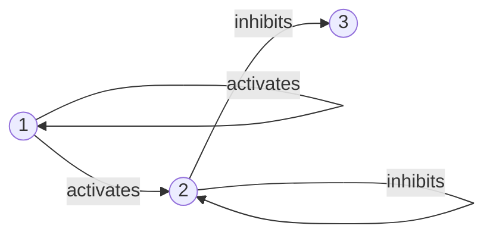
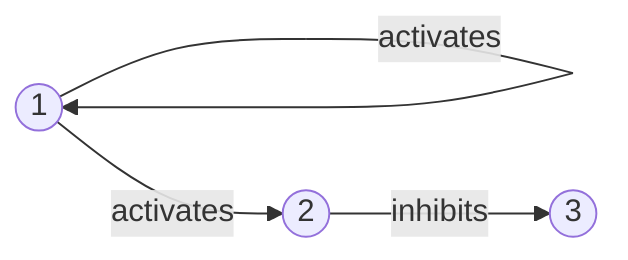
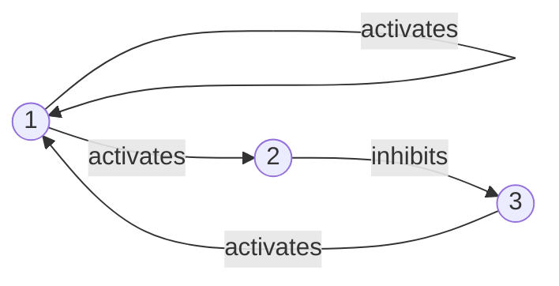

```
# Using Rules of Thumb for Repairing Inconsistent Answer Set Programs

Elie Merhej<sup>1</sup>, Steven Schockaert<sup>2</sup>, and Martine De Cock<sup>1,3</sup>

<sup>1</sup> Ghent University, Ghent, Belgium  
elie.merhej@ugent.be

<sup>2</sup> Cardiff University, Cardiff, UK  
schockaerts1@cardiff.ac.uk

<sup>3</sup> University of Washington Tacoma, Tacoma, USA  
martine.decock@ugent.be, mdecock@u.washington.edu

> © Springer International Publishing Switzerland 2015  
> C. Beierle and A. Dekhtyar (Eds.): SUM 2015, LNAI 9310, pp. 368–381, 2015.  
> DOI: 10.1007/978-3-319-23540-0_25

## Abstract

Answer set programming is a form of declarative programming that can be used to elegantly model various systems. When the available knowledge about these systems is imperfect, however, the resulting programs can be inconsistent. In such cases, it is of interest to find plausible repairs, i.e. plausible modifications to the original program that ensure the existence of at least one answer set. Although several approaches to this end have already been proposed, most of them merely find a repair which is in some sense minimal. In many applications, however, expert knowledge is available which could allow us to identify better repairs. In this paper, we analyze the potential of using expert knowledge in this way, by focusing on a specific case study: gene regulatory networks. We show how we can identify the repairs that best agree with insights about such networks that have been reported in the literature, and experimentally compare this strategy against the baseline strategy of identifying minimal repairs.

## 1 Introduction

Answer Set Programming (ASP) is a form of declarative programming mainly oriented towards NP-hard problems [19]. It enables a form of non-monotonic reasoning by virtue of a negation-as-failure operator with a purely declarative semantics [12]. An ASP program is a set of rules that describes a problem [19]. This set of rules is fed to answer set solvers that find stable models (i.e. answer sets) of the program at hand. These answer sets then directly correspond to the solutions of the considered problem. Alternatively, answer set programs are sometimes also used to simulate systems (e.g. for solving planning problems [17,18]), in which case answer sets typically correspond to sequences of states.

We are interested in the case where ASP programs have no answer sets. We call these programs inconsistent, and we look for ways to restore their consistency. For example, in a search problem, having no answer sets could mean that the problem is over-constrained, and we may want to look at ways to relax the problem. In applications where ASP programs simulate a system, inconsistencies could mean that the rules describing the system being simulated are not in agreement with available observations. We may want to find a way to adapt the description of the system, which amounts to a form of belief revision for answer set programs [7]. In this paper, we will focus on the latter type of ASP programs.

While different methods exist for repairing ASP programs, most of them are based on finding some sort of minimal repair, e.g. adding or removing the smallest number of facts to ensure that the program has at least one answer set [1,2,10]. While this is a reasonable principle in the absence of any further information, in real-world applications, we often have access to some kind of expert knowledge about the system being modelled that can be exploited to identify the most plausible repair (which may not necessarily be minimal).

To demonstrate this idea, let us consider the following biological setup: in Fig. 1, we have a table containing time-series observed data about which of three genes were active at different time points, and a draft of a Gene Regulatory Network (GRN) which might not be correct. A GRN is a directed graph that represents the way a group of genes affect one another. GRNs can be modeled in different ways [4,6,13], with one popular model being boolean networks [24]. Treating a GRN as a boolean network implies that an edge from gene A to gene B can either represent a positive regulation, which means that A activates B, or a negative regulation, which means that A inhibits B. If A is active at a specific time step, and A activates B, B becomes active in the next time step. Similarly, if A is active and A inhibits B, B becomes inactive in the next time step. More details about activation rules are provided in Sect. 3. The GRN graph might have missing edges and/or erroneous edges due to the complexity of network generation methods [8,20], and as a result it might be inconsistent with the observed experimental data in the table. The task at hand is to repair the network to make it consistent with the table. A common method of repair would be to find the smallest number of modifications to the graph that makes it consistent with the table. Based on the GRN and table in Fig. 1, since gene 2 stays active from $t = 1$ to $t = 2$, a minimal repair would be to remove the edge $2 \dashv 2$. The repaired network is shown in Fig. 2(a).

However, there is a known property about GRNs that states that the diameter (i.e. the length of the longest of the shortest paths between two nodes in the graph) of a GRN tends to be very small. Considering this information leads to another repair, which is shown in Fig. 2(b). Notice that this repair is not minimal (we removed the edge $2 \dashv 2$ and added the edge $3 \rightarrow 1$), but the diameter of this new graph (diameter = 1) is smaller than the one in the previous repair (diameter = 2). We have thus generated a repair, which could be more plausible than the minimal repair.

The aim of this paper is to assess the viability of using informal, expert-provided rules of thumb for repairing inconsistent ASP programs, focusing on the specific use case of GRNs. In particular, we show how expert knowledge about GRNs found in the biological literature can be formalized in ASP and we experimentally compare the quality of the resulting repairs against baseline methods. Note that while we only consider GRNs in our experiments, the proposed method is entirely generic, being applicable to any setting where expert knowledge can be formalized in ASP.

This paper is structured as follows. First, in Sect. 2 we provide some background on answer set programming. In Sect. 3, we describe the considered use case of gene regulatory networks, summarizing in particular the available expert knowledge from the biological literature. Section 4 then shows how this expert knowledge can be encoded in ASP and how these encodings can be used to identify plausible repairs. Subsequently, in Sect. 5, we discuss our experimental results where we apply our approach on five known gene regulatory networks. Finally, we conclude in Sect. 6.

### Figure 1

**Fig. 1.** A time-series table which is inconsistent with a given GRN. Edges with pointed endpoints denote activations. Edges with flat endpoints denote inhibitions. The edge $2 \dashv 2$ causes the inconsistency.

**Time-series table**

| T   | gene1 | gene2 | gene3 |
|-----|-------|-------|-------|
| t=0 | +     | -     | -     |
| t=1 | -     | +     | -     |
| t=2 | -     | +     | +     |

**GRN in Fig. 1 (text reconstruction)**



### Figure 2

**Fig. 2.** Two possible repairs for the GRN from Fig. 1. (a) A minimal repair (diameter = 2). (b) A repair that minimizes the diameter of the graph (diameter = 1).

**(a) Minimal repair**



**(b) Repair minimizing the diameter**



## 2 Answer Set Programming

Answer Set Programming (ASP) is a declarative problem solving language [12,19], which requires users to describe a problem as a set of rules. ASP solvers can then find the answer sets (see below), which correspond to the solutions of the encoded problem. An ASP rule has the form

$$
h \leftarrow a_1,\ldots,a_j,\ \text{not } b_{j+1},\ldots,\text{not } b_k.
\tag{1}
$$

where $h$, $a_1,\ldots,a_j$ and $b_{j+1},\ldots,b_k$ are called atoms. Let $r$ be an ASP rule of form (1). $\operatorname{head}(r) = h$ is the head of $r$ and $\operatorname{body}(r) = \{a_1,\ldots,a_j,\text{ not } b_{j+1},\ldots,\text{ not } b_k\}$ is the body of $r$. Let $\operatorname{body}^+(r) = \{a_1,\ldots,a_j\}$ and $\operatorname{body}^-(r) = \{b_{j+1},\ldots,b_k\}$. The “,” in $\operatorname{body}(r)$ represents a conjunction. If $\operatorname{body}(r)=\emptyset$, then $r$ is called a fact. For convenience, often the symbol $\leftarrow$ is omitted when writing facts in ASP. If $\operatorname{head}(r)=\emptyset$, then $r$ is called a constraint. Constraints act as filters on the possible answer sets. Indeed, answer set programs will follow a generate-and-test methodology, in which a set of rules is used to generate candidate solutions and constraints are then used to filter these candidates. The keyword `not` represents negation-as-failure in ASP, where `not a` intuitively holds whenever we cannot derive that $a$ holds. An answer set program $\Pi$ is a set of ASP rules of the form $r$. A set of atoms $X$ is closed under $\Pi$ if for any rule $r \in \Pi$, $\operatorname{head}(r) \in X$ whenever $\operatorname{body}^+(r) \subseteq X$. The smallest set of atoms closed under $\Pi$ is denoted by $Cn(\Pi)$. The reduct $\Pi^X$ of $\Pi$ relative to $X$ is defined by

$$
\Pi^X = \{\operatorname{head}(r) \leftarrow \operatorname{body}^+(r) \mid r \in \Pi \text{ and } \operatorname{body}^-(r) \cap X = \emptyset \}.
$$

A set $X$ of atoms is called an answer set (i.e. stable model) of $\Pi$ if $Cn(\Pi^X) = X$. For example, let $\Pi$ be the answer set program formed by the rule `c ← not b` and the fact `a`. This program has one answer set $\{a,c\}$.

In practice, it is often easier to encode ASP programs using first-order rules like `R(X1, X2, X3) ← Q(X1, X2), not S(X3)`. Such rules should be seen as a compact representation of a set of ASP rules, called the groundings of the first-order rule, which are obtained by considering all possible instantiations of the variables by constants appearing in the program. There are ASP grounders (e.g. `gringo`) that combine a set of constant (ground) facts and ungrounded rules to give us an equivalent ground program. These programs are then solved using an ASP solver (e.g. `clasp`) to give us answer sets that correspond to solutions of our problem.

## 3 Case Study: Biological Networks

Biological networks are an established application of ASP [9,11]. Such networks offer a good opportunity for assessing how expert knowledge can help with repairing inconsistencies, as several rules of thumb that could be derived about such networks have been described in the biological literature. In this section, we briefly recall what Gene Regulatory Networks are, and present a setup where inconsistencies arise. We also provide a summary of the relevant properties found in the literature that we can formulate into rules of thumb.

A Gene Regulatory Network (GRN) is a network that represents the interactions between a group of cell genes. The nodes of the network are the genes, whereas the edges of the network encode the interactions between the genes. There are two types of possible interactions between a pair of genes: a gene either activates another gene, or inhibits another gene. This means that if gene A activates gene B, and A is active at time step $t$, then B becomes active at time step $t+1$. Likewise, if gene A inhibits gene B, and A is active at time step $t$, then B becomes inactive at time step $t+1$. In the case where a gene is activated and inhibited simultaneously, different activation rules may be applied to determine its subsequent state [23]. Different kinds of experimental observations can be used to automatically construct GRNs [8,20].

Our setup consists of the following. We have an automatically generated GRN describing a cell cycle. Since it has been automatically constructed, it is likely to be imperfect, in the sense that we may obtain observations that are inconsistent with the behaviour predicted by the network, which would mean that it needs to be revised. We also have a time-series table that lists the state of the corresponding genes in this GRN at consecutive time steps. At every time step, a given gene can either be active or inactive. The table we have at our disposal corresponds to data that has been experimentally observed, but was not available during the GRN generation process. Our problem then comes down to checking whether the GRN is inconsistent with the data from the time-series table, i.e. whether it fails to correctly predict how the states of the genes evolve, and in that case, repair it.

Several methods have been developed that use ASP to repair inconsistencies found in GRNs [10,11,22]. These methods often consist of finding some kind of minimal repair. However, expert knowledge about GRNs can be used to derive rules of thumb that help in finding more plausible repairs, which are not necessarily minimal. In [16], it is stated that every gene network converges to a final stable state (Property 1). This allows us to create an extra check to find whether the GRN we are trying to repair converges to a stable state that indeed corresponds to the final time step in the table. In [13], Kauffman found that a genetic network will behave chaotically unless there is a restriction on the number of regulatory inputs and outputs per node (Property 2). This can be encoded as a rule of thumb where the number of input and output edges of every node should be limited. Another rule of thumb can be derived from the fact that various biological properties in a gene network depend on the number of non-zero interactions between the nodes of this network, as is discussed in [14] (Property 3). This allows us to derive that similar gene networks would more likely have a similar number of total interactions. Also in [14], it is observed that nodes tend to be positively regulated by nodes that are active at earlier states of a cell cycle and negatively regulated by nodes that are active later in the process (Property 4). In [5], it is stated that the diameter (i.e. the length of the shortest path between the two nodes that are furthest apart in the network) of GRN graphs tend to be very small (Property 5). In [15], the idea of dominant motifs (i.e. sub-graphs) is discussed, where these motifs tend to occur frequently in multiple kinds of GRNs. This allows us to formulate a rule of thumb that similar networks are likely to share the same dominant motifs (Property 6). Finally, [27] states that the size of the basin of attractors (i.e. the stable states to which most initial states of the network converge to) in a GRN is a vital quantity in terms of understanding network behaviour and may relate to other network properties such as stability (Property 7). This allows us to check whether the state of the repaired network with the largest basin size corresponds indeed to the final stable state in the time-series table.

## 4 Repairing ASP Programs Using Rules of Thumb

In this section, we show how inconsistent ASP programs can be repaired. In Sect. 4.1, we encode the facts of our program, which correspond in our case to a GRN and a table with observed data, and show the rule that checks our program’s consistency. We then recall in Sect. 4.2 how a minimal repair of an inconsistent ASP program can be found, using the meta-programming technique proposed in [10]. Finally, in Sect. 4.3 we improve the baseline method from Sect. 4.2 by taking into account rules of thumb. We illustrate the main idea by focusing on the biological properties of GRNs that we discussed in the previous section.

### 4.1 Encoding GRNs in ASP

In this section, we recall how a GRN and corresponding time-series table can be encoded in ASP, as presented in [9,11,22,23]. This includes the observed time-series table data, as well as the GRN graph that might be inconsistent with the table. For every gene $i$, we introduce the fact `gene(i)`. For every edge from gene $i$ to gene $j$, we introduce the fact `activates(i, j)` if $i$ activates $j$, or `inhibits(i, j)` if $i$ inhibits $j`. As for the time-series table, we include facts of the form `active(i, t)` and `inactive(i, t)` which indicate that gene $i$ is active at time $t$ and that gene $i$ is inactive at time $t$ respectively. We also represent every time step with the fact `time(i)` with $0 \leq i \leq t_{final}$, with $t_{final}$ representing the final time step that the gene regulatory network converge to.

Then, to check for consistency between the graph and the table, three things need to be done. First, we write activation and inhibition rules for the graph that determine whether a gene is activated or inhibited (or neither) at each time step. We use the following activation rule: if a gene is positively regulated by at least one other gene, and it is not negatively regulated by any other gene, then it is activated. A similar rule is used to determine when a gene is inhibited. This is shown in (2). Second, we determine the state for every gene at every time step based on its state given by the table, and on the activation and inhibition rules from the graph. This is shown in (3). Third, we check if the states of the genes generated by the activation and inhibition rules of the graph correspond with the states of the genes in the time-series table, shown in (4),

**(2)**
```text
receivesAct(Y,T) ← activates(X, Y), active(X, T).
receivesInh(Y,T) ← inhibits(X, Y), active(X, T).
activated(Y,T) ← receivesAct(Y,T − 1), not receivesInh(Y,T − 1).
inhibited(Y,T) ← receivesInh(Y,T − 1), not receivesAct(Y,T − 1).
← activated(Y,T), inhibited(Y,T).
```

**(3)**
```text
inactive(Y,T) ← active(Y,T − 1), inhibited(Y,T).
active(Y,T) ← active(Y,T − 1), not inhibited(Y,T).
active(Y,T) ← inactive(Y,T − 1), activated(Y,T).
inactive(Y,T) ← inactive(Y,T − 1), not activated(Y,T).
```

**(4)**
```text
← active(Y,T), inactive(Y,T).
```

resulting in an inconsistent program if and only if the data from the graph and the time-series table do not correspond to one another.

### 4.2 Minimal Repair

The repair operations consist of either adding or removing an edge between two genes. Thus, we generate four possible repair choices for every pair of nodes: add a new activation edge, add a new inhibition edge, remove an existing edge or do nothing. This introduces the facts `addActEdge(U, V)`, `addInhEdge(U, V)` and `removeEdge(U, V, S)` respectively. Then, to take the generated repair into account, we create the facts `activates(i, j)` and `inhibits(i, j)` using the following

**(5)**
```text
activates(U, V) ← edge(U, V, 1), not removeEdge(U, V, 1).
activates(U, V) ← addActEdge(U, V).
inhibits(U, V) ← edge(U, V, −1), not removeEdge(U, V, −1).
inhibits(U, V) ← addInhEdge(U, V).
```

The ASP program constructed so far has one answer set for each possible repair of the original GRN that will make it consistent with the table. To consider minimal repairs only, we first define the cost of a repair, using the following rules

**(6)**
```text
addEdge(U, V, 1) ← addActEdge(U, V).
addEdge(U, V, −1) ← addInhEdge(U, V).
costAdding(X) ← X = #count{addEdge(U, V, S)}.
costRemoving(Y) ← Y = #count{removeEdge(U, V, S)}.
repairCost(Z) ← costAdding(X), costRemoving(Y), Z = X + Y.
#minimize[repairCost(Z) = Z].
```

These rules contain aggregates and conditions supported by the ASP solver `clasp`. Aggregates behave like built-in functions in the ASP solver. For example, in (6), the aggregate `#count` intuitively counts the number of instances of the literals `addEdge` and `removeEdge`, and stores the results in variables $X$ and $Y$ respectively. Whereas the aggregate `#minimize` adds an optimization value that minimizes the number held by the variable $Z$ in the literal `repairCost(Z)`. This intuitively minimizes the cost of the repair. In addition, the 5th rule in (6) contains the condition $Z = X + Y$. This condition can be added to the body of a rule, and has to be satisfied for the rule to be satisfied.

### 4.3 Using Rules of Thumb for Identifying Plausible Repairs

While the idea of finding a minimal repair, as explained for GRNs in Sect. 4.2, is defensible in cases where we have no further information, it is far from optimal. First, there is no reason why the correct repair has to be minimal; as we will see in Sect. 5, in the case of GRNs the correct repair is actually rarely minimal. Second, there can be exponentially many minimal repairs, and without further knowledge we would have to select one arbitrarily. We assume that in most real-world applications, however, we have access to some kind of background knowledge that could help us identify plausible repairs. Such background knowledge usually comes in the form of rules of thumb. In this section, we will consider the seven principles about GRNs that we found in the literature (see Sect. 3). We will briefly explain how each of these principles can be encoded as some kind of soft constraint in ASP. These soft constraints will introduce penalty weights if they are not satisfied by correct repairs. These individual penalties are then added up and included in the repair cost that already contains the cost of adding and removing an edge. The repair that makes the graph consistent with the time-series table and has the lowest overall cost will be selected as the best repair. Note that we cannot realistically expect any training data to be available to learn weights (e.g. reflecting the importance of each principle), making our approach quite different from e.g. approaches for repairing using soft constraints in Markov logic [21,25]. Therefore, we instead set the weights in a uniform manner, i.e. they are chosen such that each principle roughly has the same impact on the choice of repair. In other words, our approach is only based on a direct encoding of available expert knowledge. The effectiveness of such a strategy will be experimentally analyzed in Sect. 5.

#### Property 1: Last Time Step as Fixed State

We create a new time step $(t_{final}+1)$ in the table with the state of the genes identical to their states at $(t_{final})$. Then, we perform a similar consistency check as we did in rules (2)–(4). If the repair is still correct, i.e. if the graph is still consistent with the table after the addition of the time step $(t_{final}+1)$, then the time step $(t_{final})$ is indeed a fixed state, and no cost is added to the repair. Otherwise, we increase the cost of the repair by a constant value equal to the total number of initial edges in the network. Since we are repairing by adding and removing edges, we choose the maximum penalty for every property to be equal to the total number of initial edges in the network.

#### Property 2: Degree of a Gene

We need to find the degree of a gene, given by $k = k_{in} + k_{out}$ with $k_{in}$ being the number of incoming edges and $k_{out}$ the number of outgoing edges of the gene. We then need to make sure that these degrees fall within a certain range. We explain how we obtain this range in Sect. 5. We then call `kBadGenes` the number of genes that have a $k$ degree that falls outside the range limits. The penalty from this property is then multiplied by the ratio of initial edges per gene for every “bad gene” found. This makes sure that the maximum penalty is equal to the total number of initial edges in the network (if all the genes of the network are “bad genes”, the maximum penalty is
$\operatorname{penalty}_{max} = (\operatorname{genes}_{total}) \times (\operatorname{edges}_{initial}/\operatorname{genes}_{total}) = \operatorname{edges}_{initial}$). This property is added using the following rules:

**(7)**
```text
edgeAfterRepair(U, V) ← activates(U, V).
edgeAfterRepair(U, V) ← inhibits(U, V).
kOut(C, X) ← X = #count{edgeAfterRepair(C, D)}, gene(C).
kIn(C, X) ← X = #count{edgeAfterRepair(D, C)}, gene(C).
kDegree(C, Z) ← kIn(C, X), kOut(C, Y), Z = X + Y.
kBadGene(C) ← kDegree(C, Z), Z < kmin.
kBadGene(C) ← kDegree(C, Z), Z > kmax.
kBadGenes(X) ← X = #count{kBadGene(C)}.
```

#### Property 3: Total Number of Edges

To encode this property, we count the total number of interactions between the genes and check whether this number falls within a certain range limit (see Sect. 5). If the number is outside the range we set, a penalty equal to the total number of initial edges is added to the repair cost. Otherwise, the penalty is zero.

#### Property 4: Likely Interactions Based on Gene State

For this property, we divide the genes into likely activators and likely inhibitors based on whether they are active during the first half or the second half of the cycle respectively. The same gene can be both a likely activator and a likely inhibitor. We then check the outgoing edges of every gene, and increase the cost of the repair every time a likely activator (that is not also a likely inhibitor) inhibits another gene, or a likely inhibitor (that is not also a likely activator) activates another gene. The penalty is increased by 1 for every “bad” edge found, with the maximum penalty being the total number of initial edges in the network. We encode this property using the following rules:

**(8)**
```text
likelyAct(C) ← active(C, T), T <= thalf.
likelyInh(C) ← active(C, T), T > thalf.
badEdge(C, D) ← likelyAct(C), inhibits(C, D), not likelyInh(C), C != D.
badEdge(C, D) ← likelyInh(C), activates(C, D), not likelyAct(C), C != D.
badEdges(X) ← X = #count{badEdge(C, D)}.
```

#### Property 5: Network Diameter

To encode this property, we first need to make sure that every gene of the network is reachable, using the following rules:

**(9)**
```text
link(X, Y) ← edgeAfterRepair(X, Y), X != Y.
link(Y, X) ← edgeAfterRepair(X, Y), Y != X.
reachable(X) ← link(1, X).
reachable(Y) ← reachable(X), link(X, Y).
← gene(X), not reachable(X).
```

Then, we find the shortest distance between every pair of genes by finding all the possible paths between them, and minimizing the number of path links. The greatest value of these shortest distances is the diameter of the network.

**(10)**
```text
dist(X, Y, 1) ← link(X, Y), X != Y.
dist(X, Y, 2) ← link(X, A), link(A, Y), X != Y.
dist(X, Y, 3) ← link(X, A), link(A, B), link(B, Y), X != Y.
...
smallestDist(X, Y, D) ← D = #min[dist(X, Y, C) = C], dist(X, Y, Z).
diameter(D) ← D = #max[smallestDist(X, Y, C) = C].
```

The penalty cost that is added depends on the diameter that was found. Again, if the diameter falls within a certain range limit (see Sect. 5), no penalty is added to the repair cost. Otherwise, the cost is increased by a penalty equal to the total number of initial edges in the network.

#### Property 6: Dominant Motifs

A motif is a small pattern with usually 3 or 4 nodes that is found repeatedly in a network graph. It does not matter which genes these nodes correspond to, or the type of the edges between the nodes. For this property, we use an external program described in [26] to find the dominant motifs of popular GRNs in the literature. The GRN that we are repairing is not used during this step. We then encode these motifs in our program and try to maximize the number of their instances in the repaired network. For every instance of dominant motif that we find in the repaired network, we decrease the penalty of this property by 1, starting with the maximum penalty equal to the total number of initial edges in the network (the minimum penalty is zero).

#### Property 7: Size of Basin of Attractors

To use this property, we need to find the final state of every possible initial state of a network. To do this, we use a standalone program described in [3]. We then need to make sure that the most popular final state of the network given by the output of this program corresponds indeed to its state at the final time step $(t_{final})$ given by the time-series table. To apply this property, we adapt the answer sets of our program in the following way. For each repaired network (i.e. for each answer set), we add a penalty equal to the total number of initial edges in the network if its most popular final state does not correspond to the state at the final time step $(t_{final})$ given by the table. Otherwise, we do not add any penalty.

## 5 Experimental Results

To test our approach, we use the following 5 GRNs: Budding Yeast, Fission Yeast, *C. Elegans*, *Arabidopsis* and Mammalian Cell Cycle. We corrupt each of these GRNs by adding and removing edges, and then try to repair them. Every time we corrupt a network, we remove $R$ randomly chosen edges, and subsequently add $N$ randomly chosen edges (choosing between activation and inhibition edges with equal probability). We set $N$ and $R$ as percentages of the initial number of edges for each network that we are corrupting. For our experiments, we consider 7 corruption setups by varying the percentages $N$ and $R$ in the following way:

$N = 20\%/R = 80\%$, $N = 30\%/R = 70\%$, $N = 40\%/R = 60\%$, $N = 50\%/R = 50\%$, $N = 60\%/R = 40\%$, $N = 70\%/R = 30\%$ and $N = 80\%/R = 20\%$.

Every time we select a network to corrupt and repair, we learn the relevant parameters of the rules of thumb from the other four, uncorrupted networks. For Property 2, we learn the degrees $k_{min}$ and $k_{max}$ from the other four networks by setting $k_{min}$ as the smallest degree value of the other four networks and $k_{max}$ as the largest degree value. The range $[\operatorname{diameter}_{min}, \operatorname{diameter}_{max}]$ in Property 5 is learned similarly, where $\operatorname{diameter}_{min}$ is the smallest diameter value of the other four networks, and $\operatorname{diameter}_{max}$ is the largest diameter value. For Property 3, the range of the total number of edges is calculated as follows. We learn from the other four networks the ratio of number of edges per node, and we keep the minimum ($\operatorname{ratio}_{min}$) and maximum ($\operatorname{ratio}_{max}$) values that we find. Then, we determine what the expected number of edges should be for the test network by multiplying these two ratios with the number of nodes in the test network.

To evaluate our results, we use the F1 score and Jaccard index which we calculate as follows. Let $A$ be the set of edges of the repaired network and $B$ the set of edges of the original network. We write $|A|$ and $|B|$ for the number of edges of the repaired and original network respectively. The F1 score is given by

$$
F1 = \frac{2 \times (\text{precision} \times \text{recall})}{\text{precision} + \text{recall}},
$$

with

$$
\text{precision} = \frac{|A \cap B|}{|B|}
$$

and

$$
\text{recall} = \frac{|A \cap B|}{|A|}.
$$

The Jaccard index is given by

$$
J(A, B) = \frac{|A \cap B|}{|A \cup B|}.
$$

We run every experiment (i.e. every corruption setup on every network) 10 times and report the average F1 score and Jaccard Index of the best repair that was found. In the case where multiple repairs with the same minimum cost were found, we select the first repair that we get from the solver as best repair. We have used the grounder `gringo` and the solver `clasp` to run our experiments.

The results of our experiments are shown in Fig. 3. Each graph corresponds to a different GRN. The dashed lines represent the average F1 score and Jaccard index of the best repair without the addition of rules of thumb (i.e. best minimal repair), and the solid lines represent the same values after the addition of rules of thumb. We notice a consistent improvement in both metrics with the addition of rules of thumb. Instead of only minimizing the number of applied repair operations, the addition of rules of thumb also focuses on preserving the biggest number of properties that were found in similar GRNs. This allows the repairing process to avoid many mistakes. For example, while a minimal repair can have a node detached from the rest of the graph, a more plausible repair that keeps all the nodes of a GRN connected can be achieved by simply following a rule that describes this property.

### Figure 3

**Fig. 3.** Average F1 score and Jaccard index for 7 corruption setups of 5 GRNs, with and without the addition of Rules of Thumb (RoTh).

**Detailed description:**  
The figure contains five subplots:

- **(a) Budding Yeast network**
- **(b) Fission Yeast network**
- **(c) C. Elegans network**
- **(d) Arabidopsis network**
- **(e) Mammalian Cell Cycle network**

Each subplot has:
- **X-axis:** `Corruption setup`, with setups corresponding to increasing values from 1 to 7.
- **Y-axis:** `F1 score / Jaccard index`, scaled approximately from 0 to 0.8.
- **Legend:** four curves:
  - `F1 score without RoTh`
  - `F1 score with RoTh`
  - `Jaccard index without RoTh`
  - `Jaccard index with RoTh`

**Visible trends across the five subplots:**
- In all five networks, the curves **with RoTh** lie above the corresponding curves **without RoTh**, indicating better repair quality when rules of thumb are used.
- In most cases, both the F1 score and Jaccard index tend to **increase as the corruption setup index increases**.
- The **F1 score** is consistently higher than the **Jaccard index** within the same condition.
- The **largest improvements** appear visually in the Budding Yeast, Fission Yeast, and Mammalian Cell Cycle networks, while improvements are also present in *C. Elegans* and *Arabidopsis*.
- The *C. Elegans* subplot shows a noticeable dip around the middle corruption setups before rising again, but the RoTh-based curves still remain above the corresponding non-RoTh curves.
- The *Arabidopsis* subplot shows more moderate absolute values, but again the RoTh-based curves remain consistently higher.

## 6 Conclusion and Discussion

In this paper, we have explored how expert knowledge, in the form of rules of thumb, can be used to find better ways of repairing an inconsistent ASP program. As a case study, we have focused our experiments on a biological setup where a GRN and a time-series table are in conflict with each other. Our experiments have shown that our method of repairing by using rules of thumb leads to a better performance in terms of F1 score and Jaccard measure. This leads to more plausible repairs than when simply selecting the minimal one, with only very limited access to training data.

The idea of adding soft constraints to prefer a model over another is not new. Many applications of Markov logic strongly utilize this concept [21,25]. However, combining the idea of rules of thumb with the ease by which ASP can model systems provides a framework that elegantly takes advantage of both soft and hard constraints. Compared to Markov logic, ASP offers us more flexibility in the term of what we optimize, e.g. we are not restricted to minimizing the sum of penalties, although that is how we used the rules of thumb in this paper. In the future, it would be interesting to do an experimental comparison between our ASP approach and its Markov logic counterpart.

## References

1. Arenas, M., Bertossi, L., Chomicki, J.: Answer sets for consistent query answering in inconsistent databases. *Theory Pract. Logic Program.* **3**, 393–424 (2003)

2. Arieli, O., Denecker, M., Van Nuffelen, B., Bruynooghe, M.: Database repair by signed formulae. In: Seipel, D., Turull-Torres, J.M. (eds.) *FoIKS 2004*. LNCS, vol. 2942, pp. 14–30. Springer, Heidelberg (2004)

3. Berntenis, N., Ebeling, M.: Detection of attractors of large boolean networks via exhaustive enumeration of appropriate subspaces of the state space. *BMC Bioinform.* **14**(1), 361 (2013)

4. Chen, T., Filkov, V., Skiena, S.S.: Identifying gene regulatory networks from experimental data. *Parallel Comput.* **27**(1), 141–162 (2001)

5. Cohen, R., Havlin, S.: Scale-free networks are ultrasmall. *Phys. Rev. Lett.* **90**(5), 058701 (2003)

6. De Jong, H.: Modeling and simulation of genetic regulatory systems: a literature review. *J. Comput. Biol.* **9**(1), 67–103 (2002)

7. Delgrande, J.P., Schaub, T.: A consistency-based approach for belief change. *Artif. Intell.* **151**(1), 1–41 (2003)

8. Ellis, J.J., Kobe, B.: Predicting protein kinase specificity: predikin update and performance in the DREAM4 challenge. *PLoS One* **6**(7), e21169 (2011)

9. Fayruzov, T., Janssen, J., Vermeir, D., Cornelis, C.: Modelling gene and protein regulatory networks with answer set programming. *Int. J. Data Mining Bioinform.* **5**(2), 209–229 (2011)

10. Gebser, M., Guziolowski, C., Ivanchev, M., Schaub, T., Siegel, A., Thiele, S., Veber, P.: Repair and prediction (under inconsistency) in large biological networks with answer set programming. In: *KR* (2010)

11. Gebser, M., König, A., Schaub, T., Thiele, S., Veber, P.: The BioASP library: ASP solutions for systems biology. In: *ICTAI (1)*, pp. 383–389 (2010)

12. Gelfond, M., Lifschitz, V.: The stable model semantics for logic programming. In: *ICLP/SLP*, vol. 88, pp. 1070–1080 (1988)

13. Kauffman, S.A.: *The Origins of Order: Self-organization and Selection in Evolution*. Oxford University Press, Oxford (1993)

14. Lau, K.Y., Ganguli, S., Tang, C.: Function constrains network architecture and dynamics: a case study on the yeast cell cycle boolean network. *Phys. Rev. E* **75**(5), 051907 (2007)

15. Lee, T.I., Rinaldi, N.J., Robert, F., Odom, D.T., Bar-Joseph, Z., Gerber, G.K., Hannett, N.M., Harbison, C.T., Thompson, C.M., Simon, I., et al.: Transcriptional regulatory networks in *saccharomyces cerevisiae*. *Science* **298**(5594), 799–804 (2002)

16. Li, F., Long, T., Lu, Y., Ouyang, Q., Tang, C.: The yeast cell-cycle network is robustly designed. *Proc. Natl. Acad. Sci. U.S.A.* **101**(14), 4781–4786 (2004)

17. Lifschitz, V.: Action languages, answer sets, and planning. In: Apt, K.R., et al. (eds.) *The Logic Programming Paradigm*, pp. 357–373. Springer, Heidelberg (1999)

18. Lifschitz, V.: Answer set programming and plan generation. *Artif. Intell.* **138**(1), 39–54 (2002)

19. Lifschitz, V.: What is answer set programming? In: *AAAI*, vol. 8, pp. 1594–1597 (2008)

20. Menéndez, P., Kourmpetis, Y.A., ter Braak, C.J., van Eeuwijk, F.A.: Gene regulatory networks from multifactorial perturbations using graphical lasso: application to the DREAM4 challenge. *PloS One* **5**(12), e14147 (2010)

21. Merhej, E., Schockaert, S., De Cock, M., Blondeel, M., Alfarone, D., Davis, J.: Repairing inconsistent taxonomies using map inference and rules of thumb. In: *Proceedings of the 5th International Workshop on Web-scale Knowledge Representation Retrieval & Reasoning*, pp. 31–36. ACM (2014)

22. Mobilia, N., Rocca, A., Chorlton, S., Fanchon, E., Trilling, L.: Logical modeling and analysis of regulatory genetic networks in a non monotonic framework. In: Ortuño, F., Rojas, I. (eds.) *IWBBIO 2015, Part I*. LNCS, vol. 9043, pp. 599–612. Springer, Heidelberg (2015)

23. Mushthofa, M., Torres, G., Van de Peer, Y., Marchal, K., De Cock, M.: ASP-G: an ASP-based method for finding attractors in genetic regulatory networks. *Bioinformatics* **30**(21), 3086–3092 (2014)

24. Shmulevich, I., Dougherty, E.R., Zhang, W.: From boolean to probabilistic boolean networks as models of genetic regulatory networks. *Proc. IEEE* **90**(11), 1778–1792 (2002)

25. Singla, P., Kautz, H., Luo, J., Gallagher, A.: Discovery of social relationships in consumer photo collections using markov logic. In: *IEEE Computer Society Conference on Computer Vision and Pattern Recognition Workshops, CVPRW 2008*, pp. 1–7. IEEE (2008)

26. Wernicke, S., Rasche, F.: Fanmod: a tool for fast network motif detection. *Bioinformatics* **22**(9), 1152–1153 (2006)

27. Yang, L., Meng, Y., Bao, C., Liu, W., Ma, C., Li, A., Xuan, Z., Shan, G., Jia, Y.: Robustness and backbone motif of a cancer network regulated by miR-17-92 cluster during the G1/S transition. *PloS One* **8**(3), e57009 (2013)

```

```
OCR source was reasonably good but contained several obvious character recognition issues that were corrected in the transcription:

- Page 1:
  - “program￾ming” corrected to “programming”.
  - “sev￾eral”, “modifi￾cations”, “inconsis￾tencies” etc. were normalized where line-break OCR inserted artifacts.
  - “Cardi! University, Cardi!, UK” corrected to “Cardiff University, Cardiff, UK”.
  - Copyright line “!c Springer” corrected to “© Springer”.
- Pages 2–3:
  - OCR used “a!ect”, “di!erent”, “min￾imal” etc.; corrected to “affect”, “different”, “minimal”.
  - The inhibitory symbol in text was inconsistently rendered as “!” in parsed text; transcribed as $\dashv$ in explanatory prose where clearly intended from figure caption/context.
- Page 4:
  - Set notation and body/head expressions were OCR’d fairly well; normalized formatting in LaTeX.
- Page 5:
  - “Kau!man” corrected to “Kauffman”.
  - “sim￾ilar” corrected to “similar”.
- Pages 6–10:
  - ASP code was transcribed from OCR text, but exact typography may differ slightly from original PDF, especially for minus signs, spacing, and aggregate syntax.
  - In page 6 the sentence “with $t_{final}$ representing the final time step that the gene regulatory network converge to” may be grammatically odd in the source; retained meaning with minimal correction only.
  - In Property 4 and 5 code, OCR rendered `!=` with spaces (`! =`); normalized to `!=`.
  - In rule (10), the ellipsis `...` is present in the paper and indicates omitted analogous distance rules; retained as-is.
- Figures:
  - Figure 1 and Figure 2 were reconstructed as Mermaid diagrams from visible image content and textual caption/context. These are interpretive reconstructions rather than exact graphical replicas.
  - Figure 3 is a multi-panel line chart. Exact numeric values of the plotted points were not readable from the provided OCR/text; therefore it was described in detailed natural language rather than transcribed numerically.
- References:
  - Diacritics and typography were normalized where OCR was noisy:
    - “K¨onig” rendered as “König”.
    - “Men´endez” rendered as “Menéndez”.
    - “Ortu˜no” rendered as “Ortuño”.
  - Journal title capitalization and italics standardized in Markdown.
  - “PloS One” preserved where OCR/source showed that capitalization, though some style guides use “PLoS One”.

Uncertainties / limitations:
- I did not have access to the full vector PDF text layer, only the parsed text and a few page images, so exact small-caps, italics, and equation typography may differ from the original.
- Figure 1 and Figure 2 network edge types were inferred from the image/caption. They should be correct, but arrow styling in Mermaid cannot exactly reproduce pointed vs flat endpoints.
- Figure 3 point-by-point values are not recoverable from the supplied material; only qualitative description was possible.
- The DOI in the source footer appeared as `10.1007/978-3-319-23540-0 25` in OCR; normalized to `10.1007/978-3-319-23540-0_25`, which is the standard Springer chapter DOI form and matches context.
```