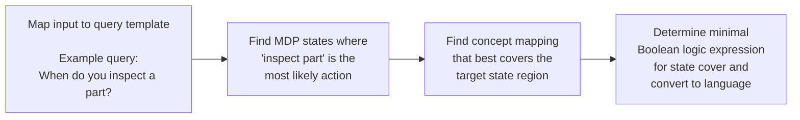

```
# Improving Robot Controller Transparency Through Autonomous Policy Explanation

**Bradley Hayes and Julie A. Shah**  
Computer Science and Artificial Intelligence Lab  
Massachusetts Institute of Technology  
Cambridge, MA 02139  
{hayesbh, julie_a_shah}@csail.mit.edu

## ABSTRACT

Shared expectations and mutual understanding are critical facets of teamwork. Achieving these in human-robot collaborative contexts can be especially challenging, as humans and robots are unlikely to share a common language to convey intentions, plans, or justifications. Even in cases where human co-workers can inspect a robot’s control code, and particularly when statistical methods are used to encode control policies, there is no guarantee that meaningful insights into a robot’s behavior can be derived or that a human will be able to efficiently isolate the behaviors relevant to the interaction. We present a series of algorithms and an accompanying system that enables robots to autonomously synthesize policy descriptions and respond to both general and targeted queries by human collaborators. We demonstrate applicability to a variety of robot controller types including those that utilize conditional logic, tabular reinforcement learning, and deep reinforcement learning, synthesizing informative policy descriptions for collaborators and facilitating fault diagnosis by non-experts.

## 1. INTRODUCTION

Collaboration between humans and robots is impossible without shared expectations about teammates’ behaviors and intentions [14, 28]. However, gaining insight into the processes that govern the behaviors of autonomous agents can be prohibitively difficult, requiring a worker to directly access and inspect a robot’s control code — an especially challenging task if its logic is embedded in modern machine learning model-based methods.

Such control software can be complex to parse and interpret [21], particularly for modern robotics applications [20, 32]. Due to the high dimensionality of process inputs (e.g., camera images, object locations, etc.) or outputs (e.g., mechanical degrees of freedom), it can quickly become infeasible to manually encode behaviors. Methods that create robot controllers by learning behaviors from demonstration or simulation have emerged as a reasonable alternative to manual encoding [37, 1]. However, understanding controllers has become considerably more difficult as a result of incorporating these popular and effective machine learning methods, with statistical models increasingly used as drivers of control logic.

As a robot’s roles and responsibilities grow increasingly complex, its controller can quickly become incomprehensible through the necessary use of these methods, highlighting an implicit trade-off between capability and transparency. Providing the robot’s control code or documentation to collaborators in advance is neither a viable nor scalable alternative, with misinterpretations potentially impeding team fluency or putting human workers in harm’s way. Within a robot’s control software, the debugging process can be expensive and time-consuming [13], with no guarantees that anomalous behavior will be identified and resolved prior to deployment. Even modern systems that provide targeted, useful information about their controllers typically require manual, task-specific annotation in order to do so [38], indicating a technical gap in general methods for automating this explanatory process.

Our aim in this work is to enable an autonomous agent to reason over and answer questions about its underlying control logic, independent of its internal representation. We demonstrate our approach’s utility within three representative domains (discrete, continuous, and multi-agent) that map to three important classes of robot controllers, including hard-coded, conditional statement-driven policies, and those that rely upon trained reinforcement learning models [18] — demonstrating success with both tabular representation and neural network based Q-function approximation [26] in particular. We show that our method accurately and succinctly summarizes encoded control logic, providing a basis for establishing shared expectations between a robot and its human co-workers. The presented method also serves as a tool for debugging complex control systems, as its generated explanations can also serve to characterize undesired or mis-applied behaviors.

Our approach first involves learning a domain model of the system’s operating environment from real or simulated demonstrations, using programmer specified code annotations that provide capabilities similar in spirit to a software debugger. Within this learned domain model, we use statistics computed over data extracted from continued observations of the controller’s software execution traces to construct a behavioral model that effectively captures or finely approximates the agent’s control logic (Section 4). We use a Boolean algebra over planning predicates [11] as a basis for grounding state regions in natural language (Section 5). Leveraging these models and language groundings, we introduce a series of algorithms that enables an agent to answer behavior-related questions (Section 6), allowing for indication of environmental conditions under which certain robot behaviors will occur (“When do you do __?”), identification of which robot behaviors will occur under a specified set of environmental conditions (“What do you do when __?”), or an explanation for why a particular behavior did not occur (“Why didn’t you do __?”). In doing so, we provide workers with the capability to develop and refine their expectations concerning the behaviors of otherwise-opaque autonomous agents through direct inquiry. This interactive, targeted expectation calibration is an important initial step toward understanding and debugging robot behaviors, as it facilitates the precise identification of the ways in which expected and realized actions do not align.

**Publication note.** Permission to make digital or hard copies of all or part of this work for personal or classroom use is granted without fee provided that copies are not made or distributed for profit or commercial advantage and that copies bear this notice and the full citation on the first page. Copyrights for components of this work owned by others than ACM must be honored. Abstracting with credit is permitted. To copy otherwise, or republish, to post on servers or to redistribute to lists, requires prior specific permission and/or a fee. Request permissions from permissions@acm.org.  
*HRI ’17, March 06–09, 2017, Vienna, Austria*  
© 2017 ACM. ISBN 978-1-4503-4336-7/17/03...$15.00  
DOI: http://dx.doi.org/10.1145/2909824.3020223

## 2. BACKGROUND AND RELATED WORK

Traditional methods for acquiring an understanding of control logic typically involve some form of source code inspection and documentation review [2, 13] or formal verification given proper specifications [36, 23]. In order to resolve issues stemming from logical errors, automated debugging methods have been introduced [4, 3, 34] that seek to identify faulty program statements. These approaches maintain the critical assumption that identifying a faulty statement is sufficient to allow a developer to detect, understand, and correct the issue introduced by the error [31]. In their work, Parnin and Orso elaborated that these approaches are not readily applicable to complex systems with “imperfect” knowledge, such as controllers that rely upon encoded data to make decisions (e.g., statistical models) or systems that interact with an external environment (e.g., collaborative robots).

One major limitation of code inspection tools in general is that their effective use requires that the code itself be interpretable to the user attempting to understand it. Novices in particular tend to have a difficult time both understanding the intended operation of a program and identifying connections between malformed logic and actual execution behavior [12]. Fitzgerald et al. found that beginner programmers had substantial difficulty identifying errors in the conditional logic of simple programs, with repair rates ranging only 50%. In robotics domains, where such logic is often implicitly embedded in high-dimensional statistical or graphical models, classical, code inspection-based debugging approaches are largely inapplicable. Given the potential physical consequences of model-borne bugs in robot controllers and the remote likelihood of a novice interpreting such representations via inspection, it is imperative to introduce tools that do not rely upon comprehension of source code.

Verbal statements have been shown in prior work to be a preferred mechanism for summarizing and conveying information related to control logic and decision making [44, 46]. Automated methods utilizing natural language-based explanations (rather than source code analysis) have been effective for instilling appropriate levels of understanding and confidence regarding expected robot behavior [22]. Study results have indicated that achieving comprehension of control logic leads to improved team performance [46, 28, 39] and prevention of automation abuse [30]. Even in situations in which robots’ explanations are neither exhaustive nor precise, the corresponding increase in transparency can improve the decision-making capabilities of collaborators [45, 29, 47].

Strategies for verbal human-robot communication that involve conveying intention and resolving ambiguity have yielded effective collaborations. Tellex et al. [42] investigated scenarios in which a human was relied upon to debug a robot’s behaviors during live task execution, and contributed an algorithm enabling the robot to identify parts or obstacles that had to be manipulated in order to allow nominal operation to continue. In their work, varying levels of specificity within verbal communication were investigated for reducing collaborator uncertainty about the robot’s needs when assistance was required, indicating that targeted, unambiguous requests for help were far more effective than imprecise requests. Devin et al. [9] incorporated a theory of mind that reasons about a partner’s knowledge to guide a robot’s behaviors and information-sharing activities, and reported an increase in collaboration efficiency when appropriate knowledge was communicated. Both works support the premise that robots capable of identifying and communicating relevant details about their operation are better teammates that are more useful and are more capable than robots lacking this capability.

Complementing human-robot interaction literature focused on generating content and determining the relevance of information to communicate, prior work in the expert systems community has investigated and characterized the principal components of effective explanations [41]: constructing an expository story relating internal knowledge to general facts, plans, and goals in a comprehensible manner. Explanation-based approaches that justify their decisions have proven capable of increasing user acceptance of and confidence in autonomous systems [48]. As ideal model summaries are precise, concise, and interpretable [24, 35], the quality of a system response is measured by its accuracy (faithfulness to the underlying model), succinctness (minimization of information transferred), and legibility (ability to be interpreted by a human). While these works provide guidance toward a necessary capability, its realization is an ongoing effort, due in part to the difficulty of generating relevant and meaningful summaries of complex controllers.

Researchers have identified Markov decision processes [33] as a promising basis for the design and implementation of these desired diagnostic and explanatory capabilities. Elizalde et al. [10] detailed a system for articulating the primary decision factors of a program, helping to direct an operator’s attention to minimize failures or surprises. They accomplished this through an analysis of the principal variables composing the model’s state space, simultaneously evaluating both a variable’s impact on the utility function that the program is attempting to maximize and its impact on action selection at a given state. Khan et al. [19] introduce the notion of a minimally sufficient explanation for action selection at a given world state, using the fewest possible terms. Results from a human-subjects study confirmed that operators of their system utilized the advice and the minimally sufficient explanation it provided, resulting in positive subjective measures scores for the interaction. St. Clair and Matarić [38] investigated communication during a collaborative task in which a human and robot were in close proximity to one another, using pre-scripted self-narrative (“I’ll do X”), role-allocative (“You do X”), and empathetic (“Oh no...” or “Great!”) feedback. They found that feedback contributed to a significant decrease in task completion time, as well as more favorable subjective responses related to performing the collaborative task.

While these existing works enable certain classes of robot controller to describe or justify individual decisions from the perspective of a single state, techniques enabling general behavior summarization across state regions, independent of task or internal representation, are notably absent. Our work provides a mechanism that generalizes across application domains and controller implementations for modeling, summarizing, and communicating relevant behavioral information from robots to humans.

## 3. POLICY EXPLANATION

In collaborative settings, it is imperative for teammates to have compatible mental models of their task and the way in which it will be performed [28, 15, 5]. Particularly in scenarios in which humans and robots share a common environment, divergence in understanding can lead to unexpected behaviors, increasing injury risks and reducing team fluency. However, as a robot’s behaviors become more complex, the ability to communicate its control logic becomes increasingly challenging. This work introduces a framework that can be used by robot programmers to provide the required level of transparency, enabling co-workers to synchronize their expectations and identify faulty behavior in robot controllers.

Given software control logic $L$ (e.g., executable program code), a natural language inquiry $Q$, and a natural language response $R$, policy explanation requires a function $f : Q \times L \rightarrow R$. We constrain the space of these variables in our implementation for practical purposes, limiting the domain and range to values relevant to the task at hand. As further described in Section 4.2, code annotations are used as heuristics for specifying the program variables and functions to be incorporated into $f$, constraining the space of $L$ to only include variables containing useful state information and functions that represent actions. $Q$ is limited to the scope of the questions described in Section 6 regarding when behaviors will occur, which behaviors will occur in specified situations, and why certain behaviors did not occur. Finally, $R$ is constrained to a template-based approach, explained in Section 5.

## 4. APPROACH

We frame our approach to policy explanation in a manner that facilitates the four operational goals outlined in Vessey’s study on debugging processes [43]: problem identification, familiarity acquisition, program structure exploration, and error repair. Our proposed solution frames $f$ as a composition of functions — a process summarized in Figure 1. With $L$, $Q$, and $R$ as defined above, we introduce a set of question templates $T$ (e.g., “When do you do $[action]$?”) and binary classifiers to characterize aspects of the world state, known as predicates [11], $C$ (e.g., “Robot is in Loading Dock”). We compute $f$ through functions that: identify the question being posed and its arguments ($Identify\_question : Q \rightarrow T$), resolve the question to a relevant set of program states ($Resolve\_states : T \times L \rightarrow \bar{I}, \bar{I} \subset I$), summarize the relevant attributes of these states into a concise representation ($Summarize\_attributes : T \times L \rightarrow C^n$), and, finally, compose these summaries into a natural language form that can be expressed to the inquiring human ($Compose\_summary : C^n \rightarrow R$). Thus, we define the following:

$$
f = Compose\_summary \circ Summarize\_attributes \circ Resolve\_states \circ Identify\_question
$$

**(1)**

### Figure 1



**Figure 1:** An illustration of our approach for mapping an action query to a policy explanation. First, the input query language is matched against pre-defined query templates. Then, a graph-search algorithm is run to find state regions fulfilling the query criteria. A set cover is found using logical combinations of communicable predicates. Finally, the cover is minimized and converted back to language via template.

### 4.1 Behavioral Modeling

We formulate a general diagnostic approach to behavior explanation that involves simultaneously learning a model of the environment (domain model) and the robot’s underlying control logic (its policy). These models are learned from demonstration, during which observations are derived from information gained through inspection of running code (much like a software debugger). These observations are composed of annotations derived from the logging of function calls and their parameterizations alongside the current values of state variables at run-time. We compile the logged observations — both the domain and action models — into a single graphical model, capturing the important relational information between states and actions.

Given a unified domain and policy model, we frame the problem of behavior explanation as a four step process. First, a given query must be mapped to a context, or relevant set of states. This corresponds to the $Identify\_question$ and $Resolve\_states$ functions, where the input text is mapped to a query template and the query template is resolved to a set of states. Next, the relevant attributes of these states must be summarized and converted into a form interpretable by the interaction partner, corresponding to $Summarize\_attributes$ and $Compose\_summary$. To make this natural language generation and interpretation tractable, we employ communicable predicates: Boolean classifiers similar to traditional STRIPS-style [11] planning predicates with associated natural language descriptions. It is through communicable predicates that our method is able to convert attributes from sets of states into natural language and vice versa.

We use the Markov decision process (MDP) framework as a basis for constructing the domain and policy models of the control software, described by the 4-tuple $(S, A, T, R)$ [40]. Within this framework, a domain is specified as a set of environment states $S$. The actions available to an agent are specified in a set, $A$. An agent in a state $s \in S$ can select an action $a \in A$, after which the agent transitions to another state $s' \in S$ according to a probability distribution given by the transition function $T(s, a, s') = [0, 1]$. This transition results in a reward given by the reward function $R(s, a)$. A decision rule for selecting actions as a function of state is termed a policy $\pi : S \times A \rightarrow [0, 1]$. An optimal policy, $\pi^*$, is the policy which maximizes total reward from every state of the MDP.

A state $s \in S$ is a vector containing values for internal variables in the controller’s logic. To mitigate an unnecessary, tremendous increase in state dimensionality, we describe a process for limiting the scope of $S$ in Section 4.2. An action $a \in A$ represents a parameterized function call from within the robot controller software, such as `move("north", 10)`. The transition dynamics $T$ are learned from experience, connecting function calls (actions) with changes in the environment (program state).

### 4.2 Heuristics for Model Generation

The state space of program variables is likely to be too large to practically model purely through observation on any reasonable timescale. In order to accelerate our model learning, we introduce a set of heuristics that can be incorporated directly into the controller code without affecting its execution. We identify and introduce two important heuristics to accelerate model learning: one to provide a mechanism for specifying which variables should be tracked, and one to specify which functions are relevant actions. These heuristics take the form of self-modifying code added within the robot controller to track important variables and function calls. In keeping with the software debugger analogy for monitoring the robot controller’s execution, these code-level modifications can intuitively be thought of as similar to function monitors or setting a variable watch, as they do not interfere with the code’s normal function, but provide important usage information.

Reducing the dimensionality of the state space $S$ is critical for minimizing model complexity. Toward this end, the first code-level heuristic we introduce reduces the amount of unnecessary program variables included. To accomplish this, we provide a wrapper for important program state variables. These variables are captured at each snapshot taken during the modeling process (pre- and post-function call) and constitute the elements of the feature vectors represented as vertices in the generated MDP.

The second code-level heuristic is implemented as a series of function decorators[^1], a form of metaprogramming that modifies functions at definition time, used to indicate important functions to be considered as actions within $A$ (Figure 2). These indicators minimize the amount of noise in the learned transition function, allowing for more rapid convergence to a feasible domain and policy model. This decorator is intended for use on robot control functions that correspond to actions or effects in the physical world. Within our Python implementation, decorated functions are dynamically re-written at runtime to provide detailed execution logs, capturing the program state before and after function calls. Settable flags on the function decorators indicate whether to also capture the parameter set or any return values from the function call. In order to facilitate references to and from these functions that are more natural than the function names themselves, our implementation incorporates an optional parameter to specify a natural-language description to use instead.

[^1]: https://en.wikipedia.org/wiki/Python_syntax_and_semantics

### Figure 2

```python
@action(description='inspect the part', log_params=False, log_return=True)
def inspect_part(ptype, x, y, z, r, p, y):
    grasp = plan_grasp(ptype, x, y, z, r, p, y)
    ...
```

**Figure 2:** A snippet of code showing an example of a function decorator for the inspection task, annotating the `inspect_part` function in the robot’s Python control program as a high level action.

As the control program executes, state information is recorded from the annotated variables before and after annotated function calls occur. Each time an annotated function is called, $T$ is modified to reflect the observed $(state, action, state)$ tuple. Actions are recorded as a combination of function name, serialized parameters, and serialized return value, depending on the parameters the decorator was initialized with, as seen in Figure 2. This process constructs an MDP from the observed code execution paths. To extend this observation-based model to work with previously unseen states, a simulator is required.

## 5. LANGUAGE GROUNDING

In order to provide interpretable explanations of an agent’s needs, behaviors, or intentions, it is necessary to have a framework that can ground its output in terms that the system’s interaction partners can understand. We use collections of boolean classifiers that we term communicable predicates to provide a meaningful abstraction over low-level information, such as feature vectors. These classifiers, when paired with string templates describing the meaning of true or false classifications, offer a means of translating internal knowledge into natural-language responses.

We identify three primary predicate types that may be necessary for expressing knowledge related to behavioral inquiries: general, robot-specific, and domain-specific. One example of a general, scenario-agnostic predicate that spans many application domains is a classifier that articulates a spatial relation — for example, the predicate “nearby(A,B),” which returns true when entity $A$ is near to entity $B$ and false otherwise, can be used across a variety of tasks or situations. Robot-specific predicates, such as “isPowered(component)”, which would return true if component were powered and false otherwise, may be required to allow an agent to communicate details about itself. Finally, there may be domain-specific characteristics that are not covered by general spatial relations or robot attributes — such as “isWidgetStockFeedOn()”, which may relay information about a particular component of the robot’s specialized environment. Importantly, the predicates that are used neither need to exist within the robot’s code nor rely on input from the robot’s sensors, as they are only used for grounding world state information in language.

### 5.1 Grounding State Regions

We approached the challenge of succinctly describing state regions as a minimal set cover problem, seeking the smallest logical expression of communicable predicates that precisely cover the target states. Algorithm 1 provides such a solution, resolving an arbitrary set of states into a natural language description by using a Boolean algebra over the space of defined predicates. States are projected onto the corners of the unit hypercube defined by the vector comprising predicate classification values (Algorithm 1, lines 7–8, 13–14). The resultant hypercube vertices are equivalent to disjunctive normal form (DNF) clauses, with predicate value assignments as literals.

DNF formulae are an ideal representation for describing combinations of predicates, providing a product-of-sums logical expression satisfying a state region descriptor function $f(s \in S) \rightarrow \{0, 1\}$. $f(s)$ is equal to 1 when predicate values for $s$ fulfill the Boolean logic encoded in $f$ and is 0 otherwise. Thus, each target state’s hypercube projection is added as a minterm in $f$, causing the function to return 1 when tested on any state in the target region. For example, given the communicable predicate set $\bar{C} = \{C_1, C_2\}$, a formula that describes a region containing a state $s_0$ for which $\{C_1(s_0)=True, C_2(s_0)=False\}$ and a state $s_1$ for which $\{C_1(s_1)=False, C_2(s_1)=False\}$, the resulting $f$ is specified as follows:

$$
f(s) = (C_1 \land \neg C_2) + (\neg C_1 \land \neg C_2)
$$

Once the region is expressed as a logical formula, our approach calls for application of the Quine-McCluskey algorithm [25, 17] (Algorithm 1, line 16) to perform Boolean logic minimization on the collection of minterms in $f$. Continuing the previous example, the resulting formula becomes the following:

$$
f(s) = \neg C_2
$$

As the Quine-McCluskey algorithm has memory and runtime requirements that are exponential according to the size of the predicate set, an approximate algorithm, such as ESPRESSO or its variants [8], can be used instead for large collections of predicates.

### Algorithm 1: Convert State Region to Language

**Input:** Target state set $S$, Non-target state set $\bar{S}$, Communicable predicate set $C$  
**Output:** String representations for clauses in DNF Formula of $S$ grounded in elements of $C$

```text
assert S ∩ S̄ = ∅;
include_list ← [];
exclude_list ← [];

foreach s ∈ S do
    state_val = 0;
    i = 0;
    foreach c ∈ C do
        state_val |= (c(s) == True) << i++;
    end
    include_list ← include_list ∪ state_val;
end

foreach s ∈ S̄ do
    state_val = 0;
    i = 0;
    foreach c ∈ C do
        state_val |= (c(s) == True) << i++;
    end
    exclude_list ← exclude_list ∪ state_val;
end

qm_minimization ← Quine_McCluskey(ones=include_list,
                                  zeros=exclude_list);
clauses ← [];

foreach minterm ∈ qm_minimization do
    str ← '';
    foreach literal ∈ minterm do
        if literal is False then str += c.negative_string;
        else str += c.positive_string;
        str += ' and ';
    end
    clauses.append(str);
end

return 'or'.join(clauses);
```

With a minimized logical form, our algorithm generates explanations through application of predicate-specific string templates to each element of the formula. Consider two predicates, $X$ and $Y$, representing whether a robot is active or idle and whether the factory line is running or not, respectively. Given the logical product-of-sums output $X * \neg Y + \neg X$ or equivalent logical expression $(X \land \neg Y) \lor (\neg X)$ representing conditions under which a robot performs a critical behavior, natural-language templates allow our algorithm to verbalize these outputs, producing outputs like “The robot is idle and the widget is not present or the robot is active.”

Our formulation also affords the ability to quantify linguistic overstatement and understatement, mapping to false positive and false negative rates, respectively. A robot can use this information to modulate its interaction partners’ confidence in its output, as overstatements and understatements provide upper and lower bounds on the conditions being approximated by the generated logical expression of predicates.

### Figure 3

**Figure 3:** Visualization of an inspection task for a robot on an assembly line, used as a representative example for motivating our selected query types. When a part is loaded onto the conveyor belt, the robot receives a stock feed signal and must locate and pick the part before it is out of range, inspect it, and place it back on the conveyor.

**Description:** The figure shows a robot positioned next to a conveyor belt in an assembly-line environment. A separate loading mechanism places a part on the belt. A highlighted yellow field indicates the inspection robot’s sensing or operational region. The caption emphasizes that a stock feed signal informs the robot that a part should be present, after which the robot must find and inspect the part before it moves beyond reach.

## 6. QUERIES FOR POLICY ANALYSIS

We focused on a set of question types derived from a survey of literature related to human-computer interaction and software debugging, fulfilling expert-derived debugging criteria [43]. These questions allow for insight into when a robot will perform a behavior, identification of a robot’s behaviors under specified conditions, and explanation of the differences between a robot’s demonstrated behavior and its expected behavior. We identified a query template, representative use case, and response resolution algorithm for each question type. In order to build intuition about situations in which our selected queries are useful, we grounded our examples in a scenario in which an industrial robot is tasked with inspecting parts on a conveyor belt cued by a stock feed signal (Figure 3).

### 6.1 Identifying Conditions for Actions

We utilized the template “When [do | will] you [action]?” to identify queries related to specifying conditions under which a particular action would be executed. Once the relevant regions of state space are identified, Algorithm 1 can summarize them using natural language (for example, “When will you pick up the widget?”). Given a reasonable specification of language templates for robot actions (e.g., $pick(x) \rightarrow$ “pick up x”), we can functionally resolve the intention of the query to “Describe the states where the most likely action is pick(‘widget’).” Algorithm 2 describes the process for identifying the relevant state region to be described in the query response. Our algorithm, given an appropriate library of communicable predicates, produces the response, “I get the widget when the stock feed signal is on and my camera has detected a widget and the widget is within reach.”

Once a state region is identified, it can be summarized via Algorithm 1 and inserted into the following template: “I perform [action] in [region].” Explanation size can be bounded by imposing a threshold on the number of descriptive clauses returned by Algorithm 1 (as in Algorithm 4 lines 6–7), with the queried agent providing a default response indicating the infeasibility of answering the question (e.g., “I perform [action] in too many contexts to succinctly describe.”).

### 6.2 Explaining Differences in Expectation

We utilized the template “Why [didn’t | aren’t] you [action]?” to identify queries related to divergence in expected and observed behaviors. For example, if the robot in Figure 3 fails to pick a part up off the conveyor belt, a collaborator may ask “Why didn’t you inspect the part?” In this case, an explanation is desired that characterizes the difference between the current state and nearby states where the indicated action is performed. In Algorithm 3, pseudocode is provided to extract and characterize the difference between the current state and state regions where the desired behavior occurs. The `describe` function is specified in Algorithm 1.

Algorithm 3 outputs a list of predicate values that differ between the robot’s previous state and nearby states where the desired behavior occurs. In our implementation, we utilized the template “I didn’t [action] because [difference between current state and states where action is executed]. I [action] when [action region description].” to communicate these differences. For example, consider the case of a stock feed signal malfunction during the part inspection scenario (Figure 3), wherein a part is both present on the conveyor belt and detected by the robot, but the stock feed signal is off. Using the predicates defined in Section 7.3, this query type produces the following output: “I didn’t inspect the part because the stock feed signal is off. I inspect the part when the stock feed signal is on and I have detected a part and the part is within reach.” This ability to actively probe the robot’s controller facilitates the isolation of factors contributing to task failures.

### 6.3 Understanding Situational Behavior

While the previous query type produces explanations for behavior that does not match expectations, a more proactive approach would involve communicating policy details in advance. The third and final query type we addressed is the inverse of the first: a means of summarizing how a robot will behave under specific circumstances. We used the template “What will you do when [DNF state region description]?” to designate these queries. This allows a collaborator to ask a variety of safety- and productivity-critical questions, such as “What will you do when a human is near you?” or “What will you do when the stock feed signal is on and a part is detected?” Algorithm 4 provides a description for each action type typically performed within the provided state region description. These descriptions are then individually applied to the template, “I [action] when [state region description].”

With respect to the first example inquiring about a nearby human, given a “humans nearby” predicate, if Algorithm 4 returns an empty set ($descriptions = \{\}$) our system would generate a standard response, “I perform no action under those conditions,” helping to confirm the safety of a human entering its work cell. For the second example, assuming the robot had the ability to signal its human co-workers for assistance, our approach may return, “I will inspect the part when the part is within reach. I will contact an associate for assistance when the widget is not within reach.”

[^2]: For domains involving large state spaces where full enumeration is infeasible, sampling based approaches can provide substitutions for $V$ in our query algorithms.

### Figure 4

**Figure 4:** Visualizations of each application domain evaluated in Table 1. Left: A GridWorld-style parts delivery task, in which a robot must pick and deliver parts whilst avoiding human-only areas. Middle: The CartPole stabilization task [7], wherein a robot must attempt to balance and stabilize a pole placed on the middle of a mobile cart. Right: A parts inspection task, in which an inspection robot cued by a stock feed signal must locate and inspect parts placed by a separate loading robot.

**Description:** The figure contains three side-by-side visualizations. The left panel depicts a grid-world environment with a robot starting near the lower-left corner, human-only zones along the bottom edge, and a delivery area in the upper-right corner. The middle panel depicts the CartPole domain, with a vertical pole mounted on a cart-like base. The right panel depicts the conveyor-belt inspection task with the robot positioned near a conveyor belt and a highlighted inspection/sensing region.

### Algorithm 2: Identify Dominant-action State Region

**Input:** Behavioral Model $G = \langle V, E \rangle$, Target Action $a$  
**Output:** Set of target states $S_{\pi_a}$ where $a$ is the dominant action, Set of non-target states $S_{\neg \pi_a}$

```text
Sπa ← {};
S¬πa ← {};

foreach s ∈ V do
    a* ← most frequent action executed from s;
    if a* == a then Sπa ← Sπa ∪ s;
    else S¬πa ← S¬πa ∪ s;
end

return Sπa, S¬πa;
```

### Algorithm 3: Identify Behavioral Differences

**Input:** Behavioral Model $G = \langle V, E \rangle$, Target Action $a$, Previous state $s_p$, Distance threshold $D_{const}$  
**Output:** Explanation of difference between current state and state region where $a_t$ is performed, explanation of where $a_t$ is performed locally.

```text
Sπa ← {};
S¬πa ← {};

foreach D ∈ {1, ..., Dconst} do
    foreach s ∈ {v ∈ V | distance(v, sp) < D} do
        a* ← most frequent action executed from s;
        if a* == a then Sπa ← Sπa ∪ s;
        else S¬πa ← S¬πa ∪ s;
    end
end

expected_region ← describe(Sπa, S¬πa, C);
current_region ← describe({sp}, Sπa, C);

return diff(expected_region, current_region), expected_region;
```

## 7. CASE STUDIES

We report results for three representative application domains that cover three different types of robot controller. For each domain, we provide a description of the environment, the controller implementation (and corresponding state space), and the predicate library we defined. We report algorithm output for each descriptive query type, providing autonomously generated policy summaries for each controller. We report results for a parts delivery task (GridWorld [40]) to show application to general planning tasks with discrete state spaces, a stabilization task (CartPole [6]) to show application to control policies with continuous state spaces, and a multi-agent parts inspection task in which agents did not communicate to showcase application within a complex dynamic environment.

For each domain, we detail the training process for the robot’s controller. Once a final controller was obtained, we froze the operating parameters and began logging any annotated function calls that occurred, building our external graphical model for querying. We show that, for each application domain, our approach was able to capture and explain the robot’s policy, allowing collaborators to extract relevant behavior summaries. To generate the summaries in Table 1, we concatenate results from queries of “When do you [action]?” for each action in the domain.

### Algorithm 4: Characterize Situational Behavior

**Input:** Behavioral Model $G = \langle V, E \rangle$, Communicable Predicate Library $C$, State region description $d$, Max action threshold $cluster\_max$  
**Output:** Explanation of policy behavior in $d$ per action and its accompanying state region

```text
S ← dict();
descriptions ← dict();

DNF_description ← convert_to_DNF_formula(d, C);

foreach s ∈ {v ∈ V | test_dnf(v, DNF_description) is True} do
    S[π(s)] ← S[π(s)] ∪ s;
    if |S| > cluster_max then
        return too_many_actions_error
    end
end

foreach a ∈ S do
    descriptions[a] ← describe(S[a], V \ S[a], C);
end

return descriptions;
```

### 7.1 Delivery Task

During the parts delivery task (Figure 4-left), the robot began in the bottom-left position of a $4 \times 4$ GridWorld and was required to pick up a part at that location, navigate to the delivery area, and place the part on the conveyor belt, while avoiding any zones designated “human-only.” The world reset and a negative reward was applied if the robot delivered the part anywhere other than the delivery area, or if an episode extended beyond 15 actions. A negative reward was also applied to any actions inside a human-only zone, but the world did not reset. Positive rewards were applied if the robot successfully delivered the part, and the world was then reset. Invalid actions, such as navigating into a wall, resulted in no state change.

The delivery task’s state space included the robot’s position on the grid and whether it was carrying a part. The robot had six available actions, each implemented as a separate function (for ease of code annotation) in the controller program: “pick,” “place,” “north,” “south,” “east,” and “west.” We used nine predicates, encoded as binary classifiers over the state space: “near human zone,” “at human zone,” “near delivery area,” “at delivery area,” “north of goal,” “south of goal,” “east of goal,” “west of goal,” and “has part.”

Reinforcement learning was used to train a tabular agent policy with $\epsilon$-greedy exploration $(\epsilon = .75)$. Once the agent could successfully complete the task more than 90% of the time, we ceased further training and froze the model parameters. With a mathematical model governing the robot’s action decisions, we applied our code-level annotations and built our queryable model of the robot over the course of 250 action observations.

### 7.2 Stabilization Task

During the stabilization task (Figure 4-middle), an agent operating in a continuous state space attempted to balance a pole on a moving cart. The task may be successful using a 4-tuple (cart position, cart velocity, pole angle, and pole angular velocity. The agent had two available actions — move left or move right — which affected the momentum of both the cart and pole. Each episode began with a random initialization of the cart and pole positions, with zero initial velocity. We trained a 2-layer, fully-connected neural network with a rectified linear activation function to approximate the Q-function, producing a difficult-to-interpret controller capable of solving the CartPole domain. Each episode lasted up to 200 steps or until the pole fell.

We defined 10 predicates to describe states in this domain: “pole falling left/right,” “pole stabilizing left/right,” “pole standing up,” “cart moving left/right,” “cart positioned far left/right,” and “cart near middle.” The predicates describing a pole falling indicate that the pole is off-center and has a velocity driving it away from an upright position. Predicates describing the pole as stabilizing indicate an off-center pole moving toward an upright position.

Our method was able to summarize a successful policy that was approximated with initially random parameters, despite the occasional presence of incorrect actions taken by the controller, producing approximately correct explanations with overstatement and understatement. The description provided was close to the expert description of a successful task strategy (Table 1).

### 7.3 Inspection Task

We implemented the inspection task used as the running example in Section 6 to motivate our query types, depicted in Figures 3 and 4-right. The state space for this task included the part’s 2D position on the conveyor belt when in sight of the robot (otherwise, a default value of $[-1, -1]$ was reported), the robot’s head orientation (an angle between $-60$ and $-20$ degrees from the robot’s axial plane), and a Boolean stock feed variable that indicated whether the robot should expect a part to be in sight. The head orientation of the robot was divided into three ranges (low, middle, and high), and dictated whether a part was detected based on its position on the conveyor belt. Any orientation in the “high” position $((-30, -20])$ allowed detection for parts in the top 20% of the belt, the “middle” position $([-50, -30])$ enabled detection for the middle 60% of the belt, and the “low” position $([-60, -50))$ enabled detection for parts in the bottom 20% of the belt. The robot’s starting head orientation was $-40$. The true position of the part was a hidden variable, dictated by its placement by another robot in the environment. Once a part was placed on the conveyor belt, the stock feed signal was activated. The part was not detectable to the inspection robot for a random duration between 1 and 3 timesteps after it was placed. Due to the conveyor belt moving the part down the line, the inspection robot had a window of four timesteps (plus the 1–3 timestep delay) to detect and inspect a part once the stock feed signal was activated before the part would advance beyond the robot’s reach, causing task failure. Once a part was inspected, the stock feed signal was deactivated.

The robot had four actions it could take: “inspect part,” “look high,” “look middle,” and “look low.” The “inspect part” action failed if it was taken when the part was not detected (e.g., at position $[-1, -1]$) or if it was out of reach, which only occurred if it was placed in the top 10% of the conveyor belt. The “look high”, “look middle”, and “look low” actions rotated the robot’s head to pre-set positions of $-20$, $-40$, and $-60$ degrees respectively. We implemented six predicates for abstracting over the state space: “stock feed on,” “part detected,” “part reachable,” “looking high,” “looking middle,” and “looking low.” The robot controller for this task was manually coded with standard conditional logic, employing a middle/low/high scanning pattern when searching for parts to inspect after the stock feed signal was activated. Our method accurately summarized the behavior of the policy defined by the Python program that controlled the inspection robot (Table 1).

Given that this domain contained a potential failure case that was outside the inspection robot’s control, we additionally probed why an action did not occur in order to gain insight into unexpected behavior. We introduced a fault into the controller of robot loading the conveyor belt, such that it placed its parts only in the top 10% of the belt, out of reach of the inspection robot. At the time step after the robot detected the part but did not inspect it, we queried our model with the following: “Why didn’t you inspect the part?” Using Algorithm 3, the model was able to identify the issue, responding with the following: “I did not inspect the part because I cannot reach the part. I inspect the part when the stock feed is on and I have detected a part and I can reach the part.” This ability to actively probe the robot’s controller facilitates the isolation of factors contributing to task failures.

### Table 1

| Domain | Expert Description | Autonomous Description |
|---|---|---|
| Delivery | Move north when south of a delivery area and holding the part. Move east when west of a delivery area and not near a human zone. Move west when in a human zone. Pick the part when near a human zone and west of a delivery area and south of the delivery area. Place the part when at a delivery zone. | I move north when I am south of a delivery area and have the part. I move east when I am west of a delivery area and have the part and not near a human zone. I move west when I am at a human zone. I do not perform move south. I pick the part when I am near a human zone and west of the delivery area and south of the delivery area. I place the part when I am at the delivery zone. |
| Stabilization | Move left when the pole is falling left and the pole is not stabilizing right. Move right when the pole is falling right and the pole is not stabilizing left. | I move left when the cart is not at the far left and the pole is falling left. I move right when the cart is at the far left or when the cart is in the middle and the pole is falling right or when the cart is in the far right and the pole is stabilizing left. |
| Inspection | Inspect the part when the stock feed is on and a part is detected and the part is reachable. Look low when looking in the middle and the stock feed is on and a part is not detected. Look high when looking low and the stock feed is on and a part is not detected. Look in the middle when the stock feed is off. | I inspect the part when the stock feed is on and I can reach the part. I look low when the stock feed is on and I have not detected a part and I am looking in the middle. I look in the middle when the stock feed is off or when the stock feed is on and I have not detected a part and I am looking high. I look high when the stock feed is on and I have not detected a part and I am looking low. |

**Table 1:** Autonomously generated policy summaries learned from the three application domains, presented alongside expert summaries of successful solutions given in terms of the available predicates for each domain.

## 8. CONCLUSIONS AND FUTURE WORK

In this work, we have presented a novel mechanism for modeling and explaining robot control policies. Our methods allow non-experts to gain insights into the operation of autonomous agents and to better calibrate their expectations of the agents’ behaviors, making robot controllers more transparent. The approach we present generalizes to arbitrary control logic, allowing for wide application across a variety of contexts.

By introducing an abstraction over the state space with communicable predicates, we present a novel framing of the explanation process as a minimal set cover and subsequent Boolean logic minimization problem. As a result of this, we are able to produce succinct behavioral explanations grounded in language that humans can understand. The algorithms we introduce allow collaborators to extract useful pieces of information without requiring a full understanding of an agent’s logic, as well as facilitate the debugging of aberrant behaviors by providing a mechanism to explain differences between the conditions under which particular actions occur. We demonstrated the applicability of our method within three representative robotics domains using three different types of controllers: a tabular Q-Learner, a neural network based Q-Learner, and a controller based on hard-coded conditional logic.

A natural extension to the method we describe is to perform guided policy learning, using parsed natural language descriptions of valid task strategies to map advice down to state regions (as rewards or penalties) for biasing exploration during policy learning. Autonomous symbol abstraction techniques [16, 27] may also be applied to the learned domain MDPs, reducing the programmer’s workload with respect to annotating actions within the control software. We also see applications of this work to human behavior explanation, as inverse reinforcement learning can be used to learn a policy which can then be explained with our technique.

## 9. REFERENCES

[1] P. Abbeel and A. Y. Ng. Apprenticeship learning via inverse reinforcement learning. In *Proceedings of the twenty-first international conference on Machine learning*, page 1. ACM, 2004.

[2] G. Antoniol, G. Canfora, G. Casazza, A. De Lucia, and E. Merlo. Recovering traceability links between code and documentation. *Software Engineering, IEEE Transactions on*, 28(10):970–983, 2002.

[3] T. Ball, M. Naik, and S. K. Rajamani. From symptom to cause: localizing errors in counterexample traces. In *ACM SIGPLAN Notices*, volume 38, pages 97–105. ACM, 2003.

[4] T. Ball and S. K. Rajamani. The slam project: debugging system software via static analysis. In *ACM SIGPLAN Notices*, volume 37, pages 1–3. ACM, 2002.

[5] J. Baraglia, M. Cakmak, Y. Nagai, R. Rao, and M. Asada. Initiative in robot assistance during collaborative task execution. In *2016 11th ACM/IEEE International Conference on Human-Robot Interaction (HRI)*, pages 67–74. IEEE, 2016.

[6] A. G. Barto, R. S. Sutton, and C. W. Anderson. Neuronlike adaptive elements that can solve difficult learning control problems. *IEEE transactions on systems, man, and cybernetics*, (5):834–846, 1983.

[7] G. Brockman, V. Cheung, L. Pettersson, J. Schneider, J. Schulman, J. Tang, and W. Zaremba. Openai gym, 2016.

[8] O. Coudert. Two-level logic minimization: an overview. *Integration, the VLSI journal*, 17(2):97–140, 1994.

[9] S. Devin and R. Alami. An implemented theory of mind to improve human-robot shared plans execution. In *The Eleventh ACM/IEEE International Conference on Human Robot Interaction*, pages 319–326. IEEE Press, 2016.

[10] F. Elizalde, L. E. Sucar, M. Luque, J. Diez, and A. Reyes. Policy explanation in factored markov decision processes. In *Proceedings of the 4th European Workshop on Probabilistic Graphical Models (PGM 2008)*, pages 97–104, 2008.

[11] R. E. Fikes and N. J. Nilsson. Strips: A new approach to the application of theorem proving to problem solving. *Artificial intelligence*, 2(3-4):189–208, 1971.

[12] S. Fitzgerald, G. Lewandowski, R. McCauley, L. Murphy, B. Simon, L. Thomas, and C. Zander. Debugging: finding, fixing and flailing, a multi-institutional study of novice debuggers. *Computer Science Education*, 18(2):93–116, 2008.

[13] B. Hailpern and P. Santhanam. Software debugging, testing, and verification. *IBM Systems Journal*, 41(1):4–12, 2002.

[14] B. Hayes and B. Scassellati. Challenges in shared-environment human-robot collaboration. In *Collaborative Manipulation Workshop at the 8th ACM/IEEE International Conference on Human-Robot Interaction.*, volume 8, page 8, 2013.

[15] B. Hayes and B. Scassellati. Effective robot teammate behaviors for supporting sequential manipulation tasks. In *IEEE/RSJ International Conference on Intelligent Robots and Systems (IROS)*, 2015.

[16] B. Hayes and B. Scassellati. Autonomously constructing hierarchical task networks for planning and human-robot collaboration. In *International Conference on Robotics and Automation (ICRA)*. IEEE, 2016.

[17] T. K. Jain, D. S. Kushwaha, and A. K. Misra. Optimization of the quine-mccluskey method for the minimization of boolean expressions. In *Autonomic and Autonomous Systems, 2008. ICAS 2008. Fourth International Conference on*, pages 165–168. IEEE, 2008.

[18] L. P. Kaelbling, M. L. Littman, and A. W. Moore. Reinforcement learning: A survey. *Journal of artificial intelligence research*, 4:237–285, 1996.

[19] O. Z. Khan, P. Poupart, and J. P. Black. Minimal sufficient explanations for factored markov decision processes. In *ICAPS*, 2009.

[20] J. Kober, J. A. Bagnell, and J. Peters. Reinforcement learning in robotics: A survey. *The International Journal of Robotics Research*, page 0278364913495721, 2013.

[21] P. Koopman. A case study of toyota unintended acceleration and software safety. 2014.

[22] J. D. Lee and K. A. See. Trust in automation: Designing for appropriate reliance. *Human Factors: The Journal of the Human Factors and Ergonomics Society*, 46(1):50–80, 2004.

[23] X. Leroy. Formal verification of a realistic compiler. *Communications of the ACM*, 52(7):107–115, 2009.

[24] Z. C. Lipton, D. C. Kale, C. Elkan, R. Wetzell, S. Vikram, J. McAuley, R. C. Wetzel, Z. Ji, B. Narayanaswamy, C.-H. Wang, et al. The mythos of model interpretability. *IEEE Spectrum*, 2016.

[25] E. J. McCluskey. Minimization of boolean functions. *Bell system technical Journal*, 35(6):1417–1444, 1956.

[26] V. Mnih, K. Kavukcuoglu, D. Silver, A. A. Rusu, J. Veness, M. G. Bellemare, A. Graves, M. Riedmiller, A. K. Fidjeland, G. Ostrovski, et al. Human-level control through deep reinforcement learning. *Nature*, 518(7540):529–533, 2015.

[27] A. Mohseni-Kabir, C. Rich, S. Chernova, C. L. Sidner, and D. Miller. Interactive hierarchical task learning from a single demonstration. In *Proceedings of the Tenth Annual ACM/IEEE International Conference on Human-Robot Interaction*, pages 205–212. ACM, 2015.

[28] S. Nikolaidis and J. Shah. Human-robot cross-training: computational formulation, modeling and evaluation of a human team training strategy. In *Proceedings of the 8th ACM/IEEE international conference on Human-robot interaction*, pages 33–40. IEEE Press, 2013.

[29] M. Oudah, V. Babushkin, T. Chenlinangjia, and J. W. Crandall. Learning to interact with a human partner. In *Proceedings of the Tenth Annual ACM/IEEE International Conference on Human-Robot Interaction*, pages 311–318. ACM, 2015.

[30] R. Parasuraman and V. Riley. Humans and automation: Use, misuse, disuse, abuse. *Human Factors: The Journal of the Human Factors and Ergonomics Society*, 39(2):230–253, 1997.

[31] C. Parnin and A. Orso. Are automated debugging techniques actually helping programmers? In *Proceedings of the 2011 International Symposium on Software Testing and Analysis*, pages 199–209. ACM, 2011.

[32] L. Perlmutter, E. Kernfeld, and M. Cakmak. Situated language understanding with human-like and visualization-based transparency. In *Robotics: Science and Systems (RSS)*, 2016.

[33] M. L. Puterman. *Markov decision processes: discrete stochastic dynamic programming*. John Wiley & Sons, 2014.

[34] M. Renieres and S. P. Reiss. Fault localization with nearest neighbor queries. In *Automated Software Engineering, 2003. Proceedings. 18th IEEE International Conference on*, pages 30–39. IEEE, 2003.

[35] M. T. Ribeiro, S. Singh, and C. Guestrin. “why should i trust you?”: Explaining the predictions of any classifier. *arXiv preprint arXiv:1602.04938*, 2016.

[36] V. D. Silva, D. Kroening, and G. Weissenbacher. A survey of automated techniques for formal software verification. *Computer-Aided Design of Integrated Circuits and Systems, IEEE Transactions on*, 27(7):1165–1178, 2008.

[37] W. D. Smart and L. P. Kaelbling. Effective reinforcement learning for mobile robots. In *Robotics and Automation, 2002. Proceedings. ICRA’02. IEEE International Conference on*, volume 4, pages 3404–3410. IEEE, 2002.

[38] A. St Clair and M. Mataric. How robot verbal feedback can improve team performance in human-robot task collaborations. In *Proceedings of the Tenth Annual ACM/IEEE International Conference on Human-Robot Interaction*, pages 213–220. ACM, 2015.

[39] K. Stubbs, P. J. Hinds, and D. Wettergreen. Autonomy and common ground in human-robot interaction: A field study. *IEEE Intelligent Systems*, 22(2):42–50, 2007.

[40] R. S. Sutton and A. G. Barto. *Reinforcement Learning: An Introduction*. The MIT Press, 1998.

[41] W. R. Swartout and J. D. Moore. Explanation in second generation expert systems. In *Second generation expert systems*, pages 543–585. Springer, 1993.

[42] S. Tellex, R. Knepper, A. Li, D. Rus, and N. Roy. Asking for help using inverse semantics. In *Robotics: Science and Systems*, volume 2, page 3, 2014.

[43] I. Vessey. Expertise in debugging computer programs: A process analysis. *International Journal of Man-Machine Studies*, 23(5):459–494, 1985.

[44] J. H. Visschers, R. M. Meertens, M. W. Passchier, and N. N. De Vries. Probability information in risk communication: a review of the research literature. *Risk Analysis*, 29(2):267–287, 2009.

[45] N. Wang, D. V. Pynadath, and S. G. Hill. The impact of pomdp-generated explanations on trust and performance in human-robot teams. In *Proceedings of the 2016 International Conference on Autonomous Agents & Multiagent Systems*, pages 997–1005. International Foundation for Autonomous Agents and Multiagent Systems, 2016.

[46] E. A. Waters, N. D. Weinstein, G. A. Colditz, and K. Emmons. Formats for improving risk communication in medical tradeoff decisions. *Journal of health communication*, 11(2):167–182, 2006.

[47] K. W. Wong and H. Kress-Gazit. Let’s talk: Autonomous conflict resolution for robots carrying out individual high-level tasks in a shared workspace. In *Robotics and Automation (ICRA), 2015 IEEE International Conference on*, pages 339–345. IEEE, 2015.

[48] L. R. Ye and P. E. Johnson. The impact of explanation facilities on user acceptance of expert systems advice. *Mis Quarterly*, pages 157–172, 1995.
```

```
OCR was reconstructed from page images rather than selectable text. Main uncertainties: Figure 2 code parameters appear to contain a repeated `y` argument; preserved as visible but may be an OCR/print ambiguity. Algorithm 1 pseudocode references `c.negative_string`/`c.positive_string` inside a loop over literals; preserved semantically, but exact variable scoping in the printed algorithm is difficult to verify. Algorithm 3 output line contains `a_t`/target action notation that is not fully clear in the image. Section 7.2 sentence about the CartPole 4-tuple appears to have an unmatched parenthesis in the source; preserved. Some reference typography and capitalization may differ slightly from the PDF due to image resolution.
```