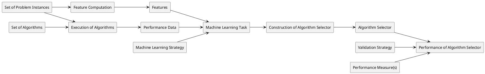
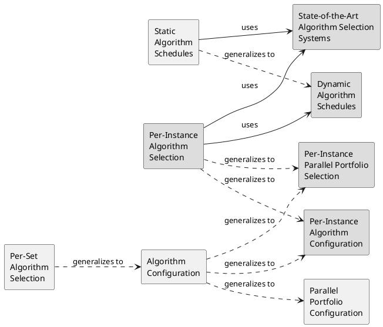
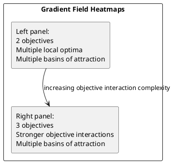

```md
# Automated Algorithm Selection: Survey and Perspectives

**Pascal Kerschke**  
kerschke@uni-muenster.de  
Information Systems and Statistics, University of Münster, 48149 Münster, Germany

**Holger H. Hoos**  
hh@liacs.nl  
Leiden Institute of Advanced Computer Science, Leiden University, 2333 CA Leiden, The Netherlands

**Frank Neumann**  
frank.neumann@adelaide.edu.au  
Optimisation and Logistics, The University of Adelaide, Adelaide, SA 5005, Australia

**Heike Trautmann**  
trautmann@uni-muenster.de  
Information Systems and Statistics, University of Münster, 48149 Münster, Germany

## Abstract

It has long been observed that for practically any computational problem that has been intensely studied, different instances are best solved using different algorithms. This is particularly pronounced for computationally hard problems, where in most cases, no single algorithm defines the state of the art; instead, there is a set of algorithms with complementary strengths. This performance complementarity can be exploited in various ways, one of which is based on the idea of selecting, from a set of given algorithms, for each problem instance to be solved the one expected to perform best. The task of automatically selecting an algorithm from a given set is known as the per-instance algorithm selection problem and has been intensely studied over the past 15 years, leading to major improvements in the state of the art in solving a growing number of discrete combinatorial problems, including propositional satisfiability and AI planning. Per-instance algorithm selection also shows much promise for boosting performance in solving continuous and mixed discrete/continuous optimisation problems.

This survey provides an overview of research in automated algorithm selection, ranging from early and seminal works to recent and promising application areas. Different from earlier work, it covers applications to discrete and continuous problems, and discusses algorithm selection in context with conceptually related approaches, such as algorithm configuration, scheduling or portfolio selection. Since informative and cheaply computable problem instance features provide the basis for effective per-instance algorithm selection systems, we also provide an overview of such features for discrete and continuous problems. Finally, we provide perspectives on future work in the area and discuss a number of open research challenges.

## Keywords

Automated algorithm selection, automated algorithm configuration, combinatorial optimisation, continuous optimisation, machine learning, meta-learning, feature-based approaches, exploratory landscape analysis, data streams

## 1 Introduction

It has long been observed that for well-studied computational problems for which several high-performance algorithms are available, there is typically no single algorithm that dominates all others on all problem instances. Instead, different algorithms perform best on different types of problem instances — a phenomenon also known as performance complementarity, which is often incorrectly attributed to an interesting theoretical result known as the no-free-lunch (NFL) theorem (Wolpert and Macready, 1995, 1997). In the context of search problems, the NFL theorem strictly only applies if arbitrary search landscapes are considered, while the instances of basically any search problem of interest have compact descriptions and therefore cannot give rise to arbitrary search landscapes (Culberson, 1998). Performance complementarity has been observed for practically all NP-hard decision and optimisation problems; these include propositional satisfiability, constraint satisfaction, a wide range of planning and scheduling problems, mixed integer programming and the travelling salesperson problem, as well as a broad range of continuous optimisation, machine learning and important polynomial-time-solvable problems (e.g., sorting and shortest path finding). For these and many other problems, theoretical results stating which algorithmic strategies work best are restricted to very limited classes of problem instances, so that it is generally unknown *a priori* which of several algorithms should be used to solve a given instance.

This gives rise to the increasingly prominent per-instance algorithm selection problem: given a computational problem, a set of algorithms for solving this problem, and a specific instance that needs to be solved, determine which of the algorithms can be expected to perform best on that instance. This problem has already been considered in the seminal work by Rice (1976), but it took several decades before practical per-instance algorithm selection methods became available (see, e.g., Cook and Varnell, 1997; Leyton-Brown et al., 2003; Xu et al., 2008). Since then, the problem and algorithms for solving it have steadily gained prominence, and by now have given rise to a large body of literature. Indeed, per-instance algorithm selection techniques have produced substantial improvements in the state of the art in solving a large range of prominent computational problems, including propositional satisfiability (SAT) and the travelling salesperson problem (TSP) (Xu et al., 2008, 2012; Kerschke et al., 2017).

It is important to note that there are several concepts that are quite closely related to that of per-instance algorithm selection, notably, per-set algorithm selection, algorithm configuration, algorithm schedules and parallel algorithm portfolios, which are all discussed in further detail in Section 2. Unfortunately, there is some potential for confusion, especially between per-instance algorithm selection and parallel algorithm portfolios, since in the literature, the term *portfolio* is sometimes used to refer to algorithm selectors. Furthermore, some of the most prominent and successful algorithm selection approaches from the literature, such as **SATzilla** (Xu et al., 2008) and **AutoFolio** (Lindauer et al., 2015b), implement combinations of algorithm scheduling and per-instance selection. While we will briefly discuss these more complex systems, along with approaches that select more than one algorithm to be run on a given problem instance, the focus of this survey is on pure per-instance algorithm selection, as outlined above and defined formally in Section 2.

We note that per-instance algorithm selection can be applied to optimisation problems, where the goal is to find an optimal (or best possible) solution according to a given objective function, as well as to decision problems, where one wants to determine, as quickly as possible, whether a solution satisfying certain conditions exists. Furthermore, it is useful to distinguish between continuous problems, where the components of a possible solution are real numbers (possibly constrained to a given interval), and discrete problems, where candidate solutions are discrete objects, such as graphs, permutations or vectors of integers.

©201X by the Massachusetts Institute of Technology  
*Evolutionary Computation* x(x): xxx-xxx

---

## 2 Algorithm Selection and Related Problems

Several surveys on algorithm selection have been published over the last decade. In the first extensive survey in this area, Smith-Miles (2009) summarised developments in the meta-learning, artificial intelligence and operations research communities. Adopting a cross-disciplinary perspective, she combined contributions from these areas under the umbrella of a “(meta-)learning” framework, which permitted her to identify parallel and closely related developments within these rather well-separated communities. However, this survey was published a decade ago and therefore does not cover recent developments and improvements to the state of the art in this fast-moving research area.

A more recent overview on algorithm selection was published by Kotthoff (2014). His survey presents an extensive, valuable guide to the automated algorithm selection literature up to 2014 and provides answers to several important questions, such as (i) what are the differences between static and dynamic portfolios, (ii) what should be selected (single solver, schedule, different candidate portfolios), (iii) what are the differences between online and offline selection, (iv) how should the costs for using algorithm portfolios be considered, (v) which prediction type (classification, regression, etc.) is most promising when training an algorithm selector, and (vi) what are differences between static and dynamic, as well as low-level and high-level features. Unfortunately, Kotthoff’s survey is restricted to algorithm selection for discrete problems and does not cover in any detail problem instance features, which provide the basis for per-instance algorithm selection.

Those two limitations were — at least partially — addressed by Muñoz Acosta et al. (2013). Although the title (“The Algorithm Selection Problem on the Continuous Optimization Domain”) appears to suggest otherwise, their survey mostly addresses the paucity of work on algorithm selection for continuous optimisation problems and the challenges arising in this context. Rather than providing an overview of algorithm selection approaches in this area, Muñoz Acosta et al. (2013) summarise promising results on discrete problems and hint at the possibility of achieving similar results in continuous optimisation. In their follow-up survey, Muñoz Acosta et al. (2015b) provide further insights into the existing ingredients for algorithm selection in the domain of continuous optimisation: benchmarks, algorithms, performance metrics, and problem characteristics obtained by exploratory landscape analysis. Still, they do not cover any work describing automated algorithm selection in this domain.

Our goal here is to not only update, but also to complement and extend these previous surveys. Firstly, we cover work on algorithm selection for discrete and continuous problems; as a result, we can compare the difficulties, challenges and solutions found in those domains. Secondly, one of the most important ingredients for successful algorithm selection approaches are informative (problem-specific) features. We therefore provide an overview of several promising feature sets and discuss characteristics that have been demonstrated to provide a strong basis for algorithm selection. Thirdly, we discuss several problems closely related to (and sometimes confused with) algorithm selection, such as automated algorithm configuration, algorithm schedules and parallel portfolios, pointing out differences, similarities and synergies. Of course, in light of the considerable and fast-growing body of literature on and related to algorithm selection, we cannot provide comprehensive coverage; instead, we selected contributions based on their impact, promise and conceptual contributions to the area.

The remainder of this survey article is structured as follows. In Section 2, we formally define the per-instance algorithm selection problem and situate it in the context of related problems, such as automated algorithm configuration. Next, Section 3 provides an overview of instance features for discrete and continuous optimisation problems that provide the basis for automated algorithm selection. Successful applications of algorithm selection in discrete and continuous optimisation are discussed in Sections 4 and 5, respectively. Finally, Section 6 provides additional perspectives on algorithm configuration and outlines several open challenges.

We consider the selection of algorithms for a given decision or optimisation problem \(P\). Specifically, the per-instance algorithm selection problem can be formulated as follows (see also Rice, 1976): Given a set \(I\) of instances of a problem \(P\), a set \(A = \{A_1, \ldots, A_n\}\) of algorithms for \(P\) and a metric \(m : A \times I \to \mathbb{R}\) that measures the performance of any algorithm \(A_j \in A\) on instance set \(I\), construct a selector \(S\) that maps any problem instance \(i \in I\) to an algorithm \(S(i) \in A\) such that the overall performance of \(S\) on \(I\) is optimal according to metric \(m\).

Of course, in general, we cannot hope to efficiently find perfect solutions to the per-instance algorithm selection problem, and instead, we strive to find selectors whose performance is as close as possible to that of a perfect selector on instance set \(I\). This is typically achieved by making use of informative and cheaply computable features \(f(i) = (f_1(i), \ldots, f_k(i))\) of the given problem instance \(i\). A general overview on the interplay of instance features, algorithm performance data, and algorithm selection is shown in Figure 1. The features are of key importance, and we will discuss them in more detail in the following section of this article.

We note that the performance of a (hypothetical) perfect per-instance algorithm selector, often also referred to as an oracle selector or virtual best solver (VBS), provides a lower bound on the performance of any realistically achievable algorithm selector (where we assume, w.l.o.g., that the given performance measure is to be minimised), and is often used in the context of assessing selector performance.

Another useful concept is that of the single best solver (SBS), which is the algorithm \(A_0\) with the best performance among all the \(A_j \in A\). The SBS is the solution to the closely related per-set algorithm selection problem, and its performance provides a natural upper bound on the performance of any reasonable per-instance algorithm selector. Furthermore, the difference or ratio between the performance of the SBS and VBS, also known as the VBS-SBS gap, gives an indication of the performance gains that can be realised, in the best case, by per-instance algorithm selection, and the fraction of the VBS-SBS gap closed by any per-instance algorithm selector \(S\) provides a measure of its performance (see, e.g., Lindauer et al., 2017b). State-of-the-art per-instance algorithm selectors for combinatorial problems have demonstrated to close between 25% and 96% of the VBS-SBS gap (see, e.g., Lindauer et al., 2015b). It is important to note that the VBS-SBS gap is large when the given set \(A\) of algorithms shows high performance complementarity on instance set \(I\), i.e., when different \(A_j \in A\) perform best on different \(i \in I\), and those algorithms that are best on some instances perform quite poorly on others. Generally, per-instance algorithm selection can be expected to achieve large performance gains over the single best algorithm if there is high performance complementarity within \(A\) and there is a set of sufficiently cheaply computable and informative instance features that can be leveraged in learning a good mapping from instances to algorithms.

It is very important to distinguish between per-set algorithm selection and per-instance algorithm selection. The former does not require any instance features and is typically done by exhaustive evaluation of all given algorithms on a set of problem instances deemed to be representative for those to be solved later. The connection between per-instance algorithm selection and related problems is shown in Figure 2. In many ways, algorithm competitions, such as the international SAT and planning competitions (see, e.g., Järvisalo et al., 2012; Vallati et al., 2015), can be seen as identifying solutions to per-set algorithm selection problems for broad sets of interesting instances, and competition winners are often seen as the single best algorithm for the respective problem. Sometimes, to reduce the computational cost for per-set algorithm selection, racing methods are used. These run candidate algorithms on an increasing number of instances, eliminating those from consideration whose performance is significantly below that of others, based on a statistical test (see, e.g., Maron and Moore, 1994; Birattari et al., 2002).

Per-set algorithm configuration can be seen as a special case of algorithm configuration, a practically very important problem that can be described as follows: Given an algorithm \(A\) whose performance (but not semantics) is affected by the settings of parameters \(p = (p_1, \ldots, p_k)\), a set \(C\) of possible values for \(p\) (called configurations of \(A\)), a set of problem instances \(I\) and a performance metric \(m\), find a configuration \(c^* \in C\) of \(A\) that achieves optimal performance on \(I\) according to \(m\). Note that the set \(C\) of configurations can be seen as corresponding to a set of algorithms, of which we wish to select the one that performs best. The key difference to algorithm selection is that this set can be very large, since it arises from combinatorial combinations of values of the individual parameters \(p_l\), which, in some cases, can take continuous values, leading to (potentially) uncountably infinite sets of algorithm configurations over which we have to optimise. Realistic algorithm configuration scenarios typically involve tens to hundreds of parameters (see, e.g., Hutter et al., 2009, 2011; López-Ibáñez et al., 2016; Ansótegui et al., 2015; Thornton et al., 2013; Kotthoff et al., 2017). Therefore, per-set algorithm selection techniques are typically not directly applicable to algorithm configuration, although racing techniques can be extended to work well in this case (see, e.g., López-Ibáñez et al., 2016; Pérez Cáceres et al., 2017). Per-set algorithm configuration is closely related to hyperparameter optimisation in machine learning; the main difference is that in algorithm configuration, performance is to be optimised on a possibly diverse set of problem instances, which often requires trading off performance on some instance against that achieved on others. In a sense, the typical hyperparameter optimisation problem encountered in machine learning is analogous to configuring a parameterised algorithm for performance on a single problem instance.

Since typical procedures used for building per-instance algorithm selectors have design choices that can be exposed as parameters, algorithm configuration techniques can be applied to optimise their performance on specific (sets of) selection scenarios. This has been done, with considerable success, in the recent AutoFolio selection system by Lindauer et al. (2015b), which we will discuss in further detail in Section 4.

The per-instance variant of the algorithm configuration problem, which can be seen as a generalisation of per-instance algorithm selection, largely remains an open challenge (see, e.g., Hutter et al., 2006; Belkhir et al., 2016, 2017), and we briefly discuss it further in Section 6.

Performance complementarity within a set of algorithms can be leveraged in ways that differ from per-instance algorithm configuration. One prominent approach is that of a parallel algorithm portfolio, where each algorithm from a given set \(A\) is run in parallel on a given problem instance \(i\) (see, e.g., Huberman et al., 1997; Gomes and Selman, 2001; Fukunaga, 2000). When applied to a decision problem, all runs are terminated as soon as one of the component algorithms has solved the given instance \(i\); for optimisation problems, the best solution achieved by any of the component algorithms at any given time is returned as the solution of the entire portfolio. Parallel algorithm portfolios are conceptually similar to ensemble methods in machine learning (see, e.g., Dietterich, 2000; Rokach, 2010). The key difference is that ensemble methods aggregate the results from the various component algorithms, e.g., by weighted or unweighted averaging.

When run on parallel hardware, algorithm portfolios typically achieve performance very close to that of the VBS in terms of wall-clock time, at the price of parallelism of degree equal to the number \(n\) of algorithms in \(A\). Of course, parallel portfolios can be run at lower actual degrees of parallelism, and even fully sequentially, using task-switching, as provided, e.g., by the operating system; in that case, the wall-clock time is typically close to that of \(n\) times the performance of the VBS in terms of the time required to solve a given instance of a decision problem, or to achieve a certain solution quality in case of an optimisation problem. Most of this overhead, which for large sets of algorithms can be very substantial, can be avoided by using per-instance algorithm selectors instead of parallel portfolios. Nevertheless, especially in the area of evolutionary computation, the concept of parallel algorithm portfolios has given rise to a growing body of research, in which the basic concept is often combined with additional techniques to achieve improved performance (see, e.g., Tang et al., 2014; Yuen and Zhang, 2015).

Although the term algorithm portfolio is sometimes used in the literature to refer to per-instance algorithm selectors and other techniques that leverage performance complementarity within a set of algorithms, we discourage this broad use as it easily leads to confusion between conceptually very different approaches. This potential confusion is easily avoided by restricting the term algorithm portfolio to parallel algorithm portfolios, consistent with the seminal work by Huberman et al. (1997). Recently, the concepts of per-instance algorithm selection and parallel portfolios have been combined, by selecting, on a per-instance basis, several algorithms to be run in parallel (Lindauer et al., 2015a). While this would not make sense in the context of a perfect algorithm selector, it can limit the impact of the poor selection decisions sometimes made in practice.

Algorithm schedules provide another way of exploiting performance complementarity (see, e.g., Lindauer, 2014; Lindauer et al., 2016). The key idea is to run a sequence of algorithms from a given set \(A\), one after the other, each for a given (maximum) time. Those cut-off times can differ between the stages of the schedule, and some algorithms may not be run at all. Static algorithm schedules, i.e., schedules that have been determined in a per-set fashion and are applied uniformly to any given problem instance \(i\), can be quite effective and are typically much easier to implement than per-instance algorithm selectors (see, e.g., Roussel, 2012). They are also used in state-of-the-art algorithm selection systems during a so-called pre-solving phase, in order to solve easy problem instances quickly and without the need for computing the instance features required for per-instance selection (see, e.g., Xu et al., 2012; Lindauer et al., 2015b). Unless stated explicitly otherwise, we will in the following, when discussing per-instance algorithm selectors, always refer to the pure per-instance algorithm selection problem, as defined above, without pre-solving schedules and other extensions found in cutting-edge algorithm selection systems.

Finally, the problem of predicting the performance of an algorithm \(A\) on a given problem instance \(i\) is closely related to per-instance algorithm selection. If computationally cheap and accurate performance prediction were possible, evidently, we could use performance predictors for our given algorithms \(A_1, \ldots, A_n\) and simply select the one predicted to perform best on \(i\). In practice, sufficient accuracy can be achieved for many problems using state-of-the-art regression techniques from machine learning, at moderate computational cost (Hutter et al., 2014b), and performance predictors form the basis for one of the main approaches to per-instance algorithm selection. At the same time, other approaches, such as cost-based classification, exist and also find use in state-of-the-art algorithm selection systems, as explained in the following sections.

### Figure 1

**Caption:** Figure 1: Schematic overview of interplay between problem instance features (top left), algorithm performance data (bottom left), selector construction (center) and the assessment of selector performance (bottom right).

**Natural-language explanation:**  
This figure summarizes the overall workflow of feature-based algorithm selection. On the left, a collection of problem instances and a collection of algorithms are used to generate two key ingredients: instance features and algorithm performance data. The features describe each problem instance, while the performance data record how well each algorithm works on each instance. These two ingredients are then used in the center of the figure to define a machine-learning task, choose a learning strategy (for example, classification or regression), and train an algorithm selector using a set of machine-learning algorithms. The selector can be further improved by feature selection and hyperparameter tuning. On the right, the resulting selector is evaluated using a validation strategy and one or more performance measures such as PAR10 or ERT.

**ASCII / plain-text diagram:**
```text
[Set of Problem Instances] ----> [Feature Computation] ----> [Features]
          |                                                   |
          v                                                   v
[Execution of Algorithms] ------------------------------> [Performance Data]

[Features] + [Performance Data]
                 |
                 v
       [Machine Learning Task]
                 |
                 v
     [Machine Learning Strategy]
                 |
                 v
 [Construction of Algorithm Selector]
                 |
                 v
        [Algorithm Selector]
                 |
                 v
 [Performance of Algorithm Selector]
                 |
                 v
 [Validation Strategy + Performance Measure(s)]
```

**PlantUML:**


**Verbatim text inside figure (from source):**
- Set of Feature Sets {Feature Set₁, …, Feature Setₚ}
- Problem Characterization
- Feature (Set) Computation
- Features
- Set of Problem Instances {Instance₁, …, Instanceₙ}
- Execution of Algorithms
- Set of Algorithms {Algorithm₁, …, Algorithmₘ}
- Benchmarking & Performance Data Collection
- Performance Data
- Machine Learning for Algorithm Selection
- Feature Selection
- Construction of Algorithm Selector
- Set of Machine Learning Algorithms {ML-Algorithm₁, …, ML-Algorithmₖ}
- (Hyper-)Parameter Tuning
- Machine Learning Task
- Machine Learning Strategy {Classification, Regression, …}
- Training
- Algorithm Selector
- Performance of Algorithm Selector
- Performance Evaluation
- Validation Strategy {Holdout, CV, …}
- Performance Measure(s) {PAR10, ERT, …}

---

### Figure 2

**Caption:** Figure 2: Connections between per-instance algorithm selection and related problems.

**Natural-language explanation:**  
This figure situates per-instance algorithm selection among several closely related concepts. Per-instance algorithm selection sits near the center and is connected to state-of-the-art algorithm selection systems, static algorithm schedules, dynamic algorithm schedules, algorithm configuration, per-instance algorithm configuration, and parallel portfolio approaches. Solid arrows indicate a “uses” relationship, while dashed arrows indicate a “generalizes to” relationship. Dotted outlines are used for concepts involving parallel algorithm runs in application, and grey fill indicates per-instance variants. The figure emphasizes that modern algorithm selection systems often combine multiple ideas rather than relying on pure per-instance selection alone.

**ASCII / plain-text diagram:**
```text
                         [State-of-the-Art Algorithm Selection Systems]
                                   ^              ^               ^
                                   |              |               |
                                   |              |               |
                     [Per-Instance Algorithm Selection]       [Static Algorithm Schedules]
                              |        \                         |
                              |         \                        v
                              v          v              [Dynamic Algorithm Schedules]
              [Per-Instance Algorithm Configuration]   [Per-Instance Parallel Portfolio Selection]

[Per-Set Algorithm Selection] --> [Algorithm Configuration] --> [Per-Instance Algorithm Configuration]
                                      |
                                      +--> [Parallel Portfolio Configuration]
                                      |
                                      +--> [Per-Instance Parallel Portfolio Selection]
```

**PlantUML:**


**Verbatim text inside figure (from source):**

Legend / labels:
- dashed arrow: generalizes to …
- solid arrow: uses …
- dotted rounded box: parallel algorithm runs (in application)
- grey fill: per-instance

Nodes:
- Per-Set Algorithm Selection
- Algorithm Configuration
- State-of-the-Art Algorithm Selection Systems
- Per-Instance Algorithm Selection
- Static Algorithm Schedules
- Parallel Portfolio Configuration
- Per-Instance Parallel Portfolio Selection
- Per-Instance Algorithm Configuration
- Dynamic Algorithm Schedules

---

## 3 Features for Discrete and Continuous Problems

Linking algorithm performance on an instance \(i\) to instance characteristics forms a central part of automated algorithm selection and several related problems. For this purpose, automatically computable features \(f(i) = (f_1(i), \ldots, f_k(i))\) are required, ideally with the following properties: Firstly, features should be informative, in that they allow for a sufficient distinction between different instances; they should also be interpretable, so that feature values enable an expert to gain maximum insight into instance properties. Furthermore, features should be cheaply computable, so that the advantages gained by selecting an algorithm based on them is not outweighed by the cost of feature computation. Features should also be generally applicable, i.e., they should be effectively and efficiently computable for a broad range of problem instances, rather than being restricted, e.g., to small instance sizes. Finally, the features \(f_j\) should be complementary, in that redundant sets of features are not only computationally wasteful, but can also cause problems when used by certain machine learning algorithms as a basis for algorithm selection and related problems.

In the following, we provide an overview of commonly used instance features for several prominent discrete and continuous problems — not only to illustrate what kind of features are useful in the context of per-instance algorithm selection, but also to draw attention to an important and somewhat underrated research topic of significant importance to tasks beyond algorithm selection. In particular, informative instance features can provide important insights into strengths and weaknesses of a given algorithm, and hence play a crucial role in devising improvements. We generally distinguish between problem-specific features that are closely based on particular aspects of the problem to be solved, such as the number of clauses in instances of propositional satisfiability problems, and generic features that are more broadly applicable, such as high-level statistics over information gleaned from short “probing” runs of a solver for the given problem.

### 3.1 Discrete problems

To give concrete examples, and in light of the importance of problem-specific features, we will focus on three of the most prominent and well-studied discrete combinatorial problems: propositional satisfiability (and related problems), AI planning and the travelling salesperson problem (TSP).

#### Propositional satisfiability and related problems

The propositional satisfiability problem (SAT) is to determine whether for a given formula \(F\) in propositional logic, containing Boolean variables \(X_1, \ldots, X_N \in \{true, false\}\), there exists an assignment of logical values to the variables such that \(F\) evaluates to true; such a variable assignment is said to satisfy \(F\). Typically, the problem is restricted to formulae \(F\) in conjunctive normal form (CNF), i.e., \(F\) consists of conjunctions (\(\wedge\)) of so-called clauses, which are disjunctions (\(\vee\)) of Boolean variables \(X_j\) and their negations \(\neg X_j\). A CNF-formula \(F\) evaluates to true, if each of its clauses is satisfied simultaneously. SAT is one of the most prominent and intensely studied combinatorial decision problems and has important applications in hard- and software verification (see, e.g., Biere et al., 2009). Given the ties to other combinatorial problems, improvements in SAT often also impact widely studied related problems, such as the maximum satisfiability (MaxSAT) problem, in which the objective is to find a variable assignment that maximises the number of satisfied CNF clauses.

The first large collection of features for SAT (and thus also MaxSAT) instances was provided by Nudelman et al. (2004b). Despite the rather simple structure of SAT instances, the authors devised nine different feature sets and a total of 91 features, which characterise a given CNF formula from a multitude of perspectives. Eleven problem size features describe SAT instances based on summary statistics of their numbers of clauses and variables. A set of variable-clause graph (VCG) features comprises ten node degree statistics based on a bipartite graph over the variables and clauses of a given instance. Interactions between the variables are captured by four variable graph (VG) features; these are the minimum, maximum, mean and coefficient of variation of the node degrees for a graph of variables, in which edges connect pairs of variables that jointly occur in at least one clause. Similarly, the set of clause graph (CG) features contains seven node degree statistics of a graph whose edges connect clauses that have at least one variable in common, as well as three features based on weighted clustering coefficients for the clause graph. Thirteen balance features capture the balance between negated and unnegated variables per clause, their overall occurrences across all clauses, as well as fractions of unary, binary and ternary clauses, whereas six further features quantify the degree to which the given \(F\) resembles a Horn formula (a restricted type of CNF formula, for which SAT can be decided efficiently). The solution of a linear program representing the given SAT instance provides the basis for six LP-based features. Finally, there are two sets of so-called probing features, which are based on performance statistics over short runs of several well-known SAT algorithms (based on DPLL and stochastic local search, two prominent approaches to solving SAT) and capture the degree to which these make early progress on the given instance.

Some of the feature sets — specifically, the CG, VG and LP-based features, as well as some of the VCG, balance and DPLL-probing features — are computationally quite expensive (see, e.g., Xu et al., 2008; Hutter et al., 2014b) and consequently not always useful in the context of practical algorithm selection approaches. Similarly, the algorithm runs for probing features are limited to a very small part of the overall time budget for solving a given instance, to make sure that sufficient time remains available for running the selected SAT solver.

A decade later, Hutter et al. (2014b) — building on the work by Nudelman et al. (2004b) — introduced a set of 138 SAT features. While they removed some features from the earlier sets, much of the set remained the same. The most significant changes were an extension of the CG and VG feature sets by five new features each, as well as three new feature sets accounting for an additional 48 features. The VG feature set was extended by so-called diameter features, which capture statistics based on the set of longest shortest paths from one variable to any other one in the graph. Also, instead of the weighted clustering coefficients based on the CG (as done by Nudelman et al., 2004b), Hutter et al. (2014b) used a set of clustering coefficients that measure the CG’s “local cliqueness”. Furthermore, they introduced 18 novel clause learning features, which summarise information gathered during short runs of a prominent SAT solver, ZCHAFF_RAND, that learns conflict clauses during its search for a satisfying assignment (Mahajan et al., 2004). Another 18 features are derived from estimates of variable bias obtained from the SAT solver VARSAT (Hsu and McIlraith, 2009); these features essentially capture statistics over estimates for the probability for variables to be true, false or unconstrained in every satisfying assignment. Finally, Hutter et al. (2014b) proposed to use the actual feature costs, in terms of the running time required for computing each of the 11 feature sets; they noted that the diameter and survey propagation features tend to be expensive to compute and may thus be of limited usefulness in the context of per-instance algorithm selection.

A well-known generalisation of SAT is the problem of answer set programming (ASP; see, e.g., Baral, 2003), which deals with determining so-called “answer sets”, i.e., stable models for logic programs. Many combinatorial problems can be presented in ASP in a rather straightforward way and solved, at least in principle, using general-purpose ASP solvers. Because of the close relationship between ASP and SAT, many features for ASP instances are closely related to the SAT features outlined above. One of the most widely used collections of ASP features has been proposed by Maratea et al. (2012); it is comprised of 52 features, which can be grouped into four sets. Three of these feature sets closely correspond to well-known SAT features (Nudelman et al., 2004b) and contain eight problem size, three balance and two proximity to Horn features. In addition, Maratea et al. (2012) proposed 39 ASP-specific features, such as the numbers of true and disjunctive facts, the fraction of normal rules and constraints, and several combinations of the latter.

#### AI planning

Automated planning (also known as AI planning) is one of the most prominent challenges in artificial intelligence (see, e.g., Ghallab et al., 2004). While there are many variants of AI planning problems, the basic setting (also known as classical planning) involves a set of actions with associated pre-conditions, deterministic effects and sometimes costs, an initial state and one or more goal states. The objective in satisficing planning is to find a valid plan, i.e., a sequence or partially ordered set of actions that, when applied to the initial state, reach a goal state, or to determine that no valid plan exists. In the optimisation variants of planning problems, the objective is to find plans of minimal length or cost. Most variants of AI planning are at least NP-hard, and satisficing classical planning is known to be PSPACE-complete. AI planning algorithms have important applications, e.g., in robotics, gaming, logistics and software test case generation; they are also used for the operation and management of traffic, energy grids and fleets of shared vehicles.

In classical planning, there is an important distinction between a problem instance and a so-called planning domain. This distinction arises from the fact that states and actions are specified in an abstract way, using so-called predicates and operators that can be instantiated to yield specific properties of states and specific actions, respectively (see, e.g., Ghallab et al., 2004). For example, in a planning problem that involves moving goods using a fleet of trucks, there might be a predicate stating that a specific truck is in a given location, and an operator that moves the truck from one location to another. A planning domain is a class of planning instances with the same set of specific predicates and operators. Planning domains and instances can be concisely described in a widely used, uniform language called PDDL (Planning Domain Definition Language; see, e.g., Gerevini and Long, 2005).

Howe et al. (1999) were among the first to characterise AI planning instances by simple features, namely, the number of actions, predicates, objects, goals, as well as the number of predicates used to specify the initial state. A decade later, Roberts et al. (2008) introduced a substantially extended set of 41 features, which includes summary statistics of the domain and instance files (16 and three features, respectively), but also captures 13 high-level features of the given planning instance in terms of its PDDL requirements. They also considered nine features based on the so-called causal graph (CG) (i.e., a graph capturing causal dependencies between states), such as the number of vertices in the CG and their average degree, as well as various metrics computed from the edges of the CG.

Also based on the idea of using graph properties, Cenamor et al. (2013) proposed a total of 47 features, which capture the information contained in causal and domain transition graphs. The latter represent the permissible transitions between states. The causal graph features of Cenamor et al. (2013) can be categorised into four different sets: (i) four general graph properties, (ii) four features based on various ratios of graph properties, (iii) 12 statistical aggregations over the entire graph, and (iv) six additional, high-level statistics for states with defined values in the goal specifications. The remaining 21 domain transition graph features include (i) three general graph properties (number of edges and states, sum of edge weights) and (ii) 18 statistical features similar to those of the causal graph.

The most recent and extensive collection of AI planning instance features was prepared by Fawcett et al. (2014). It contains 12 sets with 311 features in total, covering most of the features from earlier work, as well as a broad range of new ones. The first three sets extend the 16 domain, three problem and 13 language requirement features from Roberts et al. (2008) by two, four and 11 new features, respectively. Four further feature sets are based on a translation of the given PDDL instance into a finite domain representation (FDR), by means of a well-known AI planning system, FAST DOWNWARD (Helmert, 2006). This FDR representation, as well as information collected during the translation and preprocessing, gives rise to sets of 19, 19 and eight features, respectively. Building on the work of Cenamor et al. (2013), Fawcett et al. (2014) also provide a set of 41 causal and domain transition graph features. Six features are computed from information gathered during the preprocessing phases of LPG-TD (Gerevini et al., 2003), another well-known planning system, while 10 further features capture information produced by the TORCHLIGHT local search analysis tool (Hoffmann, 2011); another 16 features are determined based on the trajectories of one-second probing runs of FAST DOWNWARD. Furthermore, the 115 SAT features from Xu et al. (2012) are included, based on a SAT representation of the given planning instance (in form of a CNF with a planning horizon of 10). The final feature set introduced by Fawcett et al. (2014) contains information on whether the previously outlined sets were computed successfully and additionally captures the respective computation times.

#### Travelling salesperson problem

The travelling salesperson problem (TSP) is one of the most intensely studied combinatorial optimisation problems. For decades, it has been the subject of a large body of work and continues to be highly relevant for theoretical analyses, design of algorithms and practical applications ranging from logistics to manufacturing (see, e.g., Applegate et al., 2007). In the TSP, given an edge-weighted graph, whose vertices are often called cities and whose edges represent the cost of travelling from one city to another, the objective is to find a Hamiltonian cycle with minimum total weight, i.e., a minimum-cost trip that passes through every city exactly once. Most work on the TSP focusses on the special case of the two-dimensional Euclidean TSP, where cities are locations in the Euclidean plane, and costs correspond to the Euclidean distances between cities.

The development of features for TSP instances has been initiated by Smith-Miles and van Hemert (2011), who proposed the following features for characterising a given TSP instance: (1) coordinates of the instance’s centroid, (2) average distance from all cities to the centroid, (3 & 4) standard deviation, as well as fraction of distinct distances within distance matrix, (5) size of the rectangle enclosing the instance’s cities, (6 & 7) standard deviation, as well as coefficient of variation of the normalised nearest neighbour distances, (8) ratio of number of clusters found by GDBSCAN (Sander et al., 1998) to the number of all cities, (9) variance of number of cities per cluster, (10) ratio between number of outliers and all cities, and (11) the number of cities. Furthermore, Kanda et al. (2011) and Kovařík and Málek (2012) proposed features derived from the distance matrix of a given TSP instance.

Nearly all features from these earlier studies were combined by Mersmann et al. (2013) and further extended, leading to a collection of six TSP feature sets with a total of 68 features, many of which are derived from the distance matrix and from the spatial distribution of the cities in the Euclidean plane. More precisely, the distance matrix is condensed into distance and mode features, and the distribution of cities is captured by a set of cluster features, based on multiple runs of GDBSCAN, as well as convex hull features, which quantify the spread of the cities in the Euclidean plane. The closeness of neighbouring cities is measured by various nearest neighbour statistics, and a final set of features is comprised of the depth and edge costs of the minimum spanning tree for the given TSP instance.

Hutter et al. (2014b) developed a set of 64 TSP features that includes some of the previously outlined instance characteristics as well as new probing features. The latter are based on 20 short runs of a well-known local search solver (LK; Lin and Kernighan, 1973), as well as single short runs of the state-of-the-art exact TSP solver, Concorde (Applegate et al., 2007). Probing features were also used by Kotthoff et al. (2015).

The most comprehensive collection of TSP features was provided by Pihera and Musliu (2014). Their set of 287 features builds on the earlier work by Hutter et al. (2014b), but additionally includes instance characteristics derived from the distances of the cities to the convex hull, the number of intersections of locally optimal tours, and statistics of disjoint tour segments. The largest group of new features is based on strongly and weakly connected components of so-called \(k\)-nearest neighbour graphs, for many values of \(k\).

Finally, we see significant potential for new features based on recent work on funnel-structures in the search landscapes associated with TSP instances (Ochoa et al., 2015; Ochoa and Veerapen, 2016). Considering that highly related aspects of global search space structure have shown to play an important role in algorithm selection for continuous optimisation problems (Bischl et al., 2012; Kerschke and Trautmann, 2018), features of this nature may also prove to be useful for discrete optimisation problems, such as the TSP.

#### Other combinatorial problems

There is a sizeable body of work on instance characteristics for other combinatorial problems, including the epistasis measures by Davidor (1991) and Fonlupt et al. (1998), indicators for the hardness of quadratic assignment (QAP, Angel and Zissimopoulos, 2002) or constraint satisfaction problems (CSP, Boukeas et al., 2004), features for so-called orienteering problems, which generalise the TSP by distinguishing between static and dynamic locations (Bossek et al., 2018), and variable interaction measures for combinatorial optimisation problems (Seo and Moon, 2007). A detailed discussion of these problems and the respective instance features (some of which are quite generic and can be applied to a range of discrete combinatorial problems) is beyond the scope of this survey; however, we note that these features, like the problem-specific features described earlier in this section, provide a good basis for per-instance algorithm selection and related tasks.

### 3.2 Continuous problems

We now turn our attention to the optimisation of continuous fitness landscapes (Wright, 1932; Kauffman, 1993). In contrast to discrete optimisation problems, which differ very substantially from each other (consider, for example, SAT vs. TSP) and require problem-specific features for characterising instances, the general idea of continuous optimisation problems can be expressed uniformly, in a rather straightforward way: (w.l.o.g.) find the global minimum of an objective or fitness function \(f : X \to Y\), which maps vectors of variables, \(x = (x_1, \ldots, x_d)\), from a \(d\)-dimensional decision space \(X \subseteq \mathbb{R}^d\) (whose values may be subject to additional constraints) to \(p\)-dimensional objective or fitness values \(y = (y_1, \ldots, y_p) := f(x) \in Y \subseteq \mathbb{R}^p\) (Jones, 1995; Stadler, 2002). Unfortunately, in most real-world scenarios, the exact mathematical representation of the fitness function \(f\) is unknown. Thus, its optimisation often has to be handled as a black-box problem, and consequently becomes difficult and expensive. In light of this, it is especially useful to characterise a specific problem by means of (informative) features, based on which it is possible to select a suitable optimisation algorithm.

As there only exist preliminary studies on the characterisation of multi-objective (\(p \ge 2\)) problems (see, e.g., Kerschke et al., 2016b) — which we will discuss later — we will in the following mainly focus on the manifold of characterisation approaches for single-objective (\(p = 1\)) continuous optimisation problems.

#### Single-objective continuous problems

Overviews on the early works related to this problem class can be found in Pitzer and Affenzeller (2012), Malan and Engelbrecht (2013), Sun et al. (2014) and Muñoz Acosta et al. (2015b). However, in contrast to recent studies, the majority of the studies covered by those surveys proposed measures for characterising white-box problems — i.e., problems, whose landscapes are entirely known upfront — rather than cheap, informative and automatically computable landscape features as needed for black-box problems. Obviously, only the latter are beneficial for automated algorithm selection (or related problems). Nevertheless, we briefly discuss some noteworthy contributions to the characterisation of white-box problems, as they form the basis for recent developments.

In the 1990s, landscapes were classified into easy and hard problems — from an optimisation algorithm’s point of view. While Jones and Forrest (1995) (and later Müller and Sbalzarini, 2011) proposed fitness distance correlation as a key characteristic, Rosé et al. (1996) suggested the density of states for solving the binary classification task. Furthermore, so-called epistasis measures (Naudts et al., 1997; Rochet et al., 1997) quantify the influence of single variables (or bits, in case of a bit-representation of \(x\)) on the problem’s fitness, which in turn can be used to rank the landscapes according to their difficulty. The information content measures from Vassilev et al. (2000) provide another basis for quantifying hardness.

In the following decade, attention shifted from characterising problem difficulty to ruggedness. Depending on fitness evolvability portraits (Smith et al., 2002), autocorrelation coefficients, number and distribution of optima (Brooks and Durfee, 2003), or entropy (Malan and Engelbrecht, 2009), landscapes were categorised into rugged, neutral and smooth problems. During that time, researchers also focused on problem multimodality (Preuss, 2015), i.e., the analysis of the problems’ landscapes with respect to multiple local and/or global optima. For instance, the barrier trees of Flamm et al. (2002) provided means for identifying basins of attractions, local optima and saddle points within the landscapes, and the dispersion metrics from Lunacek and Whitley (2006) enabled an approximate estimation of the degree of multimodality of a given landscape.

Pitzer and Affenzeller (2012) combined these approaches under the term fitness landscape analysis (FLA). However, as the majority of those characteristics was proposed for white-box settings, they are not useful for automated algorithm selection. With the introduction of Exploratory Landscape Analysis (ELA), Mersmann et al. (2011) were the first to explicitly develop landscape features for use in black-box optimisation (BBO) — and hence for algorithm selection in continuous optimisation. As shown in Figure 3, they introduced six feature sets (curvature, convexity, levelset, local search, meta models and y-distribution), combining a total of 50 features, and used these to predict eight different problem characteristics, such as the global structure (none, weak, strong, deceptive) and the degree of multimodality (none, low, mediocre, high). We note that the attributes of the latter “high-level” properties can only be assigned by someone with knowledge of the entire problem, whereas the former “low-level” features can be automatically computed based on a small, but representative sample of points — the so-called initial design.

Following the idea of automatically computable numerical features, some of the earlier white-box landscape characteristics have been adapted to the black-box context. For instance, Muñoz Acosta et al. (2012, 2015a) refined the information content features and extended them by basin of attraction features. Similarly, Abell et al. (2013) proposed hill climbing and random point features, whose general idea stems from the local search and fitness distance correlation methods, respectively, and enhanced them by problem definition measures.

In addition, several new feature sets have been introduced in recent years: Kerschke et al. (2014) discretised the continuous search space into a grid of cells and used a Markov-chain-inspired cell-mapping approach to obtain features, which measure — amongst others — the sizes of the basins of attraction. However, due to the curse of dimensionality, those features are only practically applicable to low-dimensional problems. A much more scalable measure for the basins of attraction and the global structure of a landscape are the nearest better clustering features (Kerschke et al., 2015), which provide the means to distinguish funnel-shaped from rather random global structures. The most recently published features based on aggregated information of neighbouring points are the bag of local landscape features by Shirakawa and Nagao (2016). Furthermore, the length scale features of Morgan and Gallagher (2015) measure the variable scaling based on the ratio between the change in objective space and distance in decision space for pairs of distinct observations from the initial design.

We note that work in this area is not restricted to the development of features or problem characteristics. For instance, Malan et al. (2015) and Bagheri et al. (2017) investigated constrained optimisation problems, whereas Kerschke et al. (2016a) showed that landscape features already possess sufficient information if they are computed based on rather small samples of \(50 \cdot d\) observations (where \(d\) is the dimensionality of the given optimisation problem).

Until recently, the simultaneous use of feature sets from different research groups has been cumbersome and hence rarely practiced. However, with the development of flacco (Kerschke, 2017b,c), an R-package that provides source code for most of the previously listed ELA features, this obstacle has been overcome. Since then, the complementarity of the various features and their potential usefulness as a basis for algorithm selection has been demonstrated in several studies. We provide a detailed overview of this work later (see Section 5). Note that by using a platform-independent web-application of the flacco package  
<https://flacco.shinyapps.io/flacco/>  
(Hanster and Kerschke, 2017), researchers and practitioners, who are unfamiliar with R, can also benefit from this extensive collection of more than 300 landscape features. Belkhir et al. (2016, 2017) were among the first to leverage the ELA features provided by flacco for per-instance algorithm configuration.

#### Multi-objective continuous problems

While the characterisation of single-objective continuous optimisation problems has been studied for over two decades, only preliminary studies have been conducted with respect to informative features of multi-objective problems. For instance, Kerschke and Trautmann (2016) used features that have been developed for single-objective problems and used them to cluster some well-known and frequently used multi-objective benchmark problems. However, those features do not capture characteristics that are especially important to multi-objective problems, such as interaction effects between the objectives. Eventually, techniques that were originally aimed at measuring variable interactions (see, e.g., Reshef et al., 2011; Sun et al., 2017) could help to overcome these limitations.

Kerschke et al. (2016b, 2018b) investigated locally efficient sets and the corresponding locally optimal fronts (i.e., the multi-objective equivalents of local optima) and proposed measures — on the basis of those sets and fronts — which enable the distinction of multi-objective problems according to their degree of multimodality. Interestingly, those studies revealed that even in the case of rather simple multi-objective problems, strong interaction effects between the objectives exist. Thus, in order to improve the understanding of multi-objective problems, Kerschke and Grimme (2017) introduced new techniques for visualising them. Their approach, dubbed gradient field heatmaps (see, e.g., Figure 4), is based on visualising the decision space, but nevertheless clearly reveals interactions between the objectives — in the form of rugged landscapes with several basins of attraction. Unexpected findings of this kind (see, e.g., Grimme et al., 2018) indicate that research in this area is still at an early stage, leaving many open challenges for future work (see Section 6 for further details).

### Figure 3

**Caption:** Figure 3: Overview of connections between “high-level” properties (grey rectangles) and “low-level” features (white ellipses), taken from Mersmann et al. (2011).

**Natural-language explanation:**  
This figure shows how low-level exploratory landscape features relate to higher-level qualitative properties of optimisation landscapes. The grey rectangles represent broad properties that one might ultimately want to understand, such as plateaus, global structure, search space homogeneity, global-to-local optima contrast, variable scaling, separability, multimodality, and basin size homogeneity. The white ellipses in the middle represent concrete feature groups that can actually be computed from sampled points, namely curvature, meta model, y-distribution, levelset, convexity, and local search. The arrows indicate which feature groups are informative for which higher-level properties. In other words, the figure explains how measurable numeric descriptors can serve as proxies for broader structural characteristics of a continuous optimisation landscape.

**ASCII / plain-text diagram:**
```text
High-level properties            Low-level features              High-level properties
---------------------            ------------------              ---------------------
Plateaus              <--------  Curvature               ------> Variable Scaling
Plateaus              <--------  Meta Model              ------> Variable Scaling
Global Structure      <--------  Meta Model              ------> Separability
Plateaus              <--------  y-Distribution          ------> Multimodality
Global Structure      <--------  y-Distribution          ------> Multimodality
Global Structure      <--------  Levelset                ------> Multimodality
Search Space Homogeneity <-----  Levelset
Global Structure      <--------  Convexity               ------> Multimodality
Search Space Homogeneity <-----  Convexity               ------> Basin Size Homogeneity
Search Space Homogeneity <-----  Local Search            ------> Multimodality
Global to Local Optima Contrast < Local Search           ------> Basin Size Homogeneity
```

**PlantUML:**
```plantuml
@startuml
left to right direction

rectangle "Plateaus" as P
rectangle "Global Structure" as GS
rectangle "Search Space\nHomogeneity" as SSH
rectangle "Global to Local\nOptima Contrast" as GLOC

ellipse "Curvature" as C
ellipse "Meta Model" as MM
ellipse "y-Distribution" as YD
ellipse "Levelset" as LS
ellipse "Convexity" as CV
ellipse "Local Search" as LOC

rectangle "Variable Scaling" as VS
rectangle "Separability" as SEP
rectangle "Multimodality" as MULTI
rectangle "Basin Size\nHomogeneity" as BSH

C --> P
C --> VS

MM --> P
MM --> GS
MM --> VS
MM --> SEP
MM --> MULTI

YD --> P
YD --> GS
YD --> MULTI

LS --> SSH
LS --> GLOC
LS --> MULTI
LS --> BSH

CV --> GS
CV --> SSH
CV --> MULTI
CV --> BSH

LS --> SSH
LS --> GLOC

LS --> MULTI
LS --> BSH

LS --> GLOC

LS --> SSH

LS --> MULTI
@enduml
```

**Verbatim text inside figure (from source):**

Left:
- Plateaus
- Global Structure
- Search Space Homogeneity
- Global to Local Optima Contrast

Center:
- Curvature
- Meta Model
- y-Distribution
- Levelset
- Convexity
- Local Search

Right:
- Variable Scaling
- Separability
- Multimodality
- Basin Size Homogeneity

---

### Figure 4

**Caption:** Figure 4: Exemplary visualisations of the gradient field heatmaps proposed by Kerschke and Grimme (2017). The images show the decision spaces of continuous optimisation problems with two (left) and three objectives (right), respectively. As a result of the interactions between the local optima of the different objectives (indicated by circles, squares and triangles), the landscapes show multiple basins of attraction.

**Natural-language explanation:**  
This figure gives visual examples of what gradient field heatmaps look like for multi-objective optimisation problems. The left panel corresponds to a problem with two objectives and the right panel to a problem with three objectives. The different symbols mark local optima belonging to the different objectives. The colored regions and contour patterns show how the gradients induced by these objectives interact across the decision space. Instead of producing a simple single-basin structure, the combined effect creates several basins of attraction separated by clear boundaries. The figure is meant to illustrate that even relatively simple multi-objective problems can have rich and rugged search structures because of objective interaction.

**ASCII / plain-text explanation:**
```text
Left panel:
- 2-objective decision space
- Several marked local optima (circles / squares)
- Colored flow regions indicate attraction behavior
- Boundaries between regions reveal multiple basins

Right panel:
- 3-objective decision space
- Marked local optima (circles / squares / triangles)
- Interactions among objectives create a more complex partition
- Dark/central region and surrounding contours indicate competing pulls
- Result: several distinct basins of attraction
```

**PlantUML (conceptual, schematic only):**


---

## 4 Algorithm Selection for Discrete Problems

Over the years, algorithm selection techniques have achieved remarkable results in several research areas — especially for discrete combinatorial problems (see, e.g., Smith-Miles, 2009; Kotthoff, 2014). However, due to the significant differences between various problems, not only the respective instance features, but also solvers and algorithm selectors vary considerably. Therefore, it is impossible to cover all work in this area; instead, in the following, we focus on a small number of particularly well-known problems: propositional satisfiability (SAT) and related problems, AI planning and the travelling salesperson problem (TSP).

### Propositional satisfiability and related problems

Historically, some of the first and most widely known successes of per-instance algorithm selection have been achieved in the context of solving the propositional satisfiability problem (SAT). We note that several approaches described in the following can be applied to closely related problems (such as MaxSAT) in a rather straightforward way.

#### SATzilla2003 and SATzilla2007

Within the highly contested area of SAT, the first AS system to outperform stand-alone SAT solvers was SATzilla. While its first version, denoted **SATzilla2003** (Nudelman et al., 2004a), still showed (minor) weaknesses — it “only” ranked second (twice) and third in the 2003 SAT Competitions — its (enhanced) successor, **SATzilla2007** (Xu et al., 2008), won multiple prizes (3x first, 2x second and 2x third) in the 2007 SAT Competition. Despite the differences with respect to their success, the general working principles underlying both systems are quite similar. During the actual construction phase, pre- and backup solvers are identified, based on the performances of the given solvers on training data. All instances that have not been solved by the respective pre-solvers are then used for training separate regression models per solver, which in turn are used for selecting a promising subset of “main solvers”.

The main difference between SATzilla2003 and SATzilla2007 lies in the regression models used for the main algorithm selection phase: While the former used empirical hardness models (Leyton-Brown et al., 2002) based on ridge regression (see, e.g., Bishop, 2006), the latter employed hierarchical hardness models (Xu et al., 2007), more precisely sparse multinomial logistic regression (SMLR; see, e.g., Krishnapuram et al., 2005). The latter version of SATzilla sequentially runs up to two manually selected pre-solvers; if these fail to solve the given instance within a user-specified running time budget, instance features are computed and used to predict (and sequentially run) the best solver(s) from the given set \(A\). The system either terminates once the given SAT instance has been solved, or when a user-specified cutoff time is reached.

Xu et al. (2008) compared different versions of SATzilla2007 on 2,300 random (RAND), 1,490 crafted/handmade (HAND) and 1,021 application/industrial (INDU) instances, using the same setup as the 2007 SAT Competition. For this purpose, they used a total of 48 features and identified between one and two pre-solvers, one backup solver, as well as three to five main solvers from a given set \(A\) (which differed between RAND, HAND and INDU). Notably, their pre-solvers solved between 32 and 62% of the instances — despite running for only seven CPU seconds at most. Ultimately, SATzilla2007 ranked first (inter alia) in the SAT & UNSAT (RAND and HAND) categories of the competition, as well as in UNSAT (HAND).

#### 3S

Kadioglu et al. (2011) proposed a hybrid approach, denoted semi-static solver schedules (3S), which combines algorithm selection with solver scheduling. Since it can be very expensive to determine schedules over all solvers from a given set, Kadioglu et al. (2011) devised a different approach, in which they partitioned the (normalised) instance feature space for a given training set by means of g-means (Hamerly and Elkan, 2003). Then, the best value of \(k\) to be used by the \(k\)-nearest neighbour algorithm (Hastie et al., 2009) was identified for each cluster and directly used for training semi-static solver schedules. 3S was demonstrated to perform very well; e.g., it reduced the gap between the (back then) state-of-the-art selector on RAND instances, SATzilla2009 RAND, and the VBS by 57%. Additionally, this general-purpose selector performed very well at the 2011 SAT Competition, winning seven medals (including two gold) without training separate selectors for different competition tracks (as had been done for previous versions of SATzilla).

#### SATzilla2012

Building on the success of earlier versions of SATzilla, Xu et al. (2012) developed SATzilla2012, which showed outstanding performance in multiple SAT competitions. SATzilla2012 uses cost-sensitive pairwise classification as the basis for per-instance algorithm selection; these penalise incorrect predictions according to the loss in performance caused by them. More precisely, one cost-sensitive decision tree (Ting, 2002) is used for every pair of solvers in the given set \(A\) to predict which of the two solvers will perform better on the given instance. Simple voting over these pairwise predictions is used to determine the solver to be run. Like earlier versions of SATzilla, SATzilla2012 uses pre- and backup-solvers in addition to the main algorithm selection stage. Additionally, a decision forest (Hastie et al., 2009) based on the number of clauses and variables in the given SAT instance is used to predict whether the computation of further instance features is sufficiently cheap to proceed to the main selection stage (otherwise, a statically chosen backup solver is run). In the 2012 SAT Competition, SATzilla2012 used a total of 31 SAT solvers and 138 features and ended up winning multiple prizes.

#### CSHC

Building on the static scheduling approach underlying 3S, Malitsky et al. (2013) introduced an algorithm selection system based on the core concept of cost-sensitive hierarchical clustering (CSHC). During its training phase, CSHC iteratively partitions the instance feature space by means of hyperplanes, and occasionally undoes splits if that leads to improvements in overall performance. When given a new instance, CSHC first runs the 3S static algorithm schedule for 10% of the overall running time allotted for solving a given SAT instance \(F\) and — in case \(F\) remains unsolved — runs the SAT solver that performed best on the partition to which \(F\) belongs. The resulting CSHC algorithm selection system has been reported to achieve even better performances than SATzilla2012 on a slightly modified version of the 2011 SAT competition (for details, see Malitsky et al., 2013).

#### SNNAP

An approach dubbed solver-based nearest neighbour for algorithm portfolios (SNNAP; Collautti et al., 2013) successfully combines clustering with per-instance algorithm selection. It uses random forests (Hastie et al., 2009) to predict the running times of individual solvers. However, instead of directly selecting a solver based on these predictions, SNNAP uses them to identify SAT instances from the given training set that are similar to the instance to be solved. Specifically, instance similarity is quantified by means of the Jaccard distance — whose distance between two sets \(A\) and \(B\) is defined as \(d(A, B) = 1 - |A \cap B|/|A \cup B|\) — applied to binary vectors indicating a (small) fixed number of best solvers per instance. SNNAP then selects the solver that performed best on the \(k\) nearest neighbours of the given instance, where \(k\) is a user-defined constant. According to results reported by Collautti et al. (2013), despite the simplicity of the approach, SNNAP closes around 50% of the VBS-SBS gap on a broad set of well-known SAT instances.

#### AutoFolio

In light of the many design choices encountered in the development of state-of-the-art algorithm selection systems, Lindauer et al. (2015b, 2017a) proposed a powerful combination of per-instance algorithm selection and automated algorithm configuration: AutoFolio. In a nutshell, AutoFolio applies the automated algorithm configurator SMAC (Hutter et al., 2011) to the highly parametric algorithm selection framework claspfolio 2 (Hoos et al., 2014). The space is structured in layers, starting with parameters for pre-solving schedules (including their allocated budgets), pre-processing procedures (transformations, filtering, etc.) and the algorithm selection systems (resembling a broad range of approaches, including SATzilla2007, SATzilla2012, 3S and SNNAP). Subsequent layers specify additional design decisions and (hyper-)parameters. As demonstrated for multiple algorithm selection scenarios from the ASlib, AutoFolio indeed achieves results that are highly competitive with those of the best-performing selection systems for a broad range of algorithm selection scenarios, without the need for manual choice of the selection mechanism or selector parameters (Lindauer et al., 2015b, 2017a).

### AI planning

The notion of algorithm selection can be applied to domains as well as to instances of AI planning problems. In the first case, a planner is selected for a specific domain and then applied for solving arbitrary instances in that domain. This is conceptually closely related to per-set algorithm selection, as discussed in Section 2. In the second case, a planner is selected for a specific instance of a planning problem, such that even within the same domain, different planners may be chosen, depending on the characteristics of the specific problem instance. Unlike per-domain selection of planners, this is an instance of per-instance algorithm selection and hence will be our focus in the following.

#### Per-domain selection approaches

Because per-domain selection of AI planners has been prominently studied in the literature, we briefly discuss some well-known approaches. The PbP planning system and its successor, PbP2, are based on the idea of statistically analysing the performance of several domain-independent planning algorithms on a set of training instances from a given planning domain in order to select a set of planners and associated running times (Gerevini et al., 2009, 2011). When solving new instances from the same domain, these planners are run one after the other, using round-robin scheduling with the pre-determined running times for each planner. PbP and PbP2 also make use of macro-actions, sequences of actions whose judicious use can considerably improve planner performance. PbP was the overall winner of the learning track of the 6th International Planning Competition, and PbP2 brought further improvement through the integration of automated algorithm configuration to better exploit the performance potential of parameterised planners.

The ASAP planning system is based on similar ideas (Vallati et al., 2013, 2014). In addition to macro-actions, ASAP also exploits so-called entanglements, which reflect causal relationships that are characteristic for a given domain of planning problems. Different from PbP and PbP2, ASAP selects only a single representation (set of macro-actions and entanglements) and planner for a given domain. On standard benchmarks, ASAP has been demonstrated to outperform PbP2 (as well as all the component planners it uses) in terms of the quality or cost of the plans found (Vallati et al., 2014).

#### IBaCoP2

To the best of our knowledge, the first successful application of per-instance algorithm selection to AI planning was demonstrated by IBaCoP2 (Cenamor et al., 2014). IBaCoP2 uses 12 component planners, which were selected based on their performance on a large and diverse set of problem instances from past international planning competitions, applying Pareto efficiency analysis to the solution quality of the best plan found by a given planner, and the time required to find the first valid plan. A random forest model (see, e.g., Hastie et al., 2009), learned from performance data of the component planners on a set of training instances using WEKA (Witten et al., 2016), forms the core of the algorithm selection strategy. This model is used to predict whether a component planner will solve a given problem instance within a fixed time limit, based on a set of 35 cheaply computable, domain-specific features, some of which are derived from heuristics used in state-of-the-art planning algorithms. To hedge against the consequences of poor predictions, IBaCoP2 selects the five component planners with the highest estimated probability \(p\) for solving the given instance \(i\) and runs these, in the order of decreasing values of \(p\), one after the other, each for one fifth of the overall time given to the selector for solving \(i\). We note that, because of this latter strategy, IBaCoP2 is not a pure per-instance algorithm selector, but rather combines per-instance algorithm selection with a simple algorithm scheduling approach (cf. Section 2). IBaCoP and IBaCoP2 showed strong performance in the 8th International Planning Competition, with IBaCoP2 winning the sequential satisficing track (Vallati et al., 2015).

#### Planzilla

A second per-instance algorithm selection approach for AI planning has been considered by Rizzini et al. (2015, 2017). Their PLANZILLA system can be seen as an application of the previously outlined *Zilla approach (Cameron et al., 2017) to AI planning. Based on the default configuration of *Zilla, PLANZILLA is comprised of four sequential stages: (1) a static pre-solving schedule, (2) feature computation, (3) per-instance algorithm selection and (4) a backup solver. The pre-solving schedule is obtained by greedy selection from the given set of component planners and allocated 1/90 of the overall time budget for solving the given instance \(i\). Training instances solved during the pre-solving stage are not considered for constructing the per-instance selector, nor for selecting the backup solver. Per-instance algorithm selection makes use of a comprehensive set of 311 features that includes a broad range of properties of instance \(i\), as well as features derived from encoding \(i\) into propositional satisfiability. Based on this set of features, PLANZILLA uses cost-sensitive classification forests for each pair of component planners in combination with a voting procedure to determine the planner to be run for the remainder of the given time budget. Before computing the complete feature set, which can be somewhat costly, PLANZILLA uses a simple model to predict whether feature computation can be completed within the remaining time, \(t_0\); if not, feature computation and per-instance algorithm selection are skipped, and a backup solver is run instead. This backup solver is also run if the component planner selected in stage 3 terminates early without producing a valid plan; it is determined as the solver with the best performance for running time \(t_0\) on the set of problem instances used to train PLANZILLA (excluding any instances solved during pre-solving).

Using all planners that participated in the optimal track of the 2014 International Planning Competition (IPC-14), PLANZILLA was found to substantially outperform these individual planners and achieve performance close to that of the VBS (Rizzini et al., 2015, 2017). However, when evaluated on a set of testing instances dissimilar from those used for training, it was found that dynamic algorithm scheduling approaches performed better than PLANZILLA; these approaches dynamically construct an algorithm schedule by performing multiple stages of per-instance algorithm selection, using not only features of the planning instance \(i\) to be solved, but also taking into account which component planners have already been run on \(i\), without success, in earlier stages of the schedule.

### Travelling salesperson problem

The potential for per-instance algorithm selection for the TSP differs markedly between exact TSP solvers, which are guaranteed to find provably optimal solutions for given TSP instances, and inexact solvers, which may find optimal solutions, but cannot produce a proof of optimality. In exact TSP solving, there is a single algorithm, Concorde (Applegate et al., 2007), that has defined state-of-the-art performance for more than a decade. In contrast, for inexact TSP solving, there is no single algorithm that clearly dominates all others (across all types of instances). In fact, several studies (Pihera and Musliu, 2014; Kotthoff et al., 2015; Kerschke et al., 2017) have shown that at least three TSP solvers, EAX (Nagata and Kobayashi, 1997, 2013), LKH (Helsgaun, 2000, 2009) and MAOS (Xie and Liu, 2009), define state-of-the-art performance on different kinds of TSP instances. In addition, two enhanced versions of EAX and LKH (denoted EAX+RESTART and LKH+RESTART), which employ additional restart mechanisms to overcome stagnation in the underlying search process, often (but not always) outperform EAX and LKH, respectively (Dubois-Lacoste et al., 2015). Further modifications of these algorithms — e.g., based on the alternative crossover operator proposed by Sanches et al. (2017a,b), which recently was integrated into LKH (Tinós et al., 2018) — might achieve even better performance; however, to this date, we are not aware of conclusive evidence to this effect. Instead, using automated algorithm selection techniques, the performance complementarity between existing solvers has been leveraged, leading to very substantial performance improvements over the single best solver (Kotthoff et al., 2015; Kerschke et al., 2017).

Kotthoff et al. (2015) compared EAX, LKH and their respective restart variants across four well-known sets of TSP instances: random uniform Euclidean (RUE) instances, problems from the TSPLIB, as well as national and VLSI instances². They used the feature sets proposed by Mersmann et al. (2013) and Hutter et al. (2014b) (see Section 3.1) for constructing multiple algorithm selectors. Their best selector, based on multivariate adaptive regression splines (MARS; see, e.g., Friedman, 1991), was trained on a pre-defined subset of features by Hutter et al. (2014b) and closed the gap between the single best solver from their set (EAX+RESTART) to the VBS by 10%.

In an extended version of this earlier study, Kerschke et al. (2017) considered additional types of TSP instances, feature sets and solvers, and furthermore employed more sophisticated machine learning techniques, including various feature selection strategies, for constructing algorithm selectors. Specifically, the set of TSP instances was extended by clustered and morphed instances (Gent et al., 1999; Mersmann et al., 2012; Meisel et al., 2015), i.e., linear combinations of clustered and RUE instances³. Furthermore, the basis for algorithm selection was expanded with the feature set of Pihera and Musliu (2014) and the MAOS solver by Xie and Liu (2009). The best algorithm selector under this extended setup was found to be a support vector machine (Karatzoglou et al., 2004), which was constructed on a cheap, yet informative, subset of 16 nearest-neighbour features (Pihera and Musliu, 2014). This particular selector achieved — despite its non-negligible feature computation costs — a PAR10 score of 16.75s and thereby closed the gap between the single best solver (EAX+RESTART; 36.30s) and the virtual best solver (10.73s) by more than 75%.

² <http://www.math.uwaterloo.ca/tsp/index.html>
³ generated using the R-package NETGEN (Bossek, 2015)

### Further discrete combinatorial problems

Throughout the previous paragraphs, we gave an overview of algorithm selection approaches for some of the most prominent and widely studied discrete combinatorial problems. Of course, per-instance algorithm selection has shown to be effective on several other discrete problems — such as the travelling thief problem (TTP), where Wagner et al. (2017) recently presented the first study of algorithm selection, along with a comprehensive collection of performance and feature data.

In some cases, successful applications of algorithm selection techniques have been described using different terminology. For instance, Smith-Miles (2008) presented her algorithm selector for the quadratic assignment problem (QAP) under the umbrella of a “meta-learning inspired framework”. Similarly, Pulina and Tacchella (2009) demonstrated the successful application of algorithm selection to the problem of solving quantified Boolean formulae (QBF), an important generalisation of SAT; yet, they describe their selector as a self-adaptive multi-engine solver, which “selects among its reasoning engines the one which is more likely to yield optimal results”.

Considering the size of the literature on per-instance algorithm selection for discrete combinatorial problems, a comprehensive overview would be far beyond the scope of this survey and produce little additional insight. Instead, we will now shift our attention to continuous problems, which present different challenges and opportunities for algorithm selection.

---

## 5 Algorithm Selection for Continuous Problems

As previously mentioned, the efficacy of algorithm selection methods strongly depends on the performance data used for training them: The more representative the training set is regarding the entire range of possible problem instances, the better performance we can expect on previously unseen instances. For continuous optimisation problems, representativeness of benchmark sets has been a matter of long-standing debate, ranging from early works of De Jong (1975) up to more recent sets, e.g., from the CEC competitions (Li et al., 2013) or the black-box optimisation benchmark (BBOB, Hansen et al., 2009) collection. There are several specific function generators, such as a framework for generating test functions with different degrees of multimodality (Wessing, 2015). Some of the most frequently used, and arguably most relevant test functions are included in the Python-package optproblems (Wessing, 2016) and the R-package smoof (Bossek, 2017). While all these benchmark sets (and generators) have advantages and drawbacks, a detailed discussion is beyond the scope of this article. However, we note that the construction of representative training sets remains, at least to some degree, an open challenge in the context of algorithm selection for continuous optimisation problems.

### Unconstrained single-objective optimisation problems

In single-objective continuous optimisation, only few studies directly and successfully address the algorithm selection problem in an automated way. An initial approach of combining exploratory landscape analysis (ELA) and algorithm selection was presented by Bischl et al. (2012), focusing on the BBOB test suite. The latter consists of 24 functions which are grouped into four classes, mainly based on their multimodality, separability and global structure. Each function is represented by different instances resulting from slightly varied function parametrisations. Within the BBOB competition, 15 algorithm runs had to be conducted per function, equally distributed among five (BBOB 2009) or 15 (BBOB 2010) instances for decision space dimensions 2, 3, 5, 10, 20 and, optionally, 40. Algorithm performance was then evaluated using expected running time (ERT, Hansen et al., 2009), which reflects the expected number of function evaluations required to reach the global optimum up to a threshold of \(\varepsilon > 0\). Subsequently, the ERT was divided by the ERT of the best algorithm for this function within the respective competition to obtain a relative ERT indicator. Within the BBOB setup, accuracies in the range of \(\{10^{-3}, 10^{-4}, \ldots, 10^{-8}\}\) are considered.

A representative set of four optimisation algorithms was constructed from the complete list of candidate solvers. Based on the low-level features introduced by Mersmann et al. (2011), Bischl et al. (2012) aimed for an accurate prediction of the best of the four algorithms for each function within the benchmark set. For this purpose, a sophisticated cost-sensitive learning approach, based on one-sided support vector regression with a radial basis function kernel, was used (Tu and Lin, 2010). This complex approach enabled the minimisation of loss (measured by relative ERT) due to incorrect predictions. The median relative ERT of all 600 entries (five runs times five instances for each of the 24 BBOB functions) served as the overall performance measure of the resulting classifier. Two different cross-validation strategies were investigated: cross-validation over the instances of each given function or over the complete set of functions. The latter task can certainly be considered more challenging, due the structure of the BBOB test set, which was designed to comprise 24 functions with maximally diverse characteristics, covering a broad range of continuous optimisation problems. While, as expected, better performance was observed in the first setting, performance was remarkably high in both cases.

Recently, substantial progress has been made in terms of systematically constructing an automated algorithm selector for a joint dataset of all available BBOB test suites (Kerschke, 2017a; Kerschke and Trautmann, 2018), making use of the R-packages flacco (Kerschke, 2017b,c), smoof (Bossek, 2017) and mlr (Bischl et al., 2016b). A total of 480 BBOB instances (instance IDs 1–5 of all 24 BBOB functions, across dimensions 2, 3, 5 and 10) were considered, combined with respective results of all 129 solvers submitted to the COCO platform (Hansen et al., 2016) so far. In order to keep the size of the set of solvers manageable and to focus on the most relevant and high performing solvers, the construction of the algorithm selector was based on a carefully selected subset of 12 solvers: two deterministic methods (variants of the BRENT-STEP algorithm, BSRR and BSQI, see Baudiš and Pošík, 2015), five multi-level approaches — MLSL (Pál, 2013; Rinnooy Kan and Timmer, 1987), FMINCON, FMINUNC, HMLSL (Pál, 2013) and MCS (Huyer and Neumaier, 2009) — as well as four CMA-ES variants: CMA-CSA (Atamna, 2015), IPOP-400D (Auger et al., 2013), HCMA (Loshchilov et al., 2013) and SMAC-BBOB (Hutter et al., 2013). The commercial solver OPTQUEST/NLP (Pál, 2013; Ugray et al., 2007) was also included.

Performance was measured by relative ERT as in Bischl et al. (2012) by normalising the ERT for each solver per problem and dimension based on the best ERT for the respective problem (among the algorithms in the given set). A hybrid version of CMA-ES (HCMA, Loshchilov et al., 2013) turned out to be the single best solver (SBS), with a mean relative ERT score of 30.4 across all considered instances — and thus being the only solver to approximate the optimal objective value of all 96 problems up to the precision level of \(10^{-2}\) used for this study. Various combinations of supervised learning (notably, classification, regression, pairwise regression) methods and feature selection strategies (greedy forward-backward and backward-forward, two genetic algorithm variants) were utilised in combination with leave-one-function-out cross-validation. The best algorithm selector obtained in this manner, a classification-based support vector machine (Vapnik, 1995) combined with a sequence of a greedy forward-backward and a genetic-algorithm-based feature selection approach, managed to reduce the mean relative ERT of the SBS roughly by half, to a value of 14.2, only requiring nine out of more than 300 exploratory landscape features. Specifically, meta-model and nearest-better clustering features (see Section 3.2) were used in this context. Feature computation costs were taken into account and accounted for merely \(50 \cdot d\) samples of the objective function (Kerschke et al., 2016a) — where \(d\) denotes the dimensionality of the given decision space — which matches common initial population sizes of evolutionary optimisation algorithms. Hence, when using such an evolutionary optimisation algorithm, making use of its initial population — which needs to be evaluated in any case — renders feature computation cost negligible.

### Constrained single-objective optimisation problems

In the area of constrained continuous optimisation, the performance of popular evolutionary computation techniques — such as differential evolution, evolution strategies and particle swarm optimisation — has been investigated for problems with linear and quadratic constraints (Poursoltan and Neumann, 2015b,a). Features capturing the correlation of these constraints have been investigated with respect to their impact on solver performance. Malan et al. (2015) and Malan and Moser (2018) numerically characterised constraint violations using landscape features. Based on results on the CEC 2010 benchmark problems, it was demonstrated that this approach produces detailed insights into constraint violation behaviour of continuous optimisation algorithms, indicating its potential usefulness in the context of algorithm selection and related approaches.

Furthermore, constraints have been evolved in different ways to construct instances that can be used for algorithm selection. This includes approaches maximising the performance difference of two given solvers, as well as a multi-objective approach for creating instances that reflect the tradeoffs between two given algorithms observed when varying the constraints. Neumann and Poursoltan (2016) demonstrated that the multi-objective approach leads to an instance set that provides a better basis for algorithm selection than sets obtained by maximising performance differences.

### Multi-objective optimisation problems

So far, there are no systematic studies of automated algorithm selection for multi-objective continuous optimisation problems, as feature design is already extremely challenging and the suitability of existing benchmark sets is questionable. However, initial approaches regarding multi-objective features, landscape analysis and multimodality exist and offer promising perspectives for future research (see Section 6).

---

## 6 Perspectives and Open Problems

In the previous sections, we have given an overview of the state of the art in algorithm selection for discrete and continuous problems. We have summarised the general approach of per-instance algorithm selection and discussed a number of related problems, including per-set algorithm selection, automated algorithm configuration, algorithm schedules and parallel algorithm portfolios. An important aspect for any per-instance algorithm selection approach is the design of informative and cheaply computable features that are able to characterise and differentiate problem instances with respect to a given set of algorithms. We have given an overview of feature sets for several prominent discrete problems, as well as features used in continuous black-box optimisation. Based on this, we have summarised prominent algorithm selection approaches for discrete and continuous problems. In the following, we will discuss perspectives and challenges for future research in the area of automated algorithm selection.

### Performance measures

A crucial part of any empirical performance evaluation — which provides the basis for constructing algorithm selectors — is the underlying performance measure. While penalised average running time (notably, PAR10, Bischl et al., 2016a) and expected running time (ERT, Hansen et al., 2009) are commonly used in this context, some of their parameters can substantially affect performance measurements. For example, in the case of PAR10, the penalty factor is set to 10 and an arithmetic mean is used to aggregate over multiple runs or problem instances. Both choices can, in principle, be varied (e.g., by replacing the arithmetic mean by different quantiles), with significant effects on the robustness of solvers selected based on them.

Recently, Kerschke et al. (2018a) presented a structured approach on how to assess the sensitivity of an empirical performance evaluation with respect to altered requirements regarding solver robustness across runs, focusing on PAR10 and ERT. As demonstrated within this study, by adjusting the parameters of the performance measures, users are able to adapt the ranking of a given set of algorithms, and the performance characteristics of the algorithm selectors constructed based on that set, according to their preferences — trading off, for example, running time vs. robustness. In an alternative approach, van Rijn et al. (2017) utilise the advantages of two popular performance measures — ERT and fixed cost error (FCE, see, e.g., Bäck et al., 2013) — by combining and standardising them within a joint performance measure. Moreover, a multi-objective perspective on performance measurement shows promise, e.g., by enabling direct investigations of the trade-off between the number of failed runs and the average running time of successful runs of a given solver (Bossek and Trautmann, 2018). Concepts such as Pareto-optimality and related multi-objective quality indicators (Coello Coello et al., 2007) could then be used in the context of constructing and assessing the performance of algorithm selectors and related meta-algorithmic techniques.

### Evolving / generating problem instances

Naturally, an algorithm selector only generalises to problems which are similar enough to the instances contained in the benchmark set that was used to construct it. Usually, common benchmark sets are considered, which are deemed to be representative of a specific use context. However, one could argue that benchmark sets should be designed specifically with respect to the given set of candidate solvers, such that they exhibit maximum diversity regarding the challenges posed by the instances for the specific solvers. The idea of evolving instances utilising an evolutionary algorithm dates back to van Hemert (2006) and Smith-Miles et al. (2010), who constructed instances that are extremely hard or easy for specific TSP solvers; these works were followed by more sophisticated approaches of Mersmann et al. (2012, 2013) and Nallaperuma et al. (2013). Bossek and Trautmann (2016a,b) further explored this idea by evolving TSP instances that maximise the performance difference between two given solvers, i.e., instances that are extremely hard to solve for one solver, but very easy for the other. This can, in principle, provide insights into links between performance differences and instance characteristics — a topic that is highly relevant for automated algorithm selection.

Recent studies build upon these concepts by explicitly focusing on the diversity of evolved instances (Gao et al., 2015; Neumann et al., 2018), paving the way for a systematic approach to construct most informative and relevant benchmarks specifically tailored to a given set of solvers. The next promising step in this direction will be the complementation of state-of-the-art benchmarks with those specifically designed instances in order to provide most informative benchmark sets tailored to given sets of solvers. Such sets are likely to provide a basis for constructing per-instance algorithm selectors whose performance generalises better to problem instances that differ from those used during their construction. Improvements, configuration and enhancements of the underlying evolutionary algorithm offer extremely promising research perspectives. Interestingly, the overall approach also provides a way for systematically detecting advantages and shortcomings of specific solvers, and thus produce benefits for the analysis and design of algorithms beyond algorithm selection and related approaches.

### Online algorithm selection

The work covered in this survey is mainly related to (static) offline algorithm selection, where algorithm selectors are constructed based on using a set of training instances prior to applying them to new problem instances. Yet, according to Armstrong et al. (2006), Gagliolo and Schmidhuber (2010) and Degroote et al. (2016), in principle, it might be possible to obtain even better results using (dynamic) online algorithm selection methods, which adapt an algorithm selector while it is being used to solve a series of problem instances. Although this involves a certain overhead, it can enable better performance and increased robustness, as the selector can react better to changes in the stream of problem instances it is tasked to solve. In order to more easily amortise the overhead involved in online algorithm selection, building on earlier work on probing features (Hutter et al., 2014b; Kotthoff et al., 2015), the development of cheap and informative monitoring features — i.e., features that extract sufficient instance-specific information without significantly reducing solver or selector performance — is likely to be of key importance.

Another approach for online algorithm selection and the selection of an appropriate algorithm for a given problem instance is provided by so-called hyper-heuristics; these are algorithms for selecting or generating solvers for a given problem from a set of given heuristic components (Burke et al., 2013). In many cases, they employ heuristic, rule-based mechanisms and make use of rather simple components, such as greedy construction algorithms for the given problem.

Life-long learning hyper-heuristics are applied in a setting where a series of problem instances is solved. Based on the performance of previously chosen component solvers, a solver for a new problem instance is chosen that is deemed most likely to perform best. Life-long learning hyper-heuristics have achieved good results for well-known decision problems, such as constraint satisfaction (Ortiz-Bayliss et al., 2015) and bin packing (Sim et al., 2015).

### Features for mixed (discrete + continuous) problems

Developing good features for a given problem is a challenging task that provides a crucial basis for effective algorithm selection techniques. As discussed previously, rich sets of features have been introduced for well-studied discrete and continuous problems, but many combinatorial problems of practical importance involve discrete and continuous decision variables. Perhaps the best example for this is mixed integer programming (MIP), a problem of great importance in the context of a broad range of challenging real-world optimisation tasks. Hutter et al. (2014b) introduced 95 features for MIP, including problem type and size, variable-constraint graph, linear constraint matrix, objective function and LP-based features. For the travelling thief problem (TTP), which can be seen as a combination of the TSP and knapsack problem (KP), algorithm selection has been studied by Wagner et al. (2017). They used 48 TSP and four KP features, plus three parameters of the TTP that connect the TSP and KP parts of the problem. Features for the KP that characterise the correlation of weights and profits have so far not been taken into account, although they seem to provide a further improvement in the characterisation of TTP instances.

### Algorithm selection for multi-objective optimisation problems

While we have covered numerous studies on algorithm selection in this survey, none of them has dealt with multi-objective optimisation problems. From a practitioner’s point of view, this is a significant limitation, as multiple competing objectives arise in many, perhaps most, real-world problems. However, for convenience, these problems are often handled as single-objective problems — e.g., by focusing on the most important objective or by applying scalarisation functions. Many prominent benchmarks for continuous multi-objective optimisation algorithms, such as bi-objective BBOB (Tušar et al., 2016), DTLZ (Deb et al., 2005), ED (Emmerich and Deutz, 2007), MOP (van Veldhuizen, 1999), UF (Zhang et al., 2008), WFG (Huband et al., 2006) and ZDT (Zitzler et al., 2000), are entirely artificial, and it is unclear to which degree they resemble real-world problems.

In addition, there is a dearth of research on the characterisation of those optimisation problems — in particular by means of automatically computable features. Of course, one could compute variants of existing features for each of the objectives separately (see, e.g., Kerschke and Trautmann, 2016), but this completely ignores interaction effects between the objectives, which in turn have a strong impact on the landscapes (even for rather simple problems, see, e.g., Kerschke and Grimme, 2017). Hence, there is a significant need and opportunity for research on visualising multi-objective landscapes (see, e.g., da Fonseca, 1995; Tušar, 2014; Tušar and Filipič, 2015; Kerschke and Grimme, 2017), as well as characterising them (numerically) — along the lines of Ulrich et al. (2010), Kerschke et al. (2016b, 2018b) or Grimme et al. (2018) — as this will (a) improve the understanding of multi-objective problems and their specific properties, and (b) provide a basis for automated feature computation. We expect the latter to be of key importance for the development of new algorithms and effective per-instance selectors in the area of multi-objective optimisation.

In order to construct a powerful and complementary portfolio of multi-objective optimisers (*a priori*), as well as for analysing the strengths and weaknesses of the resulting algorithm selector (*a posteriori*), visual approaches such as the empirical attainment function (EAF) plots (da Fonseca et al., 2005; da Fonseca and da Fonseca, 2010; López-Ibáñez et al., 2010) provide valuable feedback on location, spread and inter-point dependence structure of the considered optimisers’ Pareto set approximations.⁴

⁴ Consider, for example, the trade-off between the performance improvement and the accompanying costs for finding such an improved solution.

### Algorithm selection on streaming data

The importance of automated algorithm selection and related approaches in the context of learning on streaming data should not be neglected. Streaming data (Bifet et al., 2018) pose considerable challenges for the respective algorithms, as (a) data points arrive as a constant stream, (b) the size of the stream is large and potentially unbounded, (c) the order of data points cannot be influenced, (d) data points can typically only be evaluated once and are discarded afterwards, and (e) the underlying distribution of the data points in the stream can change over time (non-stationarity or concept drift).

Few concepts for automated algorithm selection on streaming data exist so far, both for supervised (see, e.g., van Rijn et al., 2014, 2018) and unsupervised learning algorithms. In unsupervised learning, stream clustering is a very active research field. Although several stream clustering approaches exist (see surveys of Amini et al., 2014; Carnein and Trautmann, 2018; Mansalis et al., 2018), these have many parameters that affect their performance, yet clear guidelines on how to set and adjust them over time are lacking. Moreover, different kinds of algorithms are required in the so-called online phase (maintaining an informative aggregated data stream representation, in terms of microclusters) and offline phase (standard clustering algorithm, such as k-means applied to the microclusters), which leads to a huge space of parameter and algorithm combinations. An initial approach on configuring and benchmarking stream clustering approaches based on irace (López-Ibáñez et al., 2016) has been presented by Carnein et al. (2017). Building on this work, especially in light of remark (e) above, we expect that algorithm selection will play an important role for robust learning on streaming data — especially when keeping the efficiency regarding real-time capability in mind. This will require informative feature sets, ensemble techniques, as well as a much wider range of suitable benchmarks. Of course, ideally a combination of algorithm selection and (online) configuration is desired and a very promising line of research.

### Per-instance algorithm configuration

As previously explained, automatic algorithm configuration involves the determination of parameter settings of a given target algorithm to optimise its performance on a given set of problem instances. Per-instance algorithm configuration (PIAC) is a variant of this problem in which parameter settings are determined for a given problem instance to be solved. It can be seen as a generalisation of per-instance algorithm selection, in which the set of algorithms that form the basis for selection comprises all (valid) configurations of a single, parameterised algorithm. Analogous to per-instance algorithm selection, PIAC involves two phases: an offline phase, during which a per-instance configurator is trained, and an online phase, in which this configurator is run on given problem instances. During the latter, a configuration is determined based on features of the problem instance to be solved. Standard, per-set algorithm configuration, in contrast, is an offline process that results in a single configuration that is subsequently used to solve problem instances presumed to resemble those used during training. PIAC is challenging, because the spaces of (valid) configurations to select from is typically very large (see, e.g., Hutter et al., 2014a), and compared to the size of these configuration spaces, any training data used during the offline construction of the per-instance configurator is necessarily sparse. In particular, for typical configuration scenarios, the training data would necessarily cover only a very small number of configurations, which makes it challenging to learn a mapping from instance features to configurations.

We consider PIAC to be a largely open problem, with significant potential for future work. There is some evidence in the literature that it may have significant benefits compared to the more established per-set configuration techniques. Notably, Kadioglu et al. (2010) proposed a PIAC approach based on a combination of clustering and a standard, per-set algorithm configurator and reported promising results on several set covering, mixed integer programming and propositional satisfiability algorithms.

### Further challenges

Due to the steady stream of work in algorithm selection and related areas, it is important to keep track of promising developments. Of course, domain-related research networks such as COSEAL⁵ might relieve this challenging task to some degree, yet they will not be able to keep up with all developments within this fast-growing and productive community. Instead, comparisons against state-of-the-art methods, which are of special significance in this context, are facilitated by benchmarking platforms and libraries, such as ASlib (Bischl et al., 2016a), ACLib (Hutter et al., 2014a) and HPOlib (Eggensperger et al., 2013) for algorithm selection, configuration and hyperparameter optimisation, respectively. At the same time, it is important (a) to promote and establish as best practice the use of these libraries, especially in the context of newly proposed methods for algorithm selection and related problems, and (b) to maintain and expand these libraries, in order to ensure their continued relevance, e.g., by integrating scenarios for multi-objective and additional real-world problems.

⁵ <https://www.coseal.net/>

The latter not only applies to the previously mentioned libraries, but also to broader benchmark collections for the underlying specific problems. For example, recent studies have analysed the “footprints” of different continuous optimisation algorithms on common benchmarks; while Muñoz Acosta and Smith-Miles (2017) focused on BBOB (arguably the most prominent benchmark in continuous black-box optimisation), Muñoz Acosta et al. (2018) applied a similar analysis to machine learning problems from the UCI repository (Dheeru and Karra Taniskidou, 2017) and OpenML (van Rijn et al., 2013). Their visual analyses indicate that (a) different “comfort zones” for the various algorithms in question exist across the respective instance spaces, in line with what might be expected based on a liberal interpretation of the NFL theorems by Wolpert and Macready (1997), and (b) the instances from common benchmarks’ problems in continuous optimisation are not very diverse, but cover only relatively small areas of the overall problem instance space.

Another important direction for future work is the improvement of problem-specific features in general. Aside from the directions outlined previously (monitoring features as well as features for mixed and multi-objective problems), more informative and cheaper features are always desirable and likely to pave the way towards more effective applications of algorithm selection and related techniques.

An interesting open question regards the trade-off between the performance achieved by algorithm selection approaches, e.g., in relation to a hypothetical perfect selector (VBS), and their complexity, including the complexity of the feature sets they operate on. There is recent evidence from an application of algorithm selection to solvers for quantified Boolean formulae (QBF) that suggests that sometimes, a small number of simple features is sufficient for achieving excellent performance (Hoos et al., 2018). However, it is presently unclear to which extent this situation arises in other application scenarios, and to which degree it is contingent on the use of highly sophisticated algorithm selection techniques.

Finally, an intriguing direction for future work is the development of algorithm selection techniques for automated algorithm configurators and selectors. Intuitively, it is clear that different algorithm configuration scenarios would be handled most efficiently using rather different configuration procedures (depending, e.g., on the prevalence of numerical vs. categorical parameters). Likewise, it has been observed in the recent Open Algorithm Selection Competition (Lindauer et al., 2018) that different AS techniques work best on different AS scenarios — suggesting that meta-algorithm selection (i.e., AS applied to AS strategies) might be useful for quickly identifying the selection strategy to be used in a particular application context. In both cases, configurator selection and meta-selection, the limited amount of training data is likely to give rise to specific challenges, which may well require the development of new AS techniques.

## Acknowledgements

Pascal Kerschke, Heike Trautmann and Holger H. Hoos acknowledge support from the *European Research Center for Information Systems (ERCIS)*. The former two also acknowledge support from the DAAD PPP project No. 57314626. Frank Neumann acknowledges the support of the Australian Research Council through grant DP160102401. The authors gratefully acknowledge useful inputs from Lars Kotthoff and Jakob Bossek.

## References

Abell, T., Malitsky, Y., and Tierney, K. (2013). Features for Exploiting Black-Box Optimization Problem Structure. In Nicosia, G. and Pardalos, P., editors, *Proceedings of the 7th International Conference on Learning and Intelligent Optimization (LION)*, volume 7997 of *Lecture Notes in Computer Science (LNCS)*, pages 30 – 36. Springer.

Amini, A., Wah, T. Y., and Saboohi, H. (2014). On Density-Based Data Streams Clustering Algorithms: A Survey. *Journal of Computer Science and Technology (JCST)*, 29(1):116 – 141.

Angel, E. and Zissimopoulos, V. (2002). On the Hardness of the Quadratic Assignment Problem with Metaheuristics. *Journal of Heuristics*, 8(4):399 – 414.

Ansótegui, C., Malitsky, Y., Samulowitz, H., Sellmann, M., and Tierney, K. (2015). Model-Based Genetic Algorithms for Algorithm Configuration. *Proceedings of the Twenty-Fourth International Joint Conference on Artificial Intelligence (IJCAI)*, pages 733 – 739.

Applegate, D. L., Bixby, R. E., Chvátal, V., and Cook, W. J. (2007). *The Traveling Salesman Problem: A Computational Study*. Princeton University Press, Princeton, NJ, USA.

Arik, S., Huang, T., Lai, W. K., and Liu, Q., editors (2015). *Proceedings Part III of the 22nd International Conference on Neural Information Processing (ICONIP)*, volume 9491 of *Lecture Notes in Computer Science (LNCS)*. Springer.

Armstrong, W., Christen, P., McCreath, E., and Rendell, A. P. (2006). Dynamic Algorithm Selection Using Reinforcement Learning. In *International Workshop on Integrating AI and Data Mining (AIDM)*, pages 18 – 25. IEEE.

Atamna, A. (2015). Benchmarking IPOP-CMA-ES-TPA and IPOP-CMA-ES-MSR on the BBOB Noiseless Testbed. In *Proceedings of the 17th Annual Conference on Genetic and Evolutionary Computation (GECCO)*, pages 1135 – 1142, New York, NY, USA. ACM.

Auger, A., Brockhoff, D., and Hansen, N. (2013). Benchmarking the Local Metamodel CMA-ES on the Noiseless BBOB’2013 Test Bed. In *Proceedings of the 15th Annual Conference on Genetic and Evolutionary Computation (GECCO)*, pages 1225 – 1232. ACM.

Bäck, T., Foussette, C., and Krause, P. (2013). *Contemporary Evolution Strategies*. Natural Computing Series. Springer.

Bagheri, S., Konen, W., Allmendinger, R., Branke, J., Deb, K., Fieldsend, J., Quagliarella, D., and Sindhya, K. (2017). Constraint Handling in Efficient Global Optimization. In *Proceedings of the 19th Annual Conference on Genetic and Evolutionary Computation (GECCO)*, pages 673 – 680. ACM.

Baral, C. (2003). *Knowledge Representation, Reasoning and Declarative Problem Solving*. Cambridge University Press.

Baudiš, P. and Pošík, P. (2015). Global Line Search Algorithm Hybridized with Quadratic Interpolation and its Extension to Separable Functions. In *Proceedings of the 17th Annual Conference on Genetic and Evolutionary Computation (GECCO)*, pages 257 – 264, New York, NY, USA. ACM.

Belkhir, N., Dréo, J., Savéant, P., and Schoenauer, M. (2016). Feature Based Algorithm Configuration: A Case Study with Differential Evolution. In Handl, J., Hart, E., Lewis, P. R., López-Ibáñez, M., Ochoa, G., and Paechter, B., editors, *Proceedings of the 14th International Conference on Parallel Problem Solving from Nature (PPSN XIV)*, volume 9921 of *Lecture Notes in Computer Science (LNCS)*, pages 156 – 166. Springer.

Belkhir, N., Dréo, J., Savéant, P., and Schoenauer, M. (2017). Per Instance Algorithm Configuration of CMA-ES with Limited Budget. In *Proceedings of the 19th Annual Conference on Genetic and Evolutionary Computation (GECCO)*, pages 681 – 688. ACM.

Biere, A., Heule, M., van Maaren, H., and Walsh, T. (2009). *Handbook of Satisfiability*, volume 185. IOS Press.

Bifet, A., Gavaldà, R., Holmes, G., and Pfahringer, B. (2018). *Machine Learning for Data Streams with Practical Examples in MOA*. MIT Press.

Birattari, M., Stützle, T., Paquete, L., and Varrentrapp, K. (2002). A Racing Algorithm for Configuring Metaheuristics. In *Proceedings of the 4th Annual Conference on Genetic and Evolutionary Computation (GECCO)*, pages 11 – 18.

Bischl, B., Kerschke, P., Kotthoff, L., Lindauer, T. M., Malitsky, Y., Fréchette, A., Hoos, H. H., Hutter, F., Leyton-Brown, K., Tierney, K., and Vanschoren, J. (2016a). ASlib: A Benchmark Library for Algorithm Selection. *Artificial Intelligence (AIJ)*, 237:41 – 58.

Bischl, B., Lang, M., Kotthoff, L., Schiffner, J., Richter, J., Studerus, E., Casalicchio, G., and Jones, Z. M. (2016b). mlr: Machine Learning in R. *Journal of Machine Learning Research (JMLR)*, 17(170):1 – 5.

Bischl, B., Mersmann, O., Trautmann, H., and Preuss, M. (2012). Algorithm Selection Based on Exploratory Landscape Analysis and Cost-Sensitive Learning. In *Proceedings of the 14th Annual Conference on Genetic and Evolutionary Computation (GECCO)*, pages 313 – 320. ACM.

Bishop, C. M. (2006). *Pattern Recognition and Machine Learning*. Springer.

Bossek, J. (2015). *netgen: Network Generator for Combinatorial Graph Problems*. R-package version 1.0.

Bossek, J. (2017). smoof: Single- and Multi-Objective Optimization Test Functions. *The R Journal*.

Bossek, J., Grimme, C., Meisel, S., Rudolph, G., and Trautmann, H. (2018). Local Search Effects in Bi-Objective Orienteering. In *Proceedings of the 20th Annual Conference on Genetic and Evolutionary Computation (GECCO)*, pages 585 – 592. ACM.

Bossek, J. and Trautmann, H. (2016a). Evolving Instances for Maximizing Performance Differences of State-of-The-Art Inexact TSP Solvers. In Festa, P., Sellmann, M., and Vanschoren, J., editors, *Proceedings of the 10th International Conference on Learning and Intelligent Optimization (LION)*, volume 10079 of *Lecture Notes in Computer Science (LNCS)*, pages 48 – 59, Ischia, Italy. Springer.

Bossek, J. and Trautmann, H. (2016b). Understanding Characteristics of Evolved Instances for State-of-the-Art Inexact TSP Solvers with Maximum Performance Difference. In Adorni, G., Cagnoni, S., Gori, M., and Maratea, M., editors, *Proceedings of the Conference of the Italian Association for Artificial Intelligence (AI*IA 2016)*, volume 10037 of *Lecture Notes in Computer Science*, pages 3 – 12.

Bossek, J. and Trautmann, H. (2018). Multi-Objective Performance Measurement: Alternatives to PAR10 and Expected Running Time. In *Proceedings of the 4th International Conference on Learning and Intelligent Optimization (LION)*, *Lecture Notes in Computer Science (LNCS)*. Springer. Publication status: Accepted.

Boukeas, G., Halatsis, C., Zissimopoulos, V., and Stamatopoulos, P. (2004). Measures of Intrinsic Hardness for Constraint Satisfaction Problem Instances. In Van Emde Boas, P., Pokorný, J., Bieliková, M., and Štuller, J., editors, *SOFSEM: 30th International Conference on Current Trends in Theory and Practice of Computer Science*, volume 2932 of *Lecture Notes in Computer Science (LNCS)*, pages 184 – 195. Springer.

Brooks, C. H. and Durfee, E. H. (2003). Using Landscape Theory to Measure Learning Difficulty for Adaptive Agents. In *Adaptive Agents and Multi-Agent Systems*, volume 2636 of *Lecture Notes in Computer Science (LNCS)*, pages 291 – 305. Springer.

Burke, E. K., Gendreau, M., Hyde, M. R., Kendall, G., Ochoa, G., Özcan, E., and Qu, R. (2013). Hyper-Heuristics: A Survey of the State of the Art. *Journal of the Operational Research Society (JORS)*, 64(12):1695 – 1724.

Cameron, C., Hoos, H. H., Leyton-Brown, K., and Hutter, F. (2017). OASC-2017: *Zilla Submission. In Lindauer, T. M., van Rijn, J. N., and Kotthoff, L., editors, *Proceedings of the Open Algorithm Selection Challenge*, volume 79 of *Proceedings of Machine Learning Research*, pages 15–18, Brussels, Belgium.

Carnein, M., Assenmacher, D., and Trautmann, H. (2017). An Empirical Comparison of Stream Clustering Algorithms. In *Proceedings of the Computing Frontiers Conference*, pages 361 – 365. ACM.

Carnein, M. and Trautmann, H. (2018). Optimizing Data Stream Representation: An Extensive Survey on Stream Clustering Algorithms. *Business and Information Systems Engineering (BISE)*. Publication status: Accepted.

Cenamor, I., de la Rosa, T., and Fernández, F. (2013). Learning Predictive Models to Configure Planning Portfolios. In *Proceedings of the Fourth Workshop on Planning and Learning at the Twenty-Third International Conference on Automated Planning and Scheduling (ICAPS-PAL)*, pages 14 – 22.

Cenamor, I., de la Rosa, T., and Fernández, F. (2014). IBaCoP and IBaCoP2 Planner. *Proceedings of the Eighth International Planning Competition (IPC)*, pages 35 – 38.

Coello Coello, C. A., Lamont, G. B., and van Veldhuizen, D. A. (2007). *Evolutionary Algorithms for Solving Multi-Objective Problems*. Springer.

Collautti, M., Malitsky, Y., Mehta, D., and O’Sullivan, B. (2013). SNNAP: Solver-Based Nearest Neighbor for Algorithm Portfolios. In Blockeel, H., Kersting, K., Nijssen, S., and Železný, F., editors, *Joint European Conference on Machine Learning and Knowledge Discovery in Databases (ECML PKDD)*, volume 8190 of *Lecture Notes in Computer Science (LNCS)*, pages 435 – 450. Springer.

Cook, D. J. and Varnell, R. C. (1997). Maximizing the Benefits of Parallel Search Using Machine Learning. In *Proceedings of the Fourteenth National Conference on Artificial Intelligence (AAAI 1997)*, pages 559 – 564. Association for the Advancement of Artificial Intelligence (AAAI).

Culberson, J. C. (1998). On the Futility of Blind Search: An Algorithmic View of “No Free Lunch”. *Evolutionary Computation (ECJ)*, 6(2):109 – 127.

da Fonseca, C. M. M. (1995). *Multiobjective Genetic Algorithms with Application to Control Engineering Problems*. PhD Thesis, Department of Automatic Control and Systems Engineering, University of Sheffield.

da Fonseca, C. M. M., da Fonseca, V. G., and Paquete, L. (2005). Exploring the Performance of Stochastic Multiobjective Optimisers with the Second-Order Attainment Function. In Coello Coello, C. A., Aguirre, A. H., and Zitzler, E., editors, *Proceedings of the 3rd International Conference on Evolutionary Multi-Criterion Optimization (EMO)*, volume 3410 of *Lecture Notes in Computer Science (LNCS)*, pages 250 – 264. Springer.

da Fonseca, V. and da Fonseca, C. M. M. (2010). The Attainment-Function Approach to Stochastic Multiobjective Optimizer Assessment and Comparison. In Bartz-Beielstein, T., Chiarandini, M., Paquete, L., and Preuss, M., editors, *Experimental Methods for the Analysis of Optimization Algorithms*, pages 103 – 130. Springer.

Davidor, Y. (1991). Epistasis Variance: A Viewpoint on GA-Hardness. In *Foundations of Genetic Algorithms*, volume 1, pages 23 – 35. Elsevier.

De Jong, K. A. (1975). *Analysis of the Behavior of a Class of Genetic Adaptive Systems*. PhD Thesis, University of Michigan.

Deb, K., Thiele, L., Laumanns, M., and Zitzler, E. (2005). Scalable Test Problems for Evolutionary Multiobjective Optimization. In Abraham, A., Jain, L., and Goldberg, R., editors, *Evolutionary Multiobjective Optimization*, *Advanced Information and Knowledge Processing (AI & KP)*, pages 105 – 145. Springer.

Degroote, H., Bischl, B., Kotthoff, L., and De Causmaecker, P. (2016). Reinforcement Learning for Automatic Online Algorithm Selection — an Empirical Study. In Brejová, B., editor, *Proceedings of ITAT 2016: Information Technologies – Applications and Theory: Conference on Theory and Practice of Information Technologies*, volume 1649, pages 93 – 101.

Dheeru, D. and Karra Taniskidou, E. (2017). UCI Machine Learning Repository.

Dietterich, T. G. (2000). Ensemble Methods in Machine Learning. In *Multiple Classifier Systems*, volume 1857 of *Lecture Notes in Computer Science (LNCS)*, pages 1 – 15. Springer.

Dubois-Lacoste, J., Hoos, H. H., and Stützle, T. (2015). On the Empirical Scaling Behaviour of State-of-the-art Local Search Algorithms for the Euclidean TSP. In *Proceedings of the 17th Annual Conference on Genetic and Evolutionary Computation (GECCO)*, pages 377 – 384, New York, NY, USA. ACM.

Eggensperger, K., Feurer, M., Hutter, F., Bergstra, J., Snoek, J., Hoos, H. H., and Leyton-Brown, K. (2013). Towards an Empirical Foundation for Assessing Bayesian Optimization of Hyperparameters. In *NIPS Workshop on Bayesian Optimization in Theory and Practice*, volume 10.

Emmerich, M. T. M. and Deutz, A. H. (2007). Test Problems Based on Lamé Superspheres. In Obayashi, S., Deb, K., Poloni, C., Hiroyasu, T., and Murata, T., editors, *Proceedings of the 4th International Conference on Evolutionary Multi-Criterion Optimization (EMO)*, volume 4403 of *Lecture Notes in Computer Science (LNCS)*, pages 922 – 936. Springer.

Fawcett, C., Vallati, M., Hutter, F., Hoffmann, J., Hoos, H. H., and Leyton-Brown, K. (2014). Improved Features for Runtime Prediction of Domain-Independent Planners. In *Proceedings of the Twenty-Fourth International Conference on Automated Planning and Scheduling (ICAPS)*. Association for the Advancement of Artificial Intelligence (AAAI).

Flamm, C., Hofacker, I. L., Stadler, P. F., and Wolfinger, M. T. (2002). Barrier Trees of Degenerate Landscapes. *Zeitschrift für Physikalische Chemie. International Journal of Research in Physical Chemistry and Chemical Physics*, 216(2/2002):155 – 173.

Fonlupt, C., Robilliard, D., and Preux, P. (1998). A Bit-Wise Epistasis Measure for Binary Search Spaces. In Eiben, A. E., Bäck, T. H. W., Schoenauer, M., and Schwefel, H.-P., editors, *Proceedings of the 5th International Conference on Parallel Problem Solving from Nature (PPSN V)*, volume 1498 of *Lecture Notes in Computer Science (LNCS)*, pages 47 – 56. Springer.

Friedman, J. H. (1991). Multivariate Adaptive Regression Splines. *The Annals of Statistics*, pages 1 – 67.

Fukunaga, A. S. (2000). Genetic Algorithm Portfolios. In *Proceedings of the IEEE Congress on Evolutionary Computation (CEC)*, pages 1304 – 1311. IEEE.

Gagliolo, M. and Schmidhuber, J. (2010). Algorithm selection as a bandit problem with unbounded losses. In Blum, C. and Battiti, R., editors, *Proceedings of the 4th International Conference on Learning and Intelligent Optimization (LION)*, volume 6073 of *Lecture Notes in Computer Science (LNCS)*, pages 82 – 96. Springer.

Gao, W., Nallaperuma, S., and Neumann, F. (2015). Feature-Based Diversity Optimization for Problem Instance Classification. *arXiv preprint*, abs/1510.08568. Conference version appeared in PPSN 2016.

Gent, I. P., Hoos, H. H., Prosser, P., and Walsh, T. (1999). Morphing: Combining Structure and Randomness. In *Proceedings of the Sixteenth National Conference on Artificial Intelligence (AAAI 1999)*, volume 99, pages 654 – 660. Association for the Advancement of Artificial Intelligence (AAAI).

Gerevini, A. and Long, D. (2005). Plan Constraints and Preferences in PDDL3. Technical report, Department of Electronics for Automation, University of Brescia.

Gerevini, A., Saetti, A., and Serina, I. (2003). Planning Through Stochastic Local Search and Temporal Action Graphs in LPG. *Journal of Artificial Intelligence Research (JAIR)*, 20:239 – 290.

Gerevini, A., Saetti, A., and Vallati, M. (2009). An Automatically Configurable Portfolio-based Planner with Macro-Actions: PbP. In *Proceedings of the Nineteenth International Conference on Automated Planning and Scheduling (ICAPS)*. Association for the Advancement of Artificial Intelligence (AAAI).

Gerevini, A., Saetti, A., and Vallati, M. (2011). PbP2: Automatic Configuration of a Portfolio-Based Multi-Planner.

Ghallab, M., Nau, D., and Traverso, P. (2004). *Automated Planning: Theory and Practice*. Elsevier.

Gomes, C. P. and Selman, B. (2001). Algorithm Portfolios. *Artificial Intelligence (AIJ)*, 126(1-2):43 – 62.

Grimme, C., Kerschke, P., Emmerich, M. T. M., Preuss, M., Deutz, A. H., and Trautmann, H. (2018). Sliding to the Global Optimum: How to Benefit from Non-Global Optima in Multimodal Multi-Objective Optimization. In *Proceedings of the International Global Optimization Workshop (LeGO 2018)*. Publication status: In Press.

Hamerly, G. and Elkan, C. (2003). Learning the k in k-means. In Thrun, S., Saul, L. K., and Schölkopf, B., editors, *Proceedings of Advances in Neural Information Processing Systems 16 (NIPS)*, pages 281 – 288. MIT Press.

Hansen, N., Auger, A., Mersmann, O., Tušar, T., and Brockhoff, D. (2016). COCO: A Platform for Comparing Continuous Optimizers in a Black-Box Setting. *arXiv preprint*, abs/1603.08785v3.

Hansen, N., Finck, S., Ros, R., and Auger, A. (2009). Real-Parameter Black-Box Optimization Benchmarking 2009: Noiseless Functions Definitions. Technical Report RR-6829, INRIA.

Hanster, C. and Kerschke, P. (2017). flaccogui: Exploratory Landscape Analysis for Everyone. In *Proceedings of the 19th Annual Conference on Genetic and Evolutionary Computation (GECCO) Companion*, pages 1215 – 1222. ACM.

Hastie, T., Tibshirani, R., and Friedman, J. (2009). *The Elements of Statistical Learning: Data Mining, Inference, and Prediction*. Springer, 2nd edition.

Helmert, M. (2006). The Fast Downward Planning System. *Journal of Artificial Intelligence Research (JAIR)*, 26:191 – 246.

Helsgaun, K. (2000). An Effective Implementation of the Lin-Kernighan Traveling Salesman Heuristic. *European Journal of Operational Research (EJOR)*, 126:106 – 130.

Helsgaun, K. (2009). General k-opt submoves for the Lin-Kernighan TSP heuristic. *Mathematical Programming Computation*, 1(2-3):119 – 163.

Hoffmann, J. (2011). Analyzing Search Topology Without Running Any Search: On the Connection Between Causal Graphs and h+. *Journal of Artificial Intelligence Research (JAIR)*, 41:155 – 229.

Hoos, H. H., Lindauer, T. M., and Schaub, T. (2014). claspfolio 2: Advances in Algorithm Selection for Answer Set Programming. *Theory and Practice of Logic Programming (TPLP)*, 14(4-5):569 – 585.

Hoos, H. H., Peitl, T., Slivovsky, F., and Szeider, S. (2018). Portfolio-Based Algorithm Selection for Circuit QBFs. In *Proceedings of the 24th International Conference on Principles and Practice of Constraint Programming (CP)*, *Lecture Notes in Computer Science (LNCS)*, pages 195 – 209. Springer.

Howe, A. E., Dahlman, E., Hansen, C., Scheetz, M., and von Mayrhauser, A. (1999). Exploiting Competitive Planner Performance. In Biundo, S. and Fox, M., editors, *Proceedings of the Fifth European Conference on Planning (ECP)*, volume 1809 of *Lecture Notes in Computer Science (LNCS)*, pages 62 – 72. Springer.

Hsu, E. I. and McIlraith, S. A. (2009). VARSAT: Integrating Novel Probabilistic Inference Techniques with DPLL Search. In Kullmann, O., editor, *Proceedings of the 12th International Conference on Theory and Applications of Satisfiability Testing (SAT)*, volume 5584 of *Lecture Notes in Computer Science (LNCS)*, pages 377 – 390. Springer.

Huband, S., Hingston, P., Barone, L., and While, L. (2006). A Review of Multiobjective Test Problems and a Scalable Test Problem Toolkit. *IEEE Transactions on Evolutionary Computation (TEVC)*, 10(5):477 – 506.

Huberman, B. A., Lukose, R. M., and Hogg, T. (1997). An Economics Approach to Hard Computational Problems. *Science*, 275(5296):51 – 54.

Hutter, F., Hamadi, Y., Hoos, H. H., and Leyton-Brown, K. (2006). Performance Prediction and Automated Tuning of Randomized and Parametric Algorithms. In Benhamou, F., editor, *Proceedings of the 12th International Conference on Principles and Practice of Constraint Programming (CP)*, volume 4204 of *Lecture Notes in Computer Science (LNCS)*, pages 213 – 228. Springer.

Hutter, F., Hoos, H., and Leyton-Brown, K. (2013). An Evaluation of Sequential Model-Based Optimization for Expensive Blackbox Functions. In *Proceedings of the 15th Annual Conference on Genetic and Evolutionary Computation (GECCO)*, pages 1209 – 1216. ACM.

Hutter, F., Hoos, H. H., and Leyton-Brown, K. (2011). Sequential Model-Based Optimization for General Algorithm Configuration (Extended Version). In Coello Coello, C. A., editor, *Proceedings of 5th International Conference on Learning and Intelligent Optimization (LION)*, volume 6683, pages 507 – 523. Springer.

Hutter, F., Hoos, H. H., Leyton-Brown, K., and Stützle, T. (2009). ParamILS: An Automatic Algorithm Configuration Framework. *Journal of Artificial Intelligence Research (JAIR)*, 36(1):267 – 306.

Hutter, F., López-Ibáñez, M., Fawcett, C., Lindauer, T. M., Hoos, H. H., Leyton-Brown, K., and Stützle, T. (2014a). AClib: A Benchmark Library for Algorithm Configuration. In Pardalos, P. M., Resende, M. G. C., Vogiatzis, C., and Walteros, J. L., editors, *Proceedings of the 8th International Conference on Learning and Intelligent Optimization (LION)*, volume 8426 of *Lecture Notes in Computer Science (LNCS)*, pages 36 – 40. Springer.

Hutter, F., Xu, L., Hoos, H. H., and Leyton-Brown, K. (2014b). Algorithm Runtime Prediction: Methods & Evaluation. *Artificial Intelligence (AIJ)*, 206:79 – 111.

Huyer, W. and Neumaier, A. (2009). Benchmarking of MCS on the Noiseless Function Testbed. In *Proceedings of the 11th Annual Conference on Genetic and Evolutionary Computation (GECCO)*. ACM.

Järvisalo, M., Le Berre, D., Roussel, O., and Simon, L. (2012). The International SAT Solver Competitions. *AI Magazine*, 33(1):89 – 92.

Jones, T. (1995). *Evolutionary Algorithms, Fitness Landscapes and Search*. PhD Thesis, University of New Mexico.

Jones, T. and Forrest, S. (1995). Fitness Distance Correlation as a Measure of Problem Difficulty for Genetic Algorithms. In *Proceedings of the 6th International Conference on Genetic Algorithms (ICGA)*, pages 184 – 192. Morgan Kaufmann Publishers Inc.

Kadioglu, S., Malitsky, Y., Sabharwal, A., Samulowitz, H., and Sellmann, M. (2011). Algorithm Selection and Scheduling. In Lee, J., editor, *Proceedings of the 17th International Conference on Principles and Practice of Constraint Programming (CP)*, volume 6876 of *Lecture Notes in Computer Science (LNCS)*, pages 454 – 469. Springer.

Kadioglu, S., Malitsky, Y., Sellmann, M., and Tierney, K. (2010). ISAC – Instance-Specific Algorithm Configuration. In Coelho, H., Studer, R., and Wooldridge, M., editors, *Proceedings of the 19th European Conference on Artificial Intelligence (ECAI)*, volume 215 of *Frontiers in Artificial Intelligence and Applications*, pages 751 – 756. IOS Press.

Kanda, J., Carvalho, A., Hruschka, E., and Soares, C. (2011). Selection of Algorithms to Solve Traveling Salesman Problems Using Meta-Learning. *International Journal of Hybrid Intelligent Systems*, 8(3):117 – 128.

Karatzoglou, A., Smola, A., Hornik, K., and Zeileis, A. (2004). kernlab – An S4 Package for Kernel Methods in R. *Journal of Statistical Software (JSS)*, 11(9):1 – 20.

Kauffman, S. A. (1993). *The Origins of Order: Self-Organization and Selection in Evolution*. Oxford University Press.

Kerschke, P. (2017a). *Automated and Feature-Based Problem Characterization and Algorithm Selection Through Machine Learning*. PhD Thesis, University of Münster.

Kerschke, P. (2017b). Comprehensive Feature-Based Landscape Analysis of Continuous and Constrained Optimization Problems Using the R-Package flacco. *arXiv preprint*, abs/1708.05258.

Kerschke, P. (2017c). flacco: Feature-Based Landscape Analysis of Continuous and Constrained Optimization Problems. R-package version 1.6.

Kerschke, P., Bossek, J., and Trautmann, H. (2018a). Parameterization of State-of-the-Art Performance Indicators: A Robustness Study Based on Inexact TSP Solvers. In *Proceedings of the 20th Annual Conference on Genetic and Evolutionary Computation (GECCO) Companion*, pages 1737 – 1744. ACM.

Kerschke, P. and Grimme, C. (2017). An Expedition to Multimodal Multi-Objective Optimization Landscapes. In Trautmann, H., Rudolph, G., Kathrin, K., Schütze, O., Wiecek, M., Jin, Y., and Grimme, C., editors, *Proceedings of the 9th International Conference on Evolutionary Multi-Criterion Optimization (EMO)*, pages 329 – 343. Springer.

Kerschke, P., Kotthoff, L., Bossek, J., Hoos, H. H., and Trautmann, H. (2017). Leveraging TSP Solver Complementarity through Machine Learning. *Evolutionary Computation (ECJ)*, pages 1 – 24.

Kerschke, P., Preuss, M., Hernández Castellanos, C. I., Schütze, O., Sun, J.-Q., Grimme, C., Rudolph, G., Bischl, B., and Trautmann, H. (2014). Cell Mapping Techniques for Exploratory Landscape Analysis. In *EVOLVE – A Bridge between Probability, Set Oriented Numerics, and Evolutionary Computation V*, pages 115 – 131. Springer.

Kerschke, P., Preuss, M., Wessing, S., and Trautmann, H. (2015). Detecting Funnel Structures by Means of Exploratory Landscape Analysis. In *Proceedings of the 17th Annual Conference on Genetic and Evolutionary Computation (GECCO)*, pages 265 – 272. ACM.

Kerschke, P., Preuss, M., Wessing, S., and Trautmann, H. (2016a). Low-Budget Exploratory Landscape Analysis on Multiple Peaks Models. In *Proceedings of the 18th Annual Conference on Genetic and Evolutionary Computation (GECCO)*, pages 229 – 236. ACM.

Kerschke, P. and Trautmann, H. (2016). The R-Package FLACCO for Exploratory Landscape Analysis with Applications to Multi-Objective Optimization Problems. In *Proceedings of the IEEE Congress on Evolutionary Computation (CEC)*, pages 5262 – 5269. IEEE.

Kerschke, P. and Trautmann, H. (2018). Automated Algorithm Selection on Continuous Black-Box Problems By Combining Exploratory Landscape Analysis and Machine Learning. *Evolutionary Computation (ECJ)*, pages 1 – 28. Publication status: Accepted.

Kerschke, P., Wang, H., Preuss, M., Grimme, C., Deutz, A. H., Trautmann, H., and Emmerich, M. T. M. (2016b). Towards Analyzing Multimodality of Multiobjective Landscapes. In Handl, J., Hart, E., Lewis, P. R., López-Ibáñez, M., Ochoa, G., and Paechter, B., editors, *Proceedings of the 14th International Conference on Parallel Problem Solving from Nature (PPSN XIV)*, volume 9921 of *Lecture Notes in Computer Science (LNCS)*, pages 962 – 972. Springer.

Kerschke, P., Wang, H., Preuss, M., Grimme, C., Deutz, A. H., Trautmann, H., and Emmerich, M. T. M. (2018b). Search Dynamics on Multimodal Multi-Objective Problems. *Evolutionary Computation (ECJ)*, 0:1 – 30.

Kotthoff, L. (2014). Algorithm Selection for Combinatorial Search Problems: A Survey. *AI Magazine*, 35(3):48 – 60.

Kotthoff, L., Kerschke, P., Hoos, H. H., and Trautmann, H. (2015). Improving the State of the Art in Inexact TSP Solving Using Per-Instance Algorithm Selection. In Dhaenens, C., Jourdan, L., and Marmion, M.-E., editors, *Proceedings of the 9th International Conference on Learning and Intelligent Optimization (LION)*, volume 8994 of *Lecture Notes in Computer Science (LNCS)*, pages 202 – 217. Springer.

Kotthoff, L., Thornton, C., Hoos, H. H., Hutter, F., and Leyton-Brown, K. (2017). Auto-WEKA 2.0: Automatic Model Selection and Hyperparameter Optimization in WEKA. *Journal of Machine Learning Research (JMLR)*, 18(25):1 – 5.

Kovařík, O. and Málek, R. (2012). Meta-Learning and Meta-Optimization. Technical report, CTU Technical Report KJB2012010501 003, Prague.

Krishnapuram, B., Carin, L., Figueiredo, M. A. T., and Hartemink, A. J. (2005). Sparse multinomial logistic regression: Fast algorithms and generalization bounds. *IEEE Transactions on Pattern Analysis and Machine Intelligence*, 27(6):957–968.

Leyton-Brown, K., Nudelman, E., Andrew, G., McFadden, J., and Shoham, Y. (2003). A Portfolio Approach to Algorithm Selection. In *Proceedings of the Eighteenth International Joint Conference on Artificial Intelligence (IJCAI)*, pages 1542 – 1543. Morgan Kaufmann.

Leyton-Brown, K., Nudelman, E., and Shoham, Y. (2002). Learning the Empirical Hardness of Optimization Problems: The Case of Combinatorial Auctions. In Van Hentenryck, P., editor, *Proceedings of the 8th International Conference on Principles and Practice of Constraint Programming (CP)*, volume 2470 of *Lecture Notes in Computer Science (LNCS)*, pages 556 – 572. Springer.

Li, X., Engelbrecht, A. P., and Epitropakis, M. G. (2013). Benchmark Functions for CEC’2013 Special Session and Competition on Niching Methods for Multimodal Function Optimization. Technical report, RMIT University, Evolutionary Computation and Machine Learning Group, Australia.

Lin, S. and Kernighan, B. W. (1973). An Effective Heuristic Algorithm for the Traveling-Salesman Problem. *Operations Research*, 21(2):498 – 516.

Lindauer, T. M. (2014). *Algorithm Selection, Scheduling and Configuration of Boolean Constraint Solvers*. PhD Thesis, University of Potsdam.

Lindauer, T. M., Bergdoll, R.-D., and Hutter, F. (2016). An Empirical Study of Per-Instance Algorithm Scheduling. In *Proceedings of the 10th International Conference on Learning and Intelligent Optimization (LION)*, volume 10079 of *Lecture Notes in Computer Science (LNCS)*, pages 253 – 259, Ischia, Italy. Springer.

Lindauer, T. M., Hoos, H. H., and Hutter, F. (2015a). From Sequential Algorithm Selection to Parallel Portfolio Selection. In Dhaenens, C., Jourdan, L., and Marmion, M.-E., editors, *Proceedings of the 9th International Conference on Learning and Intelligent Optimization (LION)*, volume 8994 of *Lecture Notes in Computer Science (LNCS)*, pages 1 – 16. Springer.

Lindauer, T. M., Hoos, H. H., Hutter, F., and Schaub, T. (2015b). AutoFolio: An Automatically Configured Algorithm Selector. *Journal of Artificial Intelligence Research (JAIR)*, 53:745 – 778.

Lindauer, T. M., Hoos, H. H., Hutter, F., and Schaub, T. (2017a). AutoFolio: An Automatically Configured Algorithm Selector (Extended Abstract). In *Proceedings of the International Joint Conference on Artificial Intelligence (IJCAI)*, pages 5025 – 5029.

Lindauer, T. M., van Rijn, J. N., and Kotthoff, L. (2017b). Open Algorithm Selection Challenge 2017: Setup and Scenarios. In *Proceedings of Machine Learning Research*, volume 79, pages 1 – 7.

Lindauer, T. M., van Rijn, J. N., and Kotthoff, L. (2018). The Algorithm Selection Competition Series 2015-17. *arXiv preprint*, abs/1805.01214.

López-Ibáñez, M., Dubois-Lacoste, J., Pérez Cáceres, L., Birattari, M., and Stützle, T. (2016). The irace Package: Iterated Racing for Automatic Algorithm Configuration. *Operations Research Perspectives*, 3:43 – 58.

López-Ibáñez, M., Paquete, L., and Stützle, T. (2010). Exploratory Analysis of Stochastic Local Search Algorithms in Biobjective Optimization. In Bartz-Beielstein, T., Chiarandini, M., Paquete, L., and Preuss, M., editors, *Experimental Methods for the Analysis of Optimization Algorithms*, pages 209 – 223. Springer.

Loshchilov, I., Schoenauer, M., and Sebag, M. (2013). Bi-Population CMA-ES Algorithms with Surrogate Models and Line Searches. In *Proceedings of the 15th Annual Conference on Genetic and Evolutionary Computation (GECCO)*, pages 1177 – 1184. ACM.

Lunacek, M. and Whitley, L. D. (2006). The Dispersion Metric and the CMA Evolution Strategy. In *Proceedings of the 8th Annual Conference on Genetic and Evolutionary Computation (GECCO)*, pages 477 – 484. ACM.

Mahajan, Y. S., Fu, Z., and Malik, S. (2004). Zchaff2004: An Efficient SAT Solver. In Hoos, H. H. and Mitchell, D. G., editors, *Proceedings of the 7th International Conference on Theory and Applications of Satisfiability Testing (SAT)*, volume 3542 of *Lecture Notes in Computer Science (LNCS)*, pages 360 – 375. Springer.

Malan, K. M. and Engelbrecht, A. P. (2009). Quantifying Ruggedness of Continuous Landscapes Using Entropy. In *Proceedings of the IEEE Congress on Evolutionary Computation (CEC)*, pages 1440 – 1447. IEEE.

Malan, K. M. and Engelbrecht, A. P. (2013). A Survey of Techniques for Characterising Fitness Landscapes and Some Possible Ways Forward. *Information Sciences (JIS)*, 241:148 – 163.

Malan, K. M. and Moser, I. (2018). Constraint Handling Guided by Landscape Analysis in Combinatorial and Continuous Search Spaces. *Evolutionary Computation (ECJ)*, pages 1 – 23. (in press).

Malan, K. M., Oberholzer, J. F., and Engelbrecht, A. P. (2015). Characterising Constrained Continuous Optimisation Problems. In *Proceedings of the IEEE Congress on Evolutionary Computation (CEC)*, pages 1351 – 1358. IEEE.

Malitsky, Y., Sabharwal, A., Samulowitz, H., and Sellmann, M. (2013). Boosting Sequential Solver Portfolios: Knowledge Sharing and Accuracy Prediction. In Nicosia, G. and Pardalos, P., editors, *Proceedings of the 7th International Conference on Learning and Intelligent Optimization (LION)*, volume 7997 of *Lecture Notes in Computer Science (LNCS)*, pages 153 – 167. Springer.

Mansalis, S., Ntoutsi, E., Pelekis, N., and Theodoridis, Y. (2018). An Evaluation of Data Stream Clustering Algorithms. *Statistical Analysis and Data Mining: The ASA Data Science Journal*, 11(4):167 – 187.

Maratea, M., Pulina, L., and Ricca, F. (2012). Applying Machine Learning Techniques to ASP Solving. In Dovier, A. and Santos Costa, V., editors, *Technical Communications of the 28th International Conference on Logic Programming (ICLP)*, volume 17, pages 37 – 48, Dagstuhl, Germany. Schloss Dagstuhl–Leibniz-Zentrum fuer Informatik.

Maron, O. and Moore, A. W. (1994). Hoeffding Races: Accelerating Model Selection Search for Classification and Function Approximation. In Cowan, J. D., Tesauro, G., and Alspector, J., editors, *Proceedings of Advances in Neural Information Processing Systems 6 (NIPS)*, pages 59 – 66. Morgan Kaufmann Publishers.

Meisel, S., Grimme, C., Bossek, J., Wolck, M., Rudolph, G., and Trautmann, H. (2015). Evaluation of a Multi-Objective EA on Benchmark Instances for Dynamic Routing of a Vehicle. In *Proceedings of the 17th Annual Conference on Genetic and Evolutionary Computation (GECCO)*, pages 425 – 432, New York, NY, USA. ACM.

Mersmann, O., Bischl, B., Bossek, J., Trautmann, H., Wagner, M., and Neumann, F. (2012). Local Search and the Traveling Salesman Problem: A Feature-Based Characterization of Problem Hardness. In Hamadi, Y. and Schoenauer, M., editors, *Proceedings of the 6th International Conference on Learning and Intelligent Optimization (LION)*, volume 7219 of *Lecture Notes in Computer Science*, pages 115 – 129. Springer.

Mersmann, O., Bischl, B., Trautmann, H., Preuss, M., Weihs, C., and Rudolph, G. (2011). Exploratory Landscape Analysis. In *Proceedings of the 13th Annual Conference on Genetic and Evolutionary Computation (GECCO)*, pages 829 – 836. ACM.

Mersmann, O., Bischl, B., Trautmann, H., Wagner, M., Bossek, J., and Neumann, F. (2013). A Novel Feature-Based Approach to Characterize Algorithm Performance for the Traveling Salesperson Problem. *Annals of Mathematics and Artificial Intelligence*, 69:151 – 182.

Morgan, R. and Gallagher, M. (2015). Analysing and Characterising Optimization Problems Using Length Scale. *Soft Computing*, pages 1 – 18.

Muñoz Acosta, M. A., Kirley, M., and Halgamuge, S. K. (2012). Landscape Characterization of Numerical Optimization Problems Using Biased Scattered Data. In *Proceedings of the IEEE Congress on Evolutionary Computation (CEC)*, pages 1 – 8. IEEE.

Muñoz Acosta, M. A., Kirley, M., and Halgamuge, S. K. (2013). The Algorithm Selection Problem on the Continuous Optimization Domain. In *Computational Intelligence in Intelligent Data Analysis*, volume 445 of *Studies in Computational Intelligence (SCI)*, pages 75 – 89. Springer.

Muñoz Acosta, M. A., Kirley, M., and Halgamuge, S. K. (2015a). Exploratory Landscape Analysis of Continuous Space Optimization Problems Using Information Content. *IEEE Transactions on Evolutionary Computation (TEVC)*, 19(1):74 – 87.

Muñoz Acosta, M. A. and Smith-Miles, K. A. (2017). Performance Analysis of Continuous Black-Box Optimization Algorithms via Footprints in Instance Space. *Evolutionary Computation (ECJ)*, 25(4):529 – 554.

Muñoz Acosta, M. A., Sun, Y., Kirley, M., and Halgamuge, S. K. (2015b). Algorithm Selection for Black-Box Continuous Optimization Problems: A Survey on Methods and Challenges. *Information Sciences (JIS)*, 317:224 – 245.

Muñoz Acosta, M. A., Villanova, L., Baatar, D., and Smith-Miles, K. A. (2018). Instance Spaces for Machine Learning Classification. *Machine Learning*, 107(1):109 – 147.

Müller, C. L. and Sbalzarini, I. F. (2011). Global Characterization of the CEC 2005 Fitness Landscapes Using Fitness-Distance Analysis. In *Proceedings of the European Conference on the Applications of Evolutionary Computation (EvoApplications)*, *Lecture Notes in Computer Science (LNCS)*, pages 294 – 303. Springer.

Nagata, Y. and Kobayashi, S. (1997). Edge Assembly Crossover: A High-Power Genetic Algorithm for the Travelling Salesman Problem. In Bäck, T., editor, *Proceedings of the 7th International Conference on Genetic Algorithms (ICGA)*, pages 450 – 457, San Francisco, CA, USA. Morgan Kaufmann.

Nagata, Y. and Kobayashi, S. (2013). A Powerful Genetic Algorithm Using Edge Assembly Crossover for the Traveling Salesman Problem. *INFORMS Journal on Computing*, 25(2):346 – 363.

Nallaperuma, S., Wagner, M., Neumann, F., Bischl, B., Mersmann, O., and Trautmann, H. (2013). A Feature-Based Comparison of Local Search and the Christofides Algorithm for the Travelling Salesperson Problem. In *Proceedings of the Twelfth Workshop on Foundations of Genetic Algorithms (FOGA XII)*, pages 147 – 160. ACM.

Naudts, B., Suys, D., and Verschoren, A. (1997). Epistasis as a Basic Concept in Formal Landscape Analysis. In Bäck, T. H. W., editor, *Proceedings of the 7th International Conference on Genetic Algorithms (ICGA)*, pages 65 – 72. Citeseer.

Neumann, A., Gao, W., Doerr, C., Neumann, F., and Wagner, M. (2018). Discrepancy-Based Evolutionary Diversity Optimization. *arXiv preprint*, abs/1802.05448.

Neumann, F. and Poursoltan, S. (2016). Feature-Based Algorithm Selection for Constrained Continuous Optimisation. In *Proceedings of the IEEE Congress on Evolutionary Computation (CEC)*, pages 1461 – 1468. IEEE.

Nudelman, E., Leyton-Brown, K., Devkar, A., Shoham, Y., and Hoos, H. H. (2004a). SATzilla: An Algorithm Portfolio for SAT. *SAT Competition 2004*.

Nudelman, E., Leyton-Brown, K., Hoos, H. H., Devkar, A., and Shoham, Y. (2004b). Understanding Random SAT: Beyond the Clauses-to-Variables Ratio. In Wallace, M., editor, *Proceedings of the 10th International Conference on Principles and Practice of Constraint Programming (CP)*, volume 3258 of *Lecture Notes in Computer Science (LNCS)*, pages 438 – 452. Springer.

Ochoa, G. and Veerapen, N. (2016). Additional Dimensions to the Study of Funnels in Combinatorial Landscapes. In *Proceedings of the 18th Annual Conference on Genetic and Evolutionary Computation (GECCO)*, pages 373 – 380. ACM.

Ochoa, G., Veerapen, N., Whitley, L. D., and Burke, E. K. (2015). The Multi-Funnel Structure of TSP Fitness Landscapes: A Visual Exploration. In Bonnevay, S., Legrand, P., Monmarché, N., Lutton, E., and Schoenauer, M., editors, *Proceedings of the 12th International Conference on Artificial Evolution (Evolution Artificielle)*, volume 9554 of *Lecture Notes in Computer Science (LNCS)*, pages 1 – 13. Springer.

Ortiz-Bayliss, J. C., Terashima-Marín, H., and Conant-Pablos, S. E. (2015). Lifelong Learning Selection Hyper-heuristics for Constraint Satisfaction Problems. In Sidorov, G. and Galicia-Haro, S. N., editors, *Proceedings of the 14th Mexican International Conference on Artificial Intelligence (MICAI): Advances in Artificial Intelligence and Soft Computing, Part I*, volume 9413 of *Lecture Notes in Computer Science (LNCS)*, pages 190 – 201. Springer.

Pál, L. (2013). Comparison of Multistart Global Optimization Algorithms on the BBOB Noiseless Testbed. In *Proceedings of the 15th Annual Conference on Genetic and Evolutionary Computation (GECCO)*, pages 1153 – 1160. ACM.

Pérez Cáceres, L., López-Ibáñez, M., Hoos, H. H., and Stützle, T. (2017). An Experimental Study of Adaptive Capping in irace. In Battiti, R., Kvasov, D. E., and Sergeyev, Y. D., editors, *Proceedings of the 11th International Conference on Learning and Intelligent Optimization (LION)*, volume 10556 of *Lecture Notes in Computer Science (LNCS)*, pages 235 – 250. Springer.

Pihera, J. and Musliu, N. (2014). Application of Machine Learning to Algorithm Selection for TSP. In *Proceedings of the IEEE 26th International Conference on Tools with Artificial Intelligence (ICTAI)*. IEEE.

Pitzer, E. and Affenzeller, M. (2012). A Comprehensive Survey on Fitness Landscape Analysis. In Fodor, J., Klempous, R., and Suárez Araujo, C. P., editors, *Recent Advances in Intelligent Engineering Systems*, *Studies in Computational Intelligence*, pages 161 – 191. Springer.

Poursoltan, S. and Neumann, F. (2015a). A Feature-Based Analysis on the Impact of Set of Constraints for ε-Constrained Differential Evolution. In Arik et al. (2015), pages 344 – 355.

Poursoltan, S. and Neumann, F. (2015b). A Feature-Based Comparison of Evolutionary Computing Techniques for Constrained Continuous Optimisation. In Arik et al. (2015), pages 332 – 343.

Preuss, M. (2015). *Multimodal Optimization by Means of Evolutionary Algorithms*. Springer.

Pulina, L. and Tacchella, A. (2009). A Self-Adaptive Multi-Engine Solver for Quantified Boolean Formulas. *Constraints*, 14(1):80 – 116.

Reshef, D. N., Reshef, Y. A., Finucane, H. K., Grossman, S. R., McVean, G., Turnbaugh, P. J., Lander, E. S., Mitzenmacher, M., and Sabeti, P. C. (2011). Detecting Novel Associations in Large Data Sets. *Science*, 334(6062):1518 – 1524.

Rice, J. R. (1976). The Algorithm Selection Problem. *Advances in Computers*, 15:65 – 118.

Rinnooy Kan, A. H. G. and Timmer, G. T. (1987). Stochastic Global Optimization Methods Part II: Multi Level Methods. *Mathematical Programming*, 39(1):57 – 78.

Rizzini, M., Fawcett, C., Vallati, M., Gerevini, A. E., and Hoos, H. H. (2015). Portfolio Methods for Optimal Planning: an Empirical Analysis. In *Proceedings of the IEEE 27th International Conference on Tools with Artificial Intelligence (ICTAI)*, pages 494 – 501. IEEE.

Rizzini, M., Fawcett, C., Vallati, M., Gerevini, A. E., and Hoos, H. H. (2017). Static and Dynamic Portfolio Methods for Optimal Planning: An Empirical Analysis. *International Journal on Artificial Intelligence Tools*, 26(01):1 – 27.

Roberts, M., Howe, A. E., Wilson, B., and desJardins, M. (2008). What Makes Planners Predictable? In Rintanen, J., Nebel, B., Beck, J. C., and Hansen, E., editors, *Proceedings of the Eighteenth International Conference on Automated Planning and Scheduling (ICAPS)*, pages 288 – 295. Association for the Advancement of Artificial Intelligence (AAAI).

Rochet, S., Venturini, G., Slimane, M., and El Kharoubi, E. (1997). A Critical and Empirical Study of Epistasis Measures for Predicting GA Performances: A Summary. In *European Conference on Artificial Evolution (AE)*, volume 1363 of *Lecture Notes in Computer Science (LNCS)*, pages 275 – 285. Springer.

Rokach, L. (2010). Ensemble-Based Classifiers. *Artificial Intelligence Review*, 33(1 – 2):1 – 39.

Rose, H., Ebeling, W., and Asselmeyer, T. (1996). The Density of States – A Measure of the Difficulty of Optimisation Problems. In Voigt, H.-M., Ebeling, W., Rechenberg, I., and Schwefel, H.-P., editors, *Proceedings of the 4th International Conference on Parallel Problem Solving from Nature (PPSN IV)*, volume 1141 of *Lecture Notes in Computer Science (LNCS)*, pages 208 – 217. Springer.

Roussel, O. (2012). Description of ppfolio. *Proceedings of SAT Challenge 2012: Solver and Benchmark Descriptions*, page 46.

Sanches, D., Whitley, L. D., and Tinós, R. (2017a). Building a Better Heuristic for the Traveling Salesman Problem: Combining Edge Assembly Crossover and Partition Crossover. In *Proceedings of the 19th Annual Conference on Genetic and Evolutionary Computation (GECCO)*, pages 329 – 336. ACM.

Sanches, D., Whitley, L. D., and Tinós, R. (2017b). Improving an Exact Solver for the Traveling Salesman Problem Using Partition Crossover. In *Proceedings of the 19th Annual Conference on Genetic and Evolutionary Computation (GECCO)*, pages 337 – 344. ACM.

Sander, J., Ester, M., Kriegel, H.-P., and Xu, X. (1998). Density-Based Clustering in Spatial Databases: The Algorithm GDBSCAN and its Applications. *Data Mining and Knowledge Discovery*, 2(2):169 – 194.

Seo, D.-I. and Moon, B.-R. (2007). An Information-Theoretic Analysis on the Interactions of Variables in Combinatorial Optimization Problems. *Evolutionary Computation (ECJ)*, 15(2):169 – 198.

Shirakawa, S. and Nagao, T. (2016). Bag of Local Landscape Features for Fitness Landscape Analysis. *Soft Computing*, 20(10):3787–3802.

Sim, K., Hart, E., and Paechter, B. (2015). A Lifelong Learning Hyper-heuristic Method for Bin Packing. *Evolutionary Computation (ECJ)*, 23(1):37 – 67.

Smith, T., Husbands, P., and O’Shea, M. (2002). Fitness Landscapes and Evolvability. *Evolutionary Computation (ECJ)*, 10(1):1 – 34.

Smith-Miles, K., van Hemert, J. I., and Lim, X. Y. (2010). Understanding TSP Difficulty by Learning from Evolved Instances. In Blum, C. and Battiti, R., editors, *Proceedings of the 4th International Conference on Learning and Intelligent Optimization (LION)*, volume 6073 of *Lecture Notes in Computer Science (LNCS)*, pages 266 – 280. Springer.

Smith-Miles, K. A. (2008). Towards Insightful Algorithm Selection for Optimisation Using Meta-Learning Concepts. In *Proceedings of the IEEE International Joint Conference on Neural Networks (IJCNN)*, pages 4118 – 4124. IEEE.

Smith-Miles, K. A. (2009). Cross-Disciplinary Perspectives on Meta-Learning for Algorithm Selection. *ACM Computing Surveys (CSUR)*, 41:1 – 25.

Smith-Miles, K. A. and van Hemert, J. I. (2011). Discovering the Suitability of Optimisation Algorithms by Learning from Evolved Instances. *Annals of Mathematics and Artificial Intelligence*, 61(2):87 – 104.

Stadler, P. F. (2002). Fitness Landscapes. In Lässig, M. and Valleriani, A., editors, *Biological Evolution and Statistical Physics*, volume 585 of *Lecture Notes in Physics (LNP)*, pages 183 – 204. Springer.

Sun, Y., Halgamuge, S. K., Kirley, M., and Muñoz Acosta, M. A. (2014). On the Selection of Fitness Landscape Analysis Metrics for Continuous Optimization Problems. In *Proceedings of the 7th International Conference on Information and Automation for Sustainability (ICIAfS)*, pages 1 – 6. IEEE.

Sun, Y., Kirley, M., and Halgamuge, S. K. (2017). Quantifying Variable Interactions in Continuous Optimization Problems. *IEEE Transactions on Evolutionary Computation (TEVC)*, 21(2):249 – 264.

Tang, K., Peng, F., Chen, G., and Yao, X. (2014). Population-Based Algorithm Portfolios with Automated Constituent Algorithms Selection. *Information Sciences (JIS)*, 279:94 – 104.

Thornton, C., Hutter, F., Hoos, H. H., and Leyton-Brown, K. (2013). Auto-WEKA: Combined Selection and Hyperparameter Optimization of Classification Algorithms. In Dhillon, I. S., Koren, Y., Ghani, R., Senator, T. E., Bradley, P., Parekh, R., He, J., Grossman, R. L., and Uthurusamy, R., editors, *Proceedings of the 19th ACM SIGKDD International Conference on Knowledge Discovery and Data Mining (KDD)*, pages 847 – 855. ACM.

Ting, K. M. (2002). An Instance-Weighting Method to Induce Cost-Sensitive Trees. *IEEE Transactions on Knowledge and Data Engineering*, 14(3):659 – 665.

Tinós, R., Helsgaun, K., and Whitley, L. D. (2018). Efficient Recombination in the Lin-Kernighan-Helsgaun Traveling Salesman Heuristic. In Auger, A., da Fonseca, C. M. M., Lourenço, N., Machado, P., Paquete, L., and Whitley, L. D., editors, *Proceedings of the 15th International Conference on Parallel Problem Solving from Nature (PPSN XV)*, volume 11101 of *Lecture Notes in Computer Science (LNCS)*, pages 95 – 107. Springer.

Tu, H.-H. and Lin, H.-T. (2010). One-sided Support Vector Regression for Multiclass Cost-sensitive Classification. In *Proceedings of the 27th International Conference on Machine Learning (ICML)*, pages 1095 – 1102.

Tušar, T. (2014). *Visualizing Solution Sets in Multiobjective Optimization*. PhD Thesis, Jožef Stefan International Postgraduate School.

Tušar, T. and Filipič, B. (2015). Visualization of Pareto Front Approximations in Evolutionary Multiobjective Optimization: A Critical Review and the Prosection Method. *IEEE Transactions in Evolutionary Computation (TEVC)*, 19(2):225 – 245.

Tušar, T., Brockhoff, D., Hansen, N., and Auger, A. (2016). COCO: The Bi-Objective Black Box Optimization Benchmarking (bbob-biobj) Test Suite. *arXiv preprint*, abs/1604.00359.

Ugray, Z., Lasdon, L., Plummer, J., Glover, F., Kelly, J., and Martí, R. (2007). Scatter Search and Local NLP Solvers: A Multistart Framework for Global Optimization. *INFORMS Journal on Computing*, 19(3):328 – 340.

Ulrich, T., Bader, J., and Thiele, L. (2010). Defining and Optimizing Indicator-Based Diversity Measures in Multiobjective Search. In Schaefer, R., Cotta, C., Kołodziej, J., and Rudolph, G., editors, *Proceedings of the 11th International Conference on Parallel Problem Solving from Nature (PPSN XI)*, volume 6238 of *Lecture Notes in Computer Science (LNCS)*, pages 707 – 717. Springer.

Vallati, M., Chrpa, L., Grześ, M., McCluskey, T. L., Roberts, M., and Sanner, S. (2015). The 2014 International Planning Competition: Progress and Trends. *AI Magazine*, 36(3):90 – 98.

Vallati, M., Chrpa, L., and Kitchin, D. (2013). An Automatic Algorithm Selection Approach for Planning. In *Proceedings of the IEEE 25th International Conference on Tools with Artificial Intelligence (ICTAI)*, pages 1 – 8. IEEE.

Vallati, M., Chrpa, L., and Kitchin, D. (2014). ASAP: An Automatic Algorithm Selection Approach for Planning. *International Journal on Artificial Intelligence Tools*, 23(06):1460032.

van Hemert, J. I. (2006). Evolving Combinatorial Problem Instances That Are Difficult to Solve. *Evolutionary Computation (ECJ)*, 14(4):433 – 462.

van Rijn, J. N., Bischl, B., Torgo, L., Gao, B., Umaashankar, V., Fischer, S., Winter, P., Wiswedel, B., Berthold, M. R., and Vanschoren, J. (2013). OpenML: A Collaborative Science Platform. In Blockeel, H., Kersting, K., Nijssen, S., and Železný, F., editors, *Proceedings of the Joint European Conference on Machine Learning and Knowledge Discovery in Databases (ECML/PKDD)*, volume 8190 of *Lecture Notes in Computer Science (LNCS)*, pages 645 – 649. Springer.

van Rijn, J. N., Holmes, G., Pfahringer, B., and Vanschoren, J. (2014). Algorithm Selection on Data Streams. In Džeroski, S., Panov, P., Kocev, D., and Todorovski, L., editors, *Proceedings of the 17th International Conference on Discovery Science (DS)*, volume 8777 of *Lecture Notes in Computer Science (LNCS)*, pages 325 – 336. Springer.

van Rijn, J. N., Holmes, G., Pfahringer, B., and Vanschoren, J. (2018). The Online Performance Estimation Framework: Heterogeneous Ensemble Learning for Data Streams. *Machine Learning*, 107(1):149 – 176.

van Rijn, S., Wang, H., van Stein, B., and Bäck, T. (2017). Algorithm Configuration Data Mining For CMA Evolution Strategies. In *Proceedings of the 19th Annual Conference on Genetic and Evolutionary Computation (GECCO)*, pages 737 – 744. ACM.

van Veldhuizen, D. A. (1999). *Multiobjective Evolutionary Algorithms: Classifications, Analyzes, and New Innovations*. PhD Thesis, Faculty of the Graduate School of Engineering of the Air Force Institute of Technology, Air University.

Vapnik, V. N. (1995). *The Nature of Statistical Learning Theory*. Springer.

Vassilev, V. K., Fogarty, T. C., and Miller, J. F. (2000). Information Characteristics and the Structure of Landscapes. *Evolutionary Computation (ECJ)*, 8(1):31 – 60.

Wagner, M., Lindauer, T. M., Mısır, M., Nallaperuma, S., and Hutter, F. (2017). A Case Study of Algorithm Selection for the Traveling Thief Problem. *Journal of Heuristics*, pages 1 – 26.

Wessing, S. (2015). *Two-Stage Methods for Multimodal Optimization*. PhD Thesis, Technische Universität Dortmund.

Wessing, S. (2016). *optproblems: Infrastructure to define optimization problems and some test problems for black-box optimization*. Python-package version 0.6.

Witten, I. H., Frank, E., Hall, M. A., and Pal, C. J. (2016). *Data Mining: Practical Machine Learning Tools and Techniques*. Morgan Kaufmann.

Wolpert, D. H. and Macready, W. G. (1995). No Free Lunch Theorems for Search. Technical report, Santa Fe Institute, Santa Fe, NM, USA. SFI-TR-95-02-010.

Wolpert, D. H. and Macready, W. G. (1997). No Free Lunch Theorems for Optimization. *IEEE Transactions on Evolutionary Computation (TEVC)*, 1(1):67 – 82.

Wright, S. (1932). The Roles of Mutation, Inbreeding, Crossbreeding and Selection in Evolution. In *Proceedings of the 6th International Congress of Genetics*, volume 1, pages 356 – 366.

Xie, X.-F. and Liu, J. (2009). Multiagent Optimization System for Solving the Traveling Salesman Problem (TSP). *IEEE Transactions on Systems, Man, and Cybernetics, Part B: Cybernetics*, 39(2):489 – 502.

Xu, L., Hoos, H. H., and Leyton-Brown, K. (2007). Hierarchical Hardness Models for SAT. In Bessière, C., editor, *Proceedings of the 13th International Conference on Principles and Practice of Constraint Programming (CP)*, volume 4741 of *Lecture Notes in Computer Science (LNCS)*, pages 696 – 711. Springer.

Xu, L., Hutter, F., Hoos, H. H., and Leyton-Brown, K. (2008). SATzilla: Portfolio-Based Algorithm Selection for SAT. *Journal of Artificial Intelligence Research (JAIR)*, 32:565 – 606.

Xu, L., Hutter, F., Hoos, H. H., and Leyton-Brown, K. (2012). Evaluating Component Solver Contributions to Portfolio-Based Algorithm Selectors. In Cimatti, A. and Sebastiani, R., editors, *Proceedings of the 15th International Conference on Theory and Applications of Satisfiability Testing (SAT)*, volume 7317 of *Lecture Notes in Computer Science (LNCS)*, pages 228 – 241. Springer.

Yuen, S. Y. and Zhang, X. (2015). On composing an algorithm portfolio. *Memetic Computing*, 7(3):203 – 214.

Zhang, Q., Zhou, A., Zhao, S., Suganthan, P. N., Liu, W., and Tiwari, S. (2008). Multiobjective Optimization Test Instances for the CEC 2009 Special Session and Competition. Technical report, University of Essex, Colchester, UK and Nanyang Technological University, Singapore. Special Session on Performance Assessment of Multi-Objective Optimization Algorithms.

Zitzler, E., Deb, K., and Thiele, L. (2000). Comparison of Multiobjective Evolutionary Algorithms: Empirical Results. *Evolutionary Computation (ECJ)*, (2):173 – 195.
```