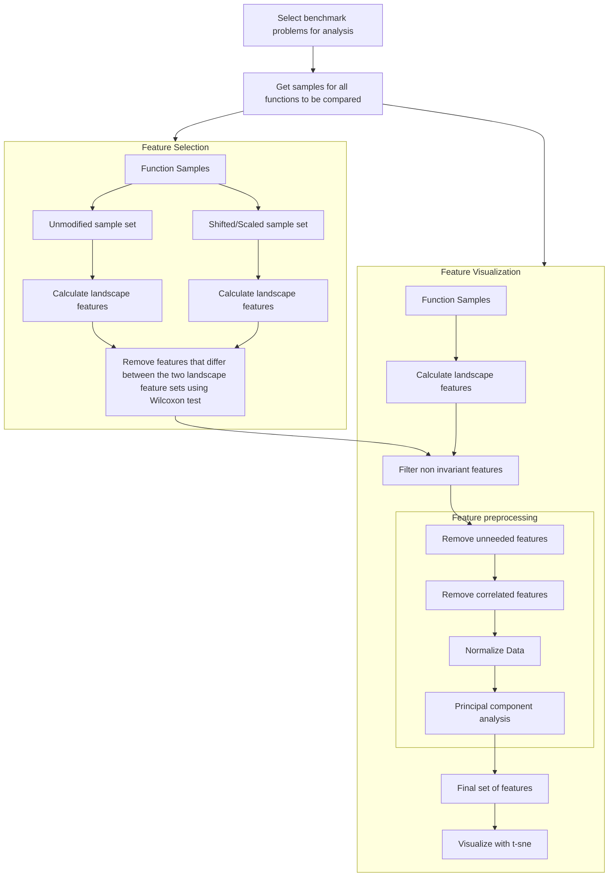

# Understanding the problem space in single-objective numerical optimization using exploratory landscape analysis

Urban Škvorc<sup>a,b,\*</sup>, Tome Eftimov<sup>a</sup>, Peter Korošec<sup>a</sup>

<sup>a</sup> Computer Systems Department, Jožef Stefan Institute, 1000 Ljubljana, Slovenia  
<sup>b</sup> Jožef Stefan International Postgraduate School, 1000 Ljubljana, Slovenia

**Applied Soft Computing Journal 90 (2020) 106138**

## Article info

**Article history:**  
Received 19 May 2019  
Received in revised form 23 January 2020  
Accepted 25 January 2020  
Available online 6 February 2020

**MSC:**  
00-01  
99-00

**Keywords:**  
Benchmarking  
Exploratory landscape analysis  
Numerical optimization  
Single objective problems

## Abstract

In benchmarking theory, creating a comprehensive and uniformly distributed set of problems is a crucial first step to designing a good benchmark. However, this step is also one of the hardest, as it can be difficult to determine how to evaluate the quality of the chosen problem set.

In this article, we evaluate if the field of exploratory landscape analysis can be used to develop a generalized method of visualizing a set of arbitrary optimization functions. We present a method for visually determining the distribution of problems within a benchmark set using exploratory landscape analysis combined with clustering and t-sne visualization, and evaluate and explain the visualization this methodology produces.

The proposed method is evaluated on a set of benchmark problems taken from two well known state-of-the-art real-parameter single objective optimization benchmarks: the CEC Special Sessions and Competitions on Real-Parameter Single Objective optimization, and the GECCO Black-Box Optimization Benchmark workshops.

The main goal of this paper is to present an analysis of how exploratory landscape analysis can be used to visualize a benchmark problem set. We show that this method can provide a clear visualization of a benchmark problem set and shows the similarities of the problems in it by placing similar problems visually close together. We also show that the problem sets of the above benchmarks have a somewhat distinct set of problems that do not overlap.

In addition, by applying feature selection approaches we show that a number of landscape features provided by state-of-the-art exploratory landscape analysis libraries are redundant and that a large amount of them are not invariant to simple transforms like scaling and shifting, at least when analyzing these two datasets.

© 2020 The Author(s). Published by Elsevier B.V. This is an open access article under the CC BY-NC-ND license (http://creativecommons.org/licenses/by-nc-nd/4.0/).

## 1. Introduction

The problem of creating a good benchmark can be roughly split into three main tasks. First, the benchmark authors must define a good set of benchmark problems. Second, they must define an experimental methodology for solving these problems. And finally, they must find an appropriate method for evaluating the results of this benchmark.

In this paper, we will focus on the first of the three problems: how to find a good set of benchmarking problems. This is an important task since the performance of an algorithm can be heavily influenced by the problem the algorithm is solving. If a benchmark features only a small subset of all possible problems, then even if an algorithm performs well in this benchmark we cannot draw any conclusions about its performance overall, as its performance on any other type of problem, that is not in the benchmark, is still unknown. Because of this, a well-made set of benchmark problems should include problems that are representative of the set of all possible problems in a given domain. But this is a hard problem. Not only is this set of all possible problems infinitely large, but it can also be difficult to measure how representative the problems in the benchmark set are.

The main contribution of this article is to present and analyze the results of a novel methodology for visualizing optimization problem spaces using exploratory landscape analysis [1], a method that allows for numerical description of optimization problems. If this method is shown to be successful, its main advantage would be the fact that it can be used on any optimization problem (or even any mathematical function), including black box problems, without any prior domain knowledge. By doing so, we also hope to determine whether the exploratory landscape analysis can be used to visualize problems across different benchmark problem sets, as most existing literature based on exploratory landscape analysis has focused on how it can be applied to problems from a single benchmark set.

We will evaluate how this method works by using two of the most popular state-of-the-art benchmarks currently used in the field of numeric single objective optimization. These are the CEC Special Sessions & Competitions on Real-Parameter Single Objective Optimization (CEC competitions), which have been running in their current form since 2013, and the Black-Box-Optimization-Benchmarking workshops (BBOB workshops), which have been running since 2009. Together, they represent the majority of benchmarking work done in this field.

The article is structured in the following way. Section 2 provides an overview of the related work. We will give a description of the two most commonly used real-parameter optimization platforms, as well as current attempts at clustering problems. In Section 3 we will present an overview of our methodology. In Section 4 we will describe the exact algorithms and parameters used in our experiments. In Section 5, we will provide the results of this method carried out on a set of combined problems from the CEC competitions and the BBOB workshops. In Section 6, we will discuss some interesting findings of our experiments and their impact on real-parameter benchmarking. We conclude the article and provide future plans with Section 7.

\* Corresponding author at: Computer Systems Department, Jožef Stefan Institute, 1000 Ljubljana, Slovenia.  
E-mail addresses: urban.skvorc@ijs.si (U. Škvorc), tome.eftimov@ijs.si (T. Eftimov), peter.korosec@ijs.si (P. Korošec).

https://doi.org/10.1016/j.asoc.2020.106138  
1568-4946/© 2020 The Author(s). Published by Elsevier B.V. This is an open access article under the CC BY-NC-ND license (http://creativecommons.org/licenses/by-nc-nd/4.0/).

## 2. Related work

Exploratory landscape analysis, a method to automatically describe problem features, was first proposed by Mersmann et al. in [2] and implemented in [1]. Since then, a large number of new landscape features have been proposed. In 2017, the library flacco [3] was released that provides an easy way to calculate a large number of so far proposed landscape features. Kerschke [3] provides an overview of this library, as well as references to all of the supported low-level landscape features. In this paper, we will focus on the following landscape feature groups: classical landscape features [1], cell mapping features [4], nearest better clustering features [5], dispersion features [6], information content features [7], and further miscellaneous features [3].

Landscape features have also been used for selection of the most suitable algorithm. For example, Kerschke et al. [8] have shown that they can be used together with machine learning to create a model that selects the best performing algorithm for a given problem. Section 2.2 provides a more detailed overview of landscape analysis.

The idea of examining and visualizing problem spaces is common in literature. Examples include [9–11]. Muñoz et al. [12] shows how exploratory landscape analysis can be used for the purpose of visualizing benchmark problems. Our paper aims to present a broader application and in-depth understanding of this methodology. Muñoz et al. focus on comparing problems from a single benchmark set, but do not present if and how such a visualization would work when comparing problems from different benchmark sets, and does not present a detailed analysis of how the visualization places certain problems together. In order to fill this gap, our paper focuses on aspects such as evaluating which landscape features can be used to correctly compare functions under transformations such as shifting and scaling, as well as on directly comparing specific functions to achieve a better understanding of how landscape analysis visualizes different functions.

The t-Distributed Stochastic Neighbor Embedding (t-sne) visualization method introduced by Maaten and Hinton [13] allows visualization of high-dimensional datasets in two or three dimensions with results that have shown to be successful in a variety of datasets [14–16], including in the field of benchmark analysis [17]. We chose this method of visualization because of its capability to visualize high-dimensional datasets in two dimensions.

CEC Special Sessions & Competitions on Real-Parameter Single Objective Optimization (CEC competitions) provide a variety of materials that describe these benchmarks and analyze their results. The technical reports by Awad et al. [18] and Liang et al. [19–21] present a detailed description of the benchmark problems that are used by the competitions, while in [22–24] the results from these competitions are presented.

The organizers of the Black-Box-Optimization-Benchmarking workshops (BBOB workshops) also present a number of supporting materials. Most importantly, these benchmarks run on a platform called COmparing Continuous Optimisers (COCO), which provides a detailed description of the benchmark problems [25] and evaluation methods [26].

Outside of the official results and documentation, the analysis of these two benchmarks is to our knowledge fairly limited. Molina et al. [27] provide an overview of both of these competitions, as well as a description of the algorithms that performed well in them, but only uses the official benchmark results and does not expand on the analysis methods.

In the following subsections, we will provide an overview of the two benchmarks mentioned above, as well as an overview of landscape analysis.

### 2.1. Benchmarks

In the following subsections, we will give a brief overview of the two benchmarks that are the focus of our analysis (the CEC competitions and BBOB workshops) and the benchmark problems they use.

#### 2.1.1. CEC Special Sessions & Competitions on Real-Parameter single objective optimization

The CEC Special Sessions & Competitions (CEC Competitions) is a series of competitions that have been held annually since 2005 as a part of the IEEE Congress on Evolutionary Computation (CEC). The series started in 2005 with a Special Session on Evolutionary Real Parameter single objective optimization. From 2005 to 2012, the series changed its focus every year. For example, the 2007 Special Session focused on the Performance Assessment of real-parameter multi-objective evolutionary algorithms, while 2009 focused on Dynamic Optimization. The full list of all of the different special sessions is available in [28].

This changed with the 2013 competition, which introduced a more stable competition format focused on Real Parameter Single Objective Optimization. This format was used, with minor changes, for all special sessions from 2013 to 2018, with the exception of the 2015 Special Session which focused on learning based evolutionary algorithms. While each of these competitions used different problems (with the exception of the 2016 and 2018 competitions, which reused problems from the 2014 and 2017 competitions, respectively), all of them were focused on the same field of single-objective numeric optimization, and all of them used the same programming interface, which allows algorithms written for one competition to be run on the problems from different years with only small modifications to their code. For each year, the problems are provided in several dimensions: 10, 30, 50, and 100 (with exception of the year 2013, which does not include 100 dimensional problems).

In total, these competitions provide four different problem sets (from 2013, 2014, 2016, and 2017). Specifically, the 2013 set contains 28 problems, the 2014 set contains 30 problems, the 2015 set contains 15 problems, and the 2017 set contains 29 problems (originally 30, but one of the problems was later excluded from the competition). This gives us a total of 102 problems. However, the benchmark reuses some problems between years. Once these problems are removed, we are left with a total of 73 unique problems. The full list and descriptions of all the problems are available in technical reports created by the organizers of the competition: for the year 2013 in [21], for 2014 in [19], for 2015 in [20], and for 2017 in [18].

#### 2.1.2. Black-Box-Optimization-Benchmarking workshops

Unlike the CEC competitions, the authors of the Black-Box-Optimization-Benchmarking workshops (BBOB workshops) do not call their workshop series a competition. Instead of trying to simply decide which of the algorithms is the best, they give a larger focus on understanding of the performance of algorithms, and on understanding where specific algorithms perform better. This is accomplished in two ways. The benchmarks provide a scoring metric that does not only look at the final algorithm result but at how the quality of an algorithm’s solution improves over time. They also split their benchmark problem set into several distinct groups. Such separation allows algorithm authors that are using the benchmark to see on which type of problems their algorithms perform well.

Like the CEC competitions, the BBOB organizers organize benchmarking workshops yearly, with some exceptions where several workshops are run in the same year. The workshop series is run using the Comparing Continuous Optimisers (COCO) platform, which provides a set of benchmark problems, as well as a way to evaluate algorithms running these problems. The COCO evaluation procedure is more complex than the method used by the CEC competitions and is explained in [26].

Unlike the CEC competitions, the BBOB workshops do not vary the problems used in the benchmarks, and instead use a static set of 24 problems provided by COCO for the noiseless single objective optimization part of the workshop. These problems are described in [25]. Problems are divided into five groups, which provides information on how algorithms perform on different types of problems. These groups are:

- Separable problems
- Problems with low or moderate conditioning
- Problems with high conditioning and unimodal
- Multi-modal problems with adequate global structure
- Multi-modal problems with weak global structure

### 2.2. Landscape analysis

Exploratory landscape analysis is a tool that allows us to describe different problems without knowing their exact definition. The idea was first proposed by Mersmann et al. in [2]. Here, the authors presented a number of high-level landscape features—properties that can be used to describe any given problem. Specifically, they proposed the following set of landscape features:

- Multi-modality, which describes the number of local optima of the problem.
- Global structure, which describes the structure of a problem after deleting all non-optimal points.
- Separability, which describes if a given problem can be split into multiple lower dimensional problems.
- Variable scaling, which describes if different dimensions of a problem have the same scale. That is, if movement in one dimension by a certain distance has the same effect as movement in a different dimension by a certain distance.
- Search space homogeneity, which describes whether or not the search space features any phase transitions.
- Basin size homogeneity, which describes if basins of attraction of the problem are similarly sized or not.
- Global to local optima contrast, which describes the difference in fitness values between the local optima and the global optimum.
- Plateaus, which describes whether or not the problem features plateaus.

These high-level features were then manually determined for the 24 problems in the BBOB workshop problem set.

In 2011, Mersmann et al. followed up the above article with [1]. This article expanded on the previous work by introducing a number of low-level landscape features. Unlike the high-level features that were assigned manually, low-level features can be automatically computed. Low-level features allow us to automatically describe any problem without the need for manual analysis or expert knowledge.

In the years since a large number of different low-level features have been proposed by various authors. In 2017, the library flacco was released and combines approximately 300 low-level features.

While landscape analysis started out by focusing on single objective optimization, recent work has expanded to multi-objective optimization, for example the papers [29–31].

In terms of practical use of landscape features, Kerschke and Trautmann show that they can be used for algorithm selection in combination with machine learning when evaluated on the BBOB benchmark set [8]. This shows that such landscape features can be used to determine which algorithms work well on which benchmark problems.

## 3. Proposed approach

The aim of this article is to present a methodology that can be used to examine similarities between benchmark problems using exploratory landscape analysis [1]. In particular, we are interested if and how well landscape features can be used to visualize benchmark problems. More details about exploratory landscape analysis are presented in Section 2.2.

The overview of the methodology used to examine and visualize problems by using landscape features is the following:

1. Define and collect the problem set that will be used for the analysis.
2. Calculate the landscape features using exploratory landscape analysis.
3. Analyze and select the appropriate landscape features to use.
4. Preprocess the features. Remove constant values and invalid features, remove correlated features, and normalize all values.
5. Further decrease the number of features by using principal component analysis.
6. Visualize the processed problem set using the t-sne algorithm.

The following subsections will provide a more detailed explanation of the procedure described above.

### 3.1. Problem set definition

The goal of the proposed methodology is to be as general as possible. That is, it should be usable on any problem set or any combination of problem sets.

The methodology is designed so that it can be used purely on a collection of problem samples, without having to provide an exact problem definition. This means that it can operate on black-box problems where exact problem definitions are not known.

### 3.2. Selecting the appropriate features

After the feature set has been defined, we next need to calculate the landscape features of every problem in the set. However, there currently exists a large number of landscape features. This large number of features presents difficulties in clustering and visualizing results. To solve this issue, we used several methods to create a smaller feature set that will be used in the following steps.

First, we have to decide which landscape features should be used for our comparison. We chose only the features that can be calculated purely from function samples, without the need to provide an exact function definition. This allows our methodology to be used on black-box features.

However, this set of features is still very large, and should be reduced for better results. In order to obtain a smaller set of features, we decided to filter out those features that are not invariant to certain transformations: shift and scaling of both the sample and its result values. This was done because benchmarks usually apply these transformations on the base problems in their problem sets. Since we are interested in finding relations between these base problems and not their transformed versions, landscape features that are not invariant to these transformations are not useful to us.

Benchmarks also sometimes use a rotation transform on their base problems. Since rotation can change fundamental properties of some problems (for example separability), we chose to still include the landscape features even if they are not invariant to rotation.

In order to determine which features are not invariant, we used the following procedure:

1. Generate two sample sets by using existing benchmark problems: one without any preprocessing, and one where a random shift and scale transformation is applied to the samples and their results.
2. Separately calculate landscape features for both of these sample sets. This gives us a set of landscape features for every problem and its shifted and scaled variant.
3. Use a statistical test to determine which landscape features show statistical differences between the original and the transformed problems. Exclude these features from further use.

### 3.3. Preprocessing of landscape features

In order to make the data more suitable for various clustering and visualization algorithms, we carried out further preprocessing methods. We first removed landscape features that produced constant results on every problem and those that produced invalid values.

We also removed features that were highly correlated and normalized the remaining features. Finally, we used Principal Component Analysis to further reduce the number of features used.

### 3.4. Visualization

Once the landscape features have been properly selected and preprocessed, a visualization method needs to be used to make representation of the results of the analysis easier to interpret for a human. Since the data is still likely to be high-dimensional, the visualization method must be able to visualize such data in a way that is easy to understand.

For visualizing the results, we used the t-sne visualization algorithm [13]. In the resulting visualization, benchmark problems that are similar according to landscape features are shown close to each other.

## 4. Experiments

In this section, we will present the details of our implementation of the procedures described in Section 3.

For the problem set, we chose to use a combined set of problems from the CEC competitions and BBOB workshops. Since these two benchmarks represent a large portion of benchmark problems used in the field of single objective numeric optimization, this would give us a comprehensive set of problems. It would also allow us to see whether there are any differences between the problems in the two benchmarks.

Another benefit of selecting this selection is in the fact that the CEC benchmark features several benchmark problems that repeat throughout the years of the workshop, only with different transformations applied to them. In addition, some of the CEC benchmark problems are also used in the BBOB benchmark. This gives us some baseline for evaluating the success of our methodology: shared problems should appear close together on visualizations.

For the CEC competitions, we used the entire dataset of all problems from all of the years of the competition. This provided us with a total of 102 problems. In order to make the visualization easier to analyze, we chose to focus mainly on two specific years of the benchmark (2014 and 2015), which contain a total of 45 problems. For the BBOB workshops, we used all 24 problems.

For both CEC and BBOB problems, dimensionalities 2 and 10 were chosen. Using 2D problems allows us to visually plot the problems, which gives us a much greater ability to explain and understand the results of our experiments. However, several problems in the CEC benchmarks are not defined for two dimensions. 10 dimensional problems were chosen because the actual CEC competitions use dimensions 10, 30, 50, and 100, while the BBOB workshops use dimensions 2, 3, 5, 10, 20, and 40, making 10 the only common dimension. We deliberately wanted both problem sets to have the same dimensionality to make the comparison as fair as possible.

In order to calculate the landscape features, the flacco [3] library was used. Since we are interested in a methodology that can also be used for any problem, including black-box problem where the exact definition is unknown, we chose to use only the landscape features that can be calculated without providing the library an exact function definition, specifically the feature sets: cm_grad, ela_conv, ela_distr, ela_level, ela_local, ela_meta, ic, disp, limo, nbc, and pca.

In order to calculate the features, we used improved latin hypercube sampling [32]. We used several different sample sizes in order to examine how sample size affects the results. We initially used a sample size of $50D$, based on a similar article by Kerschke and Trautmann [8], where this sample size was used. However, as explained in Section 5, we also experimented with additional sample sizes. The samples chosen were from the range of $[-100, 100]$, which corresponds to the range used by the CEC competitions, and is larger than the $[-5, 5]$ range of the BBOB workshops.

As an alternative, we also considered using random sampling instead of latin hypercube sampling. However, we determined that there was no noticeable difference in the resulting visualization.

In order to exclude the features that are not invariant to scaling and shifting, we used a paired Wilcoxon signed-rank test with a significance level of $0.05$. We performed the procedure for determining non-invariant features separately for every benchmark year using the dimensionality of 10, since this dimensionality is supported by all problems in the benchmarks. To get the final set of features that should be excluded, we chose those features that are non-invariant to transformations in every benchmark year.

**Fig. 1. A diagram representing the experiment setup. First, non-invariant features are determined using a Wilcoxon test. Then these features are excluded in the comparison and visualization.**



To reduce the number of features even further, we removed all features with constant values. Then we used Principal Component Analysis [33], and selected the components that together explained 75% of the dataset variance. This threshold value was chosen experimentally as it produced the best visualizations. Fig. 1 shows a visual representation of the entire process.

## 5. Results

In this section, we present the results of our methodology in three subsections. In Section 5.1, we present the results of the feature selection preprocessing stage. In this subsection, we want to answer how the selection of appropriate landscape features influences the visualization quality. More specifically, whether there are any landscape features that are not invariant to transformations of scaling and shifting, whether these features can be automatically detected, and whether removing them has an effect on the quality of the visualization. We will show which features are not invariant to scaling and shifting, which features are highly correlated, and the results of the principal component analysis.

In Section 5.2, we show the results of our methodology on a simple test case by comparing benchmark problems from different years of the CEC competitions. The goal of this subsection is to evaluate whether our methodology can be used to create a visualization that places similar problems close to one another by using a very simple test case.

In Section 5.3, we expand this analysis to comparisons between two different benchmarks: the CEC competitions from 2013 to 2017 and the BBOB workshops. The goal of this subsection is to test if our methodology can be used for to compare problems from different benchmarks.

### 5.1. Feature selection and preprocessing

After calculating the landscape features, we first removed all features that produced only constant values or provided only irrelevant information such as the time it took the library to calculate features. After this process, we were left with 49 features out of the original 101. These 49 features are presented in Table 1.

**Table 1. Landscape features left after removing constant and unnecessary features.**

| Feature Names 1–25 | Feature Names 26–49 |
|---|---|
| ela_distr.kurtosis | cm_angle.dist_ctr2best.mean |
| ela_distr.number_of_peaks | cm_angle.dist_ctr2worst.mean |
| ela_meta.lin_simple.adj_r2 | cm_angle.angle.mean |
| ela_meta.lin_simple.intercept | cm_grad.mean |
| ela_meta.lin_simple.coef.min | ela_distr.skewness |
| ela_meta.lin_simple.coef.max | disp.diff_mean_25 |
| ela_meta.lin_simple.coef.max_by_min | disp.diff_median_02 |
| ela_meta.lin_w_interact.adj_r2 | disp.diff_median_05 |
| ela_meta.quad_simple.adj_r2 | disp.diff_median_10 |
| ela_meta.quad_simple.cond | disp.diff_median_25 |
| ela_meta.quad_w_interact.adj_r2 | limo.avg_length.reg |
| ic.h.max | limo.length.mean |
| ic.eps.max | limo.ratio.mean |
| ic.m0 | nbc.nn_nb.sd_ratio |
| disp.ratio_mean_02 | nbc.nn_nb.mean_ratio |
| disp.ratio_mean_05 | nbc.nn_nb.cor |
| disp.ratio_mean_10 | nbc.dist_ratio.coeff_var |
| disp.ratio_mean_25 | nbc.nb_fitness.cor |
| disp.ratio_median_02 | pca.expl_var.cov_init |
| disp.ratio_median_05 | pca.expl_var.cor_init |
| disp.ratio_median_10 | pca.expl_var_PC1.cov_x |
| disp.ratio_median_25 | pca.expl_var_PC1.cor_x |
| disp.diff_mean_02 | pca.expl_var_PC1.cov_init |
| disp.diff_mean_05 | pca.expl_var_PC1.cor_init |
| disp.diff_mean_10 |  |

The first goal of the feature selection stage was to determine which features are not invariant to scaling or shifting. Our analysis revealed that 26 out of 49 features were not invariant to these transformations. This leaves us with a total of 23 invariant features. These invariant features are listed in Table 2. Fig. 2 shows a visual representation of p-values obtained when comparing landscape feature values between original and transformed functions on the 2014 dataset. We can see that for some features, p-values are very low, much lower than the 0.05 threshold, while for some the p-value is much higher than the threshold (about 0.2). Only a small number of features is borderline in the sense that their p-value is close to the significance level of 0.05.

**Table 2. Landscape features invariant to shift and scale. The bold features are those that remained after eliminating highly correlated features.**

| Feature Name |
|---|
| **cm_angle.angle.mean** |
| **ela_distr.skewness** |
| **ela_distr.kurtosis** |
| **ela_distr.number_of_peaks** |
| **ela_meta.lin_simple.adj_r2** |
| **ela_meta.lin_simple.intercept** |
| **ela_meta.lin_simple.coef.min** |
| **ela_meta.quad_w_interact.adj_r2** |
| **ela_meta.quad_simple.adj_r2** |
| **ela_meta.lin_w_interact.adj_r2** |
| **disp.ratio_mean_02** |
| **disp.ratio_median_25** |
| **nbc.nb_fitness.cor** |
| **pca.expl_var_PC1.cov_init** |
| **pca.expl_var.cov_init** |
| **pca.expl_var.cor_init** |
| disp.ratio_mean_05 |
| disp.ratio_mean_10 |
| disp.ratio_mean_25 |
| disp.ratio_median_02 |
| disp.ratio_median_05 |
| disp.ratio_median_10 |
| pca.expl_var_PC1.cor_init |

**Fig. 2. p-values of individual landscape feature comparisons showing which features are invariant to scaling and shifting produced by a Wilcoxon test. A p-value lower than 0.05 means that the feature is invariant to these two transformations.**

*Description:* The figure is a horizontal bar chart of p-values for individual landscape features. The x-axis is labeled “p-value” and ranges approximately from 0.0 to 1.0. The y-axis lists feature names, including cm_angle, ela_meta, limo, nbc, pca, disp, ela_distr, and ic features. Many features have p-values close to 0, while several features, such as `pca.expl_var_PC1.cov_init`, `pca.expl_var.cor_init`, `ela_meta.quad_simple.cond`, and `disp.ratio_mean_05`, show larger p-values. The chart is used to identify features relative to the 0.05 significance threshold.

The procedure for determining invariant features was performed multiple times with different scaling and shifting factors to account for any random variance when calculating p-values. All of the runs produced very similar results.

As a final step, we checked which of these features are highly correlated with one another. This was done by using two approaches. The first by using Pearson correlation, and the second by using principal component analysis.

The correlation analysis using Pearson correlation was carried out by computing the Pearson correlation matrix, selecting pairs of features with absolute correlation of more than 0.95, and for each pair removing the feature with the higher mean correlation with all other features. In total, this removed 7 out of 23 remaining features, leaving us with a total of 16 bold features listed in Table 2

**Fig. 3. The results of the Pearson correlation calculation. Bigger and bolder circles represent higher correlation, which is either positive (blue) or negative(red). Red labels represent the features that were retained, while the black labels represent features that were removed from the featureset.**

*Description:* The figure is a correlation matrix visualization. Rows and columns are landscape features. Correlation strength is represented by circle size and color intensity: blue indicates positive correlation, red indicates negative correlation. Large blue circles appear among several `disp.ratio_*` features, showing strong positive correlations within that group. Strong negative correlations appear among PCA-related features, especially between `pca.expl_var.cor_init` / `pca.expl_var.cov_init` and `pca.expl_var_PC1.*` features. Feature labels in red mark retained features; black labels mark removed features.

Fig. 3 shows the results of the Pearson correlation. We can see that the vast majority of the removed features belong to the disp.ratio group, which is all correlated with each other. Despite their large correlation, our procedure retained two out of the 8 features in the group, instead of just one, as the correlation between some of these features was just below the chosen threshold. We can also see that the features pca.expl_var.cor_init and pca.expl_var.cov_init are strongly inversely correlated with the features pca.expl_var_PC1.cor_init and pca.expl_var_PC1.cov_init, respectively. Only the feature pca.expl_var_PC1.cor_init was removed, as the correlation between the other two features was again just barely below the threshold.

Finally, we performed principal component analysis. This further reduced the data to a total of about 5 principal components, depending on the exact dataset.

**Fig. 4. The amount of explained variance per component when performing principal component analysis on the landscape features calculated on the combined set of 2014 CEC and GECCO problems.**

*Description:* The figure is a bar chart titled “PCA percentage of explained variance per component.” The x-axis lists PCA components from 1 to 19. The y-axis shows percentage of explained variance. Component 1 explains the largest amount of variance, around 0.25. Components 2 and 3 explain smaller but still substantial portions, with the first three components together accounting for more than 50% of variance. Subsequent components decrease gradually, each explaining progressively less variance.

Fig. 4 shows a visual representation of the first 19 PCA components obtained when comparing the landscape features calculated on the combined set of CEC 2014 and GECCO problems. We can see that the first component explains about 25% of the variance, and the first 3 explain more than 50%. After that, the amount of explained variance decreases slowly with each additional component.

To verify that excluded features produce improvements in the visualization, we performed the following experiment:

1. Pick a year of the CEC competitions to use for comparison. Create two sets of problem samples: one without any transformations applied and one with a random shift and scale transformation applied.
2. Calculate the non-invariant features as described in Section 3.
3. Use the invariant features from Step 2 to visualize the data in Step 1.

**Fig. 5. A scatterplot showing the effect of the transformations used to determine non-invariant features. Red points represent the original problem, while blue points represent the transformed problem.**

*Description:* The figure is a 3D scatterplot comparing original and transformed samples of the CEC 2014 Rotated High Conditioned Elliptic function. Axes are labeled $x1$, $x2$, and $Y$. Red points represent the original problem samples and form a low-valued curved basin. Blue points represent transformed samples and occupy a wider and higher-valued region. The transformed cloud has a different optimum position and gradient, but the overall problem shape remains visually similar.

Fig. 5 shows the result of the scaling and shifting operation described in Step 1. The red dots show the original problem samples, while the blue dots show the scaled and shifted samples. The comparison uses the CEC 2014 Rotated High Conditioned Elliptic function. We can see that the overall shape of the problem remains similar. However, the transformed problem has a different optimum (due to the shift) and a different gradient (due to scaling).

For this experiment, we selected the problems from the 2014 CEC competition to use for the comparison. The results of these experiments done on $50D$ sample sizes are shown in Figs. 6–8. In these Figures, the red numbers represent the original problems, while the black numbers represent the corresponding transformed problems. Ideally, the same numbered problems of different colors should be visualized close together.

**Fig. 6. Unprocessed data.**

*Description:* The figure is a 2D t-sne scatterplot with axes labeled “t-sne dimension 1” and “t-sne dimension 2.” Points are represented by problem numbers. Red numbers correspond to original problems and black numbers correspond to transformed problems. The data are scattered broadly, with same-numbered red and black labels not consistently close together.

Fig. 6 shows the t-sne visualization after calculating the base landscape features, but before any preprocessing.

**Fig. 7. PCA, without removing non-invariant features.**

*Description:* The figure is a t-sne scatterplot after PCA but before removing non-invariant features. Red and black numbered labels form two mostly separated groups, indicating that transformed and original problem sets are separated by the visualization rather than being paired by problem identity.

Fig. 7 shows what happens if we perform PCA on the full feature set, without first excluding non-invariant features. As we can see, the visualization almost cleanly splits the dataset into the two groups: the original problems and the problems that had the scale and shift transformation applied to them.

**Fig. 8. PCA, after removing non-invariant features.**

*Description:* The figure is a t-sne scatterplot after removing non-invariant landscape features and applying normalization and PCA. Many same-numbered red and black labels appear closer than in Fig. 7, indicating improved pairing of original and transformed problems. Several clusters are visible, with problems 10–12 grouped in the upper-right region and some other problem pairs grouped near the center and lower-right areas.

Finally, Fig. 8 shows the visualization without the non-invariant landscape features after performing normalization and PCA. Here, we can see that the same numbered problems stay relatively close to one another. While the ‘‘equal" problems are not exactly on top of one another, the resulting visualization is much better than the visualization that included the non-invariant features in Fig. 7.

However, problem 19 does not appear closest to one another in this visualization. To further investigate why some problems still appear apart on the visualization, we examined also the influence of the sample size parameter. We performed the same experiment described above on two-dimensional data on several additional sample sizes from $100D$ to $1000D$. We determined that the sample size of $200D$ shown in Fig. 9 provided the best visualization, as it also visualizes the function 19 close together. For this reason, we have decided to use the sample size of $200D$ for all further experiments.

**Fig. 9. PCA, after removing non-invariant features, sample size 200D, on 2D data.**

*Description:* The figure is a t-sne scatterplot for 2D data using sample size $200D$. Same-numbered red and black labels are generally positioned close together. Several groupings are apparent: problem labels 15, 19, 21, and 22 cluster in the upper-left; labels 6, 13, 14, 7, 8, 9, and 20 appear in the upper-right and center; labels 10, 11, and 12 cluster at the bottom.

We also performed the same experiment on 10 dimensional data, and achieved similar results.

**Fig. 10. PCA, after removing non-invariant features, sample size 200D, on 10D data.**

*Description:* The figure is a t-sne scatterplot for 10-dimensional data using sample size $200D$. The axes are t-sne dimension 1 and t-sne dimension 2. Multiple compact clusters appear, including a large group at the lower-right, a cluster at the lower-left, and a small cluster at the top. Red and black same-numbered labels are often close, but some pairs remain separated.

Fig. 10 shows the visualization of 10 dimensional data at a sample size of $200D$. However, even the best visualization still cannot visualize some problems close together, in particular the problem number 20. We believe that this could be happening due to the Wilcoxon process failing to exclude certain features that are not invariant to scaling or transformation only for a small number of problems.

The last parameter that we decided to investigate is the perplexity parameter of the t-sne function, as this parameter has a significant effect on the visualization. In particular, a perplexity parameter that is too large produces a poor visualization, as shown in Fig. 11, where the perplexity parameter is set to 20. This figure uses the same data as Fig. 9 but produces a much poorer visualization.

**Fig. 11. PCA, after removing non-invariant features, perplexity=20. This produces a poorer visualization.**

*Description:* The figure is a t-sne scatterplot using perplexity 20. Red and black numbered labels are more dispersed and less clearly paired than in Fig. 9. Some same-numbered pairs remain near each other, but the overall structure is less informative, with less distinct grouping by problem similarity.

We attempted to tune this parameter automatically by running the experiment described in Section 5.2 with different perplexity values and measuring the root mean square error between the pairs of functions listed in Table 6. We performed 200 separate visualizations for perplexity values between 1 and 10. However, a Wilcoxon test showed no statistically significant differences between these perplexity values. However, larger perplexity values such as 20 showed statistically worse results. Because of this, we chose a perplexity parameter in the range between 1 and 10, specifically the value 5. This parameter value is used in all of the previous visualization, as well as in all further experiments.

### 5.2. CEC 2014 vs. CEC 2015

The preliminary experiments described in the preceding subsection show that our methodology is capable of visualizing same problems close together even under the transformations of scaling and shifting when comparing two sets of identical problems. In this subsection, we will describe a slightly more advanced version of the experiment: comparing two sets of problems from different years of the CEC benchmark. In particular, we will focus on the results of the comparison between the CEC years of 2014 and 2015. This experiment differs from the previous one in two key ways:

1. Since different years of the CEC competitions use different problems, the set of problems is no longer completely identical. However, there are still some problems that are present in both years, and should be visualized close together.
2. The problems feature additional transformations that were not taken into account in the previous subsection. These include rotation and shuffle transformations. In addition, these transformations are applied to the samples before problem result values are calculated, while the transformations in the previous subsection were applied to the samples after the results are calculated.

The results of this experiment are shown in Fig. 12 for two-dimensional data and Fig. 15 for 10 dimensional data. The list of problem numbers and their corresponding problems are available in Tables 3 and 4 for the 2014 problem set, and Table 5 for the 2015 problem set. For convenience, Table 6 shows which problems from the year 2014 are same as problems from the year 2015. Note that some of the problems from both benchmarks are not defined for two dimensions, so the two-dimensional comparison will have fewer problems

**Fig. 12. t-sne visualization of CEC 2014 (black) vs CEC 2015 (red) problems with 2D data.**

*Description:* The figure is a t-sne scatterplot comparing CEC 2014 problems, shown in black, and CEC 2015 problems, shown in red, using 2D data. Problem labels appear as numbers. Several red and black labels representing common or similar functions are placed close together. Some groups are distributed across the plot, including red labels 1 and 2 in the top-left, a central group containing black labels 4, 10, 15, 19, 21, and 22 and red labels 6, 7, 8, 10, and 12, and lower regions with paired labels such as 5/11 and 3/5.

**Table 3. CEC 2014 problems 1–15.**

| Problem id 10D | Problem id 2D | Problem name |
|---:|---:|---|
| 1 | 1 | Rotated High Conditioned Elliptic Function |
| 2 | 2 | Rotated Bent Cigar Function |
| 3 | 3 | Rotated Discus Function |
| 4 | 4 | Shifted and Rotated Rosenbrock’s Function |
| 5 | 5 | Shifted and Rotated Ackley’s Function |
| 6 | 6 | Shifted and Rotated Weierstrass Function |
| 7 | 7 | Shifted and Rotated Griewank’s Function |
| 8 | 8 | Shifted Rastrigin’s Function |
| 9 | 9 | Shifted and Rotated Rastrigin’s Function |
| 10 | 10 | Shifted Schwefel’s Function |
| 11 | 11 | Shifted and Rotated Schwefel’s Function |
| 12 | 12 | Shifted and Rotated Katsuura Function |
| 13 | 13 | Shifted and Rotated HappyCat Function |
| 14 | 14 | Shifted and Rotated HGBat Function |
| 15 | 15 | Shifted and Rotated Expanded Griewank’s plus Rosenbrock’s Function |

**Table 4. CEC 2014 problems 16–30.**

| Problem id 10D | Problem id 2D | Problem name |
|---:|---:|---|
| 16 | 16 | Shifted and Rotated Expanded Scaffer’s F6 Function |
| 17 | – | Hybrid Function 1 ($N = 3$) |
| 18 | – | Hybrid Function 2 ($N = 3$) |
| 19 | – | Hybrid Function 3 ($N = 4$) |
| 20 | – | Hybrid Function 4 ($N = 4$) |
| 21 | – | Hybrid Function 5 ($N = 5$) |
| 22 | – | Hybrid Function 6 ($N = 5$) |
| 23 | 17 | Composition Function 1 ($N = 5$) |
| 24 | 18 | Composition Function 2 ($N = 3$) |
| 25 | 19 | Composition Function 3 ($N = 3$) |
| 26 | 20 | Composition Function 4 ($N = 5$) |
| 27 | 21 | Composition Function 5 ($N = 5$) |
| 28 | 22 | Composition Function 6 ($N = 5$) |
| 29 | – | Composition Function 7 ($N = 3$) |
| 30 | – | Composition Function 8 ($N = 3$) |

**Table 5. CEC 2015 problems.**

| Problem id 10D | Problem id 2D | Problem name |
|---:|---:|---|
| 1 | 1 | Rotated High Conditioned Elliptic Function |
| 2 | 2 | Rotated Cigar Function |
| 3 | 3 | Shifted and Rotated Ackley’s Function |
| 4 | 4 | Shifted and Rotated Rastrigin’s Function |
| 5 | 5 | Shifted and Rotated Schwefel’s Function |
| 6 | – | Hybrid Function 1 ($N = 3$) |
| 7 | – | Hybrid Function 2 ($N = 4$) |
| 8 | – | Hybrid Function 3 ($N = 5$) |
| 9 | 6 | Composition Function 1 ($N = 3$) |
| 10 | – | Composition Function 2 ($N = 3$) |
| 11 | 7 | Composition Function 3 ($N = 5$) |
| 12 | 8 | Composition Function 4 ($N = 5$) |
| 13 | – | Composition Function 5 ($N = 5$) |
| 14 | 9 | Composition Function 6 ($N = 7$) |
| 15 | 10 | Composition Function 7 ($N = 10$) |

**Table 6. Common problems between the CEC 2014 and 2015 problem sets.**

| Problem id 2015 | Problem id 2014 | Problem name |
|---:|---:|---|
| 1 | 1 | Rotated High Conditioned Elliptic Function |
| 2 | 2 | Rotated Cigar Function |
| 3 | 5 | Shifted and Rotated Ackley’s Function |
| 4 | 9 | Shifted and Rotated Rastrigin’s Function |
| 5 | 11 | Shifted and Rotated Schwefel’s Function |

We can see that the visualization is able to draw almost all identical problems close together.

In the two-dimensional visualization, we can see that similar problems are visualized close to one another. In particular the problem pairs (red, black): (3,5), (4,9), and (5,11). Also of interest are the problems 1 and 2 of both problem sets. These are the High Conditioned Elliptic function and the Bent Cigar function in both of the problem sets. However, in 2 dimensions, both of these problems are actually identical. So we would expect to see all four of these problems to be visualized close together. From the visualization, we can see that 3 out of 4 of them are visualized right next to one another, while the fourth problem, the black 1, is not). To explain this, Figs. 13 and 14 show two different scatterplot comparisons.

**Fig. 13. A scatterplot comparison of the 2014 CEC problem 2 (red) and 2015 problem 1 (blue).**

*Description:* The figure is a 3D scatterplot comparing samples from CEC 2014 problem 2 in red and CEC 2015 problem 1 in blue. The axes are spatial dimensions and objective value. The red and blue point clouds overlap substantially and have broadly similar shape and value distribution, explaining why these functions are visualized close together in the t-sne plot.

Fig. 13 shows the comparison between the red 1 and black 2, which are visualized close to one another.

**Fig. 14. A scatterplot comparison of the 2014 CEC problem 1 (red) and 2015 problem 1 (blue).**

*Description:* The figure is a 3D scatterplot comparing CEC 2014 problem 1 in red and CEC 2015 problem 1 in blue. The point clouds show visibly different orientations and distributions, with the blue points extending to higher objective values in a distinct region and the red points forming a different sloped pattern. This visual difference corresponds to the functions being placed farther apart in the t-sne plot.

Fig. 14 shows the comparison between red 1 and black 1, which are consequently correctly visualized further apart.

**Fig. 15. t-sne visualization of CEC 2014 (black) vs CEC 2015 (red) problems with 10D data.**

*Description:* The figure is a t-sne scatterplot comparing CEC 2014 problems in black with CEC 2015 problems in red using 10D data. There is a large cluster in the upper part of the plot containing many CEC 2014 labels and some red labels, a smaller group toward the right containing labels such as 28, 14, 12, and 4, and a lower-left cluster containing labels 1, 5, 6, 10, 11, and 12. Several common pairs are relatively close, though not all are adjacent.

In 10 dimensional data shown in Fig. 15, we can see that the pairs (red, black): (3,5), (5,11), and (2,2) are still visualized close together. However, the pair (4,9) is no longer very close, however still appears relatively close. Unfortunately, we are not able to visualize 10 dimensional data. However, we believe that a similar situation to the one described above might be occurring here: that a transform, particularly rotation, is causing the two problems to be visualized far apart. On the other hand, we can see that the problems 1 and 2 are now correctly visualized close to one another. In 10 dimensions, these two problems are no longer identical, and this is visible in the visualization, as the problems are no longer placed directly next to one another.

### 5.3. CEC vs. BBOB

For the final comparison, we wanted to compare the problems of two different benchmarks: the CEC competitions and the BBOB workshops. This presents additional challenges compared to the previous subsection.

1. Since we are comparing two completely different benchmarks, there can be differences in the way they design their benchmark problems. Even problems that share the same name between the two benchmarks (for example, a Schwefel’s function) might differ, for example due to different parameter selection.
2. The two benchmarks might apply completely different transformations to their benchmark problems. For example, the CEC competitions apply a shuffle transformation, while the BBOB workshops do not.
3. The sampling space of each function might be different. Sampling the same problem at two different areas might produce completely different results even though we are sampling the same underlying function.

For this experiment, we will present the results in two different ways. In the first part we compare only the problem set from the 2014 CEC competition with the problem set of the BBOB workshops. We limit ourselves to only a part of the CEC problems for visibility reasons, since the entire CEC problem set contains 102 problems. In the second part, we compare the BBOB workshops problem set with the entire CEC problem set from the years 2014–2017.

The results of the first part experiment are shown in Fig. 16 for two-dimensional data and Fig. 17 for 10 dimensional data. The list of problem numbers and their corresponding problems are available in Table 8 for the BBOB problem set, and Tables 3 and 4 for the CEC problem set. For convenience, Table 7 shows which problems from the CEC benchmarks are identical in name to which problems from the BBOB benchmark.

**Table 7. Common problems between the CEC 2014 and BBOB problem sets.**

| Problem id CEC | Problem id BBOB | Problem name |
|---:|---:|---|
| 2 | 12 | Bent Cigar Function |
| 3 | 11 | Discus Function |
| 4 | 9 | Rosenbrock’s Function |
| 6 | 16 | Weierstrass Function |
| 8 | 3 | Rastrigin’s Function |
| 10 | 20 | Schwefel’s Function |
| 12 | 23 | Katsuura Function |

**Table 8. BBOB problems.**

| Problem id | Problem name |
|---:|---|
| 1 | Sphere Function |
| 2 | Ellipsoidal Function |
| 3 | Rastrigin’s Function |
| 4 | Büche–Rastrigin’s Function |
| 5 | Linear Slope |
| 6 | Attractive Sector Function |
| 7 | Step Ellipsoidal Function |
| 8 | Rosenbrock’s Function, original |
| 9 | Rosenbrock’s Function, rotated |
| 10 | Ellipsoidal Function 2 |
| 11 | Discus Function |
| 12 | Bent Cigar Function |
| 13 | Sharp Ridge Function |
| 14 | Different Powers Function |
| 15 | Rastrigin’s Function |
| 16 | Weierstrass Function |
| 17 | Schaffer’s F7 Function |
| 18 | Schaffer’s F7 Functions, moderately ill-conditioned |
| 19 | Composite Griewank–Rosenbrock Function F8F2 |
| 20 | Schwefel’s Function |
| 21 | Gallagher’s Gaussian 101-me Peaks Function |
| 22 | Gallagher’s Gaussian 21-hi Peaks Function |
| 23 | Katsuura Function |
| 24 | Lunacek bi-Rastrigin Function |

**Fig. 16. t-sne visualization of CEC vs BBOB 2D problems, using only 2014 CEC problems.**

*Description:* The figure is a t-sne scatterplot comparing CEC 2014 and BBOB 2D problems. Problem numbers are colored black and red for the two benchmark sets. Several groups are visible: black labels 1–9 and 14 appear on the left side, red labels 5 and 6 appear nearby but higher; red labels 17, 18, 22, 12, 5, and 6 are grouped in the upper-right; black labels 1, 10, 12, 13, 15, and 16 appear in the lower-right. Only a few similarly named cross-benchmark problems appear close.

**Fig. 17. CEC vs BBOB 10D, only 2014 CEC problems.**

*Description:* The figure is a t-sne scatterplot comparing CEC 2014 and BBOB 10D problems. A compact red cluster appears in the upper-right containing BBOB labels such as 8, 9, 12, 19, 20, 22, 23, and 24. Black labels form several clusters, including one on the left with labels 1, 2, 6, 14, and 16, a lower central cluster with many CEC labels, and a right-side group with labels 9, 14, and 18. The plot shows limited overlap between the two benchmark problem sets.

From the figures, very few problems that share the same names are visualized close together. Only the discus function (black 3, red 11) appears somewhat close, while others are far apart.

As before, we use scatterplots to investigate these differences. Note that in these figures, the Y (result) values have been scaled to fit into the range of $[0,1]$. This was done to make the comparison easier, as the two benchmark sets use very different scales for the Y axis. In order to eliminate this different Y scale being the cause of the poor performance of the visualization, we also reran the visualization using scaled Y values for both benchmark sets. However, there was no difference.

**Fig. 18. CEC problem 10 (red) vs BBOB problem 20 (blue), which are visualized far apart.**

*Description:* The figure is a 3D scatterplot comparing the Shifted Schwefel’s Function from CEC 2014 (problem 10, red) and BBOB (problem 20, blue). The axes are $x1$, $x2$, and $Y$, with $Y$ scaled to $[0,1]$. The blue points form a curved valley-like structure, while the red points are more dispersed throughout the interior. Despite sharing the same function name, the sampled landscapes appear visually different.

Fig. 18 shows the scatterplot of the Shifted Schwefel’s Function, which is the problem number 10 for CEC (black) problems and number 20 for BBOB (red) problems. As we can see, problems that share the same name across both benchmarks nonetheless appear very different in scatterplots.

**Fig. 19. CEC problem 19 (red) vs BBOB problem 13 (blue), which are visualized close together.**

*Description:* The figure is a 3D scatterplot comparing CEC problem 19 in red and BBOB problem 13 in blue. The axes are two search dimensions and scaled objective value $Y$. The two point clouds overlap considerably and share a similar basin-like structure, explaining why the t-sne visualization places these problems close together.

Fig. 19 compares the CEC (black) problem number 19 with the BBOB (red) problem 13. Here, the problems have a much more similar scatterplot, which explains why they are visualized close together. We observed similar effects in the other problems. More examples are available in Appendix A.

This indicates that there is some fundamental design difference between these problems, either in various parameters or in the overall benchmark design. One such example is the search area. The CEC benchmarks are limited to an area of $[-100, 100]$, while the BBOB workshops are limited to an area of $[-5, 5]$. However, even when limiting both sample sizes to $[-5, 5]$, the visualization still performed similarly.

Another difference might be the transformations these benchmarks apply to the problems, such as rotation, shifting and scaling. While we have tried to eliminate the effect of shifting and scaling, this had to be done after the problem was already calculated, while the benchmarks perform shifting and scaling on the problems before calculating results.

**Fig. 20. t-sne visualization of CEC vs BBOB 2D problems, using all CEC problems.**

*Description:* The figure is a t-sne scatterplot comparing all CEC problems with BBOB 2D problems. Many black CEC labels form several spread-out clusters, including dense groups on the left and lower-left and an isolated label 64 far to the right. Red BBOB labels mostly occupy central and upper-left regions, with some overlap but also clear separation from many CEC clusters. Due to the large number of labels, the plot emphasizes benchmark-level distribution rather than individual pair comparisons.

**Fig. 21. t-sne visualization of CEC vs BBOB 10D problems, using all CEC problems.**

*Description:* The figure is a t-sne scatterplot comparing all CEC problems with BBOB 10D problems. Several compact clusters appear. Red BBOB labels are concentrated mainly in the upper-left and central areas, while black CEC labels form multiple distinct groups, including clusters at the top-left, mid-left, center, lower-center, lower-right, and far-right. The two benchmarks are visualized as somewhat separate groups, suggesting differences in problem design or landscape-feature distribution.

Finally, Figs. 20 and 21 show the visualization for problems from all years of the CEC and BBOB problem sets. Due to the large number of problems, these figures are mainly used to demonstrate the overall distribution of the problems between the two benchmarks. We can see that the visualization places the two different benchmarks into somewhat separate groups. As we have discussed above, this seems to indicate some sort of design difference in the problems of the two benchmarks.

In order to account for different possible shift and scale transformations, we attempted to automatically scale and shift several of the functions used for the above scatterplot comparisons. We used Differential Evolution [34] as implemented in the R library DEoptim [35] with default parameters to optimize the factors for scaling and shifting transformations. The mean pairwise distance between closest points was used as a fitness function. Figs. A.23 and A.28 in Appendix A show some examples of this. However, as the images illustrate, this did not provide a big improvement.

## 6. Discussion

Our research shows several interesting points. It indicates that when using landscape analysis, selecting proper features is very important. First, because some landscape features might not be appropriate for a given task. For example, we have shown that a large number of features are not invariant to shifting and scaling of problems. Since we wanted to compare problems that are similar in structure independently from such transformations, these features had to be excluded before starting our analysis. As we have shown, if these features are not excluded, then such transformations can significantly negatively influence the visualization. This means that this step is necessary to prevent us from reaching incorrect conclusions. Second, because a number of features appear correlated with one another, this indicates that some landscape features might be redundantly calculated on the data we used for our analysis. Although this requires further investigation as correlation information could change with the usage of different data sets.

At first glance, our analysis performed poorly when comparing BBOB problems with CEC problems, as benchmark problems that seemed like they should appear similar according to benchmark documentation were visualized far apart from one another. On further analysis, a scatterplot of these problems revealed that they are not as similar as their names and documentation suggest when sampled, which explained why they were visualized far apart. However, further work needs to be done to determine whether these differences are actually practically significant. That is, whether they affect algorithm performance.

One other major factor that our analysis cannot account for is the difference in the area that the problem that is being sampled from. Two benchmark problems that share the same mathematical formula can still appear different if the sampling is done on different areas of the problem. This could easily occur due to the transformations such as a shift transformation of the problem in the search space while maintaining the same sampling range (in our case $[-100, 100]$).

If the issues mentioned above can be solved, exploratory landscape analysis seems like a promising tool for the issue of problem visualization and selection in benchmarking theory, as it offers us the ability to easily analyze any problem, including black-box problems purely by using problem samples. According to the t-sne visualization, when comparing two different years of the CEC competition, landscape features are able to mostly identify similar problems and place them close to each other. In theory, our approach could be used when developing new benchmark problems: a new benchmark problem should not overlap with existing problems, and should ideally be placed as far away from existing problems as possible. This would ensure that the new problem is relevant for determining the tested algorithms’ efficiency from more ‘‘global" perspective.

## 7. Conclusion

In this article, we have shown how exploratory landscape analysis can be used to visualize the problem space of a numerical optimization benchmark, as well as to compare problems between different benchmarks, and some factors that have to be considered when doing this. In particular, we have shown that a large number of landscape features are not invariant to even simple transformations like scaling and shifting that should not have any affect on algorithm’s performance. In practice, we believe this means that such features should be removed before performing any analysis based on exploratory landscape analysis.

We have also shown that despite being named similarly, problems from different benchmarks still appear differently when sampled and plotted, and as such also appear far apart on the landscape feature based visualization. We assume that this occurs because of different transformations such as rotation, or different problem parameters. In the future, we believe that more work is needed to determine the exact nature of these differences, as well as how these differences affect landscape features. Sampling of different areas of the problem space might also play a significant role, as two seemingly identical functions could look completely different according to the information gained from sampling.

One major flaw of our analysis is that while we show that certain differences between problems exist both on a scatterplot and landscape feature level, we do not determine if these features have an effect on algorithm performance. For example, we have shown that rotation can cause two similar problems to be visualized further apart due to different landscape features. In practice, this is only a good thing if this rotation also has an effect on algorithm performance. In the future, we would like to expand our analysis to also cover algorithm performance to see if the problems that are visualized close together are also solved well by similar algorithms. If this turns out to be correct, it would allow us to select the best algorithm for a given problem simply by seeing to which other problems it is visualized close to and selecting the algorithm that we know works well for those problems.

In addition, testing with different algorithms would allow us to see which possible function transformations actually have an effect on algorithm performance. In this paper, we chose to eliminate all landscape features that are not invariant to two specific transformations: translation and scaling. However, different optimization algorithms are affected differently by different transformations. For example, the CMA-ES algorithm is invariant to certain rotations and translations [36], while some other algorithms such as PSO are not [37]. Because of this, further work would need to be done to see which transformations should be taken into account when removing non-invariant landscape features.

One aspect that we would also like to improve in the future is to develop a better automatic method for setting method parameters such as the perplexity parameter.

Finally, it would be interesting to expand this analysis to other benchmark sets. In particular, we are interested in using it on a set of real-world optimization problems, which would allow us to see how well real-world problems are covered by traditional synthetic benchmark problems.

## Declaration of competing interest

No author associated with this paper has disclosed any potential or pertinent conflicts which may be perceived to have impending conflict with this work. For full disclosure statements refer to https://doi.org/10.1016/j.asoc.2020.106138.

## Acknowledgments

This work was supported by projects from the Slovenian Research Agency, Slovenia: research core funding No. P2-0098, project No. Z2-1867 and young researcher funding No. Pr-08987.

## Appendix A. Supplementary data

Supplementary material related to this article can be found online at https://doi.org/10.1016/j.asoc.2020.106138.

## References

[1] O. Mersmann, B. Bischl, H. Trautmann, M. Preuss, C. Weihs, G. Rudolph, Exploratory landscape analysis, in: Proceedings of the 2011 Annual Conference on Genetic and Evolutionary Computation, ACM, 2011, pp. 829–836.

[2] O. Mersmann, M. Preuss, H. Trautmann, Benchmarking evolutionary algorithms: towards exploratory landscape analysis, in: R. Schaefer, C. Cotta, J. Kołodziej, G. Rudolph (Eds.), Parallel Problem Solving from Nature, PPSN XI, Springer, Berlin, Heidelberg, 2010, pp. 73–82.

[3] P. Kerschke, H. Trautmann, Comprehensive feature-based landscape analysis of continuous and constrained optimization problems using the R-package flaccos, in: N. Bauer, K. Ickstadt, K. Lübke, G. Szepannek, H. Trautmann, M. Vichi (Eds.), Applications in Statistical Computing: From Music Data Analysis to Industrial Quality Improvement, Springer International Publishing, Cham, 2019, pp. 93–123.

[4] P. Kerschke, M. Preuss, C. Hernández, O. Schütze, J.-Q. Sun, C. Grimme, G. Rudolph, B. Bischl, H. Trautmann, Cell mapping techniques for exploratory landscape analysis, in: A.-A. Tantar, E. Tantar, J.-Q. Sun, W. Zhang, Q. Ding, O. Schütze, M. Emmerich, P. Legrand, P. Del Moral, C.A. Coello Coello (Eds.), EVOLVE - A Bridge between Probability, Set Oriented Numerics, and Evolutionary Computation V, Springer International Publishing, Cham, 2014, pp. 115–131.

[5] P. Kerschke, M. Preuss, S. Wessing, H. Trautmann, Detecting funnel structures by means of exploratory landscape analysis, in: Proceedings of the 2015 Annual Conference on Genetic and Evolutionary Computation, ACM, 2015, pp. 265–272.

[6] M. Lunacek, D. Whitley, The dispersion metric and the CMA evolution strategy, in: Proceedings of the 2006 Annual Conference on Genetic and Evolutionary Computation, ACM, 2006, pp. 477–484.

[7] M.A. Muñoz, M. Kirley, S.K. Halgamuge, Exploratory landscape analysis of continuous space optimization problems using information content, IEEE Trans. Evol. Comput. 19 (1) (2014) 74–87.

[8] P. Kerschke, H. Trautmann, Automated algorithm selection on continuous black-box problems by combining exploratory landscape analysis and machine learning, Evol. Comput. 27 (1) (2019) 99–127.

[9] K. Smith-Miles, S. Bowly, Generating new test instances by evolving in instance space, Comput. Oper. Res. 63 (2015) 102–113.

[10] K. Smith-Miles, D. Baatar, B. Wreford, R. Lewis, Towards objective measures of algorithm performance across instance space, Comput. Oper. Res. 45 (2014) 12–24.

[11] C. Oliveira, A. Aleti, L. Grunske, K. Smith-Miles, Mapping the effectiveness of automated test suite generation techniques, IEEE Trans. Reliab. 67 (3) (2018) 771–785.

[12] M.A. Muñoz Acosta, K. Smith-Miles, Performance analysis of continuous black-box optimization algorithms via footprints in instance space, Evol. Comput. 25 (2017) 529–554.

[13] L. van der Maaten, G. Hinton, Visualizing data using t-SNE, J. Mach. Learn. Res. 9 (Nov) (2008) 2579–2605.

[14] S. Arora, W. Hu, P.K. Kothari, An Analysis of the t-SNE Algorithm for Data Visualization, in: Proceedings of the 31st Conference On Learning Theory, vol. 75 of Proceedings of Machine Learning Research, PMLR, 2018, pp. 1455–1462.

[15] W. Li, J.E. Cerise, Y. Yang, H. Han, Application of t-SNE to human genetic data, J. Bioinform. Comput. Biol. 15 (04) (2017) 1750017.

[16] G.C. Linderman, S. Steinerberger, Clustering with t-SNE, provably, SIAM J. Math. Data Sci. 1 (2) (2019) 313–332.

[17] L. Der Maaten, A new benchmark dataset for handwritten character recognition, Technical Report TICC TR 2009-002.

[18] N.H. Awad, M.Z. Ali, J.J. Liang, B.Y. Qu, P.N. Suganthan, Problem definitions and evaluation criteria for the CEC 2017 special session and competition on single objective real-parameter numerical optimization, Computational Intelligence Laboratory, Zhengzhou University, Zhengzhou China and Technical Report, Nanyang Technological University, Singapore.

[19] J.J. Liang, B.Y. Qu, P.N. Suganthan, Problem definitions and evaluation criteria for the CEC 2014 special session and competition on single objective real-parameter numerical optimization, Computational Intelligence Laboratory, Zhengzhou University, Zhengzhou China and Technical Report, Nanyang Technological University, Singapore.

[20] J.J. Liang, B.Y. Qu, P.N. Suganthan, Q. Chen, Problem definitions and evaluation criteria for the CEC 2015 competition on learning-based real-parameter single objective optimization, Computational Intelligence Laboratory, Zhengzhou University, Zhengzhou China and Technical Report, Nanyang Technological University, Singapore.

[21] J.J. Liang, B.Y. Qu, P.N. Suganthan, A.G. Hernández-Díaz, Problem definitions and evaluation criteria for the CEC 2013 special session on real-parameter optimization, Computational Intelligence Laboratory, Zhengzhou University, Zhengzhou China and Technical Report, Nanyang Technological University, Singapore.

[22] I. Loshchilov, T. Stuetzle, T. Liao, Ranking results of CEC’13 special session & competition on real-parameter single objective optimization, in: 2013 IEEE Congress on Evolutionary Computation, CEC, Cancun, Mexico, 2013, pp. 20–23.

[23] P. Suganthan, M. Ali, N. Awad, CEC 2016 special session on single objective numerical optimization single parameter-operator set based case, 2014, Online, http://web.mysites.ntu.edu.sg/epnsugan/PublicSite/Shared%20Documents/CEC-2016/Comparison%20Slides/CEC%202016%20Special%20Session-%20CEC%202014%20benchmark-V2.pdf (Accessed 24 April 2019).

[24] CEC 2017 evaluation criteria, 2014, Online, http://web.mysites.ntu.edu.sg/epnsugan/PublicSite/Shared%20Documents/CEC-2017/Bound-Constrained/Evaluation. (Accessed 24 April 2019).

[25] N. Hansen, S. Finck, R. Ros, A. Auger, Real-parameter black-box optimization benchmarking 2009: noiseless functions definitions, [Research Report] RR-6829, INRIA, 2009, inria-00362633v2.

[26] N. Hansen, A. Auger, D. Brockhoff, D. Tusar, T. Tušar, COCO: performance assessment, 2016, arXiv e-prints, arXiv:1605.03560, https://hal.inria.fr/hal-01315318.

[27] D. Molina, A. LaTorre, F. Herrera, An insight into bio-inspired and evolutionary algorithms for global optimization: review, analysis, and lessons learnt over a decade of competitions, Cogn. Comput. 10 (2018) 517–544.

[28] Benchmarks for Evaluation of Evolutionary Algorithms, online, http://www3.ntu.edu.sg/home/EPNSugan/index_files/cec-benchmarking.htm. (Accessed 28 May 2019).

[29] P. Kerschke, C. Grimme, An expedition to multimodal multi-objective optimization landscapes, in: H. Trautmann, G. Rudolph, K. Klamroth, O. Schütze, M. Wiecek, Y. Jin, C. Grimme (Eds.), Evolutionary Multi-Criterion Optimization, Springer International Publishing, Cham, 2017, pp. 329–343.

[30] P. Kerschke, H. Wang, M. Preuss, C. Grimme, A. Deutz, H. Trautmann, M. Emmerich, Towards analyzing multimodality of continuous multiobjective landscapes, in: J. Handl, E. Hart, P.R. Lewis, M. López-Ibáñez, G. Ochoa, B. Paechter (Eds.), Parallel Problem Solving from Nature – PPSN XIV, Springer International Publishing, Cham, 2016, pp. 962–972.

[31] P. Kerschke, H. Wang, M. Preuss, C. Grimme, A. Deutz, H. Trautmann, M. Emmerich, Search dynamics on multimodal multiobjective problems, Evol. Comput. (2018) 1–33.

[32] B. Beachkofski, R. Grandhi, Improved distributed hypercube sampling, in: 43rd AIAA/ASME/ASCE/AHS/ASC Structures, Structural Dynamics, and Materials Conference, 2002, p. 1274.

[33] S. Wold, K. Esbensen, P. Geladi, Principal component analysis, Chemom. Intell. Lab. Syst. 2 (1–3) (1987) 37–52.

[34] K. Price, R.M. Storn, J.A. Lampinen, Differential Evolution: A Practical Approach to Global Optimization, Springer, Berlin, Heidelberg, 2006.

[35] D. Ardia, K.M. Mullen, B.G. Peterson, J. Ulrich, DEoptim: differential evolution in R, version 2.2-4, 2016, https://CRAN.R-project.org/package=DEoptim.

[36] N. Hansen, Invariance, self-adaptation and correlated mutations in evolution strategies, in: M. Schoenauer, K. Deb, G. Rudolph, X. Yao, E. Lutton, J.J. Merelo, H.-P. Schwefel (Eds.), Parallel Problem Solving from Nature PPSN VI, Springer, Berlin, Heidelberg, 2000, pp. 355–364.

[37] N. Hansen, R. Ros, N. Mauny, M. Schoenauer, A. Auger, Impacts of invariance in search: when CMA-ES and PSO face ill-conditioned and non-separable problems, Appl. Soft Comput. 11 (8) (2011) 5755–5769.

```
The transcription is based on the supplied parsed text and page images. Figures 2–21 are complex plots and were transcribed by preserving captions and adding natural-language descriptions rather than exact graphical data extraction. Figure 1 was recreated approximately in Mermaid from the visible flowchart; layout, colors, and exact box placement are not preserved. Minor uncertainty remains around OCR-sensitive punctuation and typography, especially quotation marks, en dashes, and line-wrapped URLs in references. Table 1 and Table 2 were transcribed from parsed text and visible page image; no numeric table data beyond feature names were present. The paper references supplementary Appendix A figures (A.23 and A.28), but those supplementary figures are not included in the supplied PDF pages, so they are not transcribed.
```
