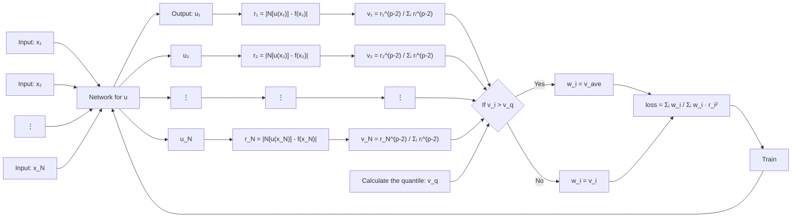

# Residual-Quantile Adjustment for Adaptive Training of Physics-informed Neural Network

Jiayue Han  
School of Data Science  
City University of Hong Kong  
Hong Kong, China  
jyhan5-c@my.cityu.edu.hk

Zhiqiang Cai∗  
School of Data Science  
City University of Hong Kong  
Hong Kong, China  
zqcai3-c@my.cityu.edu.hk

Zhiyou Wu  
Department of Mathematics  
City University of Hong Kong  
Hong Kong, China  
zhiyouwu2-c@my.cityu.edu.hk

Xiang Zhou  
School of Data Science and Department of Mathematics  
City University of Hong Kong  
Hong Kong, China  
xiang.zhou@cityu.edu.hk

978-1-6654-8045-1/22/$31.00 ©2022 IEEE

arXiv:2209.05315v2 [cs.LG] 8 Dec 2022

## Abstract

Adaptive training methods for Physics-informed neural network (PINN) require dedicated constructions of the distribution of weights assigned at each training sample. To efficiently seek such an optimal weight distribution is not a simple task and most existing methods choose the adaptive weights based on approximating the full distribution or the maximum of residuals. In this paper, we show that the bottleneck in the adaptive choice of samples for training efficiency is the behavior of the tail distribution of the numerical residual. Thus, we propose the Residual-Quantile Adjustment (RQA) method for a better weight choice for each training sample. After initially setting the weights proportional to the $p$-th power of the residual, our RQA method reassign all weights above $q$-quantile (90% for example) to the median value, so that the weight follows a quantile-adjusted distribution derived from the residuals. This iterative reweighting technique, on the other hand, is also very easy to implement. Experiment results show that the proposed method can outperform several adaptive methods on various partial differential equation (PDE) problems.

**Index Terms**—Adaptive Method, Physics-informed Neural Network, Quantile, Partial Differential Equation.

# I. INTRODUCTION

Solving partial differential equations (PDEs) has been a long-standing inevitable problem when handling real-world applications of physics and engineering. Though some of the PDEs can be solved analytically, most of them rely on numerical methods to deal with. Traditional methods such as the finite element method and finite difference method cannot tackle large-scale and high dimensional problems thus using deep neural network (DNN) in PDE computation has become a popular research topic these years [1]–[4].

A recent line of work on using physics-informed neural networks (PINN) [2] to solve PDEs has received widespread attention. This work approximates the solution of PDEs with a neural network which takes in $x$ and $t$ as input and outputs the solution $u(x, t)$. The squared $L^2$-norm (usually in Lebesque measure) of the residual for the PDEs is taken as the loss function, and the initial conditions and boundary conditions are added to the loss as penalty terms.

Albeit successful in many fields, PINN may get stuck into a trivial solution as a local minimum [5], [6]. The residuals for the PDEs equal to 0 does not mean finding the solution to the PDEs, because there are lots of trivial solutions that satisfy the condition that the residuals for the PDEs are 0. Adding boundary conditions and initial conditions can help PINN to escape from the trivial solutions. However, if the PDEs are really irregular, then PINN may face propagation failures characterized by highly imbalanced PDEs residual fields, where very high residuals are observed in very narrow regions of the domain [6].

Adaptive techniques are an efficacious approach to avoid the failure of PINN. Identifying the high-residual points in the domain can be used to prevent the propagation failure of PINN. For instance, Selectnet [7] is one of these works but relies on one extra neural network taking the role of weight at each training point to discern the importance of each point. However, Selectnet needs to solve a min-max problem for both the weighted network and the solution network. Meanwhile, in theory, the weight function in that min-max problem is only supported on the locations with the maximum value of residuals. Some careful training practice to balance both networks is critical for the success of efficient adaptive training.

The simplest and heuristic choice for the weights is to follow the value of the residuals. In the traditional grid-based adaptive PDEs method, a very classic and successful refinement strategy of adjusting mesh size is exactly based on this choice. On the other hand, the min-max adversarial adaptive training in Selectnet [7] suggests a theoretically singular distribution supported only on maximum values. However, for network-based PDEs solvers like PINN, directly assigning the weights proportional to the residuals or on the maximum values are both far away from the satisfactory performance.

In this work, we first choose the weight of each data point according to iterative reweighted least square (IRLS), which is setting weights to the normalized $(p - 2)$-th $(p \ge 2)$ power of the residuals. A higher $p$ means we pay more attention to samples with larger residuals. Tuning parameter $p$ is problem-dependent and challenging since a minuscule $p$ may nullify the adaptivity while a too large $p$ may deteriorate the performance.

To mitigate the amplifying effect of the singularity of a large $p$ value, we propose the Residual-Quantile Adjustment algorithm (RQA) to adjust the weight. Specifically, it selects the data points with residuals larger than a certain quantile of all residuals and adjusts their weights to another moderate-size value (for example the median, how to choose this value is discussed in Section V). This innovative design is inspired by the observation that when singularities occur in the domain, they are usually very concentrated. Since the residuals take a very high value near these singular locations, the distribution of the residuals typically has a long tail, which prevents the efficiency decrease in the mean square error. If the sample weight distribution would literally follow this residual distribution, most of the weights will be concentrated on very few data points near the singularity while failing to provide the necessary attention to other bulk training samples. This effect is even worse if the dimension of the PDE is higher. Our adjustment based on suppressing the weight of data points with residuals larger than a certain threshold can effectively avoid such an “overweighing” issue and achieve adaptivity robustly and efficiently.

Though simple, this RQA idea is proved to be useful. Extensive experiments show that after using quantile adjustment, the performance of using $L^p$-norm induced weight improves remarkably. We state the main contribution for this work as follows:

- RQA provides an iterative reweighting technique for network-related PDE solvers without introducing new optimization problems.
- The quantile adjustment strategy can be easily applied to any residual-based training algorithms.
- The insight of adaptivity is also reveal in this work: Adaptivity not only means to give larger weights to the worse learned data, but also involves balancing their weights with that of the well learned ones.
- By RQA, we demonstrate that with the same least square loss as the residual’s (squared) mean, the residual quantile is a good indicator in concerns of training efficiency.

The paper is organized as follows. Section II is a brief introduction to the related work for network-based PDE solvers. Problem formulation is mentioned in Section III. Section IV states our main method RQA including the details for $L^p$-norm induced weight and the quantile adjustment. In Section V, we compare RQA with other adaptive methods and discuss the choice of parameters through numerical experiments. Section VI ends the paper with a brief conclusion and future works.

# II. RELATED WORK

## Physics-informed neural network (PINN)

Using deep neural networks (DNNs) to solve partial differential equations (PDEs) has been developed rapidly. As far as we know, Deep Galerkin Method (DGM) [1] is the first method that uses DNNs to solve the PDEs. Then in 2019, Maziar et al. [2] proposed the most well-known PINN, which approximates the solution of PDEs with a neural network. The loss function is designed based on the residual, while initial conditions and boundary conditions are added as penalty terms. However, PINN may face failure when the PDEs are really irregular [5]. Thus, a series of extensions of PINN has been proposed to boost the performance of PINN from various aspects.

## Different loss functions

Apostolos et al. [8] proposed a meta-learning method to propose an alternative loss function for PINN. Gradient-enhanced PINN [9] combines the gradient information of the PDE residual into the loss function. Instead, Zeng et al. [10] used the adaptive loss function introduced in [11] to improve the performance of PINN.

## Time-dependent problems

For time-dependent problems, dividing the time segments into small time steps and training the neural networks from small time steps and then extending it into the long time steps can be helpful [5], [12]–[15]. If the problem is in the large domain, it is suggested to decompose the spatio-temporal domain to accelerate the training of PINN [16]–[18].

## Weight-based adaptive methods

The weights in each term of the loss function are constants in PINN, and these weights will affect the convergence of PINN. Tuning the weights in each term of the losses and balancing the losses will improve the performance of PINN [19]–[21]. Besides considering the weights in each term of the losses, extensive works focus on the weights for a given set of training points and most of them assign more weights to training points with high residual values [7], [22]–[24].

## Sampling-based adaptive methods

The continuous strategy in parallel to assigning weights to a fixed number of training points is to propose a distribution density function to sample training points. Such a distribution function can also be called as a weight function. Selectnet [7] trains the neural network to learn this function as the weight. In solving the Fokker-Planck equation, Tang et al. [25] directly use the solution of the Fokker-Planck equation as the weight function and learn a generative model to sample training points. Also, some other sampling-based methods use Markov chain Monte Carlo to sample the residual distribution as the weight distribution [26]–[29]. Other sampling-based methods include [6], [18], [28], [30]. However, these methods need extra non-trivial computational overhead in order to obtain the weight function or generate samples and few of them paid enough attention to the choice of the distribution function itself.

## Augmented Lagrangian methods

Besides the methods above, a series of improvements have been done to PINN based on the augmented Lagrangian method. In these works, instead of adding the initial condition and boundary conditions as penalty terms, they are considered as the constraints of an optimization problem whose objective function is the $l_2$ loss of the residual on the training set. R. Mojgani et al. proposed the Lagrangian PINN [31] framework which split the original residual into two parts and uses different networks to calculate them. S. Basir designed PECANNs [32] and a method based on dual problem [33] to make better use of the Lagrangian multiplier methods. These methods are especially efficient in dealing with failure modes of PINN for example the convection equation with a large coefficient for the $\frac{du}{dx}$ term.

# III. PROBLEM FORMULATION

Consider the PDE of the form:

$$
\mathcal{N}[u] = f(x, t), \quad x \in \Omega, \ t \in [0, T], \tag{1}
$$

where $u(\cdot, \cdot) : \Omega \times [0, T] \to \mathbb{R}$ is the PDE solution, $\mathcal{N}[\cdot]$ is a linear or nonlinear differential operator, and $\Omega$ is a domain in $\mathbb{R}^d$.

Let $r(x, t)$ be the residual of the PDE at $(x, t)$,

$$
r(x, t) = |\mathcal{N}[u(x, t)] - f(x, t)|. \tag{2}
$$

As in Physics-informed neural networks (PINN) [2], we parameterize the solution $u(x, t)$ by a neural network $u(x, t; \theta)$, where $\theta$ denotes the parameters. The solution for PDE is then obtained by optimizing parameters in the following problem.

$$
\min_\theta \int_{[0,T]} \int_\Omega r_\theta^2(x, t)\,dxdt \approx \frac{1}{N} \sum_{i=1}^N r_\theta^2(x_i, t_i), \tag{3}
$$

where $r_\theta(x, t) = |\mathcal{N}[u(x, t; \theta)] - f(x, t)|$ and $\{x_i, t_i\}_{i=1}^N$ is the dataset sampled uniformly in the domain $\Omega \times [0, T]$.

Furthermore, if there exists boundary condition $\mathcal{B}[u] = g(x, t)$ on $\partial \Omega \times [0, T]$ or initial condition $\mathcal{I}[u] = h(x)$ on $\Omega$, these conditions would be added in the form of penalty.

$$
\begin{aligned}
\min_\theta \ & \frac{1}{N} \sum_{i=1}^N r_\theta^2(x_i, t_i) \\
& + \lambda_B \sum_{j=1}^{N_B} \left| \mathcal{B}[u(x_j^{(B)}, t_j^{(B)})] - g(x_j, t_j) \right|^2 \\
& + \lambda_I \sum_{k=1}^{N_I} \left| \mathcal{I}[u(x_k^{(I)}, 0)] - h(x_k) \right|^2, \tag{4}
\end{aligned}
$$

where $\{x_j^{(B)}, t_j^{(B)}\}_{j=1}^{N_B}$ is uniformly sampled on the boundary $\partial \Omega \times [0, T]$ and $\{x_k^{(I)}\}_{k=1}^{N_I}$ is uniformly sampled in $\Omega$, $\lambda_B$ and $\lambda_I$ are two hyperparameters.

Although the mesh-free PINN approach can deal with high-dimensional PDEs problems, the convergence of this method is slow. To deal with it, Gu et al. proposed an adaptive accelerating method known as the Selectnet. Selectnet introduces an auxiliary network $\phi_r(x, t; \theta_r)$ to select the weights for each sample point $(x, t)$.

The optimization problem to be solved is the min-max problem:

$$
\min_\theta \max_{\theta_r} \int_{[0,T]} \int_\Omega \phi_r(x, t; \theta_r) r_\theta^2(x, t)\,dxdt, \tag{5}
$$

subject to the normalization condition

$$
\frac{1}{T|\Omega|} \int_{[0,T]} \int_\Omega \phi_r(x, t; \theta_r)\,dxdt = 1. \tag{6}
$$

As in most machine-learning methods, the constraints are added as the penalty terms. So the objective function becomes:

$$
\min_\theta \max_{\theta_r} \int_{[0,T]} \int_\Omega \phi_r(x, t; \theta_r) r_\theta^2(x, t)\,dxdt
-
\frac{1}{\epsilon}
\left(
\frac{1}{T|\Omega|} \int_{[0,T]} \int_\Omega \phi_r(x, t; \theta_r)\,dxdt - 1
\right)^2. \tag{7}
$$

This adaptive approach achieves the goal of self-paced learning. Meanwhile, since neural networks tend to capture low-frequency information, Selectnet can avoid the singularity in other adaptive methods, such as the binary weight method as shown in the paper.

# IV. MAIN METHODS

The main framework of RQA can be seen in Figure 1.

In Section IV-A, we propose the maximizer of the selection network in Selectnet and derive the $L^p$-norm induced weights adaptive method for PINN. Section IV-B shows the quantile adjustment technique to balance the $L^p$-norm induced weights.

## A. Adaptive through $L^p$-norm

From equation (5), we can see that in order to solve the PDE problems, Selectnet needs to conduct a min-max optimization. This kind of optimization is usually treated very carefully in the network-based method, and all the parameters should be chosen properly. Also, training an additional network is costly. We show that we can actually avoid the use of Selectnet by the deduction below.

Consider the objective function

$$
\min_\theta \max_{\theta_r} \int \phi_r(x, t; \theta_r)^{\frac{1}{q}} r_\theta(x, t)\,dxdt, \tag{8}
$$

subject to $\int \phi_r(x, t; \theta_r)\,dxdt = 1$.

We have

$$
\begin{aligned}
\int \phi_r(x, t; \theta_r)^{\frac{1}{q}} r_\theta(x, t)\,dxdt
&= \langle \phi_r(x, t; \theta_r)^{\frac{1}{q}}, r_\theta(x, t) \rangle \\
&\le \|\phi_r(x, t; \theta_r)^{\frac{1}{q}}\|_q \|r_\theta(x, t)\|_p \\
&= \left(\int \phi_r(x, t; \theta_r)\,dx\right)^{\frac{1}{q}} \|r_\theta(x, t)\|_p \\
&= \|r_\theta(x, t)\|_p,
\end{aligned} \tag{9}
$$

where $\frac{1}{p} + \frac{1}{q} = 1$, $p, q \ge 1$.

As a result, we may get rid of the extra network that approximates weight in Selectnet.

Notice that in (9), if $p = 2$, then this is exactly the traditional least square method. In the following contents, we suppose that $p \ge 2$.

Taking $\{x_i, t_i\}_{i=1}^N$ as the dataset, minimizing $\|r_\theta(x, t)\|_p$ is then approximated by minimizing

$$
\min_\theta \left( \sum_{i=1}^N |r_\theta(x, t)|^p \right)^{\frac{1}{p}}, \tag{10}
$$

which is equivalent to

$$
\min_\theta \sum_{i=1}^N |r_\theta(x, t)|^p, \tag{11}
$$

and the latter is easier to compute.

Let $\hat{\theta}$ be some parameter close to $\theta$ (for example, in iterative methods, $\hat{\theta}$ can be chosen as the value of $\theta$ from the previous iteration), the loss function above can be approximated by

$$
\min_\theta \sum_{i=1}^N |r_{\hat{\theta}}(x_i, t_i)|^{p-2} |r_\theta(x, t)|^2. \tag{12}
$$

This approach obviates the potential computation difficulty if $p$ is not an integer.

Finally, we conduct normalization and state the objective function of the $p$-norm based adaptive method as follows:

$$
\min_\theta \sum_{i=1}^N
\frac{|r_{\hat{\theta}}(x_i, t_i)|^{p-2}}{\sum_{i=1}^N |r_{\hat{\theta}}(x_i, t_i)|^{p-2}}
|r_\theta(x_i, t_i)|^2. \tag{13}
$$

As above, if the PDE problem contains boundary conditions and initial conditions, we add them as the penalty term. We first denote the residuals as below:

$$
r^{(B)}(x, t) = |\mathcal{B}[u(x, t)] - g(x, t)|, \tag{14}
$$

$$
r^{(I)}(x, t) = |\mathcal{I}[u(x, 0)] - h(x)|. \tag{15}
$$

And the loss function is

$$
\begin{aligned}
\min_\theta \ &
\sum_{i=1}^N
\frac{|r_{\hat{\theta}}(x_i, t_i)|^{p-2}}{\sum_{i=1}^N |r_{\hat{\theta}}(x_i, t_i)|^{p-2}}
|r_\theta(x_i, t_i)|^2 \\
& + \lambda_B
\sum_{i=1}^{N_B}
\frac{|r_{\hat{\theta}}^{(B)}(x_i, t_i)|^{p-2}}{\sum_{i=1}^{N_B} |r_{\hat{\theta}}^{(B)}(x_i, t_i)|^{p-2}}
|r_\theta^{(B)}(x_i, t_i)|^2 \\
& + \lambda_I
\sum_{i=1}^{N_I}
\frac{|r_{\hat{\theta}}^{(I)}(x_i, t_i)|^{p-2}}{\sum_{i=1}^{N_I} |r_{\hat{\theta}}^{(I)}(x_i, t_i)|^{p-2}}
|r_\theta^{(I)}(x_i, t_i)|^2. \tag{16}
\end{aligned}
$$

All the notations are the same as above. Note that the $p$ value for each term can be different. For simplicity, we do not distinguish them here.

## B. Quantile adjustment

The $L^p$-norm based method proposed above, however, will directly introduce “singularity”, especially when $p$ is very large. This is because during the training process, the residual for the flat area will become relatively smaller, and the residual for the singular area will become relatively larger. A large $p$ value will intensify this difference thus resulting in a larger difference in weight.

For example, Figure 2 shows the $L^p$-norm induced weight for PDE problem (33) after 1000 iterations. It can be observed that the weight of the center area is much more larger than the rest parts, which makes the data points in the middle more “important”.

Specifically, the $(x, t)$ pairs with larger residuals in the dataset may take up all the weight, and other $(x, t)$ pairs can hardly contribute to the loss function. As a result, the maximum error on the domain may be small, but the average error will be large. As a consequence, the adaptive method with $L^p$-norm induced weight may converge slowly.

To avoid the case that the loss function overlooks the data points with low weights (small residual), a straightforward strategy is to reallocate the weights of the singular area to the rest. Note that, “singularity” can be visualized as the “long tail” phenomenon in the histogram of the weights as shown in Figure 4. Therefore if we can eliminate the “long tail” phenomenon, then “singularity” can be solved. It means that the loss function can focus on the data points with large residuals without ignoring the data points with small residuals.

We now introduce quantile to deal with the “long tail” in the histogram.

**Definition 1:** The $\xi$-th quantile for the cumulative distribution function $F$ is defined as $F^{-1}(\xi) = \inf\{x : F(x) \le \xi\}$ for $\xi \in (0, 1)$.

We first select a specific quantile of the weight.

For the weights smaller than the quantile, their weights are considered to be reasonable, so they remain the same; for the weights larger than the quantile, their weights are considered to be too large, so we adjust the weights to a proper number (for example, the median of all weights). The new weights are then normalized afterward. We name this method the “Residual-Quantile adjustment” (RQA).

Figure 5 shows the result of our RQA, we can observe that the “long tail” has been cut down. With Residual-Quantile adjustment, all the data including those with notably large or small residuals can be taken care of during the training, as illustrated in Figure 6. The numerical examples in the next section show that RQA performs better than directly using the $L^p$-norm induced weight and a more intricate method Selectnet [7].

## Figure 1. Framework of our main method RQA.

Below is a text reconstruction of the block diagram shown in the paper:

# V. EXPERIMENT

The experiment section consists of three parts. In the first part, we compare our method with other adaptive methods for network-based PDE solvers. In the second part, we apply our method to high-dimensional PDEs. The selection of parameters in our algorithm is discussed in the last part.

## A. Compare with other methods

In this experiment, we compare RQA with three other adaptive methods:

- $L^p$-norm induced weight.
- Binary weighting.
- Selectnet.

The adaptive method with $L^p$-norm induced weight can be considered as our method without quantile adjustment. Binary weighting is an adaptive method that separates the dataset into 2 parts and assigns elements of the same dataset a certain constant as their weights. Specifically, a dataset with $N$ data is separated into $\eta N$ $(0 < \eta < 1)$ data with larger residuals and $(1 - \eta)N$ data with smaller residuals. Weight for the former is $w_L > 1$ and weight for latter is $w_S < 1$, these weights satisfy the constraint $w_L \eta + w_S (1 - \eta) = 1$. Here we choose $\eta = 0.8$, $w_L / w_S = 4$, which is the best pair of parameters as shown in Selectnet.

In terms of the solution network, we use 3-layer fully connected neural network (FCN) with activation function $\sigma(x) = \max(x^3, 0)$ (100 neurons for each layer). This structure of networks is applied to all experiments. The step size $\tau^{(k)}$ at the $k$-th iteration is defined as follows:

$$
\tau^{(k)} = 10^{-2 - 3j/1000}, \quad n^{(j)} < k \le n^{(j+1)}, \ \forall j = 0, \ldots, 1000.
$$

where $0 = n^{(0)} < \cdots < n^{(1000)} = n$ are 1000 equidistant segments of total $n$ iterations.

We need to mention that in many other network-based PDE solvers, a special network structure is used to make the solution satisfy the boundary condition automatically. Here, to show the capability of RQA, we just apply FCN and learn the boundary condition by adding penalty terms. Higher accuracy can be achieved if using a specifically designed network structure.

For the Selectnet, we use the same network as in the original paper, a 3-layer ReLu network with 20 neurons for each layer. The step size is fixed as $\tau_s^{(k)} = 10^{-4}$.

In our method, we set $p = 3$ for all the data inside the domain, on the boundary, and in the initial condition. The quantile adjustment for Section V-A and Section V-B refers to setting the weight larger than 90% quantile to 50% quantile, and then we conduct normalization. A detailed discussion on these parameters can be found in Section V-C.

The data points allocation of the training set is 1000 points inside the domain, 1000 points on the boundary, and 50 points for $t = 0$, for all problem settings.

Other parameters are set to be: $\lambda_B = 1$, $\lambda_I = 1$ and $\epsilon = 0.001$. At each iteration, we record the $L^2$-error and the absolute maximum loss of a test set with $N_t = 10000$ points uniformly selected from the domain.

- **$L^2$-error**

$$
\sqrt{
\frac{\sum_{i=1}^{N_t} (u(x_i, t_i) - u(x_i, t_i; \theta))^2}
{\sum_{i=1}^{N_t} u(x_i, t_i)^2}
}, \quad i = 1, \ldots, N_t; \tag{17}
$$

- **Absolute maximum error**

$$
\frac{\max_i |u(x_i, t_i) - u(x_i, t_i; \theta)|}
{\max_i |u(x_i, t_i)|}, \quad i = 1, \ldots, N_t. \tag{18}
$$

where $u(x, t)$ is the true PDE solution at $(x, t)$, $u(x, t; \theta)$ is the solution approximated by neural network at $(x, t)$, $\{x_i, t_i\}_{i=1}^{N_t}$ is the test set.

### Figure 2. Weights induced by the $L^p$-norm after 1000 iterations, $p = 3$.

**Description:** A contour-style heatmap over a circular domain shows that the induced weights are overwhelmingly concentrated near the center. Most of the domain is dark blue with very small weights, while a small central region is yellow/green with much larger weights. A side colorbar ranges approximately from 0 to 0.048. This visual supports the paper’s claim that direct $L^p$-based weighting creates a highly concentrated, singular distribution.

### Figure 4. Histogram of the weights induced by the $L^p$-norm based method.

**Description:** A histogram of weights without quantile adjustment. Most weights are concentrated near zero, while a sparse but extended right tail stretches toward larger weights. The figure explicitly marks this extended region as “Long tail”.

### Figure 5. Histogram of the weights induced by the $L^p$-norm based method with quantile adjustment.

**Description:** A histogram of weights with quantile adjustment. As in Figure 4, many weights are near zero, but the long right tail is removed or greatly shortened. The figure annotates this with “No long tail”, illustrating the effect of RQA in clipping overly large weights.

### Figure 6. Violin plot of the weights for different iterations.

**Description:** A violin plot compares weight distributions at iterations 5000, 10000, 15000, and 20000. The blue violins represent weights without quantile adjustment, and the orange violins represent weights with quantile adjustment. The blue violins are broader and extend higher, indicating more skewness and large-weight outliers. The orange violins are more compact, indicating a more balanced distribution after quantile adjustment.

### 1) Linear parabolic equation

For the first problem, we consider the linear parabolic equation, the problem setting is stated below:

$$
\begin{cases}
\mathcal{N}_1[u(x, t)] = f(x, t), & \text{in } Q := \Omega \times (0, 1), \\
u(x, t) = g(x, t), & \text{on } \partial \Omega \times (0, 1), \\
u(x, 0) = h(x), & \text{in } \Omega,
\end{cases} \tag{19}
$$

with the exact solution

$$
u(x, t) = \exp(\|x\|_2 \sqrt{1 - t}), \tag{20}
$$

and

$$
\mathcal{N}_1[u(x, t)] = \partial_t u(x, t) - \nabla_x \cdot (a(x)\nabla_x u(x, t)), \tag{21}
$$

$$
f(x, t) = -0.5u(x, t)\log(u(x, t))
- u(x, t)\log(u(x, t))
- (1 + 0.5(\log(u(x, t)))^2)u(x, t)(1 - t) \tag{22}
$$

$$
+ \sqrt{1 - t}(d - 1)/\|x\|_2),
$$

$$
g(x, t) = \exp(\sqrt{1 - t}), \tag{23}
$$

$$
h(x) = \exp(\|x\|_2), \tag{24}
$$

where $a(x) = 1 + \frac{1}{2}\|x\|_2^2$ and $\Omega := \{x : \|x\|_2 < 1\}$.

Let the problem dimension be 5, we run the four adaptive methods mentioned above (RQA, $L^p$-norm induced weight, binary weighting, Selectnet) on 10 different runs. At each run, the initials for the solution network, the training set, and the test set for each iteration are identical. The training process takes 10000 iterations. Means of $L^2$-error for all methods are shown in Figure 6 with lines and the shaded areas in the figure representing the area between $[\text{mean} - \text{std}, \text{mean} + \text{std}]$. We also plot the absolute maximum loss for all methods in Figure 7, all legends are the same as in Figure 6.

From the figure, we can see that RQA (represented in the red line) has the smallest $L^2$-error and the absolute maximum error. The binary weighting method (represented in green line) and Selectnet (represented in purple line) have the second and third best results. Using $L^p$-norm induced weight only, on the other hand, is the worse. It not only converges the slowest but also obtains the highest error. However, the only difference between RQA and $L^p$-norm induced weight is the use of quantile adjustment. This result shows that the quantile adjustment does help to avoid singularity and guarantee the performance of RQA.

### Figure 6. Comparison of $L^2$-error for various adaptive methods at each iteration for the 5-dim linear parabolic equation.

**Description:** A log-scale line chart with iterations on the x-axis (0 to 10000) and $L^2$-error on the y-axis. Four methods are shown: RQA (blue), $L^p$-norm (red), Binary Weighting (green), and Selectnet (purple), each with a shaded uncertainty band. RQA decreases fastest and reaches the lowest final error. The $L^p$-norm-only method remains clearly above the others.

### Figure 7. Comparison of absolute maximum error for various adaptive methods at each iteration for the 5-dim linear parabolic equation (“Max error” is short for “Absolute maximum error”).

**Description:** A log-scale line chart similar to Figure 6, but for absolute maximum error. RQA again has the lowest curve and fastest improvement. The $L^p$-norm-only method has the largest final error and a slower decline.

### 2) Allen-Cahn equation

For the second problem, we consider the famous Allen-Cahn equation

$$
\begin{cases}
\mathcal{N}_2[u(x, t)] = f(x, t), & \text{in } Q := \Omega \times (0, 1), \\
u(x, t) = g(x, t), & \text{on } \partial \Omega \times (0, 1), \\
u(x, 0) = h(x), & \text{in } \Omega,
\end{cases} \tag{25}
$$

and the exact solution is

$$
u(x, t) = e^{-t}\sin\left(\frac{\pi}{2}|1 - \|x\|_2|^{2.5}\right), \tag{26}
$$

and

$$
\mathcal{N}_2[u(x, t)] = \partial_t u(x, t) - \Delta_x u(x, t)
- u(x, t) + u^3(x, t), \tag{27}
$$

$$
g(x, t) = 0, \tag{28}
$$

$$
h(x) = \sin\left(\frac{\pi}{2}|1 - \|x\|_2|^{2.5}\right), \tag{29}
$$

$$
l(x) = \cos(0.5\pi|1 - \|x\|_2|^{2.5}), \tag{30}
$$

$$
k(x) =
-\frac{5}{4}\pi(d - 1)\|x\|_2 l(x)|1 - \|x\|_2|^{1.5}
-\frac{25}{16}\pi^2 h(x)(1 - \|x\|_2)^3 \tag{31}
$$

$$
+\frac{15}{8}\pi l(x)|1 - \|x\|_2|^{0.5},
$$

$$
f(x, t) = - e^{-t}(h(x) + k(x))
- u(x, t) + u(x, t)^3. \tag{32}
$$

where $\Omega := \{x : \|x\|_2 < 1\}$.

Figure 8 and Figure 9 show the mean and standard deviation of $L^2$-error and absolute maximum error over 10 repeated experiments. Our method still performs the best, followed by the binary weighting method and Selectnet. Using $L^p$ induced norm only is still the worst. This result is similar to the linear parabolic equation, which shows the generalization of our method.

### Figure 8. Comparison of $L^2$-error for various adaptive methods at each iteration for 5 dim Allen-Cahn equation.

**Description:** A log-scale line chart comparing RQA, $L^p$-norm, Binary Weighting, and Selectnet over 10000 iterations. RQA maintains the lowest error trajectory. The $L^p$-norm-only method stays noticeably higher than the others through most of training.

### Figure 9. Comparison of absolute maximum error for various adaptive methods at each iteration for 5 dim Allen-Cahn equation.

**Description:** A log-scale line chart for maximum error. RQA and Binary Weighting perform best, with RQA slightly better overall. Selectnet is intermediate, while the plain $L^p$-norm method has the highest error curve.

## B. High-dimensional Problem

In this section, we show how RQA performs for the high-dimensional case. Specifically, we compare RQA with Selectnet for the linear parabolic equation (19) and Allen-Cahn equation (25) of 20 dimensions.

The two methods are trained for 20,000 iterations over 5 repeated experiments for both problems. In every single run, we set the initialization for the solution network to be the same. The training set and test set at each iteration are also the same. During the experiment, we record the $L^2$-error and absolute maximum error of each iteration.

Figure 11 and Figure 12 show the comparison of the two methods on $L^2$-error and absolute maximum error for the linear parabolic equation. The solid line refers to the mean error and the shaded area is $[\text{mean} - \text{std}, \text{mean} + \text{std}]$ as above. The black line is our RQA and the red line is Selectnet. RQA has a smaller error than Selectnet in both figures.

For the 20-dim Allen-Cahn equation, the average $L^2$-error and absolute maximum error of the two methods are displayed in Figure 13 and Figure 14 respectively. As before, our RQA has better performance than Selectnet for this problem.

### Figure 11. Comparison of $L^2$-error between RQA and Selectnet for 20 dim linear parabolic equation.

**Description:** A log-scale line chart over 20000 iterations comparing only two methods. The RQA curve lies consistently below Selectnet after early iterations and attains a lower final $L^2$-error.

### Figure 12. Comparison of absolute maximum error between RQA and Selectnet for 20 dim linear parabolic equation.

**Description:** A log-scale line chart of maximum error. RQA drops more quickly and stabilizes at a lower value than Selectnet throughout most of the training range.

### Figure 13. Comparison of $L^2$-error between RQA and Selectnet for 20 dim Allen-Cahn equation.

**Description:** A log-scale line chart showing that RQA decreases more rapidly in the early stage and finishes with lower average $L^2$-error than Selectnet. Uncertainty bands indicate repeat-to-repeat variability, but RQA remains better on average.

### Figure 14. Comparison of absolute maximum error between RQA and Selectnet for 20 dim Allen-Cahn equation.

**Description:** A log-scale line chart similar to Figure 13, but for maximum error. RQA stays below Selectnet after the initial stage and reaches a lower plateau.

## C. Discussion of parameters

It has been shown in the previous sections that the proposed RQA performs well in solving PDE adaptively. However, we have not discussed hyper-parameters. The two important parameters are the $p$ value and the quantile we used to adjust weights for data points with large residuals.

To study the influence of these two parameters, we consider the elliptic equation as follows.

$$
\begin{cases}
\mathcal{N}_3[u(x)] = f(x), & \text{in } \Omega := \{x : \|x\|_2 < 1\}, \\
u = g(x), & \text{on } \partial \Omega,
\end{cases} \tag{33}
$$

with

$$
\mathcal{N}_3[u(x)] = - \nabla \cdot (a(x)\nabla u) + |\nabla u|^2, \tag{34}
$$

$$
f(x) =
5\pi\|x\|_2^4 \cos(I) (1 - \|x\|_2)^{1.5}
- (1 + 0.5\|x\|_2^2)L(x) \tag{35}
$$

$$
+\frac{25}{16}\pi^2 \cos(I)^2 (1 - \|x\|_2)^3,
$$

$$
g(x) = 0 \tag{36}
$$

where

$$
I(x) = \frac{\pi}{2}(1 - \|x\|_2)^{2.5}, \tag{37}
$$

$$
L(x) =
-\frac{5\pi(d - 1)\cos(I(x))(1 - \|x\|_2)^{1.5}}{4\|x\|_2}
-\frac{25\pi^2}{16}\sin(I(x))(1 - \|x\|_2)^3 \tag{38}
$$

$$
+\frac{15\pi}{8}\cos(I(x))(1 - \|x\|_2)^{0.5},
$$

$$
a(x) = 1 + \frac{1}{2}\|x\|_2^2, \tag{39}
$$

here $d$ is the dimension of $x$. The exact solution is

$$
u(x) = \sin(I(x)). \tag{40}
$$

We use RQA with different settings to solve this problem with a dimension of 5. Specifically, the $p$ value is chosen to be $p = 2.5, 3, 4, 5, 6$. Larger $p$ means more emphasis on the data points with larger residuals, however, more singularity may be introduced. So the selection of $p$ needs to be treated carefully.

For the weights larger than 90% quantile, we also study how “significant” we need to adjust them. Setting them to a large value may not eliminate singularity while setting them to a small value may make the adaptivity invalid. In the experiment below, we consider adjusting the large weights to 10%, 25%, 50%, 75%, and 90% quantile.

The selection for $p$ and quantile are paired with one another. For each $(p, \text{quantile})$ pair, we conduct RQA on 5 different runs. In Table I, we report the average final $L^2$-error for every problem setting. The best results of each column in emphasized with bold text.

From the table, we can observe an interesting result that the best error appears on the diagonal of the table. In other words, the best choice for $p$ and quantile depend on each other. A smaller $p$ value should be paired with a smaller quantile and a larger $p$ value should be paired with a larger quantile.

This observation can be explained by our previous discussion that the function of quantile adjustment is to balance between applying adaptivity and preventing singularity. For smaller $p$ values, where the weight is not large, we only need to compensate the adjusted weight with a small value. So the performance of 10% quantile is already good enough. However, for larger $p$ values, in which the weights to be adjusted are already very large, a larger value is needed. So 90% quantile works the best.

Also, from Table I, we see that the best $L^2$-error is the $p = 4$ and 50% quantile pair, which suggests that to apply RQA, one may start from a moderate quantile and a $p$ value neither too large nor too small.

To offer a more intuitive impression of the selection of parameters, we plot the average $L^2$-error at each iteration for the first, third, and fifth column of Table I in Figure 15, Figure 16 and Figure 17 respectively.

The three figures demonstrate the training process for various $p$ values when quantile 10%, 50%, and 90% are applied. For quantile set to 10%, $p = 2.5$ works the best. When the $p$ value gets larger, its performance gets worse. In the quantile 50% case, $p$ with moderate value, say $p = 4$, converges the fastest. Neither small $p$ value, for example, $p = 2.5$, nor large $p$ value, say $p = 6$, has good performance. When the quantile gets to 90%, the performance of different $p$ values is completely different from quantile 10%. Large $p$ values ($p = 5, 6$) now have better performance and small $p$ values ($p = 2.5, 3$) do not work well.

Finally, we emphasize that the above conclusion can be generalized to other adaptive methods except for $L^p$-norm induced weight. The $p$ here actually reflects the “intensity” of the adaptivity.

## TABLE I

**Average $L^2$-error for different $p$ and different quantile in RQA.**

|        | 10% | 25% | 50% | 75% | 90% |
|--------|-----|-----|-----|-----|-----|
| $p = 2.5$ | $9.199 \times 10^{-2}$ | $6.802 \times 10^{-2}$ | $1.335 \times 10^{-1}$ | $5.430 \times 10^{-2}$ | $3.276 \times 10^{-2}$ |
| $p = 3$ | $1.375 \times 10^{-1}$ | $1.590 \times 10^{-1}$ | $7.503 \times 10^{-2}$ | $2.368 \times 10^{-2}$ | $3.274 \times 10^{-2}$ |
| $p = 4$ | $1.496 \times 10^{-1}$ | $1.375 \times 10^{-1}$ | **$9.449 \times 10^{-3}$** | $2.389 \times 10^{-2}$ | $2.65 \times 10^{-2}$ |
| $p = 5$ | $3.524 \times 10^{-1}$ | $1.702 \times 10^{-1}$ | $1.962 \times 10^{-2}$ | **$1.061 \times 10^{-2}$** | $1.392 \times 10^{-2}$ |
| $p = 6$ | $3.668 \times 10^{-1}$ | $3.417 \times 10^{-1}$ | $9.424 \times 10^{-2}$ | $1.320 \times 10^{-2}$ | **$1.345 \times 10^{-2}$** |

### Figure 15. Quantile: 10%.

**Description:** A log-scale learning curve plotting $L^2$-error versus iterations for $p = 2.5, 3, 4, 5, 6$. For this low quantile setting, the smallest $p$ value ($2.5$) performs best, while larger $p$ values converge more poorly.

### Figure 16. Quantile: 50%.

**Description:** A similar learning-curve figure for the 50% quantile case. Here a moderate $p$ value, especially $p = 4$, gives the best convergence. Very small and very large $p$ values both underperform.

### Figure 17. Quantile: 90%.

**Description:** A learning-curve figure for the 90% quantile case. In contrast to Figure 15, larger $p$ values ($5$ and $6$) now perform better, while smaller $p$ values are worse. This visually supports the interaction between $p$ and the chosen quantile level.

# VI. CONCLUSION

In this work, we propose an iterative reweighting technique for the adaptive training of PINN. The weights are chosen based on the distribution of the residual with an effective adjustment step to mitigate the long tail. The proposed method, RQA, adjusts the weights by resetting those values above a certain quantile (for example the 90% quantile) toward a median value to achieve the balance between very few data points with large residuals and the majority of data points with small residuals. Experimental results show that RQA has better performance and faster convergence than the baseline methods for a few benchmark PDEs. Also, the selection of the quantile should be apropos to the selection of $p$ (the “intensity” of adaptivity). Small $p$ is advised to cooperate with a small quantile threshold for RQA. We anticipate a further exploration for the generalization of RQA applied to other high-dimensional PDE solvers beyond PINN and studying how our method can deal with failure mode for PINN.

## ACKNOWLEDGEMENT

The authors thank the support of Hong Kong RGC GRF grants 11307319, 11308121, 11318522 and NSFC/RGC Joint Research Scheme (CityU 9054033).

# REFERENCES

[1] J. Sirignano and K. Spiliopoulos, “Dgm: A deep learning algorithm for solving partial differential equations,” *Journal of computational physics*, vol. 375, pp. 1339–1364, 2018.

[2] M. Raissi, P. Perdikaris, and G. E. Karniadakis, “Physics-informed neural networks: A deep learning framework for solving forward and inverse problems involving nonlinear partial differential equations,” *Journal of Computational physics*, vol. 378, pp. 686–707, 2019.

[3] Y. Zang, G. Bao, X. Ye, and H. Zhou, “Weak adversarial networks for high-dimensional partial differential equations,” *Journal of Computational Physics*, vol. 411, p. 109409, 2020.

[4] B. Yu et al., “The deep ritz method: a deep learning-based numerical algorithm for solving variational problems,” *Communications in Mathematics and Statistics*, vol. 6, no. 1, pp. 1–12, 2018.

[5] A. Krishnapriyan, A. Gholami, S. Zhe, R. Kirby, and M. W. Mahoney, “Characterizing possible failure modes in physics-informed neural networks,” *Advances in Neural Information Processing Systems*, vol. 34, pp. 26548–26560, 2021.

[6] A. Daw, J. Bu, S. Wang, P. Perdikaris, and A. Karpatne, “Rethinking the importance of sampling in physics-informed neural networks,” *arXiv preprint arXiv:2207.02338*, 2022.

[7] Y. Gu, H. Yang, and C. Zhou, “Selectnet: Self-paced learning for high-dimensional partial differential equations,” *Journal of Computational Physics*, vol. 441, p. 110444, 2021.

[8] A. F. Psaros, K. Kawaguchi, and G. E. Karniadakis, “Meta-learning pinn loss functions,” *Journal of Computational Physics*, vol. 458, p. 111121, 2022.

[9] J. Yu, L. Lu, X. Meng, and G. E. Karniadakis, “Gradient-enhanced physics-informed neural networks for forward and inverse pde problems,” *Computer Methods in Applied Mechanics and Engineering*, vol. 393, p. 114823, 2022.

[10] S. Zeng, Z. Zhang, and Q. Zou, “Adaptive deep neural networks methods for high-dimensional partial differential equations,” *Journal of Computational Physics*, vol. 463, p. 111232, 2022.

[11] J. T. Barron, “A general and adaptive robust loss function,” in *Proceedings of the IEEE/CVF Conference on Computer Vision and Pattern Recognition*, pp. 4331–4339, 2019.

[12] C. L. Zhao, “Solving allen-cahn and cahn-hilliard equations using the adaptive physics informed neural networks,” *Communications in Computational Physics*, vol. 29, no. 3, 2020.

[13] R. Mattey and S. Ghosh, “A novel sequential method to train physics informed neural networks for allen cahn and cahn hilliard equations,” *Computer Methods in Applied Mechanics and Engineering*, vol. 390, p. 114474, 2022.

[14] K. Haitsiukevich and A. Ilin, “Improved training of physics-informed neural networks with model ensembles,” *arXiv preprint arXiv:2204.05108*, 2022.

[15] S. Wang, S. Sankaran, and P. Perdikaris, “Respecting causality is all you need for training physics-informed neural networks,” *arXiv preprint arXiv:2203.07404*, 2022.

[16] X. Meng, Z. Li, D. Zhang, and G. E. Karniadakis, “Ppinn: Parareal physics-informed neural network for time-dependent pdes,” *Computer Methods in Applied Mechanics and Engineering*, vol. 370, p. 113250, 2020.

[17] K. Shukla, A. D. Jagtap, and G. E. Karniadakis, “Parallel physics-informed neural networks via domain decomposition,” *Journal of Computational Physics*, vol. 447, p. 110683, 2021.

[18] A. D. Jagtap and G. E. Karniadakis, “Extended physics-informed neural networks (xpinns): A generalized space-time domain decomposition based deep learning framework for nonlinear partial differential equations.,” in *AAAI Spring Symposium: MLPS*, 2021.

[19] S. Wang, Y. Teng, and P. Perdikaris, “Understanding and mitigating gradient flow pathologies in physics-informed neural networks,” *SIAM Journal on Scientific Computing*, vol. 43, no. 5, pp. A3055–A3081, 2021.

[20] S. Wang, X. Yu, and P. Perdikaris, “When and why pinns fail to train: A neural tangent kernel perspective,” *Journal of Computational Physics*, vol. 449, p. 110768, 2022.

[21] Z. Xiang, W. Peng, X. Liu, and W. Yao, “Self-adaptive loss balanced physics-informed neural networks,” *Neurocomputing*, vol. 496, pp. 11–34, 2022.

[22] L. Lu, R. Pestourie, W. Yao, Z. Wang, F. Verdugo, and S. G. Johnson, “Physics-informed neural networks with hard constraints for inverse design,” *SIAM Journal on Scientific Computing*, vol. 43, no. 6, pp. B1105–B1132, 2021.

[23] L. McClenny and U. Braga-Neto, “Self-adaptive physics-informed neural networks using a soft attention mechanism,” *arXiv preprint arXiv:2009.04544*, 2020.

[24] W. Li, C. Zhang, C. Wang, H. Guan, and D. Tao, “Revisiting pinns: Generative adversarial physics-informed neural networks and point-weighting method,” *arXiv preprint arXiv:2205.08754*, 2022.

[25] K. Tang, X. Wan, and C. Yang, “Das-pinns: A deep adaptive sampling method for solving high-dimensional partial differential equations,” *arXiv preprint arXiv:2112.14038*, 2021.

[26] M. A. Nabian, R. J. Gladstone, and H. Meidani, “Efficient training of physics-informed neural networks via importance sampling,” *Computer-Aided Civil and Infrastructure Engineering*, vol. 36, no. 8, pp. 962–977, 2021.

[27] W. Gao and C. Wang, “Active learning based sampling for high-dimensional nonlinear partial differential equations,” *arXiv preprint arXiv:2112.13988*, 2021.

[28] C. Wu, M. Zhu, Q. Tan, Y. Kartha, and L. Lu, “A comprehensive study of non-adaptive and residual-based adaptive sampling for physics-informed neural networks,” *arXiv preprint arXiv:2207.10289*, 2022.

[29] J. M. Hanna, J. V. Aguado, S. Comas-Cardona, R. Askri, and D. Borzacchiello, “Residual-based adaptivity for two-phase flow simulation in porous media using physics-informed neural networks,” *Computer Methods in Applied Mechanics and Engineering*, vol. 396, p. 115100, 2022.

[30] W. Peng, W. Zhou, X. Zhang, W. Yao, and Z. Liu, “Rang: A residual-based adaptive node generation method for physics-informed neural networks,” *arXiv preprint arXiv:2205.01051*, 2022.

[31] R. Mojgani, M. Balajewicz, and P. Hassanzadeh, “Lagrangian pinns: A causality-conforming solution to failure modes of physics-informed neural networks,” 2022.

[32] S. Basir and I. Senocak, “Physics and equality constrained artificial neural networks: Application to forward and inverse problems with multi-fidelity data fusion,” *Journal of Computational Physics*, vol. 463, p. 111301, 2022.

[33] S. Basir, “Investigating and mitigating failure modes in physics-informed neural networks (pinns),” 2022.

---

**Примечание по качеству транскрибирования:**  
- Основной текст и формулы перенесены с высокой точностью.  
- В нескольких формулах PDF/извлечение текста содержало неоднозначности форматирования, особенно в выражениях (22), (26), (31), (35), (38). Они сохранены максимально близко к распознанному источнику.  
- Если хотите, я могу на следующем шаге:
  1. сделать **аккуратную вычитку LaTeX-формул**,  
  2. привести статью к **“чистому научному Markdown”** без артефактов OCR,  
  3. отдельно собрать **все рисунки и таблицы в структурированный список**.