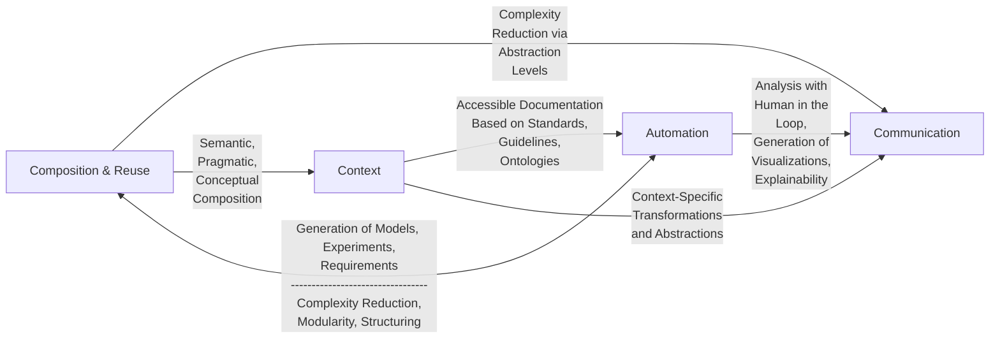

# Context, Composition, Automation, and Communication: The $C^2$AC Roadmap for Modeling and Simulation

**ADELINDE M. UHRMACHER**, University of Rostock, Rostock, Germany
**PETER FRAZIER**, Cornell University, Ithaca, United States
**REINER HÄHNLE**, TU Darmstadt, Darmstadt, Germany
**FRANZISKA KLÜGL**, Orebro universitet, Orebro, Sweden
**FABIAN LORIG**, Malmö universitet, Malmo, Sweden
**BERTRAM LUDÄSCHER**, University of Illinois Urbana–Champaign, Urbana, United States
**LAURA NENZI**, University of Trieste, Trieste, Italy
**CRISTINA RUIZ-MARTIN**, Carleton University, Ottawa, Canada
**BERNHARD RUMPE**, RWTH Aachen University, Aachen, Germany
**CLAUDIA SZABO**, The University of Adelaide, Adelaide, Australia
**GABRIEL WAINER**, Carleton University, Ottawa, Canada
**PIA WILSDORF**, Universitat Rostock, Rostock, Germany

Simulation has become, in many application areas, a *sine qua non*. Most recently, COVID-19 has underlined the importance of simulation studies and limitations in current practices and methods. We identify four goals of methodological work for addressing these limitations. The first is to provide better support for capturing, representing, and evaluating the context of simulation studies, including research questions, assumptions, requirements, and activities contributing to a simulation study. In addition, the composition of simulation models and other simulation studies’ products must be supported beyond syntactical coherence, including aspects of semantics and purpose, enabling their effective reuse. A higher degree of automating simulation studies will contribute to more systematic, standardized simulation studies and their efficiency. Finally, it is essential to invest increased effort into effectively communicating results and the processes involved in simulation studies to enable their use in research and decision making. These goals are not pursued independently of each other, but they will benefit from and sometimes even rely on advances in other sub-fields. In this article, we explore the basis and interdependencies evident in current research and practice and delineate future research directions based on these considerations.

CCS Concepts: • **Computing methodologies → Modeling and simulation;**

Additional Key Words and Phrases: Modeling, simulation, state of the art, open challenges, reuse, composition, communication, reproducibility, automation, intelligent modeling and simulation lifecycle

---
*A. M. Uhrmacher and P. Wilsdorf received funding from German Research Foundation (DFG) grant 320435134, “GrEASE—Towards Generating and Executing Automatically Simulation Experiments.” C. Ruiz-Martin and G. Wainer received funding from NSERC–Canada. F. Lorig received funding from the Wallenberg AI, Autonomous Systems and Software Program—Humanities and Society (WASP-HS), which was funded by the Marianne and Marcus Wallenberg Foundation and the Marcus and Amalia Wallenberg Foundation.*
*© 2024 Copyright held by the owner/author(s). Publication rights licensed to ACM.*
*ACM 1558-1195/2024/08-ART23*
*https://doi.org/10.1145/3673226*
*ACM Trans. Model. Comput. Simul., Vol. 34, No. 4, Article 23. Publication date: August 2024.*

---

## 1 Introduction

Simulation has become, in many areas, a *sine qua non*. Simulation, empirical evaluation, and analytical reasoning are regarded as the three pillars of science [318]. Simulation studies rely on soundly conducting and effectively intertwining steps of analyzing the system of interest, developing and refining the simulation model, executing diverse simulation experiments, and interpreting the (intermediate) results [19]. In this process, starting from the research question and the system of interest, inputs are selected and modified, assumptions and simplifications are revised in choosing a suitable abstraction for the model, requirements referring to outputs are specified and adapted, and data sources identified that might be used as input or to calibrate or validate the simulation model until a useful approximation has been achieved [170, 240] (Figure 1). Thus, each step is empowered and constrained by the methods used, as well as the knowledge and experiences of the modeler. In addition to the modeler—possibly joined by data analysts, programmers, and visualization experts—domain experts and decision makers might become involved at various points.

Recently, the COVID-19 pandemic has underlined the importance of simulation studies [183]. Simulations were widely used during the pandemic to make forecasts [263] and support decisions made by governments [28, 102], hospitals [108], industry [141], and universities [105]. Simulations revealed some current limitations in conducting such studies [90, 118], including how quickly useful models can be developed, how the results can be interpreted, and how results and crucial aspects of simulation studies can be communicated to domain experts, decision makers, and the general public [319].

To address these limitations in conducting and communicating simulation studies, further methodological research is needed in the following areas:

(1) *To ensure that simulation studies come with context:* Context is crucial for helping modelers and domain experts interpret results and reuse simulation products. It is equally important to explain simulation results to decision makers confidently.
(2) *To improve model composition and reuse:* Model composition and reuse avoid building models from scratch. This saves time and, in addition, improves analysis quality because reuse is an important incentive for designing high-quality models.
(3) *To increase simulation automation:* Central artifacts of a simulation study, such as simulation models and experiments, may be generated automatically. In addition, conducting and documenting the simulation study will benefit from intelligent guidance and support. Automation may save time for the modeler and contribute to the overall quality of simulation studies.
> **Figure 1 Description:**
> **Number and caption:** Fig. 1. The roadmap proposes to support the entire lifecycle of modeling and simulation by (1) enriching context information beyond the conceptual model that can be deployed for developing the simulation model, executing simulation experiments, and interpreting results (Section 3); (2) providing means for composition and reuse of the different artifacts of the simulation study, such as the simulation model, simulation experiments, or behavioral requirements, as well as the needed software and methods (Section 4); (3) automating large portions of the modeling and simulation cycle, also by exploiting recent developments in artificial intelligence (Section 5); and (4) fine-tuning the representation of results, models, and activities involved in the simulation study to the mental models and needs of the different users and stakeholders.
> **Image description:** The figure is a Venn diagram consisting of four large overlapping regions surrounding a central cycle.
> *   **Central cycle:** Represents the modeling lifecycle. It consists of four circles connected by clockwise arrows: "Real World" (depicted as a cloud) $\rightarrow$ "Simulation Model" $\rightarrow$ "Simulation Experiment" $\rightarrow$ "Simulation Results" $\rightarrow$ returning to "Real World".
> *   **Region 1 (Top-left corner) - Communication:** Contains icons of people with brains (symbolizing users/stakeholders) exchanging information. Graphs (pie charts, line graphs, histograms) are shown, symbolizing data transfer and visualization.
> *   **Region 2 (Top-right corner) - Context:** Contains icons of documents, knowledge graphs (connected nodes), tables, hierarchical trees, and code files marked with `</>`. These symbolize the data, documents, ontologies, and structure that accompany the study.
> *   **Region 3 (Bottom-right corner) - Composition & Reuse:** Contains icons of puzzle pieces with embedded rules/code (symbolizing model components), databases, and a certificate labeled "reusable".
> *   **Region 4 (Bottom-left corner) - Automation:** Contains icons of neural networks, a robotic system with gears, and graphs, symbolizing the application of artificial intelligence and machine learning to automate processes.
(4) *To facilitate communication:* This refers to communications between the modeler and domain expert and between the modeler and decision makers. Problems in communication appear to be a central limiting factor in effectively using simulation for decisions. Better communication would also reduce the time required to produce impact.

Any progress toward these goals relies largely on an unambiguous and accessible representation of the simulation study, its activities, sources, and products, and a goal-directed and situation-specific processing of this knowledge. Therefore, in the following section, we will first look at the current state of the art in terms of how simulation models (with a focus on discrete and stochastic models), simulation experiments, and behavioral requirements are specified. These considerations will be revisited when scrutinizing promising research avenues, including identifying methodological steps and community efforts toward achieving the identified four goals. Thereby, also interdependencies between the goals will be revealed and the role that suitable representations as given in the background play to enable progress. This article builds upon discussions during the Dagstuhl seminar “Computer Science Methods for Effective and Sustainable Simulation Studies (Dagstuhl Seminar 22401)” [58, 288].

## 2 State of the Art in Formal Approaches to Modeling and Simulation

Modeling means structuring and capturing knowledge about a given system in a suitably abstract manner. With the separation between the simulation model and executing the simulation model, the simulation model becomes explicit, accessible, and interpretable (possibly by different simulators) [325]. The value of this separation of concerns and an explicitly and formally specified simulation model is undisputed and reflected in the development of diverse formalisms [18, 131, 325], by pragmatically augmented and extended general modeling languages, such as UML and SysML [45, 104, 106, 143, 245, 311], and by the development of application-specific modeling languages [38, 48, 127, 237, 245] (Table 1).

The credibility crisis in simulation [222] and the desire to promote the reproduction of computational results [196] strengthened the case for the accessibility of simulation models and code. In addition, they moved the explicit specification of simulation experiments into the focus of interest [97, 114, 252, 306], and motivated reporting and documentation guidelines for simulation experiments [305] as well as for entire simulation studies [115, 201, 234]. Increasingly, behavioral requirements, such as expectations referring to simulation model outputs, are expressed formally in temporal logic or a **domain-specific language (DSL)** to be checkable by (statistical) model checking [5, 172] or customized algorithms [182]. Many specification languages come with a formal semantics. In Table 1, we list some approaches used for simulation models, simulation experiments, and behavioral requirements, which will be discussed in greater detail in the following. It should be noted that the distinction between formalism and DSL is not that crisp. However, with DSLs, we refer to approaches and developments that consider the concrete syntax and questions referring to the realization as a usable and comfortable language right from the beginning, whereas formalisms concentrate more on puristic core concepts.

Table 1. Approaches for Specifying Simulation Models, Simulation Experiments, and Behavioral Requirements

| | Simulation Models | Simulation Experiments | Requirements |
| :--- | :--- | :--- | :--- |
| Formalisms | DEVS [322–324], Stochastic Petri Nets [18], Stochastic process algebras [131] | (DEVS) [84], DAGs [83] | (Spatio-)Temporal logic [26, 204] |
| External DSLs | SysML [143, 311], BioNetGen [38] | SED-ML [306], MDE-based approach [315], BPMN [66] | FITS [182], BPSL [199] |
| Internal DSLs, APIs | Repast [209], ABS [149, 154] | SESSL [310], NLRX [252] | – |

### 2.1 Formalisms and Theoretical Approaches

Formalisms allow an implementation-independent specification of simulation models and other entities of relevance in the simulation lifecycle, such as simulation experiments or (behavioral) requirements (see Table 1). Formalisms cater to broad applicability. Their classification happens typically at the level of an entire system class such as discrete stepwise, discrete event based, continuous, or hybrid systems modeling [325]. We focus on modeling and simulating discrete event (stochastic) systems in the following.

#### 2.1.1 Formalisms for Simulation Models. 
Several formalisms were developed to describe simulation models of discrete event systems, including DEVS (Discrete EVent Systems Specification) [325], stochastic Petri nets [18], and processes [131].

DEVS is a formalism for discrete event modeling that allows the modeler to define hierarchical modular models. The formalism has been inspired by systems theory [33], which emphasizes a clear boundary between a system and its environment via inputs and outputs. A system decides how to react to inputs in terms of its state changes and which events to produce, and a system may be composed of interacting sub-systems. This perception results in DEVS’s modular modeling approach of loosely coupled components that can be composed to form model hierarchies. Such a design facilitates model reuse and reduces the effort required for development and testing.

In contrast to DEVS, Petri nets interpret a system as a network of dependent entities and causally interrelated concurrent processes. Petri nets form directed, bipartite graphs, with places and transitions (forming the nodes) connected by directed edges. In contrast to DEVS, whose time model is continuous so that events can occur at arbitrary times, in the original formulation of Petri nets, the update of a state (due to the firing of a transition) occurs without an explicit notion of time. However, extensions exist, such as stochastic Petri nets based on continuous time [18].

Likewise, process algebras, such as the $\pi$-calculus, targeting the modeling and analysis of concurrent processes [198], originally lacked a notion of time and later were extended to describe dynamic systems as communicating, stochastic concurrent processes in continuous time [233]. In contrast to DEVS or Petri nets, the interaction structure of the $\pi$-calculus is not fixed but dynamic: new processes and new channels for letting processes interact are frequently generated.

Whereas the syntax in which a model is written is quite different in stochastic Petri nets and stochastic $\pi$-calculus, the processes (i.e., the semantics) in either case are **continuous-time Markov chains (CTMCs)**. Thus, in contrast to DEVS, they are based on stochastic semantics. All three formalisms clearly separate model syntax, semantics, and implementation; the same model can be implemented on different platforms supporting reliability and correctness (see Section 2.2.1). An explicitly defined semantics enables verifying simulation algorithms (e.g., [228]).

Specifications in the preceding formalisms may not be succinct or too limited for specific model classes. This has resulted in further extensions of the formalisms, such as the introduction of colored tokens in the case of (stochastic) Petri nets [145] and attributes in the (stochastic) $\pi$-calculus [148]. Similarly, in DEVS, we find various extensions, for example, to capture variable model structures [24].

#### 2.1.2 Formalisms for Simulation Experiments. 
A simulation can be interpreted as an experiment performed with a model and an experiment as “the process of extracting data from a system by exerting it through its inputs” [62, p.4]. Therefore, in principle, the preceding formalisms can also be used to model this process and thus specify experiments. Already in the 1970s, Zeigler [323] emphasized the role of explicitly defining experiments conducted with a model by introducing the concept of experimental frame. An experimental frame is intended to specify the conditions under which a system is observed or experimented with [325]. Experimental frames consist of three model components: a generator that is responsible for generating input (traces), a transducer that analyzes the simulation outputs (e.g., conducting summary statistics), and the acceptor that decides whether the experimental conditions are met. DEVS has not been designed (nor have the other formalisms mentioned previously) for specifying simulation experiments, such as sensitivity analysis or simulation-based optimization. The use of formalizing a simulation experiment as a dynamic system might be limited, but with experimental frames, crucial ingredients of simulation experiments, such as scanning the parameter space, monitoring the output, and properties that need to be checked, have been identified, and later work could build upon it [132, 286, 293].

In the quest for formalisms used for specifying simulation experiments, applying workflows for specifying and conducting simulation experiments requires further consideration [114, 218, 238]. Scientific workflows aim to accelerate scientific discovery in various ways, such as by providing workflow automation, scaling, abstraction, and provenance support [74] (see also Section 3). The most basic model treats a scientific workflow as a **directed acyclic graph (DAG)** of computational tasks and their dependencies—that is, a subsequent task can only be executed once all upstream tasks it depends on have been completed. More advanced computational models view workflows as *process networks* [151], synchronized by the dataflow. Implementations of such process networks employ FIFO queues on input ports, resulting in a stream-based execution model [184, 213].

#### 2.1.3 Formalisms for Specifying Requirements. 
The calibration and validation of simulation models imply the execution of various (types) of simulation experiments [174]. Thereby, behavioral requirements play a central role. Often, they are defined in terms of data that are supposed to be replicated by the simulation or in terms of formally specified properties that the simulation output is expected to fulfill. The latter has received increasing attention during the past two decades [29]. A relevant and frequently used formalism to describe requirements relating to expected simulation results is the class of *temporal logics* [70] such as LTL (Linear-Time Temporal Logic) or STL (Signal-Temporal Logic) [86]. Temporal logics are modal logics with specific *temporal operators* that permit the specification of properties over time—for example, the *always* operator is a universal quantifier used to describe that a specification holds at all time instances, and the *eventually* operator is used to describe that a specification holds at some point in the future. Describing subsequent events using the *until* operator is also possible. There are many extensions to specify more refined behavior. SSTL (Signal Spatio-Temporal Logic) [205] and STREL (Spatio-Temporal Reach and Escape Logic) are extensions of STL with certain spatial operators and permit to describe complex emergent spatio-temporal behavior as the formation of patterns. STL-∗ [49] and TFL (Time-Frequency Logic) [87] extend STL with means to express oscillatory behavior. TSTL (Three-valued Spatio-Temporal Logic) enriches SSTL with a three-valued semantics. In this logic, statements about spatio-temporal trajectories can be true, false, and unknown, accounting for the simulations’ intrinsic uncertainty and statistical analysis [299]. It should be noted that these behavioral requirements are only one type of requirement that simulation studies face [19, 240].

### 2.2 Domain-Specific Languages

DSLs, in contrast to **General-purpose Programming Languages (GPLs)**, are designed for a specific application domain [103]. Similar to formalisms, they might be applied to simulation models and other artifacts of the modeling and simulation lifecycle (see Table 1). External and internal DSLs are distinguished. An external DSL is parsed independently of the host general-purpose language, so the model is explicitly accessible as a syntax tree. External DSLs have their own custom syntax and parser to process them. In contrast, internal DSLs are embedded within a GPL—that is, they are a kind of API designed to exhibit a natural reading flow: the host language is used in a way that gives the feel of a specific language [103], are Turing-complete, and typically are more difficult to analyze than an external DSL.

#### 2.2.1 Domain-Specific Languages for Modeling. 
Modeling languages aim for reuse, better understanding, and communicative abilities of the underlying model, and thus better sustainability of the model and simulation results. Furthermore, modeling languages can be equipped with sophisticated static analysis techniques for specific properties, giving developers quick feedback and thus considerably increasing efficiency during development and simulation. DSLs for modeling map the formalisms discussed in Section 2.1 into specific languages, including a concrete syntax, to be executed by simulation algorithms according to the formalism’s semantics. They feature various convenient domain- and problem-specific modeling constructs to simplify modeling tasks.

DSL-based simulations have the advantage that the design of DSLs promotes a clear separation of concern between the model and execution engine. This allows the modeler to focus on the model and, since the syntax and semantics of the DSL are given explicitly, to analyze the model for certain properties—for example, by model checking techniques [70] or a structural comparison of data structures [190]. This is particularly the case for external domain-specific modeling languages.

The design of models based on DSLs stands in contrast to highly optimized general-purpose simulation programs, in which a model and its execution are encoded together. Due to a lack of separation of concern, the model is not easily accessible and reusable either by a human modeler or by another inference program, for example, to analyze the model statically. In addition, the approach results in other problems, as the simulation engine has not been verified independently of the model. Both can threaten the credibility and validity of computational results [196].

The **Unified Modeling Language (UML)** [45, 104, 244, 245] has been designed as a standardized modeling language consisting of 14 different explicit modeling sub-languages for different aspects of software systems. UML’s class diagrams and object diagrams focus on structure, whereas statecharts and activity diagrams focus on behavior. Semantics has been defined (e.g., in the work of Evans et al. [96]) to make UML precise [95], but due to the general use of UML, no generally accepted semantics exists. Typically, specific profiles of UML are used if a model is to be developed to improve the system understanding via simulation. These tools synthesize executable simulation code from UML models, typically connected with a core simulation framework. Bocciarelli et al. [44] discuss UML and, in a broader sense, MBSE approaches to simulation and their merits and drawbacks.

The **Systems Modeling Language (SysML)** is based on UML for systems engineering, and thus both languages share many common modeling concepts. SysML has received widespread use, for example, in mechanical engineering [60, 106, 311]. SysML provides additional diagrams to model distributed processes and components with a static structure. SysML also supports discrete event simulation as well as continuous systems simulation. Today, SysML is mainly used for higher-level systems definitions, including evaluating design alternatives, calculating what-if scenarios, and conducting requirements compliance analysis, including necessary quality assurances and similar engineering tasks. Many of these are related to simulation [206, 283]. Because of the increasing necessity to simulate engineered systems virtually before the first physical prototypes emerge, it can be assumed that simulation using DSLs (e.g., based on SysML [68]) will become a major technique in engineering.

The syntax and semantics of a DSL reflect the primary modeling metaphor(s) and needs of the application domain or community. This becomes particularly evident if a DSL for modeling focuses on a particular application domain with a well-established modeling metaphor, such as studying gene-regulatory or biochemical systems. Consequently, the syntax of various DSLs for biochemical systems that have been developed over the past two decades builds on the reaction (or rule-) metaphor [98]. The semantics of these DSLs vary between continuous system semantics, transforming a set of reactions to a set of **ordinary differential equations (ODEs)** to be solved by numerical integration, or taking the stochasticity of the system into account by executing the model by **stochastic simulation algorithms (SSAs)** [135] (and thus interpreting the model as a CTMC [127]), or, even considering the spatial heterogeneity, interpreting reactions as collisions between particles in space [39]. Whereas switching between spatial and non-spatial semantics requires additional information (e.g., about the diffusion constant or size of reactants), the switching between ODE-based and SSA execution (or a combination thereof) is supported to occur transparently to the simulation model by various simulation tools in the field. This includes established modeling and simulation tools such as COPASI [135] and research tools such as BioPepa [67]. BioPepa is a DSL derived from the process algebra Pepa [112] and has been equipped with different types of semantics to be executed as a set of ODEs or by SSAs, depending on the biochemical system being investigated.

The role of internal DSLs for modeling grows, particularly if the subject of modeling is a hardly constrained class of models that can easily be mapped, for example, to an object-oriented GPL. This is the case in agent-based [2] and DEVS-based modeling for simulation [303, 326]. Internal or embedded DSLs allow us to use all of the features of the host language, including inheritance and type systems, and to program, for example, agents, as the modeler likes [187, 210].

Selecting a suitable host language is a crucial first step in designing an internal DSL. The ease of realizing a modeling language as an internal DSL depends on how the programming paradigm of the host language and the offered features fit the requirements of the envisioned DSL and how widely used the host language is; one advantage of an internal DSL is not to learn a new language. For example, the spread of the Java language in the late 1990s, with its object-oriented programming paradigm and its convenient features such as simplicity, platform independence, type system, reflection, and support for distributed execution, has led to the development of various [137, 193], particularly agent-based [187, 210], modeling and simulation tools. Based on these tools, specialized internal DSLs can be created tailored to specific models’ sub-classes, such as for modeling continuous-time agent-based models with CTMC semantics (Figure 2). In these cases where an object-oriented programming paradigm is adopted for modeling and simulation, the use of UML diagrams, particularly the class, sequence, state, and activity diagrams, is advocated, for example, during development and for the documentation of agent-based simulation models [32], or for conceptual modeling of discrete event systems [302].

```java
1     public class SIRAgent extends Agent {
2
3     /* ... */
4
5     addRule( () -> this.isInfectious(),
6              () -> exp(recoverRate),
7              () -> this.infectionState = InfectionState.RECOVERED);
8
9     addRule( () -> this.isSusceptible(),
10             () -> exp(infectionRate * neighbours(SIRAgent.class).
11                       filter((SIRAgent agent) -> agent.isInfectious()).size()),
12             () -> this.infectionState = InfectionState.INFECTIOUS);
13    }
```
> **Fig. 2.** Model code snippet from a rule-based Repast implementation of an agent-based simple epidemic (susceptible, infected, recovered) model. An adaptation layer enables a compact description of agent-based CTMC models in a style that resembles rule-based languages and allows the execution of agents in Repast Simphony [309]. The addRule method is provided by an abstract Agent class. It is called in the constructor of a concrete agent class. For the definition of the condition, waiting-time distribution, and effect, the anonymous functions of Java 8 are exploited.

New programming languages or paradigms with compelling features (either for modeling or simulation) always spur interest in the modeling and simulation community. **Active objects (AO)** [80, 81] are such a programming paradigm. Its characteristic feature is that tasks are executed on objects, each with exclusive resource access to the object’s memory and processor. Consequently, no interleaving occurs at the statement level but only at the task level. Suspension and resumption of tasks are governed by guards that watch for time- or data-driven events. AO languages are designed to scale to thousands of objects [256]. They constitute a language paradigm that permits event-driven simulation at scale while abstracting away from low-level concurrency. Language features such as strong data encapsulation, modules, and type safety support modular rule design similar to that shown in Figure 2. AOs have been used to simulate complex systems, such as the safety mechanisms of railway operations [153], high-performance computing interconnection networks [93], or container frameworks [287]. The AO paradigm can be extended to the simulation of real-time [150, 159, 267] and hybrid [154] systems. An interesting aspect of AO languages is that their explicit synchronization enables advanced static analysis techniques, including deductive verification [85, 152], deadlock detection [111] or worst-case resource analysis [8]. Specifically, the AO language ABS [149] was designed with the capability of analysis in mind [52]. Some AO languages, such as ABS [149], are independently executable from any host language, whereas others are conceived as libraries [129]. Nevertheless, AO languages can be classified as *internal* DSLs in the present setting because they build upon an object-oriented or object-based core language.

The appeal of a GPL as a host language for designing an internal DSL for modeling (and simulation) depends not only on features related to the ease of modeling and the execution efficiency but also on features that are related to the execution and analysis of simulation experiments—that is, how rich the ecosystem is that a potential host language offers for conducting and analyzing a wide variety of simulation experiments. Thus, also due to Python’s widespread use, low threshold, and particularly libraries offered for data sciences, several Python-based modeling and simulation tools have been developed in the past decade [192], including implementations of Petri nets [295] and DEVS-based simulation tools [294].

#### 2.2.2 DSLs for Simulation Experiments. 
The increasing awareness about the role of simulation experiments in developing simulation models and conducting simulation studies, on the one hand, and about the credibility crisis of simulation, on the other hand, pushed the development of internal and external DSLs for specifying simulation experiments. An example of an internal DSL is SESSL: the Simulation Experiment Specification via a Scala Layer [97]. It relies on bindings to simulation tools and experiment libraries to offer a wide range of simulation experiments [310], including parameter scans, sensitivity analysis, simulation-based optimization, bifurcation analysis, and **statistical model checking (SMC)**. Another example is NLRX, a package embedded in R that supports the specification and execution of various experiments with NetLogo models [252].

In addition, GPLs aimed at data sciences, such as Python, or computational science, such as Julia, increasingly support the specification of simulation experiments via libraries that offer experiment design, sensitivity analysis, and optimization methods [88, 226]. These libraries also show the fluent transition between internal DSLs and APIs [103]. The advantage of internal DSLs is their flexibility and the range of tools that are available for GPL. If combined with a thorough design of the DSL, internal DSLs enable an executable and, at the same time, highly succinct and readable specification of simulation experiments and help to establish those as first-class objects of simulation studies.

One of the drawbacks of using an internal DSL for specifying simulation experiments is that automatically interpreting, adapting, and reusing these scripts requires significant effort [223]. This is the virtue of external DSLs. During parsing, the crucial parts of the simulation experiment specifications can be easily identified and accessed. SED-ML (Simulation Experiment Description Markup Language) is an external DSL, an XML-based format in which simulation experiments can be encoded [306]. SED-ML is a community standard introduced to facilitate the reuse of simulation experiments across simulation tools (Section 4). In RASE (Reuse and Adapt framework for Simulation Experiments [315]), the simulation experiments are also encoded in a tool-independent format, namely, JSON [316]. In SED-ML and RASE, using ontologies referring to the methods used, such as specific simulation algorithms or optimization methods, is crucial (see Section 4).

Whereas the preceding DSLs have been explicitly designed for specifying simulation experiments, workflow languages are also applicable in principle. The business process modeling community has embraced BPMN [66] as a control flow oriented language suitable for business workflow applications. The scientific workflow community, however, has different requirements due to the data-intensive and compute-intensive nature of computational science applications and thus has not embraced business workflow models and standards such as BPMN or BPEL [186]. Instead, specific dataflow-oriented languages and models have been developed, sometimes with specialized features to aid workflow design and comprehension (e.g., COMAD [194] for collection-oriented modeling and design, see also the work of Zinn et al. [329]). Subsequently, CWL (Common Workflow Language) for computational data analysis workflows was defined [73]. However, control structures play a role in simulation, and consequently, adaptations of BPEL have been successfully applied for specifying and conducting simulation experiments [114].

#### 2.2.3 DSLs for Requirements. 
Another area where DSLs are important is in specifying requirements. Formally specified behavioral requirements (e.g., in a logic-based language) can be tested automatically. This applies to deterministic models [216] as well as to stochastic models [5]. To specify behavioral requirements, such as desirable properties of simulation output, variants of temporal logics are used as a basis (see Section 2.1.3), as are custom-built languages for specifying properties or hypotheses of the simulation model [182, 199, 317]. The latter efforts aim at providing languages tailored to expressing requirements or hypotheses by a modeler in “a natural manner.” Thus, the usability of the languages by users without a background in computer science propels research on these languages, even though they may forestall analysis capabilities.

Using a logic-based language (with formal syntax and model-theoretic semantics) can decrease the possibility of creating incompatible requirements and help to standardize their definition. In addition, established model checking techniques permit one to automatically verify the satisfaction of expressions in a logic language, avoiding *ad hoc* creation of property test code or even manual inspection of simulations.

In a stochastic setting, probabilistic model checking is a well-established verification technique that can compute the probability that a property expressed in temporal logic may be satisfied by a given stochastic process. However, standard model checking techniques [167] are not feasible for large-scale stochastic systems. In this case, the standard procedure is to use SMC [5, 172]. The underlying idea is to approximate the probability of satisfaction of a given formula statistically utilizing simulation, checking only a subset of the whole trajectory space, with usually a guarantee of asymptotic correctness. There are several approaches: qualitative SMC (based on hypothesis testing), quantitative SMC (based on confidence intervals), Bayesian SMC, and SMC for rare events. See other works [5, 172] for surveys on the topic. SMC is an efficient technique when the model is fully specified. Still, it is computationally too expensive to analyze a model with uncertain parameters if we want to study some parameters or input space of the model. A method to overcome this situation is smMC (smoothed model checking) [46]. Another consideration when using a logic-based approach in modeling and simulation is that formal methods can be fashioned to infer the requirements directly and automatically for trajectories. Mining logic specifications from data is a promising and challenging new line of research [27], which also circumvents the need for the modeler to specify the logic formulas.

Behavioral requirements are only one type of requirement, although likely the most obvious one relating to modeling and simulation. Several UML sub-languages support abstractly capturing structural, behavioral, and interaction requirements. With its **Object Constraint Language (OCL)**, UML provides this textual logic language OCL, which is roughly an executable subset of first-order logic with operations for container structures and associations that can be used to define properties such as requirements, invariants, and pre- or post-conditions. It is useful to provide mechanisms for underspecification [217] in the language in various forms to be able to capture known behavior but abstract away from unknown or irrelevant details. This allows iterative refinement during a development process [227] and non-deterministic and probabilistic simulations. In the context of **software product lines (SPLs)**, where variability management is considered a key aspect, requirements modeling is of central importance. It has motivated the development of a larger number of requirement modeling languages [261]. The potential of this perception and the developed languages still wait to be exploited for simulation studies, particularly in the context of model composition and reuse (see Section 4).

#### 2.2.4 The Role of Metamodeling in DSLs. 
When developing an external DSL for simulation purposes, defining the language in its constituents is necessary [72]. There are three main approaches to developing a DSL: from scratch; through reuse and variant building of a previously given DSL [63]; and via customization and adaptation of a more general modeling language, such as SysML. For textual languages, one often uses grammar to describe concrete and abstract syntax [134]. For diagrammatic languages, metamodeling [15, 69, 162, 330] is the best option to define abstract syntax as an essential core of a modeling language. Metamodeling became prominent with the MOF (Meta Object Facility) [212] and was first used as the syntactic foundation for the UML.

Metamodeling can be used to define a language’s structure and various additional ingredients, such as internal data types, default values, pre-defined functions, and simulation schedulers. These forms of language definitions support a compact and human-readable specification of simulation models, simulation experiments, or requirements, whereas if an appropriate code generator is available, the specifications can be directly mapped to executable simulation models, simulation experiments, or algorithms that analyze the results. For instance, a metamodel specification may be used to map models in SysML to models for a specific DEVS simulator [155], or models may be mapped from BPNM to DEVS, then from DEVS to executable Java code [64]. For that purpose, it helps if the source language, here SysML, was extended by DEVS-specific constructs to simplify the mapping [68].

In multi-formalism or multi-paradigm modeling, a complex system’s components are expressed through different formalisms, such as Petri nets, statecharts, and ODEs [82, 253]. The various formalisms are represented using an abstract syntax graph—that is, a “model of formalism.” Via graph grammars, their metamodels can be transformed into a common formalism, and code can be generated for simulation execution and further analysis. With respect to simulation experiments, the model-driven architecture (including metamodels) [195] has been applied to the generation of experiment designs [281] and, more generally, for specifying and generating different types of simulation experiments in a back end independent format, such as JSON [315].

More widespread use of model-driven engineering of simulation studies as a whole would increase the reusability and self-explainability of models, their requirements and assumptions, simulation experiments, and input and output data and allow further analysis techniques. For example, Zschaler and Polack [331] propose a model-driven approach based on a family of DSLs. As a central feature, they include a language for fitness-for-purpose argumentation, adapted from GSN (Goal Structuring Notation) [158]. They argue that this combination of languages allows for building trustworthy and scientifically robust simulation models.

## 3 Supporting Context within Simulation Studies

Context relates to any important information to conduct and interpret a simulation study. Collecting, revising, and representing suitable context information is also at the heart of conceptual modeling as defined in the work of Robinson [239]. It should be noted that in contrast to other areas of computer science, such as software engineering, no agreed-upon definition exists for the conceptual model. However, its importance is undisputed in the modeling and simulation field [107, 241]. Definitions range from defining the conceptual model as an abstract description of the simulation model, for example, exploiting qualitative modeling methods such as UML (see Section 2), to forming a conglomerate of all information possibly helpful in conducting and consequently, interpreting the results of a simulation study [314]. The conceptual model in the work of Robinson [239] subsumes research questions; requirements and general project objectives regarding, for example, visualization or simulation speed; model inputs, outputs, as well as the data used; scope, level of detail, assumptions, and simplifications; entities, equations (or rules) referring to the system and its dynamics to be modeled, and which modeling approach to use; and, finally, justifications for each design choice. In addition to the conceptual model, simulation experiments that have been performed with the model for calibration, validation, or analysis hold important information to interpret and reuse the results of a simulation study and consequently belong to its context as well. Similarly, previous versions of a simulation model and how they have been refined form valuable information about a simulation study [122]. Both emphasize a more process-oriented view of the context—that is, how the different sources and (sub-)products are interrelated and have been used to generate the (final) results.

### 3.1 State of the Art

To identify what is typically considered information important to interpret a simulation study, we will take a closer look at documentation standards to move from there to a process-oriented view of context and supporting methods that can be exploited for representing and processing this information, such as provenance standards and workflows.

#### 3.1.1 Reporting Guidelines for Simulation Studies. 
The wish to document information about a simulation study that helps to reproduce, interpret, and reuse its results has led to various reporting guidelines. These take the particular demands of the type of simulation model and experiments being executed into account, such as systems dynamics [234], agent-based models [116, 117], or finite element methods [94]. In addition, they may build on sources and conventions of the application field, such as ontologies [165, 305]. Independently of the type of simulation model, specific context information about a simulation study, such as research questions, assumptions, data used, and simulation experiments, is an intrinsic part of its documentation. Documentation guidelines—examples are TRACE (TRAnsparent and Comprehensive model Evaluation) [115] and STRESS (Strengthening the Reporting of Empirical Simulation Studies) [201]—aim at documenting all of the essential steps, sources, and products of a modeling and simulation lifecycle [19]. The checklist of TRACE, for example, comprises problem formulation, model description, data evaluation, conceptual model evaluation, implementation, verification, model output verification, model analysis, and model corroboration.

#### 3.1.2 Provenance and Provenance Standards. 
Reporting guidelines concern provenance—that is, providing “information about entities, activities, and people involved in producing a piece of data or thing” [202]. However, reporting guidelines typically refer to the final results of simulation studies, not the processes by which those have been generated, including variations of the different artifacts or unsuccessful attempts. Provenance opens up a specific view on context—that is, focusing on the production process of entities in which activities put sources and (intermediate) products of the simulation study into relation to each other by being used and generated by activities. Adopting provenance standards [202] allows modeling these processes qualitatively [246]. Thereby, entities, such as the research question, simulation model, simulation experiment (specification), simulation data, parameter, requirement (referring to output behavior), qualitative model, and assumption, are related by activities such as creating a simulation model, refining a simulation model, re-implementing a simulation model, calibrating, analyzing, and validating a simulation model [316].

Variations of simulation models are of interest not only to document how a valid simulation model is finally developed based on a successive refinement [122] but also in relating simulation models across simulation studies and thereby forming families of simulation models [53]. Thus, the provenance of simulation models might be partly cast as a *variability management* problem (see Section 4.2.4) and therefore open challenges approached by adopting methods from this area of software engineering.

#### 3.1.3 Workflows for Knowledge-Intensive Processes. 
Workflows are an approach closely related to capturing provenance. Workflows and workflow systems have a long history, for example, in databases and business process modeling. Already in the 1980s and increasingly in the 1990s and 2000s, the specific requirements of scientific data management led to the development of scientific workflow systems [176, 185]. Since workflow systems provide a controlled execution environment, they often support capturing provenance information at various levels of granularity [130]. Often, the very fine-grained capturing of provenance requires post-processing of the collected provenance information (e.g., user-specific filtering) to provide abstractions on demand, as shown for simulation studies in the work of Ruscheinski [248].

A downside of workflow systems is that they often treat tasks as black boxes whose semantics are opaque to users. As a result, user-oriented workflow design and meaningful provenance capture are often challenging, as the required information is unavailable. Workflows have been applied to specify (see Section 2) and execute individual simulation experiments since workflows enable flexible reuse of repetitive processes. However, applying traditional workflows to entire simulation studies is challenging, as model refinement phases are intertwined with model analysis, calibration, and validation activities. To support these knowledge-intensive processes, which are driven by the user’s expertise, declarative workflows may offer the required flexibility [290]. In one study [247], an artifact-based workflow approach is applied, specifying declaratively the lifecycle of central artifacts, such as the conceptual model (with a focus on formally defined requirements), the simulation model, and the simulation experiment and their interdependencies, and exploiting inference mechanisms based on the defined constraints to guide and support the user in conducting the simulation study.

### 3.2 Future Research Directions

Challenges to be faced when equipping simulation studies with context include agreeing on what is needed as context and settling on accessible representations; providing support for storing and collecting context information; managing and maintaining the evolution of context information; and, finally, developing methods for exploiting context for (automatically) conducting and interpreting simulation studies.

#### 3.2.1 Standardization of the Nature of Context and How to Represent It. 
As stated, various documentation guidelines exist in different areas of modeling and simulation. Identifying shared and distinctive features would further communication between application domains and insights into the respective simulation practices. It is crucial that more research outlets, such as journals, encourage policies that ensure that each simulation model or study comes with suitable context documentation. This would facilitate a simulation model’s reuse (Section 4) and increase the impact of the published research [136]. Therefore, suitable computational methods supporting documentation are required to make the effort manageable. This is directly linked to how to represent the context information. Textual documentation of simulation studies is notoriously lengthy. For example, describing an agent-based model following the ODD protocol as encouraged by the *JASSS* journal results easily in producing 30 pages [160]. Therefore, it is argued [117] that although such documentation is useful as a supplement, means for succinct documentation are needed to be included in the main body of a publication. Adopting provenance standards such as PROV-DM provides a bird’s eye view of how sources and (intermediate) products contributed via specific activities to the overall results and might be a first step in this direction [122].

> **Figure 3 Description:**
> **Number and caption:** Fig. 3. To move forward, the context of simulation studies needs to be explicitly and unambiguously represented. Therefore, the various artifacts play a role (here depicted with their individual lifecycle), including the conceptual model (research questions, assumptions, requirements, data, etc.), simulation experiments, and simulation models inspired by Ruscheinski et al. [247]. Methods are needed to interrelate those with provenance retrospectively as well as to exploit them prospectively, guiding (based on a workflow-based view) or even automatically generating the next steps (see Section 5).
> **Image description:** The illustration shows the interconnection of study artifacts. Six circular artifact icons are arranged at the top, each surrounded by a lifecycle ring divided into segments: grey for incomplete, green for successful, red for unsuccessful:
> *   **Research Question:** The text inside reads: "What is the best policy option for controlling the number of hospitalizations".
> *   **Assumption:** Text: "We assume that reactions use mass action kinetics," paired with an ontology icon `SBO:0000012`.
> *   **Simulation Model:** A code block describing chemical reactions `S(); I(); R(); >>INIT...`.
> *   **Data:** A plot with data points.
> *   **Requirement:** Text of a logic formula: `F[30,50](("inf" > 30).U[0,10](F[80,140] "inf"=== 0))`.
> *   **Simulation Experiment:** A code snippet: `execute{ new Experiment{ model = "Sir.m", scan("beta" <- ...`.
> In the lower left, a complex graph of interconnections is shown, titled **"Provenance of the Simulation Study"**, depicting a tangled network of nodes and links between versions of the artifacts.
> In the lower right, a workflow scheme titled **"Planning the Steps Ahead"** shows the sequence: "Generate Validation Experiment" $\rightarrow$ "Choose Requirement" $\rightarrow$ "Refine Simulation Model" (with an arrow pointing back toward the Provenance graph). In the top-right corner, a legend explains the meaning of the circles (artifacts with specifications) and the surrounding rings (lifecycle states).

In addition, to support exploiting context information, the more unambiguous and computationally accessible the representation is, the better. Therefore, whenever possible, DSLs (Section 2) should be applied to specify the simulation model, the simulation experiment, and the requirements formally [260, 331]. However, further ingredients of the documentation might withstand a formal representation. Here, developing domain-specific ontologies will play an important role. For example, to specify assumptions about biochemical models, the **systems biology ontology (SBO)** could be applied to match a statement about some proteins being “degraded very slowly, we assume that their concentrations remain constant throughout the time course” to the concept Concentration Conservation Law (*ID 362*) of the SBO [53]. The methods developed in the context of ontology learning offer new opportunities [7] that need to be explored to lend ontology developments new momentum (see also Section 4).

#### 3.2.2 Storing and Collecting Context Information. 
Various methods are available for storing context information. Archives may bundle relevant information about the simulation model, data, and experiments in one place [31]. In addition, web interfaces and graph databases as a back end can facilitate the documentation and particularly the retrieval of relevant information about simulation studies [53]. For providing a set of suitable and maintained tools, community efforts are required not only to push the standardizations of what does and what does not belong to the context of a simulation study (see the preceding discussion) but also to maintain the required tools and model repositories, and allow them to evolve (see also Section 4).

This does not yet address the crucial question: how can we facilitate the collection of context information? For the textual documentation of context, applying tools, such as Jupyter Notebook, can ease the burden of documenting simulation studies and enrich the documentation with interactive, computational elements [17]. However, this documentation still relies on manual efforts. Ideally, context information would be automatically collected transparent to the user (see Section 5). If workflow systems are used, those will automatically generate a corresponding documentation of what has been done, including activities and (sub-)products [130]. Automatically collected information grows typically rapidly, preventing easy access and communication. This requires some means of automatic (user-specific) filtering, interpretation, and abstraction, for which (semi-)formal approaches and encoding heuristics about simulation studies have proved crucial ingredients [248]. Alternatively, instead of workflows, approaches that collect provenance information from scripts, such as that of Pimentel et al. [230], could be combined with means for effectively monitoring the modeler and methods that infer implicit context information—for example, whether in-between variations of simulation models simulation experiments are being executed. These methods must be made broadly available for the modeling and simulation community, supporting an automatic and systematic collection of crucial context during the simulation study.

#### 3.2.3 Context Maintenance and Evolution. 
With provenance, we focus on how sources and products of the simulation study are related by activities and emphasize a process-oriented view of context. Adopting provenance standards helps to query provenance information beyond individual simulation studies [246]. However, the question remains about how the different artifacts and their evolution can be described. DSLs are an established approach, particularly in keeping track of the different artifacts. However, they are not tuned to factor out commonality among different versions, which can result in redundancy and pose challenges to maintainability.

Feature description languages [13, 257] were developed to capture commonality and variability in software artifacts. They also have a formal semantics [257]. Moreover, model transformation characterized and driven by features is available in the form of the delta-oriented programming paradigm (see the work of Schaefer et al. [254] and Section 4.2.4). These deltas can be equipped with formal assertions describing their requirements and effects, so it is possible to specify and verify properties of delta application formally [282]. This capability could be useful for making implicit assumptions about artifact variations explicit. This would support reasoning about variations of simulation models within an explorative simulation study [79].

Of course, there are substantial differences between variability within simulation studies and variability encountered in software products. For example, the context of simulation studies encompasses a wide variety of artifacts, some of which are informal, such as assumptions or research questions (see Section 2). In addition, the provenance of simulation studies records “successful” product variants and, equally, failed attempts [122]. Perhaps most importantly, provenance encompasses *unplanned* variability as artifacts in simulation studies are open to frequent, often on the fly, revisions. This is in stark contrast to variability as encountered in software design (see Section 4.2.4), where variability engineering is factored out as much as possible into an early process phase [231]. These differences create research problems that need to be addressed, but there are potential advantages from a feature-oriented view on provenance management. For example, features aggregate multiple model changes, which yields a flexible notion of abstraction that is of interest to facilitate communication with different stakeholders (see also Section 6). Due to their formal semantics, features open up further possibilities for exploiting provenance information—for example, for consistency checks within a simulation study or across different ones.

#### 3.2.4 Exploiting Context Information. 
Provenance can be exploited prospectively as well as retrospectively during simulation studies. Prospectively, context information can guide the modeler to conduct simulation studies that comply with specific standards and thus increase the quality of simulation studies. Traditionally, this interpretation of context is closely related to workflow research. As stated previously, workflow support for entire simulation studies is still rare. Developing workflow systems for knowledge-intensive problems, such as simulation studies, requires significant efforts, which exploiting process discovery methods might help reduce [268].

Context information is also invaluable for enlarging the portion of simulation studies that can be automated (a more detailed discussion is in Section 5). In the work of Ruscheinski et al. [247], context information about requirements is used to generate validation experiments automatically, whereas in another work by Ruscheinski et al. [249], convergence tests for a finite element analysis are automatically generated based on a given threshold for the discretization error. In both cases, an artifact-based workflow approach is utilized. In other work [316], provenance information enables automatically reusing simulation experiments and adapting them for newly revised and extended models. However, many open challenges remain, particularly when informal context information needs to be mapped into formal (i.e., computationally accessible) specifications, independent of whether those are assumptions, requirements, simulation experiments, or simulation models.

Even the fundamental purpose of context in simulation studies (i.e., facilitating the interpretation of its products) holds major open research questions. To facilitate interpretation, context needs to be presented at the appropriate level of abstraction and fine-tuned to the subject of inquiry (see also Section 6). The non-formality of many aspects of context and its heterogeneity aggravate the induced challenges. In summary, the interplay between the conceptual model employed in the “third layer” (scientific assumptions, requirements, etc.), the trace-based view (retrospective provenance), and the workflow-based view (prospective provenance) all need to be considered simultaneously to communicate (see Section 6) and exploit context effectively (Figure 3).

## 4 Composition and Reuse

Simulation models are often composed of separate sub-models to cope with the complexity of a system to be modeled. Consequently, a simulation model consists of a set of interacting components, each of which ideally has been designed for reuse. Similarly, other artifacts, such as simulation experiments, can be composed and reused. Generally, a composition-based design facilitates and, in some cases, enables reuse. Reuse in the context of modeling and simulation can include everything from “code scavenging” to the reuse of model components, up to the reuse of an entire model [225, 229, 242]. Reusing existing simulation artifacts promises to reduce development time and cost [221, 242, 279] and helps proliferate knowledge across a wider user community. Simulation model reuse requires methodologies for abstraction, retrieval, selection, integration, and execution [144, 242].

### 4.1 State of the Art

During the COVID-19 crisis, when simulation models needed to be developed quickly to inform policymaking, the lack of respectively the benefits of reusing model components and composing models became apparent. Popper et al. [232] describe how they reused a generic agent-based model of the Austrian population developed before the pandemic [36] and that large parts of their COVID-19 model could build on independently validated components which the final model benefitted from. As also proposed in [328], they exploited the layered architecture of their agent-based modeling and simulation framework. The challenge remains in understanding what is needed to achieve this on larger scales, including methodological approaches and initiatives that can be advanced.

#### 4.1.1 Model Composition and Reuse at Different Levels. 
The COVID-19 example mentioned previously highlights the need for fast model development times, which can be best achieved through the composition and reuse of existing models or components appropriately within the given context. The benefits of composition (and reuse) of software are well known and have also been exploited for the design of modeling and simulation frameworks [25, 75, 133, 326] and the reuse, automatic generation, and execution of various simulation experiments [316]. The composition and reuse of simulation models have a different quality, as a simulation model encapsulates a specific relation to the system to be studied, partly reflected in its context that needs consideration if the composed model shall work as intended—that is, reliably answering the current questions about the system of interest. This is the reason model composition and reuse have been identified as a central challenge of modeling and simulation [107, 229].

The LCIM (Level of Conceptual Interoperability Model) [284] describes seven levels of model interoperability to characterize which level of interoperability has been ensured in the current reuse (or composition) of models. Interoperability can refer to letting simulators interact (thus, the simulation algorithm and model are treated as a non-separable unit) or composing simulation models. In the latter case, the composed model is executed by a simulation engine. Level 1 refers to technical interoperability. Most formalisms or languages for modeling support some form of composition [131, 233, 325]. The first interesting level is the level of syntactic interoperability [279]. At this level, a more elaborate definition of interfaces and the integration of type systems becomes crucial. Interfaces kept separately from concrete model implementations guarantee that the coupling of components is syntactically correct and supports successive refinement and compatibility analysis [75, 243].

If the ontologies of the application domain are accessed to specify the components’ interfaces, we move to the next: the semantic level. According to Wang et al. [308], exchanging content is what the semantic level is about. Further up, the pragmatic, dynamic, and conceptual levels are distinguished, requiring increasing levels of information that the components have about each other’s context to correctly interpret the meaning (Section 3). However, most efforts that support composition do so at lower levels. This usually implies ensuring that input and output ports are correctly connected and that data flows in the correct format without an in-depth understanding of the assumptions and constraints of each of the connected components. In addition, as the composition may involve different modeling paradigms (multi-formalism modeling) and even integrate discrete or continuous components, suitable means for model transformations [169] or synchronization schemes for simulation are required [179]. Semantic and higher-level composability is significantly more difficult to achieve, demanding knowledge and alignment of model assumptions, constraints, and a common understanding of the simulation context (see Section 3).

#### 4.1.2 Reporting Guidelines and Formats for Reuse and Composition. 
Besides access to the source code of a model, which often requires the use of a specific simulation framework, the successful reuse of a model or some of its components within a given context requires a comprehensive and explicit description of the model’s structure, underlying assumptions, configuration, and other information that might be relevant for potential future users. Likewise, reproducing experiments necessitates information on the data and model that have been used, how the experiments were conducted, and how the outputs were conducted. Common guidelines and formats facilitate the sharing of this information.

Examples of guidelines for describing models and simulation experiments include *MIRIAM* (Minimal Information Requested In the Annotation of biochemical Models) [211] and *MIASE* (Minimum Information About a Simulation Experiment) [305]. What characterizes many of these guidelines (also those that aim to capture entire simulation studies, see Section 3.1.1) is that they were proposed by a community, meaning that a larger group of researchers developed them and signaled their commitment. There is no direct link between verbal description and the model’s components and code. Still, when applied consistently, documentation guidelines enable a high level of interoperability (and reuse) as they make assumptions, constraints, and simplifications of the model explicit. However, this heavily relies on the author’s rigor when describing the model.

The preceding reporting guidelines result in documents in the form of structured text with little to no formalization. The following formats are aimed at automatic reuse by different simulation tools. *CellML* is an XML-based model description language that originated in biology but which can be used for different types of mathematical models [180]. Its goal is to facilitate the storing and exchange of models and the reuse of model components independent of the software that has been used for model building. The language can be used for describing both the structure of the model (i.e., its components and how they are connected), as well as metadata for the annotation of the model (i.e., purpose, authorship, and references), but also for the reproduction of simulations and the visualization of outputs. A closely related language with a similar purpose is *SBML* (Systems Biology Markup Language) [138]. It is possible to translate SBML to CellML, and vice versa [271]. Both formats enforce or at least encourage using annotations and ontologies (e.g., to uniquely identify variables and parameters), which supports semantically meaningful reuse and composition of simulation models [165]. Thereby, they also address computational challenges of model composition [219]. Standardization efforts, such as SBML and CellML, have been facilitated by the momentum in systems biology in the early 2000s; existing ontologies in the application domain; and, last but not least, the structural similarity of simulation models being developed (i.e., species reaction systems often expressed as ODEs). To support other types of models, the standard core of SBML is extended by specialized packages, for example, to support spatial models [255].

Likewise, facilitating the exchangeability and reproducibility of simulation experiments requires the specification and description of the experiments using a common interchange format or language. This might include the data and the model that have been used, potential modifications that need to be applied to the model before experimentation, and how the output data are analyzed. SED-ML (see also Section 2.2.2) is an example of a format that can be used to specify simulation setups [270, 306]. In practice, it is typically not used by modelers but to export and import simulation experiments between different tools or frameworks. SED-ML offers a semantic annotation of elements using ontologies of the application domain and simulation methods.

Even though markup and exchange formats and documentation guidelines pursue different approaches, they can be connected. SED-ML, for instance, enables encoding information required by the MIASE guidelines. Yet, little work exists on the automatic conversion between exchange formats and documentation guidelines, nor on assessing the consistency between both.

#### 4.1.3 Model Repositories. 
Janssen et al. [144] discuss different types of model sharing that exist for making model code available—that is, archives (e.g., open science model libraries), web-based version control repositories (e.g., GitHub and SourceForge), journals, personal or organizational storages (e.g., Dropbox or institutional websites), and distinct framework repositories. General code repositories such as GitHub$^1$ or SourceForge$^2$ host a large number of models. A simple search of the term *simulation model* on GitHub returned nearly 2,000 hits. Several challenges exist with general-purpose code repositories. The discovery and selection of existing models are nearly impossible without prior knowledge of a specific model. The discovery relies heavily on appropriate keywords being used within the model metadata, which benefits from ontologies of the application domain and ontologies specific to the methods being used [266]. For the selection, additional information becomes crucial.

To address this, purpose-built model repositories exist. The *NetLogo Model Library*$^3$ contains hundreds of NetLogo models that contain code, instructions on how to run and modify them. Inclusion within the library requires the submission to a central database where the model is checked and released for wider community use. *CoMSES.Net*, the Network for Computational Modeling in Social and Ecological Sciences, is an open community of researchers, educators, and professionals focused on improving the development and reuse of agent-based and computational models to study social and ecological systems. The community develops and maintains the CoMSES Model Library. Upon submission, authors can request their model to be peer reviewed for structural completeness and to fulfill the CoMSES community standards. The library contains more than 7,500 publications of models, their metadata, and citations. Around 2,500 models are currently stored in the BioModels repository [175], most of which are specified in SBML with metadata that include references to established ontologies. More than 1,000 of these models have been curated. This implies in BioModels that a model has been independently tested and checked, whether the simulation results stated in the publication could be reproduced based on simulation experiments. Publishing artifacts, such as simulation models, in repositories is increasingly accompanied by some assessment of quality, which requires a separate review. This development aligns with an ACM initiative that introduces separate reviewing processes for the artifacts associated with ACM publications [3]. Five badges can be assigned to the publication after the artifact is reviewed, including *Results Reproduced*, *Artifacts Available*, and *Artifacts Reusable*.

---
$^1$ https://github.com/
$^2$ https://sourceforge.net/
$^3$ https://ccl.northwestern.edu/netlogo/models/
---

### 4.2 Future Research Directions

Model composition and reuse have the potential to enable efficient model development. However, thorough documentation, proper revalidation, sharing platforms, and incentive structures are only some community efforts required to enable reuse. Here, we discuss different existing approaches and methods that facilitate specific aspects of composition and reuse. To systematically address existing shortcomings in model reuse, further advances in community engagement and documentation formats are required, as well as new mechanisms for composing models.

#### 4.2.1 Community and User Engagement. 
To be able to reuse simulation models or their components and simulation experiments, they must be made available in the first place. A study on the availability of agent-based models indicates an upward trend regarding the share of publications that make their models available. However, model availability is still generally low (under 20% in 2018 [144]). Nevertheless, the availability of simulation artifacts alone does not promote reuse. There is a need for empirical studies focused on practitioners and researchers to understand the process of model reuse better and identify requirements. Numerous empirical studies exist on reusing software components [197, 200]. Similar empirical studies in the realm of simulation models would allow a more in-depth understanding of the barriers to model reuse. It could guide the design and implementation of solutions. These could include specific DSLs to capture research questions or model assumptions or to motivate the development of application-specific ontologies.

> **Figure 4 Description:**
> **Number and caption:** Fig. 4. Community efforts are required to maintain repositories, to develop standards and ontologies—not only for simulation models (SM) but also for other artifacts of simulation studies (Assumptions (A), Simulation experiments (SE), and Requirements (R))—to enhance composition and reuse. These efforts need to be accompanied by methodological advances that support unambiguous and succinct annotations with suitable meta-information (e.g., a simulation model’s context, see Section 3), and flexible (e.g., white box) and powerful (e.g., pragmatic-level) composition and analysis methods (e.g., comparing and interpreting variations and automatically testing assumptions and requirements, see Section 5).
> **Image description:** The illustration depicts the concept of "Repositories". A cylinder labeled "Repositories" is drawn at the bottom, containing colored geometric shapes inside. Thick lines extend upward from it.
> In the center and on the left, there are "islands" or clouds that symbolize study artifacts. They are marked with flags:
> *   Yellow islands with 'A' flags (Assumptions).
> *   Green islands with 'R' flags (Requirements).
> *   Blue islands with 'SM' flags (Simulation Models). Two 'SM' models are shown connecting (being composed).
> *   Orange islands with 'SE' flags (Simulation experiments).
> These islands are connected by dashed lines, showing the interrelationships between assumptions, requirements, models, and experiments.
> In the upper right, a hierarchical tree structure made of empty blocks extends from the 'SE' experiments, likely symbolizing ontologies or standards.
> In the lower right, four human profile heads with brains inside are shown, representing the community ("community efforts") or users involved in the process.

New methodological developments to further composition or reuse without well-functioning tools broadly supported within the community will not advance model reuse. Therefore, in addition to methodological research, there is a need for community support in contributing to, testing, and trialing various supporting tools. Drawing again from the software engineering community, tool demonstration and competitions at major conferences would contribute to the impact of methodological research and likely inspire new research questions.

#### 4.2.2 Standards and Formalizations. 
As discussed earlier, there is a need for standardized languages or formats to specify models and means to specify their context unambiguously to understand various aspects of a model and how to reuse it. However, for any new language to be successful in its facilitation of reuse requires broad community buy-in. This can be achieved through joint development of new languages across the community, ensuring that everyone contributes to their continuous development.

For example, in the area of agent-based modeling and simulation, one might build on the existing momentum of ODD, perhaps through extending ODD to various specialized domains, such as building templates for specifying models of agents with decision capabilities based on ODD+D [203]. As stated in the work of Grimm et al. [117], there is a need to complement the ODD documentation guidelines with more formal (and succinct) approaches. Transformation methods must be designed, allowing for easy translation from existing specifications to new, more formal languages or protocols.

These considerations apply to the documentation or specification of the simulation model and aspects of a simulation model’s context (Section 3). For requirements, different formal approaches mostly based on temporal logic exist (see Section 2); what is missing are means to facilitate their adoption by a community, be this in terms of languages with a suitable expressiveness, or even a repository of domain-specific requirements, such as in the form of stylized facts [30], that can be reused to check a simulation model’s validity automatically within a particular domain.

#### 4.2.3 New Mechanisms for Composing Simulation Models. 
Existing composition mechanisms, such as import/export, inheritance, refinement, and delegation, appear insufficient to compose simulation models from given constituents in a semantically valid manner. One reason is that the composition of simulation models is an intrinsically *parallel* way of composition: two submodels do not execute independently of each other, but they interfere. For example, one model might rely on the constant concentration of a certain species (and accordingly, the parameters have been calibrated); this model is then extended by being composed with another sub-model that produces this species. This leads to challenges in capturing these relationships in a way that the effects of interferences can be understood and mitigated if needed. One necessary ingredient for the composition of sub-systems is a suitable notion of scope that lets one define the boundary of a sub-system, including the quantities it may depend on and the ones that it might possibly change.

Exchanging information via output and input events might prove cumbersome or insufficient to model certain situations. For example, to capture upward and downward causation of multi-level systems, the upper levels might directly access the states of models at the lower levels and vice versa, to change their states accordingly [274]. These interactions form a kind of value coupling (i.e., different variables in different sub-components have the same value during simulation [92]), so interfaces must be enriched by other interaction means between simulation models. In many areas, the composition does not happen as a black box composition (via traditional interfaces) but can occur as a fusion [236] or merging [259] of simulation models, in which also the internals of simulation models are accessed (Figure 4). *Invariants* describe what does *not* change during the execution of a sub-model or a composition of sub-models. They are a way to define constraints that contribute to a valid composition and fusion of models. If we interpret invariants as properties expressed on simulation results (e.g., in terms of temporal logic), behavioral requirements could be rechecked whether they hold for the composed model as they did for each component (e.g., [223]).

#### 4.2.4 Representation and Evaluation of Variability. 
Hussain et al. [140] distinguish model reuse, whether individual components are reused, if the model is developed as a composition of existing ones, or if an entire simulation model is reused, and how many adaptations (variations) are introduced. These variations of simulation models can also be observed if various models have been generated over time, reflecting increasing knowledge about a system of interest, its mechanisms and behavior, and different research questions [53]. In software engineering, systematic management of variability (and commonality) is well established as a design approach known the SPL [71, 231]. Differences between related model variants are represented abstractly as *features*, which may be parameterized. A set of features and parameter values then characterizes one concrete model, called a *product* in SPL terminology. Variability modeling techniques are fairly agnostic with respect to the underlying implementation paradigm [262] and thus might be used in connection with various simulation models. Variability modeling also seems to be a promising approach to represent and reason about model variants that are stored in model repositories: to keep track of different versions that evolve over time, to interpret similarities and differences within models [128], to record incompatibility between model features, or to state specific features as being required (see also Section 3.2.3). In any case, domain knowledge is needed to define and interpret commonalities and differences.

## 5 Automation

Automation of the modeling and simulation lifecycle promises to increase complex simulation studies’ efficiency, quality, and reproducibility. To this end, automation also bears the potential to “close the loop” such that model adaptations and new experiments can be iteratively derived from previous results and studies [307]. The problem of automating feedback loops is also a central challenge in digital twins. A digital twin needs to mirror the state of its physical counterpart reliably. Hence, based on data obtained by monitoring the physical system, the model is updated, and new simulation experiments are executed automatically.

A variety of approaches for automation have been explored in the field of modeling and simulation or may be transferred from related research fields. However, automation is challenging because most knowledge rests as implicit assumptions in the modeler’s or domain expert’s mind, and the cognitive processes behind modeling and simulation are poorly understood.

### 5.1 State of the Art

When discussing automation of modeling and simulation studies, the various tasks of a simulation study have to be considered. These include conceptual modeling, building the simulation model, specifying and executing simulation experiments, data analysis, and visualization. Alongside these tasks, automation can improve a simulation study’s reproducibility, reusability, and credibility.

#### 5.1.1 Conceptual Modeling and Model Building. 
Machine learning approaches can automatically construct conceptual models from verbal descriptions. Named entity recognition, association rule learning, link prediction, ontology mapping, and process discovery are just some of the many techniques for rule, text, and graph mining discussed in the context of conceptual modeling [188]. So far, for instance, a semi-automatic approach has been developed for generating conceptual model diagrams from verbal narratives about agent-based models based on pattern-based rules and grammar about the concepts and relationships [264]. The automatic extraction may be supported by knowledge graphs that connect knowledge of an entire domain from diverse sources and allow for semantic querying [16]. The CovidGraph, for instance, interrelates publications, patents, and clinical trials with biomedical ontologies [121].

For the automatic construction of simulation models, formal transformations between domain-independent, concept-level models (also known as metamodels) and executable models in domain-specific modeling languages were developed [155]. In between the high-level conceptual model and the implementation-level simulation model, various additional layers of abstraction may need to be generated to cater to the needs of the different stakeholders. Here, techniques from process mining may come into play to produce models with differing complexity [189]. In addition to accommodating different views of the simulated problem, there has been an interest in learning model abstractions to speed up simulations [59].

To take a “shortcut” from verbal narratives to executable code of simulation models [142], there have been first attempts to use **Generative Pre-trained Transformer (GPT)** language models for model building (see the GPT family of models [50]). These types of natural language models have the capability to generate and organize semantic concepts [124].

Another major class of approaches aims to generate simulation models that can accurately capture some (measured) time series data [89, 208]. This includes discovering the underlying nonlinear differential equations and their parameterizations using symbolic regression, which is based on genetic programming principles [278]. However, symbolic regression is computationally expensive and prone to overfitting. To overcome these challenges, sparse regression has been used for identifying non-linear dynamics (SINDy) [51]. This approach is based on the assumption that only a few terms define the dynamics of a system. Sparse identification has also been tailored for biochemical reaction networks by introducing a library of candidate components that may be involved in a reaction system [55]. In contrast to SINDy, this approach considers system components not only individually but also as couplings between them. In addition, the formulated regression problem can be solved by a non-negative least squares algorithm. Methods for sparse Bayesian inference can additionally provide uncertainty estimates [147]. To effectively recommend models that achieve the desired behavior, the automatic retrieval and incorporation of context information from literature was investigated [6].

#### 5.1.2 Simulation Experiments and Model Execution. 
With respect to simulation experiments, various approaches have focused on their unambiguous design, generation, and reuse. Consequently, languages for specifying efficient experiment designs based on hypotheses [181], logics for checking temporal and spatial properties [26, 204, 205], and metamodels for making the ingredients of different types of simulation experiments explicit [315] were developed and applied in generating simulation experiments automatically [316] (see Section 2). In addition, frameworks exist that provide general guidance for the experimentation process—for example, the SAFE simulation automation framework for experiments guides its users through the initialization of model parameters, the configuration of parallel simulation execution, the processing of output data, and the visualization of the results [224].

To lend further support, assistance for simulation experiments has been tailored to the specific type of simulation experiment at hand. In particular, which methods and parameterization to use, such as variance-based analysis versus partial rank correlation coefficients [313] in sensitivity analysis or batch mean versus moving window in steady-state estimation [173], has been addressed. With such specialized guidance for setting up these analyses and means for executing the experiments automatically, problems regarding the validity and reproducibility of a model can be identified or even avoided. In one study [90], for example, the importance of sensitivity and uncertainty analysis was demonstrated for applying and interpreting a COVID-19 model. The model of the pandemic was shown to be highly sensitive with respect to several of the intervention, disease, and geographic parameters: uncertainty in these input parameters amplified the uncertainty in the model output by 300%. Providing such information automatically, in addition to the simulation result itself, is crucial for the decision makers to interpret adequately, for example, the number of available ICU beds predicted by the model.

Furthermore, generating and executing simulation experiments automatically may support model-building decisions and drive the progress of an entire simulation study. In the approach of sensitivity-driven simulation development, for example, the model is refined or reduced depending on the outcome of sensitivity analysis [277]. However, clear guidelines for when to conduct which analysis may not exist. In addition, the question of which specific method to select cannot easily be answered. For example, in the context of optimization, choosing the right method proved difficult as the response surface of the objective function would have to be known *a priori* [298]. Gradient-based optimization methods, for example, assume smoothness of the response surface. However, this is not the case for many simulation optimization problems. To deal with non-smooth response surfaces, novel approaches for automatic differentiation over discontinuous functions with smooth interpretation can be employed [166].

There is a growing pool of machine learning approaches with the goal of choosing which method to apply to solve a problem in an automated way. Work in this area includes an automated selection of methods and hyperparameters in integer programming solvers, for example, via optimized algorithm portfolios [164], synthetic problem solvers for composing algorithms for various subtasks of simulation experiments [173], premise and strategy selection in automated theorem proving [9], and automated selection of the architectures and hyperparameters in deep neural networks [327].

Similarly, approaches for adaptively selecting the most efficient simulation algorithm [126], adaptive methods for an evenly distributed Pareto set in multi-objective optimization [139], or adaptive parallelization of simulations in heterogeneous hardware environments [321] have been investigated. When dealing with limited resources, approaches for test prioritization could filter out the experiments or simulation runs that are most critical, for example, in testing the validity of a simulation model [207]. In addition, a metamodel-based approach has been applied to automate the implementation and deployment of distributed simulations in HLA (High-Level Architecture)-compliant cloud services [43].

#### 5.1.3 Data Analysis and Visualization. 
Another research target is the automatic analysis, interpretation, and visualization of simulation data and data used as input for calibration or validation. Various supervised and unsupervised machine learning methods can be combined in a knowledge discovery process for simulation data [99]. These, in addition to advances in clustering and classification of time series data [10], as well as detection of oscillations [76] or outliers [37], will be crucial for providing automatic support in the data analysis, visualization, and interpretation phase, and to go beyond manual validation. With the increasing push for sustainability and efficiency of computing, specifically in simulation studies (“green simulations”), parts of simulation outputs may be stored and reused for answering new questions [101].

#### 5.1.4 Reproducibility, Reusability, and Credibility. 
Ensuring the reproducibility, reusability, and credibility of models and associated artifacts are ongoing challenges (see Sections 3 and 4). Accordingly, approaches for recording provenance traces of entire simulation studies in a non-intrusive manner and presenting aggregated views on provenance are of high relevance [41, 248]. To capture provenance, and therefore to document a simulation study automatically, approaches such as system wrappers, application reporting, operating system observation, or log file parsing [11] have been explored. They allow observing modelers in their usual working space, such as specific IDEs (integrated development environments), consoles, or libraries.

To correctly capture the provenance traces and to understand their meaning, methods for detecting, interpreting, and visualizing the differences between model versions are required [109]. The variability in model versions may, for example, refer to different parameter settings, level of detail, the goals and hypotheses addressed, and the choice of modeling formalism. Approaches to managing the variability of models (particularly over time) are discussed in Section 4.2.4.

Provenance traces of previous simulation studies may be used to construct workflow models that can be applied in future simulation studies to execute suitable next actions automatically. Here, process mining techniques may automatically generate data science workflows from code [34] and provide case-based support [171].

### 5.2 Future Research Directions

Open challenges in the automation of simulation studies include the necessity for semantically annotated knowledge as a prerequisite for automation, the effective application of diverse machine learning methods, the imposition of constraints on automation (particularly human involvement), and the demonstration of the benefits of newly developed automation methods for modelers and other stakeholders in simulation studies.

#### 5.2.1 Semantically Annotated Knowledge. 
Automating simulation studies requires explicit and formally specified or annotated knowledge about all modeling and simulation lifecycle phases. This includes knowledge about the goals and intentions behind the activities of the modeler (e.g., calibration, validation, or prediction), specific hypotheses regarding the model behavior under certain circumstances, and knowledge of established methodologies of a domain.

When applying machine learning approaches for automation, knowledge is required, for example, for annotating the training, test, and validation data, for selecting relevant features, and for interpreting the results. In addition, when applying rule-based inference systems, explicit and semantically unambiguous knowledge is the foundation for automatic reasoning about simulation studies.

The approaches presented in Section 2, including model-based approaches, ontologies, DSLs, and temporal logics, will be essential for unambiguously and machine accessibly representing the various knowledge. In addition, provenance graphs and other documentation standards discussed in Section 3 will be crucial, as they contain valuable information about how the different artifacts of a simulation study are related. Moreover, open source software and open repositories need to be facilitated to enable automatic retrieval and exploitation of the explicitly specified knowledge.

The overall body of knowledge about modeling and simulation studies will be growing by leveraging the various formal and open methods. This knowledge and the methods for automation may be shared and exploited within but also across application domains and simulation approaches (e.g., finite element analysis), as simulation studies often share important characteristics [315].

When reusing information within and across domains and approaches, beyond formally specifying the information needed, there is the additional challenge of dealing with the different terminologies used. Without controlled, structured vocabularies (ontologies) that provide clear semantics to the expressions, more general support will remain elusive.

Efforts toward collecting and consolidating that knowledge need to be truly community driven. This includes regular opportunities for consultation and exchange via simulation working groups and the collaborative development of tools via hackathons. To facilitate these processes, they may be integrated with existing (domain-specific) organizations, such as COMBINE (COmputational Modeling in BIology NEtwork) or the OMF (Open Modeling Foundation).

#### 5.2.2 Intelligent Modeling and Simulation Lifecycle. 
So far, automation has merely targeted individual steps of the modeling and simulation lifecycle, such as conceptual modeling, model building, experiment specification, experiment execution, and output analysis. Future research can be directed toward improving the automation of these steps but also toward combining and integrating existing and newly developed approaches to support modeling and simulation studies as a whole. Figure 5 shows the tasks of the modeling and simulation lifecycle and lists methodologies used for enhancing the degree of automation in these tasks. In addition, the various sources that provide context information for automation are depicted. We expect suitable combinations of these approaches to be able to make (semi-)automatic, intelligent decisions during the modeling and simulation lifecycle.

Various questions can be asked, such as “How can the emerging hardware be efficiently utilized for modeling and simulation?” and “Can modeling and simulation also ride on the AI/ML wave to make it more efficient and sustainable?” [57]. Specific questions regarding the modeling and simulation lifecycle still not answered automatically include, for example, when and how to refine a model further or reuse and compose existing model components (see Section 4) or how to generate a model from scratch when no data is available for model fitting. Not only simulation models but also simulation experiments, requirements, and even assumptions may be automatically generated depending on the context provided. In addition, automation may assist in deciding
> **Figure 5 Description:**
> **Number and caption:** Fig. 5. Enriching the different tasks of the modeling and simulation lifecycle (adapted from Balci [19]) with intelligent methods to enhance the automation in generating the conceptual model, the simulation model, and simulation experiments, as well as in interpreting and communicating the simulation results.
> **Image description:** A complex diagram representing the modeling and simulation "lifecycle", incorporating context enrichment methods.
> In the upper-left section, a "Real World" cloud is positioned. An arrow extends downward from the cloud to the "Conceptual Model" block.
> Blue text labels specify the formalization methods used at each stage. The transition leading to the conceptual model is labeled "specify (NLP, Process Mining, KGs, Ontologies, DSLs, ...)".
> The central section of the diagram forms a cycle between four core blocks: "Conceptual Model" → "Simulation Model" → "Simulation Experiment" → "Simulation Results".
> The transition from the Conceptual Model to the Simulation Model is labeled "specify (DSLs, Metamodels, Transformations, ML, Workflows/Provenance, ...)".
> The transition leading to the Simulation Experiment carries the same label: "specify (DSLs, Metamodels, Transformations, ML, Workflows/Provenance, ...)".
> Icons representing various actors and artifacts are positioned around these core blocks:
> *   "Stakeholders" interact with the "Real World" and receive "Reports".
> *   "Reports" are connected to both stakeholders and monitoring systems.
> *   "Monitoring", "Workflows", and "Provenance" supply data to the lifecycle cycle.
> *   "Goals", "Scientific Publications", and "Data" (represented by target, book stack, and graph icons, respectively) provide context for the models.
> *   On the right side of the diagram, "Containers", "Repositories", and "Scripts" (marked with the `</>` code symbol) also contribute context to the cycle.
> The transition leading from simulation results back to stakeholders is labeled "communicate, make decisions (Visualization, NL Generation, ...)".
> A legend in the upper-right corner explains that solid arrows represent processes or facilitation, blue text indicates methodology, and dashed arrows represent the creation or use of context.

which type of simulation experiment to conduct using what method and parameterization or when to collect more data and what kind. These decisions might be based on state-of-the-art machine learning methods. A considerable challenge in this regard is acquiring data for training, testing, and validating the learning models. To be suitable input data for machine learning, existing simulation studies need to be semantically annotated with context. Ontologies may, for example, provide context information about the type and role of simulation experiments, as well as the methods applied.

However, this manual annotation and data collection entails a substantial workload overhead for the modelers, and the potential payoff in terms of development time may not sufficiently justify these efforts. One solution to circumvent the manual effort could be the generation of synthetic data (i.e., synthetic simulation studies) to train machine learning models. Either way, the challenge of dealing with incorrect, inconsistent, or incomplete knowledge when building learning models needs to be addressed.

#### 5.2.3 Large Language Models for Simulation. 
Following the release of ChatGPT on November 30, 2022, new developments in natural language generation have changed how we think and work, including in science and engineering. ChatGPT and other **large language models (LLMs)** are based on transformer architectures and pre-trained on massive datasets, which may further be fine-tuned to specific applications [177].

The use of LLMs to support simulation development and to automate the entire modeling and simulation lifecycle is becoming a topic of growing interest. For instance, Giabbanelli [110] identified four main modeling and simulation tasks where text generation via LLMs may be effectively applied. The first one is explaining the simulation models’ narrative to be understandable for all stakeholders, which will also facilitate participatory modeling (see Section 6). The second one is focused on summarizing simulation outputs and conveying the main differences between what-if scenarios. The third task is generating textual reports to aid the interpretation of simulation visualizations. Last, LLMs may assist in finding and explaining simulation errors and offering guidance to resolve them, thereby assisting in verifying and validating simulation models.

Recently, LLMs have also been trained to generate code in various programming languages [291]. For simulation models, the automatic generation of fully functional and executable simulation models has been discussed [142]. However, generating simulation experiments, requirements, or assumptions in DSLs also needs to be investigated. In software engineering, there has been a trend toward no-code and low-code development for several years, intending to minimize the amount of manual coding required [320]. Certainly, LLM-powered tools will soon also drastically change how we develop and analyze simulation models and implement modeling and simulation tools.

#### 5.2.4 Human in the Loop. 
Most simulations are designed to be interpreted by humans. Keeping humans in the loop during the modeling and simulation lifecycle via approaches like visual modeling or interactive, exploratory analysis of results is therefore one of the primary goals of providing automatic support for simulation studies. Different levels of information need to be conveyed to the decision makers, domain experts, and modelers (see also Section 6). Even if substantial parts of a simulation study are conducted automatically, humans may want to retain control over the intelligent modeling and simulation process. This includes establishing trust in the automation, for example, based on methods for explainable AI. Furthermore, parts or sequences of the modeling and simulation lifecycle may require user-specific or project-specific workflows instead of a one-fits-all approach. Thus, approaches for tailoring the modeling and simulation workflow (e.g., via preference learning) will be more than welcome as long as some ground rules, such as “do not use the same data for calibration and validation of the model,” are kept in mind. These approaches ideally learn “as you go,” with as few customizations by the user as possible. However, a compromise will have to be made that trades off the user overhead of manually entering additional information against increased support when conducting a simulation study.

#### 5.2.5 Evaluation. 
In modeling and simulation research, new software is typically evaluated with respect to its runtime performance and the number of steps required using benchmark models [146]. Moreover, illustrative case studies from diverse application areas can be used for demonstrating new methods and tools, such as in the work of Kleijnen [161]. Nevertheless, there is still a need for suitable benchmarks and measures for assessing the gain in productivity and the reduction of error in simulation studies by automatic, intelligent support. In particular, there is a need for both quantitative and qualitative metrics for how efficient (with respect to time and other resources), effective (in terms of results and information gain), and how accurate (without technical or methodological errors) the automation is. Realistic case studies with representative user groups are required to evaluate the superiority of automatic support compared to the fully manual or randomized case. Depending on what task is evaluated (e.g., automatic model generation, algorithm selection, or output interpretation), different measures and different study designs may be required.

For users, including modelers and stakeholders, well-designed studies are crucial in providing the necessary argument for the widespread adoption of the developed automation methods and tools in their daily practice. For researchers, however, a thorough—and if possible quantitative—evaluation will improve understanding of the developed method and their impact and guide future research directions. In the field of visual computing, quantitative methods, and user studies became a separate research field, which is reflected in the numerous projects and research centers, as well as recommendations on the topic (e.g., [1, 56]). There, publishers increasingly demanding explicit reporting of user studies (e.g., the journal *Visual Computing for Industry, Biomedicine, and Art* expects documentation via the STROBE guidelines for observational studies [301]). Similar initiatives will have to be pursued in modeling and simulation.

## 6 Communication and Stakeholder Understanding

Effective communication with stakeholders (decision makers and others with a stake in the outcome of the simulation study) is a prerequisite for successfully influencing decisions with simulation [61, 250]. Effective communication includes working with stakeholders to understand their beliefs and preconceptions, the underlying goals of the simulation study, and the broader organizational context in which decisions based on simulation will be made [250, 276]. Effective communication also includes explaining simulation study conclusions in clear language tailored toward stakeholders’ viewpoints. Although the simulation analyst may be confident in the simulation’s accuracy because of deep knowledge of the simulation implementation, stakeholders often lack this basis for confidence. The simulation analyst may try to convey this knowledge by explaining how the simulation works, but this faces obstacles. First, many decision makers (e.g., public officials and leaders in industry) lack training in computer-based simulation and other quantitative prediction methods, which makes it difficult for them to judge the accuracy of a simulation based on detailed technical explanations. Second, decision makers tend to be busy, which makes even the technically trained among them unwilling to invest the time needed to parse detailed explanations. Third, simulation models are unable to represent every detail of the real world and often have input parameters that are hard to estimate accurately. Thus, even a complete understanding of how a simulator works may be insufficient to give high confidence in the accuracy of its predictions.

Other forms of communication and analysis, better tailored to the stakeholders and their situation, may be required to build a basis for confidence in a simulation’s accuracy and to inform a decision properly. For example, imagine an agent-based simulation model that predicts the effect of public health interventions (e.g., COVID-19 vaccinations) on health outcomes. The simulation might predict that allocating *fewer* vaccines to older individuals and more toward younger ones *decreases* mortality. Stakeholders may find this counterintuitive because they think (correctly) that older individuals have a higher mortality risk when infected with SARS-CoV-2. A simple, clear explanation would be, “Young people are more social, and vaccinating them prevents the fast spread of the virus, which indirectly reduces infections in older people.”

### 6.1 State of the Art

Successful simulation analysts must communicate directly and extensively with stakeholders to understand their viewpoints and explain simulation outputs. While partial automated support exists for these tasks (described in the following, including visualization, utility, and prior elicitation methods for learning stakeholder goals and beliefs), many communication tasks are not sufficiently supported by current computer science methods.

#### 6.1.1 Best Practices from Simulation Practitioners. 
Experienced simulation practitioners have written about their experience using simulations to inform stakeholders. Two studies [250, 275] argue for the importance of understanding stakeholders: how they will potentially use simulation results, how they define success, their background, and the broader power structure and organizational context in which they operate. Both also point to the danger of being asked to perform a simulation study that “justifies” the correctness of a decision in hindsight. This phenomenon also arises using evidence in public health policy [20]. Sadowski and Grabau [250] argue for the importance of delivering results in a timely manner that aligns with deadlines when decisions must be made. Sturrock [275] points out that stakeholders, who often have substantial domain expertise, can be valuable partners in validating a simulation model. He also advises simulation analysts presenting results to avoid excessive detail, to avoid overemphasizing the accuracy of their output data, and to contextualize information from the simulation by explaining how it relates to stakeholders’ needs. In the context of healthcare, Baldwin et al. [20] argue for the value of an iterative approach where simulation analysts closely collaborate with stakeholders to build a simulation model, reminiscent of co-design approaches to public policy [40]. This helps create a shared understanding among stakeholders of how the simulation works and the reasoning behind its design. This is highly related to the concept of participatory modeling (see Section 6.1.5).

#### 6.1.2 Communicating about Scientific Evidence with Policymakers. 
A line of research reviewed in other works [214, 215, 269] studies how scientific evidence and models influence policy decisions, with much of the literature focusing on public health. They find a significant gap between policy decisions and scientific evidence that could support these decisions. Indeed, Smith and Stewart [269] go as far as to argue that the primary value of evidence tools to public health policymakers is actually not that it often leads to better decisions but that its use can signal to others that the policymaker is making “good” decisions.

Factors that support the use of evidence for influencing policy decisions include decision makers’ perceptions of evidence quality [215], a culture of using evidence to make decisions [215], timeliness and relevance of the evidence [214], the need to account for the practical context in which policy decisions are made [215], and the strength of the relationship and level of collaboration between policymakers and researchers [214]. While much of this literature focuses on the influence of evidence reviews, some work [280] specifically considers the influence of quantitative models. This work points again to the importance of decision makers’ perceptions of evidence quality, which can be supported by peer review, transparency, and the value of user support for models.

Science communication [54, 156] is a related endeavor that includes methods for creating scientific awareness, understanding, literacy, and culture among stakeholders, decision makers, and the general public. For more than 50 years, science communication has been seen as a research field with tools and techniques mostly drawn from social and behavioral sciences [119]. As many challenges are shared, relevant principles and techniques can be borrowed to communicate simulation studies to decision makers and stakeholders. A good example is research toward tools that summarize scientific articles in understandable language (e.g., see the work of Guo et al. [120] for biomedical research articles).

#### 6.1.3 Learning Stakeholder Preferences and Beliefs. 
As argued previously, the successful use of simulation to support decisions requires the simulation analyst to know how the simulation results will be used to support decision making [250, 276]. The most common approach for learning about decision criteria is to talk with a decision maker. However, with the increasing size and complexity of models, detailed walk-throughs become infeasible with respect to timeliness with which decisions need to be taken, as, for example, argued by Davis [78] for defense applications. Similar experiences are stated by the Defense Science Board [42] even for cost-effective and innovative ways to test new ideas or prototypes. Their report discusses how decision makers need information from quick-term analyses while experts are not equipped to provide that.

Different approaches have been suggested to systematically determine the relevant decision criteria to be taken into account when developing simulators to support decision makers: multi-attribute utility theory models how humans make decisions when multiple outcomes matter. Utility elicitation and preference learning methods [65] estimate such utility functions from stakeholder feedback. Closely related to utility elicitation methods, prior elicitation methods [35] estimate these probability distributions from decision maker feedback.

There is a large and closely related literature on multi-criteria decision making and multi-attribute utility theory [304]. This literature focuses on supporting one or a group of decision makers in coming to a decision. In the context of a simulation study, this includes lowering the cognitive effort required to identify the most preferred option among those that have been simulated. Much of this literature can be understood as helping decision makers explore a Pareto frontier—the set of non-dominated outcome vectors—with high-dimensional outcome vectors.

In conjunction with multi-criteria decision making, there is literature on multi-objective optimization combining simulation and multi-objective Bayesian optimization. Here, there are two lines of literature: one estimates the Pareto frontier without modeling the human decision maker [77, 163], and another models the decision makers’ utility function to help focus simulation effort on the parts of the Pareto frontier that are most important to a final decision [14, 178]. There is also a line of literature on preferential Bayesian optimization [113] which works directly with pairwise comparison feedback from a decision maker over potential decisions. Algorithms developed seek to minimize the number of pairwise comparisons needed to help the decision maker find a good decision.

Existing automated methods for understanding stakeholder preferences and beliefs have several shortcomings that could be improved via future work in the context of simulation studies. First, they assume access to stakeholders is sufficient to support collecting time-intensive pairwise comparisons. This may be unrealistic for some stakeholders, especially prominent politicians or business leaders. Second, they assume that decision makers believe the simulation results; this may not be the case also, due to a lack of trust [125]. Third, they assume that the presented predicted outputs fully capture the criteria used to make a decision. Stakeholder consideration over non-included criteria may be missed.

#### 6.1.4 Visualization. 
Model visualization provides access to the actual model with visual representations and presentations of the (static) model itself (i.e., its structure and logic). These are often based on conceptual diagrams [297], such as causal loop diagrams and stock/flow diagrams in system dynamics [168], and UML diagrams in agent-based simulation [265]. When using formalisms and DSLs for modeling (see Section 2.2), a higher abstraction level can be automatically derived and, possibly, graphically represented—for example, focusing on the network structure as in Petri nets or reaction-based models, or on the model hierarchy as in DEVS. Hierarchical, modular, composite modeling approaches (see Section 4) inherently provide abstraction levels that allow one to zoom in and out on demand. Various methods of graph [285] or tree visualizations [258] are available for visually exploring these models.

Simulation-run visualization is essential in revealing insights into the model’s dynamics. There are basically two ways: model state and simulation output can be animated during a simulation run, and output data can be aggregated, analyzed, and presented after (first) simulation runs are finished. St-Aubin et al. [273] survey visualization support of 50 simulation platforms—mostly for discrete event and agent-based simulation. Hereby, they not only distinguish between visualization of graphs, 2D, 3D, but also survey logging methods and integration of analytics. Motivated by the large amount of data generated by simulation, increasingly advanced methods for accessing and visualizing these data have been developed and successfully applied (e.g., [91, 100, 289]). This interactive visualization, integrated with data mining algorithms, happens under the umbrella of exploratory data analysis and visual analytics.

Visualization of simulation data has often been restricted to analyzing the generated data. However, this perspective forgoes the particular chances that the combination of visualization and simulation offers—that is, to integrate visualization more deeply into the data-generating process of simulation experiments. In the work of Matković et al. [191], important concepts for effective integration of visual analytics and conducting simulation experiments are presented, for example, for optimization and simulation experiment automation [123]. By more deeply integrating visualization into modeling and simulation studies, visualization becomes an additional tool, not merely in conducting simulation experiments with models but also in the model development cycle, as in the work of Andrienko et al. [12].

The conceptualization and implementation of these visual methods imply significant effort and knowledge in visualization. Therefore, although important for the acceptance and use of a simulation tool, more elaborate visualizations and GUIs are mostly found in commercial rather than academic research simulation tools [273]. To make matters worse, problem- and stakeholder-specific visualization solutions are required to communicate simulation results effectively. Even when similar systems are simulated, different visual analytics solutions are needed for different purposes—for example, to inspect the spreading of COVID-19 infections due to contacts between individuals along with associated metadata [272] or to support public health officials in planning and ensuring the availability of resources (e.g., hospital beds) under different spreading scenarios [4].

#### 6.1.5 Participatory Modeling. 
Directly involving stakeholders and decision makers not merely in formulating requirements and using the results but in developing and testing the simulation model facilitates communication and increases trust in simulation results. This type of collaboration can already be found in early system dynamics models, also under the term *group model building* (e.g., [296]). Using principles and techniques from participatory research, stakeholders take over an active role—for example, by contributing to Joint Application Design Workshops, by exploring prototypes, or through participating in user panels (for a more technical view, see the work of Ramanath and Gilbert [235], and a survey of methods in the work of Voinov et al. [300]). Participatory approaches (Barreteau et al. [22] give an overview) were successfully applied in decision-making contexts where communication with diverse stakeholders is essential, such as environmental management [21, 251, 292]. This was systematized in the so-called companion modeling approach [23]. Will et al. [312] view the exchange frequency between modelers and stakeholders as the most critical aspect for models supporting decision making in socio-environmental scenarios.

### 6.2 Future Research Directions

Understanding the audience is critical for simulation success in advice from simulation practitioners [250, 275]. Therefore, more efforts need to be invested into better understanding stakeholders, using the toolbox of social and psychological empirical research, including quantitative models that build on game theory and Bayesian decision theories. The insights gained about the background, preferences, and expectations of stakeholders will allow for improving communication with stakeholders (and other users) by revealing and exploiting differences in perspectives, automatically generating stakeholder-specific explanations of the results, and offering interaction possibilities with the simulation study and (ideally) with the modeler in a participatory approach, tuned to the constraints of the stakeholder, all of which will increase understanding of simulation studies and results (Figure 6).

#### 6.2.1 Revealing and Exploiting Differences in Perspectives. 
Generally, we cannot expect stakeholders’ backgrounds, preferences, and expectations to align with the context of the simulation study and its results. In addition, temporal constraints will aggravate the problem. Consider, for instance, informing a busy stakeholder about a simulator’s prediction $f(x)$ for an outcome across a range of inputs $x$. The stakeholder has their own estimate of $g(x)$ for this outcome based on their domain expertise. They are also interested in the outcome that varies with $x$ and depends on how they plan to use the simulator’s predictions. The number of inputs $x$ is large, making it

> **Figure 6 Description:**
> **Number and caption:** Fig. 6. Taking the stakeholder into the loop and the stakeholder’s specific view into account: generating stakeholder-specific abstractions and explanations about both model and simulation results automatically. Different stakeholders have different needs, so tuning interactions and participatory opportunities is essential.
> **Image description:** The figure presents a conceptual diagram that illustrates the transformation of raw data and models into a format understandable for stakeholders.
> The left side of the diagram shows the original source entities: a complex graph with multiple lines (raw simulation result data), a circle made of arrows (a cycle), and an abstract cloud of nodes connected by lines (the structure of the simulation model).
> Blue arrows extend from these entities to the right, leading to intermediate "funnels" (semi-transparent conical regions colored orange and blue).
> Inside these funnels, the raw data is simplified: the complex graph becomes smoothed curves (an abstraction of the results), while the complex model is reduced to a simplified set of nodes (an abstraction of the structure).
> These funnels narrow and point directly into the heads of the stakeholders, which are depicted as stylized human profiles with visible brains. The stakeholders are drawn in different colors (orange and blue), each with their own dedicated funnel, which emphasizes the individualized approach. A bidirectional black arrow is drawn between the two stakeholders, symbolizing their communication with one another or mutual influence. Vertical blue arrows between the funnels also indicate exchange or mutual influence between the different levels of abstraction.

prohibitively time consuming to tell the stakeholder $f(x)$ for every $x$. Instead, we would like to prioritize communicating about those $x$s with a large difference between the simulator’s prediction $f(x)$ and the stakeholder’s estimate $g(x)$, and where the stakeholder has a high level of interest. A major challenge in doing this is that the simulation analyst may not know the stakeholder’s estimate $g(x)$ or their level of interest. Moreover, methods that learn about the stakeholder’s $g(x)$ by directly asking them to provide estimates for some collection of $x$ are limited in the number of $x$.

When human simulation analysts take on this task, they leverage a mechanistic model of how the stakeholder thinks to learn the “simulation model inside their head.” They then show simulation results where they differ from the estimated mechanistic model and explain the difference. This is a lot of work for the simulation analyst. Within this context, we see several opportunities for future work:

— Automated methods for processing stakeholder speech or conducting and analyzing short interviews to derive the stakeholder’s mental model and $g(x)$.
— Methods for designing simulation experiments to identify $x$ where $f(x)$ and $g(x)$ are very different, given an estimate of $g(x)$.
— Interactive visualization methods for helping stakeholders explore $f(x)$, and for helping the stakeholder understand how $f(x)$ and $g(x)$ are different.

These new approaches must use stakeholder’s and decision maker’s time as efficiently as possible. Here, automation has the advantage of formalizing elicitation results and may support automation in later stages. In addition, assumptions directing the elicitation process can be made explicit and used in communication.

#### 6.2.2 Generating Explanations Automatically. 
To help build stakeholder confidence in simulation results, successful simulation analysts must sometimes explain why a simulator outputs a particular value. A challenge is that many simulators are complex, take high-dimensional inputs, produce high-dimensional outputs, and encode complex processes. This can make literal explanations, or in-detail walk-throughs, for why a simulator’s prediction is reasonable, too complex to be useful, especially for non-technical stakeholders. In such situations, it can be useful to provide a largely qualitative explanation that is only approximately correct, such as “The simulated number of infections decreases when masking is mandated because masks reduce the chance that an infected person infects others.” As another example: “Simulated hospitalizations decrease by 30% when masking is mandated, while simulated infections decrease by only 10%. Simulated infections are largely driven by younger people who are infected at social gatherings and have low compliance with masking. Because younger people are less likely to develop severe symptoms, these infections do not contribute significantly to hospitalizations. Simulated hospitalizations are largely driven by older and more vulnerable individuals, who are more likely to comply with mask mandates.” Automated generation of explanations makes the stakeholders more independent from the simulation analyst, taking potentially preconceived expectations out of the analysis. We would expect that automatically creating explanations increases the trust of stakeholders in the simulation output [125]; the ability of the simulation analyst to generate explanations is augmented, not replaced. In this context, the potential of LLMs, such as ChatGPT, could also be explored to generate natural language explanations for certain aspects of a simulation study and to improve understandability.

One productive avenue toward generating explanations is first to observe that each of the preceding explanations is essentially a causal graph approximating the simulation model. Causal loop diagrams, one form of causal graphs, are an established qualitative abstraction of simulation models used for conceptualization [47]. Alternative causal representations might represent not only variables as vertices but, for example, may correspond to an aggregation of microscopic entities within the simulation [220].

Causal abstractions might be derived automatically from formal representations of the simulation model (see Section 2), for example, by exploiting model-driven reverse engineering from software engineering, or they might be learned by observing the input-output behavior of the simulation. In the ideal case, they would use information about the simulation model, the context (see Section 3), and information gained from (automatically) executing various simulation experiments (see Section 5). Simulation is a data-generating process. Therefore, in addition to filtering or further processing of generated data according to stakeholders’ expectations to support explanations, data can be generated for the purpose of explanations. As well, the generation of explanations will also imply the selection and representation of context information to facilitate interpreting simulation results. For example, are in the given situation of the stakeholder the assumptions more important, or should the stakeholder be made aware based on which data the model has been validated, again constraining possibly its application (see also Section 4 on model reuse)?

#### 6.2.3 Interactions for Understanding. 
A more engaging approach to building stakeholder understanding is providing methods to help the stakeholder explore the model’s behavior and, if time allows, to do so jointly with other stakeholders and the modelers, even in a participatory manner during model building. Being more engaged in a simulation study by interaction will increase trust in the stakeholder-model relation and, if participatory approaches are used, for example, during model development strengthen the stakeholder-modeler relation [125]. However, the temporal constraints of stakeholders will limit the practicability of the approach. Efficient visualization, interaction, and automatic analysis methods fine-tuned to the stakeholder’s questions will be essential in realizing this.

Animation is an established tool for showing stakeholders what entities are modeled in a simulation and how they interact to produce outcomes. However, a single, one-size-fits-all animation cannot give a stakeholder a comprehensive view of a simulation model’s behavior. Adopting state-of-the-art visual analytics methods and the corresponding established techniques, such as linked views, and offering individualization of pipelines, such as “analyze first, show the important, zoom, filter and analyze further, details on demand” [157], will help to communicate simulation results more effectively to the individual stakeholder. New methodological developments are needed, given that effective visualizations need to be tuned to the application or even to a stakeholder’s question of interest. Thus, they need to be highly adaptable. Exploiting the full potential of visual analytics for modeling and simulation requires expertise in visualization methods, their development, and application, and thus demands close cooperation with the visual analytics community. For computationally intensive simulations, providing a responsive real-time experience, efficient simulation algorithms are needed that may trade accuracy for speed. Anticipating the stakeholders’ interest—supported by automated elicitation approaches, as given previously—would also allow for generating simulation runs in advance to have the results when stakeholders want to examine them interactively.

## 7 Discussion and Conclusion

In the following, we will briefly summarize our discussions on how the four goals are interrelated and which foundation, challenges, and strategies they share to move ahead.

### 7.1 Four Interrelated Goals

The $C^2$AC Roadmap for Modeling and Simulation proposes four goals to move methods and practice of modeling and simulation studies forward: to provide computational support for representing and evaluating *context*, to support *composition and reuse* in simulation studies, to extend the degree of *automating* simulation studies, and to enhance the *communication* with different stakeholders. We showed that the four goals are tightly coupled and exhibit many interdependencies (Figure 7).

With *context*, we extend the conceptual model (i.e., everything useful in building a simulation model or conducting the simulation study) with information about every constituent’s actual usage. A provenance-based approach makes the different artifacts’ role in the knowledge-intensive process of conducting a simulation study explicit. This is a prerequisite for knowledge about artifacts as well as the involved processes to be exploited retrospectively for more comprehensive documentation, analysis, and assessment of simulation studies, and, in addition, prospectively, to guide the modeler through simulation studies or even to automate these studies.

*Composition and reuse* have been shown to be central to mastering the complexity of building a simulation model. Still, too little support exists to ensure semantically valid composition or reuse, and the same applies to reasoning about similarities and differences. Other modeling and simulation study artifacts, such as simulation experiments, requirements, or assumptions, hold valuable information that future work needs to build on. At the same time, developing those artifacts (and thus the entire simulation study) will benefit from methods and efforts aimed at facilitating composition and reuse, such as introducing standards and formalization.


> **Fig. 7.** Interrelations between the four goals of *context, composition and reuse, automation*, and *communication* in which the different goals enable or facilitate each other by specific means.

Increasing the fraction of simulation studies that can be executed *automatically* boosts the efficiency of conducting simulation studies. It holds the promise of more systematically conducted simulation studies than at present. Automation relies on making knowledge in a modeling and simulation study accessible and interpretable. This refers to knowledge about the application domain of the simulation study as well as modeling and simulation methods and their application. Therefore, in addition to an unambiguous representation of the various artifacts, suitable annotations and ontologies will play a central role, as does the exploitation of machine learning methods.

*Communication* of simulation results relies on understanding the different users, whether these are domain experts or decision makers. Their view on the system of interest, expectations, and questions must be considered when communicating and explaining simulation results to users. This applies to automatically generated (visual) abstractions, simulation experiments, explanations, and interactions that allow users to gain insights into the system and explore possible answers to their questions. Accordances and discrepancies between the perceptions of stakeholders and the “reality” of the simulation need to be built upon respectively revealed and actively exploited to enhance understanding of the simulation. Supporting communication more effectively will increase the impact of simulation studies. It will enrich the canon of simulation methods to generate explanations, provide interactive visualization, and exploit participatory approaches tuned to stakeholders’ demands and temporal constraints.

### 7.2 Common Foundations and Challenges

All goals rely on a clear separation of concerns and the unambiguous representation of central artifacts of the modeling and simulation study. Whereas in the past attention was focused on simulation models and their formal representation, more recent efforts have looked more closely at how to succinctly and unambiguously specify simulation experiments and behavioral requirements. These efforts to provide a user-friendly representation with clear semantics must be intensified and expanded to other artifacts, such as assumptions and research questions, and the processes of the simulation studies to achieve any of the four goals. In this pursuit, DSL design, accessible annotations, ontologies, and the integration of machine learning will play a central role.

The methodological developments induced by pursuing the suggested roadmap must be evaluated suitably. Evaluation might refer to efficiency (concerning time and other resources), effectiveness (in terms of the intended purpose), and accuracy (without technical or methodological errors). This will propose new research challenges. For example, in addition to increasing the reliability of simulation results, increasing understanding and trust in modeling and simulation studies is a major concern of the roadmap, but how can the level of understanding or trust be reliably assessed, and how can methods and protocols be designed to evaluate a change in those? Clear evaluation procedures are a prerequisite to measure the impact of the developed methods on modeling and simulation, and thus crucial for any advance in research.

Developing suitable evaluation methods will open up an entire area of new modeling and simulation research, which can build on metrics, evaluation methods, and best practices in other areas of computer science, such as software engineering and human-computer interaction. In fact, the proposed roadmap will *require* close interaction with other areas of computer science, such as with visual analytics, which plays a crucial role in communication, but also, more generally, in keeping the modeler or user within the loop, particularly if substantial parts of the modeling and simulation lifecycle become automated. Similarly, adopting state-of-the-art methods developed in software engineering is key for making progress in modeling and simulation as envisioned in our roadmap. This includes methods that support the design of DSLs and formats for the diverse artifacts of a simulation study, as well as for reverse engineering to generate abstractions to cater to the needs of different users. Reasoning about variations or components of artifacts may benefit from developments such as feature languages and other annotations. The latter leads us to artificial intelligence. Knowledge-based annotations and suitable inference strategies will be crucial for any meaningful composition and reuse beyond the syntactical level and for realizing a more significant degree of automation. Therefore, combining knowledge-based deductive methods with machine learning methods is a promising avenue to automate various tasks within the modeling and simulation lifecycle. Our roadmap requires also propels reaching out to other computer science areas to engulf the state of the art in diverse areas, with an expected win-win for all involved.

As cooperation with other computer science disciplines is needed to move forward, so are additional efforts of the modeling and simulation communities. For example, the maintenance of tools and repositories requires further attention. Efforts need to be directed toward defining and utilizing languages with clear semantics, introducing standards and best practices, developing ontologies of the application domain and modeling and simulation methods, and making those accessible. These research efforts may not be restricted to simulation models but need to be expanded to other modeling and simulation artifacts, such as research questions, assumptions, requirements, simulation experiments, and diverse processes and activities, to treat those as first-class citizens of the simulation study.

### Acknowledgements

We would like to thank Schloss Dagstuhl (www.dagstuhl.de). The article summarizes and extends the discussions of one of the three working groups of the Dagstuhl Seminar 22401: Computer Science Methods for Effective and Sustainable Simulation Studies (October 3–7, 2022). In addition, we sincerely thank the reviewers for their detailed and valuable comments and feedback, which greatly contributed to improving the quality of this work.

---

## References

[1] Collaborative Research Center SFB-TRR 161. 2019. Quantitative Methods for Visual Computing. Retrieved January 27, 2023 from https://www.sfbtrr161.de/
[2] Sameera Abar, Georgios K. Theodoropoulos, Pierre Lemarinier, and Gregory M. P. O’Hare. 2017. Agent based modelling and simulation tools: A review of the state-of-art software. *Computer Science Review* 24 (2017), 13–33. https://doi.org/10.1016/j.cosrev.2017.03.001
[3] ACM. 2020. Artifact Reviewing and Badging—Current. Retrieved June 21, 2024 from https://www.acm.org/publications/policies/artifact-review-and-badging-current
[4] Shehzad Afzal, Sohaib Ghani, Hank C. Jenkins-Smith, David S. Ebert, Markus Hadwiger, and Ibrahim Hoteit. 2020. A visual analytics based decision making environment for COVID-19 modeling and visualization. In *Proceedings of the 2020 IEEE Visualization Conference (VIS’20)*. IEEE, 86–90.
[5] Gul Agha and Karl Palmskog. 2018. A survey of statistical model checking. *ACM Transactions on Modeling and Computer Simulation* 28, 1 (2018), 1–39.
[6] Yasmine Ahmed, Cheryl A. Telmer, Gaoxiang Zhou, and Natasa Miskov-Zivanov. 2023. Context-aware knowledge selection and reliable model recommendation with ACCORDION. *bioRxiv* (2023). https://doi.org/10.1101/2022.01.22.477231
[7] Fatima N. Al-Aswadi, Huah Yong Chan, and Keng Hoon Gan. 2020. Automatic ontology construction from text: A review from shallow to deep learning trend. *Artificial Intelligence Review* 53, 6 (2020), 3901–3928.
[8] Elvira Albert, Jesús Correas Fernández, Germán Puebla, and Guillermo Román-Díez. 2015. Quantified abstract configurations of distributed systems. *Formal Aspects of Computing* 27, 4 (2015), 665–699. https://doi.org/10.1007/s00165-014-0321-z
[9] Alexander A. Alemi, François Chollet, Niklas Een, Geoffrey Irving, Christian Szegedy, and Josef Urban. 2016. DeepMath—Deep sequence models for premise selection. In *Proceedings of the 30th International Conference on Neural Information Processing Systems (NIPS’16)*. 2243–2251.
[10] Mohammed Ali, Ali Alqahtani, Mark W. Jones, and Xianghua Xie. 2019. Clustering and classification for time series data in visual analytics: A survey. *IEEE Access* 7 (2019), 181314–181338. https://doi.org/10.1109/ACCESS.2019.2958551
[11] M. David Allen, Len Seligman, Barbara Blaustein, and Adriane Chapman. 2010. *Provenance Capture and Use: A Practical Guide*. Technical Report. Mitre Corporation, McLean VA.
[12] Natalia Andrienko, Tim Lammarsch, Gennady Andrienko, Georg Fuchs, Daniel Keim, Silvia Miksch, and Andrea Rind. 2018. Viewing visual analytics as model building. In *Computer Graphics Forum* 37, 6 (2018), 275–299.
[13] Sven Apel, Don S. Batory, Christian Kästner, and Gunter Saake. 2013. *Feature-Oriented Software Product Lines: Concepts and Implementation*. Springer. I–XVI.
[14] Raul Astudillo and Peter Frazier. 2020. Multi-attribute Bayesian optimization with interactive preference learning. In *Proceedings of the International Conference on Artificial Intelligence and Statistics*. 4496–4507.
[15] Colin Atkinson and Thomas Kuhne. 2003. Model-driven development: A metamodeling foundation. *IEEE Software* 20, 5 (2003), 36–41.
[16] Sören Auer, Christian Bizer, Georgi Kobilarov, Jens Lehmann, Richard Cyganiak, and Zachary Ives. 2007. DBpedia: A nucleus for a web of open data. In *The Semantic Web*, Karl Aberer, Key-Sun Choi, Natasha Noy, Dean Allemang, Kyung-Il Lee, Lyndon Nixon, Jennifer Golbeck, Peter Mika, Diana Maynard, Riichiro Mizoguchi, Guus Schreiber, and Philippe Cudré-Mauroux (Eds.). Springer, Berlin, Germany, 722–735.
[17] Daniel Ayllón, Steven F. Railsback, Cara Gallagher, Jacqueline Augusiak, Hans Baveco, Uta Berger, Sandrine Charles, Romina Martin, Andreas Focks, Nika Galic, Chun Liu, Emiel van Loon, Jacob Nabe-Nielsen, Cyril Piou, J. Gareth Polhill, Thomas G. Preuss, Viktoria Radchuk, Amelie Schmolke, Julita Stanicka-Michalak, Pernille Thorbeck, and Volker Grimm. 2021. Keeping modelling notebooks with TRACE: Good for you and good for environmental research and management support. *Environmental Modelling & Software* 136 (2021), 104932.
[18] Gianfranco Balbo. 2001. Introduction to stochastic Petri nets. In *Lectures on Formal Methods and Performance Analysis*. Springer, 84–155.
[19] Osman Balci. 2012. A life cycle for modeling and simulation. *Simulation* 88, 7 (2012), 870–883.
[20] Lynne P. Baldwin, Tillal Eldabi, and Ray J. Paul. 2004. Simulation in healthcare management: A soft approach (MAPIU). *Simulation, Modelling, Practice and Theory* 12, 7-8 (2004), 541–557.
[21] Cécile Barnaud, François Bousquet, and Guy Trebuil. 2008. Multi-agent simulations to explore rules for rural credit in a highland farming community of northern Thailand. *Ecological Economics* 66, 4 (2008), 615–627. https://doi.org/10.1016/j.ecolecon.2007.10.022
[22] Olivier Barreteau, Pieter Bots, Katherine Daniell, Michel Etienne, Pascal Perez, Cécile Barnaud, Didier Bazile, Nicolas Becu, Jean-Christophe Castella, William’s Daré, and Guy Trebuil. 2017. Participatory approaches. In *Simulating Social Complexity: A Handbook*. Springer International Publishing, 253–292. https://doi.org/10.1007/978-3-319-66948-9_12
[23] Oliver Barreteau. 2003. Our companion modelling approach. *Journal of Artificial Societies and Social Simulation* 6, 2 (2003), 1. https://jasss.soc.surrey.ac.uk/6/2/1.html
[24] Fernando J. Barros. 1997. Modeling formalisms for dynamic structure systems. *ACM Transactions on Modeling and Computer Simulation* 7, 4 (Oct. 1997), 501–515. https://doi.org/10.1145/268403.268423
[25] Robert G. Bartholet, David C. Brogan, Paul F. Reynolds, and Joseph C. Carnahan. 2004. In search of the philosopher’s stone: Simulation composability versus component-based software design. In *Proceedings of the Fall Simulation Interoperability Workshop*.
[26] Ezio Bartocci, Jyotirmoy Deshmukh, Alexandre Donzé, Georgios Fainekos, Oded Maler, Dejan Ničković, and Sriram Sankaranarayanan. 2018. Specification-based monitoring of cyber-physical systems: A survey on theory, tools and applications. In *Lectures on Runtime Verification*. Springer, Cham, 135–175. https://doi.org/10.1007/978-3-319-75632-5_5
[27] Ezio Bartocci, Cristinel Mateis, Eleonora Nesterini, and Dejan Nickovic. 2022. Survey on mining signal temporal logic specifications. *Information and Computation* 289, Part A (2022), 104957. https://doi.org/10.1016/j.ic.2022.104957
[28] Leonardo J. Basso, Marcel Goic, Marcelo Olivares, Denis Sauré, Charles Thraves, Aldo Carranza, Gabriel Y. Weintraub, Julio Covarrubias, Cristian Escobedo, Natalia Jara, Antonio Morena, Demian Arancibia, Manuel Fuenzalida, Juan Pablo Uribe, Felipe Zuniga, Marcela Zuniga, Miguel O’Ryan, Emilio Santelices, Juan Pablo Torres, Magdalena Badal, Mirko Bozanic, Sebastian Cancino-Espinoza, Eduardo Lara, and Ignasi Neira. 2023. Analytics saves lives during the covid crisis in chile. *INFORMS Journal on Applied Analytics* 53, 1 (2023), 9–31.
[29] Gregory Batt, Jeremy T. Bradley, Roland Ewald, François Fages, Holger Hermans, Jane Hillston, Peter Kemper, Alke Martens, Pieter Mosterman, Flemming Nielson, Oleg Sokolsky, and Adelinde M. Uhrmacher. 2006. Working groups’ report: The challenge of combining simulation and verification. In *Dagstuhl Seminar Proc. 06161: Simulation and Verification of Dynamic Systems*.
[30] Maximilian Beikirch, Simon Cramer, Martin Frank, Philipp Otte, Emma Pabich, and Torsten Trimborn. 2018. Simulation of stylized facts in agent-based computational economic market models. *arXiv:1812.02726* (2018). https://ideas.repec.org/p/arx/papers/1812.02726.html
[31] Frank T. Bergmann, Richard Adams, Stuart Moodie, Jonathan Cooper, Mihai Glont, Martin Golebiewski, Michael Hucka, Camille Laibe, Andrew K. Miller, David P. Nickerson, Brett G. Olivier, Nicolas Rodriguez, Herbert M. Sauro, Martin Scharm, Stian Soiland-Reyes, Dagmar Waltemath, Florent Yvon, and Nicolas Le Novère. 2014. COMBINE archive and OMEX format: One file to share all information to reproduce a modeling project. *BMC Bioinformatics* 15, 1 (2014), 1–9.
[32] Hugues Bersini. 2012. UML for ABM. *Journal of Artificial Societies and Social Simulation* 15, 1 (2012), 9.
[33] Ludwig von Bertalanffy. 1968. *General System Theory: Foundations, Development, Applications*. G. Braziller.
[34] Alessandro Berti, Sebastiaan J Van Zelst, and Wil van der Aalst. 2019. Process mining for Python (PM4Py): Bridging the gap between process and data science. *arXiv preprint arXiv:1905.06169* (2019).
[35] Nicky Best, Nigel Dallow, and Timothy Montague. 2020. Prior elicitation. In *Bayesian Methods in Pharmaceutical Research*. Chapman & Hall/CRC, 87–109.
[36] Martin Bicher, Christoph Urach, and Niki Popper. 2018. GEPOC ABM: A generic agent-based population model for Austria. In *Proceedings of the 2018 Winter Simulation Conference (WSC’18)*. IEEE, 2656–2667.
[37] Ane Blázquez-García, Angel Conde, Usue Mori, and Jose A. Lozano. 2021. A review on outlier/anomaly detection in time series data. *ACM Computing Surveys* 54, 3 (April 2021), Article 56, 33 pages. https://doi.org/10.1145/3444690
[38] Michael L. Blinov, James R. Faeder, Byron Goldstein, and William S. Hlavacek. 2004. BioNetGen: Software for rulebased modeling of signal transduction based on the interactions of molecular domains. *Bioinformatics* 20, 17 (2004), 3289–3291.
[39] Michael L. Blinov, James C. Schaff, Dan Vasilescu, Ion I. Moraru, Judy E. Bloom, and Leslie M. Loew. 2017. Compartmental and spatial rule-based modeling with virtual cell. *Biophysical Journal* 113, 7 (2017), 1365–1372.
[40] Emma Blomkamp. 2018. The promise of co-design for public policy. *Australian Journal of Public Administration* 77, 4 (2018), 729–743.
[41] Tom Blount, Adriane Chapman, Michael Johnson, and Bertram Ludascher. 2021. Observed vs. possible provenance (research track). In *Proceedings of the 13th International Workshop on Theory and Practice of Provenance (TaPP’21)*. https://www.usenix.org/conference/tapp2021/presentation/blount
[42] Defense Science Board. 2020. *AD1155605—Task Force on Gaming, Exercising, Modeling, and Simulation (GEMS)*. U.S. Department of Defense, Washington, DC.
[43] Paolo Bocciarelli, Andrea D’Ambrogio, Andrea Giglio, and Daniele Gianni. 2013. A SaaS-based automated framework to build and execute distributed simulations from SysML models. In *Proceedings of the 2013 Winter Simulations Conference (WSC’13)*. 1371–1382. https://doi.org/10.1109/WSC.2013.6721523
[44] Paolo Bocciarelli, Andrea D’Ambrogio, Alberto Falcone, Alfredo Garro, and Andrea Giglio. 2019. A model-driven approach to enable the simulation of complex systems on distributed architectures. *SIMULATION* 95, 12 (2019), 1185–1211. https://doi.org/10.1177/0037549719829828
[45] Grady Booch, James Rumbaugh, and Ivar Jacobson. 1998. *The Unified Modeling Language User Guide*. Addison-Wesley.
[46] Luca Bortolussi, Dimitrios Milios, and Guido Sanguinetti. 2016. Smoothed model checking for uncertain continuoustime Markov chains. *Information and Computation* 247 (2016), 235–253. https://doi.org/10.1016/j.ic.2016.01.004
[47] Louis Bouchet, Martin C. Thoms, and Melissa Parsons. 2022. Using causal loop diagrams to conceptualize groundwater as a social-ecological system. *Frontiers in Environmental Science* 10 (2022), 836206.
[48] Pierre Boutillier, Mutaamba Maasha, Xing Li, Héctor F. Medina-Abarca, Jean Krivine, Jérôme Feret, Ioana Cristescu, Angus G. Forbes, and Walter Fontana. 2018. The Kappa platform for rule-based modeling. *Bioinformatics* 34, 13 (2018), i583–i592.
[49] Lubos Brim, Petr Dluhos, David Safránek, and Tomas Vejpustek. 2014. STL$^*$: Extending signal temporal logic with signal-value freezing operator. *Information and Computation* 236 (2014), 52–67. https://doi.org/10.1016/j.ic.2014.01.012
[50] Tom Brown, Benjamin Mann, Nick Ryder, Melanie Subbiah, Jared D. Kaplan, Prafulla Dhariwal, Arvind Neelakantan, Pranav Shyam, Girish Sastry, Amanda Askell, Sandhini Agarwal, Ariel Herbert-Voss, Gretchen Krueger, Tom Henighan, Rewon Child, Aditya Ramesh, Daniel Ziegler, Jeffrey Wu, Clemens Winter, Chris Hesse, Mark Chen, Eric Sigler, Mateusz Litwin, Scott Gray, Benjamin Chess, Jack Clark, Christopher Berner, Sam McCandlish, Alec Radford, Ilya Sutskever, and Dario Amodei. 2020. Language models are few-shot learners. In *Advances in Neural Information Processing Systems*, H. Larochelle, M. Ranzato, R. Hadsell, M. F. Balcan, and H. Lin (Eds.). Vol. 33. Curran Associates, 1877–1901. https://proceedings.neurips.cc/paper/2020/file/1457c0d6bfcb4967418bfb8ac142f64a-Paper.pdf
[51] Steven L. Brunton, Joshua L. Proctor, and J. Nathan Kutz. 2016. Discovering governing equations from data by sparse identification of nonlinear dynamical systems. *Proceedings of the National Academy of Sciences* 113, 15 (2016), 3932–3937. https://doi.org/10.1073/pnas.1517384113
[52] Richard Bubel, Antonio Flores-Montoya, and Reiner Hähnle. 2014. Analysis of executable software models. In *Formal Methods for Executable Software Models*. Lecture Notes in Computer Science, Vol. 8483. Springer, 1–25. https://doi.org/10.1007/978-3-319-07317-0_1
[53] Kai Budde, Jacob Smith, Pia Wilsdorf, Fiete Haack, and Adelinde M. Uhrmacher. 2021. Relating simulation studies by provenance—developing a family of WNT signaling models. *PLoS Computational Biology* 17, 8 (2021), e1009227.
[54] Terry W. Burns, D. John O’Connor, and Susan M. Stocklmayer. 2003. Science communication: A contemporary definition. *Public Understanding of Science* 12, 2 (2003), 183–202.
[55] Pamela M. Burrage, Hasitha N. Weerasinghe, and Kevin Burrage. 2024. Using a library of chemical reactions to fit systems of ordinary differential equations to agent-based models: A machine learning approach. *Numerical Algorithms* 96 (2024), 1063–1077. https://doi.org/10.1007/s11075-023-01737-0
[56] Zoya Bylinskii, Laura Herman, Aaron Hertzmann, Stefanie Hutka, and Yile Zhang. 2022. Towards better user studies in computer graphics and vision. *arXiv:2206.11461* (2022). https://doi.org/10.48550/ARXIV.2206.11461
[57] Wentong Cai, Philipp Andelfinger, Luca Bortolussi, Christopher Carothers, Dong (Kevin) Jin, Till Köster, Michael Lees, Jason Liu, Margaret Loper, Alessandro Pellegrini, Wen Jun Tan, and Verena Wolf. 2023. Intelligent modeling and simulation lifecycle. In *Computer Science Methods for Effective and Sustainable Simulation Studies (Dagstuhl Seminar 22401)*. DOI:https://doi.org/10.4230/DagRep.12.10.1
[58] Wentong Cai, Christopher Carothers, David M. Nicol, and Adelinde M. Uhrmacher. 2023. Computer science methods for effective and sustainable simulation studies (Dagstuhl Seminar 22401). *Dagstuhl Reports* 12, 10 (2023), 1–60. DOI:https://doi.org/10.4230/DagRep.12.10.1
[59] Francesca Cairoli, Fabio Anselmi, Alberto d’Onofrio, and Luca Bortolussi. 2023. Generative abstraction of Markov population processes. *Theoretical Computer Science* 977 (2023), 114169. https://doi.org/10.1016/j.tcs.2023.114169
[60] Olivier Casse. 2017. *SysML in Action with Cameo Systems Modeler*. Elsevier.
[61] Rodrigo Castro, Joachim Denil, Jérôme Feret, Kresimir Matkovic, Niki Popper, Susan Sanchez, and Peter Sloot. 2023. Policy by simulation: Seeing is believing for interactive model co-creation and effective intervention. In *Computer Science Methods for Effective and Sustainable Simulation Studies (Dagstuhl Seminar 22401)*. DOI:https://doi.org/10.4230/DagRep.12.10.1
[62] François E. Cellier and Jurgen Greifeneder. 2013. *Continuous System Modeling*. Springer Science & Business Media.
[63] María Victoria Cengarle, Hans Grönniger, and Bernhard Rumpe. 2009. Variability within modeling language definitions. In *Model Driven Engineering Languages and Systems*. Lecture Notes in Computer Science, Vol. 5795. Springer, 670–684. http://www.se-rwth.de/publications/Variability-within-Modeling-Language-Definitions.pdf
[64] Deniz Cetinkaya, Alexander Verbraeck, and Mamadou D. Seck. 2012. Model transformation from BPMN to DEVS in the MDD4MS framework. In *Proceedings of the 2012 Symposium on Theory of Modeling and Simulation—DEVS Integrative M&S Symposium (TMS/DEVS’12)*. Article 28, 6 pages.
[65] Li Chen and Pearl Pu. 2004. *Survey of Preference Elicitation Methods*. Technical Report IC/2004/67. Ecole Politechnique Federale de Lausanne (EPFL).
[66] Michele Chinosi and Alberto Trombetta. 2012. BPMN: An introduction to the standard. *Computer Standards & Interfaces* 34, 1 (2012), 124–134.
[67] Federica Ciocchetta and Jane Hillston. 2009. Bio-PEPA: A framework for the modelling and analysis of biological systems. *Theoretical Computer Science* 410, 33-34 (2009), 3065–3084.
[68] Tony Clark, Mark van den Brand, Benoit Combemale, and Bernhard Rumpe. 2015. Conceptual model of the globalization for domain-specific languages. In *Globalizing Domain-Specific Languages*. Lecture Notes in Computer Science, Vol. 9400. Springer, 7–20. http://www.se-rwth.de/publications/Conceptual-Model-of-the-Globalization-for-Domain-Specific-Languages.pdf
[69] Tony Clark, Andy Evans, Paul Sammut, and James Willans. 2004. An executable metamodelling facility for domain specific language design. In *Proceedings of the 4th OOPSLA Workshop on Domain-Specific Modeling*.
[70] Edmund M. Clarke, Jr., Orna Grumberg, and Doron A. Peled. 1999. *Model Checking*. MIT Press, Cambridge, MA.
[71] Paul Clements and Linda Northrop. 2001. *Software Product Lines: Practices & Patterns*. Addison Wesley Longman.
[72] Benoit Combemale, Robert France, Jean-Marc Jézéquel, Bernhard Rumpe, James Steel, and Didier Vojtisek. 2016. *Engineering Modeling Languages: Turning Domain Knowledge into Tools*. Chapman & Hall/CRC Innovations in Software Engineering and Software Development Series. Chapman & Hall/CRC.
[73] Michael R. Crusoe, Sanne Abeln, Alexandru Iosup, Peter Amstutz, John Chilton, Nebojša Tijanić, Hervé Ménager, Stian Soiland-Reyes, Bogdan Gavrilović, Carole Goble, and the CWL Community. 2022. Methods included: Standardizing computational reuse and portability with the common workflow language. *Communications of the ACM* 65, 6 (May 2022), 54–63. https://doi.org/10.1145/3486897
[74] Víctor Cuevas-Vicenttín, Saumen C. Dey, Sven Köhler, Sean Riddle, and Bertram Ludäscher. 2012. Scientific workflows and provenance: Introduction and research opportunities. *Datenbank-Spektrum* 12, 3 (2012), 193–203. https://doi.org/10.1007/s13222-012-0100-z
[75] Olivier Dalle. 2006. OSA: An open component-based architecture for discrete-event simulation. In *Proceedings of the 20th European Conference on Modeling and Simulation*.
[76] Jônathan W. V. Dambros, Jorge O. Trierweiler, and Marcelo Farenzena. 2019. Oscillation detection in process industries—Part I: Review of the detection methods. *Journal of Process Control* 78 (2019), 108–123. https://doi.org/10.1016/j.jprocont.2019.04.002
[77] Samuel Daulton, Maximilian Balandat, and Eytan Bakshy. 2021. Parallel Bayesian optimization of multiple noisy objectives with expected hypervolume improvement. *Advances in Neural Information Processing Systems* 34 (2021), 2187–2200.
[78] Paul K. Davis. 2016. *Capabilities for Joint Analysis in the Department of Defense: Rethinking Support for Strategic Analysis*. RAND Corporation, Santa Monica, CA. https://doi.org/10.7249/RR1469
[79] Paul K. Davis, James Bigelow, and Jimmie McEver. 2000. *Exploratory Analysis and a Case History of Multiresolution, Multiperspective Modeling*. Report No. RP-925. Rand Corporation.
[80] Frank De Boer, Ferruccio Damiani, Reiner Hähnle, Einar Broch Johnsen, and Eduard Kamburjan (Eds.). 2024. *Active Object Languages: Current Research Trends*. Lecture Notes in Computer Science, Vol. 14360. Springer, Cham.
[81] Frank de Boer, Crystal Chang Din, Kiko Fernandez-Reyes, Reiner Hähnle, Ludovic Henrio, Einar Broch Johnsen, Ehsan Khamespanah, Justine Rochas, Vlad Serbanescu, Marjan Sirjani, and Albert Mingkun Yang. 2017. A survey of active object languages. *ACM Computing Surveys* 50, 5 (Oct. 2017), Article 76, 39 pages.
[82] Juan de Lara, Hans Vangheluwe, and Manuel Alfonseca. 2004. Meta-modelling and graph grammars for multiparadigm modelling in AToM3. *Software & Systems Modeling* 3, 3 (Aug. 2004), 194–209. https://doi.org/10.1007/s10270-003-0047-5
[83] Ewa Deelman, Karan Vahi, Gideon Juve, Mats Rynge, Scott Callaghan, Philip J. Maechling, Rajiv Mayani, Weiwei Chen, Rafael Ferreira da Silva, Miron Livny, and Kent Wenger. 2015. Pegasus, a workflow management system for science automation. *Future Generation Computer Systems* 46 (2015), 17–35. https://doi.org/10.1016/j.future.2014.10.008
[84] Joachim Denil, Stefan Klikovits, Pieter J. Mosterman, Antonio Vallecillo, and Hans Vangheluwe. 2017. The experiment model and validity frame in M&S. In *Proceedings of the Symposium on Theory of Modeling and Simulation*. 1–12.
[85] Crystal Chang Din, Richard Bubel, and Reiner Hähnle. 2015. KeY-ABS: A deductive verification tool for the concurrent modelling language ABS. In *Automated Deduction*. Lecture Notes in Computer Science, Vol. 9195. Springer, 517–526. https://doi.org/10.1007/978-3-319-21401-6_35
[86] Alexandre Donzé, Thomas Ferrere, and Oded Maler. 2013. Efficient robust monitoring for STL. In *Proceedings of the International Conference on Computer Aided Verification*. 264–279.
[87] Alexandre Donzé, Oded Maler, Ezio Bartocci, Dejan Nickovic, Radu Grosu, and Scott A. Smolka. 2012. On temporal logic and signal processing. In *Automated Technology for Verification and Analysis*. Lecture Notes in Computer Science, Vol. 7561. Springer, 92–106. https://doi.org/10.1007/978-3-642-33386-6_9
[88] Dominique Douglas-Smith, Takuya Iwanaga, Barry F. W. Croke, and Anthony J. Jakeman. 2020. Certain trends in uncertainty and sensitivity analysis: An overview of software tools and techniques. *Environmental Modelling & Software* 124 (2020), 104588.
[89] Sašo Džeroski and Ljupčo Todorovski. 2008. Equation discovery for systems biology: Finding the structure and dynamics of biological networks from time course data. *Current Opinion in Biotechnology* 19, 4 (2008), 360–368. https://doi.org/10.1016/j.copbio.2008.07.002
[90] Wouter Edeling, Hamid Arabnejad, Robbie Sinclair, Diana Suleimenova, Krishnakumar Gopalakrishnan, Bartosz Bosak, Derek Groen, Imran Mahmood, Daan Crommelin, and Peter V. Coveney. 2021. The impact of uncertainty on predictions of the CovidSim epidemiological code. *Nature Computational Science* 1 (Feb. 2021), 128–135. https://doi.org/10.1038/s43588-021-00028-9
[91] Christian Eichner, Arne Bittig, Heidrun Schumann, and Christian Tominski. 2014. Analyzing simulations of biochemical systems with feature-based visual analytics. *Computers & Graphics* 38 (2014), 18–26. https://doi.org/10.1016/j.cag.2013.09.001
[92] Hilding Elmqvist and Sven-Erik Mattsson. 1997. MODELICA—The next generation modeling language: An international design effort. In *Proceedings of 1st World Congress of System Simulation*. 1–3.
[93] Julien Emmanuel, Matthieu Moy, Ludovic Henrio, and Grégoire Pichon. 2021. S4BXI: The MPI-ready portals 4 simulator. In *Proceedings of the 29th International Symposium on Modeling, Analysis, and Simulation of Computer and Telecommunication Systems (MASCOTS’21)*. IEEE, 1–8. https://doi.org/10.1109/MASCOTS53633.2021.9614285
[94] Ahmet Erdemir, Trent M. Guess, Jason Halloran, Srinivas C. Tadepalli, and Tina M. Morrison. 2012. Considerations for reporting finite element analysis studies in biomechanics. *Journal of Biomechanics* 45, 4 (2012), 625–633.
[95] Andy Evans, Jean-Michel Bruel, Robert France, Kevin Lano, and Bernhard Rumpe. 1998. Making UML precise. In *Proceedings of the OOPSLA’98 Workshop on “Formalizing UML: Why and How?”*
[96] Andy Evans, Robert France, Kevin Lano, and Bernhard Rumpe. 1999. Meta-modelling semantics of UML. In *Behavioral Specifications of Businesses and Systems*, H. Kilov, B. Rumpe, and I. Simmonds (Eds.). Kluver Academic Publishers, 45–60.
[97] Roland Ewald and Adelinde M. Uhrmacher. 2014. SESSL: A domain-specific language for simulation experiments. *ACM Transactions on Modeling and Computer Simulation* 24, 2 (2014), 1–25.
[98] James R. Faeder, Michael L. Blinov, and William S. Hlavacek. 2009. Rule-based modeling of biochemical systems with BioNetGen. In *Systems Biology*. Springer, 113–167.
[99] Niclas Feldkamp, Soeren Bergmann, and Steffen Strassburger. 2020. Knowledge discovery in simulation data. *ACM Transactions on Modeling and Computer Simulation* 30, 4 (Nov. 2020), Article 24, 25 pages. https://doi.org/10.1145/3391299
[100] Niclas Feldkamp, Soeren Bergmann, and Steffen Strassburger. 2020. Knowledge discovery in simulation data. *ACM Transactions on Modeling and Computer Simulation* 30, 4 (Nov. 2020), Article 24, 25 pages. https://doi.org/10.1145/3391299
[101] Mingbin Feng and Jeremy Staum. 2017. Green simulation: Reusing the output of repeated experiments. *ACM Transactions on Modeling and Computer Simulation* 27, 4 (Oct. 2017), Article 23, 28 pages. https://doi.org/10.1145/3129130
[102] Neil M. Ferguson, Daniel Laydon, Gemma Nedjati-Gilani, Natsuko Imai, Kylie Ainslie, Marc Baguelin, Sangeeta Bhatia, Adhiratha Boonyasiri, Zulma Cucunubá, Gina Cuomo-Dannenburg, Amy Dighe, Ilaria Dorigatti, Han Fu, Katy Gaythorpe, Will Green, Arran Hamlet, Wes Hinsley, Lucy C. Okell, Sabine van Elsland, Hayley Thompson, Robert Verity, Erik Volz, Haowei Wang, Yuanrong Wang, Patrick G. T. Walker, Caroline Walters, Peter Winskill, Charles Whittaker, Christl A. Donnelly, Steven Riley, and Azra C. Ghani. 2020. *Impact of Non-Pharmaceutical Interventions (NPIs) to Reduce COVID-19 Mortality and Healthcare Demand*. Imperial College COVID-19 Response Team London.
[103] Martin Fowler. 2010. *Domain-Specific Languages*. Pearson Education.
[104] Martin Fowler and Kendall Scott. 1997. *UML Distilled: Applying the Standard Object Modeling Language*. AddisonWesley Longman Ltd., Essex, UK.
[105] Peter I. Frazier, J. Massey Cashore, Ning Duan, Shane G. Henderson, Alyf Janmohamed, Brian Liu, David B. Shmoys, Jiayue Wan, and Yujia Zhang. 2022. Modeling for COVID-19 college reopening decisions: Cornell, a case study. *Proceedings of the National Academy of Sciences* 119, 2 (2022), e2112532119.
[106] Sanford. Friedenthal, Alan Moore, and Rick Steiner. 2011. *A Practical Guide to SysML: The Systems Modeling Language*. Elsevier Science. http://books.google.de/books?id=4xz6Fx50zwcC
[107] Richard Fujimoto, Conrad Bock, Wei Chen, Ernest Page, and Jitesh H. Panchal. 2017. *Research Challenges in Modeling and Simulation for Engineering Complex Systems*. Springer.
[108] Daniel Garcia-Vicuña, Laida Esparza, and Fermin Mallor. 2022. Hospital preparedness during epidemics using simulation: The case of COVID-19. *Central European Journal of Operations Research* 30, 1 (2022), 213–249.
[109] Tom Gebhardt, Vasundra Touré, Dagmar Waltemath, Olaf Wolkenhauer, and Martin Scharm. 2022. Exploring the evolution of biochemical models at the network level. *PLoS One* 17, 3 (March 2022), e0265735. https://doi.org/10.1371/journal.pone.0265735
[110] Philippe J. Giabbanelli. 2023. GPT-based models meet simulation: How to efficiently use large-scale pre-trained language models across simulation tasks. *arXiv:2306.13679 [cs.HC]* (2023).
[111] Elena Giachino, Cosimo Laneve, and Michael Lienhardt. 2016. A framework for deadlock detection in core ABS. *Software and Systems Modeling* 15, 4 (2016), 1013–1048. https://doi.org/10.1007/s10270-014-0444-y
[112] Stephen Gilmore and Jane Hillston. 1994. The PEPA workbench: A tool to support a process algebra-based approach to performance modelling. *Computer Performance Evaluation* 794 (1994), 353–368.
[113] Javier González, Zhenwen Dai, Andreas Damianou, and Neil D. Lawrence. 2017. Preferential Bayesian optimization. In *Proceedings of the International Conference on Machine Learning*. 1282–1291.
[114] Katharina Görlach, Mirko Sonntag, Dimka Karastoyanova, Frank Leymann, and Michael Reiter. 2011. Conventional workflow technology for scientific simulation. *Guide to e-Science: Next Generation Scientific Research and Discovery*. Computer Communications and Networks. Springer, 323–352.
[115] Volker Grimm, Jacqueline Augusiak, Andreas Focks, Béatrice M. Frank, Faten Gabsi, Alice S. A. Johnston, Chun Liu, Benjamin T. Martin, Mattia Meli, Viktoriia Radchuk, Pernille Thorbek, and Steven F. Railsback. 2014. Towards better modelling and decision support: documenting model development, testing, and analysis using TRACE. *Ecological Modelling* 280 (2014), 129–139.
[116] Volker Grimm, Gary Polhill, and Julia Touza. 2017. Documenting social simulation models: The ODD protocol as a standard. In *Simulating Social Complexity*. Springer, 349–365.
[117] Volker Grimm, Steven F. Railsback, Christian E. Vincenot, Uta Berger, Cara Gallagher, Donald L. DeAngelis, Bruce Edmonds, Jiaqi Ge, Jarl Giske, Juergen Groeneveld, Alice S. A. Johnston, Alexander Milles, Jacob Nabe-Nielsen, J. Gareth Polhill, Viktoriia Radchuk, Marie-Sophie Rohwäder, Richard A. Stillman, Jan C. Thiele, and Daniel Ayllón. 2020. The ODD protocol for describing Agent-Based and other simulation Models: A second update to improve clarity, Replication, and Structural Realism. *Journal of Artificial Societies and Social Simulation* 23, 2 (2020).
[118] Gerrit Großmann, Michael Backenköhler, and Verena Wolf. 2020. Importance of interaction structure and stochasticity for epidemic spreading: A COVID-19 case study. In *Quantitative Evaluation of Systems*. Lecture Notes in Computer Science, Vol. 12289. Springer, 211–229. https://doi.org/10.1007/978-3-030-59854-9_16
[119] Lars Guenther and Marina Joubert. 2017. Science communication as a field of research: Identifying trends, challenges and gaps by analysing research papers. *Journal of Science Communication* 16, 2 (2017), A02. https://doi.org/10.22323/2.16020202
[120] Yue Guo, Wei Qiu, Yizhong Wang, and Trevor Cohen. 2021. Automated lay language summarization of biomedical scientific reviews. In *Proceedings of the AAAI Conference on Artificial Intelligence*. 160–168. https://doi.org/10.1609/aaai.v35i1.16089
[121] Lea Gütebier, Tim Bleimehl, Ron Henkel, Jamie Munro, Sebastian Müller, Axel Morgner, Jakob Laenge, Anke Pachauer, Alexander Erdl, Jens Weimar, Kirsten Walther Langendorf, Vincent Vialard, Thorsten Liebig, Martin Preusse, Dagmar Waltemath, and Alexander Jarasch. 2022. CovidGraph: A graph to fight COVID-19. *Bioinformatics* 38, 20 (2022), 4843–4845. https://doi.org/10.1093/bioinformatics/btac592
[122] Fiete Haack, Kai Budde, and Adelinde M. Uhrmacher. 2020. Exploring mechanistic and temporal regulation of LRP6 endocytosis in canonical WNT signaling. *Journal of Cell Science* 133, 15 (Aug. 2020), jcs243675.
[123] Jussi Hakanen, Sanjin Radoš, Giovanni Misitano, Bhupinder S. Saini, Kaisa Miettinen, and Krešimir Matković. 2022. Interactivized: Visual interaction for better decisions with interactive multiobjective optimization. *IEEE Access* 10 (2022), 33661–33678. https://doi.org/10.1109/ACCESS.2022.3161465
[124] Hannes Hansen and Martin N. Hebart. 2022. Semantic features of object concepts generated with GPT-3. *arXiv:2202.03753* (2022). https://doi.org/10.48550/ARXIV.2202.03753
[125] Alison Harper, Navonil Mustafee, and Mike Yearworth. 2021. Facets of trust in simulation studies. *European Journal of Operational Research* 289, 1 (2021), 197–213. https://doi.org/10.1016/j.ejor.2020.06.043
[126] Tobias Helms, Roland Ewald, Stefan Rybacki, and Adelinde M. Uhrmacher. 2015. Automatic runtime adaptation for component-based simulation algorithms. *ACM Transactions on Modeling and Computer Simulation* 26, 1 (2015), 1–24.
[127] Tobias Helms, Tom Warnke, Carsten Maus, and Adelinde M. Uhrmacher. 2017. Semantics and efficient simulation algorithms of an expressive multilevel modeling language. *ACM Transactions on Modeling and Computer Simulation* 27, 2 (2017), 1–25.
[128] Ron Henkel, Robert Hoehndorf, Tim Kacprowski, Christian Knüpfer, Wolfram Liebermeister, and Dagmar Waltemath. 2018. Notions of similarity for systems biology models. *Briefings in Bioinformatics* 19, 1 (2018), 77–88.
[129] Ludovic Henrio and Justine Rochas. 2017. Multiactive objects and their applications. *Logical Methods in Computer Science* 13, 4 (2017), 12. https://doi.org/10.23638/LMCS-13(4:12)2017
[130] Melanie Herschel, Ralf Diestelkämper, and Houssem Ben Lahmar. 2017. A survey on provenance: What for? What form? What from? *VLDB Journal* 26, 6 (Dec. 2017), 881–906. https://doi.org/10.1007/s00778-017-0486-1
[131] Jane Hillston. 2005. Process algebras for quantitative analysis. In *Proceedings of the 20th Annual IEEE Symposium on Logic in Computer Science (LICS’05)*. IEEE, 239–248.
[132] Jane Hillston, Andreas L. Opdahl, and Rob Pooley. 1991. A case study using the IMSE experimentation tool. In *Advanced Information Systems Engineering*. Lecture Notes in Computer Science, Vol. 498. Springer, 284–306.
[133] Jan Himmelspach and Adelinde M. Uhrmacher. 2007. Plug’n simulate. In *Proceedings of the 40th Annual Simulation Symposium (ANSS’07)*. IEEE, 137–143. https://doi.org/10.1109/ANSS.2007.34
[134] Katrin Hölldobler, Oliver Kautz, and Bernhard Rumpe. 2021. *MontiCore Language Workbench and Library Handbook: Edition 2021*. Shaker Verlag. http://www.monticore.de/handbook.pdf
[135] Stefan Hoops, Sven Sahle, Ralph Gauges, Christine Lee, Jürgen Pahle, Natalia Simus, Mudita Singhal, Liang Xu, Pedro Mendes, and Ursula Kummer. 2006. COPASI—A complex pathway simulator. *Bioinformatics* 22, 24 (2006), 3067–3074.
[136] Sebastian Höpfl, Jürgen Pleiss, and Nicole E. Radde. 2023. Bayesian estimation reveals that reproducible models in systems biology get more citations. *Scientific Reports* 13, 1 (2023), 2695.
[137] Fred Howell and Ross McNab. 1998. SimJava: A discrete event simulation library for Java. *Simulation Series* 30 (1998), 51–56.
[138] Michael Hucka, Andrew Finney, Herbert M. Sauro, Hamid Bolouri, John C. Doyle, Hiroaki Kitano, Adam P. Arkin, Benjamin J. Bornstein, Dennis Bray, Athel Cornish-Bowden, Andrés A. Cuellar, S. Dronov, Ernst D. Gilles, Martin Ginkel, Vishal Gor, I. Goryanin, Warren J. Hedley, Charlie Hodgman, Jan H. Hofmeyr, Peter J. Hunter, Navtej S. Juty, Jay L. Kasberger, Andreas Kremling, Ursula Kummer, Nicolas Le Novère, Leslie M. Loew, Daniel Lucio, Pedro Mendes, Eric Minch, Eric D. Mjolsness, Yuko Nakayama, Melanie R. Nelson, Poul F. Nielsen, Sakurada Tsukasa, James C. Schaff, Bruce E. Shapiro, Thomas S. Shimizu, Hugh D. Spence, Joerg Stelling, Kouichi Takahashi, Masaru Tomita, John Wagner, James Wang, and the rest of the SBML Forum. 2003. The systems biology markup language (SBML): A medium for representation and exchange of biochemical network models. *Bioinformatics* 19, 4 (2003), 524–531.
[139] Susan R. Hunter, Eric A. Applegate, Viplove Arora, Bryan Chong, Kyle Cooper, Oscar Rincón-Guevara, and Carolina Vivas-Valencia. 2019. An introduction to multiobjective simulation optimization. *ACM Transactions on Modeling and Computer Simulation* 29, 1 (2019), Article 7, 36 pages. https://doi.org/10.1145/3299872
[140] Mohammad Hussain, Nafiseh Masoudi, Gregory Mocko, and Chris Paredis. 2022. *Approaches for Simulation Model Reuse in Systems Design—A Review*. SAE Technical Paper 2022-01-0355. SAE International.
[141] Dmitry Ivanov. 2020. Predicting the impacts of epidemic outbreaks on global supply chains: A simulation-based analysis on the coronavirus outbreak (COVID-19/SARS-CoV-2) case. *Transportation Research Part E: Logistics and Transportation Review* 136 (2020), 101922.
[142] Ilya Jackson and Maria Jesus Saenz. 2023. From natural language to simulations: Applying GPT-3 codex to automate simulation modeling of logistics systems. *arXiv:2202.12107 [cs.AI]* (2023).
[143] Nico Jansen, Jerome Pfeiffer, Bernhard Rumpe, David Schmalzing, and Andreas Wortmann. 2022. The language of SysML v2 under the magnifying glass. *Journal of Object Technology* 21, 3 (July 2022), 1–15.
[144] Marco A. Janssen, Calvin Pritchard, and Allen Lee. 2020. On code sharing and model documentation of published individual and agent-based models. *Environmental Modelling & Software* 134 (2020), 104873.
[145] Kurt Jensen. 1996. *Coloured Petri Nets: Basic Concepts, Analysis Methods and Practical Use*. Vol. 1. Springer Science & Business Media.
[146] Matthias Jeschke, Roland Ewald, and Adelinde M. Uhrmacher. 2011. Exploring the performance of spatial stochastic simulation algorithms. *Journal of Computational Physics* 230, 7 (2011), 2562–2574. https://doi.org/10.1016/j.jcp.2010.12.030
[147] Richard Jiang, Prashant Singh, Fredrik Wrede, Andreas Hellander, and Linda Petzold. 2022. Identification of dynamic mass-action biochemical reaction networks using sparse Bayesian methods. *PLoS Computational Biology* 18, 1 (2022), 1–21. https://doi.org/10.1371/journal.pcbi.1009830
[148] Mathias John, Cédric Lhoussaine, Joachim Niehren, and Adelinde M. Uhrmacher. 2010. *The Attributed Pi-Calculus with Priorities*. Springer, Berlin, Germany, 13–76. https://doi.org/10.1007/978-3-642-11712-1_2
[149] Einar Broch Johnsen, Reiner Hähnle, Jan Schäfer, Rudolf Schlatte, and Martin Steffen. 2011. ABS: A core language for abstract behavioral specification. In *Formal Methods for Components and Objects*. Lecture Notes in Computer Science, Vol. 6957. Springer, 142–164.
[150] Einar Broch Johnsen, Rudolf Schlatte, and Silvia Lizeth Tapia Tarifa. 2012. Modeling resource-aware virtualized applications for the cloud in real-time ABS. In *Formal Methods and Software Engineering*. Lecture Notes in Computer Science, Vol. 7635. Springer, 71–86. https://doi.org/10.1007/978-3-642-34281-3_8
[151] Gilles Kahn and David MacQueen. 1976. *Coroutines and Networks of Parallel Processes*. Research Report. Hal-Inria.
[152] Eduard Kamburjan, Crystal Chang Din, Reiner Hähnle, and Einar Broch Johnsen. 2020. Behavioral contracts for cooperative scheduling. In *Deductive Software Verification: Future Perspectives*. Lecture Notes in Computer Science, Vol. 12345. Springer, 85–121.
[153] Eduard Kamburjan, Reiner Hähnle, and Sebastian Schön. 2018. Formal modeling and analysis of railway operations with active objects. *Science of Computer Programming* 166 (2018), 167–193. https://doi.org/10.1016/j.scico.2018.07.001
[154] Eduard Kamburjan, Stefan Mitsch, and Reiner Hähnle. 2022. A hybrid programming language for formal modeling and verification of hybrid systems. *Leibniz Transactions on Embedded Systems* 8, 2 (2022), Article 4, 34 pages.
[155] George-Dimitrios Kapos, Anargyros Tsadimas, Christos Kotronis, Vassilis Dalakas, Mara Nikolaidou, and Dimosthenis Anagnostopoulos. 2021. A declarative approach for transforming SysML models to executable simulation models. *IEEE Transactions on Systems, Man, and Cybernetics: Systems* 51, 6 (2021), 3330–3345. https://doi.org/10.1109/TSMC.2019.2922153
[156] Klemens Kappel and Sebastian Jon Holmen. 2019. Why science communication, and does it work? A taxonomy of science communication aims and a survey of the empirical evidence. *Frontiers in Communication* 4 (2019), 55.
[157] Daniel A. Keim, Gennady L. Andrienko, Jean-Daniel Fekete, Carsten Görg, Jörn Kohlhammer, and Guy Melançon. 2008. Visual analytics: Definition, process, and challenges. In *Information Visualization: Human-Centered Issues and Perspectives*. Lecture Notes in Computer Science, Vol. 4590. Springer, 154–175. https://doi.org/10.1007/978-3-540-70956-5_7
[158] Tim Kelly and Rob Weaver. 2004. The goal structuring notation—A safety argument notation. In *Proceedings of the Dependable Systems and Networks 2004 Workshop on Assurance Cases*, Vol. 6.
[159] Ehsan Khamespanah, Ramtin Khosravi, and Marjan Sirjani. 2018. An efficient TCTL model checking algorithm and a reduction technique for verification of timed actor models. *Science of Computer Programming* 153 (2018), 1–29. https://doi.org/10.1016/j.scico.2017.11.004
[160] Anna Klabunde, Sabine Zinn, Matthias Leuchter, and Frans Willekens. 2015. *An Agent-Based Decision Model of Migration, Embedded in the Life Course-Model Description in ODD+ D Format*. MPIDR Working Paper VP 2015-002. Max Planck Institute for Demographic Research.
[161] Jack P. C. Kleijnen. 1995. Sensitivity analysis and optimization in simulation: Design of experiments and case studies. In *Proceedings of the 27th Conference on Winter Simulation (WSC’95)*. IEEE, 133–140. https://doi.org/10.1145/224401.224454
[162] Anneke Kleppe. 2008. *Software Language Engineering: Creating Domain-Specific Languages Using Metamodels*. Pearson Education.
[163] Joshua Knowles. 2006. ParEGO: A hybrid algorithm with on-line landscape approximation for expensive multiobjective optimization problems. *IEEE Transactions on Evolutionary Computation* 10, 1 (2006), 50–66.
[164] Matthias König, Holger H. Hoos, and Jan N. van Rijn. 2022. Speeding up neural network robustness verification via algorithm configuration and an optimised mixed integer linear programming solver portfolio. *Machine Learning* 111 (2022), 4565–4584.
[165] Falko Krause, Jannis Uhlendorf, Timo Lubitz, Marvin Schulz, Edda Klipp, and Wolfram Liebermeister. 2010. Annotation and merging of SBML models with semantic SBML. *Bioinformatics* 26, 3 (2010), 421–422.
[166] Justin N. Kreikemeyer and Philipp Andelfinger. 2023. Smoothing methods for automatic differentiation across conditional branches. *IEEE Access* 11 (2023), 143190–143211. https://doi.org/10.1109/ACCESS.2023.3342136
[167] Marta Z. Kwiatkowska, Gethin Norman, and David Parker. 2005. Probabilistic model checking in practice: Case studies with PRISM. *SIGMETRICS Performance Evaluation Review* 32, 4 (2005), 16–21. https://doi.org/10.1145/1059816.1059820
[168] David C. Lane. 2008. The emergence and use of diagramming in system dynamics: A critical account. *Systems Research and Behavioral Science* 25, 1 (2008), 3–23. https://doi.org/10.1002/sres.826
[169] Juan de Lara and Hans Vangheluwe. 2002. AToM 3: A tool for multi-formalism and meta-modelling. In *Proceedings of the International Conference on Fundamental Approaches to Software Engineering*. 174–188.
[170] Averill M. Law. 2019. How to build valid and credible simulation models. In *Proceedings of the 2019 Winter Simulation Conference (WSC’19)*. IEEE, 1402–1414.
[171] David Leake and Joseph Kendall-Morwick. 2008. Towards case-based support for e-science workflow generation by mining provenance. In *Proceedings of the European Conference on Case-Based Reasoning*. 269–283.
[172] Axel Legay, Anna Lukina, Louis Marie Traonouez, Junxing Yang, Scott A. Smolka, and Radu Grosu. 2019. Statistical model checking. In *Computing and System Science*. Lecture Notes in Computer Science, Vol. 10000. Springer, 478–504. https://doi.org/10.1007/978-3-319-91908-9_23
[173] Stefan Leye, Roland Ewald, and Adelinde M. Uhrmacher. 2014. Composing problem solvers for simulation experimentation: A case study on steady state estimation. *PLos One* 9, 4 (2014), 1–13. https://doi.org/10.1371/journal.pone.0091948
[174] Stefan Leye, Jan Himmelspach, and Adelinde M. Uhrmacher. 2009. A discussion on experimental model validation. In *Proceedings of the 2009 11th International Conference on Computer Modelling and Simulation*. IEEE, 161–167.
[175] Chen Li, Marco Donizelli, Nicolas Rodriguez, Harish Dharuri, Lukas Endler, Vijayalakshmi Chelliah, Lu Li, Enuo He, Arnaud Henry, Melanie I. Stefan, Jacky L. Snoep, Michael Hucka, Nicolas Le Novère, and Camille Laibe. 2010. BioModels Database: An enhanced, curated and annotated resource for published quantitative kinetic models. *BMC Systems Biology* 4, 1 (2010), 1–14.
[176] Chee Sun Liew, Malcolm P. Atkinson, Michelle Galea, Tan Fong Ang, Paul Martin, and Jano I. Van Hemert. 2016. Scientific workflows: Moving across paradigms. *ACM Computing Surveys* 49, 4 (Dec. 2016), Article 66, 39 pages. https://doi.org/10.1145/3012429
[177] Tianyang Lin, Yuxin Wang, Xiangyang Liu, and Xipeng Qiu. 2022. A survey of transformers. *AI Open* 3 (2022), 111–132. https://doi.org/10.1016/j.aiopen.2022.10.001
[178] Zhiyuan Jerry Lin, Raul Astudillo, Peter Frazier, and Eytan Bakshy. 2022. Preference exploration for efficient Bayesian optimization with multiple outcomes. In *Proceedings of the International Conference on Artificial Intelligence and Statistics*. 4235–4258.
[179] Jie Liu and Edward A. Lee. 2002. A component-based approach to modeling and simulating mixed-signal and hybrid systems. *ACM Transactions on Modeling and Computer Simulation* 12, 4 (2002), 343–368. https://doi.org/10.1145/643120.643125
[180] Catherine M. Lloyd, Matt D. B. Halstead, and Poul F. Nielsen. 2004. CellML: Its future, present and past. *Progress in Biophysics and Molecular Biology* 85, 2-3 (2004), 433–450.
[181] Fabian Lorig. 2019. *Hypothesis-Driven Simulation Studies: Assistance for the Systematic Design and Conducting of Computer Simulation Experiments*. Springer Vieweg, Wiesbaden.
[182] Fabian Lorig, Colja A. Becker, and Ingo J. Timm. 2017. Formal specification of hypotheses for assisting computer simulation studies. In *Proceedings of the Symposium on Theory of Modeling & Simulation*. 1–12.
[183] Fabian Lorig, Emil Johansson, and Paul Davidsson. 2021. Agent-based social simulation of the COVID-19 pandemic: A systematic review. *Journal of Artificial Societies and Social Simulation* 24, 3 (2021), 5.
[184] Bertram Ludäscher, Ilkay Altintas, Chad Berkley, Dan Higgins, Efrat Jaeger, Matthew Jones, Edward A. Lee, Jing Tao, and Yang Zhao. 2006. Scientific workflow management and the Kepler system. *Concurrency and Computation: Practice and Experience* 18, 10 (2006), 1039–1065.
[185] Bertram Ludäscher, Shawn Bowers, and Timothy McPhillips. 2009. Scientific workflows. In *Encyclopedia of Database Systems*, Ling Liu and M. Tamer Özsu (Eds.). Springer US, Boston, MA, 2507–2511. https://doi.org/10.1007/978-0-387-39940-9_1471
[186] Bertram Ludäscher, Mathias Weske, Timothy M. McPhillips, and Shawn Bowers. 2009. Scientific workflows: Business as usual? In *Business Process Management*. Lecture Notes in Computer Science, Vol. 5701. Springer, 31–47. https://doi.org/10.1007/978-3-642-03848-8_4
[187] Sean Luke, Claudio Cioffi-Revilla, Liviu Panait, Keith Sullivan, and Gabriel Balan. 2005. MASON: A multiagent simulation environment. *SIMULATION* 81, 7 (2005), 517–527.
[188] Wolfgang Maass and Veda C. Storey. 2021. Pairing conceptual modeling with machine learning. *Data & Knowledge Engineering* 134 (July 2021), 101909. https://doi.org/10.1016/j.datak.2021.101909
[189] Dennis G. J. C. Maneschijn, Rob H. Bemthuis, Faiza Allah Bukhsh, and Maria-Eugenia Iacob. 2022. A methodology for aligning process model abstraction levels and stakeholder needs. In *Proceedings of the 24th International Conference on Enterprise Information Systems (ICEIS’22)*. 137–147.
[190] Shahar Maoz, Jan Oliver Ringert, and Bernhard Rumpe. 2011. CDDiff: Semantic differencing for class diagrams. In *ECOOP 2011—Object-Oriented Programming*, Mira Mezini (Ed.). Springer, Berlin, Germany, 230–254. https://se-rwth.de/publications/CDDiff-Semantic-Differencing-for-Class-Diagrams.pdf
[191] Krešimir Matković, Denis Gračanin, and Helwig Hauser. 2018. Visual analytics for simulation ensembles. In *Proceedings of the 2018 Winter Simulation Conference (WSC’18)*. 321–335. https://doi.org/10.1109/WSC.2018.8632312
[192] Norm Matloff. 2008. *Introduction to Discrete-Event Simulation and the Simpy Language*. Department of Computer Science, University of California at Davis, Davis, CA.
[193] Ross McNab and Fred Howell. 1996. Using Java for discrete event simulation. In *Proceedings of the 12th UK Computer and Telecommunications Performance Engineering Workshop*. 219–228.
[194] Timothy M. McPhillips, Shawn Bowers, Daniel Zinn, and Bertram Ludäscher. 2009. Scientific workflow design for mere mortals. *Future Generation Computer Systems* 25, 5 (2009), 541–551. https://doi.org/10.1016/j.future.2008.06.013
[195] Stephen J. Mellor, Kendall Scott, Axel Uhl, and Dirk Weise. 2002. Model-driven architecture. In *Proceedings of the International Conference on Object-Oriented Information Systems*. 290–297.
[196] Zeeya Merali. 2010. Computational science: ...Error. *Nature* 467, 7317 (2010), 775–777.
[197] Hafedh Mili, Fatma Mili, and Ali Mili. 1995. Reusing software: Issues and research directions. *IEEE Transactions on Software Engineering* 21, 6 (1995), 528–562.
[198] Robin Milner, Joachim Parrow, and David Walker. 1992. A calculus of mobile processes, I. *Information and Computation* 100, 1 (1992), 1–40.
[199] Eshan D. Mitra, Ryan Suderman, Joshua Colvin, Alexander Ionkov, Andrew Hu, Herbert M Sauro, Richard G. Posner, and William S. Hlavacek. 2019. PyBioNetFit and the biological property specification language. *iScience* 19 (2019), 1012–1036.
[200] Parastoo Mohagheghi and Reidar Conradi. 2007. Quality, productivity and economic benefits of software reuse: A review of industrial studies. *Empirical Software Engineering* 12 (2007), 471–516.
[201] Thomas Monks, Christine S. M. Currie, Bhakti Stephan Onggo, Stewart Robinson, Martin Kunc, and Simon J. E. Taylor. 2019. Strengthening the reporting of empirical simulation studies: Introducing the STRESS guidelines. *Journal of Simulation* 13, 1 (2019), 55–67.
[202] Luc Moreau and Paul Groth. 2013. *Provenance: An Introduction to PROV*. Synthesis Lectures on the Semantic Web: Theory and Technology. Morgan & Claypool.
[203] Birgit Müller, Friedrich Bohn, Gunnar Dreßler, Jürgen Groeneveld, Christian Klassert, Romina Martin, Maja Schlüter, Jule Schulze, Hanna Weise, and Nina Schwarz. 2013. Describing human decisions in agent-based models—ODD+ D, an extension of the ODD protocol. *Environmental Modelling & Software* 48 (2013), 37–48.
[204] Laura Nenzi, Ezio Bartocci, Luca Bortolussi, and Michele Loreti. 2022. A logic for monitoring dynamic networks of spatially-distributed cyber-physical systems. *Logical Methods in Computer Science* 18, 1 (2022), 4. https://doi.org/10.46298/lmcs-18(1:4)2022
[205] Laura Nenzi, Luca Bortolussi, Vincenzo Ciancia, Michele Loreti, and Mieke Massink. 2018. Qualitative and quantitative monitoring of spatio-temporal properties with SSTL. *Logical Methods in Computer Science* 14, 4 (2018), 2. https://doi.org/10.23638/LMCS-14(4:2)2018
[206] Mara Nikolaidou, George-Dimitrios Kapos, Anargyros Tsadimas, Vassilis Dalakas, and Dimosthenis Anagnostopoulos. 2015. Simulating SysML models: Overview and challenges. In *Proceedings of the 2015 10th System of Systems Engineering Conference (SoSE’15)*. https://doi.org/10.1109/SYSOSE.2015.7151961
[207] Tanzeem Bin Noor and Hadi Hemmati. 2015. A similarity-based approach for test case prioritization using historical failure data. In *Proceedings of the 2015 IEEE 26th International Symposium on Software Reliability Engineering (ISSRE’15)*. 58–68. https://doi.org/10.1109/ISSRE.2015.7381799
[208] Joshua S. North, Christopher K. Wikle, and Erin M. Schliep. 2022. A review of data-driven discovery for dynamic systems. *arXiv:2210.10663 [stat.ME]* (2022).
[209] Michael J. North, Nicholson T. Collier, Jonathan Ozik, Eric R. Tatara, Charles M. Macal, Mark Bragen, and Pam Sydelko. 2013. Complex adaptive systems modeling with Repast Simphony. *Complex Adaptive Systems Modeling* 1, 1 (March 2013), 3. https://doi.org/10.1186/2194-3206-1-3
[210] Michael J. North, Nicholson T. Collier, and Jerry R. Vos. 2006. Experiences creating three implementations of the repast agent modeling toolkit. *ACM Transactions on Modeling and Computer Simulation* 16, 1 (2006), 1–25.
[211] Nicolas Le Novère, Andrew Finney, Michael Hucka, Upinder S. Bhalla, Fabien Campagne, Julio Collado-Vides, Edmund J. Crampin, Matt Halstead, Edda Klipp, Pedro Mendes, Poul Nielsen, Herbert Sauro, Bruce Shapiro, Jacky L. Snoep, Hugh D. Spence, and Barry L. Wanner. 2005. Minimum information requested in the annotation of biochemical models (MIRIAM). *Nature Biotechnology* 23, 12 (2005), 1509–1515.
[212] Object Management Group. 2008. Meta Object Facility (MOF) 2.0 Query/View/Transformation Specification. Retrieved September 30, 2023 from https://www.omg.org/spec/QVT/1.3/PDF
[213] Tom Oinn, Mark Greenwood, Matthew Addis, M. Nedim Alpdemir, Justin Ferris, Kevin Glover, Carole Goble, Antoon Goderis, Duncan Hull, Darren Marvin, Peter Li, Phillip Lord, Matthew R. Pocock, Martin Senger, Robert Stevens, Anil Wipat, and Chris Wroe. 2006. Taverna: Lessons in creating a workflow environment for the life sciences. *Concurrency and Computation: Practice and Experience* 18, 10 (2006), 1067–1100.
[214] Kathryn Oliver, Simon Innvar, Theo Lorenc, Jenny Woodman, and James Thomas. 2014. A systematic review of barriers to and facilitators of the use of evidence by policymakers. *BMC Health Services Research* 14 (2014), 1–12.
[215] Lois Orton, Ffion Lloyd-Williams, David Taylor-Robinson, Martin O’Flaherty, and Simon Capewell. 2011. The use of research evidence in public health decision making processes: Systematic review. *PLoS One* 6, 7 (2011), e21704.
[216] Martin Otter, Nguyen Thuy, Daniel Bouskela, Lena Buffoni, Hilding Elmqvist, Peter Fritzson, Alfredo Garro, Audrey Jardin, Hans Olsson, Maxime Payelleville, Wladimir Schamai, Eric Thomas, and Andrea Tundis. 2015. Formal requirements modeling for simulation-based verification. In *Proceedings of the 11th International Modelica Conference*.
[217] Barbara Paech and Bernhard Rumpe. 1994. A new concept of refinement used for behaviour modelling with automata. In *FME’94: Industrial Benefit of Formal Methods*. Lecture Notes in Computer Science, Vol. 873. Springer, 154–174.
[218] Ernest H. Page, Laurie Litwin, Matthew T. McMahon, Brian Wickham, Mike Shadid, and Elizabeth Chang. 2012. Goal-directed grid-enabled computing for legacy simulations. In *Proceedings of the 2012 12th IEEE/ACM International Symposium on Cluster, Cloud, and Grid Computing (CCGRID’12)*. IEEE, 873–879.
[219] Ernest H. Page and Jeffrey M. Opper. 1999. Observations on the complexity of composable simulation. In *Proceedings of the 31st Winter Simulation Conference*. IEEE, 553–560.
[220] Hazel R. Parry and Andrew J. Evans. 2008. A comparative analysis of parallel processing and super-individual methods for improving the computational performance of a large individual-based model. *Ecological Modelling* 214, 2-4 (2008), 141–152.
[221] Ray J. Paul and Simon J. E. Taylor. 2002. What use is model reuse: Is there a crook at the end of the rainbow? In *Proceedings of the Winter Simulation Conference*, Vol. 1. IEEE, 648–652.
[222] Krzysztof Pawlikowski, H.-D. J. Jeong, and J.-S. R. Lee. 2002. On credibility of simulation studies of telecommunication networks. *IEEE Communications Magazine* 40, 1 (2002), 132–139.
[223] Danhua Peng, Tom Warnke, Fiete Haack, and Adelinde M. Uhrmacher. 2016. Reusing simulation experiment specifications to support developing models by successive extension. *Simulation Modelling Practice and Theory* 68 (2016), 33–53. https://doi.org/10.1016/j.simpat.2016.07.006
[224] L. Felipe Perrone, Christopher S. Main, and Bryan C. Ward. 2012. SAFE: Simulation automation framework for experiments. In *Proceedings of the 2012 Winter Simulation Conference (WSC’12)*. IEEE, 1–12.
[225] Mikel D. Petty and Eric W. Weisel. 2019. Model composition and reuse. In *Model Engineering for Simulation*. Elsevier, 57–85.
[226] Mohammad Peyman, Pedro Copado, Javier Panadero, Angel A. Juan, and Mohammad Dehghanimohammadabadi. 2021. A tutorial on how to connect Python with different simulation software to develop rich simheuristics. In *Proceedings of the 2021 Winter Simulation Conference (WSC’21)*. 1–12. https://doi.org/10.1109/WSC52266.2021.9715511
[227] Jan Philipps and Bernhard Rumpe. 1997. Refinement of information flow architectures. In *Proceedings of the 1st IEEE International Conference on Formal Engineering Methods (ICFEM’97)*.
[228] Andrew Phillips and Luca Cardelli. 2007. Efficient, correct simulation of biological processes in the stochastic picalculus. In *Proceedings of the 2007 International Conference on Computational Methods in Systems Biology (CMSB’07)*. 184–199.
[229] Michael Pidd. 2002. Simulation software and model reuse: A polemic. In *Proceedings of the Winter Simulation Conference*, Vol. 1. IEEE, 772–775.
[230] Joao Felipe Pimentel, Leonardo Murta, Vanessa Braganholo, and Juliana Freire. 2017. noWorkflow: A tool for collecting, analyzing, and managing provenance from Python scripts. *Proceedings of the VLDB Endowment* 10, 12 (2017), 1841–1844.
[231] Klaus Pohl, Günter Böckle, and Frank J. van der Linden. 2005. *Software Product Line Engineering: Foundations, Principles and Techniques*. Springer-Verlag.
[232] Nikolas Popper, Melanie Zechmeister, Dominik Brunmeir, Claire Rippinger, Nadine Weibrecht, Christoph Urach, Martin Bicher, Günter Schneckenreither, and Andreas Rauber. 2020. Synthetic reproduction and augmentation of COVID-19 case reporting data by agent-based simulation. *Data Science Journal* 20 (2021), Article 16.
[233] Corrado Priami. 1995. Stochastic $\pi$-calculus. *Computer Journal* 38, 7 (1995), 578–589. https://doi.org/10.1093/comjnl/38.7.578
[234] Hazhir Rahmandad and John D. Sterman. 2012. Reporting guidelines for simulation-based research in social sciences. *Systems Dynamics Review* 28, 4 (2012), 396–411.
[235] Ana Maria Ramanath and Nigel Gilbert. 2004. The design of participatory agent-based social simulations. *Journal of Artificial Societies and Social Simulation* 7, 4 (2004), 1. https://www.jasss.org/7/4/1.html
[236] Ranjit Randhawa, Cliff Shaffer, and John Tyson. 2010. Model composition for macromolecular regulatory networks. *IEEE/ACM Transactions on Computational Biology and Bioinformatics* 7, 2 (2010), 278–287. https://doi.org/10.1109/TCBB.2008.64
[237] Oliver Reinhardt, Tom Warnke, and Adelinde M. Uhrmacher. 2022. A language for agent-based discrete-event modeling and simulation of linked lives. *ACM Transactions on Modeling and Computer Simulation* 32, 1 (2022), 1–26.
[238] Judicaël Ribault and Gabriel Wainer. 2012. Using workflows and web services to manage simulation studies (WIP). In *Proceedings of the 2012 Symposium on Theory of Modeling and Simulation—DEVS Integrative M&S Symposium*. Article 50, 6 pages.
[239] Stewart Robinson. 2008. Conceptual modelling for simulation part I: Definition and requirements. *Journal of the Operational Research Society* 59, 3 (2008), 278–290.
[240] Stewart Robinson. 2014. *Simulation: The Practice of Model Development and Use*. Bloomsbury Publishing.
[241] Stewart Robinson, Gilbert Arbez, Louis G. Birta, Andreas Tolk, and Gerd Wagner. 2015. Conceptual modeling: Definition, purpose and benefits. In *Proceedings of the 2015 Winter Simulation Conference (WSC’15)*. 2812–2826. https://doi.org/10.1109/WSC.2015.7408386
[242] Stewart Robinson, Richard E. Nance, Ray J. Paul, Michael Pidd, and Simon J. E. Taylor. 2004. Simulation model reuse: Definitions, benefits and obstacles. *Simulation Modelling Practice and Theory* 12, 7-8 (2004), 479–494.
[243] Mathias Rohl and Adelinde M. Uhrmacher. 2008. Definition and analysis of composition structures for discrete-event models. In *Proceedings of the 2008 Winter Simulation Conference*. 942–950. https://doi.org/10.1109/WSC.2008.4736160
[244] Bernhard Rumpe. 2016. *Modeling with UML: Language, Concepts, Methods*. Springer International. https://mbse.se-rwth.de/
[245] Bernhard Rumpe. 2017. *Agile Modeling with UML: Code Generation, Testing, Refactoring*. Springer International.
[246] Andreas Ruscheinski and Adelinde Uhrmacher. 2017. Provenance in modeling and simulation studies-bridging gaps. In *Proceedings of the 2017 Winter Simulation Conference (WSC’17)*. IEEE, 872–883.
[247] Andreas Ruscheinski, Tom Warnke, and Adelinde M. Uhrmacher. 2019. Artifact-based workflows for supporting simulation studies. *IEEE Transactions on Knowledge and Data Engineering* 32, 6 (2019), 1064–1078.
[248] Andreas Ruscheinski, Pia Wilsdorf, Marcus Dombrowsky, and Adelinde M. Uhrmacher. 2019. Capturing and reporting provenance information of simulation studies based on an artifact-based workflow approach. In *Proceedings of the 2019 ACM SIGSIM Conference on Principles of Advanced Discrete Simulation (SIGSIM-PADS’19)*. ACM, New York, NY, 185–196.
[249] Andreas Ruscheinski, Pia Wilsdorf, Julius Zimmermann, Ursula van Rienen, and Adelinde M. Uhrmacher. 2022. An artefact-based workflow for finite element simulation studies. *Simulation Modelling Practice and Theory* 116 (2022), 102464.
[250] Deborah A. Sadowski and Mark R. Grabau. 1999. Tips for successful practice of simulation. In *Proceedings of the 1999 Winter Simulation Conference (WSC’99)*, Vol. 1. IEEE, 60–66.
[251] Yohan Sahraoui, Charles De Godoy Leski, Marie-Lise Benot, Frédéric Revers, Denis Salles, Inge van Halder, Marie Barneix, and Laure Carassou. 2021. Integrating ecological networks modelling in a participatory approach for assessing impacts of planning scenarios on landscape connectivity. *Landscape and Urban Planning* 209 (2021), 104039. https://doi.org/10.1016/j.landurbplan.2021.104039
[252] Jan Salecker, Marco Sciaini, Katrin M. Meyer, and Kerstin Wiegand. 2019. The NLRX R package: A next-generation framework for reproducible NetLogo model analyses. *Methods in Ecology and Evolution* 10, 11 (2019), 1854–1863.
[253] William H. Sanders, Tod Courtney, Daniel Deavours, David Daly, Salem Derisavi, and Vinh Lam. 2003. Multiformalism and multi-solution-method modeling frameworks: The Möbius approach. In *Proceedings of the Symposium on Performance Evaluation—Stories and Perspectives*. 241–256.
[254] Ina Schaefer, Lorenzo Bettini, Viviana Bono, Ferruccio Damiani, and Nico Tanzarella. 2010. Delta-oriented programming of software product lines. In *Software Product Lines: Going Beyond*. Lecture Notes in Computer Science, Vol. 6287. Springer, 77–91. https://doi.org/10.1007/978-3-642-15579-6_6
[255] James C. Schaff, Anuradha Lakshminarayana, Robert F. Murphy, Frank T. Bergmann, Akira Funahashi, Devin P. Sullivan, and Lucian P. Smith. 2023. SBML level 3 package: Spatial processes, version 1, release 1. *Journal of Integrative Bioinformatics* 20, 1 (2023), 20220054.
[256] Rudolf Schlatte, Einar Broch Johnsen, Eduard Kamburjan, and Silvia Lizeth Tapia Tarifa. 2022. The ABS simulator toolchain. *Science of Computer Programming* 223 (2022), 102861. https://doi.org/10.1016/j.scico.2022.102861
[257] Pierre-Yves Schobbens, Patrick Heymans, and Jean-Christophe Trigaux. 2006. Feature diagrams: A survey and a formal semantics. In *Proceedings of the 14th IEEE International Conference on Requirements Engineering (RE’06)*. IEEE, 136–145. https://doi.org/10.1109/RE.2006.23
[258] Hans-Jorg Schulz. 2011. Treevis.net: A tree visualization reference. *IEEE Computer Graphics and Applications* 31, 6 (2011), 11–15.
[259] Marvin Schulz, Edda Klipp, Jannis Uhlendorf, and Wolfram Liebermeister. 2006. SBMLmerge, a system for combining biochemical network models. *Genome Informatics* 17, 1 (2006), 62–71.
[260] Johannes Schützel, Danhua Peng, Adelinde M. Uhrmacher, and L. Felipe Perrone. 2014. Perspectives on languages for specifying simulation experiments. In *Proceedings of the Winter Simulation Conference (WSC’14)*. IEEE, 2836–2847. http://eprints.mosi.informatik.uni-rostock.de/32/
[261] Samuel Sepúlveda, Ania Cravero, and Cristina Cachero. 2016. Requirements modeling languages for software product lines: A systematic literature review. *Information and Software Technology* 69 (2016), 16–36. https://doi.org/10.1016/j.infsof.2015.08.007
[262] Maya Retno Ayu Setyautami and Reiner Hähnle. 2021. An architectural pattern to realize multi software product lines in Java. In *Proceedings of the 15th International Working Conference on Variability of Software-Intensive Systems (VaMoS’21)*. ACM, Article 9, 9 pages. https://doi.org/10.1145/3442391
[263] Gitanjali R. Shinde, Asmita B. Kalamkar, Parikshit N. Mahalle, Nilanjan Dey, Jyotismita Chaki, and Aboul Ella Hassanien. 2020. Forecasting models for coronavirus disease (COVID-19): A survey of the state-of-the-art. *SN Computer Science* 1, 4 (2020), 1–15.
[264] David Shuttleworth and Jose Padilla. 2022. From narratives to conceptual models via natural language processing. In *Proceedings of the 2022 Winter Simulation Conference (WSC’22)*. 2222–2233. https://doi.org/10.1109/WSC57314.2022.10015274
[265] Peer-Olaf Siebers and Franziska Klügl. 2017. What software engineering has to offer to agent-based social simulation. In *Simulating Social Complexity*. Understanding Complex Systems Series. Springer, 81–117. https://doi.org/10.1007/978-3-319-66948-9_6
[266] Gregory A. Silver, John A. Miller, Maria Hybinette, Gregory Baramidze, and William S. York. 2011. An ontology for discrete-event modeling and simulation. *SIMULATION* 87, 9 (2011), 747–773.
[267] Marjan Sirjani. 2019. Analysing real-time distributed systems using timed actors. In *Proceedings of the 23rd IEEE/ACM International Symposium on Distributed Simulation and Real Time Applications (DS-RT’19)*. IEEE, 1. https://doi.org/10.1109/DS-RT47707.2019.8958670
[268] Tijs Slaats. 2020. Declarative and hybrid process discovery: Recent advances and open challenges. *Journal on Data Semantics* 9, 1 (2020), 3–20.
[269] Katherine E. Smith and Ellen Stewart. 2015. ‘Black magic’ and ‘gold dust’: The epistemic and political uses of evidence tools in public health policy making. *Evidence & Policy* 11, 3 (2015), 415–437.
[270] Lucian P. Smith, Frank T. Bergmann, Alan Garny, Tomáš Helikar, Jonathan Karr, David Nickerson, Herbert Sauro, Dagmar Waltemath, and Matthias König. 2021. The simulation experiment description markup language (SED-ML): Language specification for level 1 version 4. *Journal of Integrative Bioinformatics* 18, 3 (2021), 20210021.
[271] Lucian P. Smith, Erik Butterworth, James B. Bassingthwaighte, and Herbert M. Sauro. 2014. SBML and CellML translation in antimony and JSim. *Bioinformatics* 30, 7 (2014), 903–907.
[272] Max Sondag, Cagatay Turkay, Kai Xu, Louise Matthews, Sibylle Mohr, and Daniel Archambault. 2022. Visual analytics of contact tracing policy simulations during an emergency response. *Computer Graphics Forum* 41 (2022), 29–41.
[273] Bruno St-Aubin, Gabriel Wainer, and Fernando Loor. 2023. A survey of visualization capabilities for simulation environments. In *Proceedings of the 2023 Annual Modeling and Simulation Conference (ANNSIM’23)*. 13–24.
[274] Alexander Steiniger and Adelinde M. Uhrmacher. 2016. Intensional couplings in variable-structure models: An exploration based on multilevel-DEVS. *ACM Transactions on Modeling and Computer Simulation* 26, 2 (2016), Article 9, 27 pages. https://doi.org/10.1145/2818641
[275] David T. Sturrock. 2015. Tutorial: Tips for successful practice of simulation. In *Proceedings of the 2015 Winter Simulation Conference (WSC’15)*. IEEE, 1756–1764.
[276] David T. Sturrock. 2020. Tested success tips for simulation project excellence. In *Proceedings of the 2020 Winter Simulation Conference (WSC’20)*. IEEE, 1143–1151.
[277] Diana Suleimenova, Hamid Arabnejad, Wouter Edeling, and Derek Groen. 2021. Sensitivity-driven simulation development: A case study in forced migration. *Philosophical Transactions of the Royal Society A: Mathematical, Physical and Engineering Sciences* 379, 2197 (May 2021), 20200077. https://doi.org/10.1098/rsta.2020.0077
[278] Sheng Sun, Runhai Ouyang, Bochao Zhang, and Tong-Yi Zhang. 2019. Data-driven discovery of formulas by symbolic regression. *MRS Bulletin* 44, 7 (2019), 559–564.
[279] Claudia Szabo and Yong Meng Teo. 2007. On syntactic composability and model reuse. In *Proceedings of the 1st Asia International Conference on Modelling & Simulation (AMS’07)*. IEEE, 230–237.
[280] David Taylor-Robinson, Beth Milton, Efion Lloyd-Williams, Martin O’Flaherty, and Simon Capewell. 2008. Policymakers’ attitudes to decision support models for coronary heart disease: A qualitative study. *Journal of Health Services Research & Policy* 13, 4 (2008), 209–2014.
[281] Alejandro Teran-Somohano, Alice E. Smith, Joseph Ledet, Levent Yilmaz, and Halit Oğuztüzün. 2015. A model-driven engineering approach to simulation experiment design and execution. In *Proceedings of the 2015 Winter Simulation Conference (WSC’15)*. 2632–2643. https://doi.org/10.1109/WSC.2015.7408371
[282] Thomas Thüm, Ina Schaefer, Martin Hentschel, and Sven Apel. 2012. Family-based deductive verification of software product lines. *ACM SIGPLAN Notices* 48, 3 (2012), 11–20.
[283] Andreas Tolk, Saikou Y. Diallo, Jose J. Padilla, and Heber Herencia-Zapana. 2013. Reference modelling in support of M&S—Foundations and applications. *Journal of Simulation* 7 (2013), 69–82.
[284] Andreas Tolk and James A. Muguira. 2003. The levels of conceptual interoperability model. In *Proceedings of the 2003 Fall Simulation Interoperability Workshop*, Vol. 7. Citeseer, 1–11.
[285] Christian Tominski, James Abello, and Heidrun Schumann. 2009. CGV—An interactive graph visualization system. *Computers & Graphics* 33, 6 (2009), 660–678.
[286] Mamadou K. Traoré and Alexandre Muzy. 2006. Capturing the dual relationship between simulation models and their context. *Simulation Modelling Practice and Theory* 14, 2 (2006), 126–142.
[287] Gianluca Turin, Andrea Borgarelli, Simone Donetti, Einar Broch Johnsen, Silvia Lizeth Tapia Tarifa, and Ferruccio Damiani. 2020. A formal model of the Kubernetes container framework. In *Leveraging Applications of Formal Methods, Verification and Validation: Verification Principles*. Lecture Notes in Computer Science, Vol. 12476. Springer, 558–577. https://doi.org/10.1007/978-3-030-61362-4_32
[288] Adelinde M. Uhrmacher, Peter Frazier, Reiner Hähnle, Franziska Klügl, Fabian Lorig, Bertram Ludäscher, Laura Nenzi, Cristina Ruiz-Martin, Bernhard Rumpe, Claudia Szabo, Gabriel A. Wainer, and Pia Wilsdorf. 2023. Context, composition, automation and communication: Towards sustainable simulation studies. In *Computer Science Methods for Effective and Sustainable Simulation Studies (Dagstuhl Seminar 22401)*. DOI:https://doi.org/10.4230/DagRep.12.10.1
[289] Andrea Unger and Heidrun Schumann. 2009. Visual support for the understanding of simulation processes. In *Proceedings of the 2009 IEEE Pacific Visualization Symposium*. 57–64. https://doi.org/10.1109/PACIFICVIS.2009.4906838
[290] Roman Vaculín, Richard Hull, Terry Heath, Craig Cochran, Anil Nigam, and Piyawadee Sukaviriya. 2011. Declarative business artifact centric modeling of decision and knowledge intensive business processes. In *Proceedings of the 2011 IEEE 15th International Enterprise Distributed Object Computing Conference*. IEEE, 151–160.
[291] Priyan Vaithilingam, Tianyi Zhang, and Elena L. Glassman. 2022. Expectation vs. experience: Evaluating the usability of code generation tools powered by large language models. In *Extended Abstracts of the 2022 CHI Conference on Human Factors in Computing Systems (CHI EA ’22)*. ACM, New York, NY, Article 332, 7 pages. https://doi.org/10.1145/3491101.3519665
[292] Anna van Bruggen, Ior Nikolic, and Jan Kwakkel. 2019. Modeling with stakeholders for transformative change. *Sustainability* 11, 3 (2019), 825. https://doi.org/10.3390/su11030825
[293] Simon Van Mierlo, Bentley James Oakes, Bert Van Acker, Raheleh Eslampanah, Joachim Denil, and Hans Vangheluwe. 2020. Exploring validity frames in practice. In *Systems Modelling and Management*. Communications in Computer and Information Science, Vol. 1262. Springer, 131–148.
[294] Yentl Van Tendeloo and Hans Vangheluwe. 2014. The modular architecture of the Python(P)DEVS simulation kernel. In *Proceedings of the 2014 Symposium on Theory of Modeling and Simulation- (DEVS’14)*. 387–392.
[295] Sandhya Vasudevan, Faizan Zafar, Yuan Xingran, Ravikumar Singh, and Wil M. P. van der Aalst. 2021. A Python extension to simulate Petri nets in process mining. *arXiv preprint arXiv:2102.08774* (2021).
[296] Jac A. M. Vennix. 1999. Group model-building: Tackling messy problems. *System Dynamics Review* 15, 4 (1999), 379–401. https://doi.org/10.1002/(SICI)1099-1727(199924)15:4<379::AID-SDR179>3.0.CO;2-E
[297] Daniele Vernon-Bido, Andrew Collins, and John Sokolowski. 2015. Effective visualization in modeling & simulation. In *Proceedings of the 48th Annual Simulation Symposium (ANSS’15)*. 33–40.
[298] Alejandro F. Villaverde, Fabian Fröhlich, Daniel Weindl, Jan Hasenauer, and Julio R. Banga. 2018. Benchmarking optimization methods for parameter estimation in large kinetic models. *Bioinformatics* 35, 5 (2018), 830–838. https://doi.org/10.1093/bioinformatics/bty736
[299] Ludovica Luisa Vissat, Michele Loreti, Laura Nenzi, Jane Hillston, and Glenn Marion. 2019. Analysis of spatiotemporal properties of stochastic systems using TSTL. *ACM Transactions on Modeling and Computer Simulation* 29, 4 (2019), Article 20, 24 pages. https://doi.org/10.1145/3326168
[300] Alexey Voinov, Karen Jenni, Steven Gray, Nagesh Kolagani, Pierre D. Glynn, Pierre Bommel, Christina Prell, Moira Zellner, Michael Paolisso, Rebecca Jordan, Eleanor Sterling, Laura Schmitt Olabisi, Philippe J. Giabbanelli, Zhanli Sun, Christophe Le Page, Sondoss Elsawah, Todd K. BenDor, Klaus Hubacek, Bethany K. Laursen, Antonie Jetter, Laura Basco-Carrera, Alison Singer, Laura Young, Jessica Brunacini, and Alex Smajgl. 2018. Tools and methods in participatory modeling: Selecting the right tool for the job. *Environmental Modelling & Software* 109 (2018), 232–255. https://doi.org/10.1016/j.envsoft.2018.08.028
[301] Erik Von Elm, Douglas G. Altman, Matthias Egger, Stuart J. Pocock, Peter C. Gøtzsche, and Jan P. Vandenbroucke. 2007. The strengthening the reporting of observational studies in epidemiology (STROBE) statement: Guidelines for reporting observational studies. *Lancet* 370, 9596 (2007), 1453–1457.
[302] Gerd Wagner. 2014. Tutorial: Information and process modeling for simulation. In *Proceedings of the 2014 Winter Simulation Conference (WSC’14)*. IEEE, 103–117.
[303] Gabriel Wainer, Gastón Christen, and Alejandro Dobniewski. 2001. Defining DEVS models with the CD++ toolkit. In *Proceedings of SCS European Simulation Symposium*.
[304] Jyrki Wallenius, James S. Dyer, Peter C. Fishburn, Ralph E. Steuer, Stanley Zionts, and Kalyanmoy Deb. 2008. Multiple criteria decision making, multiattribute utility theory: Recent accomplishments and what lies ahead. *Management Science* 54, 7 (2008), 1336–1349.
[305] Dagmar Waltemath, Richard Adams, Daniel A. Beard, Frank T. Bergmann, Upinder S. Bhalla, Randall Britten, Vijayalakshmi Chelliah, Michael T. Cooling, Jonathan Cooper, Edmund J. Crampin, Alan Garny, Stefan Hoops, Michael Hucka, Peter Hunter, Edda Klipp, Camille Laibe, Andrew K. Miller, Ion Moraru, David Nickerson, Poul Nielsen, Macha Nikolski, Sven Sahle, Herbert M. Sauro, Henning Schmidt, Jacky L. Snoep, Dominic Tolle, Olaf Wolkenhauer, and Nicolas Le Novère. 2011. Minimum information about a simulation experiment (MIASE). *PLoS Computational Biology* 7, 4 (2011), e1001122.
[306] Dagmar Waltemath, Richard Adams, Frank T. Bergmann, Michael Hucka, Fedor Kolpakov, Andrew K. Miller, Ion I. Moraru, David Nickerson, Sven Sahle, Jacky L. Snoep, and Nicolas Le Novere. 2011. Reproducible computational biology experiments with SED-ML-the simulation experiment description markup language. *BMC Systems Biology* 5, 1 (2011), 1–10.
[307] David Waltz and Bruce G. Buchanan. 2009. Automating science. *Science* 324, 5923 (2009), 43–44.
[308] Wenguang Wang, Andreas Tolk, and Weiping Wang. 2009. The levels of conceptual interoperability model: Applying systems engineering principles to M&S. In *Proceedings of the 2009 Spring Simulation Multiconference (SpringSim’09)*. Article 168, 9 pages.
[309] Tom Warnke, Oliver Reinhardt, and Adelinde M. Uhrmacher. 2016. Population-based CTMCS and agent-based models. In *Proceedings of the 2016 Winter Simulation Conference (WSC’16)*. IEEE, 1253–1264.
[310] Tom Warnke and Adelinde M. Uhrmacher. 2018. Complex simulation experiments made easy. In *Proceedings of the 2018 Winter Simulation Conference (WSC’18)*. IEEE, 410–424.
[311] Tim Weilkiens. 2008. *Systems Engineering with SysML/UML: Modeling, Analysis, Design*. Elsevier.
[312] Meike Will, Gunnar Dressler, David Kreuer, Hans-Hermann Thulke, Adrienne Grêt-Regamey, and Birgit Müller. 2021. How to make socio-environmental modelling more useful to support policy and management? *People and Nature* 3, 3 (2021), 560–572. https://doi.org/10.1002/pan3.10207
[313] Pia Wilsdorf, Nadine Fischer, Fiete Haack, and Adelinde M. Uhrmacher. 2021. Exploiting provenance and ontologies in supporting best practices for simulation experiments: A case study on sensitivity analysis. In *Proceedings of the 2021 Winter Simulation Conference (WSC’21)*. 1–12. https://doi.org/10.1109/WSC52266.2021.9715362
[314] Pia Wilsdorf, Fiete Haack, and Adelinde M. Uhrmacher. 2020. Conceptual models in simulation studies: Making it explicit. In *Proceedings of the 2020 Winter Simulation Conference (WSC’20)*. IEEE, 2353–2364.
[315] Pia Wilsdorf, Jakob Heller, Kai Budde, Julius Zimmermann, Tom Warnke, Christian Haubelt, Dirk Timmermann, Ursula van Rienen, and Adelinde M. Uhrmacher. 2022. A model-driven approach for conducting simulation experiments. *Applied Sciences* 12, 16 (2022), 7977.
[316] Pia Wilsdorf, Anja Wolpers, Jason Hilton, Fiete Haack, and Adelinde Uhrmacher. 2023. Automatic reuse, adaption, and execution of simulation experiments via provenance patterns. *ACM Transactions on Modeling and Computer Simulation* 33, 1-2 (Feb. 2023), Article 4, 27 pages. https://doi.org/10.1145/3564928
[317] Pia Wilsdorf, Marian Zuska, Philipp Andelfinger, and Adelinde M. Uhrmacher. 2023. Validation without data—Formalized stylized facts of time series. In *Proceedings of the Winter Simulation Conference (WSC’23)*. IEEE, 2674–2685.
[318] Eric Winsberg. 2010. *Science in the Age of Computer Simulation*. University of Chicago Press.
[319] Eric Winsberg, Jason Brennan, and Chris W. Surprenant. 2020. How government leaders violated their epistemic duties during the SARS-CoV-2 crisis. *Kennedy Institute of Ethics Journal* 30, 3 (2020), 215–242.
[320] Marcus Woo. 2020. The rise of no/low code software development—No experience needed? *Engineering (Beijing, China)* 6, 9 (2020), 960.
[321] Jiajian Xiao, Philipp Andelfinger, Wentong Cai, Paul Richmond, Alois Knoll, and David Eckhoff. 2020. OpenABLext: An automatic code generation framework for agent-based simulations on CPU-GPU-FPGA heterogeneous platforms. *Concurrency and Computation: Practice and Experience* 32, 21 (2020), e5807. https://doi.org/10.1002/cpe.5807
[322] Bernhard P. Zeigler. 1976. *Theory of Modeling and Simulation*. John Wiley.
[323] Bernard P. Zeigler. 1977. Constructs for the specifications of models and experimental frames. *ACM SIGSIM Simulation Digest* 9, 1 (Sept. 1977), 12–13. https://doi.org/10.1145/1102505.1102510
[324] Bernard P. Zeigler, Alexandre Muzy, and Ernesto Kofman. 2018. *Theory of Modeling and Simulation: Discrete Event & Iterative System Computational Foundations*. Academic Press, San Diego, CA.
[325] Bernard P. Zeigler, Herbert Praehofer, and Tag Gon Kim. 2000. *Theory of Modelling and Simulation: Integrating Discrete Event and Continuous Complex Dynamic Systems*. Academic Press, San Diego, CA.
[326] Bernard P. Zeigler and Hessam Sarjoughian. 2005. *Introduction to DEVS Modeling and Simulation with JAVA: Developing Component-Based Simulation Models*. Technical Report. Arizona Center of Integrative Modeling and Simulation, University of Arizona.
[327] Arber Zela, Aaron Klein, Stefan Falkner, and Frank Hutter. 2018. Towards automated deep learning: Efficient joint neural architecture and hyperparameter search. *arXiv:1807.06906* (2018). https://doi.org/10.48550/ARXIV.1807.06906
[328] Feng Zhu, Yiping Yao, Jin Li, and Wenjie Tang. 2019. Reusability and composability analysis for an agent-based hierarchical modelling and simulation framework. *Simulation Modelling Practice and Theory* 90 (2019), 81–97.
[329] Daniel Zinn, Shawn Bowers, Timothy M. McPhillips, and Bertram Ludäscher. 2009. Scientific workflow design with data assembly lines. In *Proceedings of the 4th Workshop on Workflows in Support of Large-Scale Scienc (WORKS’09)*. ACM, New York, NY. https://doi.org/10.1145/1645164.1645178
[330] Steffen Zschaler, Dimitrios S. Kolovos, Nikolaos Drivalos, Richard F. Paige, and Awais Rashid. 2009. Domain-specific metamodelling languages for software language engineering. In *Proceedings of the International Conference on Software Language Engineering*. 334–353.
[331] Steffen Zschaler and Fiona A. C. Polack. 2020. A family of languages for trustworthy agent-based simulation. In *Proceedings of the 13th ACM SIGPLAN International Conference on Software Language Engineering (SLE’20)*. ACM, New York, NY, 16–21. https://doi.org/10.1145/3426425.3426929