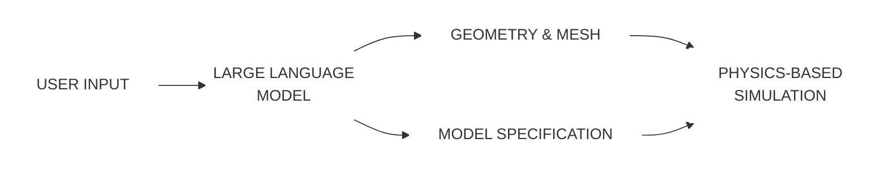

Ниже представлен транскрибированный текст научной статьи в формате Markdown, оформленный в соответствии с вашими инструкциями.

***

# University of Birmingham
**From text to tech: Shaping the future of physics-based simulations with AI-driven generative models**
Alexiadis, Alessio; Ghiassi, Bahman

**DOI:**
10.1016/j.rineng.2023.101721

**License:**
Creative Commons: Attribution-NonCommercial-NoDerivs (CC BY-NC-ND)

**Document Version**
Publisher's PDF, also known as Version of record

**Citation for published version (Harvard):**
Alexiadis, A & Ghiassi, B 2024, 'From text to tech: Shaping the future of physics-based simulations with AI-driven generative models', *Results in Engineering*, vol. 21, 101721. https://doi.org/10.1016/j.rineng.2023.101721

Link to publication on Research at Birmingham portal

**General rights**
Unless a licence is specified above, all rights (including copyright and moral rights) in this document are retained by the authors and/or the copyright holders. The express permission of the copyright holder must be obtained for any use of this material other than for purposes permitted by law.
• Users may freely distribute the URL that is used to identify this publication.
• Users may download and/or print one copy of the publication from the University of Birmingham research portal for the purpose of private study or non-commercial research.
• User may use extracts from the document in line with the concept of ‘fair dealing’ under the Copyright, Designs and Patents Act 1988 (?)
• Users may not further distribute the material nor use it for the purposes of commercial gain.

Where a licence is displayed above, please note the terms and conditions of the licence govern your use of this document.

When citing, please reference the published version.

**Take down policy**
While the University of Birmingham exercises care and attention in making items available there are rare occasions when an item has been uploaded in error or has been deemed to be commercially or otherwise sensitive.
If you believe that this is the case for this document, please contact UBIRA@lists.bham.ac.uk providing details and we will remove access to the work immediately and investigate.

Download date: 02. May. 2024

***

*Results in Engineering 21 (2024) 101721*
*Contents lists available at ScienceDirect*
# Results in Engineering
journal homepage: www.sciencedirect.com/journal/results-in-engineering

Micro-article
# From text to tech: Shaping the future of physics-based simulations with AI-driven generative models
**Alessio Alexiadis a,\*, Bahman Ghiassi b**

a *School of Chemical Engineering, University of Birmingham, B15 2TT, Birmingham, UK*
b *School of Engineering, University of Birmingham, B15 2TT, Birmingham, UK*

**A R T I C L E I N F O**
*Keywords:*
Multiphysics software
Physics-informed machine learning
Computational fluid dynamics software
Coupling large language models with Physics-based simulations
Generative AI in engineering

**A B S T R A C T**
This micro-article introduces a method for integrating Large Language Models with geometry/mesh generation software and multiphysics solvers, aimed at streamlining physics-based simulations. Users provide simulation descriptions in natural language, which the language model processes for geometry/mesh generation and physical model definition. Initial results demonstrate the feasibility of this approach, suggesting a future where non-experts can conduct advanced multiphysics simulations by simply describing their needs in natural language, while the code autonomously handles complex tasks like geometry building, meshing, and setting boundary conditions.

## 1. Introduction

Generative AI, particularly Large Language Models (LLMs), have shown impressive capabilities in various domains, demonstrating an advanced understanding of natural language and complex problem-solving skills [1]. However, despite their sophistication, these models do not inherently possess an understanding of physics principles. Therefore, they cannot replace specialized simulation software used in fields like Computational Fluid Dynamics and multiphysics.

Physics-based simulations are crucial in diverse fields, ranging from engineering [2–4] to medicine [5–7]. They enable the analysis of complex physical phenomena and the optimization of designs with high accuracy. However, setting up these simulations – creating geometry, computational meshes, and configuring parameters – is often a laborious and time-consuming task. Normally, these jobs are carried out by highly skilled computational engineers, who specialize in running these types of simulations.

Now, imagine a world where these two powerful tools are combined. You simply provide a text description, like ‘produce a simulation of a standard 20-tooth bicycle gear subjected to a torque of 40 Nm, and analyse the stress distribution across the gear teeth during a full rotation. This is all that would be required from the user, and an AI model would take care of the rest. It would create the geometry, set up the mesh, define material properties, apply the boundary conditions, and run the simulation. Then, the AI system provides you with detailed results and visualizations of the stress distribution across the gear teeth, all with minimal input.

This micro-article discusses how this objective can be achieved. It provides preliminary results from our research group and outlines a roadmap for further developments. We anticipate a future in simulation technology where its accessibility extends beyond specialized computational engineers, enabled by AI to be useable by a broader range of professionals and enthusiasts.

## 2. Previous work

A few papers explore the use of LLMs in the context of physics-based simulations. FLUID-GPT [8] and MYCRUNCHGPT [9] develop new architectures that incorporate or utilize LLMs as alternatives to traditional physics-based solvers. In contrast, our work uses LLMs not to replace, but to facilitate the use of existing physics-based solvers for non-expert users. Expanding upon the concept from Verdizco et al. [10], who employ ChatGPT for generating input files for molecular dynamics, we programmatically integrate OpenAI, Gmsh, and Elmer APIs. This integration creates a comprehensive solution that seamlessly transforms user text input into a complete simulation workflow.

## 3. Three steps and one roadmap

We propose to integrate the APIs of LLM models with geometry/meshing software and multiphysics solvers, as illustrated in Fig. 1. This strategy is envisioned in three distinct steps, each representing a higher level of integration between LLMs and simulation technology.


**Fig. 1.** The user provides a text description detailing the desired geometry and simulation. The LLM processes this input, splitting it into two distinct streams: one directed to geometry/mesh generation software for creating the geometry and mesh, while the other stream feeds into a multiphysics solver, defining the physical model and necessary parameters. The outputs from the mesh generation and model specification are then integrated to execute the physics-based simulation, ultimately yielding the simulation results.

### 3.1. Level 1 - prompt engineering

Prompt engineering with LLMs can be approached in two ways. The first is a user-friendly, non-technical method, suitable for general use but limited in scalability and flexibility. The second, which is central to our project, is the programmatic method. This approach utilizes tools like the OpenAI API [11] or the Hugging Face Transformers library [12] for more sophisticated interactions with LLMs via programming.

### 3.2. Level 2 - model fine-tuning

Prompt engineering is a straightforward approach but using LLMs ‘as-is’ often leads to suboptimal performance for specific tasks. In fact, for specialized tasks, the sheer size of these models, with billions of parameters, does not necessarily equate to better performance. Step 2 focuses on fine-tuning pre-trained models to enhance their effectiveness for our particular simulation needs.

### 3.3. Level 3 - custom large language model

While the initial phases of prompt engineering and model fine-tuning cover a wide spectrum of applications, commercial ventures often necessitate independence from open-source models and third-party APIs. In such instances, creating a custom LLM from scratch becomes a viable option. This process involves building new LLMs from the ground up, demanding extensive data collection and significant resources.

## 4. Results and discussion

In this section, we present preliminary results achieved within Level 1 of our roadmap. We have developed a code that integrates LLMs from the OpenAI API library [11] with Gmsh [13,14] for geometry creation and mesh generation, and with Elmer [15,16] for physics-based simulations. The choice of Gmsh and Elmer is due to their open-source nature, while the OpenAI library is among the most advanced in its field. This section illustrates user interactions with the code, demonstrating how simple textual inputs can describe the desired geometry and simulation type, enabling the code to autonomously execute complete physical simulations. All files related to the examples in this article are available as supplementary material in Jupyter notebook format.

In the notebooks, the GPT-4 1106-preview model is utilized through the OpenAI API within the chat_with_bot () function. To guide the LLM in generating outputs, we use two prompt files: system_geo.txt for geometry creation and system_sif.txt for simulation parameters and conditions. These prompt files are also included in the supplementary materials.

### 4.1. Basic geometries

In the first example, the user requests a simulation of a simple geometry and analyse its elastic deformation under a transverse load (Fig. 2).

The LLM’s output is then processed through the extract_and_save_geo_file () and extract_and_save_sif_file () functions. The workflow is completed by interacting with the Gmsh’s API for meshing and by executing external system commands within the Python environment, specifically !ElmerGrid and !ElmerSolver, to process the mesh and run the simulations (Fig. 3).

### 4.2. Composite geometries

When handling requests for more complex geometries, the LLM may initially make some errors (Figs. 4 and 5a). However, once these mistakes are identified, the LLM is capable of self-correcting and subsequently providing the correct. geo file (Figs. 4 and 5b).

With basic geometries, the LLM effectively utilizes Gmsh’s built-in kernel. However, for composite geometries, this approach resulted in numerous errors. To address this, we directed the LLM to switch to the OpenCASCADE kernel, which simplifies geometry creation. The drawback is that OpenCASCADE does not automatically create surfaces that can be assigned as boundary conditions, requiring manual intervention in Gmsh to define these surfaces. While this step is not excessively burdensome, it deviates from our objective of enabling users to run simulations without any prior knowledge of geometric modelling software or computational simulation software.

To achieve full automation, we experimented with PyGmsh, a Python interface for Gmsh. Here, the LLM is tasked with generating Python scripts that in turn create the. geo file, rather than directly producing the. geo file itself. However, this method also encountered challenges in boundary definition. To address these issues, we are considering two approaches: fine-tuning the LLM, as outlined in level 2 of our roadmap, or developing custom PyGmsh functions specifically designed to be more intuitive for the LLM. These custom functions would be structured in a way that makes them easier for the LLM to learn and use correctly, facilitating more accurate script generation. The latter approach indicates a potential shift in software development, leaning towards the creation of tools that are better suited for LLM interaction, as opposed to traditional human-centric usability.

Once the. geo file is finalized, the subsequent creation of the. sif file and execution of the simulation proceeds without any further issues. The user’s input for this phase is not shown here, but it is provided in the supplementary material; the outcome of the simulation is illustrated in Fig. 5c.

---
**Текстовая транскрипция Рисунка 2 (Скриншот взаимодействия с кодом):**
```text
chat_with_bot("""Create a bar with a square section. The axis of the bar is parallel to the z axis
""")

To create a bar with a square section whose axis is parallel to the z-axis, I need to know the length of the bar and the dimens
ions of the square section. Could you please provide the length of the bar and the side length of the square section?

chat_with_bot("The side length of the square cross-section is 1cm)

Great, now I just need the length of the bar along the z-axis to complete the geometry. Could you please provide that?

chat_with_bot("What is the height of the Mole Antonelliana in Turin, Italy?          ")

The height of the Mole Antonelliana in Turin, Italy, is approximately 167.5 meters. However, this information is not relevant t
o the creation of the .geo file for the bar with a square section. To proceed with the .geo file, I need the length of the bar
along the z-axis. Could you please specify this length?

chat_with_bot("The length of the bar along the z-axis is 10 cm")

Thank you for providing the dimensions. Now I will create the .geo file for a bar with a square cross-section of 1 cm and a len
gth of 10 cm along the z-axis.
...
chat_with_bot("""Create a sif file for a 'linear elasticity' simulation of a steel bar with the geometry in the geo file.
Boundary 1 is fixed (no deformation), while Boudary 2 is subjected of a Force of 100000000 N in the y direction
""")

To create the .sif file for a 'linear elasticity' simulation of a steel bar, we need to define the simulation type, constants,
body properties, solver configuration, equation settings, material properties, initial conditions, and boundary conditions. Sin
ce the simulation type is not explicitly mentioned, I will assume it is a "Steady state" simulation. If this is incorrect, plea
se provide the correct simulation type.
...
Please note that the Young's modulus and density values are typical for generic steel. If you have specific values for the stee
l material you are using, please provide them so I can update the .sif file accordingly. Additionally, ensure that the boundary
conditions are correctly assigned to the physical groups defined in the .geo file. If there are any other specific simulation r
equirements or if the simulation type should be "Transient" instead of "Steady state", please let me know.

chat_with_bot("""
1. Simulation Type: "Steady state"
2. Constants: do not include gravity
3. Material Properties: use typical values for steel
4. Boundary Conditions: "Boundary 1" is Bottom and "Boundary 2" the "Top" in the .geo file
          """)

Based on the updated requirements, here is the revised .sif file content for a 'Steady state' linear elasticity simulation of a
steel bar without gravity, using typical values for steel, and with the specified boundary conditions for the "Bottom" and "To
p" surfaces as defined in the .geo file:
```
**Fig. 2.** The LLM actively interacts with the user, seeking additional details if necessary and filtering out irrelevant information. Once it accumulates sufficient information, it generates a text response that describes the geometry in the syntax used for. geo files and the simulation in the syntax used for. sif files (not shown in Fig. 2, but available with the supplementary material).

---
**Описание Рисунка 3:**
На рисунке представлены два трехмерных визуализационных кадра, демонстрирующих этапы симуляции прямоугольного стержня. 
*   **Изображение (a):** Показывает сгенерированную сетку (mesh) стержня в виде каркасной структуры из множества треугольных ячеек. Цвет сетки — белый на темно-сером фоне. В левом нижнем углу указаны оси координат X, Y, Z.
*   **Изображение (b):** Демонстрирует результаты физической симуляции (деформацию стержня) с наложенной цветовой картой (heatmap). Стержень изгибается вверх вдоль оси Y. Цветовая шкала справа озаглавлена «displacement Magnitude» (величина смещения) и имеет градиент от синего (минимальное значение, 2.7e-51) до красного (максимальное значение, 1.8e+00). На графике также размечена трехмерная координатная сетка с осями X, Y, Z и соответствующими числовыми значениями длины.

**Fig. 3.** From the user’s initial textual input (Fig. 2), the LLM triggers an automated process where the Gmsh API generates the mesh (a) and Elmer conducts the simulation (b), requiring no further user intervention.
---

## 5. Conclusions

In this article, we have primarily shown solid mechanics simulations. 

---
**Текстовая транскрипция Рисунка 4 (Скриншот взаимодействия с кодом):**
```text
chat_with_bot("""Create a wheel and axle. Keep it simple. Assume that both Wheels and axle are cylinders.
The wheels are located at the two ends of the axle. The axis of all cylinders is parallel to the z axis""")

To create a simple wheel and axle system where both the wheels and the axle are cylindrical and their axes are parallel to the
z-axis, we need to define the dimensions for the wheels and the axle. Let's assume the following dimensions unless you specify
otherwise:

1. Radius of the wheel (Rw): 5 cm
2. Width of the wheel (Ww): 2 cm
3. Radius of the axle (Ra): 1 cm
4. Length of the axle (La): 20 cm

The wheels will be located at the two ends of the axle. The center of the axle will be at the origin (0, 0, 0), and the wheels
will be centered at (-La/2, 0, 0) and (La/2, 0, 0) respectively.

Please confirm or provide the dimensions for the wheel radius, wheel width, axle radius, and axle length. Once I have the dimen
sions, I can proceed to create the .geo file.

chat_with_bot("Yes, go ahead")

Based on the provided assumptions, I will create a .geo file for a wheel and axle system with the following dimensions:

- Radius of the wheel (Rw): 5 cm
- Width of the wheel (Ww): 2 cm
- Radius of the axle (Ra): 1 cm
- Length of the axle (La): 20 cm

Here is the .geo file content:
```
```text
extract_and_save_geo_file(last_response)

wheel_axle.geo file saved
Visualize .geo files with GMSH

chat_with_bot("""The wheels are not correctly located. The should be located at
the ends of the axle and on the same z axis: wheel|axle|wheel """)

I apologize for the oversight. Let's position the wheels correctly at the ends of the axle, ensuring they are on the same z-axi
s in the configuration: wheel|axle|wheel. The wheels should be positioned such that the axle is sandwiched between the two whee
ls.

Here's the revised .geo file content:
```
**Fig. 4.** Initially, the LLM generates an incorrect geometry (Fig. 5a). Upon the user highlighting this error, the LLM provides the correct geometry (Fig. 5b).

---
**Описание Рисунка 5:**
На рисунке представлены три трехмерных визуализации, демонстрирующие процесс генерации и симуляции геометрии колеса и оси на фоне координатной сетки.
*   **Изображение (a):** Показывает первоначально неверно сгенерированную геометрию. Два цилиндра (колеса) и один длинный тонкий цилиндр (ось) расположены в пространстве раздельно друг от друга, их оси не совпадают.
*   **Изображение (b):** Демонстрирует исправленную геометрию после корректировки. Теперь это единая цельная структура, напоминающая гантель: два колеса соединены осью строго по центру вдоль оси Z. Цвет модели — серый.
*   **Изображение (c):** Показывает результаты симуляции деформации структуры. Модель раскрашена в виде тепловой карты. Цветовая шкала справа («displacement Magnitude») варьируется от синего (1.0e-46, минимальное смещение на правом колесе) до красного (1.6e+01, максимальное смещение на левом колесе). Центральная ось визуально изогнута.

**Fig. 5.** Initial wheel and axle geometry incorrectly generated (a), revised geometry following user feedback (b), and simulation results depicting deformation of the wheel and axle structure under a 5 GN force along the z-axis (c).
---

However, they can be easily extended to other physical models in Elmer, such as fluid mechanics, heat transfer, or electrostatics. Currently, our focus has been on relatively simple geometries, but as we advance to the second phase of our roadmap, we aim to fine-tune LLMs to handle more complex scenarios. Our initial results were achieved using the OpenAI API. For future work, we plan to integrate the Hugging Face Transformers library, primarily due to its open-source nature and cost-free access. We have also explored the capabilities of GPT-4-Vision, a model that merges GPT-4’s language processing with image recognition. This integration enables the generation of computational geometries from photographed hand drawings, moving beyond traditional text-only descriptions. While these results are not presented here, they will be instrumental in the subsequent stages of our project.

In our current setup, various aspects, including meshing options and the choice of numerical schemes for solving the physical model, default to the standard parameters provided by Gmsh and Elmer. Looking ahead, our goal is to refine the system to not only offer users a wider selection of options but also to utilize the LLMs for providing intelligent recommendations when a chosen technique fails to deliver accurate results.

The findings presented in this paper could suggest a future trend where physics-based simulation software will be augmented with dedicated LLM-powered chatbots. These chatbots will assist users in simulation setup, making the process more intuitive and accessible. In this evolving landscape, developers of proprietary simulation software, such as COMSOL or ANSYS, might opt for custom-built LLMs that would enable them to provide integrated chatbot assistance while maintaining independence from open-source models or third-party APIs.

Finally, we address a concern raised by observers of our preliminary work: the potential for these AI-driven technologies to redefine, or even possibly replace, traditional roles in computational engineering. We believe that this innovation will not render computational engineers obsolete. In history, numerous scientific and technological revolutions have unfolded, and the AI revolution is likely just another chapter. Technological unemployment did not begin with the Industrial Revolution. In medieval and even ancient times, technological advancements led to shifts in employment, sparking cycles of disruption and adaptation [17]. And every time, history seems to repeat itself. On one side are the ‘Luddites,’ who fear the new technology; on the other, the ‘Techno-cultists,’ who pretend to be its prophet. Yet, the narrative invariably follows familiar paths: the initially disruptive technology creates new industries and opportunities; the ‘Techno-cultists’ of yesterday become the ’Luddites’ of tomorrow; and humanity advances one step further on the staircase of our collective progress.

## CRediT authorship contribution statement

**Alessio Alexiadis:** Writing - original draft, Validation, Software, Methodology, Investigation, Data curation, Conceptualization. **Bahman Ghiassi:** Writing - original draft, Conceptualization.

## Declaration of competing interest

The authors declare that they have no known competing financial interests or personal relationships that could have appeared to influence the work reported in this paper.

## Data availability

The code used for this manuscript is available at the University of Birmingham repository edata.bham.ac.uk/1032.

## Appendix A. Supplementary data

Supplementary data to this article can be found online at https://doi.org/10.1016/j.rineng.2023.101721.

## References

[1] W.X. Zhao, et al., A survey of large language models (2023) *arXiv [cs.CL]*, http://arxiv.org/abs/2303.18223. (Accessed 3 December 2023).
[2] A. Rahmat, et al., Numerical simulation of dissolution of solid particles in fluid flow using the SPH method, Int. J. Numer. Methods Heat Fluid Flow 30 (1) (2019) 290–307, https://doi.org/10.1108/hff-05-2019-0437.
[3] D. Daraio, et al., Investigating grinding media dynamics inside a vertical stirred mill using the discrete element method: effect of impeller arm length, Powder Technol. 364 (2020) 1049–1061, https://doi.org/10.1016/j.powtec.2019.09.038.
[4] D. Sanfilippo, et al., Combined peridynamics and Discrete Multiphysics to study the effects of air voids and freeze-thaw on the mechanical properties of asphalt, Materials 14 (7) (2021) 1579, https://doi.org/10.3390/ma14071579.
[5] A. Alexiadis, A new framework for modelling the dynamics and the breakage of capsules, vesicles and cells in fluid flow, Procedia IUTAM 16 (2015) 80–88, https://doi.org/10.1016/j.piutam.2015.03.010.
[6] M. Ariane, et al., Discrete multi-physics simulations of diffusive and convective mass transfer in boundary layers containing motile cilia in lungs, Comput. Biol. Med. 95 (2018) 34–42, https://doi.org/10.1016/j.compbiomed.2018.01.010.
[7] M. Schütt, et al., Modelling and simulation of the hydrodynamics and mixing profiles in the human proximal colon using Discrete Multiphysics, Comput. Biol. Med. 121 (103819) (2020) 103819, https://doi.org/10.1016/j.compbiomed.2020.103819.
[8] S.D. Yang, et al., FLUID-GPT (fast learning to understand and investigate dynamics with a generative pre-trained transformer): efficient predictions of particle trajectories and erosion, Ind. Eng. Chem. Res. 62 (37) (2023) 15278–15289, https://doi.org/10.1021/acs.iecr.3c01639.
[9] V. Kumar, et al., MyCrunchGPT: A chatGPT Assisted Framework for Scientific Machine Learning, 2023 arXiv [cs.LG]. Available at: http://arxiv.org/abs/2306.15551.
[10] J.C. Verduzco, E. Holbrook, A. Strachan, GPT-4 as an interface between researchers and computational software: improving usability and reproducibility (2023) arXiv [cond-mat.mtrl-sci]. Available at: http://arxiv.org/abs/2310.11458.
[11] Open, https://openai.com/ (Accessed: December 3, 2023)..
[12] The AI community building the future, https://huggingface.co/ (Accessed: December 3, 2023).
[13] C. Geuzaine, J.-F. Remacle, Gmsh: a 3-D finite element mesh generator with built-in pre- and post-processing facilities, Int. J. Numer. Methods Eng. 79 (11) (2009) 1309–1331, https://doi.org/10.1002/nme.2579.
[14] Gmsh: a three-dimensional finite element mesh generator with built-in pre- and post-processing facilities, https://gmsh.info/ (Accessed: December 3, 2023)..
[15] M. Malinen, P. Råback, Elmer finite element solver for multiphysics and multiscale problems, in: Ivan Kondov, Godehart Sutmann (Eds.), Book: Multiscale Modelling Methods for Applications in Material Science, Forschungszentrum Juelich, 2013, pp. 101–113, 2013.
[16] F.E.M. Elmer. https://www.elmerfem.org/. (Accessed 3 December 2023).
[17] Wikipedia, Technological Unemployment, Wikipedia, The Free Encyclopedia, 2023. https://en.wikipedia.org/w/index.php?title=Technological_unemployment&oldid=1186731887. (Accessed 3 December 2023).