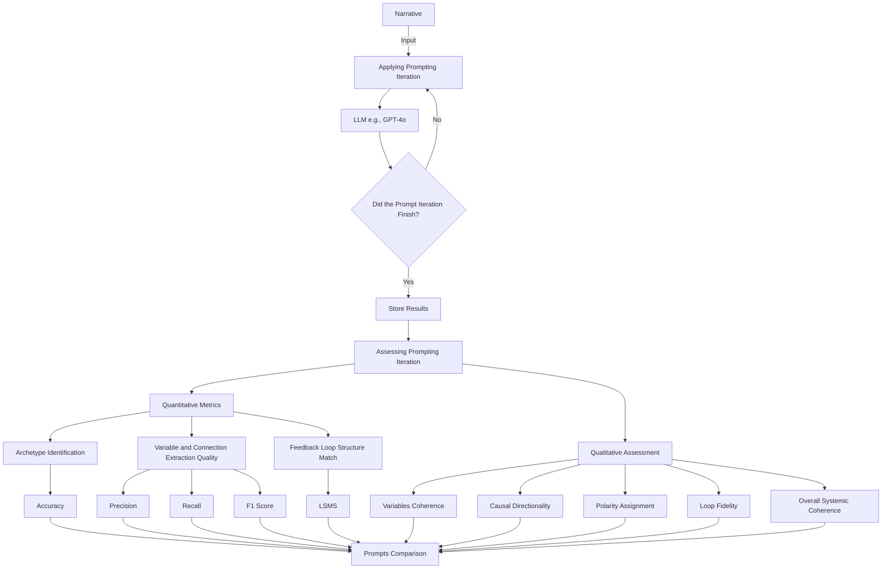

Proceedings of the 2025 Winter Simulation Conference  
E. Azar, A. Djanatliev, A. Harper, C. Kogler, V. Ramamohan, A. Anagnostou, and S. J. E. Taylor, eds.

# TOWARD AUTOMATING SYSTEM DYNAMICS MODELING: EVALUATING LLMS IN THE TRANSITION FROM NARRATIVES TO FORMAL STRUCTURES

**Jhon G. Botello**$^{1,2}$, **Brian Ilinas**$^{1,2}$, **Jose J. Padilla**$^2$, and **Erika Frydenlund**$^2$  
$^1$Dept. of Computer Science, Old Dominion University, Norfolk, VA, USA  
$^2$Virginia Modeling, Analysis, and Simulation Center, Old Dominion University, Norfolk, VA, USA  

---

### ABSTRACT

Transitioning from narratives to formal system dynamics (SD) models is a complex task that involves identifying variables, their interconnections, feedback loops, and the dynamic behaviors they exhibit. This paper investigates how large language models (LLMs), specifically GPT-4o, can support this process by bridging narratives and formal SD structures. We compare zero-shot prompting with chain-of-thought (CoT) iterations using three case studies based on well-known system archetypes. We evaluate the LLM’s ability to identify the systemic structures, variables, causal links, polarities, and feedback loop patterns. We present both quantitative and qualitative assessments of the results. Our study demonstrates the potential of guided reasoning to improve the transition from narratives to system archetypes. We also discuss the challenges of automating SD modeling, particularly in scaling to more complex systems, and propose future directions for advancing toward automated modeling and simulation in SD assisted by AI.

---

## 1 INTRODUCTION

System dynamics (SD) captures complex systems by relying on feedback loops, nonlinearities, and delays (Bala et al. 2017). Modelers draw on observations, data, and theory to develop descriptive narratives that capture the core dynamics of a system, and then translate these narratives into models that represent the key variables, their interconnections, and the feedback loops. However, transitioning from narrative descriptions to formal models is not a trivial task. Narratives do not necessarily follow a structure that makes identifying the underlying systemic structure simple. Moreover, this transition requires both experience and theoretical expertise to accurately identify relevant components.

Large language models (LLMs) have proven to be powerful tools, showing exceptional capabilities across various tasks and fields. For instance, LLMs have been applied to text generation, such as creating narratives about real-life events (Lynch et al. 2024), code generation (Wang and Chen 2023), and even detecting changes in web archive collections (Botello et al. 2024). These tasks require the model to understand patterns within the data, recognize contextual relationships, and generate coherent outputs. More recently, advancements in reasoning prompting techniques have further enhanced LLMs’ ability to tackle complex, multi-step problems (Patil 2025).

Despite the advances and the widespread application of LLMs, their use in modeling and simulation continues to exhibit limitations, particularly in SD modeling, highlighting the need for further exploration and intervention. Frydenlund et al. (2024) found that while LLMs like ChatGPT perform well in generating discrete-event simulations, they struggle with SD and agent-based models (ABMs), often producing incomplete or incorrect representations. The authors concluded that while LLMs show promise in assisting non-expert users during the initial stages of model development, expert oversight remains essential to ensure the accuracy and completeness of the models.

Our study focuses on the SD paradigm and explores how different prompting strategies, ranging from no reasoning to reasoning with context, can guide the LLM toward a more accurate transition from narrative descriptions to formal systemic structures. In particular, we are interested in how much guidance and additional information or knowledge we need to provide to achieve this task. We compare zero-shot prompting strategies with chain-of-thought (CoT) iterations and evaluate the quality of the outputs. The systemic structures we target are system archetypes, which represent recurring behavior patterns in dynamic systems and provide a strong theoretical foundation for identifying causal relationships, feedback loops, and dynamics in the system. We use three narratives corresponding to well-known system archetypes in the literature: Limits to Success, Fixes that Fail, and Tragedy of the Commons. These narratives are sourced from an SD textbook by Kim and Anderson (1998), which explains the transition from the narrative to the formal systemic structure.

We quantitatively assessed the model’s performance to replicate the ground truth across three core components: (1) archetype identification, (2) extraction of variables and causal connections, and (3) matching the structure of feedback loops. Recognizing that an output may not precisely match the ground truth but can still capture the underlying systemic structure—even with more or fewer variables than the original model—we propose a simple metric to evaluate whether an LLM replicates the reference model’s feedback loop structure. We also conducted a qualitative assessment of the model’s outputs across components (2) and (3). This included a manual evaluation of variables’ coherence, causal directionality, polarity assignment, causal connections, and systemic coherence. Our results demonstrate the potential of reasoning-based prompts and the importance of providing guidance and knowledge to the LLM to enhance the modeling process, grounded on theoretical SD principles. The findings also provide insights into the complexity involved in generating and comparing models within the field. Building on our work, we present a discussion of the limitations, implications, and future research directions aimed at enhancing the ability of LLMs to support automated modeling and simulation in SD.

---

## 2 BACKGROUND

### 2.1 The System Dynamics Approach
SD modeling is characterized by five key elements (Naugle et al. 2024): (1) causal relationships expressed through feedback loops; (2) accumulations (stocks), rates of change (flows), and time delays that capture system changes and inertia; (3) mathematical models describing interactions among variables; (4) the treatment of time as a continuous flow; and (5) an analytical focus on feedback dynamics to explain behavior and identify intervention points.

Feedback loops explain how interactions between variables determine a system’s behavior over time. There are two main types: reinforcing loops and balancing loops. Reinforcing loops amplify changes in a particular direction. In contrast, balancing loops act as stabilizing mechanisms to maintain the system within certain limits. The interaction between these loop types shapes a system’s overall dynamics.

Another essential concept in SD is system archetypes, which refer to generic, recurring patterns found in the structure of dynamic systems (Senge 2006; Branz et al. 2021). Although no definitive list exists, the literature commonly identifies a core set of eight archetypes that describe the behavior of most systems (Kim and Anderson 1998; Akers et al. 2015): Fixes That Fail, Shifting the Burden, Limits to Success, Drifting Goals, Growth and Underinvestment, Success to the Successful, Escalation, and Tragedy of the Commons. Each archetype comprises one or more feedback loops—reinforcing, balancing, or both—and provides a theoretical basis for understanding, analyzing, and addressing systemic problems.

Our study focuses on three well-established archetypes: Fixes That Fail, Limits to Success, and Tragedy of the Commons. Fixes That Fail describes situations where short-term solutions alleviate symptoms but inadvertently worsen the underlying problem over time. Limits to Success captures dynamics where initial growth eventually slows or reverses due to internal or external constraints that emerge as the system expands. Tragedy of the Commons illustrates how individuals acting in their self-interest overexploit a shared resource, leading to its depletion and long-term collective harm. The first two archetypes are highlighted by Clancy (2018) as essential for managers and have been used to model systemic problems (Špicar 2014; Benninger et al. 2021). Tragedy of the Commons was selected for its complex dynamics involving multiple actors and resource depletion and has also been applied in modeling real-world systems (Zambrano et al. 2023). This selection enables us to evaluate narratives with different levels of structural complexity, from simpler to more complex configurations.

Systemic structures are commonly visualized using Causal Loop Diagrams (CLDs) or Stock and Flow Diagrams (SFDs). CLDs offer a qualitative representation of variables, causal connections, and feedback loops (Barbrook-Johnson and Penn 2022). SFDs provide a more detailed, quantitative view by distinguishing between stocks and flows (Hamoudi et al. 2021). Our study focuses on CLDs to evaluate the LLM’s ability to identify system archetypes. Future work will extend this analysis to include SFDs.

### 2.2 LLMs in the Context of Modeling and Simulation
Initially, the use of Natural Language Processing provided insight into semi-automating the creation of models and simulations (Padilla et al. 2019; Shuttleworth and Padilla 2022). Since the arrival of ChatGPT, the use of LLMs has been rapidly adopted across various fields, and modelers have begun to explore their potential applications in different modeling and simulation contexts. Giabbanelli (2023) examined how LLMs can be usefully and practically integrated into tasks such as explaining the structure of conceptual models, summarizing simulation outputs, describing simulation visualizations, and explaining and addressing simulation errors. Gao et al. (2024) provide a comprehensive overview of work on ABM and simulation powered by LLMs. Martinez et al. (2024) used few-shot prompting and retrieval-augmented generation (RAG) to enhance the capabilities of GPT-3.5 in generating interface elements and procedural NetLogo code for ABM.

LLMs have also been used in the field of SD to automate the transition from narratives to models. Veldhuis et al. (2024) compared rule-based methods with transformer-based models, such as GPT-3.5 and fine-tuned BERT variants, including Causal News BERT, to identify causal sentences in SD-related texts. Causal News BERT, trained on annotated news data, outperformed both GPT-3.5 and the rule-based method. The authors concluded that transformer-based models offer advantages for SD because they can more easily identify relevant components in narratives, especially when designed or fine-tuned for specific tasks. Liu and Keith (2025) investigated the use of LLMs with curated prompting techniques to generate CLDs from SD hypotheses written in text. They tested four few-shot prompting strategies and demonstrated that LLMs can produce CLDs comparable to those created by experts, particularly for simple feedback structures when the narrative contains a clear causal statement. Schoenberg et al. (2025) also explored how various LLMs can transform text into CLDs. They noted that relying on coding rules to map text into causal models remains difficult and often subjective. In contrast, LLMs can support causal modeling, particularly for beginners who often struggle with causal logic.

A key limitation shared by the above three studies is that they do not address the generation of models grounded in theoretical structures, such as system archetypes. This more advanced task requires not only identifying causal links but also understanding the underlying systemic structure, especially when working with less-structured narratives. A common observation is that the use of LLMs offers advantages for SD over rule-based methods, which depend on fixed schemes and struggle with complex or ambiguous language. Our interest, therefore, lies in determining how much guidance LLMs need to produce models that align with theoretical structures rather than generate arbitrary outputs. We believe that addressing this challenge will strengthen the foundation for evaluating LLM-generated models in SD and offer insights for their application in more complex systems.

### 2.3 Prompting Strategies
A prompt is a set of instructions that guides an LLM by defining context, key information, format, and content (Liu et al. 2023). Good prompts include four elements: instructions, context, input data, and an output indicator (Giray 2023). Over time, researchers have developed various prompting strategies to enhance model performance. Bhandari (2023) outlines several widely discussed approaches, including zero-shot, few-shot, and CoT prompting. Zero-shot provides only instructions, while few-shot adds examples to help the model infer tasks. CoT prompting encourages step-by-step reasoning. Wei et al. (2022) showed that generating intermediate steps improves performance on complex tasks. Even a simple phrase like “Let’s think step by step” can enhance performance through zero-shot CoT prompting (Kojima et al. 2022). Our study builds on these insights by comparing simple zero-shot prompting with multiple CoT iterations, ranging from providing minimal steps and contextual information about system archetypes to offering complete guidance, to evaluate the LLM’s ability to reproduce system archetypes.

---

## 3 METHODOLOGY

Our study evaluates GPT-4o’s ability to map less-structured narratives into SD models corresponding to system archetypes. We developed a systematic evaluation pipeline (Figure 1) that iteratively applies predefined prompting strategies, including zero-shot and CoT formats. We used narratives from Kim and Anderson (1998), which outline the transition from stories to archetypes and provide the final CLD as ground truth. In each iteration, the LLM identifies the most suitable archetype, relevant variables, causal connections, polarities, and feedback loops to represent the systemic structure. All outputs are stored for later evaluation.

#### Figure 1. Archetype evaluation workflow for generated SD models from narratives.


---

### 3.1 Prompting Iteration and Evaluation
We designed five prompt iterations to assess how much guidance GPT-4o needs to transition from narrative to system archetype. The iterations are: (1) prompt: baseline zero-shot; (2) CoT-i1: reasoning for causal links; (3) CoT-i2: reasoning for variables and causal links; (4) CoT-i3: reasoning for archetype, variables, and causal links; (5) CoT-at: all prior steps plus additional context including archetype definitions and structures. These variations progressively guide the LLM from basic extraction to whole structural generation. As shown in Figure 2, our final prompt integrates the four key instructional elements outlined by Giray (2023): instruction, context, input data, and output indicator. We conducted both quantitative and qualitative evaluations of the output. The quantitative assessment measured whether the output matches the ground truth across three core components: 1) archetype identification, 2) variable and connection extraction, and 3) feedback loop structure matching.

#### Figure 2. Final Prompt Design for System Dynamics Model Extraction.

```text
You are an expert in system dynamics and skilled in constructing causal loop diagrams.
Your task is to read the following narrative and extract its systemic structure.

Let's think step by step:

Step 1: Identify the system archetype best represented by the narrative.

Step 2: Identify the variables involved in the systemic structure described by the
narrative.

Step 3: Identify the causal relationships (connections) between the variables. Label each
connection as either "positive" or "negative".

Return your output strictly in the following structured JSON format:

{
  "archetype": "<name_of_the_archetype>",
  "variables": ["<variable 1>", "<variable 2>", "..."],
  "connections": [
    {
      "from": "<source_variable>",
      "to": "<target_variable>",
      "type": "positive" | "negative"
    },
    ...
  ]
}

Available archetypes: {json.dumps(archetypes, indent=2)}
```
*The design resulted from five iterative prompt engineering processes: (1) prompt (baseline, no reasoning), (2) CoT-i1 (causal links only), (3) CoT-i2 (variables and causal links), (4) CoT-i3 (complete modeling structure), and (5) CoT-at (complete structure with archetype definitions).*

---

*Archetype identification* refers to the model’s ability to correctly recognize the system archetype that best represents the dynamics described in the narrative. This step is crucial for determining whether the LLM identifies systemic patterns. We used accuracy as a binary classification metric in this task.

*Variable and Connection Extraction* evaluates whether the LLMs can extract variables and their causal connections, including the type of polarity, that represent the systemic structure and match the ground truth. We used text similarity to compute Precision, Recall, and F1 Score for this evaluation component. Precision refers to the percentage of variables and connections generated by the LLM that correctly match the ground truth. Recall reflects how many of the ground truth elements the model successfully identified. The F1 Score provides an overall measure of how well the model performs on both metrics. We applied Sentence-BERT embeddings (Reimers and Gurevych 2019) and computed cosine similarity to align predicted elements with reference elements. While most studies consider elements with a similarity score of 0.7 or higher as matches, we adopted a threshold of 0.5 to allow for greater flexibility. We implemented this approach to account for cases where variable names differ from those in the reference model but still convey the same meaning (e.g., “effort” vs. “resource investment”). For connection, we converted each causal link, both from the ground truth and the LLM’s output, into the format: “from `<variable1>` to `<variable2>` with `<polarity>` connection” to capture both the direction and polarity between variables.

It is essential to recognize that the quality of the output should not be judged solely by whether it matches the exact number of variables and connections in the ground truth. Different modelers may include more or fewer variables while still preserving the structure of the theoretical archetype. For example, if the archetype includes one reinforcing and one balancing loop, an output with ten variables might still be valid if they are appropriately distributed across both loops, or if some serve as auxiliary variables that complement but do not alter the systemic structure. 

*Feedback Loop Structure Matching* evaluates whether the generated variables and causal connections form the expected loops. We propose a Loop Structure Match Score (LSMS) as a simple, interpretable measure of this structural accuracy. To do so, we draw on Schoenberg et al. (2020) and Schaffernicht and Groesser (2011). The former emphasizes the importance of identifying and categorizing loops by their polarity (reinforcing or balancing) to better understand and influence system behavior. The latter emphasized that when comparing mental models in SD, variables, links, polarities, types of loops, and delays should be considered.

The LSMS can be negative, positive, or equal to 1, where 1 indicates a perfect match between the LLM’s predictions and the ground truth for both reinforcing and balancing loops. It stays between 0 and 1 when the model’s errors are moderate and close to the actual number of loop types. However, as the model significantly overestimates the number of loops, the metric becomes increasingly negative, reflecting a growing mismatch with the systemic structure. The metric is computed as illustrated in equation 1 for each narrative-archetype pair, where $R_{\text{true}}$ and $B_{\text{true}}$ are the counts of reinforcing and balancing loops in the ground truth and $R_{\text{pred}}$ and $B_{\text{pred}}$ are the generated loops. The type of Loop is detected using graph traversal, and each one is classified based on the number of negative links (even = reinforcing, odd = balancing).

$$\text{LSMS} = \frac{1}{2} \left( 1 - \frac{|R_{\text{true}} - R_{\text{pred}}|}{\max(R_{\text{true}}, 1)} + 1 - \frac{|B_{\text{true}} - B_{\text{pred}}|}{\max(B_{\text{true}}, 1)} \right) \tag{1}$$

While the LSMS provides a metric for structural accuracy, it does not fully capture structural correctness. To address this limitation, we complemented it with a qualitative human assessment, offering an extra layer when the model does not fully match the ground truth, but may respect the theoretical archetype structure. It covered five dimensions: (1) variable coherence, (2) causal directionality, (3) polarity assignment, (4) causal connections, and (5) Systemic coherence. We selected and adapted these dimensions to qualitatively capture a holistic assessment of essential aspects of structural correctness when comparing models, as noted by Schoenberg et al. and Schaffernicht and Groesser. *Variable coherence* checks if the generated variables, especially those not in the ground truth, are meaningful and derived from the narrative. *Causal directionality* assesses whether relationships are logically and correctly oriented. *Polarity assignment* checks if signs are correctly applied. *Causal connections* analyze whether the LLM has connected all the variables or if any connections might be missing, and whether these connections make sense from a modeling perspective. *Systemic coherence* complements the LSMS by evaluating whether the full model reflects the expected dynamics. Each dimension was scored on a scale of 1 to 3, indicating whether the model failed, partially captured, or adequately represented the dimension.

---

## 4 RESULTS

Table 1 details our results across the three quantitative evaluation dimensions: (1) archetype identification, (2) variable and connection extraction, and (3) feedback loop structure matching.

### Table 1. Summary of metrics across our three quantitative evaluation dimensions

| SD Archetype | Prompt Iteration | Archetype Accuracy | Variables Precision | Variables Recall | Variables F1 Score | Connections Precision | Connections Recall | Connections F1 Score | Loop Structure LSMS |
| :--- | :--- | :---: | :---: | :---: | :---: | :---: | :---: | :---: | :---: |
| **Fixes That Fail** | zero-shot prompt | 1.000 | 0.375 | 1.000 | 0.545 | 0.333 | 0.750 | 0.462 | 0.500 |
| | CoT-i1 | 1.000 | 0.300 | 1.000 | 0.462 | 0.100 | 0.250 | 0.143 | 0.000 |
| | CoT-i2 | 1.000 | 0.375 | 1.000 | 0.545 | 0.200 | 0.500 | 0.286 | -0.500 |
| | CoT-i3 | 1.000 | 0.333 | 1.000 | 0.500 | 0.100 | 0.250 | 0.143 | 1.000 |
| | CoT-at | 1.000 | 1.000 | 1.000 | 1.000 | 1.000 | 1.000 | 1.000 | 1.000 |
| **Limits to Success** | zero-shot prompt | 0.000 | 0.412 | 1.000 | 0.583 | 0.150 | 0.375 | 0.214 | -0.500 |
| | CoT-i1 | 0.000 | 0.389 | 1.000 | 0.560 | 0.118 | 0.250 | 0.160 | 0.000 |
| | CoT-i2 | 0.000 | 0.467 | 1.000 | 0.636 | 0.111 | 0.250 | 0.154 | 0.000 |
| | CoT-i3 | 0.000 | 0.583 | 1.000 | 0.737 | 0.188 | 0.375 | 0.250 | -0.500 |
| | CoT-at | 1.000 | 1.000 | 0.857 | 0.923 | 0.500 | 0.500 | 0.500 | 0.500 |
| **Tragedy of the Commons**| zero-shot prompt | 1.000 | 1.000 | 1.000 | 1.000 | 0.200 | 0.154 | 0.174 | 0.125 |
| | CoT-i1 | 1.000 | 1.000 | 1.000 | 1.000 | 0.200 | 0.154 | 0.174 | 0.250 |
| | CoT-i2 | 1.000 | 0.889 | 1.000 | 0.941 | 0.100 | 0.077 | 0.087 | 0.125 |
| | CoT-i3 | 1.000 | 1.000 | 0.750 | 0.857 | 0.125 | 0.077 | 0.095 | 0.000 |
| | CoT-at | 1.000 | 1.000 | 0.750 | 0.857 | 0.222 | 0.154 | 0.182 | 0.875 |

---

In the case of *Archetype Identification*, the LLM correctly identified “Fixes That Fail” and “Tragedy of the Commons” across all prompts, suggesting it recognizes their underlying dynamics from our narratives. The above may be due to prior exposure during training, where similar definitions or narratives were present. In contrast, “Limits to Success” was often misclassified as “Growth and Underinvestment”, likely due to its similar growth pattern followed by decline. This misclassification is a form of structural hallucination, where the model guesses an archetype that appears reasonable but is incorrect, based on surface-level similarities. A strategy to address this issue was evident in the final CoT-at prompt, where we provided archetype definitions and structures, allowing the LLM to identify “Limits to Success” correctly. This suggests that, when it comes to SD modeling, GPT-4o benefits from contextual guidance and structured knowledge to distinguish between similar archetypes.

For *Variables and connections extraction*, GPT-4o often generated more variables than expected when it lacked contextual information about the archetypes (see Figure 3), resulting in lower precision. However, recall was often high, suggesting all ground truth variables were included in the output. Performance on causal connections was notably weaker. This is because overgeneration of variables leads to overgeneration of connections, and as a consequence, the output does not match the ground truth. These results suggest that without guidance or context, the model freely generates as many variables as it considers relevant. CoT prompting, specifically CoT-at, helps narrow the output by grounding the modeling process in a theoretical and structural context, resulting in fewer and accurate variables and, consequently, connections that were more likely to match the ground truth.

Despite improvements in precision and recall, the model still failed to fully replicate the reference model in “Limits to Success” and “Tragedy of the Commons”. This may be because, even with guidance and structural context, the model is not yet trained to handle complex systemic archetypes.

---

#### Figure 3. Performance of prompting iterations in extracting variables and causal connections matching the ground truth.

**Visual Representation Description:**
Figure 3 presents six bar charts comparing the performance of different prompt iterations (prompt, cot-i1, cot-i2, cot-i3, cot-at) against the Ground Truth (represented by a red horizontal dashed line) for each of the three evaluated system archetypes:
1. **Fixes That Fail ("Borrow Now, Pay Later" Model):**
   * *Number of Variables:* Ground truth is 3. The zero-shot prompt and earlier iterations (cot-i1, cot-i2, cot-i3) overestimate variables (generating 8, 10, 8, and 9 variables, respectively). The `cot-at` iteration hits the ground truth exactly (3 variables).
   * *Number of Connections:* Ground truth is 4. Earlier iterations overestimate connections (producing 9 to 10 connections). The `cot-at` iteration achieves the exact ground truth of 4 connections.
2. **Limits to Success ("R&D or Management Development?" Model):**
   * *Number of Variables:* Ground truth is 7. Early iterations generate between 12 and 18 variables. The `cot-at` iteration gets closest to the ground truth, producing 6 variables.
   * *Number of Connections:* Ground truth is 8. Early iterations produce between 16 and 20 connections. The `cot-at` iteration matches the ground truth exactly at 8 connections.
3. **Tragedy of the Commons ("Too Many Boats Chasing Too Few Fish" Model):**
   * *Number of Variables:* Ground truth is 8. Variables are closely estimated across iterations (ranging from 6 to 9 variables, with the baseline prompt and cot-i1 hitting exactly 8).
   * *Number of Connections:* Ground truth is 13. All iterations consistently underestimate the number of connections, producing around 8 to 10 connections.

---

### Table 2. Summary of results from qualitative assessment

| SD Archetype | Prompt Iteration | Variables Coherence | Causal Directionality | Polarity Assignment | Causal connections | Systemic Structure |
| :--- | :--- | :---: | :---: | :---: | :---: | :---: |
| **Fixes That Fail** | zero-shot prompt | 3 | 3 | 3 | 2 | 2 |
| | CoT-i1 | 3 | 3 | 3 | 2 | 1 |
| | CoT-i2 | 3 | 3 | 3 | 3 | 1 |
| | CoT-i3 | 3 | 3 | 3 | 3 | 3 |
| | CoT-at | 3 | 3 | 3 | 3 | 3 |
| **Limits to Success** | zero-shot prompt | 3 | 3 | 3 | 2 | 1 |
| | CoT-i1 | 3 | 3 | 3 | 2 | 1 |
| | CoT-i2 | 3 | 3 | 3 | 3 | 2 |
| | CoT-i3 | 3 | 3 | 3 | 3 | 3 |
| | CoT-at | 3 | 3 | 3 | 3 | 3 |
| **Tragedy of the Commons**| zero-shot prompt | 3 | 3 | 3 | 2 | 1 |
| | CoT-i1 | 3 | 3 | 3 | 2 | 1 |
| | CoT-i2 | 3 | 3 | 3 | 2 | 1 |
| | CoT-i3 | 3 | 3 | 3 | 3 | 1 |
| | CoT-at | 3 | 3 | 3 | 3 | 2 |

---

Although the structure of the ground truth was not exactly reproduced, we believe the model can be viewed as a modeler who explores a broad set of variables and connections, while still capturing the logical and dynamic identity of the system archetype. As such, the output might still be valid. With this in mind, we also evaluated the output using the *Feedback Loop Structure Matching* component via the LSMS (see results in Table 1). We complemented this metric with a qualitative assessment to account for structural correctness. For this, we compared each iteration against the systemic structure of the archetype, using the theoretical structure according to the version provided in the book, which represents the core components of the system archetype.

The LSMS shows that while the basic prompt struggled to capture the correct number and type of feedback loops, the CoT approaches, specifically CoT-at, achieved better loop matches across archetypes. However, performance remains challenging as structural complexity increases. The above may also be due to the model not being trained to reproduce system archetypes, suggesting that future work should explore providing a few examples of narrative-model pairs or fine-tuning a model for this task.

Despite the challenges, the LSMS suggests that some components of the systemic structure may still be present in the output, and our qualitative analysis (see Table 2) provides an additional layer of insight regarding this aspect. Below, we focus on the LLM’s output for ‘Fixes That Fail’ (Figure 4) and generalize findings across other archetypes. We compared the LLM-generated models (Figures 4b–f) with the theoretical structure (Figure 4a).

As shown in Figure 4a, “Fixes That Fail” includes three core elements: (1) a problem symptom, (2) a short-term fix, and (3) a long-term unintended consequence. These form a balancing loop (B1) and a reinforcing loop (R1). The narrative used, drawn from Kim and Anderson (1998, p. 7), reflects “Fixes That Fail” logic and can be modeled with three variables: *Borrowing* (the short-term fix), temporarily solve a *Need for Cash* (the problem symptom) but increases debt over time due to *Interest and Payments* (the long-term unintended consequence). The CoT-at prompt fully captured this pattern and the exact number of variables (see Figure 4f), resulting in a score of 3 across all dimensions in the qualitative assessment, which is also consistent with the quantitative analysis. For other prompt iterations, we noted that GPT-4o consistently identified variables that were either clearly stated or implicitly present in the narrative. The cause-and-effect relationships and polarities also made sense from a modeling perspective. These results were consistent across all the archetypes we evaluated and aligned with the current state of the art regarding the performance of LLMs for generating cause-effect relationships.

Regarding variable connections, we observed some missing links, especially in early iterations. For example, in the output shown for “prompt” in Figure 4b, it would be logical to include a connection between business expenses and short-term cash needs. For “CoT-i1” in Figure 4c, no loops were generated. However, a connection from revenue stream to short-term cash needs and then to orders could make sense in this context as a way to complement the model and form a loop, even if it does not precisely reflect the core structure of the archetype. Because of these omissions, we assigned a score of two, meaning the model provided a partial output, missing some connections. We consider that the above happens because with less guidance and theoretical foundation on how to approach the task of reproducing systemic structures, the model is more likely to miss connections that would help to find an intended structure. This is something that the current state-of-the-art does not consider.

When examining the system structure, the first three iterations (Figure 4b-d) failed to fully capture the archetype’s dynamics. In contrast, the CoT-i3 (Figure 4e) output is notable. When evaluating it both quantitatively and qualitatively, we can make the following observations: Variable extraction accuracy and recall were 33% and 100% respectively, meaning it included all ground truth variables but added extras. These additional variables, along with their connections and polarities, were reasonable and served as auxiliary elements without altering the core structure. LSMS was 1, meaning it correctly reflects the loop structure. However, connection recall was only 25%, indicating that the model failed to capture many of the ground truth connections. This low recall resulted from the model framing the problem symptom as *cash availability* instead of *cash shortage*. While these terms are opposites linguistically, they represent the same underlying concept in this modeling context. At first glance, a 25% recall might suggest that the model did not reproduce the systemic structure. However, our qualitative analysis reveals that the shift in framing altered the polarity of certain causal links, but the overall logic of the system remained intact. In other words, despite the quantitative mismatch, the model successfully replicated the core systemic behavior.

---

#### Figure 4. a) Theoretical structure of the “Fixes That Fail” archetype. b–f) Diagrams of outputs generated by LLM under different prompting iterations.

**Visual Representation Description:**
Figure 4 contains 6 sub-diagrams illustrating different causal loop layouts for "Fixes That Fail":
* **a. Theoretical Archetype Structure:** This represents the ground truth. It consists of a top balancing loop (B1) formed by `Problem Symptom` $\xrightarrow{+}$ `Fix` $\xrightarrow{-}$ `Problem Symptom`, and a bottom reinforcing loop (R1) formed by `Fix` $\xrightarrow{+}$ `Unintended Consequence` $\xrightarrow{+}$ `Problem Symptom` (with a delay mark on the link).
* **b. Prompt:** A highly complicated layout containing many variables: `Home Equity Loan`, `Entrepreneur's Cash`, `Business Expenses`, `Revenue`, `Short-term Cash Needs`, `Debt`, and `Credit Card Payments`. It overcomplicates the simple archetype structure.
* **c. cot-i1:** This diagram displays a fragmented set of variables (e.g., `Home Equity Loan2`, `Cash Reserves`, `Short-term Cash Needs2`, `Long-term Financial Stability`, `Credit Card Debt`, etc.) linked with positive/negative polarities, but fails to close or formulate any loops.
* **d. cot-i2:** A complex diagram featuring multiple loops (R1, R2, B3) containing variables such as `Raw material stock`, `Revenue stream2`, `Marketing effectiveness`, `Entrepreneur's cash reserves`, `Debt level`, and others, failing to match the simple archetype architecture.
* **e. cot-i3:** A layout with variables like `Home equity loan3`, `Entrepreneur's cash reserves2`, `Short-term cash availability`, `Sales and revenue`, `Business expenses2`, `Debt level2`, and `Credit card payments3`. It isolates balancing loop B1 and reinforcing loop R1, but is heavily cluttered.
* **f. cot-at:** Highly simplified and clean, matching the theoretical archetype structural design. It contains: `Cash Shortage` (Problem Symptom) $\xrightarrow{+}$ `Debt2` (Fix) $\xrightarrow{-}$ `Cash Shortage` (B1); and `Debt2` $\xrightarrow{+}$ `Unintended Financial Burden` (Unintended Consequence) $\xrightarrow{+}$ `Cash Shortage` (R1).

---

## 5 DISCUSSION

Our study not only assessed how LLMs transition from narratives to system archetypes and how CoT improves this process, but also offers broader insights for scalable, automated modeling in SD. At this point, it is fair to ask: What is needed to enhance SD modeling and bring us closer to full automation?

We believe that grounding LLM modeling in theoretical foundations can improve both the generation and evaluation of outputs. To achieve this, future work should focus on enhancing the identification and articulation of feedback loops to more accurately represent systemic structures.

Our study also highlights the complexity of model comparison and evaluation. Quantitative metrics enable the measurement of accuracy and structural agreement with a reference model; however, they do not capture the whole picture. Qualitative metrics, on the other hand, allow for assessing more nuanced aspects, such as whether the expected systemic dynamics are captured. However, these assessments may remain subjective and depend on the evaluator’s expertise. It would be worthwhile to explore an approach or metric that combines both when evaluating LLM-generated models that correspond to system archetypes.

While moving toward this goal, we must also consider expanding our methodological approach to account for generalizability. We acknowledge that our dataset, while a helpful starting point for exploring the transition from narrative to system archetypes, is limited. Future work should utilize a larger and more diverse dataset that encompasses a broader range of narratives and archetypes.

On the other hand, as new LLMs emerge with reasoning capabilities at their core (e.g., OpenAI o3-mini), promising opportunities arise to explore, evaluate, and refine prompting techniques on these models. It is essential to recognize that prompting is not as trivial as it may seem. It plays a critical role in evoking the LLM’s knowledge to perform effectively on a given task. Such efforts would provide a broader perspective on the extent to which LLMs may require intervention.

Our work with three archetypes also highlights scalability challenges where token consumption increases as we incorporate more archetypes. The average input length was 1,768 tokens per narrative. Including more archetypes would increase token usage, raising the cost of using LLMs like GPT. Even with open-source models, it is important to consider that input token limits remain a key constraint. Fine-tuning LLMs on a comprehensive set of archetypes, including mixed structures, could mitigate this and would be a valuable direction for future work to improve LLM performance in reproducing system archetypes.

A potentially more cost-effective alternative could be leveraging AI agent architectures to reduce token consumption. For example, one agent could specialize in identifying the archetype within a narrative and then delegate to another agent specifically designed to model the narrative based on their expertise on the identified archetype. This approach would narrow the model’s focus and potentially improve the ability to transition toward system archetypes. Similarly, RAG could help by letting the LLM identify the archetype and then retrieve relevant data to guide the generation of variables, connections, and feedback loops. The above are some ways to move forward and an opportunity that invites us to rethink how system dynamics modeling should evolve.

Another point to consider is that current approaches still assume complete ignorance of the modeling context and rely solely on conceptual models. However, scaling up to real-world applications requires contextual grounding. Modelers typically consult reference models for domain knowledge and contextualization. For example, modeling what the Storymodelers Lab in Norfolk, VA, does requires more than a narrative; it also needs domain-specific data. While LLMs can infer some connections, they risk inconsistencies without context. If crucial relationships are missing from the narrative, models must query external sources to complete their understanding. RAG and AI agent frameworks could also enable such retrieval and processing, enriching LLM outputs with relevant context and improving structural accuracy.

As we move toward these approaches, it is essential to acknowledge that many narratives lack a clear structure for SD modeling. This makes it hard to extract or generate all the needed components. In our results, the model often included too many variables or formed connections that did not create coherent loops. This shows why setting clear boundaries and scope is key, especially for complex systems. While this is already difficult with archetypes, it becomes harder with more complex models. To address this, we suggest using a template-based approach to help turn unstructured narratives into structured models by organizing key SD elements more systematically.

As we dive into this discussion, it becomes evident that several components are essential to take the interception of AI and SD modeling to another level. AI models should be able to 1) understand systemic structures, 2) build coherent feedback loops, 3) use context to define variables and systems, and 4) connect different systems. This is not easy. Even with recent progress in AI, more research is needed. Reaching this goal requires better modeling frameworks, improved prompting strategies, task-specific fine-tuning, and tools that bring in context. All these steps can help move us closer to scalable and automated SD modeling.

---

## 6 CONCLUSION

This study explored the potential of LLMs, particularly GPT-4o, to transition from narratives to system archetypes. Our findings demonstrate that prompting strategies such as CoT have the potential to improve performance by setting boundaries in the generation of variables and causal connections and by guiding the model toward the identification of feedback loops. While further exploration in this field is needed, we offer a discussion grounded in our results and insights to support progress toward scalable and automated modeling in system dynamics. By highlighting the potential and current limitations of LLMs in this context, our study provides a foundation for future research to advance toward automated, context-aware modeling and simulation processes in system dynamics.

---

## REFERENCES

*   Akers, W., C. B. Keating, A. Gheorghe, and A. S. Poza. 2015. “The Nature and Behavior of Complex System Archetypes”. *International Journal of System of Systems Engineering* 6(4):302.
*   Bala, B. K., F. M. Arshad, and K. M. Noh. 2017. *“System Dynamics: Modelling and Simulation”*. Springer Singapore.
*   Bhandari, P. 2023. “A Survey on Prompting Techniques in LLMs”. *arXiv preprint arXiv: 2312.03740*.
*   Barbrook-Johnson, P., and A. S. Penn. 2022. “Causal Loop Diagrams”. In *Systems Mapping: How to Build and Use Causal Models of Systems*, 47–59. Cham: Springer International Publishing. [https://doi.org/10.1007/978-3-031-01919-7_4](https://doi.org/10.1007/978-3-031-01919-7_4)
*   Benninger, E., G. Donley, M. Schmidt-Sane, J. K. Clark, D. W. Lounsbury, D. Rose et al. 2021. “Fixes That Fail: A System Archetype for Examining Racialized Structures Within the Food System”. *American Journal of Community Psychology* 68(3-4):455–470.
*   Botello, J. G., L. Frew, J. J. Padilla, and M. C. Weigle. 2024. “Exploring Large Language Models for Analyzing Changes in Web Archive Content: A Retrieval-Augmented Generation Approach”. In *2024 IEEE International Conference on Big Data (BigData)*, 2410–2418. IEEE.
*   Branz, M., A. Farrell, M. Hu, W. Liem, and E. Ballard. 2021. “Accumulations” *Methods Brief Series* 1.06: Systems Thinking Foundations. Social System Design Lab, St. Louis, MO. [https://doi.org/10.1007/978-3-031-01919-7_4](https://doi.org/10.1007/978-3-031-01919-7_4) [неразборчиво/correct doi link: https://doi.org/10.7936/z1z5-cx85]
*   Clancy, T. 2018. “Systems Thinking: Three System Archetypes Every Manager Should Know”. *IEEE Engineering Management Review* 46(2):32–41.
*   Gao, C., X. Lan, N. Li, Y. Yuan, J. Ding, Z. Zhou et al. 2024. “Large Language Models Empowered Agent-Based Modeling and Simulation: A Survey and Perspectives”. *Humanities and Social Sciences Communications* 11(1):1–24.
*   Giabbanelli, P. J. 2023. “GPT-Based Models Meet Simulation: How to Efficiently Use Large-Scale Pre-Trained Language Models Across Simulation Tasks”. In *2023 Winter Simulation Conference (WSC)*, 2920–2931. IEEE.
*   Giray, L. 2023. “Prompt Engineering With ChatGPT: A Guide for Academic Writers”. *Annals of Biomedical Engineering* 51(12):2629–2633.
*   Frydenlund, E., J. Martínez, J. J. Padilla, K. Palacio, and D. Shuttleworth. 2024. “Modeler in a Box: How Can Large Language Models Aid in the Simulation Modeling Process?”. *Simulation* 100(7):727–749.
*   Hamoudi, K., A. Bellaouar, and R. Petiot. 2021. “A Model of Systems Dynamics for Physical Flow Analysis in a Distribution Supply Chain”. *Transport and Telecommunication* 22(1):98–108.
*   Kim, D. H., and V. Anderson. 1998. *Systems Archetype Basics*. Waltham, MA: Pegasus Communications Inc.
*   Kojima, T., S. S. Gu, M. Reid, Y. Matsuo, and Y. Iwasawa. 2022. “Large Language Models Are Zero-Shot Reasoners”. *Advances in Neural Information Processing Systems* 35:22199–22213.
*   Liu, N. Y. G., and D. R. Keith. 2025. “Leveraging Large Language Models for Automated Causal Loop Diagram Generation: Enhancing System Dynamics Modeling Through Curated Prompting Techniques”. *arXiv preprint arXiv: 2503.21798*.
*   Liu, P., W. Yuan, J. Fu, Z. Jiang, H. Hayashi, and G. Neubig. 2023. “Pre-Train, Prompt, and Predict: A Systematic Survey of Prompting Methods in Natural Language Processing”. *ACM Computing Surveys* 55(9):1–35.
*   Lynch, C. J., E. Jensen, M. H. Munro, V. Zamponi, J. Martinez, K. O’Brien et al. 2024. “GPT-4 Generated Narratives of Life Events Using a Structured Narrative Prompt: A Validation Study”. *arXiv preprint arXiv: 2402.05435*.
*   Martínez, J., B. Llinas, J. G. Botello, J. J. Padilla, and E. Frydenlund. 2024. “Enhancing GPT-3.5’s Proficiency in NetLogo Through Few-Shot Prompting and Retrieval-Augmented Generation”. In *2024 Winter Simulation Conference (WSC)*, 666–677. IEEE.
*   Naugle, A., S. Langarudi, and T. Clancy. 2024. “What Is (Quantitative) System Dynamics Modeling? Defining Characteristics and the Opportunities They Create”. *System Dynamics Review* 40(2):e1762.
*   Padilla, J. J., D. Shuttleworth, and K. O’Brien. 2019. “Agent-Based Model Characterization Using Natural Language Processing”. In *2019 Winter Simulation Conference (WSC)*, 560–571. IEEE.
*   Patil, A. 2025. “Advancing Reasoning in Large Language Models: Promising Methods and Approaches”. *arXiv preprint arXiv: 2502*.
*   Reimers, N., and I. Gurevych. 2019. “Sentence-BERT: Sentence Embeddings Using Siamese BERT-Networks”. *arXiv preprint arXiv: 1908.10084*.
*   Schaffernicht, M., and S. N. Groesser. 2011. “A Comprehensive Method for Comparing Mental Models of Dynamic Systems”. *European Journal of Operational Research* 210(1):57–67.
*   Schoenberg, W., P. Davidsen, and R. Eberlein. 2020. “Understanding Model Behavior Using the Loops That Matter Method”. *System Dynamics Review* 36(2):158–190.
*   Schoenberg, W., D. Girard, S. Chung, E. O’Neill, J. Velasquez, and S. Metcalf. 2025. “How Well Can AI Build SD Models?”. *arXiv preprint arXiv: 2503.15580*.
*   Shuttleworth, D., and J. Padilla. 2022. “From Narratives to Conceptual Models via Natural Language Processing”. In *2022 Winter Simulation Conference (WSC)*, 2222–2233. IEEE.
*   Senge, P. M. 2006. *The Fifth Discipline: The Art and Practice of the Learning Organization*. Broadway Business.
*   Špicar, R. 2014. “System Dynamics Archetypes in Capacity Planning”. *Procedia Engineering* 69:1350–1355.
*   Veldhuis, G. A., D. Blok, M. H. de Boer, G. J. Kalkman, R. M. Bakker, and R. P. van Waas. 2024. “From Text to Model: Leveraging Natural Language Processing for System Dynamics Model Development”. *System Dynamics Review* 40(3):e1780.
*   Wang, J., and Y. Chen. 2023. “A Review on Code Generation With LLMs: Application and Evaluation”. In *2023 IEEE International Conference on Medical Artificial Intelligence (MedAI)*, 284–289. IEEE.
*   Wei, J., X. Wang, D. Schuurmans, M. Bosma, F. Xia, E. Chi et al. 2022. “Chain-of-Thought Prompting Elicits Reasoning in Large Language Models”. *Advances in Neural Information Processing Systems* 35:24824–24837.
*   Zambrano, A., M. F. Laguna, M. N. Kuperman, P. Laterra, J. A. Monjeau, and L. Nahuelhual. 2023. “A Tragedy of the Commons Case Study: Modeling the Fishers King Crab System in Southern Chile”. *PeerJ* 11:e14906.

---

## AUTHOR BIOGRAPHIES

**JHON G. BOTELLO** is a Ph.D. student in Computer Science and a Graduate Research Assistant at the Virginia Modeling, Analysis, and Simulation Center (VMASC) at Old Dominion University. His research focuses on applying Natural Language Processing (NLP) and Artificial Intelligence (AI) techniques in the fields of Modeling and Simulation (M&S) and Web Science. His email address is jbote001@odu.edu, and his web page is [https://jgbotello.github.io/](https://jgbotello.github.io/).

**BRIAN LLINAS** is a Ph.D. student in Computer Science and a Graduate Research Assistant at VMASC. His research focuses on applying and fine-tuning Large Language Models (LLMs) in the field of Modeling and Simulation (M&S), Digital Collections (e.g., News Articles), and Web Science. His email address is bllin001@odu.edu, and his web page is [https://bllin001.github.io/](https://bllin001.github.io/).

**JOSE J. PADILLA** is a Research Associate Professor at VMASC. His primary research focuses on advancing computational modeling methods toward increasing modeling accessibility across ages and disciplines. His research generates insight into topics ranging from forced migration to community resilience. His email address is jpadilla@odu.edu.

**ERIKA FRYDENLUND** is a Research Associate Professor at VMASC at Old Dominion University. Her research employs computational modeling and ethnographic methods to analyze complex human behaviors and societal dynamics, with particular attention to population movements and community responses to change. His [Her] email address is efrydenl@odu.edu.