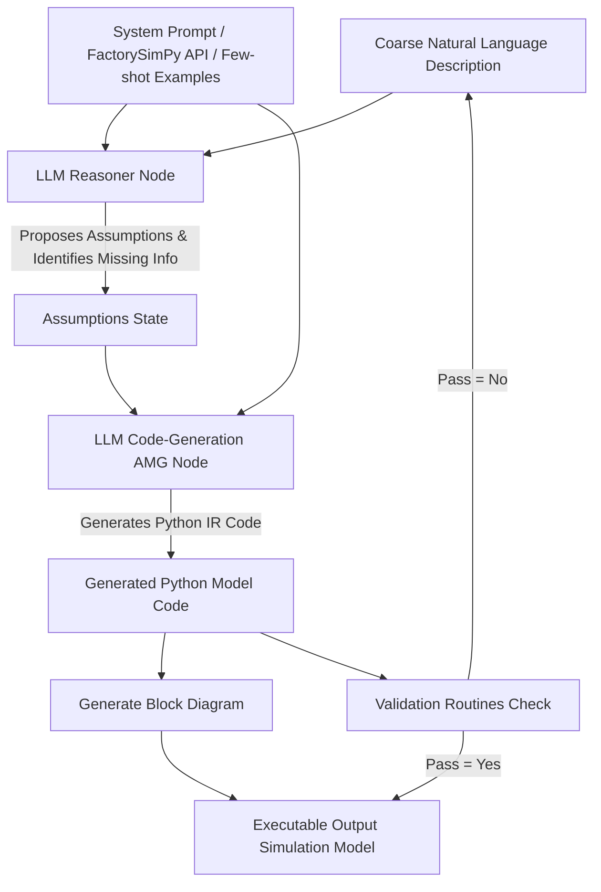

# On Integrating Resilience and Human Oversight into LLM-Assisted Modeling Workflows for Digital Twins

**Lekshmi P**  
Indian Institute of Technology Goa  
Goa, India  
`lekshmi20231101@iitgoa.ac.in`  

**Neha Karanjkar**  
Indian Institute of Technology Goa  
Goa, India  
`nehak@iitgoa.ac.in`  

---

## Abstract

LLM-assisted modeling holds the potential to rapidly build executable Digital Twins of complex systems from only coarse descriptions and sensor data. However, resilience to LLM hallucination, human oversight, and real-time model adaptability remain challenging and often mutually conflicting requirements. **We present three critical design principles** for integrating resilience and oversight into such workflows, derived from insights gained through our work on **FactoryFlow** – an open-source, LLM-assisted framework for building simulation-based Digital Twins of manufacturing systems. **First, orthogonalize structural modeling and parameter fitting.** Structural descriptions (components, interconnections) are LLM-translated from coarse natural language to an intermediate representation (IR) with human visualization and validation, which is then algorithmically converted to the final model. Parameter inference, in contrast, operates continuously on sensor data streams with expert-tunable controls. **Second, restrict the model IR to** interconnections of parameterized, pre-validated library components rather than monolithic simulation code, enabling interpretability and error-resilience. **Third, and most important, is to use a density-preserving IR.** When IR descriptions expand dramatically from compact inputs (turning "100x100 machines as 2D grid" into 10,000 explicit declarations, as XML-netlists do) hallucination errors accumulate proportionally. We present the case for Python as a density-preserving IR: loops express regularity compactly, classes capture hierarchy and composition, and the result remains highly readable while exploiting LLMs' strong code-generation capabilities. **A key contribution** is detailed characterization of LLM-induced errors across model descriptions of varying detail and complexity, revealing how IR choice critically impacts error rates. These insights provide actionable guidance for building resilient and transparent LLM-assisted simulation automation workflows.

---

## 1 Introduction

Digital Twins of manufacturing systems require executable simulation models that can adapt continuously to real-time sensor data and evolving production environments. Traditional modeling and simulation (M&S) workflows (consisting of sequential stages of measurement, input modeling, model specification, conversion to executable form, verification, and validation) are too slow and rigid for critical applications where production systems evolve rapidly. For manufacturing system Digital Twins (DTs), where timely decision-support and optimization are essential, this traditional cycle is increasingly obsolete.

Two key driving forces make automated model generation not only attractive, but imperative. First, the proliferation of IoT sensors and Industry 4.0 initiatives has created an abundance of real-time operational data from manufacturing systems. Second, advances in cloud and edge computing, low-latency networks, and machine learning have made it feasible to leverage AI for automating the entire modeling lifecycle: initial model generation, continuous fitting and tuning to sensor data, ongoing monitoring and adaptation, and model-based decision support including what-if analysis, optimization, and control [30, 18].

**Automated Model Generation (AMG)** emerged as an active research area in the early 2010s, with approaches focusing on process mining techniques to infer system behavior from event logs and flows/structure from sensor data, producing models such as Petri nets and Markov chains [12, 11]. Purely data-driven methods were developed to infer component parameters and system structure directly from operational data [32]. More recently, the dramatic advances in Large Language Models (LLMs) have opened new possibilities: using LLMs as modeling assistants or even as model representations themselves. The ability of LLMs to translate natural language descriptions into formal representations has made LLM-assisted automation increasingly attractive for simulation modeling workflows [2, 20, 3].

However, practical applicability and trust in LLM-assisted automation remain contingent on overcoming inherent issues: hallucination (generation of plausible but incorrect outputs), computational cost and API stability of commercial models, lack of transparency, and alignment challenges [16, 1]. *While these fundamental limitations in LLMs may be addressed in future, practical applications today require workflows that systematically work around these issues through deliberate design principles.* This is our approach.

**Problem Definition and Scope:** In this paper, we narrow our scope to a specific but important class of systems: discrete-event simulation (DES) models of manufacturing systems where parameters (such as machine task delays, energy profiles, state transition rates, failure rates) evolve continuously but structural changes occur sporadically. For example, changes to equipment interconnections, active machines, job sequencing and routing. This characterization is typical of manufacturing systems such as assembly lines, packaging lines, semiconductor fabrication facilities, and consumer goods production plants [27]. While parameters evolve continuously with operational conditions, structural changes are infrequent and typically planned (equipment upgrades, line reconfigurations, capacity expansions). This scoping creates valuable opportunities. First, *orthogonalization becomes possible*: structural modeling and parameter inference require fundamentally different automation strategies and can be decoupled. Structural descriptions benefit from expert knowledge about system topology and can be updated sporadically (with expert-in-loop, either when a change is detected automatically or planned to occur deliberately); while parameter fitting must operate continuously on streaming sensor data. Second, *expert-in-the-loop workflows become practical*: for parameter inference, experts can configure data filters, time windows, distribution families, and mappings between sensor streams and model parameters through graphical interfaces, with automated fitting running continuously under these constraints. For structural modeling, factory operators and production engineers (who may possess deep knowledge of their systems but may lack M&S expertise) can describe system structure in natural language, with LLM-assisted translation producing formal models subject to human (visual) and automated rule-based or test-based validation. This democratization of modeling enables domain experts to contribute their knowledge directly, avoiding pitfalls of purely data-driven approaches to model building where data is scarce, stale, or contains outliers that require human/operator interpretation to handle appropriately. Despite these opportunities, critical challenges remain for making LLM-assisted automation trustworthy in practice:

First is **the challenge of resilience to errors** such as hallucination. When LLMs generate monolithic simulation code directly (for example, [3, 20, 13]), hallucination can introduce subtle errors, some of which may manifest only during execution; in the best case causing simulation crashes, and in the worst case producing plausible but incorrect predictions that lead to flawed decisions. Second is **the challenge of systematic human oversight**. True expert-in-the-loop workflows require more than occasional human validation; they demand systematic integration of domain expertise throughout the entire process. The workflow must enable experts to contribute their knowledge about the system while remaining accessible to users without specialized M&S training. These two challenges are interconnected: oversight mechanisms enable resilience by allowing human validation to catch errors, while resilience to errors enables effective oversight. Both require deliberate architectural choices in how automation workflows are designed.

### 1.1 Main Contributions

This paper presents three critical design principles for integrating resilience and human oversight into LLM-assisted modeling workflows. These principles emerged from the iterative development and refinement of *FactoryFlow*, our open-source framework for building simulation-based Digital Twins of manufacturing systems. FactoryFlow combines LLM-assisted structural modeling, real-time parameter inference from sensor data, and systematic expert validation to produce executable discrete-event simulation models. FactoryFlow is publicly released as open source at [https://github.com/InferaFactorySim/FactoryFlow](https://github.com/InferaFactorySim/FactoryFlow) [8].

**Previous Work:** An initial prototype presented at WinterSim 2025 [22] introduced the conceptual framework and presented **FactorySimPy** (a validated component simulation library) as the main contribution, along with a proof-of-concept LLM-translation implemented using a **netlist-like IR** (where each component instance was explicitly listed out as a dictionary along with its interconnections). Subsequently, through analysis and iterative improvement of that implementation, we observed that hallucination errors occurred more frequently when compact natural language descriptions expanded into large netlist representations. This led us to explore alternative IRs, including XML and JSON formats for netlists, and ultimately Python for structural description with its native support for loops and classes to represent regular structures, composition and hierarchy. Several examples also revealed various error types beyond hallucination in LLM-generated descriptions. We found that *a systematic error characterization for LLM-assisted simulation model generation is largely absent in published literature*, motivating a key focus of this work. Building on this, the current paper makes the following contributions:

1. **Three design principles for resilient and transparent LLM-assisted workflows** (particularly suited to the manufacturing DTs context). We present, justify, and demonstrate three critical principles: (1) orthogonalization of structural modeling and parameter fitting with systematic human-in-the-loop integration, (2) component-based composition rather than monolithic code generation, and (3) density-preserving intermediate representation design. We justify each principle giving examples and describe its implementation in FactoryFlow. For principle 3, we empirically demonstrate that a **density-preserving IR** (specifically Python) reduces hallucination errors relative to XML-netlists by enabling compact, readable representations through loops and classes, while leveraging strong code-generation capabilities in modern LLMs.
2. **Detailed error characterization and actionable insights.** Through systematic analysis of LLM-induced errors across models of varying size and topological complexity, we characterize error types, their frequencies, and how they depend on model characteristics and IR choice. From this empirical analysis, we derive actionable insights for building trustworthy LLM-assisted simulation automation workflows, with principles generalizable beyond manufacturing Digital Twins.

The remainder of this paper reviews related work to place our contributions in context (Section 2), presents a summary of the FactoryFlow architecture (Section 3), and the three design principles using examples and the case for Python as an IR (Section 4). Section 5 describes our experimental methodology, presents error characterization results, and discusses key insights and broader implications. Section 6 concludes with a discussion of unresolved challenges, limitations in current implementation, takeaways and future directions.

---

## 2 Related Work

**Automated Simulation Model Generation (AMG /ASMG)** emerged well before large language models, rooted in process mining, knowledge-based methods, and data-driven parameter inference [24, 25, 6, 33]. Process mining techniques infer system behavior from event logs, producing Petri nets and enabling automated digital twin generation [24, 23]. Data-driven approaches extract parameters from operational sensor data [32]. These foundational methods established the importance of separating structural discovery from parameter tuning, a principle that remains relevant as LLMs introduce new automation capabilities.

**LLMs for simulation model generation.** Large language models have opened new avenues through natural language interfaces supporting the entire simulation lifecycle [14]. Direct natural language to code approaches translate textual descriptions into executable models [20, 17], including generation for proprietary platforms (FlexSim [31], DEVS [4]), domain-specific languages, and System Dynamics specifications [3]. Multi-agent systems employ LLMs to configure agent behaviors [15], spanning agent-based models [26, 5] and manufacturing planning [7]. While democratizing modeling for non-experts, these approaches often require human-in-the-loop debugging to correct logic errors and hallucinations [20, 3, 16, 1].

**Intermediate representations and structured generation.** To improve reliability, structured approaches employ intermediate representations bridging natural language and executable artifacts. Template-guided methods constrain LLM outputs to predefined schemas: conversational knowledge extraction populates templates that instantiate models directly [7], while formal modeling languages with scalable templates ensure structural and semantic correctness [36]. Schema-based representations including CMSD, XML, and JSON provide standardized formats for manufacturing simulation [27, 21], though their instance-oriented nature limits scalability for large, regular structures. Domain-specific languages with grammar constrained generation reduce syntax errors through few-shot prompting and constrained decoding [19]. Multi-agent systems have translated specifications into synthesizable hardware design code [35]. These IR-based approaches trade flexibility for correctness guarantees, though most still require domain expertise to validate intermediate outputs.

**Verification, validation, and error characterization.** Reliability depends on systematic verification mechanisms. Grammar constrained template filling significantly reduces syntax errors [36], while FSM-based checks ensure logical feasibility of manufacturing workflows [20, 29]. Formal error characterization through metrics such as Degree of Error and Model Consistency quantifies practical impact [36]. Agentic frameworks demonstrate self-validation where LLM agents generate models, conduct in-silico experiments, and perform self-evaluation [28]. A recent taxonomy of LLM code-generation errors [34] categorizes failures into semantic and syntactic classes and reports that most stem from reasoning about task requirements rather than from syntactic mistakes. Our eight-category taxonomy is consistent with this finding in the DES modeling setting: syntactic errors (T7) were absent across all 35 benchmark models, while semantic errors dominated, particularly structural hallucinations (T3, T4) and hierarchy mismatches (T6).

Our work addresses gaps in existing approaches: (1) orthogonalization of structural modeling from continuous parameter fitting in operational systems, (2) systematic characterization of error types in LLM-generated DES models, and (3) design principles for intermediate representations that preserve information density while enabling human oversight, all with alignment to the application area of manufacturing DTs.

---

## 3 FactoryFlow Architecture

FactoryFlow is an open-source framework for generating executable discrete-event simulation models of manufacturing Digital Twins from coarse natural language descriptions and sensor data. The framework comprises three main components: *DataFITR* for real-time parameter inference and distribution fitting from sensor streams, *FactorySimPy* as a validated library of configurable manufacturing system components, and an *LLM-based structural model generator* that translates natural language descriptions into component interconnections [10, 9].

The architecture and initial prototype implementation were described in [22]. While that work focused on developing the core FactorySimPy library and a prototype LLM flow using netlist-like representations, the current paper presents a refined LLM-based structural modeling architecture.

```
+-----------------------------------------------------------------------------------+
|                            Coarse Model Description                               |
| "System has two machines M1 and M2 with delay 2. Source (ID=SRC) with inter arrival |
|  time of 1.2. The system ends in sink"                                           |
+-----------------------------------------------------------------------------------+
       |                                                               |
       v                                                               v
+--------------+                                              +-----------------+
| System prompt|                                              |  LLM Reasoner   |
| FactorySimPy |--------------------------------------------->|      Node       |
| API / Examples|                                             +-----------------+
+--------------+                                                       |
       |                                                               v
       |                                                      +-----------------+
       |                                                      |   Assumptions   |
       |                                                      | 1. Node names...|
       |                                                      | 2. Sequence...  |
       |                                                      | 3. Buffers...   |
       |                                                      | 4. Single buff..|
       |                                                      | 5. Defaults...  |
       |                                                      +-----------------+
       |                                                               |
       v                                                               v
+-------------------------------------------------------------------------------+
|                                 LLM AMG Node                                  |
+-------------------------------------------------------------------------------+
                                       |
                                       v
+-------------------------------------------------------------------------------+
|                            Generated Python Code                              |
| class SystemModel(Node):                                                      |
|     def __init__(self, env, id):                                              |
|         super().__init__(env, id)                                             |
|         self.src = Source(env, id="SRC", inter_arrival_time=1.2)              |
|         self.M = [Machine(env, id=f"M{i+1}", processing_delay=2)              |
|                   for i in range(2)]                                          |
|         self.sink = Sink(env, id="sink")                                      |
|         self.add_child_node([self.src] + self.M + [self.sink])                |
|         self.e = [Buffer(env, id=f"e[{i}]") for i in range(3)]                |
|         self.add_child_edge(self.e)                                           |
|         self.e[0].connect(self.src, self.M[0]) # src-M1                       |
|         for i in range(1):                                                    |
|             self.e[i+1].connect(self.M[i], self.M[i+1]) # M1-M2               |
|         self.e[2].connect(self.M[-1], self.sink) # M2-sink                    |
+-------------------------------------------------------------------------------+
       |                                                               |
       v                                                               v
+-------------------+                                       +-------------------+
|Validation Routines|                                       | Generate Block    |
|   (Pass? Y/N)     |                                       |      Diagram      |
+-------------------+                                       +-------------------+
       |                                                               |
       +----------------------------+----------------------------------+
                                    |
                                    v
                        +-----------------------+
                        | Output Simulation Model|
                        +-----------------------+
```

### Figure 1: Architectural Representation and Workflow Diagram



*Figure 1 Description:* The diagram illustrates a LangGraph-based architecture for LLM-assisted structural model generation. A user provides a coarse natural language description (e.g., "System has two machines M1 and M2 with delay 2..."). The **Reasoning node** evaluates the description, identifies missing topological parameters, and outputs a structured list of assumptions (naming conventions, linear routing, buffer insertion, default parameters). These assumptions, alongside system prompts, API definitions, and few-shot examples, pass to the **LLM AMG (Code-Generation) node**. The code generation node translates the description into executable Python code utilizing FactorySimPy classes. This code is rendered as a **visual block diagram** for human oversight and passed through **automated validation routines**. If validation passes, the simulation model is produced; if not, feedback cycles back for iterative refinement.

The LLM-based structural modeling component uses a LangGraph architecture with two primary nodes (Figure 1). The *reasoning node* interprets the system description, identifies missing information, and proposes explicit assumptions (component identifiers, buffer counts, routing policies). The *code-generation node* receives the description, assumptions, and supporting materials (FactorySimPy API specification, example models, system prompt) to generate executable Python code by instantiating FactorySimPy components and their interconnections. We use Gemini 2.5 Pro with few-shot prompting that demonstrates component instantiation, interconnection patterns, parameter passing, and naming conventions. FactoryFlow maintains structured state containing the user description and inferred assumptions, updated incrementally across LangGraph iterations.

**Generated Model and Validation Support:** The generated model is in the form of Python code that imports FactorySimPy, instantiates components from the library (such as machines, conveyor belts and buffers) and initializes their parameters and interconnections (similar to model descriptions built using commercial tools such as Arena or FlexSim). It is returned to the user along with an automatically derived block diagram for visual inspection. The user has multiple options for refinement: directly modify the generated Python code, edit the original natural language description, adjust the inferred assumptions, or any combination thereof. Modified inputs can be resubmitted to the LangGraph pipeline, enabling iterative refinement until the model satisfies domain requirements.

Once the user accepts the generated model, automated validation routines execute to detect structural errors including isolated components, missing connections, unspecified mandatory parameters, and violations of component interconnection rules defined in the FactorySimPy library. These validation checks provide an additional layer of error detection beyond human inspection, ensuring that only well-formed models proceed to execution.

**Target users and expected interaction:** FactoryFlow targets factory operators, production engineers, and simulation experts. Non-M&S users are not expected to read or write the Python IR. Their typical interaction is through the natural-language description and the automatically generated block diagram, with LLM assistance handling IR synthesis. Simulation experts may additionally inspect or edit the IR directly. Extending the behavior of components, as opposed to their composition, requires modifying the FactorySimPy library and is an M&S-expert workflow.

Section 4 describes the three design principles and how they are incorporated into this architecture.

---

## 4 Design Principles and IR Choice

We present three critical design principles for integrating resilience and human oversight into LLM-assisted modeling workflows. These principles are particularly suited to manufacturing Digital Twins where system structure changes sporadically (equipment layout, interconnections, routing) while parameters evolve continuously (task delays, energy profiles, machine states).

### Principle 1: Orthogonalize Structural Modeling and Parameter Fitting

Structural modeling and parameter inference serve fundamentally different purposes and benefit from independent automation strategies. In FactoryFlow, this orthogonalization is realized through two separate subsystems.

**Parameter fitting (DataFITR):** Parameter inference operates continuously on real-time sensor streams using distribution fitting techniques that identify appropriate distribution families and estimate parameters. LLMs are not required; classical statistical methods and ML algorithms suited to time-series analysis suffice. The process is expert-tunable through GUI-based controls where users configure time windows, select candidate distribution families, and specify mappings between sensor streams and model parameters. Random variates generated by DataFITR are automatically matched to component parameters by instance name, with manual configuration available when needed. Once configured, algorithms perform continuous fitting, updating model parameters automatically.

**Structural modeling (LLM-assisted):** System structure (components, interconnections, routing policies) is translated from coarse natural language using the LLM-based flow described in Section 3. Validation occurs through automatically generated block diagrams and built-in routines in FactorySimPy that check for isolated components, missing connections, and unspecified parameters. When structural changes occur, expert input is solicited to modify the description and regenerate the model. Additional validation can compare known performance metrics such as cycle time between the real system and simulation.

Elevating this separation to a design principle rests on a contrast with existing AMG approaches and on an asymmetry inherent to manufacturing systems. Several data-driven AMG methods infer structure and parameters jointly from a single source: process mining derives both topology and timing/routing parameters from event logs, and Petri-net or FSM discovery methods learn transitions and rates together. Such combined approaches fit settings where topology itself must be discovered from data. In the manufacturing DT setting, structural changes are sporadic and planned (line reconfigurations, equipment upgrades) and are most reliably captured from expert natural-language descriptions, while parameter drift is continuous (tool wear, throughput variability, failure-rate shifts) and is most reliably captured from live sensor streams. Binding the two into a single automation step forces a compromise on whichever axis is less well matched to the chosen data source. Orthogonalization lets each use the strategy best suited to its timescale and data source: LLM-assisted synthesis with expert validation for structural updates, statistical fitting for parameter updates. A secondary benefit is that the structural generator and DataFITR can be validated, tuned, and evolved independently.

### Principle 2: Component-Based Composition

Rather than having LLMs generate monolithic simulation code from scratch [3, 20, 13], FactoryFlow constrains model generation to instantiating and interconnecting validated components from the FactorySimPy library. FactorySimPy provides pre-validated, well-documented component classes for elements commonly found in manufacturing systems: machines with various processing policies, buffers with configurable capacities and queueing disciplines, conveyors, material handling fleets, splitters, mergers, and sources/sinks. While minimal in scope, the library is designed for extensibility.

This architectural constraint yields several benefits. Errors can only occur in component instantiation and interconnection, not in underlying simulation mechanics, as FactorySimPy handles all low-level concerns. Automated validation routines check for common structural errors such as isolated components, missing connections, duplicate instance names, and violations of interconnection rules. More subtle bugs such as race conditions cannot result from model construction, as component semantics enforce proper synchronization. Unlike subtle deadlocks that can be caused in monolithic simulation code, if a purely structural description produces deadlock, this often indicates a real deadlock possibility in the actual system. Finally, models composed of familiar, named components (`Machine_A`, `Buffer_B`) are far more interpretable to domain experts than monolithic code with complex event scheduling.

**Tradeoff:** Component-based modeling is more rigid. Behaviors not supported by existing components require library extension. This approach suits domains where a canonical set of building blocks is known and relatively stable, as is typical in manufacturing systems. This is reflected in our error characterization (Section 5): no Python syntax errors (T7) were observed across the 35 benchmark models, and residual errors were confined to component naming, parameter assignment, structural hallucinations, and framework-level constraints.

### Principle 3: Density-Preserving Intermediate Representations

This principle addresses how system structure is represented in the intermediate form generated by the LLM. Traditional structural descriptions rely on enumerative formats where each component instance and connection is explicitly listed (netlists in circuits, UML in software, XML/JSON in data formats). While adequate for small systems, these formats exhibit critical weaknesses when produced by LLMs for large or regular structures.

**The Problem: Enumerative Expansion and Error Accumulation:** Consider the description: *"Create a 100×100 grid of machines, each connected to its four nearest neighbors."* This compact input describes 10,000 machines and approximately 40,000 connections. In an enumerative netlist-based IR, the LLM must explicitly generate entries for all 10,000 machines and 40,000 connections, each requiring correct identifiers, parameters, and connection endpoints. We observed that hallucination errors accumulate proportionally with this expansion. Common errors in netlist-based IR included naming inconsistencies (`machine_50_50` versus `Machine_50_50`), off-by-one errors in indexing, missing boundary connections, hallucinated parameter values, and duplicate declarations. Furthermore, these massive netlists (thousands of lines) become unreadable to human experts, defeating the goal of enabling oversight.

**The Solution: Density-Preserving IRs:** Intermediate representations should maintain proportional complexity to natural language inputs by supporting programmatic constructs for modularity (functions and classes), hierarchy (composition mechanisms), and regular structures (loops, comprehensions, generators). An IR with these features allows "100×100 mesh" to remain compact. For the mesh example, a density-preserving Python IR might be:

```python
machines = [[Machine(f"m_{i}_{j}") for j in range(100)]
            for i in range(100)]
for i in range(100):
    for j in range(100):
        if j < 99: machines[i][j].connect(machines[i][j+1])
        if i < 99: machines[i][j].connect(machines[i+1][j])
```

This representation is approximately 5 lines regardless of grid size, versus 50,000+ lines for enumerative netlists. The loop-based structure mirrors regularity in the natural language description, reducing hallucination opportunities while remaining readable. This principle is not unique to Python. Hardware description languages (VHDL, Verilog) provide `generate` statements and parameterized modules precisely to enable compact specification of regular structures, reducing human error. This becomes even more critical when the generator is an LLM prone to inconsistencies.

Python is well-suited as a density-preserving IR because it provides native support for loops and comprehensions (enabling compact expression of regular topologies), a class system supporting hierarchical organization, high readability when constrained to component instantiation patterns, strong LLM code-generation capabilities (Python is heavily represented in training corpora), and natural alignment with FactorySimPy (which is Python-based). Our empirical evaluation (Section 5) demonstrates that the hallucination errors accumulate in proportion to the size of the LLM's output, which in turn depends on the choice of the IR. We observed that transition from netlist to Python IR substantially reduced hallucination error counts across models of varying complexity. Beyond the benchmark set, we have used FactoryFlow to generate hierarchical manufacturing lines with regular structures containing more than 10000 components. The generated IR remains a few tens of lines in these cases, and the natural-language descriptions and FactoryFlow-generated models are available in the GitHub repository.

---

## 5 Error Characterization Results and Insights

This section presents empirical analysis of errors in LLM-generated simulation models across varying system sizes and description granularities. A comprehensive dataset documenting this characterization study including the benchmark model set, natural language descriptions, LLM-generated outputs, identified errors, and analysis scripts is **publicly available** in the FactoryFlow GitHub repository [8] at this link.

### 5.1 Methodology

We constructed a benchmark set of 35 manufacturing system models (S1-S35) with varying sizes and topological complexity. System size ranges from simple serial configurations with fewer than 10 components to large hierarchical systems with 100+ components. The set includes:

* Simple serial systems (S1-S5)
* Parallel systems and feedback loops (S6-S11)
* Multi-edge systems with routing policies (S8, S23, S25, S27)
* Hierarchical and nested subsystems (S12, S18, S26, S29, S30)
* Irregular or heterogeneous interconnections (S21, S22)
* Very large systems with regular structures (S24, S31-S35)

For each system, we prepared three artifacts: (1) a *ground-truth implementation* written in Python using FactorySimPy, representing the intended system structure with correct component names, connectivity, and parameter values; (2) a *coarse natural language description* providing high-level system overview with minimal or no specification of component identifiers, parameter values, or naming conventions; and (3) a *detailed natural language description* fully specifying system structure including component identifiers, parameters, connectivity, and prescribed naming patterns.

Each description (coarse and detailed) was processed through FactoryFlow's LLM-based pipeline, generating assumptions and intermediate representation (IR) code. The generated FactorySimPy models were compared against ground-truth implementations at the component, connection, and parameter levels. Errors were identified and classified according to the taxonomy described below. Model comparison was carried out at the structural and semantic level rather than through exact code matching, such that functionally equivalent implementations are treated as correct.

### 5.2 Error Taxonomy

Observed errors are classified into eight types grouped under three broad categories: lexical, structural, and formal errors. Table 1 summarizes the error types with definitions and representative examples.

**Lexical errors (T1-T2)** stem from incorrect naming or parameter assignment. Naming errors (T1) include inconsistent identifier formats (`machine_50_50` versus `Machine_50_50`), off-by-one indexing mistakes where 0-based indexing from few-shot examples conflicts with 1-based references in natural language descriptions, and misapplied naming conventions. These errors are particularly prevalent in grid-based systems and when naming rules depend on spatial attributes or procedural generation. Parameter errors (T2) involve incorrect parameter values, misapplication of default values when descriptions are ambiguous, or incorrect resolution of conflicting parameter specifications.

**Structural errors (T3-T6)** arise from hallucinations or incorrect structural reasoning by the LLM, resulting in divergence between the generated model and intended system semantics. Node hallucinations (T3) include addition or omission of components such as machines, buffers, sources, or sinks. Edge hallucinations (T4) involve incorrect connections between components. Parameter hallucinations (T5) occur when the LLM generates parameter specifications not present in the description or infers incorrect parameter structures (e.g., routing policies as explicit lists rather than supported policy types). Hierarchy mismatches (T6) include flattening of nested subsystems, misplacing components across hierarchical scopes, or collapsing intended modular structures into global topologies.

**Formal errors (T7-T8)** correspond to violations of Python syntax (T7) or FactorySimPy-specific constraints (T8). Python syntax errors include malformed expressions, undefined variables, or improper indentation. FactorySimPy constraint violations include invalid edge cardinality (e.g., attempting one-to-many connections where one-to-one is required), incompatible port type connections, invalid routing policy specifications, or structural patterns that leave components disconnected.

### Table 1: Error taxonomy with definitions and examples.

| ID | Category | Description & Example |
| :--- | :--- | :--- |
| **T1** | Naming errors | Inconsistent identifiers, off-by-one indexing, or violated naming conventions. *Example:* Grid systems use 0-based indexing when description specifies 1-based (S21, S24); buffers renamed to generic identifiers from few-shot examples (`edge[0]`, `src_edge[0]`); naming errors increase with description detail rather than decrease. |
| **T2** | Parameter errors | Incorrect parameter values, misapplied defaults, or ambiguous conflict resolution. *Example:* S13 prioritized stage-specific values over generic statements; routing policies defaulted to `ROUND_ROBIN` when unspecified (S30, S31-S35). |
| **T3** | Node hallucination | Addition or omission of nodes (machines, buffers, sources, sinks). *Example:* S3 hallucinated an extra machine to satisfy perceived edge constraints; S35 hallucinated 10 nodes not in description. |
| **T4** | Edge hallucination | Addition or omission of edges (connections between components). *Example:* S18 inferred two feedback connections instead of one based on ambiguous phrasing; S35 hallucinated 7 edges. |
| **T5** | Parameter hallucination | Generation of parameter specifications not present in description or incorrect parameter structures. *Example:* S23, S25 hallucinated routing behavior as explicit lists instead of supported policy types; S35 hallucinated many parameter values not specified. |
| **T6** | Hierarchy mismatch | Incorrect hierarchical structure, flattening of nested subsystems, or misplaced component scope. *Example:* S13, S15, S18, S24, S31 collapsed explicitly described subsystems into flat topologies; S26 reinterpreted hierarchical system as single serial flow; S24 assumed single global source/sink instead of per-row hierarchy. |
| **T7** | Python syntax | Malformed expressions, undefined variables, indentation errors. *Note:* No Python syntax errors observed across all experiments. |
| **T8** | FactorySimPy violations | Invalid edge cardinality, incompatible connections, or unsupported specifications. *Example:* S13, S15 attempted one-to-many edges violating one-to-one constraint (single buffer connecting source to multiple machines); S30 left machine without outgoing edge. |

---

### 5.3 Quantitative Results

We analyze the LLM-generated models to address **four key questions**: (1) How do error counts correlate with model size and complexity? (2) Which error types are most frequent, and does this vary between coarse and detailed descriptions? (3) What is the impact of description granularity on error profiles? (4) Are certain model characteristics or description styles more error-prone?

#### Figure 2: Error counts across models ordered by complexity (IR size)

```
[Detailed Description Panel]
Error Count / Node Count vs Model ID (S1 -> S35 sorted by IR size)
 - Bars: Node count (Model Size) ranging up to 125+ nodes (peaks at S22, S13, S35).
 - Dots/Trend line: Error count rising moderately from ~0 errors for small models up to ~35 errors on high-complexity systems.

[Coarse Description Panel]
Error Count / Node Count vs Model ID (S1 -> S35 sorted by IR size)
 - Bars: Node count (Model Size).
 - Dots/Trend line: Error count showing a steeper increasing trend up to ~45 errors (e.g., S15, S21, S9).
```

*Figure 2 Description:* Figure 2 orders models S1 through S35 by increasing complexity, measured by the character count of the generated Python IR. For each model ID, bar height represents node count (number of component instances) on the right y-axis, while points/trend lines denote total error counts on the left y-axis. The upper chart shows Detailed Descriptions, where error growth is attenuated; the lower chart shows Coarse Descriptions, where error count increases more sharply with IR size and topological complexity.

**Error growth with model size and complexity.** Figure 2 orders models by increasing complexity, approximated by the character count of the generated IR. For each model, bar height represents model size (number of component instances), while points denote error counts. A general increasing trend shows correlation between model size, IR size, and error counts. Smaller models (S1-S5) are typically generated with few or no errors, while larger and more structurally complex models exhibit higher error counts. This trend holds for both coarse and detailed descriptions. Notably, models S31-S35, despite their large size (100+ components), show comparatively lower error rates due to their regular, repeated structures. This suggests that structural regularity mitigates error accumulation even at scale when using density-preserving IR.

#### Figure 3: Aggregate error type frequency across all models

```
Total Error Count by Type:
  Error Type | Coarse Description | Detailed Description
  -----------|-------------------|---------------------
  T1 (Naming)|       162         |          75
  T2 (Param) |        28         |          14
  T3 (Node H)|        31         |          51
  T4 (Edge H)|        33         |          49
  T5 (Para H)|         3         |           5
  T6 (Hier M)|        15         |          26
  T7 (Syntax)|         0         |           0
  T8 (FS Viol)|        1         |          19
```

*Figure 3 Description:* A bar chart comparing aggregate error type frequencies across all 35 benchmark models between Coarse (blue) and Detailed (orange) natural language inputs. Naming errors (T1) overwhelmingly dominate in coarse descriptions (162 vs 75). Conversely, detailed descriptions show higher counts of structural hallucinations (T3: 51 vs 31; T4: 49 vs 33), hierarchy mismatches (T6: 26 vs 15), and framework syntax violations (T8: 19 vs 1). Python syntax errors (T7) are 0 across all cases.

#### Figure 4: Error composition across individual models for both coarse and detailed descriptions

```
Top Panels: Stacked bar charts of Error Types (T1-T8) overlaid with Model Size (Nodes and Edges).
  - Coarse: High proportion of T1 (striped) across medium/large models. Spikes in T3/T4 for S15, S24.
  - Detailed: Lower T1; prominent T3/T4/T6/T8 stacked segments in complex models (S12-S16, S24, S31).

Bottom Panels: Stacked bar charts of Structural Errors (T3-T6) overlaid with IR Size (red line).
  - Shows direct tracking between peaks in structural hallucinations/hierarchy mismatches and larger IR character counts.
```

*Figure 4 Description:* Detailed breakdown of error composition for individual benchmark models under Coarse (left column) and Detailed (right column) descriptions. Top row overlays error category stacks with node/edge counts; bottom row isolates structural hallucinations (T3–T6) overlaid with total IR size (character count). Peaks in structural hallucinations coincide with irregular topologies and explicit specification complexity.

**Error type distribution and composition.** Figure 3 presents aggregate error frequency across all models, comparing coarse and detailed descriptions. Naming errors (T1) are most frequent under coarse descriptions. It is important to note that coarse descriptions do not specify component names, so any generated name is valid in principle; we count mismatches with intended ground-truth names to maintain consistent comparison. Detailed descriptions reduce T1 but increase T3 (node hallucination), T4 (edge hallucination), T6 (hierarchy mismatch), and T8 (FactorySimPy violations).

Figure 4 shows error composition across individual models using stacked bars. For coarse descriptions, naming errors (T1) dominate in medium-to-large models (S7-S15, S21, S24), reflecting identifier inference ambiguity. Node and edge hallucinations (T3, T4) appear frequently in structurally irregular systems (S30, S24). Hierarchy errors (T6) emerge in systems with repeated or nested structures but remain less frequent overall. For detailed descriptions, naming errors are reduced in smaller systems, but hierarchy errors (T6) become more pronounced in models with repeated subsystems or cross-connections (S12-S15, S31). FactorySimPy violations (T8) also increase with detailed specifications, indicating that richer structural constraints raise the likelihood of framework-level violations.

**Impact of description granularity.** Figures 3 and 4 compare error profiles between coarse and detailed descriptions for the same models. Providing detailed descriptions generally reduces total error counts, but the improvement is not uniform. While detailed descriptions effectively reduce naming errors (T1) by constraining component identifiers, they also introduce new error sources, particularly hierarchy mismatches (T6) and FactorySimPy violations (T8). This may reflect inherent limitations of natural language for describing networks and graphs: natural language is often context-dependent and ambiguous when specifying connectivity patterns, making detailed structural descriptions prone to misinterpretation. Increased detail shifts the error profile rather than eliminating errors entirely. Coarse descriptions produce errors dominated by naming (T1) and hallucinations (T3-T5), reflecting underspecification. Detailed descriptions exhibit more balanced error distribution with increased contributions from hierarchy (T6) and constraint violations (T8).

**Netlist versus Python as IR:** To validate the density-preservation principle, we compared error rates between netlist-based IR (using Python dictionaries, as in our initial prototype) and Python-based IR for a subset of models. For S5, a simple linear sequence of 5 machines (7 nodes, 6 edges, 12 parameters), the netlist representation (13 dictionary entries) generated zero errors with detailed descriptions, indicating that enumerative IR remains adequate at small scale. However, as structural variation increased, netlist limitations became pronounced. For S8, a linear system with additional buffers inserted at specific positions, netlist-based IR produced 10 errors (structural hallucinations, incorrect parameter assignments, FactorySimPy constraint violations, improper edge chaining) while Python IR generated only 2 errors. For larger systems, the contrast is more dramatic. S34 (100 machines in series) expanded to over 205 netlist entries, and S35 (112 nodes, 165 edges with parallel and serial structures) required 278 entries. In S35, netlist-based IR hallucinated 10 nodes, 7 edges, and numerous unspecified parameter values due to explicit enumeration of repeated subsystems. Python IR, using loops and hierarchical structuring, encapsulated repetition compactly, substantially reducing hallucination errors. These results demonstrate that density-preserving IR reduces error accumulation, particularly for systems with regular or repeated structures. The compact loop-based Python IR also remains human-readable at these scales, whereas netlists with hundreds of entries become impractical to review by inspection.

### 5.4 Key Observations

* **Naming errors and indexing ambiguity:** Naming errors (T1) counterintuitively increase with description detail. The primary cause is indexing conflict: few-shot examples use 0-based indexing while natural language uses 1-based references. When descriptions refer to `Machine 1`, the LLM interprets this as index 1 rather than index 0, causing systematic off-by-one errors in grid systems (S21, S24). Buffers are frequently renamed to generic identifiers from examples (`edge[0]`, `src_edge[0]`). Even explicit naming conventions like `Stage_i_M1` are inconsistently applied, especially with procedural rules (`for i from 1 to 3`) or spatial attributes (S6, S18, S30). Additional detail introduces more alignment opportunities rather than improving conformity.
* **Parameter inference and defaults:** When parameter specifications conflict, the LLM prioritizes specific over generic statements. In S13, stating "Machine in each stage has a processing delay of 4.0, 3, and 2 seconds" overrides the later "All machines have a processing delay of 2". While internally consistent, this reflects implicit prioritization rather than explicit reasoning. When routing policies are unspecified, the LLM defaults to `ROUND_ROBIN` (S30, S31-S35). In S23 and S25, routing instructions were hallucinated as explicit lists rather than mapped to supported FactorySimPy mechanisms (`ROUND_ROBIN`, `FIRST_AVAILABLE`, functions).
* **Hallucinations driven by constraint satisfaction:** The LLM hallucinates nodes, edges, and parameters attempting to satisfy perceived constraints. In S3, given "SRC is connected to M1 and M1 to Sink via Buffers with IDs B1, B2", the LLM inferred two buffers between M1 and Sink and hallucinated an extra machine to satisfy the one-to-one edge constraint. In S18, "The output of the last node is fed to first machine in node1" was interpreted as connections to both machines in the target subsystem, creating two feedback loops instead of one. The LLM prioritizes structural rule satisfaction over faithful interpretation.
* **Hierarchy collapse and global assumptions:** The LLM frequently flattens nested subsystems into global topologies (S13, S15, S18, S24, S31), particularly for non-regular interconnections. In S26, hierarchical subsystems were reinterpreted as a single serial flow. Global sharing assumptions also occur: in S13 and S15, parallel sequences were assumed to share sources and sinks despite no explicit statement. In S13, "Every sequence of SRC is followed by a buffer ID = `B_src_1`" led to inference that one buffer `B_src_1` connects the source to all sequences (violating one-to-one edge constraints). In S24 (10x10 grid), a single global source/sink was assumed instead of row-wise hierarchy. Positional reasoning also fails: in S30, "between the 2nd and 4th machine" was interpreted as replacement rather than insertion, leaving components disconnected.
* **Structural regularity as resilience:** Regular structures exhibit fewer errors than irregular ones regardless of size. S34 (100 machines in series) shows almost no errors, while medium-sized irregular systems (S21, S22) and S24 (10x10 grid with absent machines) produce more errors. Among large systems (S31-S35), regular repeated structures (S32-S35) preserve hierarchy with minor naming drift, while S31 exhibits collapse. Linear scaling is robust; large-scale repetition with implicit hierarchy, irregular cross-connections, or positional semantics increases misinterpretation. Density-preserving Python IR effectively handles regular structures but does not fully mitigate errors from ambiguous hierarchical descriptions or non-regular patterns.

### 5.5 Insights

The error characterization reveals several key insights for designing resilient LLM-assisted modeling workflows.

1. **Density-preserving intermediate representations substantially reduce errors:** the transition from netlist to Python IR demonstrates that compact representations using loops and classes reduce hallucination opportunities, particularly for regular structures (S34: 100 machines, almost no errors with Python IR vs. 205+ netlist entries).
2. **Explicit structure beats implicit conventions:** the LLM struggles with inferred hierarchy, positional semantics ("between machines 2 and 4"), and context-dependent organization, producing global assumptions (shared sources/sinks) when structure is underspecified.
3. **Description detail has non-uniform effects:** reducing naming errors (T1) but increasing hierarchy mismatches (T6) and framework violations (T8), reflecting natural language's inherent ambiguity for describing networks.
4. **Structural regularity, not size, determines error likelihood:** linear sequences and regular grids scale robustly (S32-S35) while medium-sized irregular systems (S21, S22, S26) produce disproportionately more errors.
5. **Component-based constraints effectively limit error surface:** no Python syntax errors (T7) occurred across all experiments, confining errors to naming, parameters, hallucinations, and framework constraints that automated validation can detect.
6. **The 0-based vs. 1-based indexing conflict is systematic:** requires explicit alignment through few-shot examples, system prompts, or post-processing.
7. **Implicit defaults emerge predictably:** (`ROUND_ROBIN` routing, generic parameters) when specifications are incomplete.

These insights suggest that effective LLM-assisted automation requires co-design of component libraries, intermediate representations, description templates, and validation mechanisms. While density-preservation, component-based composition, and orthogonalization create a robust foundation, human oversight through visualization, validation, and iterative refinement remains essential for trustworthy automation.

### 5.6 Takeaways: Towards Effective Model Descriptions

The error characterization reveals a balance between coarse and detailed descriptions. Coarse descriptions leave naming and component identity underspecified, leading to naming errors (T1) and hallucinations (T3, T4). Detailed descriptions constrain naming but introduce more hierarchy mismatches (T6) and framework constraint violations (T8) as the LLM is pushed to interpret richer structural cues. This error profiling study suggests directions in which a modeler could work around the typical errors and write more effective descriptions.

* **First, specify topology explicitly.** Clear articulation of component types, routing logic, and hierarchy reduces structural hallucinations.
* **Second, use library-matched terminology.** Employing standard manufacturing terms (machine, buffer, source, sink) aligned with the FactorySimPy component library reduces translation-induced errors.
* **Third, delegate parameters to DataFITR when system data is available.** Omitting numerical values from the description and letting DataFITR infer them from sensor data avoids parameter conflicts.

To address residual naming inconsistencies even when the above guidelines are followed, FactoryFlow plans to support a post-hoc name mapping mechanism in which the user supplies a CSV mapping generated names to canonical names, applied automatically during validation. This decouples structural correctness from naming conventions and lets the LLM focus on topology. Quantitative validation of these guidelines across model types is planned as future work.

---

## 6 Conclusions and Future Work

This paper addressed the challenge of building trustworthy LLM-assisted automation for manufacturing Digital Twin workflows, where resilience to hallucination and systematic human oversight are essential for practical adoption. We introduced three design principles within FactoryFlow to ground LLM-generated models structurally, syntactically, and parametrically while preserving interpretability and scalability. First, we orthogonalize structural modeling and parameter fitting, separating LLM-driven structural synthesis from data-driven parameter inference. Second, we restrict model representation to interconnections of validated, parameterized component classes (FactorySimPy) rather than monolithic simulation code. Third, we employ Python as a density-preserving intermediate representation, leveraging loops, hierarchy, and composition to express repetition compactly and limit hallucination surface area.

Empirical characterization revealed key insights. Error rates correlate with structural complexity, not size: linear scaling is robust while multidimensional repetition, cross-subsystem coupling, and implicit hierarchy increase misinterpretation. These findings confirm that representational expansion and structural ambiguity drive hallucination accumulation, justifying the design principles suggested here.

**Limitations:** We describe limitations in our work: some inherent to the approach, others related to the scope of our characterization study, and some representing ongoing work in the publicly available open-source implementation. The design principles target systems with static or sporadically changing structures. For dynamically evolving topologies where structural changes occur frequently and unpredictably, process mining or fully data-driven approaches may be better suited. Component-based modeling introduces some rigidity: behaviors not expressible through existing library components require extension. In future, LLM-based generation of raw simulation code from scratch may become sufficiently robust to eliminate the need for such architectural constraints. Recent trends suggest this may happen sooner than expected. However, explainability and interpretability will remain critical at least as long as human operators remain relevant.

Regarding ongoing implementation work, automated structural change detection module is under development. The open-source release of DataFITR currently runs on historical data. Integration with real-time streaming data sources and seamless GUI integration are in progress. Automated design space exploration and optimization capabilities are planned as extensions in FactoryFlow.

Concerning the characterization study, all experiments used a single LLM backend (Gemini 2.5 Pro). Comparative analysis across multiple LLM models, averaged across multiple execution runs, cost-performance tradeoffs with smaller or locally hosted models and an expanded benchmark set with heterogeneity metrics would be ideal for a more thorough characterization, and is planned as future work. The study applies specifically to manufacturing systems representable within FactorySimPy's component scope; generalizability to other simulation domains remains to be studied.

**Future Directions:** Aside from addressing the limitations listed above, future directions involve several promising extensions. A concrete extension is to embed automated validation directly into the FactoryFlow pipeline, running after each model generation step. This includes KPI validators that compare throughput, cycle time, and resource utilization between the generated model and ground-truth data, and structural test suites that check connectivity, adherence to FactorySimPy constraints, and completeness of required components. Extending FactorySimPy to additional manufacturing paradigms (material flows, hybrid models) and developing component libraries for other domains (logistics, healthcare, service systems) would be ideal to test generalizability.

**In conclusion**, while challenges remain in achieving fully trustworthy automation, the combination of density-preserving intermediate representations, component-based composition, and systematic human oversight demonstrates that LLM-assisted workflows can be both powerful and practical when grounded in deliberate architectural choices that prioritize interpretability alongside automation.

---

## References

1. Aisha Alansari and Hamzah Luqman. Large language models hallucination: A comprehensive survey. *arXiv preprint arXiv:2510.06265*, 2025.
2. Alessio Alexiadis and Bahman Ghiassi. From text to tech: Shaping the future of physics-based simulations with ai-driven generative models. *Results in Engineering*, 21:101721, 2024.
3. Jhon G. Botello, Brian Llinas, Jose J. Padilla, and Erika Frydenlund. Toward Automating System Dynamics Modeling: Evaluating Llms in the Transition From Narratives to Formal Structures. In *2025 Winter Simulation Conference (WSC)*, pages 2380–2391, 2025.
4. Tobias Carreira-Munich, Valentín Paz-Marcolla, and Rodrigo Castro. Devs copilot: Towards generative ai-assisted formal simulation modelling based on large language models. In *2024 Winter Simulation Conference (WSC)*, pages 2785–2796, 2024.
5. John Chen, Xi Lu, Yuzhou Du, Michael Rejtig, Ruth Bagley, Mike Horn, and Uri Wilensky. Learning agent-based modeling with llm companions: Experiences of novices and experts using chatgpt & netlogo chat. In *Proceedings of the 2024 CHI Conference on Human Factors in Computing Systems*, CHI '24, New York, NY, USA, 2024. Association for Computing Machinery.
6. Antonio Cimino, Mohaiad Elbasheer, Francesco Longo, Giovanni Mirabelli, Vittorio Solina, and Pierpaolo Veltri. Automatic simulation models generation in industrial systems: A systematic literature review and outlook towards simulation technology in the industry 5.0. *Journal of Manufacturing Systems*, 80:859–882, 2025.
7. Mohaiad Elbasheer, Yuanjun Laili, Francesco Longo, Vittorio Solina, Yiran Tao, Pierpaolo Veltri, Yuteng Zhang, and Lin Zhang. Natural language-driven production planning: integrating large language models with automatic simulation model generation in manufacturing systems. *Journal of Intelligent Manufacturing*, pages 1–28, 11 2025.
8. FactoryFlow PoC. GitHub Repository. [https://github.com/InferaFactorySim/FactoryFlow](https://github.com/InferaFactorySim/FactoryFlow), 2026.
9. FactorySimPy Documentation. Documentation of the Package with Examples. [https://factorysimpy.github.io/FactorySimPy](https://factorysimpy.github.io/FactorySimPy), 2026.
10. FactorySimPy Repository. GitHub Repository. [https://github.com/FactorySimPy/FactorySimPy](https://github.com/FactorySimPy/FactorySimPy), 2026.
11. Jonas Friederich, Deena P. Francis, Sanja Lazarova-Molnar, and Nader Mohamed. A framework for data-driven digital twins of smart manufacturing systems. *Computers in Industry*, 136:103586, 2022.
12. Jonas Friederich, Giovanni Lugaresi, Sanja Lazarova-Molnar, and Andrea Matta. Process mining for dynamic modeling of smart manufacturing systems: Data requirements. *Procedia CIRP*, 107:546–551, 2022.
13. Erika Frydenlund, Joseph Martínez, Jose J Padilla, Katherine Palacio, and David Shuttleworth. Modeler in a box: how can large language models aid in the simulation modeling process? *SIMULATION*, 100(7):727–749, 2024.
14. Philippe J. Giabbanelli. Gpt-based models meet simulation: How to efficiently use large-scale pre-trained language models across simulation tasks. In *2023 Winter Simulation Conference (WSC)*, pages 2920–2931, 2023.
15. Hiromitsu Hattori, Arata Kato, and Mamoru Yoshizoe. Integrating large language models into agent models for multi-agent simulations: Preliminary report. In *2024 Winter Simulation Conference (WSC)*, pages 230–241, 2024.
16. Lei Huang, Weijiang Yu, Weitao Ma, Weihong Zhong, Zhangyin Feng, Haotian Wang, Qianyu Chen, Weihua Peng, Xiaocheng Feng, Bing Qin, and Ting Liu. A survey on hallucination in large language models: Principles, taxonomy, challenges, and open questions. *ACM Transactions on Information Systems*, 43(1), 2024.
17. Ilya Jackson, Maria Jesus Saenz, and Dmitry Ivanov. From natural language to simulations: Applying ai to automate simulation modelling of logistics systems. *International Journal of Production Research*, 62(4):1434–1457, 2024.
18. Tahira Kalsoom, Naeem Ramzan, Sajid Ahmed, and Masood Ur-Rehman. Advances in sensor technologies in the era of smart factory and industry 4.0. *Sensors*, 20(23):6783, 2020.
19. Justin Noah Kreikemeyer, Milosz Jankowski, Pia Wilsdorf, and Adelinde M. Uhrmacher. Using (Not-so) Large Language Models to Generate Simulation Models in a Formal DSL: A Study on Reaction Networks. *ACM Trans. Model. Comput. Simul.*, 35(4), September 2025.
20. Akshit Kumar, Tianyi Peng, Yuhang Wu, and Assaf Zeevi. Performance of llms on stochastic modeling operations research problems: From theory to practice. In *2025 Winter Simulation Conference (WSC)*, pages 2392–2403, 2025.
21. Sanket Kute, Da Ma, Richard Reider, Marcel Müller, and Sebastian Lang. Generative ai for automatic simulation model generation in factory planning: A framework and prototype. *Procedia Computer Science*, 274:1024–1033, 01 2025.
22. P. Lekshmi and Neha Karanjkar. Bridging expertise and automation: A hybrid approach to automated model generation for digital twins of manufacturing systems. In *2025 Winter Simulation Conference (WSC)*, pages 2800–2811, 2025.
23. Giovanni Lugaresi. Process mining as catalyst of digital twins for production systems: Challenges and research opportunities. In *2024 Winter Simulation Conference (WSC)*, pages 1–12, 2024.
24. Giovanni Lugaresi and Andrea Matta. Automated digital twins generation for manufacturing systems: a case study. *IFAC-PapersOnLine*, 54(1):749–754, 2021.
25. Giovanni Lugaresi and Andrea Matta. Automated digital twin generation of manufacturing systems with complex material flows: graph model completion. *Computers in Industry*, 151:103977, 2023.
26. Joseph Martínez, Brian Llinas, Jhon G. Botello, Jose J. Padilla, and Erika Frydenlund. Enhancing GPT-3.5's Proficiency in Netlogo Through Few-Shot Prompting and Retrieval-Augmented Generation. In *2024 Winter Simulation Conference (WSC)*, pages 666–677, 2024.
27. M. C. May, C. Nestroy, L. Overbeck, and G. Lanza. Automated model generation framework for material flow simulations of production systems. *International Journal of Production Research*, 62(1-2):141–156, 2024.
28. Tobias Möltner, Peter Manzl, Michael Pieber, and Johannes Gerstmayr. Creation, evaluation and self-validation of simulation models with large language models. *Neurocomputing*, 663:132030, 2026.
29. Mingzhe Ni, Tao Wang, Jiewu Leng, Chong Chen, and Lianglun Cheng. A large language model-based manufacturing process planning approach under industry 5.0. *International Journal of Production Research*, 0(0):1–20, 2025.
30. Hongzhou Qiu, Qingyi Li, and Zhenhu Li. A review on integrating iot, iiot, and industry 4.0: A pathway to smart manufacturing and digital transformation. *IET Information Security*, 2025.
31. Jorge Adan Romero Guerrero, David Islas, Johovani Suarez, and Bautista-Orduna Egberto. Creation of discrete event simulation models using artificial intelligence and flexsim. pages 1–12, 10 2025.
32. Wen Jun Tan, Moon Gi Seok, and Wentong Cai. Automatic model generation and data assimilation framework for cyber-physical production systems. In *Proceedings of the 2023 ACM SIGSIM Conference on Principles of Advanced Discrete Simulation*, SIGSIM-PADS '23, pages 73–84. ACM, 2023.
33. Adelinde M Uhrmacher, Peter Frazier, Reiner Hähnle, Franziska Klügl, Fabian Lorig, Bertram Ludäscher, Laura Nenzi, Cristina Ruiz-Martin, Bernhard Rumpe, Claudia Szabo, Gabriel Wainer, and Pia Wilsdorf. Context, composition, automation, and communication: The c2ac roadmap for modeling and simulation. *ACM Trans. Model. Comput. Simul.*, 34(4), August 2024.
34. Zhijie Wang, Zijie Zhou, Da Song, Yuheng Huang, Shengmai Chen, Lei Ma, and Tianyi Zhang. Towards understanding the characteristics of code generation errors made by large language models. In *Proceedings of the IEEE/ACM 47th International Conference on Software Engineering*, ICSE '25, page 2587–2599. IEEE Press, 2025.
35. Zhongzhi Yu, Mingjie Liu, Michael Zimmer, Yingyan Lin, Yong Liu, and Mark Haoxing Ren. Spec2rtl-agent: Automated hardware code generation from complex specifications using llm agent systems. In *IEEE International Conference on LLM-Aided Design*, 2025.
36. Lin Zhang, Yuteng Zhang, Dusit Niyato, Lei Ren, Pengfei Gu, Zhen Chen, Yuanjun Laili, Wentong Cai, and Agostino Bruzzone. Intelligent system modeling using genai: A methodology for automated simulation model generation. *Simulation Modelling Practice and Theory*, 147:103236, 2026.

---

## Appendix A: Error Taxonomy and Examples

### Figure 5: Examples of various types of errors observed

| Name | Type | Summary of error | Expected Output (code or block diagram) | Actual Output (code or block diagram) |
| :--- | :--- | :--- | :--- | :--- |
| **T1** | Naming Error | Wrong identifier given to nodes and edges | ```python<br>buffer_ids = ["B_src_1", "B_1_2", "B_2_sink"]<br>for i in buffer_ids:<br>    b = Buffer(env, id=bid)<br>``` | ```python<br>for i in range(3):<br>    self.edge = Buffer(env, id=f"edge[{i}]")<br>``` |
| **T2** | Parameter error | Wrong parameter given to nodes and edges | ```python<br>self.M = []<br>for i in range(5):<br>    m = Machine(env, id=f"M[{i+1}]")<br>    self.M.append(m)<br>for buff in B:<br>    buff.connect(Src_nodes, self.M[4])<br>``` | ```python<br>self.M = []<br>for i in range(5):<br>    m = Machine(env, id=f"M[{i+1}]")<br>    self.M.append(m)<br>for buff in B:<br>    buff.connect(Src_nodes, self.M[4])<br>self.M[4].in_edge_selection = "ROUND_ROBIN"<br>``` |
| **T3** | Hallucinating node | Two extra nodes (`M1_connector`, `M2_connector`) are hallucinated | *Topology:* `SRC` connects via buffers `B1`/`B3` to parallel machines `M1`/`M2`, then via `B2`/`B4` to `Sink`. | *Topology:* `SRC` connects to `M1`/`M2`, then through hallucinated nodes `M1_connector` and `M2_connector` before reaching `Sink`. |
| **T4** | Hallucinating edge | Two extra buffers `B4` and `B2` are hallucinated | *Topology:* Clean parallel paths with designated buffers `B1`, `B2`, `B3`, `B4`. | *Topology:* Disconnected or redundant parallel buffer connections (`B1`, `B2`, `B3`, `B4` placed redundantly). |
| **T5** | Hallucinating parameter | Wrong values inferred for the parameters | ```python<br>self.M.out_edge_selection = "ROUND_ROBIN"<br>``` | ```python<br>self.M.out_edge_selection = [0.33, 0.33, 0.33]<br>``` |
| **T6** | Hierarchy mismatch | Subsystem with machine and buffer is not identified and initialized in a flat hierarchy | *Topology:* Outer graph contains nested subsystem box `WeldingCell_TOP` wrapping `M1` and `BW`. | *Topology:* Fully flattened layout where `S` -> `B` -> `M1` -> `BW` -> `SINK` are all top-level nodes without subsystem scope. |
| **T8** | FactorySimPy syntax error | Tries to connect a buffer between a machine and a buffer leading to syntax violation of FactorySimPy | ```python<br>self.M = []<br>for i in range(3):<br>    m = Machine(env, id=f"M[{i}]")<br>    self.M.append(m)<br>self.B = []<br>for i in range(4):<br>    b = Buffer(env, id=f"B[{i}]")<br>    self.B.append(b)<br>for i in range(2):<br>    buff.connect(self.M[i], self.M[i+1])<br>``` | ```python<br>self.M = []<br>for i in range(3):<br>    m = Machine(env, id=f"M[{i}]")<br>    self.M.append(m)<br>self.B = []<br>for i in range(4):<br>    b = Buffer(env, id=f"B[{i}]")<br>    self.B.append(b)<br>for i in range(2):<br>    self.B[i].connect(self.M[i], self.M[i+1])<br>self.B[2].connect(self.M[2], self.B[3]) # Invalid node-buffer connection<br>``` |

---

## Appendix B: GUI Screenshots of the Tools

### Figure 6: GUI of DataFITR (DataFITR tool) - Selecting data and fitting distributions

```
+-----------------------------------------------------------------------------------+
| DataFITR                                                                          |
| Input Modeling for non correlated and time independent data                        |
|                                                                                   |
| [ Fitting data columnwise ]                   [ Histogram of the selected column ] |
|  - Data column to fit: temp                    - Bin size slider: 25              |
|  - Datatype: Real-Valued                       - Plot: Histogram of data stream   |
|  - Choose distributions: Continuous_Popular      (values from -40 to 40)           |
|  [ Start fitting the data ]                                                       |
+-----------------------------------------------------------------------------------+
```

*Figure 6 Description:* Screenshot of the DataFITR web graphical interface. The left panel allows selecting a data column (`temp`), data type (`Real-Valued`), and candidate probability distributions (`Continuous_Popular`). The right panel shows an interactive histogram preview of the input sensor data stream with customizable bin counts.

---

### Figure 7: GUI of DataFITR - Results of input modeling

```
+-----------------------------------------------------------------------------------+
| Goodness of fit measure: KSTest                                                   |
| Histogram and Line Plots                      Histogram of data stream selected   |
| (Fitted curves: norm, gamma, lognorm,          (KDE curve overlay on histogram)   |
|  weibull_min, triang overlaying histogram)                                        |
|                                                                                   |
| Random Variate Generation                                                         |
| Code for random variate generation for the column temp:                          |
|   import scipy                                                                    |
|   mean = 1.4609093033612908                                                       |
|   variance = 13.210716250044579                                                   |
|   num_datapoints = 100                                                            |
|   data = scipy.stats.norm.rvs(loc=mean, scale=variance, size=num_datapoints)      |
+-----------------------------------------------------------------------------------+
```

*Figure 7 Description:* Screenshot showing DataFITR's distribution fitting results and code export page. Evaluated distributions (`norm`, `gamma`, `lognorm`, `weibull_min`, `triang`) are plotted against the dataset histogram. SciPy-based Python code for random variate generation is automatically generated based on the best-fit distribution parameters.

---

### Figure 8: Documentation page of FactorySimPy

```
+-----------------------------------------------------------------------------------+
| FactorySimPy Documentation                                                       |
| Sidebar: Overview, Getting Started, System Description, Basic Components, etc.   |
| Main: Discrete event Simulation for Manufacturing - FactorySimPy overview.        |
+-----------------------------------------------------------------------------------+
```

*Figure 8 Description:* Documentation page for FactorySimPy detailing discrete-event simulation components, class hierarchies, API usage guidelines, and canonical building blocks for manufacturing models.

---

### Figure 9: GUI of FactoryFlow (GitHub repository PoC), illustrating model generation of a simple system

```
+-----------------------------------------------------------------------------------+
| FactoryFlow                                                                       |
| Automated Discrete-event Simulation Model Generator for Manufacturing Systems     |
|                                                                                   |
| [ Description ]                                [ Assumptions ]                    |
| Editable description:                          1. Added Source and Sink nodes...  |
| "A system with two parallel machines"          2. Inferred logical flow...        |
|                                                3. Used single buffer...           |
|                                                4. Inferred names and IDs...       |
|                                                5. Used default values...          |
|                                                                                   |
|                     [ Regenerate model with changes ]                             |
|                                                                                   |
| [ Model Diagram ]                              [ Download diagram ]               |
|  TOP: src ---> edge[1] ---> M[1] ---> edge[3] ---> sink                           |
|          ---> edge[0] ---> M[0] ---> edge[2] ---^                             |
+-----------------------------------------------------------------------------------+
```

*Figure 9 Description:* The FactoryFlow web UI displaying a user prompt ("A system with two parallel machines"), the auto-generated structured assumptions list, and an automatically generated block diagram showing parallel processing paths (`src` -> `edge[1]` -> `M[1]` -> `edge[3]` -> `sink` and `src` -> `edge[0]` -> `M[0]` -> `edge[2]` -> `sink`).

---

### Figure 10: GUI of FactoryFlow with code generated for the description "A system with two machines in parallel"

```python
import simpy
import factorysimpy
from factorysimpy.nodes.node import Node
from factorysimpy.nodes.machine import Machine
from factorysimpy.edges.buffer import Buffer
from factorysimpy.nodes.source import Source
from factorysimpy.nodes.sink import Sink

class SystemModel(Node):
    def __init__(self, env, id):
        super().__init__(env, id)

        self.source = Source(env, id="src")
        self.add_child_node(self.source)

        self.machines = [Machine(env, id=f"M[{i}]") for i in range(2)]
        self.add_child_node(self.machines)

        self.sink = Sink(env, id="sink")
        self.add_child_node(self.sink)

        self.edges = [Buffer(env, id=f"edge[{i}]") for i in range(4)]
        self.add_child_edge(self.edges)

        for i in range(2):
            self.edges[i].connect(self.source, self.machines[i])
            self.edges[i+2].connect(self.machines[i], self.sink)

env = simpy.Environment()
TOP = SystemModel(env, "TOP")
TOP.fill_hierarchical_id()
TOP.validate()
TOP.run_simulation(25)
```

*Figure 10 Description:* Screenshot of the Python Code output tab in FactoryFlow GUI, displaying the generated Python IR script for a system with two parallel machines, complete with imports, class initialization, loop-based buffer interconnections, and execution calls.